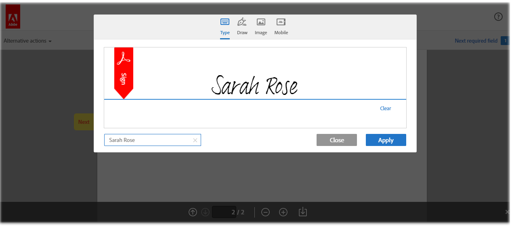

# 직원 채용 참조 사이트 안내 {#employee-recruitment-reference-site-walkthrough}

## 개요 {#overview}

위금융은 후보자가 참고사이트 포털을 통해 취업신청을 할 수 있도록 한 기관이다. 이 조직은 또한 후보자의 면접 일정, 후보 목록, 내부 커뮤니케이션을 관리하기 위해 포털을 사용합니다. 이 사이트에서 관리하는 항목은 다음과 같습니다.

* 일자리를 찾고 지원하는 후보자
* 후보 심사 및 후보 목록
* 인터뷰 프로세스
* 후보 세부 정보 컬렉션
* 후보 배경 확인
* 선택한 후보에 오퍼 롤아웃

>[!NOTE]
>
>직원 채용 사용 사례는 We.Finance 및 We.Gov 참조 사이트 모두에서 사용할 수 있습니다. 연습에 사용된 예제, 이미지 및 설명은 We.Finance 참조 사이트를 사용합니다. 그러나 이러한 사용 사례를 실행하고 We.Gov를 사용하여 아티팩트를 검토할 수 있습니다. 이렇게 하려면 **we-finance** 포함 **we-gov** (이)가 추가되었습니다.

### 관련 워크플로우 모델 {#workflow-models-involved}

직원 채용 사용 사례에는 두 가지 워크플로우가 포함됩니다.

* 면접 전 - We Finance 직원 채용 워크플로우
* 면접 이후 - We Finance Employee Recruiting Post 면접 워크플로우

이러한 워크플로우는 AEM에서 만들어지며 다음에서 찾을 수 있습니다.

`https://[authorHost]:[authorPort]/libs/cq/workflow/admin/console/content/models.html/etc/workflow/models/`

#### We Finance 직원 채용 워크플로우 {#we-finance-employee-recruiting-workflow}

다음은 이 문서에서 따르는 We Finance 직원 채용 워크플로우의 모델입니다.

#### 사원 채용 면접 후 워크플로우에 자금을 조달합니다 {#we-finance-employee-recruiting-post-interview-workflow}

다음은 이 문서에서 따르는 We Finance 사원 사후 면접 채용 워크플로우의 모델입니다.

### 가상 사용자 {#personas}

이 시나리오에는 다음 가상 사용자가 포함됩니다.

* 세라 로즈, 그 조직에서 일자리에 지원하는 후보자
* 존 제이콥스, 채용 담당자
* 글로리아 리오스, 고용 매니저
* John Doe, HR 담당자

## Sarah가 일자리에 지원하다 {#sarah-applies-for-a-job}

Sarah Rose는 그 조직에서 일자리 기회를 찾고 있다. 그녀는 그들의 웹 포털을 방문하여 경력 페이지에 나열된 구인 정보를 조사한다. 그녀는 일치하는 구인 목록을 찾아서 신청한다.

We.Finance 홈 페이지

We.Finance 경력 페이지

Sarah가 구인 공고를 접수하는 것을 클릭합니다. 작업 지원 양식이 열립니다. 그녀는 신청서에 모든 세부 사항을 기재하여 제출한다.

### 작동 방식 {#how-it-works}

We.Finance 홈 페이지와 커리어 페이지는 AEM Sites 페이지입니다. 경력 페이지에는 적응형 양식이 포함되어 있습니다. 이 페이지는 반복 가능한 패널을 사용하여 서비스를 사용하여 구직을 가져오고 페이지에 나열합니다. 다음 위치에서 적응형 양식을 검토할 수 있습니다. `https://[authorHost]:[authorPort]/editor.html/content/forms/af/we-finance/employee/recruitment/jobs.html`.

### 직접 확인 {#see-it-yourself}

다음으로 이동 `https://[publishHost]:[publishPort]/content/we-finance/global/en.html` 및 클릭 **[!UICONTROL 경력]**. 클릭 **[!UICONTROL 검색]** 작업 목록을 채운 다음 **[!UICONTROL 적용]** 일 때문에요 양식에 세부사항을 입력하고 신청서를 제출하세요.

이 연습을 통한 모든 통신이 지정된 이메일 ID로 전송될 때 애플리케이션에 올바른 이메일 ID를 지정해야 합니다.

## 존 제이콥스는 새라 로즈의 고용 매니저 심사 프로필을 후보 명단에 올렸다 {#john-jacobs-shortlists-sarah-rose-s-profile-for-the-hiring-manager-s-screening}

조직은 Sarah가 제출한 Job 지원서를 받습니다. 채용 담당자인 존 제이콥스는 사라의 프로필을 검토하는 임무를 맡게 된다. John은 AEM 받은 편지함에서 작업을 검토하고 작업 요구 사항과 일치하는 프로필을 찾은 다음 요약 목록을 클릭합니다. 새라의 프로필은 그녀의 승인을 위해 고용 매니저, 글로리아 리오스에 전달됩니다.

John의 AEM 받은 편지함

존 제이콥스는 새라 로즈의 고용 매니저 심사 프로필을 후보 명단에 올렸다

**작동 방식**

Job 지원 화면의 제출 작업은 John Jacob의 받은 편지함에서 지원 심사를 위한 작업을 생성하는 워크플로우를 트리거합니다. John이 지원서를 검토하고 목록에 추가하면, 워크플로우가 고용 관리자인 Gloria의 받은 편지함에서 태스크를 생성합니다.

### 직접 확인 {#see-it-yourself-1}

다음으로 이동 `https://[publishHost]:[publishPort]/content/we-finance/global/en/login.html?resource=/aem/inbox.html`및 를 사용하여 John Jacobs에 대한 사용자 이름/암호로 jjacobs/password를 사용하여 로그인합니다. 후보자 프로파일 검토 태스크를 열고 지원자를 목록에 추가합니다.

## 글로리아는 신청서를 검토하고 면접을 위한 지원자를 승인한다 {#gloria-reviews-the-application-and-approves-the-applicant-for-an-interview}

고용 관리자인 글로리아는 AEM 받은 편지함에서 과제로 후보 명단에 올라 있다. 그녀는 그것을 검토하고 사라 로즈 후보가 인터뷰하는 것을 승인한다.

Gloria&#39;s AEM 받은 편지함

글로리아는 사라 로즈가 인터뷰하는 것을 승인한다

**작동 방식**

Gloria가 면접 후보를 승인하면 워크플로우는 We.Finance의 채용 담당자인 John Doe의 AEM 받은 편지함에서 태스크를 생성합니다.

### 직접 확인 {#see-it-yourself-2}

다음으로 이동 `https://[publishHost]:[publishPort]/content/we-finance/global/en/login.html?resource=/aem/inbox.html` 및 를 사용하여 John Jacobs에 대한 사용자 이름/암호로 jjacobs/password를 사용하여 로그인합니다. 후보자 프로파일 검토 태스크를 열고 지원자를 목록에 추가합니다.

다음으로 이동 `https://[publishHost]:[publishPort]/content/we-finance/global/en/login.html?resource=/aem/inbox.html` 그리고 Gloria Rios의 사용자 이름/암호로 grios/password를 사용하여 로그인합니다. 후보자 프로파일 검토 태스크를 열고 면접 스케줄을 누릅니다.

## John Doe는 인터뷰를 예약합니다. {#john-doe-schedules-an-interview}

John Doe는 받은 편지함에서 인터뷰 일정을 잡는 작업을 받습니다. John Doe는 작업을 선택하여 열고 면접 날짜와 시간, 위치 및 면접을 담당하는 HR 담당자를 John Jacob으로 수정합니다. John Doe가 초대 이메일 보내기 를 클릭합니다. Sarah에게 이메일이 발송되고 Sarah를 인터뷰하기 위해 고용 관리자인 Gloria에게 임무가 할당되었다.

John Doe의 AEM 받은 편지함

John Doe는 인터뷰 일정을 잡고 Sarah Rose에게 세부 사항을 전송합니다

## Sarah Rose는 인터뷰 일정이 포함된 이메일을 받습니다 {#sarah-rose-receives-the-email-with-interview-schedule}

Sarah Rose는 인터뷰 일정, 장소 및 기타 세부 정보가 포함된 이메일을 수신합니다. Sarah가 Accept를 클릭하여 인터뷰 일정 및 장소에 이상이 없음을 나타냅니다. 정확한 정보에 의해 안내된 대로, 사라는 인터뷰에 응한다.

Sarah Rose가 인터뷰 일정을 받습니다

## 면접이 끝난 후, 고용 관리자는 사라 로즈를 후보 명단에 올렸다 {#after-the-interviews-the-hiring-manager-shortlists-sarah-rose}

사라 로즈가 면접을 살펴보고 지운 후, 고용 관리자인 글로리아 리오스가 받은 편지함에서 후보자 선택 작업을 열고 선택을 클릭합니다. Gloria Rios의 결정은 추가 처리를 위해 HR 담당자인 John Doe에게 전달됩니다.

Gloria&#39;s AEM 받은 편지함

글로리아 리오스는 인터뷰 후에 사라 로즈를 선택한다

## John Doe가 자세한 정보를 요청합니다. {#john-doe-requests-more-information}

지원자에게 이 조직에 가입하도록 요청하기 전에 사라의 경력을 확인해야 합니다. John Doe는 선택된 지원자의 세부 사항을 열어 검토하고 있으며, 그녀의 취업 및 교육 세부 사항 중 일부가 아직 채워지지 않은 것을 발견합니다. John Doe 클릭 수에 대한 자세한 정보가 필요합니다.

 

John Doe는 Sarah Rose에게 자신의 교육 및 업무 경험에 대한 추가 정보를 요청합니다

## Sarah Rose는 추가 정보를 요청하는 이메일을 수신함 {#sarah-rose-receives-an-email-requesting-further-information}

Sarah Rose는 그녀의 취업 원서 처리에 더 많은 정보가 필요함을 알리는 이메일을 받는다. 이메일에는 필수 정보를 채우기 위한 양식에 대한 링크가 포함되어 있습니다.

Sarah Rose는 자신의 취업 원서 처리에 추가 정보가 필요함을 알리는 이메일을 받는다

Sarah가 이메일의 세부 정보 제공 링크를 클릭합니다. 양식이 나타납니다. Sarah는 John Doe가 요청한 대로 필요한 교육 및 고용 세부 정보를 작성하고 Submit을 클릭합니다.

Sarah가 이메일의 링크를 클릭하여 추가 정보 양식을 엽니다.

Sarah가 John Doe의 요청에 따라 추가 정보를 입력하고 Submit을 클릭합니다.

## John Doe는 제공된 추가 정보에 대해 선택한 후보 프로필을 검토합니다 {#john-doe-reviews-the-selected-candidate-profile-for-the-additional-information-provided}

John Doe가 후보 검토 요청을 선택하여 엽니다. John Doe는 Sarah가 모든 정보를 필요에 따라 채웠다는 것을 알게 됩니다. 애플리케이션을 검토한 후 John Doe가 Approve를 클릭합니다. John Doe의 승인 시 Sarah Rose에 대한 백그라운드 검사 수행 요청이 John Jacobs에게 전달됩니다.

John Doe의 AEM 받은 편지함

John Doe는 Sarah가 제공한 추가 정보를 검토하고 승인합니다

## John Jacobs가 백그라운드 확인 요청을 받았습니다. {#john-jacobs-receives-a-background-check-request}

John Jacobs는 받은 편지함에서 배경 확인 요청을 봅니다. 존 제이콥스는 작업을 열고 사라 로즈가 제공한 정보를 검토한다. 배경 검사를 수행한 후 John Jacobs는 실행 을 클릭하여 배경 검사가 성공했음을 나타냅니다.

John Jacobs의 AEM 받은 편지함

백그라운드 검사를 수행한 후 John Jacobs는 Go Ahead를 클릭합니다.

## John Doe가 Sarah Rose에게 가입 편지를 보냅니다. {#john-doe-sends-out-the-joining-letter-to-sarah-rose}

John Doe는 자신의 AEM 받은 편지함에서 가입 편지를 보내라는 요청을 받습니다. John이 요청을 열고 세부 사항을 확인합니다. John Doe는 가입 편지 PDF을 첨부한 다음 가입 편지 첨부 및 보내기를 클릭합니다.

John Doe의 AEM 받은 편지함

John Doe가 서명을 위한 가입서를 보냅니다.

## Sarah Rose는 입회서를 받고 서명한다 {#sarah-rose-receives-and-signs-the-joining-letter}

Sarah Rose는 서명에 대한 회신을 받는다. Sarah가 여기를 클릭하여 가입 편지를 검토하고 서명합니다. Jointing Letter PDF이 열리고 문서에 서명할 필드가 있습니다.

Sarah Rose는 서명에 대한 가입 편지를 받습니다

Sarah는 타이핑하거나, 손으로 쓰거나, 서명 이미지를 삽입하거나, 모바일 터치스크린을 사용하여 서명을 그리도록 선택할 수 있습니다. Sarah는 자신의 이름을 입력하고 Click To Sign을 클릭한 다음, 가입 편지의 서명된 사본을 다운로드합니다.

Sarah는 가입 편지에 서명하기 위해 그녀의 이름을 입력한다

Sarah가 Click To Sign을 클릭하여 가입 편지 서명을 완료합니다.
