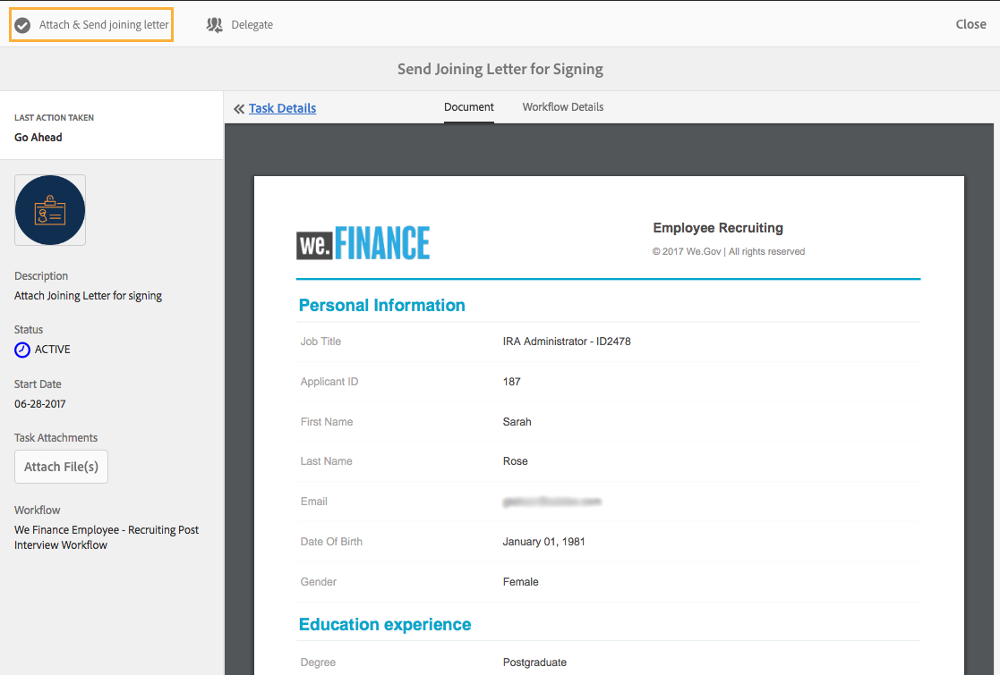

# 직원 채용 참조 사이트 안내 {#employee-recruitment-reference-site-walkthrough}

## 개요 {#overview}

We.Finance는 지원자들이 참조 사이트 포털을 통해 취업을 신청할 수 있는 조직이다. 또한 이 조직은 포털을 이용하여 후보자들의 면접 일정, 적중 및 내부 커뮤니케이션을 관리합니다. 사이트는 다음을 관리합니다.

* 일자리를 검색하고 지원하는 후보
* 후보자 심사 및 낙찰
* 인터뷰 프로세스
* 후보 세부 정보 수집
* 후보 배경 확인
* 선택한 후보자에게 오퍼 롤아웃

>[!NOTE]
>
>사원 채용 사용 사례는 We.Finance 및 We.Gov 참조 사이트 모두에서 사용할 수 있습니다. 연습에서 사용되는 예제, 이미지 및 설명은 We.Finance 참조 사이트를 사용합니다. 그러나 이러한 사용 사례를 실행하고 We.Gov를 사용하여 아티팩트를 검토할 수도 있습니다. 이렇게 하려면 언급된 URL에서 **we-finance** we-gov **로 바꿉니다.**

### 워크플로우 모델 {#workflow-models-involved}

사원 채용 사용 사례에는 두 가지 워크플로우가 포함됩니다.

* 면접 전 - We Finance Employee Recruitment 워크플로우
* 면접 후 - We Finance Employee Recruitment Post Interference 워크플로우

이러한 워크플로우는 AEM에서 만들어지며 다음 위치에서 찾을 수 있습니다.

`https://[authorHost]:[authorPort]/libs/cq/workflow/admin/console/content/models.html/etc/workflow/models/`

#### Adobe 재무 사원 채용 워크플로우 {#we-finance-employee-recruiting-workflow}

다음은 이 문서에 포함된 We Finance Employment 워크플로우의 모델입니다.

#### Adobe Finance Employee Employment Post 인터뷰 작업 과정 {#we-finance-employee-recruiting-post-interview-workflow}

다음은 이 문서의 다음에 나오는 We Finance Employee Post Interference Recruitment 워크플로우의 모델입니다.

### Personas {#personas}

이 시나리오에는 다음 가상 사용자가 포함됩니다.

* 그 조직에 지원했던 후보 사라 로즈
* 모집인 존 제이콥스
* 채용 관리자 글로리아 리오스
* John Doe, HR 담당자

## Sarah가 {#sarah-applies-for-a-job} 작업에 지원함

사라 로즈는 이 조직에서 일자리 기회를 찾고 있다. 그녀는 그들의 웹 포털을 방문하여 직업 페이지에 열거된 구직 사이트를 탐색한다. 그녀는 일치하는 구인 목록을 찾아 신청한다.

We.Finance 홈 페이지

We.Finance 경력 페이지

Sarah가 Job Post에서 Apply를 클릭합니다. 작업 응용 프로그램 양식이 열립니다. 그녀는 신청서에 적힌 모든 세부 사항을 적어 제출한다.

### 작동 방법 {#how-it-works}

We.Finance 홈 페이지와 경력 페이지는 AEM Sites 페이지입니다. 경력 페이지에는 적응형 양식이 포함되어 있습니다. 이 적응형 양식에는 반복 가능한 패널을 사용하여 서비스를 사용하여 일자리 찾기를 가져와 페이지에 나열합니다. `https://[authorHost]:[authorPort]/editor.html/content/forms/af/we-finance/employee/recruitment/jobs.html`에서 적응형 양식을 검토할 수 있습니다.

### 직접 {#see-it-yourself} 보기

`https://[publishHost]:[publishPort]/content/we-finance/global/en.html`(으)로 이동하고 **[!UICONTROL 경력]**&#x200B;을 클릭합니다. **[!UICONTROL 검색]**&#x200B;을 클릭하여 작업 목록을 채운 다음 작업을 보려면 **[!UICONTROL 적용]**&#x200B;을 클릭하십시오. 양식에 세부 사항을 입력하고 애플리케이션을 제출합니다.

이 연습을 통한 통신이 지정된 전자 메일 ID로 전송되므로 응용 프로그램에서 올바른 전자 메일 ID를 지정하도록 하십시오.

## 존 제이콥스는 고용 관리자의 심사 {#john-jacobs-shortlists-sarah-rose-s-profile-for-the-hiring-manager-s-screening}에 대한 사라 로즈의 프로파일을 바로 나열합니다

그 조직은 사라가 제출한 구직 신청서를 받는다. 신병인 존 제이콥스는 사라의 프로필을 검토하기 위한 임무를 맡았다. AEM 받은 편지함에서 작업을 검토하고 작업 요구 사항과 일치하는 프로필을 찾은 다음 바로 가기 목록을 클릭합니다. 사라의 프로필은 고용 매니저인 글로리아 리오스에게 그녀의 승인을 위해 전달되었다.

John의 AEM 받은 편지함

존 제이콥스 회장은 사라 로즈의 채용 담당자 심사 프로필을 바로 나열합니다

**작동 방법**

작업 애플리케이션 양식의 제출 작업은 John Jacob의 받은 편지함에서 응용 프로그램을 스크리닝하는 작업을 생성하는 워크플로우를 트리거합니다. John이 애플리케이션을 검토 및 바로 나열할 때 워크플로우는 Gloria의 받은 편지함에서 작업을 생성합니다.

### 직접 {#see-it-yourself-1} 보기

`https://[publishHost]:[publishPort]/content/we-finance/global/en/login.html?resource=/aem/inbox.html`로 이동하여 John Jacobs의 사용자 이름/암호로 jjacobs/password를 사용하여 로그인합니다. 후보 프로파일 검토 태스크를 열고 지원자를 바로 나열합니다.

## Gloria는 지원서를 검토하고 지원자를 {#gloria-reviews-the-application-and-approves-the-applicant-for-an-interview} 인터뷰에 승인합니다.

고용 관리자인 글로리아는 AEM 받은 편지함에서 바로 나열된 프로파일을 작업에 수신한다. 그녀는 그것을 검토하고, 인터뷰를 위해 사라 로즈를 지지한다.

글로리아의 AEM 받은 편지함

글로리아, 사라 로즈 씨의 인터뷰 승인

**작동 방법**

Gloria가 면접을 위한 후보자를 승인하면, 이 워크플로우는 We.Finance의 모집자인 John Doe의 AEM 받은 편지함에 작업을 생성합니다.

### 직접 {#see-it-yourself-2} 보기

`https://[publishHost]:[publishPort]/content/we-finance/global/en/login.html?resource=/aem/inbox.html` 로 이동하여 John Jacobs의 사용자 이름/암호로 jjacobs/password를 사용하여 로그인합니다. 후보 프로파일 검토 태스크를 열고 지원자를 바로 나열합니다.

`https://[publishHost]:[publishPort]/content/we-finance/global/en/login.html?resource=/aem/inbox.html` 로 이동하여 Gloria Rios의 사용자 이름/암호로 그리오스/암호를 사용하여 로그인합니다. 후보 프로파일 검토 작업을 열고 면접 스케줄을 누릅니다.

## John Doe가 {#john-doe-schedules-an-interview} 인터뷰를 예약합니다.

John Doe는 자신의 받은 편지함에서 인터뷰를 예약하는 임무를 수신합니다. John Doe는 태스크를 선택하고 개설하고 면접 일자 및 시간, 위치, 면접을 담당하는 HR 담당자를 John Jacob으로 수정합니다. John Doe가 초대 이메일 전송을 클릭합니다. 사라에게 이메일이 발송되고, 고용 매니저인 글로리아가 사라를 인터뷰하기 위해 할 일이 할당된다.

John Doe의 AEM 받은 편지함

John Doe는 인터뷰를 예약하고 세부 사항을 Sarah Rose에게 보냅니다

## Sarah Rose가 인터뷰 스케줄 {#sarah-rose-receives-the-email-with-interview-schedule} 이 있는 이메일을 수신합니다.

사라 로즈는 인터뷰 일정, 장소, 그리고 다른 세부 사항들이 담긴 이메일을 받는다. 그녀는 면접 일정과 장소에 대해 괜찮다는 것을 나타내기 위해 수락을 클릭합니다. 정확한 정보에 따라, 사라는 인터뷰에 응한다.

사라 로즈는 인터뷰 일정을 받습니다

## 면접 후 고용 매니저는 사라 로즈 {#after-the-interviews-the-hiring-manager-shortlists-sarah-rose}를 유인해 준다

사라 로즈가 인터뷰를 통해 인터뷰를 지우고 나면, 고용 매니저인 글로리아 리오스는 그녀의 받은 편지함에서 후보자 선택 작업을 열고 선택을 클릭합니다. Gloria Rios의 결정은 추가 처리를 위해 John Doe 인사부 사람에게 전달됩니다.

글로리아의 AEM 받은 편지함

글로리아 리오스는 면접 후에 사라 로즈를 선발한다

## John Doe가 추가 정보 {#john-doe-requests-more-information} 요청

지원자에게 조직에 합류하라고 요구하기 전에, 그녀의 배경을 확인해야 한다. John Doe는 선택된 지원자의 세부 사항을 열고 검토하며, 그녀의 고용 및 교육 세부 사항 중 일부가 아직 채워지지 않은 것을 발견했습니다. John Doe 클릭에 추가 정보가 필요합니다.

 

John Doe는 Sarah Rose로부터 그녀의 교육과 근무 경험에 대해 더 많은 정보를 요청합니다

## Sarah Rose가 추가 정보 {#sarah-rose-receives-an-email-requesting-further-information}를 요청하는 이메일을 받는다

사라 로즈는 그녀의 고용 신청서를 처리하는데 더 많은 정보가 필요하다는 것을 알리는 이메일을 받았다. 이메일에는 필요한 정보를 채우는 데 사용할 수 있는 양식 링크가 포함되어 있습니다.

사라 로즈는 그녀의 고용 신청서를 처리하는데 더 많은 정보가 필요하다는 것을 알리는 이메일을 받았다

Sarah가 이메일에서 세부 정보 제공 링크를 클릭합니다. 양식이 나타납니다. Sarah는 John Doe가 요청한 필수 교육 및 고용 세부 정보를 작성하고 [제출]을 클릭합니다.

Sarah는 이메일의 링크를 클릭하여 추가 정보 양식을 엽니다

Sarah는 John Doe가 요청한 추가 정보를 작성하고 [제출]을 클릭합니다

## John Doe는 제공된 추가 정보에 대해 선택한 후보 프로필을 검토합니다. {#john-doe-reviews-the-selected-candidate-profile-for-the-additional-information-provided}

John Doe는 후보 검토 요청을 선택하고 엽니다. John Doe는 Sarah가 필요에 따라 모든 정보를 채웠음을 알게 됩니다. 애플리케이션을 검토한 후 John Doe가 승인 을 클릭합니다. 존 도어의 승인을 받아, 사라 로즈에 대한 신원 확인을 수행하는 요청은 존 제이콥스에게 전달됩니다.

John Doe의 AEM 받은 편지함

John Doe는 Sarah가 제공하는 추가 정보를 검토하고 승인합니다

## John Jacobs가 백그라운드 확인 요청 {#john-jacobs-receives-a-background-check-request} 을 수신합니다.

John Jacobs는 그의 받은 편지함에서 배경 확인 요청을 봅니다. 존 제이콥스는 이 일을 열어 사라 로즈가 제공한 정보를 검토한다. 백그라운드 검사를 수행한 후 John Jacobs가 Go Ahead를 클릭하여 배경 확인이 성공했음을 나타냅니다.

존 제이콥스의 AEM 받은 편지함

백그라운드 검사를 수행한 후 John Jacobs는 Go Ahead를 클릭합니다

## John Doe가 Sarah Rose {#john-doe-sends-out-the-joining-letter-to-sarah-rose}(으)로 합격 편지를 보냅니다.

John Doe는 AEM 받은 편지함에서 조인 편지를 전송하기 위한 요청을 받습니다. John이 요청을 열고 세부 사항을 봅니다. John Doe는 조인 문자 PDF를 첨부한 다음 연결 및 전송 조인 편지를 클릭합니다.

John Doe의 AEM 받은 편지함

John Doe가 서명을 위해 조인 편지를 보냅니다.

## Sarah Rose가 합격 문자 {#sarah-rose-receives-and-signs-the-joining-letter}를 수신하고 서명합니다.

사라 로즈는 서명하기 위해 합격 편지를 받았다. Sarah가 가입 편지를 검토하고 서명하기 위해 여기를 클릭하다. 조인 문자 PDF가 문서에 서명할 필드가 있는 열립니다.

새라 로즈는 서명하기 위해 합격 편지를 받는다

사라는 자신의 서명을 그리기 위해 타이핑을 하거나, 손으로 쓰거나, 서명 이미지를 삽입하거나, 모바일의 터치스크린을 사용하여 서명을 그릴 수 있다. Sarah는 이름을 입력하고 [Click To Sign]을 클릭한 다음 조인된 편지의 서명된 사본을 다운로드합니다.

Sarah는 그녀의 이름을 입력하여 그 합격 편지에 서명한다

Sarah를 클릭하여 서명 편지 서명을 완료합니다
