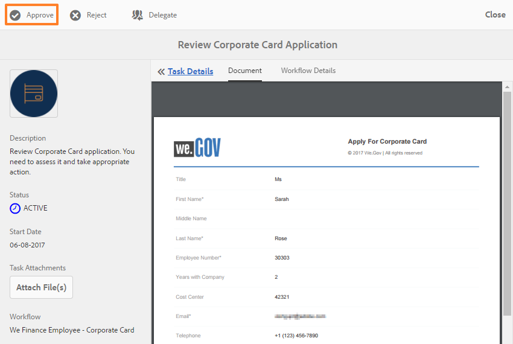
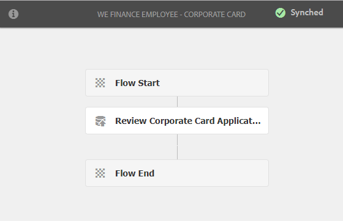

# 직원 셀프 서비스 참조 사이트 연습{#employee-self-service-reference-site-walkthrough}

## 전제 조건 {#prerequisite}

AEM Forms 참조 사이트 설정 [및 구성에 설명된 대로 참조 사이트를](../../forms/using/setup-reference-sites.md)설정합니다.

## 개요 {#overview}

일반적으로 회사 인트라넷에서 호스팅되는 직원 셀프 서비스 시스템은 직원들이 사무실에서 사용할 수 있는 다양한 정보와 서비스를 이용할 수 있도록 합니다. 종업원에게 고용 세부 정보에 액세스, 휴가 신청, 지출 보고서 제출과 같은 작업을 수행할 수 있는 권한을 부여하고 이를 철저하게 통제한다. 이와 반대로, 조직은 처리 과정의 효율을 높이고 비용을 절감하면서 직원에게 정보를 제공하고 참여를 유도할 수 있습니다.

직원 셀프 서비스 참조 사이트는 AEM Forms를 활용하여 조직에서 직원 셀프 서비스 시스템을 구현하는 방법을 보여줍니다.

>[!NOTE]
>
>직원 셀프 서비스 연습에서 사용되는 예제, 이미지 및 설명은 We.Finance 참조 사이트를 사용합니다.

## 이해도 설문지 충돌 연습 {#conflict-of-interest-questionnaire-walkthrough}

조직은 수시로 직원들에게 이해의 상충 설문지 제출을 요청하여 외부 활동이나 자신의 조직과 충돌할 수 있는 종업원의 개인적 관계를 파악한다.

사라의 조직의 규정 준수 부서는 직원들에게 이해의 상충 설문지를 제출해 줄 것을 요청했다.

### 사라는 이해의 상충 설문지를 제출한다 {#sarah-submits-the-conflict-of-interest-questionnaire}

Sarah는 조직의 포털에 가서 로그인하고 Employee를 클릭하여 직원 대시보드에 액세스합니다. 직원 대시보드에서 이해의 상충 질문서를 찾은 다음 적용을 **[!UICONTROL 클릭합니다]**.

조직 포털

직원 대시보드

Sarah는 [다음] 단추를 사용하여 양식을 탐색하고 [소개] 및 [정의] 섹션을 읽어 봅니다. 질문 섹션의 질문에 응답합니다. 마침내, 그녀는 서명하고 설문지를 제출한다.

조직 포털 및 설문지는 응답 속도가 빠르고 모바일에 적합합니다. 다음 워크플로우는 Sarah가 모바일 장치에서 어떻게 탐색하여 설문 조사를 제출하는지를 보여줍니다.

**작동 방식**

조직 포털 및 직원 대시보드는 AEM Sites 페이지입니다. 대시보드에는 이해의 상충 질서와 같은 여러 가지 셀프 서비스 옵션이 나열됩니다. 적용 단추는 적응형 양식에 연결됩니다.

적응형 양식에서는 규칙을 사용하여 [질문] 탭에 제공된 답변을 기반으로 정보를 표시합니다. 또한 이 양식에서는 자유 작성 구성 요소를 사용하여 선언 탭에서 서명합니다. 적응형 양식을 검토합니다. `https://[authorHost]:[authorPort]/editor.html/content/forms/af/we-finance/employee/self-service/conflict-of-interest.html`.

**직접 보기**

Sarah의 사용자 이름/ `https://[publishHost]:[publishPort]/content/we-finance/global/en/self-service-forms.html` 암호로 이동하여 `srose/srose` 로그인합니다. 직원을 **[!UICONTROL 클릭하여]** 대시보드에 액세스한 다음 이해의 상충 **** 질서에서 적용을 클릭합니다. 설문지를 검토하고 제출합니다.

#### Gloria, Conflict of Interest 질문서 제출 검토 및 승인 {#gloria-reviews-and-approves-the-conflict-of-interest-questionnaire-submission}

사라가 제출한 이해의 상충 설문지는 글로리아 리오스 씨에게 검토를 위해 배정되었다. Gloria는 조직에서 특별 감사 요원으로 일한다. Gloria는 AEM 받은 편지함에 로그인하고 할당된 작업을 검토합니다. 그녀는 사라가 제출한 설문지를 승인하고 그 일을 완성했다.

글로리아의 받은 편지함

작업 열기

**작동 방식**

이해의 상충 질문의 제출 작업은 승인을 위해 Gloria의 받은 편지함에서 작업을 만드는 워크플로우를 트리거합니다. 양식 워크플로우 검토 `https://[authorHost]:[authorPort]/editor.html/conf/global/settings/workflow/models/we-finance/employee/self-service/we-finance-employee-conflict-of-interest.html`

**직접 보기**

Gloria Rios의 사용자 이름/ `https://[publishHost]:[publishPort]/content/we-finance/global/en/login.html?resource=/aem/inbox.html` `grios/password` 암호로 이동하여 로그인합니다. 이해의 상충 질문서를 위해 생성된 작업을 열고 승인합니다.

## 법인 카드 응용 프로그램 연습 {#corporate-card-application-walkthrough}

사라는 출장을 많이 다니기 때문에 이사할 때 법인 신용카드를 지불해야 한다. 그녀는 회사의 직원 포털을 통해 법인 카드를 신청한다.

### 사라는 법인 카드 신청서를 제출한다 {#sarah-submits-the-corporate-card-application}

Sarah는 조직의 포털로 가서 로그인한 다음 Employee **[!UICONTROL 를]** 클릭하여 직원 대시보드에 액세스합니다. 직원 대시보드에서 법인 카드 애플리케이션을 찾아 적용을 **[!UICONTROL 클릭합니다]**.

조직 포털

직원 대시보드

그녀는 법인 **[!UICONTROL 카드]** 신청서를 클릭한다. 단일 페이지 애플리케이션이 열립니다. 모든 세부 사항을 채우고 적용을 클릭하여 **[!UICONTROL 애플리케이션을]** 제출합니다.

**작동 방식**

조직 포털 및 직원 대시보드는 AEM Sites 페이지입니다. 대시보드에는 법인 카드 응용 프로그램과 같은 여러 가지 셀프 서비스 옵션이 나열됩니다. 응용 프로그램의 [적용] 단추는 응용 양식에 연결됩니다.

기업 카드 애플리케이션에 대한 적응형 양식은 간단하고 한 페이지 분량의 응답형 양식입니다. 텍스트, 전화, 숫자 상자 및 숫자 스테퍼와 같은 기본 적응형 양식 구성 요소를 사용합니다. 적응형 양식 검토 위치:\
`https://[authorHost]:[authorPort]/editor.html/content/forms/af/we-finance/employee/self-service/corporate-card.html`.

**직접 보기**

Sarah의 사용자 이름/ `https://[publishHost]:[publishPort]/content/we-finance/global/en/self-service-forms.html` 암호로 이동하여 `srose/srose` 로그인합니다. 직원을 **[!UICONTROL 클릭하여]** 대시보드에 액세스한 다음 법인 카드 **[!UICONTROL 애플리케이션에서 적용을]** 클릭합니다. 세부 사항을 채우고 신청서를 제출합니다.

### Gloria가 회사 카드 신청서를 검토하고 승인함 {#gloria-reviews-and-approves-the-corporate-card-application}

사라가 제출한 법인 카드 신청서는 글로리아 리오스 씨에게 검토를 위해 보내진다. Gloria는 AEM 받은 편지함에 로그인하고 할당된 작업을 검토합니다. 그녀는 새라가 제출한 지원서를 승인하고 그 일을 완성했다.

글로리아의 받은 편지함

작업 열기

**작동 방식**

법인 카드 애플리케이션의 제출 워크플로우는 승인을 위해 Gloria의 받은 편지함에 작업을 만드는 양식 워크플로우를 트리거합니다. 양식 워크플로우 검토 `https://[authorHost]:[authorPort]/editor.html/conf/global/settings/workflow/models/we-finance/employee/self-service/we-finance-employee-corporate-card.html`

**직접 보기**

Gloria Rios의 사용자 이름/ `https://[publishHost]:[publishPort]/content/we-finance/global/en/login.html?resource=/aem/inbox.html` `grios/password` 암호로 이동하여 로그인합니다. 회사 카드 응용 프로그램에 대해 만든 작업을 열고 승인합니다.

## 비용 보고서 제출 연습 {#expense-report-submission-walkthrough}

사라는 출장 중에 소비하므로, 승인을 위해 지출 보고서를 제출해야 한다. 그녀의 조직의 셀프 서비스 옵션을 통해 그녀는 비용 보고서를 온라인으로 제출할 수 있다.

### 사라는 지출 보고서 신청서를 제출한다 {#sarah-submits-the-expense-report-application}

Sarah는 조직의 포털로 가서 로그인한 다음 Employee **[!UICONTROL 를]** 클릭하여 직원 대시보드에 액세스합니다. 직원 대시보드에서 지출 보고서 애플리케이션을 찾아 적용을 **[!UICONTROL 클릭합니다]**.

조직 포털

직원 대시보드

그녀는 지출 **[!UICONTROL 보고서]** 애플리케이션에 적용을 클릭합니다. 보고서 이름과 보고서 세부 정보 탭 두 개가 있는 애플리케이션 양식이 열립니다. 보고서 세부 사항 탭의 **+** 아이콘을 사용하면 한 보고서에서 더 많은 비용을 추가할 수 있습니다.

조직 포털 및 애플리케이션은 반응형 및 모바일에 적합합니다. 다음 워크플로우는 Sarah가 모바일 장치에서 어떻게 탐색하고 지출 보고서를 제출하는지를 보여줍니다.

**작동 방식**

조직 포털 및 직원 대시보드는 AEM Sites 페이지입니다. 대시보드에는 비용 보고서 애플리케이션과 같은 여러 가지 셀프 서비스 옵션이 나열됩니다. 적용 단추는 적응형 양식에 연결됩니다.

응용 양식의 보고서 이름 및 보고서 세부 사항 탭은 패널 구성 요소입니다. [보고서 세부 사항] 패널에는 비용 패널이 있습니다. 보고서에서 여러 비용을 추가할 수 있는 반복 가능한 패널입니다. 적응형 양식 및 구성을 에서 검토합니다 `https://[authorHost]:[authorPort]/editor.html/content/forms/af/we-finance/employee/expense-report.html`.

**직접 보기**

Sarah의 사용자 이름/ `https://[publishHost]:[publishPort]/content/we-finance/global/en/self-service-forms.html` 암호로 이동하여 `srose/srose` 로그인합니다. 직원을 **[!UICONTROL 클릭하여]** 대시보드에 액세스한 다음 비용 보고서 **[!UICONTROL 애플리케이션에서 적용을]** 클릭합니다. 세부사항을 작성하고 신청서를 제출합니다.

### 글로리아는 지출 보고서를 검토하고 승인한다 {#gloria-reviews-and-approves-the-expense-report}

사라가 제출한 지출 보고서는 글로리아 리오스 씨에게 검토를 위해 배정되었다. Gloria는 AEM 받은 편지함에 로그인하고 할당된 작업을 검토합니다. 그녀는 새라가 제출한 지원서를 승인하고 그 일을 완성했다.

글로리아의 받은 편지함

작업 열기

**작동 방식**

비용 보고서 애플리케이션의 제출 워크플로우는 승인을 위해 Gloria의 받은 편지함에 작업을 만드는 양식 워크플로우를 트리거합니다. 양식 워크플로우 검토 `https://[authorHost]:[authorPort]/editor.html/conf/global/settings/workflow/models/we-finance/employee/self-service/we-finance-employee-expense-report-workflow.html`

**직접 보기**

Gloria Rios의 사용자 이름/ `https://[publishHost]:[publishPort]/content/we-finance/global/en/login.html?resource=/aem/inbox.html` `grios/password` 암호로 이동하여 로그인합니다. 지출 보고서 애플리케이션에 대해 생성된 작업을 열고 승인합니다.

## 애플리케이션 연습 종료 {#leave-application-walkthrough}

사라는 다음 달에 가족 휴가를 계획하고 있으며 일주일 휴가를 신청하려고 한다.

### 사라는 휴가 신청서를 제출한다 {#sarah-submits-the-leave-application}

Sarah는 조직의 포털로 가서 로그인한 다음 Employee **[!UICONTROL 를]** 클릭하여 직원 대시보드에 액세스합니다. 직원 대시보드에서 leave 애플리케이션을 찾아 적용을 **[!UICONTROL 클릭합니다]**.

조직 포털

직원 대시보드

Sarah의 이름과 직원 ID가 양식에 미리 입력되어 있는 휴가 신청이 열립니다. 그것은 또한 그녀의 휴가 균형과 역사를 표시합니다. 그녀는 휴가 세부 사항을 작성하고 승인을 위해 신청서를 제출한다.

조직 포털 및 애플리케이션은 반응형 및 모바일에 적합합니다. 다음 워크플로우에서는 Sarah가 모바일 장치에서 응용 프로그램을 탐색하여 제출하는 방법을 보여 줍니다.

**작동 방식**

조직 포털 및 직원 대시보드는 AEM Sites 페이지입니다. 대시보드에는 leave 응용 프로그램과 같은 여러 가지 셀프 서비스 옵션이 나열됩니다. 적용 단추는 적응형 양식에 연결됩니다.

leave 애플리케이션에 대한 적응형 양식은 직원 휴가 양식 데이터 모델을 기반으로 합니다. 왼쪽 균형 섹션에서 왼쪽 균형 테이블은 양식 데이터 모델 서비스를 사용하여 `getLeavesOf` 채워집니다. 시작 및 종료 날짜 필드는 규칙을 사용하여 날짜 값이 현재 날짜 이후인지 확인합니다. 종료 기간은 `calcBusinessDays` 함수를 사용하여 계산됩니다.

다음 위치에서 적응형 양식과 양식 데이터 모델을 검토할 수 있습니다.

`https://[authorHost]:[authorPort]/editor.html/content/forms/af/we-finance/employee/self-service/leave-application.html`

`https://[authorHost]:[authorPort]/aem/fdm/editor.html/content/dam/formsanddocuments-fdm/db`

**직접 보기**

Sarah의 사용자 이름/ `https://[publishHost]:[publishPort]/content/we-finance/global/en/self-service-forms.html` 암호로 이동하여 `srose/srose` 로그인합니다. 직원을 **[!UICONTROL 클릭하여]** 대시보드에 액세스한 다음 애플리케이션에서 **[!UICONTROL 적용을]** 클릭합니다. 세부사항을 작성하고 신청서를 제출합니다.

#### Gloria는 휴가 신청을 검토하고 승인합니다. {#gloria-reviews-and-approves-the-leave-application}

사라가 제출한 휴가 신청은 글로리아 리오스 씨에게 검토를 하도록 배정되었다. Gloria는 AEM 받은 편지함에 로그인하고 할당된 작업을 검토합니다. 그녀는 새라가 제출한 지원서를 승인하고 그 일을 완성했다.

글로리아의 받은 편지함

작업 열기

**작동 방식**

leave 애플리케이션의 제출 워크플로우는 승인을 위해 Gloria의 받은 편지함에 작업을 만드는 양식 워크플로우를 트리거합니다. 양식 워크플로우 검토 `https://[authorHost]:[authorPort]/editor.html/conf/global/settings/workflow/models/we-finance/employee/self-service/we-finance-employee-leave-application.html`

**직접 보기**

Gloria Rios의 사용자 이름/ `https://[publishHost]:[publishPort]/content/we-finance/global/en/login.html?resource=/aem/inbox.html` `grios/password` 암호로 이동하여 로그인합니다. Leave 애플리케이션을 위해 만든 작업을 열고 승인합니다.
