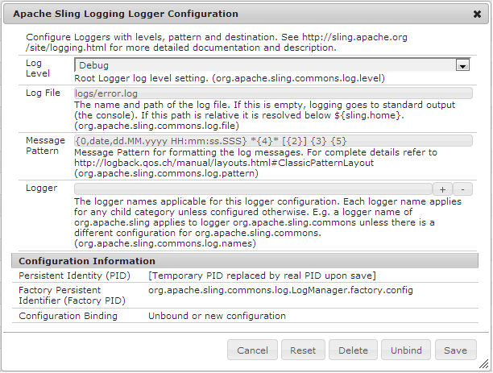

# HTML5 양식에 대한 로깅 활성화{#enable-logging-for-html-forms}

로거 유틸리티를 구성하여 HTML5 양식에 대한 로그 생성을 시작할 수 있습니다. 로거 유틸리티에는 다양한 수준이 있으므로 요구 사항에 따라 레벨을 설정할 수 있습니다. HTML5 양식에는 서버 및 클라이언트 구성 요소가 있습니다. 두 구성 요소에 대한 로그를 구성할 수 있습니다.

## 서버측 로깅 구성 {#configuring-server-side-logging}

서버측 로그를 구성하려면 다음 단계를 수행하십시오.

1. 이동 `https://'[server]:[port]'/system/console/configMgr`. *Apace 로깅 로거 구성* 옵션을 찾아 엽니다. 대화 상자가 나타납니다:

   

   Apace Sling 로깅 로거 구성 옵션

1. **로그 수준**&#x200B;을 **디버그**&#x200B;로 변경합니다.

1. **로그 파일**&#x200B;의 이름과 경로를 지정합니다.

   >[!NOTE]
   >
   >HTML5 양식 로그 디렉토리에 로그를 생성하려면 파일 이름 앞에 ../logs/를 추가합니다.

1. **Logger**&#x200B;을 **HTMLFormsPerfLogger**&#x200B;로 변경합니다. **저장**&#x200B;을 클릭합니다.

## 클라이언트 로깅 구성 {#configuring-client-logging}

다음 방법을 사용하여 HTML5 양식에 클라이언트측 로깅을 활성화할 수 있습니다.

* `log` 요청 매개 변수 사용
* CQ 구성 관리자 사용

### 요청 매개 변수 {#enabling-logging-using-request-parameter}을(를) 사용하여 로깅 활성화

이 방법을 사용하면 특정 요청에 대한 로그를 생성할 수 있습니다. 요청 매개 변수의 이름은 &#39;log입니다. 로그 URL은 다음과 같습니다.

`https://<server>:<port>/content/xfaforms/profiles/test.html?contentRoot=<path of the folder containing form xdp>&template=<name of the xdp>&log=<log configuration>.`

로그 구성은 로그 레벨 및 로거 범주로 구성됩니다.

#### 로그 대상 {#log-destination}

<table>
 <tbody>
  <tr>
   <th><strong>로그 대상</strong></th>
   <th><strong>설명</strong></th>
  </tr>
  <tr>
   <td>1</td>
   <td>로그는 브라우저 <strong>콘솔</strong>로 전달됩니다.</td>
  </tr>
  <tr>
   <td>2</td>
   <td>로그는 클라이언트 쪽의 JavaScript 개체에서 수집되며 <strong>Server</strong>에 게시할 수 있습니다. </td>
  </tr>
  <tr>
   <td>3</td>
   <td>위의 옵션 모두  </td>
  </tr>
 </tbody>
</table>

#### 로그 수준 {#log-levels}

<table>
 <tbody>
  <tr>
   <th>로그 수준</th>
   <th>설명</th>
  </tr>
  <tr>
   <td>0</td>
   <td>끔  </td>
  </tr>
  <tr>
   <td>1</td>
   <td>FATAL  </td>
  </tr>
  <tr>
   <td>2</td>
   <td>오류  </td>
  </tr>
  <tr>
   <td>3</td>
   <td>경고  </td>
  </tr>
  <tr>
   <td>4</td>
   <td>정보  </td>
  </tr>
  <tr>
   <td>5</td>
   <td>디버그  </td>
  </tr>
  <tr>
   <td>6</td>
   <td>TRACE  </td>
  </tr>
  <tr>
   <td>7</td>
   <td>모두  </td>
  </tr>
 </tbody>
</table>

#### 로거 범주 {#logger-categories}

<table>
 <tbody>
  <tr>
   <th>로그 범주</th>
   <th>설명</th>
  </tr>
  <tr>
   <td>관리</td>
   <td>xfa(스크립팅 엔진 관련 로그)</td>
  </tr>
  <tr>
   <td>b</td>
   <td>xfaView (레이아웃 엔진 관련 로그)  </td>
  </tr>
  <tr>
   <td>c</td>
   <td>xfaPerf(성능 관련 로그)  </td>
  </tr>
 </tbody>
</table>

#### 로그 구성 {#log-configuration}

로그 URL에서 로그 구성 쿼리 문자열 매개 변수는 다음과 같이 정의됩니다.

`{destination}-{a level}-{b level}-{c level}`

예:

<table>
 <tbody>
  <tr>
   <th>로그 구성</th>
   <th>설명</th>
  </tr>
  <tr>
   <td>2-a4-b5-c6  </td>
   <td>대상:서버  xfa 수준:INFO  xfaView 수준:디버그  xfaPerf 수준:TRACE</td>
  </tr>
 </tbody>
</table>

>[!NOTE]
>
>각 로그 카테고리 a(xfa), b(xfaView) 및 c(xfaPerf)에 대한 기본 로그 수준은 2입니다(오류). 따라서 로그 구성의 경우:2-b6, 다른 카테고리에 대한 로그 수준은 다음과 같습니다.
>a (xfa):2(기본 레벨 오류)
>b(xfaView):6(사용자 지정 TRACE)
>a (xfaPerf):2(기본 레벨 오류)

### 구성 관리자 {#enabling-logging-using-configuration-manager}을(를) 사용하여 로깅 활성화

로깅을 활성화하는 데 Configuration Manager를 사용하는 경우 로깅이 다시 비활성화될 때까지 모든 렌더링 요청에 대해 로그가 생성됩니다.

1. `https://'[server]:[port]'/system/console/configMgr`에 CQ 구성 관리자에 로그인하고 관리자 자격 증명으로 로그인합니다.
1. **모바일 Forms 구성**&#x200B;을 검색하고 클릭합니다.
1. [디버그 옵션] 텍스트 상자에 이전 섹션에 설명된 대로 로그 구성을 입력합니다(예: **2-a4-b5-c6**).

   

   양식 구성

## 로그 업로드 중 {#uploading-logs}

대상이 1로 설정된 경우 모든 클라이언트 스크립트 로그 메시지가 콘솔로 전달됩니다. 관리자가 서버 로그와 함께 이러한 로그를 필요로 하는 경우 대상 수준을 2로 설정합니다. 이 수준에서는 모든 로그가 클라이언트 쪽의 JS 개체에 수집되며, 양식이 기본 프로필로 렌더링되면 도구 모음의 **기존 필드 강조 표시** 단추 왼쪽에 **로그 보내기** 단추가 나타납니다. 사용자가 링크를 클릭하면 수집된 모든 로그가 서버에 게시되고 서버의 구성된 오류 로그 파일에 기록됩니다.

기본적으로 모든 정보는 /crx-repository/logs/ 디렉토리의 error.log 파일에 추가됩니다.

로그 파일의 위치와 이름을 변경하려면 다음을 수행합니다.

1. Configuration Manager에 관리자로 로그인합니다. 구성 관리자의 기본 URL은 `https://'[server]:[port]'/system/console/configMgr`입니다.
1. **Apache Sling 로깅 로거 구성**&#x200B;을 클릭합니다. 대화 상자가 나타납니다.

   

1. **로그 수준**&#x200B;을 디버그로 변경합니다.

1. **로그 파일**&#x200B;의 경로와 이름을 지정합니다.

   >[!NOTE]
   >
   >다른 로그 파일이 보관되는 동일한 디렉토리에 로그를 만들려면 [로그 파일] 속성에 ../logs/&lt;filename>을 지정합니다.

1. **Logger**&#x200B;를 **HTMLFormsPerfLogger**&#x200B;로 변경하고 **저장**&#x200B;을 클릭합니다.
