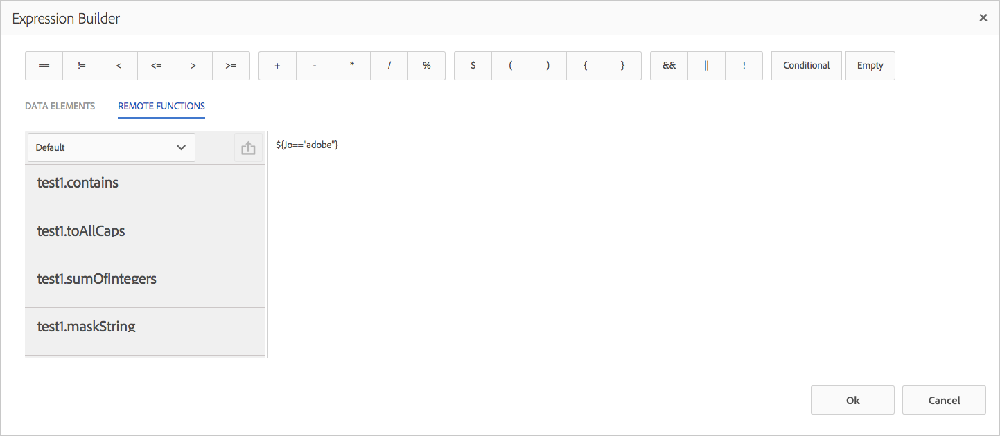

# 표현식 빌더{#remote-functions-in-expression-builder}의 원격 함수

표현식 빌더를 사용하여 데이터 사전 또는 최종 사용자가 제공하는 데이터 값에 대한 계산을 수행하는 표현식 또는 조건을 만들 수 있습니다. 통신 관리는 표현식 평가 결과를 사용하여 텍스트, 이미지, 목록 및 조건과 같은 자산을 선택하고 필요에 따라 통신문에 삽입합니다.

## 표현식 빌더 {#creating-expressions-and-remote-functions-with-expression-builder}을(를) 사용하여 표현식 및 원격 함수 만들기

표현식 빌더는 내부적으로 JSP EL 라이브러리를 사용하므로 표현식은 JSPEL 구문을 따릅니다. 자세한 내용은 [표현식 예](#exampleexpressions)를 참조하십시오.


### 연산자 {#operators}

표현식에 사용할 수 있는 연산자는 표현식 빌더의 맨 위 막대에 있습니다.

### 표현식 {#exampleexpressions} 예

다음은 Correspondence Management 솔루션에서 사용할 수 있는 몇 가지 일반적인 JSP EL 예입니다.

* 2개의 숫자를 추가하려면:${number1 + number2}
* 두 문자열을 연결하려면:${str1} ${str2}
* 두 숫자를 비교하려면${age &lt; 18}

[JSP EL 사양](https://download.oracle.com/otn-pub/jcp/jsp-2.1-fr-spec-oth-JSpec/jsp-2_1-fr-spec-el.pdf)에서 자세한 정보를 찾을 수 있습니다. 클라이언트측 표현식 관리자는 JSP EL 사양의 특정 변수와 함수를 지원하지 않습니다. 특히 다음과 같습니다.

* 클라이언트 측에서 평가되는 표현식의 변수 이름에는 컬렉션 인덱스 및 매핑 키([] 표기법 사용)가 지원되지 않습니다.
* 다음은 표현식에 사용되는 함수의 매개 변수 유형 또는 반환 유형입니다.

   * java.lang.String
   * java.lang.Character
   * 문자
   * java.lang.Boolean
   * 부울
   * java.lang.Integer
   * Int
   * java.util.list
   * java.lang.Short
   * Short
   * java.lang.Byte
   * byte
   * java.lang.Double
   * 더블
   * java.lang.Long
   * 긴
   * java.lang.Float
   * 부동
   * java.util.Calendar
   * java.util.Date
   * java.util.List

### 원격 함수 {#remote-function}

원격 함수는 표현식에서 사용자 지정 논리를 사용하는 기능을 제공합니다. 표현식에서 Java의 메서드로 사용할 사용자 지정 논리를 작성할 수 있으며 표현식에서 동일한 함수를 사용할 수 있습니다. 사용 가능한 원격 함수는 표현식 편집기 왼쪽의 &quot;원격 함수&quot; 탭 아래에 나열됩니다.



#### 사용자 지정 원격 함수 {#adding-custom-remote-functions} 추가

사용자 지정 번들을 만들어 표현식 내에서 사용할 원격 기능을 직접 내보낼 수 있습니다. 고유한 원격 기능을 내보낼 사용자 지정 번들을 만들려면 다음 작업을 수행하십시오. 입력 문자열을 대문자로 지정하는 사용자 지정 함수를 작성하는 방법을 보여 줍니다.

1. 표현식 관리자에서 사용하도록 내보내는 메서드가 포함된 OSGi 서비스의 인터페이스를 정의합니다.
1. 인터페이스 A에서 메서드를 선언하고 @ServiceMethod 주석(com.adobe.exm.expeval.ServiceMethod)을 사용하여 메서드에 주석을 답니다. Expression Manager는 주석 없는 메서드를 무시합니다. ServiceMethod 주석에는 지정할 수 있는 다음과 같은 선택적 속성이 있습니다.

   1. **사용**:이 메서드가 활성화되었는지 확인합니다. 표현식 관리자에서 비활성화된 메서드를 무시합니다.
   1. **familyId**:메서드의 패밀리(그룹)를 지정합니다. 비어 있으면 표현식 관리자에서 해당 메서드가 기본 패밀리에 속한다고 가정합니다. 기능이 선택된 패밀리의 레지스트리가 없습니다(기본 레지스트리를 제외한). Expression Manager는 다양한 번들에서 내보낸 모든 함수에서 지정한 모든 패밀리 ID의 결합을 통해 레지스트리를 동적으로 만듭니다. 표현식 작성 사용자 인터페이스도 표시되므로 여기에서 지정하는 ID가 읽기 적절한지 확인합니다.
   1. **displayName**:함수의 읽을 수 있는 이름입니다. 이 이름은 작성 사용자 인터페이스에서 표시 목적으로 사용됩니다. 비어 있으면 표현식 관리자에서 함수의 접두사와 로컬 이름을 사용하여 기본 이름을 만듭니다.
   1. **설명**:함수에 대한 자세한 설명입니다. 이 설명은 작성 사용자 인터페이스에서 표시 용도로 사용됩니다. 비어 있으면 표현식 관리자에서 함수의 접두사와 로컬 이름을 사용하여 기본 설명을 생성합니다.

   ```java
   package mergeandfuse.com;
   import com.adobe.exm.expeval.ServiceMethod;
   
   public interface RemoteFunction {
    @ServiceMethod(enabled=true,displayName="Returns_all_caps",description="Function to convert to all CAPS", familyId="remote")
    public String toAllCaps(String name);
   
   }
   ```

   메서드의 매개 변수에 @ServiceMethodParameter 주석(com.adobe.exm.expeval.ServiceMethodParameter)을 사용하여 선택적으로 주석을 달 수도 있습니다. 이 주석은 작성 사용자 인터페이스에서 사용할 메서드 매개 변수에 대한 설명 및 사람이 읽을 수 있는 이름을 지정하는 데에만 사용됩니다. 인터페이스 메서드의 매개 변수와 반환 값이 다음 유형 중 하나에 속하는지 확인합니다.

   * java.lang.String
   * java.lang.Character
   * 문자
   * java.lang.Boolean
   * 부울
   * java.lang.Integer
   * Int
   * java.lang.Short
   * Short
   * java.lang.Byte
   * byte
   * java.lang.Double
   * 더블
   * java.lang.Long
   * 긴
   * java.lang.Float
   * 부동
   * java.util.Calendar
   * java.util.Date
   * java.util.List


1. 인터페이스 구현을 정의하고 OSGI 서비스로 구성하고 다음 서비스 속성을 정의합니다.

```jsp
@org.apache.felix.scr.annotations.Properties({
  @org.apache.felix.scr.annotations.Property(name = "connectors.jsoninvoker", boolValue = true),
  @org.apache.felix.scr.annotations.Property(name = "connectors.jsoninvoker.alias", value = "<service_id>"),
  @org.apache.felix.scr.annotations.Property(name = "exm.service", boolValue = true)})
```

exm.service=true 항목은 표현식 관리자에게 서비스에 표현식에 사용하기 적합한 원격 함수가 들어 있다고 알립니다. &lt;service_id> 값은 유효한 Java 식별자(영숫자,$, _ 및 다른 특수 문자 없음)여야 합니다. REMOTE_ 키워드가 접두사로 붙은 이 값은 표현식 내에 사용되는 접두어를 형성합니다. 예를 들어, REMOTE_foo:bar()를 사용하여 서비스 속성에 주석을 단 메서드 bar()와 서비스 ID가 포함된 인터페이스를 표현식 내에서 참조할 수 있습니다.

```java
package mergeandfuse.com;

import org.apache.felix.scr.annotations.Component;
import org.apache.felix.scr.annotations.Service;

@Component(metatype = true, immediate = true, label = "RemoteFunctionImpl")
@Service(value = RemoteFunction.class)
@org.apache.felix.scr.annotations.Properties({
  @org.apache.felix.scr.annotations.Property(name = "connectors.jsoninvoker", boolValue = true),
  @org.apache.felix.scr.annotations.Property(name = "connectors.jsoninvoker.alias", value = "test1"),
  @org.apache.felix.scr.annotations.Property(name = "exm.service", boolValue = true)})
public class RemoteFuntionImpl implements RemoteFunction {

 @Override
 public String toAllCaps(String name) {
  System.out.println("######Got######"+name);
  
  return name.toUpperCase();
 }
 
}
```

다음은 사용할 샘플 보관 파일입니다.

* **GoodFunctions.jar.zip** 은 샘플 원격 함수 정의가 포함된 번들이 포함된 jar 파일입니다. GoodFunctions.jar.zip 파일을 다운로드하고 압축을 해제하여 jar 파일을 가져옵니다.
* **GoodFunctions.** zip 사용자 지정 원격 함수를 정의하고 이에 대한 번들을 만들기 위한 소스 코드 패키지입니다.

GoodFunctions.jar.zip

[파일 가져오기](assets/goodfunctions.jar.zip)

GoodFunctions.zip

[파일 가져오기](assets/goodfunctions.zip)
