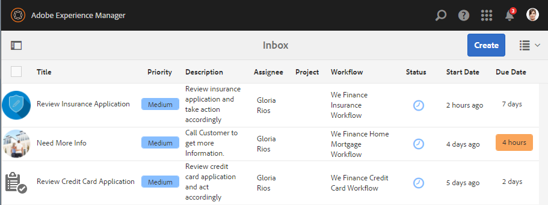
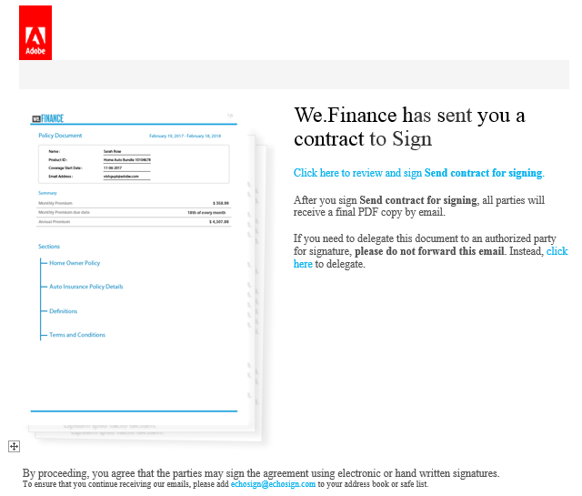
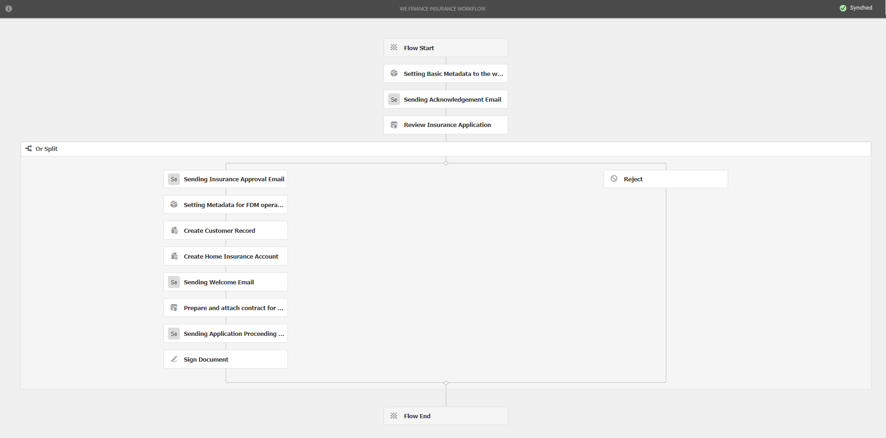

# We.Finance 참조 사이트 연습{#we-finance-reference-site-walkthrough}

## 전제 조건 {#pre-requisites}

AEM Forms 참조 사이트 설정 [및 구성에 설명된 대로 참조 사이트를 설정합니다](../../forms/using/setup-reference-sites.md).

## We.Finance 참조 사이트 시나리오 {#we-finance-reference-site-scenarios}

We.Finance는 금융 서비스 분야의 선도적인 조직으로 다양한 고객 프로필의 요구 사항에 맞게 포괄적이고 개인화된 금융 솔루션을 제공합니다. 그들은 신용 카드, 주택 담보 대출 및 주택 보험 서비스를 제공한다.

고객이 원하는 디바이스에서 기존 고객이나 잠재 고객에게 다가가고, 서비스의 이점을 설명하고, 서비스 등록을 돕는 것이 목표입니다. 게다가, 그들은 고객들이 흥미로워할 수 있는 애드온 카드와 같은 더 많은 금융 상품을 기대하고 있다.

We.Finance 사용 사례에 대한 자세한 설명은 Adobe를 참조하십시오. 또한 금융 조직이 어떻게 목표를 달성할 수 있는지 자세히 살펴볼 수 있습니다. 다음 연습에 대해 설명합니다.

* [신용 카드 신청 연습](#credit-card-application-walkthrough)
* [주택 담보 대출 신청 연습](#home-mortgage-application-walkthrough)
* [Microsoft Dynamics를 사용한 홈 모기지 애플리케이션 연습](#home-mortgage-application-walkthrough-with-microsoft-dynamics)
* [가정용 보험 신청 연습](#home-insurance-application-walkthrough)
* [자산 관리 연습](#wealthmanagementwalkthrough)
* [자동 보험 신청 연습](#autoinsuranceapplicationwalkthrough)

## 신용 카드 신청 연습 {#credit-card-application-walkthrough}

We.Finance 신용 카드 신청 시나리오는 다음과 같은 개인적 측면을 포함합니다.

* We.Finance 고객인 Sarah Rose
* Gloria Rios, We.Finance 신용 카드 및 모기지 책임자

다음 인포그래픽은 신용 카드 응용 프로그램의 단계별 작업 과정을 설명합니다.

We.Finance가 We.Finance의 목표를 어떻게 달성하는데 AEM Forms이 도움이 되는지 자세히 알기 위해 참조 사이트 시나리오를 자세히 살펴보자.

### 새라는 We.Finance로부터 뉴스레터를 받고 신용카드를 신청한다 {#sarah-receives-a-newsletter-from-we-finance-and-applies-for-a-credit-card}

Sarah Rose는 기존 We.Finance 고객입니다. 그녀는 We.Finance로부터 새로운 신용카드에 대한 뉴스레터를 받는다. 그녀는 그 제안이 재미있다고 생각하고 신용카드 신청하기로 결정했다. We.Finance 포털에서 제공하는 뉴스레터에 있는 지금 적용 버튼을 클릭하면 신용 카드 신청서.

#### 작동 방식 {#how-it-works}

Sarah로 보낸 뉴스레터는 지정된 이메일 ID로 이메일을 트리거하는 사용자 지정 구현입니다. 이메일의 지금 적용 단추는 게시 인스턴스의 적응형 양식인 신용 카드 응용 프로그램에 연결됩니다.

#### 직접 보기 {#see-it-yourself}

게시 인스턴스에서 다음 URL을 열어 뉴스레터 이메일을 트리거합니다. 뉴스레터를 수신할 유효한 이메일 계정 `[emailID]` 으로 바꾸는지 확인합니다. Newsletter를 열고 **[!UICONTROL 지금]** 적용을 클릭하여 신용 카드 애플리케이션으로 이동합니다.

`https://[publishServer]:[publsihPort]/content/campaigns/we-finance/start.html?app=cc&email=[emailID]&givenName=Sarah&familyName=Rose`

### Sarah는 이 제안을 흥미롭게 여기고 신청하기로 결정했다 {#sarah-finds-the-offer-interesting-and-chooses-to-apply}

사라는 신용카드를 신청하기로 하고 이메일에 있는 지금 **적용** 버튼을 탭한다. We.Finance 포털의 신용카드 신청으로 사라가 간다. 애플리케이션 양식은 카드 레이아웃을 사용하여 섹션으로 구성됩니다.

Sarah가 사용 가능한 옵션에서 신용 카드를 선택하고 [ **[!UICONTROL 계속]을 클릭합니다]**.

사라는 자신의 주민등록번호를 제공하는 개인 정보 페이지에서, 자신의 신분증으로 로그인하라는 메시지가 나타납니다.

사라는 기존 We.Finance 고객입니다. 그녀는 We.Finance 계정 자격 증명으로 로그인하고 그녀의 개인 세부 사항은 양식에 자동으로 채워집니다. 사라가 계속해서 지원서를 채우려고 하는데, 바로 그 때 그녀가 참석해야 하는 회의에 대한 미리 알림이 나타날 때입니다. 그녀는 애플리케이션 양식 **[!UICONTROL 에 내 진행]** 상황 저장을 클릭한다. 이 보고서는 사라가 지금까지 입력한 모든 정보를 저장하는데, 이 대화 상자가 표시되어 그녀가 나중에 작성을 완료할 수 있는 초안 애플리케이션에 대한 링크가 포함된 이메일을 받고 싶었는지 확인한다.

사라는 **[!UICONTROL 전송 메일을 클릭합니다]**. 그녀는 신용카드 신청서를 재개할 수 있는 링크가 포함된 이메일을 수신한다.

**Sarah는 모바일 장치에서 신용카드 응용 프로그램에 액세스합니다**

Sarah가 모바일 장치에서 신용카드 응용 프로그램에 액세스하는 경우, 반응형 응용 프로그램은 모바일 장치에 최적화된 보기에서 열립니다. 이 보기에서는 응용 프로그램 양식이 한 번에 하나의 섹션으로 렌더링됩니다. 이를 통해 사라는 애플리케이션을 탐색할 때 점진적으로 정보를 보고 제공할 수 있습니다.

**작동 방식**

지금 **적용** 단추가 사라를 신용카드 신청서로 안내한다. 응용 프로그램은 응용 양식이며, 작성 인스턴스에서 검토할 수 있습니다 `https://[host]:'port'/editor.html/content/forms/af/we-finance/cc-app.html`.

적응형 양식에서 검토할 수 있는 주요 기능 중 일부는 다음과 같습니다.

* XSD 스키마를 기반으로 합니다.
* 이 템플릿은 We Finance 테마 A를 사용하여 스타일링하고 We.Finance 템플릿을 사용하여 만듭니다. 또한 모바일 탐색을 위해 양식 헤더 레이아웃에서 패널 제목이 없는 레이아웃을 사용합니다. 모바일 장치에서 열면 점진적 모바일 레이아웃이 표시됩니다. 의 템플릿과 테마 `https://[host]:'port'/libs/wcm/core/content/sites/templates.html/conf/we-finance` 를 검토할 수 있습니다 `https://[host]:'port'/editor.html/content/dam/formsanddocuments-themes/we-finance/we-finance-theme-a/jcr:content`.
* 여기에는 로그인한 사용자의 사용자 세부 사항을 미리 채우기 위해 양식 데이터 모델 서비스를 호출하는 적응형 양식 규칙이 포함됩니다. 또한 양식을 통해 제공되는 소셜 보안 번호나 이메일 주소로 정보를 미리 입력할 수 있는 서비스도 제공합니다. 양식 데이터 모델 및 해당 서비스를 검토할 수 있습니다 `https://[host]:'port'/aem/forms.html/content/dam/formsanddocuments-fdm`.
* 다양한 적응형 양식 구성 요소를 사용하여 사용자 응답에 대한 입력 및 적응력을 캡처합니다. 또한 HTML5 입력 유형을 지원하는 이메일과 같은 구성 요소를 사용합니다.
* 서명 단계 구성 요소를 사용하여 완성된 양식을 표시하고 양식에 전자 서명을 허용합니다.
* [내 진행률 저장] 단추는 사용자에 대한 고유 ID를 생성하고 부분적으로 채워진 응용 프로그램을 AEM 저장소의 노드에 초안으로 저장합니다. 또한 초안 응용 프로그램이 포함된 노드에 대한 링크가 포함된 이메일을 보낼 수 있는 권한을 찾는 대화 상자가 표시됩니다. 확인 대화 상자의 [메일 보내기] 단추는 초안이 포함된 노드에 대한 링크가 포함된 이메일을 트리거합니다.
* AEM 워크플로우 호출 실행 작업을 사용하여 신용 카드 승인 워크플로우를 트리거합니다. 이 양식에서 사용된 워크플로우를 `https://[host]:'port'/editor.html/conf/global/settings/workflow/models/we-finance-credit-card-workflow.html`

스키마, 구성 요소, 규칙, 양식 데이터 모델, 양식 워크플로우 및 양식 작성에 사용되는 제출 작업을 이해하려면 양식을 검토하는 것이 좋습니다.

신용 카드 응용 양식에 사용되는 기능에 대한 자세한 내용은 다음 설명서를 참조하십시오.

* [적응형 양식 작성 소개](../../forms/using/introduction-forms-authoring.md)
* [XML 스키마를 사용하여 적응형 양식 만들기](../../forms/using/adaptive-form-xml-schema-form-model.md)
* [규칙 편집기](../../forms/using/rule-editor.md)
* [테마](../../forms/using/themes.md)
* [데이터 통합](../../forms/using/data-integration.md)
* [적응형 양식에 Adobe Sign 사용](../../forms/using/working-with-adobe-sign.md)
* [OSGi의 Forms 중심 워크플로우](../../forms/using/aem-forms-workflow.md)

**직접 보기**

Sarah Rose로 로그인하면, 신용카드 응용 프로그램에서 **지금** 적용 단추를 클릭합니다. 일부 세부 사항을 채우고 다양한 적응형 양식 구성 요소를 탐색한 다음 **내 진행** 상황 **을** 저장하여 초안 애플리케이션에 연결된다시 시작단추가 포함된 이메일을 수신합니다. 이메일을 수신할 이메일 ID를 응용 프로그램 양식에 지정해야 합니다.

다음 사이트에서 제공되는 We.Finance 테마를 검토하십시오.

`https://<host>:<AuthorPort>/editor.html/content/dam/formsanddocuments-themes/we-Finance/we-Finance-Theme-A/jcr:content`

다음 위치에서 We.Finance 템플릿을 검토할 수 있습니다.

`https://<host>:<AuthorPort>/editor.html/conf/we-finance/settings/wcm/templates/we-finance-template/structure.html`

### 사라가 이력서를 제출하고 신청서를 제출한다 {#sarah-resumes-and-submits-the-application}

새라는 나중에 돌아와서 We.Finance로부터 이메일을 찾습니다. e메일에서 **이력서** 버튼을 클릭하면 신용카드 신청서 영장에 도착한다. 그녀가 이전에 작성한 정보는 미리 채워져 있다. 그녀는 남은 신청서 양식을 작성하고, 서명하여 제출한다.

또는 We.Finance 홈 페이지의 **My** Forms 아래에 있는 초안 애플리케이션에 액세스할 수 있습니다.

#### 작동 방식 {#how-it-works-1}

이메일의 [다시 시작] 단추는 Sarah가 초안 응용 프로그램을 포함하는 노드로 리디렉션합니다.

#### 직접 보기 {#see-it-yourself-1}

신청서 작성 중에 지정한 이메일 ID의 초안 애플리케이션에 대한 링크가 포함된 이메일을 수신해야 합니다. 계속 진행해서 애플리케이션의 나머지 부분을 채우고 제출하세요.

### We.Finance receives and appropriate the application {#approving-the-application}

We.Finance receives received the credit card application by Sarah. 일은 글로리아 리오스에 맡긴다. 그녀는 자신의 AEM 받은 편지함에서 그 일을 검토하고 승인한다.

#### 작동 방식 {#how-it-works-2}

사라가 신용 카드 신청서를 작성하고 제출하면, 글로리아 AEM 받은 편지함에서 Forms Workflow이 트리거되고 작업이 만들어집니다.

OSGi 기반의 AEM Forms은 적응형 양식 기반 워크플로우를 구축할 수 있는 양식 중심의 워크플로우를 제공합니다. 이러한 워크플로우를 검토 및 승인, 업무 프로세스 흐름, 문서 서비스 시작, Adobe Sign 서명 워크플로우와 통합 등에 사용할 수 있습니다. 자세한 내용은 OSGi에서 [Forms 중심의 워크플로우를 참조하십시오](../../forms/using/aem-forms-workflow.md).

다음 이미지는 신용카드 애플리케이션을 처리하고 애플리케이션의 PDF 출력을 생성하는 AEM 워크플로우를 설명합니다.

#### 직접 보기 {#see-it-yourself-2}

https://&lt;hostname *>:&lt;* PublishPort>/content/we-finance/global/en.html에서 we.finance 사이트에 대한 AEM *받은 편지함에 액세스할 수*&#x200B;있습니다. 페이지에서 **로그인을**&#x200B;누르고, **대리인으로** `grios/password` 로그인 확인란을선택하고, Gloria Rios의 사용자 이름/암호를 사용하여 AEM 받은 편지함에 로그인하고, 신용 카드 응용 프로그램을 승인합니다. 양식 중심의 워크플로우 작업에 AEM Inbox 사용에 대한 자세한 내용은 AEM 받은 편지함에서 [Forms 애플리케이션 및 작업 관리를 참조하십시오](../../forms/using/manage-applications-inbox.md).

애플리케이션을 승인하면 Sarah는 환영 키트가 포함된 이메일을 수신하게 됩니다.

### Sarah는 환영 키트를 받고 추가 카드를 신청한다 {#sarah-receives-the-welcome-kit-and-applies-for-an-add-on-card}

사라의 신용카드 지원서가 승인되면, 그녀는 시작 키트에 대한 링크가 있는 이메일을 수신한다. 그녀는 신용 카드 계정 세부 사항이 포함된 환영 키트를 엽니다. 환영 키트에는 사라를 위한 개인화된 홍보 제안도 표시됩니다. 그녀가 아래로 스크롤할 때, 시작 키트에는 추가 기능 카드에 적용하기 위한 내장 양식이 포함되어 있습니다. Sarah는 환영 키트 내에서 필요한 세부 사항을 빠르게 기입하고 추가 기능을 신청합니다. 추가 카드 응용 프로그램에 대한 확인 대화 상자가 나타납니다.

환영 키트는 새라를 위해 개인화되었고 그녀와 관련된 정보를 보여준다. PDF 버전의 시작 키트를 다운로드할 수 있는 옵션을 제공합니다.

환영 키트에는 We.Finance 포털을 방문하지 않고도 시작 키트에서 추가 카드를 신청하기 위해 새라가 채우고 제출할 수 있는 다른 응용 프로그램 양식이 포함되어 있습니다.

#### 작동 방식 {#how-it-works-3}

시작 키트는 패키지에 포함된 인터랙티브한 `cq-we-finance-content-pkg.zip` 커뮤니케이션입니다. 시작 키트에서 신용 카드의 이점을 보여주는 데스크톱 버전의 대화형 카드는 문서 조각의 기본 카드 레이아웃을 사용하여 만든 사용자 정의 레이아웃입니다.

Add-on 카드 응용 프로그램은 환영 키트 대화형 통신에 포함된 응용 양식입니다.

#### 직접 보기 {#see-it-yourself-3}

이전 단계에서 받은 이메일에서 다시 시작 단추를 클릭합니다. 초안 응용 프로그램을 엽니다. 모든 세부 사항을 기입하고 신청서를 제출해 주십시오. 그러면 환영 키트를 받게 됩니다 시작 키트를 검토합니다.

다음 URL에서 시작 키트를 볼 수도 있습니다.

https://&lt;*host*>: &lt;*port*>/content/aemforms-refsite/doclink.html?document=/content/forms/af/we-finance/credit-card/creditcard/creditcard-welcomekit&amp;customerId=197&amp;channel=web

작성자 및 게시 인스턴스에서 액세스할 수 있습니다.

### 사라는 신용카드 명세서를 받았다 {#sarah-receives-a-credit-card-statement}

사라가 신용 카드를 사용하기 시작하면서, 그녀는 We.Finance로부터 그녀의 신용 카드 명세서가 포함된 다른 이메일을 받는다. 다음 이미지는 모바일에서 신용카드 명세서에 대한 링크가 포함된 이메일을 보여줍니다.

Sarah가 이메일에서 명세서 보기를 클릭하여 신용카드 명세서를 봅니다. 그 진술은 상호 작용 적인 의사소통이다. 웹 및 인쇄(PDF) 버전이 모두 포함되어 있습니다. 이 명령문은 Forms 데이터 모델과 통합되므로 고객별 데이터를 데이터베이스에서 검색합니다. 대화형 문은 다음과 같은 다양한 요소를 구성합니다.

* 명세서 요약
* 자세한 비용 보고서
* 그래픽 비용 분석
* 명세서 내에서 만기 금액에 대한 지불 옵션
* 결제 영수증 다운로드

사라는 오프라인 보관을 위해 PDF 버전의 신용카드 명세서를 검색하기 위해 포털에 가거나 그녀의 이메일을 검색할 필요가 없습니다. 그녀는 단지 다운로드 문을 클릭해서 PDF 버전의 성명을 다운로드합니다.

자세한 내용은 응답형 테이블에 표시됩니다. 또한 명세서 내에서 일부 또는 전체 기한을 지불하는 옵션도 제공합니다.

사라는 진술서에서 결제를 한다. 사라는 또한 &#39;탄력적 지불&#39; 옵션을 사용하여 결제를 동일한 부분으로 나눌 수 있습니다.

#### 작동 방식 {#how-it-works-4}

신용카드 명세서는 상호 작용 방식의 통신이다. 설명서에서 상세한 비용 표는 응답형 표입니다. 비용 분석용 그래픽은 차트 구성 요소로서 비용 테이블을 읽고 파이 차트를 생성합니다.

#### 직접 보기 {#see-it-yourself-4}

다음 URL에서 대화형 신용카드 명세서를 검토할 수 있습니다.

https://&lt;*hostname*>:&lt;*port*>/content/aemforms-refsite/doclink.html?document=/content/forms/af/we-finance/credit-card/credit-card-statement&amp;customerId=197&amp;channel=web

작성자 및 게시 인스턴스에서 액세스할 수 있습니다.

신용카드 명세서에는 진술의 마지막 부분에 대한 홍보 제안이 표시됩니다. Adobe Target을 AEM Forms 인터랙티브 커뮤니케이션과 통합하여 특정 고객 세그먼트를 기반으로 프로모션을 타겟팅할 수 있습니다. 사용자 지정 및 타깃팅된 오퍼에 Adobe Target을 사용하도록 대화형 통신을 구성하려면 타깃팅된 경험 [만들기를 참조하십시오](/help/forms/using/experience-targeting-forms.md).

### We.Finance analytics the performance of the credit card application {#we-finance-analyzes-the-performance-of-the-credit-card-application}

We.Finance.Finance, 때때로 We.Finance, 고객의 모든 문제를 확인하기 위해 신용카드 신청서의 성과를 검토한다. 이들은 이 분석을 통해 사용자 경험을 향상시키고, 양식의 포기율을 줄이고, 전환율을 향상시키기 위해 신용카드 신청에서 요구되는 변경 사항에 대한 현명한 결정을 내릴 수 있습니다. 이들은 AEM Forms과 Adobe Analytics의 통합을 활용해 분석을 한다. 다음 이미지는 분석 대시보드를 나타냅니다.

분석 대시보드를 해석하는 방법에 대한 자세한 내용은 AEM Forms 분석 보고서 [보기 및 이해를 참조하십시오](../../forms/using/view-understand-aem-forms-analytics-reports.md).

#### 작동 방식 {#how-it-works-5}

신용 카드 신청 양식의 성과 지표는 Adobe Analytics을 사용하여 추적됩니다. Adobe Analytics 구성 및 보고서 보기에 대한 자세한 내용은 [양식 및 문서에 대한 분석 구성을 참조하십시오](../../forms/using/configure-analytics-forms-documents.md).

#### 직접 보기 {#see-it-yourself-br}

분석 보고서를 보고 탐색하기 위해 참조 사이트에서 신용 카드 애플리케이션에 대한 시드 데이터를 제공합니다. 시드 데이터를 사용하기 전에 분석 [구성을 참조하십시오](../../forms/using/setup-reference-sites.md#configureanalytics). 시드 데이터로 보고서를 보려면 작성 인스턴스에서 다음 단계를 수행합니다.

1. https://&lt; **hostname** >:&lt;*AuthorPort*>/aem/forms.html/content/dam/formsanddocuments의&#x200B;*Forms 및 문서* UI로 이동합니다.

1. 을 클릭하여 **We.Finance 폴더를** 엽니다.
1. 신용 카드 **응용** 양식을 위한 응용 프로그램을 선택한 다음 도구 모음에서 분석 **[!UICONTROL 활성화를 클릭합니다]**.

1. 응용 양식을 다시 선택하고 도구 모음에서 **[!UICONTROL 분석 보고서]** 를 클릭하여 보고서를 생성합니다. 처음에는 빈 보고서가 표시됩니다.

시드 데이터로 분석 보고서를 생성하려면

1. CRXDE lite 주소 브라우저에서 다음을 입력합니다. `/apps/we-finance/demo-artifacts/analyticsTestData/Credit card Analytics Test Data`
1. 테스트 데이터가 왼쪽 디렉토리 구조에서 선택됩니다.
1. 오른쪽 패널에서 선택한 파일을 두 번 클릭하여 해당 컨텐츠를 엽니다.
1. 시드 데이터 파일의 모든 컨텐츠를 복사합니다.
1. CRXDE에서 다음 위치로 이동합니다. `/content/dam/formsanddocuments/we-finance/cc-app/jcr:content/analyticsdatanode/lastsevendays`
1. 속성 아래의 **[!UICONTROL 분석]** 데이터 **[!UICONTROL 필드]**&#x200B;에서 시드 데이터파일의 복사한 내용을 붙여 넣습니다.

1. 신용 카드 **** 적응형 양식을 위한 **[!UICONTROL 애플리케이션을 선택하고 도구 모음에서]** 분석 보고서를 클릭하여 시드 데이터를 포함한 보고서를 생성합니다.

**신용 카드 신청서 A/B 테스트**

Adobe.Finance는 신용카드 응용 프로그램의 성능을 분석하고 지속적으로 개선하는 것 외에도, A/B 테스트를 만들기 위해 AEM Forms과 Target의 통합을 활용한다. 따라서 양식 작성 및 제출 시 다양한 고객 경험을 제공하고 전환율을 높일 수 있는 경험을 식별할 수 있습니다.

AEM Forms 서버에서 Target을 구성하려면 AEM Forms [에서 Target 설정 및 통합을 참조하십시오](../../forms/using/ab-testing-adaptive-forms.md#set%20up%20and%20integrate%20target%20in%20aem%20forms).

다음 단계를 수행하여 We.Finance 신용 카드 응용 프로그램 양식에 대한 A/B 테스트를 만듭니다.

1. https://&lt; **hostname** >:&lt;*AuthorPort*>/aem/forms.html/content/dam/formsanddocuments로 이동합니다&#x200B;**.

1. 을 클릭하여 **We.Finance** 폴더를 엽니다.
1. 신용 **카드** 응용 양식을 선택합니다.
1. 도구 모음 **에서** 자세히 **를 클릭하고 A/B 테스트 구성을 선택합니다**. A/B 테스트 구성 페이지가 열립니다.

1. 활동 **이름을 지정합니다**.
1. 대상 드롭다운 목록에서 양식의 다른 경험을 제공할 대상을 선택합니다. 예를 들어 Chrome을 **사용하는 방문자**.
1. 경험 A와 **B에 대한 경험 배포** 필드에서, 전체 대상 간에 경험의 배포를 결정하기 위해 백분율로 분포를 지정합니다. 예를 들어 경험 A와 경험 B에 각각 40, 60을 지정하는 경우 경험 A는 대상의 40%에게 제공되며 나머지 60%는 경험 B를 보게 됩니다.
1. 구성을 **클릭합니다**. A/B 테스트 만들기를 확인하는 대화 상자가 나타납니다.
1. 완료를 **클릭합니다**.
1. 신용 카드 **신청서** 양식을 선택하고 편집을 **클릭합니다**. 경험 중 하나를 여는 옵션이 제공됩니다. 경험 **B를 클릭합니다**. 양식이 편집 모드로 열립니다.

1. 기본 경험 A와 다른 경험을 만들려면 원하는 대로 양식을 수정합니다.
1. Forms 및 문서 UI로 이동하여 양식을 선택하고 **자세히**&#x200B;를 클릭한 다음 **A/B 테스트 시작을 선택합니다**.
1. 이제 다음 URL을 사용하여 크롬 브라우저에서 양식을 여러 번 엽니다.

   `https://[hostname]:[port]/content/dam/formsanddocuments/we-finance/cc-app/jcr:content?wcmmode=disabled`

   >[!NOTE]
   > 
   >다음에 양식을 열기 전에 **브라우저의 쿠키 지속성에서** mbox라는 이름의 쿠키를 제거합니다. 양식의 경험 A와 B를 무작위로 볼 수 있습니다.

1. 양식을 선택하고 **자세히**&#x200B;를 클릭한 다음 **A/B 테스트 보고서를 클릭합니다**. 테스트를 시작했기 때문에 보고서에서 많은 데이터를 찾을 수 없습니다. 이제 몇 가지 시드 데이터를 제공하여 A/B 테스트 보고서가 어떻게 표시되는지 보겠습니다.
1. CRXDE Lite을 열고 다음 파일을 백업합니다. /libs/fd/fmaddon/gui/components/admin/targetreport/clientlibs/targetreport/js/targetreport.js
1. 위에 언급된 파일 `onReportLoadSuccess` 의 함수 정의를 다음 파일의 함수 정의로 바꿉니다. /apps/we-finance/demo-artifacts/targetreport.js

   >[!NOTE]
   >
   >이러한 변경 사항은 데모 용도로만 적용됩니다. 이 절차를 완료한 후 파일 내용을 복원해야 합니다.

1. 생성한 보고서를 새로 고치면 다음과 같은 항목이 표시됩니다. 보고 대시보드를 검토합니다.

A/B 테스트를 종료하려면 보고 대시보드에서 **End A/B 테스트** 단추를 클릭합니다. 현재 경험을 선언하라는 대화 상자가 표시됩니다. 우승자를 선택하고 A/B 테스트를 종료하려면 확인합니다.

경험 A를 우승자로 선택하면 A/B 테스트가 종료되고 진행되면 Chrome의 경험 A만 모든 사용자에게 제공됩니다.

## 주택 담보 대출 신청 연습 {#home-mortgage-application-walkthrough}

We.Finance 홈 모기지 시나리오는 다음과 같은 측면을 포함합니다.

* We.Finance 고객인 Sarah Rose
* Gloria Rios, We.Finance 신용 카드 및 모기지 책임자
* John Doe, We.Finance 고객 지원 센터 대표

다음 인포그래픽은 주택 담보 대출 애플리케이션의 단계별 작업 과정을 설명합니다.

이제 참조 사이트 시나리오의 단계를 자세히 살펴보고 We.Finance가 We.Finance의 목표를 어떻게 달성하는지 알아봅니다.

### Sarah는 We.Finance 웹 사이트를 방문하고 주택 융자를 신청한다 {#sarah-visits-we-finance-website-and-applies-for-home-mortgage}

새라 로즈는 집을 사고 주택 담보 대출 계획을 찾을 계획이다. 그녀는 We.Finance 고객이므로 We.Finance 포털을 방문하여 주택 담보 제공을 탐색한다. 그녀는 대출 섹션으로 가서 포털에서 대출 계산기를 찾고 있다. 그녀는 세부사항을 작성하고 모기지 계획을 반환하는 내 모기지 계산 을 클릭합니다.

 

모기지 계산기

모기지 계산기 결과

#### 작동 방식 {#how-it-works-6}

대출 페이지의 가정용 주택 담보 대출 계산기는 AEM Sites 페이지에 포함된 응용 양식입니다. 대출 페이지를 편집 모드로 검토할 수 있습니다 `https://[authorHost]:[authorPort]/editor.html/content/we-finance/global/en/loan-landing-page.html`.

적응형 양식인 내장 모기지 계산기는 계산 필드에 제공된 대출 세부 사항을 기준으로 EMI 금액을 계산하는 규칙을 사용합니다. 응용 양식을 검토할 수 있습니다 `https://[authorHost]:[authorPort]/editor.html/content/forms/af/we-finance/hm-calc.html`.

#### 직접 보기 {#see-it-yourself-5}

We.Finance 포털로 `https://<publishHost>:<publishPort>/content/we-finance/global/en.html` 이동하여 **[!UICONTROL Reloads를 클릭합니다]**. 대출 계산기를 통해 자세한 내용을 살펴보고 결과를 확인하십시오.

### Sarah는 이 제안을 흥미롭게 여기고 신청하기로 결정했다 {#sarah-finds-the-offer-interesting-and-chooses-to-apply-1}

Sarah는 주택 담보 대출 신청과 주택 담보 대출 계산기 결과 **[!UICONTROL 에 지금]** 적용을 클릭하기로 결정했다. 그것은 주택 담보 대출 신청을 엽니다.

Sarah가 자신의 모바일 장치에서 주택 담보 대출 응용 프로그램에 액세스하는 경우, 응용 프로그램 양식이 모바일 장치에서 볼 수 있도록 최적화된 보기에서 열립니다. 이 보기에서는 응용 프로그램 양식이 한 번에 하나의 섹션을 렌더링합니다. 이를 통해 사라는 애플리케이션 양식을 탐색할 때 점진적으로 정보를 보고 제공할 수 있습니다.

다음 이미지는 Sarah가 자신의 모바일 장치에서 주택 담보 대출 신청서를 탐색하는 워크플로우를 보여줍니다.

Sarah가 **데스크탑에서 지금** 적용을 클릭하면 담보 대출 신청 양식이 다음과 같이 열립니다. 저당 계산기에서 Sarah가 제공한 정보는 신청서 양식에 프리필되어 있다. Sarah가 나머지 세부 사항을 채우고 [계속]을 **클릭합니다**.

Sarah가 주택 담보 대출 계산기를 통해 수집한 정보를 바탕으로, 그녀는 몇 가지 주택 담보 대출 계획을 제시받는다. 그녀는 자신의 요구 사항에 맞는 플랜을 선택하고 계속해서 지원서를 작성한다. 그녀는 마침내 서명하고 신청서를 제출한다.

제출된 신청서는 승인을 위해 We.Finance로 간다.

#### 작동 방식 {#how-it-works-7}

지금 **신청** 버튼은 사라를 주택 담보 대출 신청서로 안내한다. 응용 프로그램은 응용 양식이며, 작성 인스턴스에서 검토할 수 있습니다 `https://[host]:'port'/editor.html/content/forms/af/we-finance/hm-app.html`.

적응형 양식에서 검토할 수 있는 주요 기능 중 일부는 다음과 같습니다.

* XSD 스키마를 기반으로 합니다 `homeMortgageApplication.xsd`.
* We Finance 테마 B를 사용하여 스타일링 및 레이아웃용 We.Finance 템플릿을 사용하여 만들어집니다. 또한 모바일 탐색을 위해 양식 헤더 레이아웃에서 패널 제목이 없는 레이아웃을 사용합니다. 모바일 장치에서 열면 점진적 모바일 레이아웃이 표시됩니다. AEM 작성자 인스턴스의 다음 위치에서 응용 양식에 사용된 템플릿과 테마를 검토할 수 있습니다.

   * `https://[host]:'port'/libs/wcm/core/content/sites/templates.html/conf/we-finance`
   * `https://[host]:'port'/editor.html/content/dam/formsanddocuments-themes/we-finance/we-finance-theme-b/jcr:content`

* 응용 프로그램의 첫 번째 탭인 시작점은 사용자 선택에 따라 옵션을 표시하는 다이내믹한 융자 계산기입니다. 예를 들어, 필드와 값은 구매 및 재재무 옵션에 따라 다릅니다. 이 기능은 표시 숨기기 규칙을 사용하여 수행됩니다. 또한 계속을 클릭하고 계획 탭이 초기화되면 양식 데이터 모델에 구성된 웹 서비스를 호출하여 담보 대출 계획을 가져오고 표시합니다. 양식 데이터 모델 및 구성된 서비스를 검토할 수 있습니다. `https://[host]:'port'/aem/forms.html/content/dam/formsanddocuments-fdm`
* 다양한 적응형 양식 구성 요소를 사용하여 사용자 응답에 대한 입력 및 적응력을 캡처합니다. 또한 HTML5 입력 유형을 지원하는 이메일과 같은 구성 요소를 사용합니다.
* 서명 단계 구성 요소를 사용하여 완성된 양식을 표시하고 양식에 전자 서명을 허용합니다.
* Invoke AEM Workflow 제출 작업을 사용하여 We Finance Home Mortgage AEM 워크플로우를 트리거합니다. 이 양식에서 사용된 워크플로우를 `https://[host]:'port'/editor.html/conf/global/settings/workflow/models/we-finance-home-mortgage-workflow.html`

스키마, 구성 요소, 규칙, 양식 데이터 모델, 양식 워크플로우 및 양식 작성에 사용되는 제출 작업을 이해하려면 양식을 검토하는 것이 좋습니다.

또한 홈 모기지 애플리케이션 응용 양식에 사용된 기능에 대한 자세한 내용은 다음 설명서를 참조하십시오.

* [적응형 양식 작성 소개](../../forms/using/introduction-forms-authoring.md)
* [XML 스키마를 사용하여 적응형 양식 만들기](../../forms/using/adaptive-form-xml-schema-form-model.md)
* [규칙 편집기](../../forms/using/rule-editor.md)
* [테마](../../forms/using/themes.md)
* [데이터 통합](../../forms/using/data-integration.md)
* [적응형 양식에 Adobe Sign 사용](../../forms/using/working-with-adobe-sign.md)
* [OSGi의 Forms 중심 워크플로우](../../forms/using/aem-forms-workflow.md)

#### 직접 보기 {#see-it-yourself-6}

홈 `https://'[server]:[port]'/content/we-finance/global/en/all-forms.html` 모기지 애플리케이션에서 지금 **적용** 버튼을 클릭합니다. 시작하기 탭에서 세부 사항을 채우고 다른 옵션을 시도해 본 다음 애플리케이션을 제출합니다.

응용 프로그램에서 유효한 이메일 ID를 지정하여 받은 편지함에서 확인 메일을 받으십시오.

### We.Finance receives the application {#approving_the_application-1}

We.Finance receives the ndgure application submitted by Sarah. 지원서를 승인하거나 거부하는 작업은 Gloria Rios에게 지정됩니다. 그녀는 그 지원서를 검토하고 사라의 정부 신분증이 없다는 것을 알았다.

Gloria는 작업을 시작하고 Need More Info를 클릭하고 누락된 정부 ID에 대한 의견을 표시합니다.

이제 이 작업은 We.Finance의 고객 지원 담당자인 John Doe에게 지정됩니다. 그는 일을 시작하고 글로리아의 의견을 들었다. 그는 사라와 연락해서 그녀의 신분증 사본을 보내달라고 했다. 그는 사라의 신분증을 받은 후 그 신분에 첨부하고 재평가를 위해 신청서를 제출한다.

그 일은 글로리아에게 맡긴다. 그녀는 첨부한 ID를 검토하고 지원서를 승인한다.

#### 작동 방식 {#how-it-works-8}

사라가 집 담보 대출 신청서를 작성하고 제출하면, Forms Workflow이 트리거되고 글로리아의 AEM 받은 편지함에 작업이 만들어집니다. Gloria가 지원서를 검토하고 더 많은 정보를 요청함에 따라, 이 작업은 John Doe에게 지정됩니다. John Doe가 ID를 첨부하고 신청서를 제출하면 Gloria에게 할당됩니다. 이것은 담보 대출 응용 프로그램과 연관된 AEM 워크플로우에서 정의됩니다.

OSGi 기반의 AEM Forms은 적응형 양식 기반 워크플로우를 구축할 수 있는 양식 중심의 워크플로우를 제공합니다. 이러한 워크플로우를 검토 및 승인, 업무 프로세스 흐름, 문서 서비스 시작, Adobe Sign 서명 워크플로우와 통합 등에 사용할 수 있습니다. 자세한 내용은 OSGi에서 [Forms 중심의 워크플로우를 참조하십시오](../../forms/using/aem-forms-workflow.md).

다음 이미지는 모기지 응용 프로그램과 연관된 AEM 워크플로우를 설명합니다.

#### 직접 보기 {#see-it-yourself-7}

의 AEM 받은 편지함에 액세스할 수 있습니다 `https://<hostname>:<AuthorPort>/content/we-finance/global/en/login.html?resource=/aem/inbox.html`. Gloria Rios와 John Doe의 사용자 이름/암호 `grios/password` `jdoe/jdoe` 를 사용하여 AEM 받은 편지함에 로그인하고 홈 모기지 애플리케이션 워크플로우를 살펴봅니다.

양식 중심의 워크플로우 작업에 AEM Inbox 사용에 대한 자세한 내용은 AEM 받은 편지함에서 [Forms 애플리케이션 및 작업 관리를 참조하십시오](../../forms/using/manage-applications-inbox.md).

### 새라는 환영 키트를 받았다 {#sarah-receives-the-welcome-kit}

사라의 담보 대출 신청이 승인되면, 그녀는 시작 키트에 대한 링크가 있는 이메일을 수신한다. 그녀는 새라를 위한 개인화된 프로모션 이벤트를 보여주는 회전판이 포함된 환영 키트를 엽니다.

환영 키트는 새라를 위해 개인화되었고 그녀와 관련된 정보를 보여준다. PDF 버전의 시작 키트를 다운로드할 수 있는 옵션을 제공합니다. 아래쪽의 화살표 단추를 사용하면 사라가 아래쪽으로 스크롤하여 시작 키트의 다른 부분을 탐색할 수 있습니다.

#### 작동 방식 {#how-it-works-9}

시작 키트는 패키지에 포함된 인터랙티브한 `cq-we-finance-content-pkg.zip` 커뮤니케이션입니다. 환영 키트에 있는 프로모션 행사는 Adobe Target 서버에서 제공됩니다. 오퍼는 사용자 지정되고 특정 고객 세그먼트에 타깃팅됩니다. 시작 키트는 여성 고객의 대상 세그먼트에 대해 사전 구성된 Adobe Target 서버에서 오퍼를 가져옵니다.

데스크톱 버전의 시작 키트의 대화형 카드에서는 문서 조각의 기본 카드 레이아웃을 사용하여 만든 사용자 정의 레이아웃을 사용합니다.

#### 직접 보기 {#see-it-yourself-8}

담보 대출 신청서를 채울 때 이메일 ID를 제공한 경우 시작 키트에 대한 링크가 포함된 이메일을 수신해야 합니다. 받은 편지함을 확인하고 시작 키트를 검토하십시오.

다음 URL의 AEM 게시 인스턴스에서 볼 수 있습니다.

`https://[host]:'port'/content/forms/af/we-finance/mortgage-loan-welcome-kit.html`

### 새라는 계정 정보를 받습니다 {#sarah-receives-an-account-statement}

사라가 대출을 받고 할부로 시작하면서, 그녀는 월 계정 내역서가 포함된 We.Finance로부터 또 다른 이메일을 받는다.

Sarah가 이메일에서 명세서 보기를 클릭하여 대출 계정 명세서를 봅니다. 대화형 문은 다음과 같은 다양한 요소를 구성합니다.

* 명세서 요약
* 문 세부 사항

다음 이미지는 데스크탑에서 계정 문의 다른 부분을 보여 줍니다.

자세한 내용은 응답형 표에 나열되며 명세서 내에서 일부 또는 전체 기한을 지불하는 옵션을 제공합니다.

#### 작동 방식 {#how-it-works-10}

모기지 진술은 상호작용 방식의 대화이다. JSON 일괄 처리 프로세스를 사용하여 생성됩니다. 설명서에서 상세한 비용 표는 응답형 표입니다.

#### 직접 보기 {#see-it-yourself-9}

다음 URL에서 인터랙티브한 주택담보대출 계정 명세서를 검토할 수 있습니다.

https://&lt;*hostname*>:&lt;*port*>/content/forms/af/we-finance/mortgage-account-statement.html?wcmmode=disabled

작성자 및 게시 인스턴스에서 액세스할 수 있습니다.

### We.Finance analytics the performance of the baudition application {#we-finance-analyzes-the-performance-of-the-mortgage-application}

We.Finance는 때때로 고객이 직면하고 있는 모든 문제를 확인하기 위해 모기지 애플리케이션의 성능을 검토합니다. 이러한 분석을 통해 사용자 경험을 향상시키고 양식의 포기율을 줄이며 전환율을 높이기 위해 모기지 애플리케이션에 필요한 변경 사항에 대한 현명한 의사 결정을 내릴 수 있습니다. 이들은 AEM Forms과 Adobe Analytics의 통합을 활용해 분석을 한다. 다음 이미지는 분석 대시보드를 나타냅니다.

분석 대시보드를 해석하는 방법에 대한 자세한 내용은 AEM Forms 분석 보고서 [보기 및 이해를 참조하십시오](../../forms/using/view-understand-aem-forms-analytics-reports.md).

#### 작동 방식 {#how-it-works-11}

모기지 애플리케이션 양식의 성능 지표는 Adobe Analytics을 사용하여 추적됩니다. Adobe Analytics 구성 및 보고서 보기에 대한 자세한 내용은 [양식 및 문서에 대한 분석 구성을 참조하십시오](../../forms/using/configure-analytics-forms-documents.md).

#### 직접 보기 {#see-it-yourself-br-1}

분석 보고서를 보고 탐색하기 위해 참조 사이트에서 모기지 애플리케이션에 대한 시드 데이터를 제공합니다. 시드 데이터를 사용하기 전에 분석 [구성을 참조하십시오](../../forms/using/setup-reference-sites.md#configureanalytics). 시드 데이터로 보고서를 보려면 작성 인스턴스에서 다음 단계를 수행합니다.

1. https://&lt; **hostname** >:&lt;*AuthorPort*>/aem/forms.html/content/dam/formsanddocuments의&#x200B;*Forms 및 문서* UI로 이동합니다.

1. 을 클릭하여 **we-finance** 폴더를 엽니다.
1. 홈 **[!UICONTROL 모기지]** 응용 양식을 위한 응용 프로그램을 선택한 다음 도구 모음에서 분석 **[!UICONTROL 활성화를 클릭합니다]**.

1. 양식을 다시 선택하고 도구 모음에서 **[!UICONTROL 분석 보고서]** 를 클릭하여 보고서를 생성합니다. 처음에는 빈 보고서가 표시됩니다.

시드 데이터로 분석 보고서를 생성하려면

1. CRXDE lite의 주소 브라우저에서 다음을 입력합니다. `/apps/we-finance/demo-artifacts/analyticsTestData/HomeMortgageAnalyticsTestData`
1. 테스트 데이터가 왼쪽 디렉토리 구조에서 선택됩니다.
1. 오른쪽 패널에서 선택한 파일을 두 번 클릭하여 해당 컨텐츠를 엽니다.
1. 시드 데이터 파일의 모든 컨텐츠를 복사합니다.
1. CRXDE에서 다음 위치로 이동합니다. `/content/dam/formsanddocuments/we-finance/hm-app/jcr:content/analyticsdatanode/lastsevendays`
1. 속성 아래의 분석 데이터 필드에서 시드 데이터 파일의 복사한 내용을 붙여 넣습니다.
1. 이제 홈 모기지 애플리케이션 양식에 대한 분석 보고서를 다시 생성합니다. 시드 데이터가 있는 보고서가 표시됩니다.

**모기지 애플리케이션의 A/B 테스트**

Adobe.Finance는 모기지 애플리케이션의 성능을 분석하고 지속적으로 개선하는 것 외에도 Target과 AEM Forms의 통합을 활용하여 A/B 테스트를 만듭니다. 양식 작성 및 제출 측면에서 다양한 애플리케이션 양식 경험을 제공하고 전환율을 향상시킬 수 있는 경험을 식별할 수 있습니다.

AEM Forms 서버에서 Target을 구성하려면 AEM Forms [에서 Target 설정 및 통합을 참조하십시오](../../forms/using/ab-testing-adaptive-forms.md#set%20up%20and%20integrate%20target%20in%20aem%20forms).

작성 인스턴스에서 다음 단계를 수행하여 We.Finance 저당권 응용 프로그램 양식에 대한 A/B 테스트 생성을 경험하십시오.

1. https://&lt; **hostname** >:&lt;*AuthorPort*>/aem/forms.html/content/dam/formsanddocuments로 이동합니다&#x200B;**.

1. 을 클릭하여 **We.Finance** 폴더를 엽니다.
1. 홈 **모기지** 응용 양식을 위한 응용 프로그램을 선택합니다.
1. 도구 모음 **에서** 자세히 **를 클릭하고 A/B 테스트 구성을 선택합니다**. A/B 테스트 구성 페이지가 열립니다.

1. 활동 **이름을 지정합니다**.
1. 대상 드롭다운 목록에서 양식의 다른 경험을 제공할 대상을 선택합니다. 예를 들어 Chrome을 **사용하는 방문자**.
1. 경험 A와 **B에 대한 경험 배포** 필드에서, 전체 대상 간에 경험의 배포를 결정하기 위해 백분율로 분포를 지정합니다. 예를 들어 경험 A와 경험 B에 각각 40, 60을 지정하는 경우 경험 A는 대상의 40%에게 제공되며 나머지 60%는 경험 B를 보게 됩니다.
1. 구성을 **클릭합니다**. A/B 테스트 만들기를 확인하는 대화 상자가 나타납니다.
1. 완료를 **클릭합니다**.
1. 홈 **모기지** 적응형 양식을 선택하고 편집을 **클릭합니다**. 경험 중 하나를 여는 옵션이 제공됩니다. 경험 **B를 클릭합니다**. 양식이 편집 모드로 열립니다.
1. 기본 경험 A와 다른 경험을 만들려면 원하는 대로 양식을 수정합니다.
1. Forms 및 문서 UI로 이동하여 양식을 선택하고 **자세히**&#x200B;를 클릭한 다음 **A/B 테스트 시작을 선택합니다**.
1. 이제 다음 URL을 사용하여 크롬 브라우저에서 양식을 여러 번 엽니다.
   `https://[hostname]:[port]/content/dam/formsanddocuments/we-finance/hm-app/jcr:content?wcmmode=disabled`

   >[!NOTE]
   > 다음에 양식을 열기 전에 **브라우저의 쿠키 지속성에서** mbox라는 이름의 쿠키를 제거합니다. 양식의 경험 A와 B를 무작위로 볼 수 있습니다.

1. 양식을 선택하고 **자세히**&#x200B;를 클릭한 다음 **A/B 테스트 보고서를 클릭합니다**. 테스트를 시작했기 때문에 보고서에서 많은 데이터를 찾을 수 없습니다. 이제 몇 가지 시드 데이터를 제공하여 A/B 테스트 보고서가 어떻게 표시되는지 보겠습니다.
1. CRXDE Lite을 열고 다음 파일을 백업합니다. /libs/fd/fmaddon/gui/components/admin/targetreport/clientlibs/targetreport/js/targetreport.js
1. 위에 언급된 파일의 `onReportLoadSuccess` 함수 정의를 다음 파일의 함수 정의로 바꿉니다. /apps/we-finance/demo-artifacts/targetreport.js

   >[!NOTE]
   >
   >이러한 변경 사항은 데모 용도로만 적용됩니다. 이 절차를 완료한 후 파일 내용을 복원해야 합니다.

1. 생성한 보고서를 새로 고치면 다음과 같은 항목이 표시됩니다. 보고 대시보드를 검토합니다.

A/B 테스트를 종료하려면 보고 대시보드에서 **End A/B 테스트** 단추를 클릭합니다. 현재 경험을 선언하라는 대화 상자가 표시됩니다. 우승자를 선택하고 A/B 테스트를 종료하려면 확인합니다.

경험 A를 우승자로 선택하면 A/B 테스트가 종료되고 진행되면 Chrome의 경험 A만 모든 사용자에게 제공됩니다.

## Microsoft Dynamics를 사용한 홈 모기지 애플리케이션 연습 {#home-mortgage-application-walkthrough-with-microsoft-dynamics}

Microsoft Dynamics 시나리오로 We.Finance 홈 모기지에는 다음과 같은 기능이 포함됩니다.

* We.Finance 고객인 Sarah Rose
* We.Finance Microsoft Dynamics 인스턴스의 관리자

Microsoft Dynamics의 홈 저당 애플리케이션 연습에서는 We.Finance 고객이 데이터 통합을 위해 Microsoft Dynamics를 사용할 때 사이트를 사용하여 주택 저당을 적용하는 방법을 보여 줍니다. 이 연습은 Microsoft Dynamics에서 받는 사용자가 입력한 데이터로 끝납니다. 이 시나리오를 진행하기 전에 We.Finance 참조 사이트의 [홈 모기지 워크플로에 대한 Microsoft Dynamics 365 구성을 완료해야 합니다](/help/forms/using/ms-dynamics-configuration-home-mortgage.md).

### Sarah는 We.Finance 웹 사이트를 방문하고 주택 융자를 신청한다 {#sarah-visits-we-finance-website-and-applies-for-home-mortgage-1}

새라 로즈는 집을 사고 주택 담보 대출 계획을 찾을 계획이다. 그녀는 We.Finance 고객이므로 We.Finance 포털을 방문하여 주택 담보 제공을 탐색한다. 그녀는 대출 섹션으로 가서 포털에서 대출 계산기를 찾고 있다. 그녀는 세부사항을 작성하고 모기지 계획을 반환하는 내 모기지 계산 을 클릭합니다.

 

모기지 계산기

모기지 계산기 결과

#### 작동 방식 {#how-it-works-12}

대출 페이지의 가정용 주택 담보 대출 계산기는 AEM Sites 페이지에 포함된 응용 양식입니다. 대출 페이지를 편집 모드로 검토할 수 있습니다 `https://[authorHost]:[authorPort]/editor.html/content/we-finance/global/en/loan-landing-page.html`.

적응형 양식인 내장 모기지 계산기는 계산 필드에 제공된 대출 세부 사항을 기준으로 EMI 금액을 계산하는 규칙을 사용합니다. 응용 양식을 검토할 수 있습니다 `https://[authorHost]:[authorPort]/editor.html/content/forms/af/we-finance/ms-dynamics/home-mortgage-calculator.html`.

#### 직접 보기 {#see-it-yourself-10}

We.Finance 포털로 `https://<publishHost>:<publishPort>/content/we-finance/global/en.html` 이동하여 **[!UICONTROL Reloads를 클릭합니다]**. 대출 계산기를 통해 자세한 내용을 살펴보고 결과를 확인하십시오.

### Sarah는 이 제안을 흥미롭게 여기고 신청하기로 결정했다 {#sarah-finds-the-offer-interesting-and-chooses-to-apply-2}

Sarah는 주택 담보 대출 신청과 주택 담보 대출 계산기 결과 **[!UICONTROL 에 지금]** 적용을 클릭하기로 결정했다. 그것은 주택 담보 대출 신청을 엽니다.

Sarah가 자신의 모바일 장치에서 주택 담보 대출 응용 프로그램에 액세스하는 경우, 응용 프로그램 양식이 모바일 장치에서 볼 수 있도록 최적화된 보기에서 열립니다. 이 보기에서는 응용 프로그램 양식이 한 번에 하나의 섹션을 렌더링합니다. 이를 통해 사라는 애플리케이션 양식을 탐색할 때 점진적으로 정보를 보고 제공할 수 있습니다.

다음 이미지는 Sarah가 자신의 모바일 장치에서 주택 담보 대출 신청서를 탐색하는 워크플로우를 보여줍니다.

Sarah가 **데스크탑에서 지금** 적용을 클릭하면 담보 대출 신청 양식이 다음과 같이 열립니다. 저당 계산기에서 Sarah가 제공한 정보는 신청서 양식에 프리필되어 있다. Sarah가 나머지 세부 사항을 채우고 [계속]을 **클릭합니다**.

Sarah가 주택 담보 대출 계산기를 통해 수집한 정보를 바탕으로, 그녀는 몇 가지 주택 담보 대출 계획을 제시받는다. 그녀는 자신의 요구 사항에 맞는 플랜을 선택하고 계속해서 지원서를 작성한다. 그녀는 마침내 서명하고 신청서를 제출한다.

제출된 신청서는 승인을 위해 We.Finance로 간다.

#### 작동 방식 {#how-it-works-13}

지금 **신청** 버튼은 사라를 주택 담보 대출 신청서로 안내한다. 응용 프로그램은 응용 양식이며, 작성 인스턴스에서 검토할 수 있습니다 `https://[host]:'port'/editor.html/content/forms/af/we-finance/ms-dynamics/application-for-home-mortgage.html`.

적응형 양식에서 검토할 수 있는 주요 기능 중 일부는 다음과 같습니다.

* XSD 스키마를 기반으로 합니다 `homeMortgageApplication.xsd`.
* We Finance 테마 B를 사용하여 스타일링 및 레이아웃용 We.Finance 템플릿을 사용하여 만들어집니다. 또한 모바일 탐색을 위해 양식 헤더 레이아웃에서 패널 제목이 없는 레이아웃을 사용합니다. 모바일 장치에서 열면 점진적 모바일 레이아웃이 표시됩니다. AEM 작성자 인스턴스의 다음 위치에서 응용 양식에 사용된 템플릿과 테마를 검토할 수 있습니다.

   * `https://[host]:'port'/libs/wcm/core/content/sites/templates.html/conf/we-finance`
   * `https://[host]:'port'/editor.html/content/dam/formsanddocuments-themes/we-finance/we-finance-theme-b/jcr:content`

* 응용 프로그램의 첫 번째 탭인 시작점은 사용자 선택에 따라 옵션을 표시하는 다이내믹한 융자 계산기입니다. 예를 들어, 필드와 값은 구매 및 재재무 옵션에 따라 다릅니다. 이 기능은 표시 숨기기 규칙을 사용하여 수행됩니다. 또한 계속을 클릭하고 계획 탭이 초기화되면 양식 데이터 모델에 구성된 웹 서비스를 호출하여 담보 대출 계획을 가져오고 표시합니다. 양식 데이터 모델 및 구성된 서비스를 검토할 수 있습니다. `https://[host]:'port'/aem/forms.html/content/dam/formsanddocuments-fdm`
* 다양한 적응형 양식 구성 요소를 사용하여 사용자 응답에 대한 입력 및 적응력을 캡처합니다. 또한 HTML5 입력 유형을 지원하는 이메일과 같은 구성 요소를 사용합니다.
* 서명 단계 구성 요소를 사용하여 완성된 양식을 표시하고 양식에 전자 서명을 허용합니다.

스키마, 구성 요소, 규칙, 양식 데이터 모델, 양식 워크플로우 및 양식 작성에 사용되는 제출 작업을 이해하려면 양식을 검토하는 것이 좋습니다.

### 관리자는 Microsoft Dynamics 인스턴스에서 제출된 데이터를 봅니다 {#the-administrator-views-the-submitted-data-in-the-microsoft-dynamics-instance}

We.Finance receives receives the ndgure application by Sarah on the Microsoft Dynamics instance. 관리자는 리드 열의 항목을 눌러 사라 로즈에 대해 생성된 리드 레코드로 이동합니다.

## 가정용 보험 신청 연습 {#home-insurance-application-walkthrough}

We.Finance 홈 보험 시나리오는 다음과 같은 사람을 포함합니다.

* We.Finance 고객인 Sarah Rose
* Gloria Rios, We.Finance 신용 카드 및 모기지 책임자
* Frank De Costa, We.Finance 보험 담당자

다음 인포그래픽은 가정 보험 신청 시나리오의 단계별 작업 과정을 설명합니다.

이제 참조 사이트 시나리오의 단계를 자세히 살펴보고 We.Finance가 We.Finance의 목표를 어떻게 달성하는지 알아봅니다.

### 새라는 We.Finance로부터 뉴스레터를 받고 가정보험에 가입한다 {#sarah-receives-a-newsletter-from-we-finance-and-applies-for-home-insurance}

사라 로즈는 We.Finance의 주택 담보 대출 고객이고 주택 보험에 대한 좋은 거래를 찾고 있다. 그녀는 We.Finance 포털을 방문하여 가내 보험 계획을 조사한다. We.Finance는 그녀를 기존 고객으로 식별하고 이메일에 타깃팅된 뉴스레터를 보냅니다. 뉴스레터에는 가정용보험 혜택이 포함되어 있다.

#### 작동 방식 {#how-it-works-14}

Sarah로 보낸 뉴스레터는 지정된 이메일 ID로 이메일을 트리거하는 사용자 지정 구현입니다. 뉴스레터의 지금 적용 단추는 게시 인스턴스의 적응형 양식인 홈 보험 애플리케이션에 연결됩니다.

#### 직접 보기 {#see-it-yourself-11}

다음 URL을 열어 뉴스레터 이메일을 엽니다. 뉴스레터를 수신할 유효한 이메일 계정 `[emailID]` 으로 바꾸는지 확인합니다. 뉴스레터를 열고 **[!UICONTROL 지금]** 적용을 클릭하여 홈 보험 애플리케이션으로 이동합니다.

`https://[authorServer]:[authorPort]/content/campaigns/we-finance/start.html?app=ins&email=[emailID]&givenName=Sarah&familyName=Rose`

### 새라는 주택 보험 제안을 흥미롭게 여기고 신청하기로 했다 {#sarah-finds-the-home-insurance-offer-interesting-and-chooses-to-apply}

사라는 뉴스레터에 있는 가정보험 계획을 좋아해서 신청하기로 결심한다. We.Finance 포털에서 홈 보험 애플리케이션을 여는 뉴스레터에서 지금 적용을 클릭합니다. 애플리케이션 양식은 카드 레이아웃을 사용하여 섹션으로 구성됩니다.

사라는 자신의 주민등록번호를 제공하는 개인 정보 페이지에서, 자신의 신분증으로 로그인하라는 메시지가 나타납니다.

사라는 기존 We.Finance 고객입니다. 그녀는 We.Finance 계정 자격 증명으로 로그인하고 그녀의 개인 세부 사항은 양식에 자동으로 채워집니다. 그녀는 계속해서 신청서를 작성하고 제출한다.

만약 사라가 모바일 장치에서 신청서를 제출한다면, 그녀는 다음 화면을 살펴보곤 했다.

#### 작동 방식 {#how-it-works-15}

Newsletter의 **지금** 적용 버튼을 누르면 Sarah가 We.Finance 포털의 홈 보험 신청으로 이동합니다. 응용 프로그램은 응용 양식이며, 작성 인스턴스에서 검토할 수 있습니다 `https://[host]:'port'/editor.html/content/forms/af/we-finance/insurance/application-for-insurance.html`.

적응형 양식에서 검토할 수 있는 주요 기능 중 일부는 다음과 같습니다.

* XSD 스키마를 기반으로 합니다 `insurance.xsd`.
* 스타일링을 위해 보험 테마를 사용하여 구축되며 모바일 탐색을 위해 양식 헤더 레이아웃에서 패널 제목 없이 레이아웃을 사용합니다. 모바일 장치에서 열면 점진적 모바일 레이아웃이 표시됩니다. 의 템플릿과 테마 `https://[host]:'port'/libs/wcm/core/content/sites/templates.html/conf/we-finance` 를 검토할 수 있습니다 `https://[host]:'port'/editor.html/content/dam/formsanddocuments-themes/we-finance/insurance/jcr:content`.

* 여기에는 로그인한 사용자의 사용자 세부 사항을 미리 채우기 위해 양식 데이터 모델 서비스를 호출하는 적응형 양식 규칙이 포함됩니다. 또한 양식을 통해 제공되는 소셜 보안 번호나 이메일 주소로 정보를 미리 입력할 수 있는 서비스도 제공합니다. 양식 데이터 모델 및 해당 서비스를 검토할 수 있습니다 `https://[host]:'port'/aem/forms.html/content/dam/formsanddocuments-fdm`.
* 다양한 적응형 양식 구성 요소를 사용하여 사용자 응답에 대한 입력 및 적응력을 캡처합니다. 또한 HTML5 입력 유형을 지원하는 이메일과 같은 구성 요소를 사용합니다.
* [내 진행률 저장] 단추는 사용자에 대한 고유 ID를 생성하고 부분적으로 채워진 응용 프로그램을 AEM 저장소의 노드에 초안으로 저장합니다. 또한 초안 응용 프로그램이 포함된 노드에 대한 링크가 포함된 이메일을 보낼 수 있는 권한을 찾는 대화 상자가 표시됩니다. 확인 대화 상자의 [메일 보내기] 단추는 초안이 포함된 노드에 대한 링크가 포함된 이메일을 트리거합니다.
* AEM Workflow 호출 제출 작업을 사용하여 가정 보험 승인 워크플로우를 트리거합니다. 이 양식에서 사용된 워크플로우를 `https://[host]:'port'/editor.html/conf/global/settings/workflow/models/we-finance-insurance-workflow.html`

스키마, 구성 요소, 규칙, 양식 데이터 모델, 양식 워크플로우 및 양식 작성에 사용되는 제출 작업을 이해하려면 양식을 검토하는 것이 좋습니다.

또한, 가정용 보험 신청 적응형 양식에 사용된 기능에 대한 자세한 내용은 다음 설명서를 참조하십시오.

* [적응형 양식 작성 소개](../../forms/using/introduction-forms-authoring.md)
* [XML 스키마를 사용하여 적응형 양식 만들기](../../forms/using/adaptive-form-xml-schema-form-model.md)
* [규칙 편집기](../../forms/using/rule-editor.md)
* [테마](../../forms/using/themes.md)
* [데이터 통합](../../forms/using/data-integration.md)
* [적응형 양식에 Adobe Sign 사용](../../forms/using/working-with-adobe-sign.md)
* [OSGi의 Forms 중심 워크플로우](../../forms/using/aem-forms-workflow.md)

#### 직접 보기 {#see-it-yourself-12}

이메일로 받은 **뉴스레터에서 지금** 적용 단추를 클릭합니다. 또는 보험 응용 프로그램 `https://[publishHost]:[publishPort]/content/we-finance/global/en/all-forms.html` 에서 **[!UICONTROL 적용을]** 클릭합니다. 사회보장번호 필드 `123456789` 에서 지정합니다. 메시지가 표시되면 사용자 이름/암호 `srose/srose` 로 로그인합니다.

세부 정보를 입력하고 다양한 적응형 양식 구성 요소를 탐색한 다음 애플리케이션을 제출합니다. 응용 양식을 검토할 수 있습니다 `https://[authorHost]:[authorPort]/editor.html/content/forms/af/we-finance/insurance/application-for-insurance.html`.

### We.Finance appropriate the application and a contract is signed {#we-finance-approves-the-application-and-a-contract-is-signed}

We.Finance receives received the home insurance application by Sarah. 일은 글로리아 리오스에 맡긴다. 그녀는 자신의 AEM 받은 편지함에서 그 지원서를 검토하고 승인한다.

글로리아가 사라의 집 보험 신청을 승인함에 따라, 프랭크 드 코스타스의 AEM 받은 편지함에서 하나의 작업이 만들어집니다. 프랭크는 그 일을 검토한다. 그는 사라를 위한 주택보험 계약을 준비하고, 그 계약을 그녀의 신청서에 첨부하고, 그것을 사라에게 계약 서명을 위해 보냈다. 아래에 에이전트 UI에 표시된 계약은 인터랙티브 커뮤니케이션의 인쇄 버전입니다.

새라는 집 보험 계약 관련 링크가 포함된 이메일을 수신한다. 새라는 계약을 검토하고 서명한다.

#### 작동 방식 {#how-it-works-16}

사라가 가정보험 신청서를 제출하면, Forms Workflow이 트리거되고 글로리아 AEM 받은 편지함에 작업이 만들어집니다. 글로리아가 신청서를 검토하고 승인하면서, 그 작업은 프랭크 드 코스타에게 넘겨졌다. 한 개인에서 다른 사람으로 이어지는 작업 흐름은 보험 응용 프로그램과 연관된 AEM 워크플로우에서 정의됩니다. 워크플로우에 대한 자세한 내용은 OSGi에서 [Forms 중심의 워크플로우를 참조하십시오](../../forms/using/aem-forms-workflow.md).

다음 이미지는 보험 응용 프로그램과 연관된 AEM 워크플로우를 나타냅니다.

Frank는 가정보험 계약을 준비하기 위해 통신관리 업무를 사용한다. 계약 PDF를 다운로드하여 Sarah 애플리케이션에 추가하고 계약 보내기를 클릭합니다. 이 워크플로우는 서명을 위한 가정보험 정책 계약이 있는 사라에게 메일을 트리거합니다.

#### 직접 보기 {#see-it-yourself-13}

다음을 수행합니다.

1. AEM 받은 편지함으로 `https://[publishHost]:[publishPort]/content/we-finance/global/en/login.html?resource=/aem/inbox.html`가서 글로리아 `grios/grios` 의 모습을 위한 사용자 이름으로 로그인합니다. 사라의 가정보험 신청을 승인하라.

1. 그런 다음 Frank의 모습을 위해 사용자 이름 암호 `fdcosta/password` 로 AEM 받은 편지함에 로그인합니다. 작업을 봅니다.
1. 이제 HomeInsuranceWelcomeKit `https://[authorHost]:[authorPort]/aem/forms.html/content/dam/formsanddocuments/we-finance/insurance` 의 서신 템플릿을 찾아 미리 볼 수 있습니다.
1. 데이터 패널에서 정보를 지정합니다. 미리 **[!UICONTROL 보기를]** 클릭한 다음 로컬 파일 시스템에 PDF를 다운로드합니다. PDF 파일이 contract.pdf 파일 이름으로 저장되었는지 확인합니다.
1. Frank의 AEM 받은 편지함으로 가서 작업을 열고 다운로드한 계약 PDF를 첨부한 다음 계약 **[!UICONTROL 보내기를 클릭합니다]**.
1. 계약이 포함된 이메일을 열고 문서에 서명합니다.

### 새라는 환영 키트를 받았다 {#sarah-receives-a-welcome-kit}

사라가 집 보험 계약에 서명하면서, 그녀는 정책 세부 사항이 포함된 이메일을 받는다.

곧, 그녀는 We.Finance로부터 그녀의 보험 정책에 대한 환영 키트와 함께 다른 이메일을 받았다. 환영 키트에서 사라는 정책 문서에 액세스하고 설명을 볼 수 있다.

#### 직접 보기 {#see-it-yourself-14}

애플리케이션에서 이메일 ID를 지정한 경우 시작 키트에 대한 링크가 포함된 이메일을 수신하게 됩니다. 시작 키트 **[!UICONTROL 를]** 열려면 내 환영 키트를 클릭합니다.

## 자산 관리 설명서 연습 {#wealth-management-prospectus-walkthrough}

We.Finance Volume Management 시나리오는 다음과 같은 모습을 포함합니다.

* We.Finance 고객인 Sarah Rose

자산 관리 연습에서는 We.Finance 고객이 사이트를 사용하여 뮤추얼 펀드인 블루칩 성장 펀드에 대해 배울 수 있는 방법을 설명합니다. 참조 사이트는 상호 작용 커뮤니케이션을 사용하여 펀드에 대한 정보를 표시합니다. 이 정보는 웹 및 PDF 형식 모두에서 사용할 수 있습니다. 이 연습은 고객이 PDF 버전의 정보를 동생에게 이메일로 전송함으로써 종료됩니다.

다음 이미지는 자산 관리 연습의 작업 과정을 표시합니다.

### 새라는 We.Finance 웹 사이트를 방문하여 블루칩 성장 기금 설명서를 엽니다 {#sarah-visits-we-finance-website-and-opens-the-blue-chip-growth-fund-prospectus}

사라 로즈는 뮤추얼 펀드에 투자할 계획이다. 그녀는 기존 We.Finance 고객이므로 We.Finance 포털을 방문하여 사용 가능한 뮤추얼펀드를 탐색한다. 그녀는 재산 관리 섹션으로 가서 We.Finance Blue Chip Growth Fund 페이지를 엽니다. 이 페이지에는 현재 및 과거 가격, 월별 실적, 섹터별 다양화, 비용, 수수료, 세금 및 자금에 대한 자세한 정보가 포함된 설명서 링크가 포함되어 있습니다.

#### 작동 방식 {#how-it-works-17}

블루칩 성장 기금 설립설명서는 상호 소통이다. 텍스트, 이미지, 차트 및 표 구성 요소(문서 조각)를 사용하여 제품 요약, 스톡 스타일, 펀드 실적, 자금 세부 정보 및 기타 관련 정보를 표시합니다. 편집 모드에서 대화형 통신을 검토할 수 있습니다. `https://[authorHost]:[ authorPort]/editor.html/content/forms/af/we-finance/wealth-management/wealth-management/channels/web.html`

차트 및 표는 양식 데이터 모델에서 데이터를 검색합니다. 양식 데이터 모델은 이 연습의 데이터베이스인 구성된 데이터 소스에 연결하여 펀드와 관련된 정보를 검색합니다. 양식 데이터 모델은 `https://[authorHost]:[authorPort]/aem/fdm/editor.html/content/dam/formsanddocuments-fdm/we-finance/wealth-management`

#### 직접 보기  {#see-it-yourself-15}

We.Finance 포털로 이동, 자산 관리, 자산 클래스별 자금 확장, We.Finance 블루칩 성장 펀드를 누르세요. `https://[publishHost]:[publishPort]/wefinance` We.Finance Blue Chip Growth Fund Programming (WE.금융 블루칩 성장 기금) 약관이 열립니다.

### 새라는 그 펀드에 대해 알아보기 위해 블루 칩 성장 기금 설명서를 뒤진다 {#sarah-explores-the-blue-chip-growth-fund-prospectus-to-learn-about-the-fund}

사라가 현 및 역사적 가격, 역사적 성장, S&amp;P 500 지수와 비교하기, 섹터별 분산, 자금 관리 및 자금 관련 비용 등을 소개하는 설명서의 개요, 가격 및 성과, Portfolio 관리, 요금 및 최저가, 세금 및 지불 탭을 탐색합니다. 관련 정보는 서로 다른 탭으로 구분됩니다. 그 안내서는 상호 작용 방식의 의사소통이다. 인터랙티브한 커뮤니케이션은 반응형 디자인을 제공합니다. 모든 화면 크기의 디바이스에서 인터랙티브한 커뮤니케이션을 열 수 있고 인터랙티브한 커뮤니케이션은 기본 디바이스에 맞게 디자인을 리플로우합니다.

#### 작동 방식 {#how-it-works-18}

Blue Chip Growth Fund 대화형 커뮤니케이션은 상위 및 하위 패널을 사용하여 관련 정보를 다른 섹션으로 구분합니다. 상위 패널은 모든 하위 패널을 탭으로 구성합니다.

상위 탭의 레이아웃은 모든 하위 패널을 탭으로 변환하기 위해 맨 위의 탭으로 설정됩니다. 편집 모드에서 대화형 통신 패널을 검토할 수 있습니다 `https://[authorHost]:[ authorPort]/editor.html/content/forms/af/we-finance/wealth-management/wealth-management/channels/web.html`.

#### 직접 보기  {#see-it-yourself-16}

Blue Chip Growth Fund에서 인터랙티브한 커뮤니케이션을 이용할 수 있습니다 `https://[publishHost]:[ publishPort]/content/forms/af/we-finance/wealth-management/wealth-management/channels/web.html?wcmmode=disabled`. 모든 탭을 살펴보십시오.

### Sarah가 Blue Chip Growth Fund 페이지의 PDF 버전을 보고 이메일로 보내기 {#sarah-views-and-emails-the-pdf-version-of-the-blue-chip-growth-fund-page}

사라는 주말에 시골로 여행한다. 그녀는 블루칩 성장 펀드에 대해 형과 의논할 계획이다. 오빠는 은행 직원으로 금융과 관련된 의사 결정에 도움을 준다. 사라는 오프라인에서 읽을 수 있도록 자신의 랩탑에 있는 블루 칩 성장 펀드 페이지의 PDF 버전을 다운로드한다. 또한 동생에게 PDF 파일 복사본을 이메일로 보냅니다.

#### 작동 방식 {#how-it-works-19}

블루칩 성장 기금 설립설명서는 상호 소통이다. 웹 및 PDF 채널을 통해 인터랙티브한 커뮤니케이션은 AEM Workflows와 통합되어 이메일로 PDF 버전을 전송할 수 있습니다. 워크플로우 모델을 검토할 수 있습니다 `https://[authorHost]:[ authorPort]/editor.html/conf/global/settings/workflow/models/wealthmanagement.html`.

#### 직접 보기  {#see-it-yourself-17}

PDF 버전을 다운로드하려면 Blue Chip Growth Fund의 인터랙티브한 커뮤니케이션으로 이동하여 PDF 다운로드 `https://[publishHost]:[ publishPort]/content/forms/af/we-finance/wealth-management/wealth-management/channels/web.html`를 누릅니다.

PDF를 이메일로 전송하려면 Blue Chip Growth Fund의 인터랙티브한 커뮤니케이션으로 이동하여 EMAIL PDF를 `https://[publishHost]:[ publishPort]/content/forms/af/we-finance/wealth-management/wealth-management/channels/web.html`누릅니다. 전체 **이름** 및 **이메일 주소를 지정합니다**. [ **이메일 보내기]를 클릭합니다**.

## 자동 보험 신청 연습 {#auto-insurance-application-walkthrough}

We.Finance 자동 보험 신청 시나리오는 다음과 같은 모습을 포함합니다.

* We.Finance 고객인 Sarah Rose
* Conrad Simms, We.Finance 보험 담당자

Sarah Rose는 기존 We.Finance 고객이며 자동차 보험 정책을 구매했다. 지금이 그녀의 보험 증권 갱신의 시기이다. We.Finance 보험사 Conrad Sims가 Sarah에게 그녀의 정책 갱신에 대한 메모를 보냅니다. 미리 알림 이메일에는 정책 갱신 세부 사항이 포함된 PDF와 대화형 커뮤니케이션의 웹 버전 링크가 포함되어 있습니다. 인터랙티브한 커뮤니케이션은 모바일에 최적화된 반응형 디자인을 제공합니다. 모든 디바이스에서 인터랙티브한 커뮤니케이션을 열 수 있고 인터랙티브한 커뮤니케이션은 기본 디바이스의 화면 크기에 맞게 리플로우됩니다. 이메일에 첨부된 인터랙티브 커뮤니케이션의 PDF 버전은 오프라인에서 읽는 데 유용합니다.

Sarah는 이메일에 제공된 지침을 따르고 그 과정을 성공적으로 다시 알려주었다. 다음 이미지는 자동 보험 응용 프로그램 연습의 워크플로우를 표시합니다.  

### Conrad가 We.Finance로부터 보험 증권 갱신 통신을 보냅니다. {#conrad-sends-an-insurance-policy-renewal-communication-from-we-finance}

Conrad는 AEM 인스턴스에 로그인하고, 자동 보험 대시보드를 열고, Sarah의 **고객 ID를**&#x200B;지정하고, 정책 **갱신을 클릭합니다**. Agent **UI는** 이미 채워진 Sarah Rose의 정책 세부 정보를 제공합니다. Conrad가 Sarah의 이메일 주소를 지정하고 **제출을 클릭합니다**. Sarah는 Your Auto Insurance Renewal **이라는 제목으로 이메일을 받았다**.

#### 작동 방식 {#how-it-works-20}

보험 증권 갱신 커뮤니케이션은 상호 작용 방식의 커뮤니케이션입니다. Conrad Simms는 Agent UI를 사용하여 보험 갱신 정책 커뮤니케이션을 Sarah에게 보냅니다. 커뮤니케이션에는 인쇄(PDF) 및 인터랙티브한 커뮤니케이션의 웹 채널에 대한 링크가 포함되어 있습니다. 대화형 통신에서는 AEM Workflow를 사용하여 이메일을 보냅니다. 워크플로우는 `https://[authorHost]:[ authorPort]/editor.html/conf/global/settings/workflow/models/we-finance-auto-insurance-renewal.html`

#### 직접 보기  {#see-it-yourself-18}

We. **Finance 자동 보험 대시보드에** Conrad Simms(csimms/password)로 로그인합니다. URL은 입니다 `https://[publishhost]:[publishport]/content/we-finance/global/en/login.html?resource=/content/we-finance/ccdashboard.html`. 고객 **ID를 지정합니다**. Sarah Rose의 고객 ID는 90001입니다. 정책 **갱신을 클릭합니다**. 대화형 통신이 에이전트 UI에서 열립니다. 에이전트 UI에서 정책 문서가 첨부된 이메일을 보낼 유효한 이메일 주소를 입력하고 [제출]을 **클릭합니다**. 화면에 [제출 시작] 메시지가 표시된 다음 몇 초 내에 &quot;성공적으로 제출됨&quot; 메시지가 표시됩니다. 자동 보험 갱신이라는 제목 **이** 있는 이메일을 보내드립니다. 사라 로즈가 제공하는 정책은 프리미엄 정책이다.

자동 보험 연습에는 다른 고객인 Alison Jones도 포함되어 있습니다. Alison Jones의 고객 ID는 90002입니다. Alison Jones에게 인터랙티브한 통신을 보내면 표준 정책이 전송됩니다. 표준 정책과 프리미엄 정책의 차이점은 다음과 같습니다.

* 프리미엄 정책에는 배너 이미지가 있으며 표준 정책에는 주소 블록 아래에 텍스트만 있습니다.
* 표준 정책은 프리미엄 정책에 비해 비용이 적게 든다.
* 이 고급 정책에는 도난 방지 보상이 있고 표준 정책에는 스마트 라이드 보상이 있다

두 정책 모두 같은 상호 작용을 사용한다. 정책 섹션의 내용은 정책 유형 조건에 따라 변경되거나 숨겨집니다. 귀하는 `https://[authorHost]: authorPort]/aem/formdetails.html/content/dam/formsanddocuments/we-finance/autoinsurance/auto-insurance-renewal`

**데이터 소스로 Microsoft Dynamics 사용**

참조 사이트는 또한 Microsoft Dynamics를 양식 데이터 모델의 데이터 소스로 사용하는 대화형 통신을 제공합니다. 자동 보험 연습을 위한 대화형 통신을 구성하려면 다음 단계를 수행하십시오.

1. 에 `https://[author]:'port'/crx/de as an administrator`로그인합니다.
1. Open the `/apps/we-finance/components/ccrui/ccrui.jsp`file.
1. Set the value of `FormFieldRequestParameter`to `/content/dam/formsanddocuments/we-finance/autoinsurance/auto-insurance-renewal-dynamics`
1. 모두 **저장을 누릅니다**. 참조 사이트는 MS Dynamics를 데이터 소스로 사용하는 대화형 통신을 사용하도록 구성되어 있습니다.

이제 **We.Finance 자동 보험 대시보드에** Conrad Simms(csimms/password)로 로그인합니다. URL은 입니다 `https://[publishhost]:[publishport]/content/we-finance/global/en/login.html?resource=/content/we-finance/ccdashboard.html`. 고객 **ID를 지정합니다**. Sarah Rose의 고객 ID는 90001입니다. 정책 **갱신을 클릭합니다**. 대화형 통신이 에이전트 UI에서 열립니다. 에이전트 UI에서 정책 문서가 첨부된 이메일을 보낼 유효한 이메일 주소를 입력하고 [제출]을 **클릭합니다**. 화면에 [제출 시작] 메시지가 표시된 다음 몇 초 내에 &quot;성공적으로 제출됨&quot; 메시지가 표시됩니다. 자동 보험 갱신이라는 제목이 있는 이메일 **이 지정된 이메일** 주소로 전송됩니다.

>[!NOTE]
>
>Microsoft Dynamics를 데이터 소스로 사용하는 대화형 통신을 사용하는 경우 Sarah로 보낸 이메일의 링크가 Microsoft Dynamics를 사용하지 않는 대화형 통신을 가리킵니다. 문제를 해결하려면 이메일 템플릿의 링크를 수동으로 변경하십시오.

### 새라는 We.Finance로부터 보험 증권 갱신 통신을 받고 갱신하기로 결정했다 {#sarah-receives-an-insurance-policy-renewal-communication-from-we-finance-and-decides-to-renew}

새라는 그녀의 자동차 보험 정책이 곧 만료될 것이라는 것을 알려주는 We.Finance로부터 첨부 파일이 있는 이메일을 받았다. 첨부물은 그녀의 자동차 보험 정책 갱신 세부 사항의 인쇄 버전입니다.

새라는 **지금** 갱신을 클릭하고 그녀의 자동차 보험 서신의 웹버전 쪽으로 이동합니다. 새라는 이 편지 위에 정책의 만료 날짜가 몇 일 남았음을 알았다. 이 페이지에서는 사라에게 정책 번호, 지불 금액, 할인 혜택 및 로열티 보상 등의 기타 정보와 같은 보험 정책 세부 사항에 대한 개요를 제공합니다. Sarah는 정책 **하단의 Renew Now** 를 다시 클릭합니다.

#### 작동 방식  {#how-it-works-21}

자동 보험 서신의 웹 및 인쇄 출력물은 인터랙티브 커뮤니케이션의 다중 채널 기능을 사용하여 만들어집니다. 이메일&#x200B;**의 지금** 갱신 단추는 게시 인스턴스의 대화형 통신인 자동 보험 갱신 응용 프로그램에 연결됩니다.

#### 직접 보기  {#see-it-yourself-19}

PDF가 첨부된 이메일을 수신해야 합니다. PDF는 자동 보험 서신의 인쇄 버전입니다. 지금 **갱신을** 클릭하여 정책의 웹 버전에 연결합니다. 개인 정보 및 정책 세부 사항을 확인하고 지금 **갱신을 클릭합니다**. 결제 시 적응형 양식으로 이동합니다.

이메일의 **지금** 갱신 버튼은 사라를 이 정책의 웹 버전으로 안내한다. 다음 URL을 방문할 수 있습니다.

`https://[publishServer]:[publishPort]/content/document.html?schema=fdm&documentId=/content/forms/af/we-finance/autoinsurance/auto-insurance-renewal/channels/web.html&customerId=900001`

자동 보험 갱신에 대한 자세한 요약을 확인하고 페이지 하단에 있는 **지금** 갱신을 클릭합니다.

### Sarah가 결제 페이지를 열고 지불을 완료하고 프로세스를 완료합니다. {#sarah-opens-the-payment-page-and-makes-the-payment-and-completes-the-process}

Sarah가 **대화형 통신의 웹 버전에서 지금** 갱신을 클릭하면 결제 페이지가 열립니다. 사라는 자신의 정책 번호와 만료 날짜를 그녀의 기록과 다시 확인한다. 페이지 오른쪽에서는 총 금액에 대해 10% 할인이 적용되는 지불 요약 정보를 확인합니다. Sarah는 자신의 신용 카드 세부 사항을 채우고 [지불] **을 클릭합니다**.

#### 작동 방식  {#how-it-works-22}

지금 갱신 단추가 사라를 결제 페이지로 안내합니다. 결제 페이지는 적응형 양식입니다. Sarah가 신용 카드 세부 사항을 채우고 [제출]을 **클릭합니다**. 신용 카드 결제가 처리되고 응용 양식에 구성된 감사 메시지가 화면에 나타납니다.

#### 직접 보기  {#see-it-yourself-20}

지금 **갱신을** 클릭하여 지불 페이지로 이동합니다. 신용 카드 정보를 입력하고 결제 **를 클릭합니다**. 작성 인스턴스의 결제 페이지에 액세스할 수 있는 위치:

`https://[authorServer]:[authorPort]/content/document.html?documentId=/content/forms/af/we-finance/credit-card/ccbillpayment.html&schema=fdm&customerId=900001`

[지불 만들기] 단추를 클릭하면 감사 메시지가 나타납니다.
