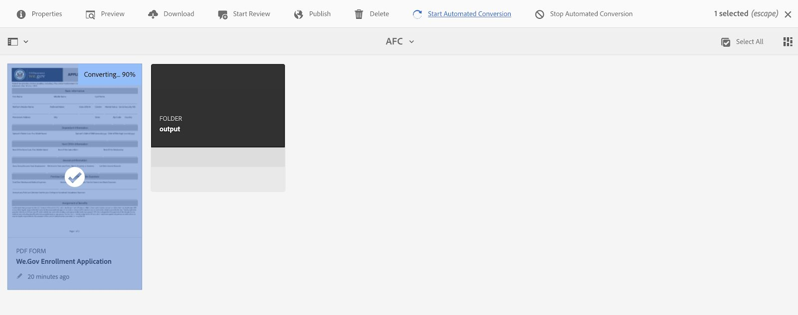

# We.Gov 및 We.Finance 참조 사이트 연습 {#we-gov-reference-site-walkthrough}

## 전제 조건 {#pre-requisites}

[We.Gov 및 We.Finance 참조 사이트](../../forms/using/forms-install-configure-gov-reference-site.md)에 설명된 대로 참조 사이트를 설정합니다.

## 사용자 스토리 {#user-story}

* AEM Forms

   * 자동 양식 변환
   * 작성
   * 양식 데이터 모델/데이터 소스

* AEM Forms

   * 데이터 캡처
   * (선택 사항) 데이터 통합(MS Dynamics)
   * (선택 사항) Adobe Sign

* 워크플로우
* 이메일 알림
* (선택 사항) 고객 커뮤니케이션

   * 인쇄 채널
   * 웹 채널

* Adobe Analytics
* 데이터 소스 통합

### 가상 사용자 및 그룹 {#fictitious-users-and-groups}

We.Gov 데모 패키지는 다음과 같은 내장 가상 사용자와 함께 제공됩니다.

* **탄야**:정부 기관의 서비스 대상 시민


* **조지 랑**:We.Gov 대행사 비즈니스 애널리스트


* **카밀라 산토스**:We.Gov 에이전시 CX 리드


다음 그룹도 포함됩니다.

* **We.Gov Forms 사용자**

   * George Lang(회원)
   * 카밀라 산토스(멤버)

* **We.Gov 사용자**

   * George Lang(회원)
   * 카밀라 산토스(멤버)
   * Aya Tan(구성원)

### 데모 개요 용어 범례 {#demo-overview-terms-legend}

1. **가장**:AEM 데모에서 정의된 사용자 및 그룹.
1. **단추**:탐색 시 색상이 지정된 사각형 또는 원 모양의 화살표
1. **클릭**:사용자 스토리에서 작업을 실행하려면
1. **링크**:We.Gov 사이트의 주 메뉴 상단에 있습니다.
1. **사용자 지침**:사용자의 스토리를 탐색할 때 따라야 할 일련의 숫자 단계입니다.
1. **Forms 포털**: *https://&lt;aemserver>:&lt;port>/content/we-gov/formsportal.html*
1. **모바일 보기**: We.Gov 사용자는 크기가 다시 조정된 브라우저로 모바일 보기를 복제할 수 있습니다.
1. **데스크탑 보기**:We.gov 사용자가 랩탑 또는 데스크탑에서 데모를 볼 수 있습니다.
1. **사전 화면 입력기 양식**:We.Gov 사이트의 홈 페이지에 있는 양식
1. **적응형 양식**:We.gov 데모를 위한 등록 신청 양식

   *https://&lt;aemserver>:&lt;port>/content/forms/af/adobe-gov-forms/enrollment-application-for-health-benefits.html*

1. **Adobe We.Gov 사이트**: *https://&lt;aemserver>:&lt;port>/content/we-gov/home.html*
1. **Adobe 받은 편지함**:AEM 백엔드에 있는  [위쪽 메뉴 ](assets/bell.svg) 모음 Bell 아이콘

   *https://&lt;aemserver>:&lt;port>/aem/start.html*

1. **이메일 클라이언트**:이메일 보기 기본 설정(Gmail, Outlook)
1. **CTA**:클릭유도문안
1. **탐색**:브라우저 페이지에서 특정 참조점을 찾으려면
1. **AFC**:automated forms conversion

## automated forms conversion (Camila) {#automated-forms-conversion}

**이 섹션**:CX Lead 의 Camila 에는 기존 PDF 기반 양식이 있습니다. 이 양식은 종이 기반 프로세스의 일부로 사용됩니다. 현대화 노력의 일환으로 이 PDF 양식을 사용하여 최신 적응형 Forms을 자동으로 제작하고자 합니다.

### automated forms conversion - We.Gov(Camila) {#automated-forms-conversion-wegov}

1. *https://&lt;aemserver>:&lt;port>/aem/start.html*&#x200B;로 이동합니다.

1. 다음으로 로그인:
   * **사용자**:camila.santos
   * **암호**:암호
1. 메인 페이지에서 Forms > Forms &amp; 문서 > AEM Forms We.gov Forms > AFC를 선택합니다.
1. Camila는 PDF를 AEM Forms에 업로드합니다.

   

1. 그런 다음 카밀라는 PDF 양식을 선택하고 **자동 변환 시작**&#x200B;을 클릭하여 변환 프로세스를 시작합니다. 양식을 변환한 경우 **변환 덮어쓰기**&#x200B;를 클릭해야 할 수 있습니다.

   >[!NOTE]
   >
   >AFC의 설정은 최종 사용자에 대해 미리 구성되므로 변경하지 말아야 합니다.

   * **옵션**:액세스 가능한 초단기 테마를 사용하려면 응용 양식 테마 지정을 클릭하고 옵션 목록에 나타나는 액세스 가능한 초단기 테마를 선택하면 됩니다.

   

   

   전환 중에 완료 백분율이 표시됩니다. 상태가 **변환됨**&#x200B;으로 표시되면 **출력** 폴더를 클릭하고 적응형 양식을 선택한 다음 **편집**&#x200B;을 클릭하여 변환된 양식을 엽니다.

1. 카밀라 카밀라는 그 양식을 검토하고 모든 분야가 있다는 것을 확실히 한다

   

1. 카밀라 이후 양식 편집을 시작합니다. [루트 패널] > [편집](렌치) > [패널 레이아웃] 드롭다운 메뉴에서 [맨 위에 탭 선택] > [확인란]을 선택합니다.

   

1. 이후 카밀라 카밀라는 최종 제품을 만들기 위해 필요한 모든 CSS 및 필드 변경 작업을 추가합니다.

   

### 양식 데이터 모델 및 데이터 소스(카메라) {#data-sources}

**이 섹션**:문서가 변환되어 응용 양식을 생성되면 Camila는 응용 양식을 데이터 소스에 연결해야 합니다.

1. Camila는 [Automated forms conversion - We.Gov](#automated-forms-conversion-wegov)에서 변환된 양식의 속성을 엽니다.

1. 그런 다음 Camila는 옵션 목록에서 선택 드롭다운 > We.gov 등록 FDM을 선택합니다.

1. 저장 및 닫기 단추를 클릭합니다.

   

1. Camila는 **output** 폴더를 클릭하고 응용 양식을 선택하고 **편집**&#x200B;을 클릭하여 완료된 We.Gov 양식을 엽니다.
1. Camila가 응용 양식 필드를 선택하고 을 클릭합니다. **바인딩 참조** 필드를 사용하여 양식 데이터 모델 엔티티로 바인딩을 만듭니다. 적응형 양식의 모든 필드에 대해 이 단계를 반복합니다.

### 양식 액세서빌러티 테스트(카메라) {#form-accessibility-testing}

또한 Camila는 작성된 컨텐츠가 기업 표준에 따라 올바로 구축되어 완벽하게 액세스할 수 있는지 확인합니다.

1. Camila는 **output** 폴더를 클릭하고 응용 양식을 선택하고 **미리 보기**&#x200B;를 클릭하여 완료된 We.Gov 양식을 엽니다.

1. Chrome Developer Tool에서 감사 탭을 엽니다.

1. 적응형 양식의 유효성을 검사하기 위해 액세서빌러티 검사를 수행합니다.

   

## 적응형 양식 모바일 보기 데모(Aya) {#mobile-view-demo}

**이 조항은 시연 전에 행해져야 한다.**

**사용자 지침:**

1. 탐색:*https://&lt;aemserver>:&lt;port>/content/we-gov/home.html*
1. 다음으로 로그인:

   1. **사용자**:aya.tan
   1. **암호**:암호

1. 브라우저 창의 크기를 다시 조정하거나 브라우저의 에뮬레이터를 사용하여 모바일 장치 크기를 복제할 수 있습니다.

### We.Gov 웹 사이트(Aya) {#aya-user-story-we-gov-website}


**이 섹션**:아야는 시민이다. 지인으로부터 공공 기관에서 서비스를 받을 수 있다는 소식을 들었다. 아야는 휴대폰으로 웹 사이트를 탐색하여 자신이 이용할 수 있는 서비스에 대해 자세히 알아본다.

### We.Gov Pre-Screener (Aya) {#aya-user-story-we-gov-pre-screener}

Aya는 자신의 휴대폰에 간단한 적응형 양식을 기재함으로써 그녀의 자격 여부를 확인하기 위해 몇 가지 질문에 대답합니다.

**사용자 지침:**

1. 각 드롭다운 필드에서 선택합니다.

   >[!NOTE]
   >
   >사용자가 연간 $200,000 이상을 버는 경우, 이 사용자는 적용되지 않습니다.

1. &quot;**자격 조건?**” 단추.
1. 계속하려면 &quot;**지금 적용**&quot; 단추를 클릭합니다.

   

### We.Gov 응용 양식(Aya) {#aya-user-story-we-gov-adaptive-form}

Aya는 자신이 자격이 있다는 것을 알게 되었고 자신의 모바일 장치에서 서비스를 요청하기 위해 신청서를 채우기 시작합니다.

Aya는 서비스 요청 애플리케이션을 완료하기 전에 집에서 일부 문서를 검토해야 합니다. 모바일 디바이스에서 애플리케이션을 저장하고 종료합니다.

**사용자 지침:**

1. 기본 정보 필드를 채웁니다. 다음은 필수 필드와 드롭다운입니다.

   1. 기본 정보

      1. 이름
      1. 성
      1. DOB
      1. 이메일

1. 다음 **동적 논리**&#x200B;를 사용하여 **가족 상태** 드롭다운을 사용하여 동적 기능을 보여줍니다.

   1. **단일**:킨 패널 옆에 표시
   1. **결혼한 사람**:사용 가능한 종속 패널 표시
   1. **이혼함**:킨 패널 옆에 표시
   1. **과부**:킨 패널 옆에 표시
   1. **아이들이 있나요?**:(예/아니요) 하위 종속 패널을 표시하는 라디오 단추.

      1. (추가/제거) 단추를 클릭하여 여러 하위 종속 패널을 추가/제거합니다.

1. 회색 메뉴 모음에서 오른쪽 화살표를 클릭합니다.
1. 하단에 있는 저장 버튼을 클릭합니다.

   

## 데스크톱 데모 {#desktop-demo}

**이 섹션:** Aya는 필요한 정보를 찾아서 데스크탑에서 애플리케이션을 다시 시작합니다. Aya는 온라인 양식 포털로 이동하여 응용 프로그램을 다시 시작합니다. 몇 가지 간단한 사용자 정의 기능을 사용하여 기관은 애플리케이션을 다시 시작할 수 있는 링크를 자동으로 생성하고 이메일로 전송할 수 있습니다.

### 지속적인 적응형 양식(Aya) {#aya-user-story-continued-adaptive-form}

**사용자 지침:**

1. *https://&lt;aemserver>:&lt;port>/content/we-gov/home.html*&#x200B;로 이동합니다.
1. 탐색 막대에서 &quot;**온라인 서비스**&quot;를 클릭합니다.
1. &quot;Draft Forms&quot; 패널에서 기존 &quot;Registered Application For Health Benefits&quot;를 선택합니다.

   

   모양과 느낌은 동일하므로 데이터를 다시 입력할 필요가 없습니다.

   **사용자 지침:**

1. 오른쪽 서클 CTA를 클릭하여 다음 섹션으로 이동합니다.

   

   양식은 Aya의 마지막 항목 지점까지 채워집니다. Aya는 모든 정보를 입력했고 제출할 준비가 되었다.

   

   >[!NOTE]
   >
   >Aya가 전화 번호 필드를 채우면 대시, 공백 또는 하이픈 없이 연속적인 11자리 숫자로 채워야 합니다.

   Aya 제출 후 감사 페이지가 수신됩니다. 원할 경우, Adobe Sign에서 전자 방식으로 기록 문서에 서명할 수 있는 전자 메일을 받게 됩니다.

### 선택 사항:Adobe Sign (Aya) {#adobe-sign}

**사용자 지침:**

1. 이메일 클라이언트로 이동하여 Adobe Sign 이메일을 찾습니다.
1. Adobe Sign 링크를 클릭합니다.

   

**사용자 지침:**

1. &quot;**동의함**&quot; 상자를 선택합니다.
1. &quot;**수락**&quot;을 클릭합니다.
1. 검토한 문서의 맨 아래로 스크롤합니다.
1. 강조 표시된 노란색 탭을 클릭하여 문서에 서명합니다.

    

## 정부 에이전트(조지) {#government-agent-george}


**이 섹션:** George는 정부 기관 Aya의 비즈니스 분석가로 서비스를 요청하는 사람입니다. George는 검토용으로 자신에게 할당된 모든 서비스 요청 애플리케이션을 볼 수 있는 단일 대시보드를 제공합니다.

### AEM 받은 편지함(George) {#george-user-story-aem-inbox}

**사용자 지침:**

1. *https://&lt;aemserver>:&lt;port>/aem/start.html*&#x200B;로 이동합니다.
1. 사용자 아이콘(오른쪽 위 모서리)을 클릭하고 &quot;**로그아웃**&quot; 또는 &quot;**가장 대상**&quot; 메뉴 옵션을 사용합니다(현재 관리 사용자와 로그인되어 있는 경우).

   1. 다음으로 로그인:

      1. **사용자:** george.lang
      1. **암호:** 암호
   1. 또는 가장:

      1. &quot;**가장 대상**&quot; 필드에 &quot;**George**&quot;을 입력합니다.

      1. 사칭 확인을 클릭합니다.


1. 오른쪽 상단 모서리에서 알림(벨) 아이콘을 클릭합니다.
1. &quot;**모두 보기**&quot;를 클릭하여 받은 편지함으로 이동합니다.
1. 받은 편지함에서 최신 &quot;**Health Benefits Application Review**&quot; 작업을 엽니다.

   

### 선택 사항:AEM 받은 편지함 및 MS Dynamics(George) {#george-user-story-aem-inbox-and-ms-dynamics}

데이터 통합 및 자동화된 워크플로우 덕분에 데이터를 제출할 때 자동으로 생성된 CRM 레코드와 함께 Aya의 애플리케이션이 나타납니다.

**사용자 지침:**

1. 읽기 전용 적응형 양식을 열고 검사합니다.
1. &quot;**MS Dynamics**&quot; 단추를 클릭하여 MS Dynamics 레코드를 새 창에서 엽니다.
1. CRM에서는 모든 정보를 업데이트할 수 있습니다

   1. Dynamics에서 바로 일부 검토 노트를 추가할 수도 있습니다.

1. 닫았다가 AEM 받은 편지함으로 돌아갑니다.

   

### AEM 받은 편지함(George) {#george-user-story-back-to-aem-inbox}

George는 Aya의 응용 프로그램을 승인하고 기존의 자동 작업 과정 덕분에 확인 이메일도 Aya로 전송됩니다.

**사용자 지침:**

1. 왼쪽 위 모서리로 이동하고 &quot;**승인**&quot;을 클릭하여 애플리케이션을 승인합니다.
1. 모달에서 CX 리드에 대한 메시지를 남길 수 있습니다.
1. 완료를 클릭합니다.
1. (시민 역할) Aya로 보낸 이메일을 보려면 이메일 클라이언트를 엽니다.

   

## CX 리드(카메라) {#cx-lead-camila}


**본 섹션:** CX Lead는 Aya와 환영 전화 통화를 설정하여 승인된 공공 기관 서비스를 사용하는 방법을 설명합니다.

### (선택 사항) AEM 받은 편지함 및 MS Dynamics {#camila-user-story-aem-inbox-ms-dynamics}

**사용자 지침:**

1. *https://&lt;aemserver>:&lt;port>/aem/start.html*&#x200B;로 이동합니다.
1. 사용자 아이콘(오른쪽 위 모서리)을 클릭하고 &quot;**로그아웃**&quot; 또는 &quot;**가장 대상**&quot; 메뉴 옵션을 사용합니다(현재 관리 사용자와 로그인되어 있는 경우).

   1. 다음으로 로그인:

      1. **사용자**:camila.santos
      1. **암호**:암호
   1. 또는 가장:

      1. &quot;**가장 대상**&quot; 필드에 &quot;**카메라**&quot;을 입력합니다.

      1. 사칭 확인을 클릭합니다.


1. 오른쪽 상단 모서리에서 알림(벨) 아이콘을 클릭합니다.
1. &quot;**모두 보기**&quot;를 클릭하여 받은 편지함으로 이동합니다.
1. 받은 편지함에서 최신 &quot;**새 연락처 승인**&quot; 작업을 엽니다.


**(선택 사항) 사용자 지침:**

1. 읽기 전용 적응형 양식을 열고 검사합니다.
1. &quot;**MS Dynamics**&quot; 단추를 클릭하여 MS Dynamics 레코드를 새 창에서 엽니다.
1. CRM에서는 모든 정보를 업데이트할 수 있습니다

   1. 원할 경우, Dynamics에서 직접 새 호출 활동을 추가합니다.
   1. &quot;**활동**&quot; 섹션을 엽니다.
   1. &quot;**새 전화 통화**&quot; 옵션을 클릭합니다.
   1. 전화 통화 세부 사항을 추가합니다.
   1. 창을 저장하고 닫습니다.

1. AEM에서 왼쪽 위 모서리로 이동하고 &quot;**제출**&quot;을 클릭하여 애플리케이션을 제출합니다.
1. 모달에서 메시지를 남길 수 있습니다.
1. 완료를 클릭합니다.

    

## (선택 사항) 환영 키트 시민(Aya) {#welcome-kit-citizen-aya}

**이 섹션:** Aya는 자신의 이점을 요약하고 채울 양식 필드도 포함하는 대화형 통신에 대한 링크가 포함된 이메일을 받습니다. PDF 혜택 설명서를 첨부하고 이메일의 인터랙티브한 커뮤니케이션 문자에 연결할 수 있습니다(인터랙티브한 커뮤니케이션과 동일한 테마/브랜딩).

### 이메일 클라이언트 알림(Aya) {#aya-user-story-email-client}

**사용자 지침:**

1. 환영 키트 이메일을 찾아 엽니다.
1. 페이지 아래쪽에 있는 PDF 첨부 파일로 스크롤합니다.
1. 을 클릭하여 PDF 첨부 파일을 엽니다.
1. 이메일 클라이언트에서 다시 스크롤하고 &quot;**온라인 시작 키트 보기**&quot;를 클릭합니다.

   1. 동일한 문서의 웹 채널 버전이 열립니다.

1. PDF에 직접 빠르게 참조하려면:

   *https://&lt;aemserver>:&lt;port>/aem/formdetails.html/content/dam/formsanddocuments/adobe-gov-forms/welcome-handbook/we-gov-welcome-handbook*

1. IC에 대한 빠른 참조를 직접 보려면:

   *https://&lt;aemserver>:&lt;port>/content/dam/formsanddocuments/adobe-gov-forms/welcome-handbook/we-gov-welcome-handbook/jcr:content?channel=web&amp;mode=preview&amp;wcmmode=disabled*

    

## 갱신 알림 시민(Aya) {#renewal-reminder-citizen-aya}

**이 섹션:** Camila는 1년 후 통신 미리 알림도 예약합니다. (자동화/실행 및 이메일을 실행하는 워크플로우 단계).

### 이메일 클라이언트 알림(Aya) {#aya-user-story-email-client-updated}

**사용자 지침:**

1. 이메일 클라이언트로 이동합니다.
1. 갱신 미리 알림 이메일을 찾아 엽니다.
1. 응용 양식을 열려면 &quot;**새 응용 프로그램 제출**&quot; 단추를 클릭합니다.

   1. 이 섹션은 2단계에서 데이터를 미리 채우도록 지원하기 위해 의도적으로 비어 있습니다.

   

## (선택 사항) 양식 데이터 모델(카메라) {#form-data-model}

**이 섹션**:Camila는 AEM Forms 데이터 통합으로 이동하여 빠른 테스트를 실행하여 양식 데이터 모델 통합을 통해 외부 데이터 소스로 전송된 정보가 실제로 존재하는지 확인할 수 있습니다.

### 양식 데이터 모델(카메라) {#form-data-model-camila}

**이 섹션**:Camila는 Data Sources 페이지로 이동하여 서버가 Derby 데이터베이스 내에서 복제한 데이터의 유효성을 확인합니다.

1. 사용자 경험이 완료되고 사용자 제출이 완료되면 Camila는 AEM Forms(**Forms** > **데이터 통합**) 내의 데이터 소스 탭으로 이동합니다.

1. 그런 다음 Camila가 AEM Forms **We.gov FDM**&#x200B;을 선택한 다음 **We.gov 등록 FDM**&#x200B;을 편집합니다.

1. 그런 다음 Camila가 테스트할 **연락처** > **서비스 읽기**&#x200B;를 선택합니다.

   

1. 그런 다음 Camila는 연락처 ID를 사용하여 테스트 서비스를 제공한 다음 [테스트] 단추를 클릭합니다. 예를 들어 양식을 제출한 경우 1 또는 2입니다. 양식을 제출하지 않은 경우 데이터가 반환되지 않습니다.

   

1. 그러면 Camila는 데이터가 데이터 원본에 성공적으로 삽입되었는지 확인할 수 있습니다.

   * Derby DS 내의 데이터는 다음 형식과 유사합니다.

   ```xml
      [
         {
         "ADDRESS_COUNTRY": "USA",
         "LAST_NAME": "Tan",
         "ADDRESS_CITY": "New York",
         "FIRST_NAME": "Aya",
         "ADDRESS_STATE": "AL",
         "ADDRESS_LINE1": "123 Street crescent",
         "GENDER_CODE": "2",
         "ADDRESS_LINE2": "123 Street crescent",
         "ADDRESS_POSTAL_CODE": "90210",
         "BIRTH_DATE": "1991-12-12",
         "CONTACT_ID": 1,
         "MIDDLE_NAME": "M",
         "HAS_CHILDREN_CODE": "0"
         }
   ]
   ```

## (선택 사항) 분석(카메라) {#analytics-cx-lead-camila}

**이 섹션:** Camila는 대시보드로 이동하여 서비스 요청 양식을 작성하고 포기하는 국민 %, 제출 요청부터 승인/거부 응답에 이르는 평균 시간, 시민에게 전송한 혜택 핸드북에 대한 참여 통계 등과 같은 기관 KPI(Enterprise Edition)를 볼 수 있습니다.

### Adobe Analytics 사이트 보고(카메라) {#camila-reviews-sites-reporting-we-gov-adobe-analytics}

1. *https://&lt;aemserver>:&lt;port>/sites.html/content*
1. 사이트 페이지를 보려면 &quot;**AEM Forms We.Gov 사이트**&quot;를 선택합니다.
1. 사이트 페이지(예: 홈) 중 하나를 선택하고 &quot;**분석 및 Recommendations**&quot;을 선택합니다.

   

1. 이 페이지에는 AEM Sites 페이지와 관련된 Adobe Analytics에서 가져온 정보가 표시됩니다(참고:이 정보는 디자인되어 Adobe Analytics에서 정기적으로 새로 고쳐지며 실시간으로 표시되지 않습니다.)

   

1. 3단계에서 액세스한 페이지 보기 페이지로 돌아가면 표시 설정을 &quot;**목록 보기**&quot;에서 항목을 보도록 변경하여 페이지 보기 정보를 볼 수도 있습니다.
1. &quot;**보기**&quot; 드롭다운 메뉴를 찾아 &quot;**목록 보기**&quot;를 선택합니다.

   

1. 동일한 메뉴에서 &quot;**설정 보기**&quot;를 선택하고 &quot;**분석**&quot; 섹션에서 표시할 열을 선택합니다.

   

1. 새 열을 사용할 수 있게 하려면 &quot;**업데이트**&quot;를 클릭합니다.

   

### Adobe Analytics Forms 보고(카메라) {#camila-reviews-forms-reporting-we-gov-adobe-analytics}

1. 다음으로 이동

   *https://&lt;aemserver>:&lt;port>/aem/forms.html/content/dam/formsanddocuments/adobe-gov-forms*

1. &quot;**Registered Application For Health Benefits**&quot; 적응형 양식을 선택하고 &quot;**분석 보고서**&quot; 옵션을 선택합니다.

   

1. 페이지가 로드될 때까지 기다렸다가 Analytics 보고서 데이터를 봅니다.

   

