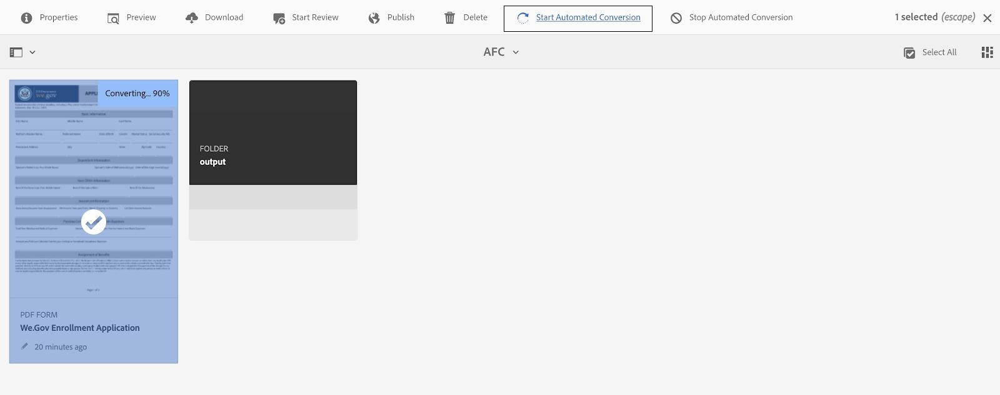

# We.Gov 및 We.Finance 참조 사이트 안내 {#we-gov-reference-site-walkthrough}

## 전제 조건 {#pre-requisites}

에 설명된 대로 참조 사이트를 설정합니다. [We.Gov 및 We.Finance 참조 사이트 설정 및 구성](../../forms/using/forms-install-configure-gov-reference-site.md).

## 사용자 스토리 {#user-story}

* AEM Forms

   * 자동 양식 변환
   * 작성
   * 양식 데이터 모델/데이터 소스

* AEM Forms

   * 데이터 캡처
   * (선택 사항) 데이터 통합(MS Dynamics)
   * (선택 사항) Adobe Sign

* 워크플로
* 이메일 알림
* (선택 사항) 고객 커뮤니케이션

   * 인쇄 채널
   * 웹 채널

* Adobe Analytics
* 데이터 소스 통합

### 가상 사용자 및 그룹 {#fictitious-users-and-groups}

We.Gov 데모 패키지는 다음과 같은 기본 제공 가상 사용자와 함께 제공됩니다.

* **아야 탄**: 정부 기관에서 서비스를 받을 수 있는 시민


* **조지 랭**: We.Gov 비즈니스 분석가


* **카밀라 산토스**: We.Gov CX 리드


다음 그룹도 포함됩니다.

* **We.Gov Forms 사용자**

   * George Lang(멤버)
   * Camila Santos(멤버)

* **We.Gov 사용자**

   * George Lang(멤버)
   * Camila Santos(멤버)
   * Aya Tan(멤버)

### 데모 개요 용어 범례 {#demo-overview-terms-legend}

1. **가장**: AEM 데모에서 정의된 사용자 및 그룹.
1. **단추**: 탐색할 색상 사각형 또는 원형 화살표.
1. **클릭**: 사용자 스토리의 작업을 실행합니다.
1. **링크**: We.Gov 사이트의 기본 메뉴 상단에 있습니다.
1. **사용자 지침**: 사용자 스토리를 탐색할 때 따라야 할 일련의 숫자 단계.
1. **Forms 포털**: *https://&lt;aemserver>:&lt;port>/content/we-gov/formsportal.html*
1. **모바일 보기**:We.Gov 사용자는 크기가 조정된 브라우저로 모바일 보기를 복제합니다.
1. **데스크탑 보기**: We.gov 사용자가 랩톱 또는 데스크탑에서 데모를 볼 수 있습니다.
1. **사전 스크리너 양식**: We.Gov 사이트의 홈 페이지에 있는 양식.
1. **적응형 양식**: We.gov 데모용 등록 애플리케이션 양식.

   *https://&lt;aemserver>:&lt;port>/content/forms/af/adobe-gov-forms/enrollment-application-for-health-benefits.html*

1. **Adobe We.Gov 사이트**: *https://&lt;aemserver>:&lt;port>/content/we-gov/home.html*
1. **Adobe 받은 편지함**: 상단 메뉴 막대에 있음 [벨 아이콘](assets/bell.svg) AEM 백엔드에서.

   *https://&lt;aemserver>:&lt;port>/aem/start.html*

1. **이메일 클라이언트**: 이메일을 보는 기본 방법(Gmail, Outlook)
1. **CTA**: 클릭 유도 문안
1. **탐색**: 브라우저 페이지에서 특정 참조점을 찾습니다.
1. **AFC**: AUTOMATED FORMS CONVERSION

## Automated forms conversion(카밀라) {#automated-forms-conversion}

**이 섹션**: Camila the CX Lead 에는 종이 문서 기반 프로세스의 일부로 사용된 기존 PDF 기반 양식이 있습니다. 현대화 노력의 일환으로 이 PDF 양식을 사용하여 자동으로 새로운 최신 적응형 Forms을 만들려고 합니다.

### Automated forms conversion - We.Gov (카밀라) {#automated-forms-conversion-wegov}

1. 다음으로 이동 *https://&lt;aemserver>:&lt;port>/aem/start.html*

1. 다음으로 로그인:
   * **사용자**: camila.santos
   * **암호**: 암호
1. 메인 페이지에서 Forms > Forms 및 문서 > AEM Forms We.gov Forms > AFC 를 선택합니다.
1. Camila가 AEM Forms에 PDF을 업로드합니다.

   

1. 그런 다음 카밀라가 PDF 양식을 선택하고 클릭 **자동화된 변환 시작** 변환 프로세스를 시작합니다. 다음을 클릭해야 할 수 있습니다. **전환 덮어쓰기** 양식을 전환한 경우.

   >[!NOTE]
   >
   >AFC의 설정은 최종 사용자에게 사전 구성되어 있으므로 변경해서는 안 됩니다.

   * **선택 사항**: 액세스 가능한 Ultramarine 테마를 사용하려면 적응형 양식 테마 지정 을 클릭하고 옵션 목록에 표시되는 액세스 가능한 Ultramarine 테마를 선택하십시오.

   

   

   전환 중 완료율 상태가 표시됩니다. 상태가 표시되면 **전환됨**&#x200B;를 클릭하고 **출력** 폴더에서 적응형 양식을 선택하고 **편집** 변환 양식을 엽니다.

1. 그런 다음 Camilla 양식을 검토하고 모든 필드가 있는지 확인합니다.

   

1. 그런 다음 Camilla가 양식 편집을 시작합니다. 루트 패널 > 편집(렌치) > 패널 레이아웃 드롭다운 메뉴에서 맨 위에 있는 탭 선택 > 확인란을 선택합니다.

   

1. 그런 다음 Camilla는 최종 제품을 만들기 위해 필요한 모든 CSS와 필드 변경을 추가합니다.

   

### 양식 데이터 모델 및 데이터 소스(카밀라) {#data-sources}

**이 섹션**: 문서가 적응형 양식으로 변환되고 생성되면 Camila는 적응형 양식을 데이터 소스에 연결해야 합니다.

1. Camila는에서 변환된 양식의 속성을 엽니다. [Automated forms conversion - We.Gov](#automated-forms-conversion-wegov).

1. 그런 다음 Camila는 양식 모델 > 선택 출처 드롭다운에서 양식 데이터 모델 선택 > 선택 옵션 목록에서 We.gov 등록 FDM을 선택합니다.

1. 저장 및 닫기 단추를 클릭합니다.

   

1. Camila가 **출력** 폴더, 적응형 양식 선택 및 클릭 **편집** 완성된 We.Gov 양식을 엽니다.
1. Camila가 적응형 양식 필드를 선택하고 클릭 . 이 디자이너는 다음을 사용하여 양식 데이터 모델 엔터티로 바인딩을 만듭니다. **바인드 참조** 필드. 그녀는 적응형 양식의 모든 필드에 대해 이 단계를 반복합니다.

### 양식 접근성 테스트(카밀라) {#form-accessibility-testing}

또한 Camila는 작성된 콘텐츠가 회사 표준에 따라 올바르게 구축되고 완전히 액세스할 수 있는지 확인합니다.

1. Camila가 **출력** 폴더, 적응형 양식 선택 및 클릭 **미리 보기** 완성된 We.Gov 양식을 엽니다.

1. Chrome 개발자 도구 내에서 감사 탭을 엽니다.

1. 적응형 양식의 유효성을 검사하기 위해 접근성 검사를 수행합니다.

   

## 적응형 양식 모바일 보기 데모(Aya) {#mobile-view-demo}

**이 섹션은 데모에 앞서 수행해야 합니다.**

**사용자 지침:**

1. 다음으로 이동: *https://&lt;aemserver>:&lt;port>/content/we-gov/home.html*
1. 다음으로 로그인:

   1. **사용자**: aya.tan
   1. **암호**: 암호

1. 브라우저 창의 크기를 다시 조정하거나 브라우저의 에뮬레이터를 사용하여 모바일 디바이스 크기를 복제합니다.

### We.Gov 웹 사이트 (Aya) {#aya-user-story-we-gov-website}


**이 섹션**: Aya는 시민입니다. 그녀는 친구로부터 자신이 정부 기관으로부터 서비스를 받을 자격이 될지 모른다는 말을 듣는다. Aya는 자격이 되는 서비스에 대한 자세한 내용을 알아보기 위해 휴대 전화에서 We.Gov 웹 사이트로 이동합니다.

### We.Gov 사전 스크리너(Aya) {#aya-user-story-we-gov-pre-screener}

Aya는 휴대폰에 짧은 적응형 양식을 작성하여 자격이 있는지 확인하기 위해 몇 가지 질문에 답변합니다.

**사용자 지침:**

1. 각 드롭다운 필드에서 을(를) 선택합니다.

   >[!NOTE]
   >
   >사용자가 $200,000/yr을 초과하는 수익을 얻는 경우 자격이 없습니다.

1. 을(를) 클릭합니다&#x200B;**제가 자격이 되나요?**&quot; 단추.
1. 을(를) 클릭합니다&#x200B;**지금 적용**&#x200B;계속하려면 &quot; 버튼을 누르십시오.

   

### We.Gov 적응형 양식(Aya) {#aya-user-story-we-gov-adaptive-form}

Aya는 자신이 자격이 있음을 알고 모바일 장치에서 서비스를 요청하기 위해 애플리케이션을 채우기 시작합니다.

Aya는 서비스 요청 신청을 완료하기 전에 집에서 몇 가지 서류를 검토해야 합니다. 그녀는 모바일 장치에서 애플리케이션을 저장하고 종료합니다.

**사용자 지침:**

1. 기본 정보 필드에 내용을 입력합니다. 필수 필드 및 드롭다운은 다음과 같습니다.

   1. 기본 정보

      1. 이름
      1. 성
      1. DOB
      1. 이메일

1. 다음 사용 **동적 논리** 을 사용하여 동적 기능을 보여 줍니다. **가족 상태** 드롭다운:

   1. **단일**: 다음 스킨 패널 표시
   1. **기혼**: 부부 종속 패널 표시
   1. **이혼**: 다음 스킨 패널 표시
   1. **과부**: 다음 스킨 패널 표시
   1. **아이가 있나요?**: (예/아니요) 라디오 단추를 클릭하여 하위 종속 패널을 표시합니다.

      1. (추가/제거) 단추를 사용하여 여러 하위 종속 패널을 추가/제거합니다.

1. 회색 메뉴 막대에서 오른쪽 화살표를 클릭합니다.
1. 맨 아래에 있는 저장 버튼을 클릭합니다.

   

## 데스크탑 데모 {#desktop-demo}

**이 섹션:** 집으로 돌아온 Aya는 필요한 정보를 찾아 데스크톱에서 애플리케이션을 다시 시작합니다. Aya는 온라인 양식 포털로 이동하여 응용 프로그램을 다시 시작합니다. 간단한 사용자 지정을 통해 에이전시는 자동으로 링크를 생성하고 이메일로 애플리케이션을 재개할 수도 있습니다.

### 계속 적응형 양식(Aya) {#aya-user-story-continued-adaptive-form}

**사용자 지침:**

1. 다음으로 이동 *https://&lt;aemserver>:&lt;port>/content/we-gov/home.html*
1. 탐색 모음에서 클릭 을 선택합니다.**온라인 서비스**&quot;.
1. &quot;초안 Forms&quot; 패널에서 기존 &quot;의료 혜택 등록 신청서&quot;를 선택합니다.

   

   모양과 느낌은 동일하며 데이터를 다시 입력할 필요가 없습니다.

   **사용자 지침:**

1. 오른쪽 원 CTA를 클릭하여 다음 섹션으로 이동합니다.

   

   양식은 Aya가 마지막으로 입력한 시점까지 채워집니다. Aya는 모든 정보를 입력했고 제출할 준비가 되었습니다.

   

   >[!NOTE]
   >
   >아야는 전화번호 필드를 작성할 때 대시, 공백 또는 하이픈이 없는 연속 11자리 숫자로 작성해야 합니다.

   제출 후 Aya는 감사 페이지를 받습니다. 선택적으로, 그녀는 Adobe Sign으로 기록 문서에 전자 방식으로 서명하기 위해 열 수 있는 이메일을 받게 됩니다.

### 선택 사항: Adobe Sign (Aya) {#adobe-sign}

**사용자 지침:**

1. 이메일 클라이언트로 이동하여 Adobe Sign 이메일을 찾습니다.
1. Adobe Sign 링크를 클릭합니다.

   

**사용자 지침:**

1. &quot;&quot;을(를) 확인합니다.**동의함**&quot; 상자.
1. 클릭 &quot;**Accept**&quot;.
1. 검토한 문서의 아래쪽으로 스크롤합니다.
1. 강조 표시된 노란색 탭을 클릭하여 문서에 서명합니다.

    

## 정부 대리인(George) {#government-agent-george}


**이 섹션:** George는 정부 기관 Aya의 비즈니스 분석가입니다 서비스에 요청 . George는 검토를 위해 자신에게 할당된 모든 서비스 요청 애플리케이션을 볼 수 있는 단일 대시보드를 가지고 있습니다.

### AEM 받은 편지함 (George) {#george-user-story-aem-inbox}

**사용자 지침:**

1. 다음으로 이동 *https://&lt;aemserver>:&lt;port>/aem/start.html*
1. 사용자 아이콘(오른쪽 상단)을 클릭하고 &quot;**로그아웃**&quot; 또는 &quot;**다음 사용자로 가장**&#x200B;현재 관리자 권한으로 로그인한 경우 메뉴 옵션을 사용할 수 있습니다.

   1. 다음으로 로그인:

      1. **사용자:** george.lang
      1. **암호:** 암호
   1. 또는 가장:

      1. 유형 &quot;**조지**&#x200B;의 &quot;**다음 사용자로 가장**&quot; 필드.

      1. 가장하려면 [확인]을 클릭하십시오.


1. 오른쪽 상단 모서리에서 알림(벨) 아이콘을 클릭합니다.
1. 클릭 &quot;**모두 보기**&#x200B;받은 편지함으로 이동합니다.
1. 받은 편지함에서 최신 &quot;**의료 보험 적용 검토**&quot; 작업.

   

### 선택 사항: AEM 받은 편지함 및 MS Dynamics(George) {#george-user-story-aem-inbox-and-ms-dynamics}

데이터 통합 및 자동화된 워크플로 덕분에 데이터가 제출될 때 자동으로 생성된 CRM 레코드와 함께 Aya의 애플리케이션이 나타납니다.

**사용자 지침:**

1. 읽기 전용 적응형 양식을 열고 검사합니다.
1. 를 클릭합니다.**MS Dynamics 열기**&quot; 버튼을 클릭하여 새 창에서 MS Dynamics 레코드를 엽니다.
1. CRM에서 모든 정보를 업데이트할 수 있습니다

   1. 필요한 경우 Dynamics에서 직접 일부 검토 노트를 추가합니다.

1. 을 닫고 AEM 받은 편지함으로 돌아갑니다.

   

### AEM 받은 편지함으로 돌아가기(George) {#george-user-story-back-to-aem-inbox}

George는 Aya의 애플리케이션을 승인하며, 기존의 자동화된 워크플로 덕분에 확인 이메일도 Aya에게 전송됩니다.

**사용자 지침:**

1. 왼쪽 상단 모서리로 이동하여 을(를) 클릭합니다.**승인**&quot;애플리케이션을 승인합니다.
1. 모달에서 CX 리드에 대한 메시지를 남길 수 있습니다.
1. 완료를 클릭합니다.
1. (시민 역할) 이메일 클라이언트를 열어 Aya에 전송된 이메일을 확인합니다.

   

## CX 리드 (Camila) {#cx-lead-camila}


**이 섹션:** Camila the CX Lead 는 Aya 와 전화 통화를 통해 승인 받은 정부 서비스를 사용하는 방법을 설명합니다.

### (선택 사항) AEM 받은 편지함 및 MS Dynamics {#camila-user-story-aem-inbox-ms-dynamics}

**사용자 지침:**

1. 다음으로 이동 *https://&lt;aemserver>:&lt;port>/aem/start.html*
1. 사용자 아이콘(오른쪽 상단)을 클릭하고 &quot;**로그아웃**&quot; 또는 &quot;**다음 사용자로 가장**&#x200B;현재 관리자 권한으로 로그인한 경우 메뉴 옵션을 사용할 수 있습니다.

   1. 다음으로 로그인:

      1. **사용자**: camila.santos
      1. **암호**: 암호
   1. 또는 가장:

      1. 유형 &quot;**카밀라**&#x200B;의 &quot;**다음 사용자로 가장**&quot; 필드.

      1. 가장하려면 [확인]을 클릭하십시오.


1. 오른쪽 상단 모서리에서 알림(벨) 아이콘을 클릭합니다.
1. 클릭 &quot;**모두 보기**&#x200B;받은 편지함으로 이동합니다.
1. 받은 편지함에서 최신 &quot;**새 연락처 승인**&quot; 작업.


**(선택 사항) 사용자 지침:**

1. 읽기 전용 적응형 양식을 열고 검사합니다.
1. 를 클릭합니다.**MS Dynamics 열기**&quot; 버튼을 클릭하여 새 창에서 MS Dynamics 레코드를 엽니다.
1. CRM에서 모든 정보를 업데이트할 수 있습니다

   1. 필요한 경우 Dynamics에서 직접 새 호출 활동을 추가합니다.
   1. 를 엽니다.**활동**&quot; 섹션.
   1. 를 클릭합니다.**새 전화**&quot; 옵션입니다.
   1. 전화 통화 세부 사항을 추가합니다.
   1. 창을 저장하고 닫습니다.

1. AEM으로 돌아가서 왼쪽 상단 모서리로 이동하고 &quot;**제출**&#x200B;을 눌러 애플리케이션을 제출합니다.
1. 모달에서 메시지를 남길 수 있습니다.
1. 완료를 클릭합니다.

    

## (선택 사항) Welcome Kit Citizen (Aya) {#welcome-kit-citizen-aya}

**이 섹션:** Aya는 전자 메일을 통해 Aya의 이점을 요약하고 채울 양식 필드를 포함하는 대화형 커뮤니케이션에 대한 링크가 포함되어 있습니다. PDF 혜택 문구가 첨부되어 있고, 대화형 통신과 동일한 테마/브랜딩을 사용하여 메일에 대화형 통신 편지에 연결됩니다.

### 이메일 클라이언트 알림(Aya) {#aya-user-story-email-client}

**사용자 지침:**

1. 시작 키트 이메일을 찾아 엽니다.
1. 페이지 하단에 있는 PDF 첨부 파일로 스크롤합니다.
1. 을(를) 클릭하여 PDF 첨부 파일을 엽니다.
1. 이메일 클라이언트에서 위로 스크롤한 다음 &quot;**시작 키트 온라인 보기**&quot;.

   1. 이렇게 하면 동일한 문서의 웹 채널 버전이 열립니다.

1. PDF에 대한 빠른 참조를 보려면 다음 작업을 수행하십시오.

   *https://&lt;aemserver>:&lt;port>/aem/formdetails.html/content/dam/formsanddocuments/adobe-gov-forms/welcome-handbook/we-gov-welcome-handbook*

1. IC에 대한 빠른 참조를 직접 보려면:

   *https://&lt;aemserver>:&lt;port>/content/dam/formsanddocuments/adobe-gov-forms/welcome-handbook/we-gov-welcome-handbook/jcr:content?channel=web&amp;mode=preview&amp;wcmmode=disabled*

    

## 갱신 알림 시민(Aya) {#renewal-reminder-citizen-aya}

**이 섹션:** 카밀라는 또한 1년 후 커뮤니케이션 일정을 잡는다. (자동/실행 및 이메일을 보내는 워크플로우 단계).

### 이메일 클라이언트 알림(Aya) {#aya-user-story-email-client-updated}

**사용자 지침:**

1. 이메일 클라이언트로 이동합니다.
1. 갱신 미리 알림 이메일을 찾아 엽니다.
1. 를 클릭합니다.**새 신청서 제출**&quot;버튼을 클릭하여 적응형 양식을 엽니다.

   1. 이 섹션은 의도적으로 2단계에서 데이터 사전 채우기를 지원하기 위해 비워 둡니다.

   

## (선택 사항) 양식 데이터 모델 (Camila) {#form-data-model}

**이 섹션**: Camila는 빠른 테스트를 실행하여 양식 데이터 모델 통합을 통해 외부 데이터 소스로 전송된 정보가 실제로 있는지 확인할 수 있는 AEM Forms 데이터 통합으로 이동합니다.

### 양식 데이터 모델(카밀라) {#form-data-model-camila}

**이 섹션**: Camila는 데이터 소스 페이지로 이동하여 더비 데이터베이스 내에서 서버가 복제한 데이터의 유효성을 검사합니다.

1. 사용자 경험이 완료되고 사용자 제출이 완료되면 Camila가 AEM Forms 내의 데이터 소스 탭으로 이동합니다(**Forms** > **데이터 통합**)

1. 그런 다음 Camila는 AEM Forms을 선택합니다 **We.gov Fdm** 을(를) 편집한 다음 **We.gov 등록 FDM**.

1. 그런 다음 Camila는 **연락처** > **읽기 서비스** 테스트를 받습니다.

   

1. 그런 다음 Camila는 연락처 ID를 사용하여 테스트 서비스를 제공한 다음 테스트 버튼을 클릭합니다. 예를 들어 양식을 제출한 경우 1 또는 2입니다. 양식을 제출하지 않은 경우 데이터가 반환되지 않습니다.

   

1. 그런 다음 Camila는 데이터가 데이터 소스에 성공적으로 삽입되었는지 확인할 수 있습니다.

   * Derby DS 내의 데이터는 다음 형식과 유사합니다.

   ```xml
      [
         {
         "ADDRESS_COUNTRY": "USA",
         "LAST_NAME": "Tan",
         "ADDRESS_CITY": "New York",
         "FIRST_NAME": "Aya",
         "ADDRESS_STATE": "AL",
         "ADDRESS_LINE1": "123 Street crescent",
         "GENDER_CODE": "2",
         "ADDRESS_LINE2": "123 Street crescent",
         "ADDRESS_POSTAL_CODE": "90210",
         "BIRTH_DATE": "1991-12-12",
         "CONTACT_ID": 1,
         "MIDDLE_NAME": "M",
         "HAS_CHILDREN_CODE": "0"
         }
   ]
   ```

## (선택 사항) Analytics (Camila) {#analytics-cx-lead-camila}

**이 섹션:** Camila는 서비스 요청 양식을 작성하고 포기한 시민의 비율, 요청 제출부터 승인/거부 응답까지의 평균 시간, 시민에게 보낸 혜택 안내서에 대한 참여 통계 등 기관 KPI에서 볼 수 있는 대시보드로 이동합니다.

### Adobe Analytics 사이트 보고(카밀라) {#camila-reviews-sites-reporting-we-gov-adobe-analytics}

1. 다음으로 이동 *https://&lt;aemserver>:&lt;port>/sites.html/content*
1. 을(를) 선택합니다.**AEM Forms We.Gov 사이트**&quot;사이트 페이지를 봅니다.
1. 사이트 페이지 중 하나(예: 홈)를 선택하고 &quot;**Analytics 및 Recommendations**&quot;.

   

1. 이 페이지에는 AEM Sites 페이지와 관련된 Adobe Analytics에서 가져온 정보가 표시됩니다(참고: 기본적으로 이 정보는 Adobe Analytics에서 주기적으로 새로 고쳐지며 실시간으로 표시되지 않습니다.).

   

1. 페이지 보기 페이지(3단계에서 액세스)로 돌아가 표시 설정을 변경하여 의 항목을 보는 페이지 보기 정보도 볼 수 있습니다.**목록 보기**&quot;.
1. 를 찾습니다.**보기**&quot;드롭다운 메뉴를 선택하고 &quot;**목록 보기**&quot;.

   

1. 동일한 메뉴에서 &quot;**설정 보기**&quot;및&quot;에서 표시할 열을 선택합니다.**분석**&quot; 섹션.

   

1. 클릭 &quot;**업데이트**&quot;새 열을 사용할 수 있도록 설정.

   

### Adobe Analytics Forms 보고(카밀라) {#camila-reviews-forms-reporting-we-gov-adobe-analytics}

1. 다음으로 이동

   *https://&lt;aemserver>:&lt;port>/aem/forms.html/content/dam/formsanddocuments/adobe-gov-forms*

1. 을(를) 선택합니다.**건강 보험 등록 신청서**&quot;적응형 양식 및 선택&quot;**Analytics 보고서**&quot; 옵션입니다.

   

1. 페이지가 로드될 때까지 기다렸다가 Analytics 보고서 데이터를 봅니다.

   
