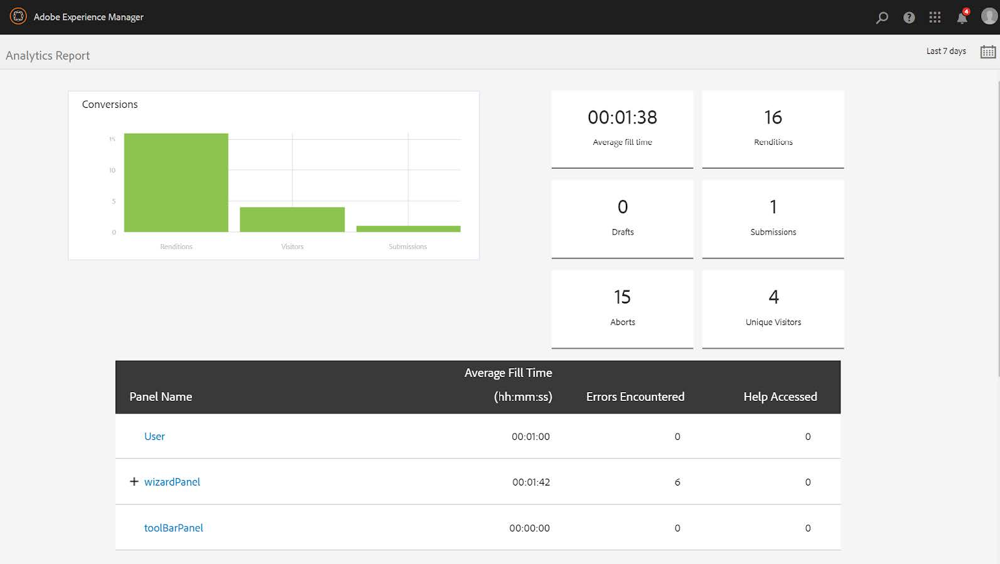
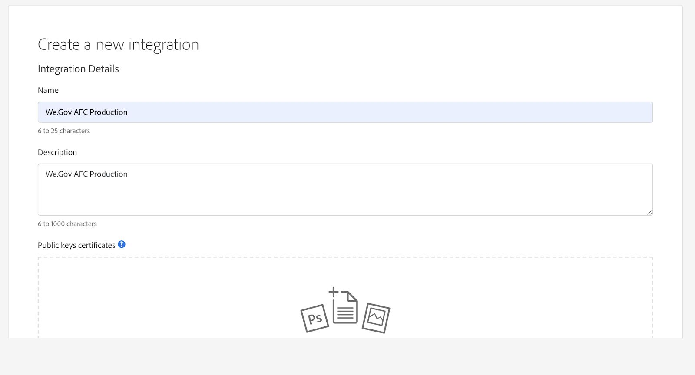
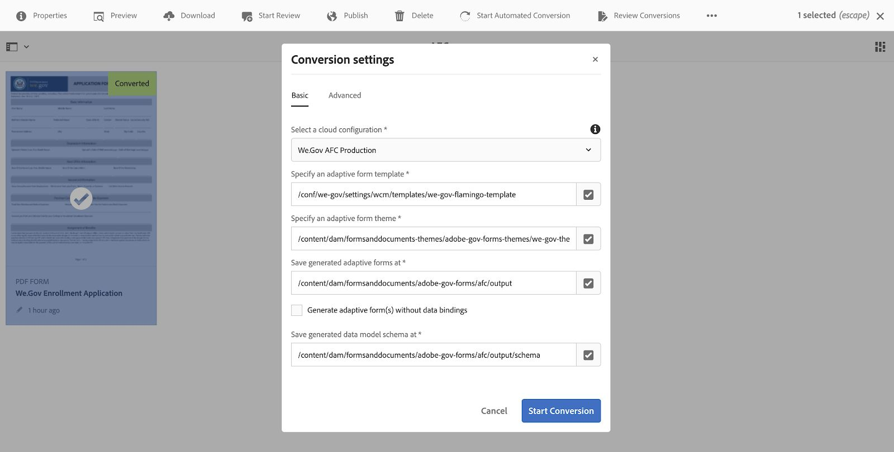

# We.Gov 및 We.Finance 참조 사이트 {#set-up-and-configure-we-gov-reference-site} 설정 및 구성

## 데모 패키지 세부 정보 {#demo-package-details}

### 설치 사전 요구 사항 {#installation-prerequisites}

이 패키지는 **AEM Forms 6.4 OSGI 작성자**&#x200B;에 대해 만들어졌기 때문에 다음 플랫폼 버전에서 지원됩니다.

| AEM 버전 | AEM FORMS 패키지 버전 | 상태 |
|---|---|---|
| 6.4 | 5.0.86 | **지원됨** |
| 6.5 | 6.0.80 | **지원됨** |
| 6.5.3 | 6.0.122 | **지원됨** |

이 패키지에는 다음 플랫폼 버전을 지원하는 클라우드 구성이 포함되어 있습니다.

| 클라우드 공급자 | 서비스 버전 | 상태 |
|---|---|---|
| Adobe Sign | v5 API | **지원됨** |
| Microsoft Dynamics 365 | 1710 (9.1.0.3020) | **지원됨** |
| Adobe Analytics | v1.4 Rest API | **지원됨** |
**패키지 설치 고려 사항:**

* 패키지는 깔끔한 서버에 설치되며 다른 데모 패키지 또는 이전 데모 패키지 버전은 없을 것입니다.
* OSGI 서버에 패키지가 설치되어 작성자 모드에서 실행 중입니다.

### 이 패키지에는 {#what-does-this-package-include}이 포함됩니까?

[AEM Forms We.Gov 데모 패키지](https://experience.adobe.com/#/downloads/content/software-distribution/en/aem.html?package=/content/software-distribution/en/details.html/content/dam/aem/public/adobe/packages/cq650/featurepack/we-gov-forms.pkg.all-2.0.2.zip)(**we-gov-forms.pkg.all-&lt;version>.zip**)는 다른 여러 하위 패키지 및 서비스를 포함하는 패키지로 제공됩니다. 패키지에는 다음 모듈이 포함되어 있습니다.

* **we-gov-forms.pkg.all-&lt;version>zip** -  *데모 패키지 완료*

   * **we-gov-forms.ui.apps-&lt;version>.zip** *- 모든 구성 요소, 클라이언트 라이브러리, 샘플 사용자, 워크플로우 모델 등을 포함합니다.*

      * **we-gov-forms.core-&lt;version>jar** -  *모든 OSGI 서비스, 사용자 지정 워크플로우 단계 구현 등을 포함합니다.*

      * **we-gov-forms.derby&lt;version>.jar** -  *모든 OSGI 서비스, 데이터베이스 스키마 등을 포함합니다.*

      * **core.wcm.components.all-2.0.4.zip** -  *샘플 WCM 구성 요소 컬렉션*

      * **grid-aem.ui.apps-1.0-SNAPSHOT.zip** -  *AEM Sites Grid 레이아웃 패키지 사이트 페이지 열 컨트롤*
   * **we-gov-forms.ui.content-&lt;version>.zip** -  *모든 컨텐트, 페이지, 이미지, 양식, 대화형 통신 자산 등을 포함합니다.*

   * **we-gov-forms.ui.ananalytics-&lt;version>.zip** -  *저장소 내에 저장할 모든 We.Gov Forms 분석 데이터를 포함합니다.*

   * **we-gov-forms.config.public-&lt;version>zip** - 양식 데이터 모델 및 서비스 바인딩 문제를 방지하기 위해 자리 표시자 클라우드 구성을 비롯한 모든 기본 구성 노드를  *포함합니다.*

이 패키지에 포함된 에셋은 다음과 같습니다.

* 편집 가능한 템플릿이 있는 AEM 사이트 페이지
* AEM Forms 적응형 Forms
* AEM Forms Interactive Communications(인쇄 및 웹 채널)
* AEM Forms XDP 문서 기록
* AEM Forms MS Dynamics Forms 데이터 모델
* Adobe Sign 통합
* AEM 워크플로우 모델
* AEM Assets 샘플 이미지
* 샘플(메모리 내) Apache Derby 데이터베이스
* Apache Derby 데이터 소스(양식 데이터 모델과 함께 사용)

## 데모 패키지 설치 {#demo-package-installation}

이 섹션에는 데모 패키지 설치에 대한 정보가 포함되어 있습니다.

### 소프트웨어 배포에서 {#from-software-distribution}

1. [소프트웨어 배포](https://experience.adobe.com/downloads)를 엽니다. 소프트웨어 배포에 로그인하려면 Adobe ID이 필요합니다.
1. 머리글 메뉴에서 사용할 수 있는 **[!UICONTROL Adobe Experience Manager]**&#x200B;을 누릅니다.
1. **[!UICONTROL 필터]** 섹션에서 다음을 수행합니다.
   1. **[!UICONTROL 솔루션]** 드롭다운 목록에서 **[!UICONTROL Forms]**&#x200B;을 선택합니다.
   2. 패키지의 버전과 유형을 선택합니다. **[!UICONTROL 다운로드 검색]** 옵션을 사용하여 결과를 필터링할 수도 있습니다.
1. **we-gov-forms.pkg.all-&lt;version>.zip** 패키지 이름을 누르고 **[!UICONTROL EULA 약관 동의]**&#x200B;를 선택하고 **[!UICONTROL 다운로드]**&#x200B;를 누릅니다.
1. [패키지 관리자](https://docs.adobe.com/content/help/ko-KR/experience-manager-65/administering/contentmanagement/package-manager.html)를 열고 **[!UICONTROL 패키지 업로드]**&#x200B;를 클릭하여 패키지를 업로드합니다.
1. 패키지를 선택하고 **[!UICONTROL 설치]**&#x200B;를 클릭합니다.

   

1. 설치 과정이 완료될 수 있도록 허용합니다.
1. *https://&lt;aemserver>:&lt;port>/content/we-gov/home.html?wcmmode=disabled*&#x200B;로 이동하여 설치가 성공했는지 확인합니다.

### 로컬 ZIP 파일에서 {#from-a-local-zip-file}

1. **we-gov-forms.pkg.all-&lt;version>.zip** 파일을 다운로드하여 찾습니다.
1. *https://&lt;aemserver>:&lt;port>/crx/packmgr/index.jsp*&#x200B;로 이동합니다.
1. &quot;패키지 업로드&quot; 옵션을 선택합니다.

   

1. 파일 브라우저를 사용하여 다운로드한 ZIP 파일을 찾아 선택합니다.
1. &quot;열기&quot;를 클릭하여 업로드합니다.
1. 업로드된 후 &quot;설치&quot; 옵션을 선택하여 패키지를 설치합니다.

   

1. 설치 과정이 완료될 수 있도록 허용합니다.
1. *https://&lt;aemserver>:&lt;port>/content/we-gov/home.html?wcmmode=disabled*&#x200B;로 이동하여 설치가 성공했는지 확인합니다.

### 새 패키지 버전 {#installing-new-package-versions} 설치

새 패키지 버전을 설치하려면 4.1 및 4.2에 정의된 단계를 수행합니다. 다른 이전 패키지가 이미 설치된 상태에서 새 패키지 버전을 설치하는 것은 가능하지만, 먼저 이전 패키지 버전을 제거하는 것이 좋습니다. 이렇게 하려면 아래 절차를 따르십시오.

1. *https://&lt;aemserver>:&lt;port>/crx/packmgr/index.jsp*&#x200B;로 이동합니다.
1. 이전 **we-gov-forms.pkg.all-&lt;version>.zip** 파일을 찾습니다.
1. &quot;자세히&quot; 옵션을 선택합니다.
1. 드롭다운에서 &quot;제거&quot; 옵션을 선택합니다.

   

1. 확인 시 &quot;제거&quot;를 다시 선택하고 제거 과정이 완료되도록 허용합니다.

## 데모 패키지 구성 {#demo-package-configuration}

이 섹션에는 프레젠테이션 전에 데모 패키지의 배포 후 구성에 대한 세부 사항과 지침이 들어 있습니다.

### 가상 사용자 구성 {#fictional-user-configuration}

1. *https://&lt;aemserver>:&lt;port>/libs/granite/security/content/groupadmin.html*&#x200B;로 이동합니다.
1. 아래 작업을 수행하려면 관리자로 로그인합니다.
1. 모든 사용자 그룹을 로드하려면 페이지 끝까지 아래로 스크롤하십시오.
1. &quot;**workflow**&quot;을 검색합니다.
1. &quot;**workflow-users**&quot; 그룹을 선택하고 &quot;속성&quot;을 클릭합니다.
1. &quot;구성원&quot; 탭으로 이동합니다.
1. &quot;사용자 또는 그룹 선택&quot; 필드에 **webgov**&#x200B;을 입력합니다.
1. 드롭다운 &quot;**We.Gov Forms 사용자**&quot;에서 선택합니다.

   

1. 메뉴 모음에서 &quot;저장 및 닫기&quot;를 클릭합니다.
1. &quot;**analytics**&quot;을 검색하고, &quot;**Analytics 관리자**&quot; 그룹을 선택한 후 &quot;**We.Gov Forms 사용자**&quot; 그룹을 구성원으로 추가하여 2-7단계를 반복합니다.
1. &quot;**양식 사용자**&quot;를 검색하고, &quot;**forms-power-users**&quot; 그룹을 선택한 다음 &quot;**We.Gov Forms 사용자**&quot; 그룹을 구성원으로 추가하여 2-7단계를 반복합니다.
1. &quot;**forms-users**&quot;를 검색하고, &quot;**forms-users**&quot; 그룹을 선택한 후 이번에는 &quot;**We.Gov 사용자**&quot; 그룹을 구성원으로 추가함으로써 2-7단계를 반복합니다.

### 이메일 서버 구성 {#email-server-configuration}

1. 설치 설명서 [이메일 알림 구성](/help/sites-administering/notification.md) 검토
1. 이 작업을 수행하려면 관리자로 로그인합니다.
1. *https://&lt;aemserver>:&lt;port>/system/console/configMgr*
1. 구성할 **일 CQ 메일 서비스** 서비스를 찾아 클릭합니다.

   

1. 원하는 SMTP 서버에 연결할 서비스를 구성합니다.

   1. **SMTP 서버 호스트 이름**:e.g(smtp.gmail.com)
   1. **서버 포트**:예: SSL을 사용하는 이메일의 경우 (465)
   1. **SMTP 사용자:** demo@. &lt;companyname> com
   1. **&quot;보낸 사람&quot; 주소**:aemformsdemo@adobe.com

   

1. &quot;저장&quot;을 클릭하여 구성을 저장합니다.

### (선택 사항) AEM SSL 구성 {#aemsslconfig}

이 섹션에는 Adobe Sign 클라우드 구성을 구성할 수 있도록 AEM 인스턴스에서 SSL을 구성하는 방법에 대한 세부 사항이 포함되어 있습니다.

**참조:**

1. [기본적으로 SSL](/help/sites-administering/ssl-by-default.md)

**메모:**

1. 위의 참조 문서 링크에 설명된 프로세스를 완료할 수 있는 https://&lt;aemserver>:&lt;port>/aem/inbox로 이동합니다.
1. `we-gov-forms.pkg.all-[version].zip` 패키지에는 패키지의 일부인 `we-gov-forms.pkg.all-[version].zip/ssl` 폴더를 추출하여 액세스할 수 있는 샘플 SSL 키와 인증서가 포함되어 있습니다.

1. SSL 인증서 및 키 세부 사항:

   1. &quot;CN=localhost&quot;에 발급됨
   1. 10년 유효성
   1. &quot;password&quot; 암호 값
1. 개인 키는 *localhostprivate.der*&#x200B;입니다.
1. 인증서는 *localhost.crt*&#x200B;입니다.
1. 다음을 클릭합니다.
1. HTTPS 호스트 이름은 *localhost*&#x200B;로 설정해야 합니다.
1. 포트는 시스템이 노출된 포트로 설정해야 합니다.

### (선택 사항) Adobe Sign 클라우드 구성 {#adobe-sign-cloud-configuration}

이 섹션에는 Adobe Sign 클라우드 구성에 대한 세부 사항과 지침이 포함되어 있습니다.

**참조:**

1. [AEM Forms과 Adobe Sign 통합](adobe-sign-integration-adaptive-forms.md)

#### 클라우드 구성 {#cloud-configuration}

1. 사전 요구 사항을 검토합니다. 필수 SSL 구성에 대해서는 [AEM SSL 구성](../../forms/using/forms-install-configure-gov-reference-site.md#aemsslconfig)을 참조하십시오.
1. 다음으로 이동:

   *https://&lt;aemserver>:&lt;port>/libs/adobesign/cloudservices/adobesign.html/conf/we-gov*

   >[!NOTE]
   >
   >AEM 서버에 액세스하는 데 사용되는 URL은 구성 문제를 방지하기 위해 Adobe Sign OAuth 리디렉션 URI에 구성된 URL과 일치해야 합니다(예:*https://&lt;aemserver>:&lt;port>/mnt/overlay/adobesign/cloudservices/adobesign/properties.html*)

1. &quot;We.gov Adobe Sign&quot; 구성을 선택합니다.
1. &quot;속성&quot;을 클릭합니다.
1. &quot;설정&quot; 탭으로 이동합니다.
1. oAuth URL(예:[https://secure.na1.echosign.com/public/oauth](https://secure.na1.echosign.com/public/oauth)
1. 구성된 Adobe Sign 인스턴스에서 구성된 클라이언트 ID와 클라이언트 암호를 제공합니다.
1. &quot;Adobe Sign에 연결&quot;을 클릭합니다.
1. 연결이 성공적으로 완료되면 &quot;저장 및 닫기&quot;를 클릭하여 통합을 완료합니다.

### (선택 사항) MS Dynamics 클라우드 구성 {#ms-dynamics-cloud-configuration}

이 섹션에는 MS Dynamics 클라우드 구성에 대한 세부 사항과 지침이 포함되어 있습니다.

**참조:**

1. [Microsoft Dynamics OData 구성](https://docs.adobe.com/content/help/en/experience-manager-64/forms/form-data-model/ms-dynamics-odata-configuration.html)
1. [AEM Forms용 Microsoft Dynamics 구성](https://helpx.adobe.com/experience-manager/kt/forms/using/config-dynamics-for-aem-forms.html)

#### MS Dynamics OData 클라우드 서비스 {#ms-dynamics-odata-cloud-service}

1. 다음으로 이동:

   https://&lt;aemserver>:&lt;port>/libs/fd/fdm/gui/components/admin/fdmcloudservice/fdm.html/conf/we-gov

   1. MS Dynamics 응용 프로그램 등록에 구성된 것과 동일한 리디렉션 URL을 사용하여 서버에 액세스하는지 확인합니다.

1. &quot;Microsoft Dynamics OData Cloud Service&quot; 구성을 선택합니다.
1. &quot;속성&quot;을 클릭합니다.

   

1. &quot;인증 설정&quot; 탭으로 이동합니다.
1. 다음 세부 정보를 입력합니다.

   1. **서비스 루트:** 예: https://msdynamicsserver.api.crm3.dynamics.com/api/data/v9.1/
   1. **인증 유형:** OAuth 2.0
   1. **인증 설정** ( [MS Dynamics 클라우드 구성 설정](../../forms/using/forms-install-configure-gov-reference-site.md#dynamicsconfig) 을 참조하여 이 정보를 수집합니다.):

      1. 클라이언트 ID - 응용 프로그램 ID라고도 함
      1. 클라이언트 암호
      1. OAuth URL - 예.[https://login.windows.net/common/oauth2/authorize](https://login.windows.net/common/oauth2/authorize)
      1. 토큰 URL 새로 고침 - 예[https://login.windows.net/common/oauth2/token](https://login.windows.net/common/oauth2/token)
      1. 액세스 토큰 URL - 예[https://login.windows.net/common/oauth2/token](https://login.windows.net/common/oauth2/token)
      1. 인증 범위 - **openid**
      1. 인증 헤더 - **인증 전달자**
      1. 리소스 - 예: [https://msdynamicsserver.api.crm3.dynamics.com](https://msdynamicsserver.api.crm3.dynamics.com)
   1. &quot;OAuth에 연결&quot;을 클릭합니다.

1. 인증이 완료되면 &quot;저장 및 닫기&quot;를 클릭하여 통합을 완료합니다.

#### MS Dynamics 클라우드 구성 설정 {#dynamicsconfig}

이 섹션에 자세히 설명된 단계는 MS Dynamics Cloud 인스턴스에서 클라이언트 ID, 클라이언트 암호 및 세부 정보를 찾는 데 도움이 됩니다.

1. [https://portal.azure.com/](https://portal.azure.com/)로 이동하여 로그인합니다.
1. 왼쪽 메뉴에서 &quot;모든 서비스&quot;를 선택합니다.
1. &quot;앱 등록&quot;을 검색하거나 탐색합니다.
1. 기존 애플리케이션 등록을 만들거나 선택합니다.
1. AEM 클라우드 구성에서 OAuth **클라이언트 ID**&#x200B;로 사용할 **응용 프로그램 ID**&#x200B;을 복사합니다.
1. &quot;설정&quot; 또는 &quot;매니페스트&quot;를 클릭하여 **회신 URL을 구성합니다.**

   1. 이 URL은 OData 서비스를 구성할 때 AEM 서버에 액세스하는 데 사용된 URL과 일치해야 합니다.

1. 설정 보기에서 &quot;키&quot;를 클릭하여 새 키 만들기(AEM의 클라이언트 암호로 사용됨)를 봅니다.

   1. 나중에 Azure 또는 AEM에서 볼 수 없으므로 키의 복사본을 보관하십시오.

1. 리소스 URL/서비스 루트 URL을 찾으려면 MS Dynamics 인스턴스 대시보드로 이동합니다.
1. 상단 내비게이션 막대에서 &quot;판매&quot; 또는 고유 인스턴스 유형과 &quot;설정 선택&quot;을 클릭합니다.
1. 오른쪽 하단에 있는 &quot;사용자 지정&quot; 및 &quot;개발자 리소스&quot;를 클릭합니다.
1. 서비스 루트 URL은 다음과 같습니다.예

   *[https://msdynamicsserver.api.crm3.dynamics.com/api/data/v9.1/](https://msdynamicsserver.api.crm3.dynamics.com/api/data/v9.1/)*

1. 새로 고침 및 액세스 토큰 URL에 대한 자세한 내용은 다음 링크를 참조하십시오.

   *[https://docs.microsoft.com/en-us/rest/api/datacatalog/authenticate-a-client-app](https://docs.microsoft.com/en-us/rest/api/datacatalog/authenticate-a-client-app)*

#### Forms 데이터 모델 테스트(Dynamics) {#testing-the-form-data-model}

클라우드 구성이 완료되면 양식 데이터 모델을 테스트할 수 있습니다.

1. 다음으로 이동

   *https://&lt;aemserver>:&lt;port>/aem/forms.html/content/dam/formsanddocuments-fdm/we-gov*

1. &quot;We.gov Microsoft Dynamics CRM FDM&quot;을 선택하고 &quot;속성&quot;을 선택합니다.

   

1. &quot;소스 업데이트&quot; 탭으로 이동합니다.
1. &quot;컨텍스트 인식 구성&quot;이 &quot;/conf/we-gov&quot;로 설정되어 있고 구성된 데이터 소스가 &quot;ms-dynamics-odata-cloud-service&quot;인지 확인하십시오.

   

1. 양식 데이터 모델을 편집합니다.

1. 구성된 데이터 소스에 성공적으로 연결되도록 서비스를 테스트합니다.

   >[!NOTE]
   서비스를 테스트한 후 **취소**&#x200B;를 클릭하여 무의식적으로 변경된 내용이 양식 데이터 모델에 전파되지 않도록 합니다.

   >[!NOTE]
   데이터 소스를 FDM에 성공적으로 바인딩하려면 AEM Server를 다시 시작해야 한다고 보고되었습니다.

#### Forms 데이터 모델 테스트(더비) {#test-fdm-derby}

클라우드 구성이 완료되면 양식 데이터 모델을 테스트할 수 있습니다.

1. *https://&lt;aemserver>:&lt;port>/aem/forms.html/content/dam/formsanddocuments-fdm/we-gov*&#x200B;로 이동합니다.

1. **We.gov 등록 FDM**&#x200B;을 선택하고 **속성**&#x200B;을 선택합니다.

   

1. **소스 업데이트** 탭으로 이동합니다.

1. **컨텍스트 인식 구성**&#x200B;이(가) `/conf/we-gov`로 설정되어 있고 구성된 데이터 소스가 **We.Gov Derby DS**&#x200B;인지 확인합니다.

   

1. **저장 및 닫기**&#x200B;를 클릭합니다.

1. [서비스를 ](work-with-form-data-model.md#test-data-model-objects-and-services) 테스트하여 구성된 데이터 소스에 성공적으로 연결되었는지 확인합니다.

   * 연결을 테스트하려면 **CAUSORTAGEACCOUNT**&#x200B;을 선택하고 이 계정에 Get 서비스를 지정합니다. 서비스 및 시스템 관리자를 테스트하면 검색할 데이터를 볼 수 있습니다.

### Adobe Analytics 구성(선택 사항) {#adobe-analytics-configuration}

이 섹션에는 Adobe Analytics Cloud 구성에 대한 세부 사항과 지침이 들어 있습니다.

**참조:**

* [Adobe Analytics와 통합](../../sites-administering/adobeanalytics.md)

* [Adobe Analytics 및 Creating Frameworks에 연결](../../sites-administering/adobeanalytics-connect.md)

* [페이지 분석 데이터 보기](../../sites-authoring/pa-using.md)

* [분석 및 보고서 구성](configure-analytics-forms-documents.md)

* [AEM Forms 분석 보고서 보기 및 이해](view-understand-aem-forms-analytics-reports.md)

### Adobe Analytics 클라우드 서비스 구성 {#adobe-analytics-cloud-service-configuration}

이 패키지는 Adobe Analytics에 연결하도록 사전 구성되어 있습니다. 이 구성을 업데이트할 수 있도록 아래 단계가 제공됩니다.

1. *https://&lt;aemserver>:&lt;port>/libs/cq/core/content/tools/cloudservices.html*&#x200B;로 이동합니다.
1. Adobe Analytics 섹션을 찾아 &quot;구성 표시&quot; 링크를 선택합니다.
1. &quot;We.Gov Adobe Analytics(Analytics 구성)&quot; 구성을 선택합니다.

   

1. &quot;편집&quot; 버튼을 클릭하여 Adobe Analytics 구성을 업데이트합니다(공유 암호 제공이 필요함). 연결하려면 &quot;분석에 연결&quot;을 클릭하고 &quot;확인&quot;을 클릭하여 완료하십시오.

   

1. 동일한 페이지에서 프레임워크 구성을 업데이트하려면 &quot;We.Gov Adobe Analytics Framework(Analytics Framework)&quot;를 클릭합니다(작성을 활성화하려면 [AEM 저작 활성화](../../forms/using/forms-install-configure-gov-reference-site.md#enableauthoring) 참조).

#### Adobe Analytics 사용자 자격 증명 찾기 {#analytics-locating-user-credentials}

Adobe Analytics 계정에 대한 사용자 자격 증명을 찾으려면 계정 관리자가 다음 작업을 수행해야 합니다.

1. Adobe Experience Cloud 포털으로 이동합니다.
   * 관리자 자격 증명으로 로그인
1. 기본 대시보드에서 Adobe Analytics 아이콘을 선택합니다.
   
1. 관리 탭으로 이동하여 사용자 관리(이전) 항목을 선택합니다
   
1. **사용자** 탭을 선택합니다.
   
1. 사용자 목록에서 원하는 사용자를 선택합니다.
1. 페이지 아래쪽으로 스크롤하면 페이지 하단에 사용자 인증 정보가 표시됩니다.
   
1. 사용자 이름 및 공유 비밀 정보가 권한 상자 오른쪽에 나타납니다.
1. 사용자 이름에 콜론이 포함되며 콜론의 왼쪽에 있는 모든 정보는 사용자 이름이며 콜론 오른쪽에 있는 모든 정보는 회사 이름이 됩니다.
   * 다음은 그 예입니다.*사용자 이름:회사 이름*

#### Adobe Analytics {#setup-user-authentication}에서 사용자 인증 설정

관리자는 다음 작업을 수행하여 사용자에게 AEM 분석 권한을 제공할 수 있습니다.

1. Adobe Admin Console으로 이동합니다.

1. 관리 콘솔에 노출된 Analytics 인스턴스를 클릭합니다.

   * 관리 페이지의 기본 페이지에 있습니다.

1. Analytics 전체 관리자 액세스를 선택합니다.

1. 프로필에 사용자를 추가합니다.

   

1. 사용자 ID가 프로필에 매핑되면 권한 탭을 클릭합니다.

1. 모든 권한이 프로필에 매핑되는지 확인합니다.

   

1. 사용자가 로그인할 수 있는 기능을 통해 권한이 매핑되면 몇 시간이 걸릴 수 있습니다.

### Adobe Analytics 보고 {#adobe-analytics-reporting}

#### Adobe Analytics 사이트 보고 보기 {#view-adobe-analytics-sites-reporting}

>[!NOTE]
AEM Forms Analytics 데이터는 오프라인 상태이거나 `we-gov-forms.ui.analytics-<version>.zip` 패키지가 설치되어 있는 경우 Adobe Analytics 클라우드 구성이 없는 상태에서 사용할 수 있지만 AEM Sites 데이터에는 활성 클라우드 구성이 필요합니다.

1. *https://&lt;aemserver>:&lt;port>/sites.html/content*
1. 사이트 페이지를 보려면 &quot;AEM Forms We.Gov 사이트&quot;를 선택합니다.
1. 사이트 페이지(예: 홈) 중 하나를 선택하고 &quot;분석 및 Recommendations&quot;을 선택합니다.

   

1. 이 페이지에는 AEM Sites 페이지와 관련된 Adobe Analytics에서 가져온 정보가 표시됩니다(참고:이 정보는 디자인되어 Adobe Analytics에서 정기적으로 새로 고쳐지며 실시간으로 표시되지 않습니다.)

   

1. 3단계에서 액세스한 페이지 보기 페이지로 돌아가면 디스플레이 설정을 &quot;목록 보기&quot;에서 항목을 표시하도록 변경하여 페이지 보기 정보를 볼 수도 있습니다.
1. &quot;보기&quot; 드롭다운 메뉴를 찾아 &quot;목록 보기&quot;를 선택합니다.

   

1. 동일한 메뉴에서 &quot;설정 보기&quot;를 선택하고 &quot;분석&quot; 섹션에서 표시할 열을 선택합니다.

   

1. &quot;업데이트&quot;를 클릭하여 새 열을 사용할 수 있도록 합니다.

   

#### Adobe Analytics 양식 보고 보기 {#view-adobe-analytics-forms-reporting}

>[!NOTE]
AEM Forms Analytics 데이터는 오프라인 상태이거나 `we-gov-forms.ui.analytics-<version>.zip` 패키지가 설치되어 있는 경우 Adobe Analytics 클라우드 구성이 없는 상태에서 사용할 수 있지만 AEM Sites 데이터에는 활성 클라우드 구성이 필요합니다.

1. 다음으로 이동

   *https://&lt;aemserver>:&lt;port>/aem/forms.html/content/dam/formsanddocuments/adobe-gov-forms*

1. &quot;Registered Application For Health Benefits&quot; 적응형 양식을 선택하고 &quot;Analytics 보고서&quot; 옵션을 선택합니다.

   

1. 페이지가 로드될 때까지 기다렸다가 Analytics 보고서 데이터를 봅니다.

   

### Adobe 자동화된 Forms 구성 지원 {#automated-forms-enablement}

Adobe Forms을 사용하여 AEM Forms을 설치하고 구성하려면 전환 도구 사용자가 다음을 가져야 합니다.

1. Adobe I/O 이용.

1. Adobe Forms 전환 서비스와의 통합을 만들 수 있는 권한.

1. 작성자로 실행 중인 Adobe AEM 6.5 최신 서비스 팩

추가 지침을 읽으려면 다음 사항을 검토하십시오.

* [자동 양식 전환 서비스 구성](https://docs.adobe.com/content/help/en/aem-forms-automated-conversion-service/using/configure-service.html)

#### IMS 구성 파트 1 {#creating-ims-config} 만들기

서비스를 구성하여 양식 변환 도구와 올바르게 통신할 수 있도록 하려면 IMS(Identity Management System) 서비스를 Adobe I/O에 등록할 수 있도록 구성해야 합니다.

1. https://&lt;aemserver>:&lt;port> > Adobe Experience 클릭
왼쪽 상단의 관리자 > 도구 > 보안 > IMS 구성 Adobe.

1. 만들기를 클릭합니다.

1. 아래 이미지에서 작업을 수행합니다.

   

1. 인증서를 다운로드해야 합니다.

1. 나머지 구성으로 진행하지 마십시오 - 섹션 [Adobe I/O에서 통합 만들기](#create-integration-adobeio)

>[!NOTE]
이 섹션에서 만든 인증서는 Adobe I/O에서 통합 서비스를 만드는 데 사용됩니다.사용자가 통합 서비스에 생성되면 사용자는 Adobe I/O에서 해당 정보를 사용하여 구성을 완료할 수 있습니다.

#### Adobe I/O {#create-integration-adobeio}에서 통합 만들기

시스템 관리자에게 연락하지 않은 경우 Adobe 도메인 내에 통합을 만들 수 있습니다.

1. [Adobe I/O 콘솔](https://console.adobe.io/)로 이동합니다.

1. 통합 만들기를 클릭합니다.

1. API 액세스를 선택합니다.

1. 올바른 그룹(오른쪽 상단 드롭다운 목록)에 있는지 확인합니다.

1. Experience Cloud 섹션에서 Forms 변환 도구를 선택합니다.

1. 계속을 클릭합니다.

1. 통합의 이름과 설명을 입력합니다.

1. 섹션 2.1의 공개 키를 사용하면 키 통합 내에 키를 배치할 수 있습니다.

1. automated forms conversion 프로파일을 선택합니다.

   

#### IMS 구성 파트 2 {#create-ims-config-part-next} 만들기

이제 통합을 만들어 IMS 구성 설치를 완료할 수 있습니다.

1. 연결 세부 정보를 표시하려면 Adobe I/O 내에서 통합을 클릭합니다.

1. AEM 내에서 IMS 구성으로 이동합니다(도구 > 보안 > IMS).

1. IMS 구성 화면에서 다음을 클릭합니다.

1. 인증 서버(스크린샷에 표시된 값)를 입력합니다.

1. API 키를 입력합니다.

1. 클라이언트 암호를 입력합니다. 클라이언트 암호를 표시하려면 Adobe I/O에서 통합을 노출해야 합니다.

1. JWT 페이로드를 가져와 IMS 구성의 페이로드에 붙여 넣으려면 Adobe I/O에서 JWT 탭을 클릭합니다.

   

1. IMS 구성을 클릭하고 상태 확인을 선택하면 다음 결과가 표시됩니다.

   

#### 클라우드 구성(We.Gov AFC 제작) {#configure-cloud-configuration}

IMS 구성이 완료되면 AEM에서 클라우드 구성을 계속 검토할 수 있습니다. 구성이 없는 경우 다음 단계를 사용하여 AEM에서 클라우드 구성을 만드십시오.

1. 브라우저를 열고 시스템 URL https://&lt;domain_name>:&lt;system_port>로 이동합니다.

1. 화면 왼쪽 상단에 있는 Adobe Experience Manager을 클릭합니다. > 도구 > Cloud Services > 자동화된 Forms 대화 구성을 클릭합니다.

1. 구성을 배치할 구성 폴더를 선택합니다.

1. 만들기를 클릭합니다.

1. 아래 스크린샷에 정보를 입력합니다.

   

1. 구성과 제목 및 이름을 제공합니다.

1. 시스템의 서비스 URL은 https://aemformsconversion.adobe.io/으로 설정됩니다.

1. 템플릿 URL */conf/we-gov/settings/wcm/templates/we-gov-flamingo-template*.

1. 테마 URL:*/content/dam/formsanddocuments-themes/adobe-gov-forms-themes/we-gov-theme*

1. 다음을 클릭합니다.

1. 이 구성의 경우 2개의 확인란 값을 비워 둡니다.

   * 이러한 옵션에 대한 자세한 내용은 [클라우드 서비스 구성](https://docs.adobe.com/content/help/en/aem-forms-automated-conversion-service/using/configure-service.html#configure-the-cloud-service)을 참조하십시오.

#### 클라우드 구성(We.Finance AFC Production) {#configure-cloud-configuration-wefinance}

IMS 구성이 완료되면 AEM에서 클라우드 구성을 계속 만들 수 있습니다.

1. 브라우저를 열고 시스템 URL https://&lt;domain_name>:&lt;system_port>로 이동합니다.

1. 화면 왼쪽 상단에 있는 Adobe Experience Manager을 클릭합니다. > 도구 > Cloud Services > 자동화된 Forms 대화 구성을 클릭합니다.

1. 구성을 배치할 구성 폴더를 선택합니다.

1. 만들기를 클릭합니다.

1. 아래 스크린샷에 정보를 입력합니다.

   

1. 구성과 제목 및 이름을 제공합니다.

1. 시스템에 대한 서비스 URL은 https://aemformsconversion.adobe.io/으로 설정됩니다.

1. 템플릿 URL:*/conf/we-finance/settings/wcm/templates/we-finance-adaptive-form*

1. 테마 URL:*/content/dam/formsanddocuments-themes/adobe-finance-forms-themes/we-finance-theme*

1. 다음을 클릭합니다.

1. 이 구성의 경우 2개의 확인란 값을 비워 둡니다.

   * 이러한 옵션에 대한 자세한 내용은 [클라우드 서비스 구성](https://docs.adobe.com/content/help/en/aem-forms-automated-conversion-service/using/configure-service.html#configure-the-cloud-service)을 참조하십시오.

#### 양식 전환 테스트(We.Gov 등록 응용 프로그램) {#test-forms-conversion}

구성이 설정되면 사용자는 PDF 문서를 업로드하여 테스트할 수 있습니다.

1. AEM 시스템 https://&lt;domain_name>:&lt;system_port>로 이동합니다.

1. Forms > Forms &amp; 문서 > AEM Forms We.gov Forms > AFC를 클릭합니다.

1. We.Gov 등록 애플리케이션 PDF를 선택합니다.

1. 오른쪽 상단 모서리의 **자동화된 전환 시작** 단추를 클릭합니다.

1. 사용자는 아래 표시된 옵션을 볼 수 있어야 합니다.

   

1. 단추를 선택하면 사용자에게 다음과 같은 옵션이 표시됩니다

   * 사용자가 *We.Gov AFC Production* 구성을 선택해야 합니다.

   

   

1. 사용할 모든 옵션을 구성했으면 전환 시작을 선택합니다.

1. 전환 프로세스가 시작되면 다음 화면이 표시됩니다.

   

1. 변환이 완료되면 사용자에게 다음 화면이 표시됩니다.

   

   생성된 적응형 양식을 보려면 **출력** 폴더를 클릭합니다.

#### 알려진 문제 및 메모 {#known-issues-notes}

automated forms conversion 서비스에는 특정 [우수 사례, 알려진 복잡한 패턴](https://docs.adobe.com/content/help/en/aem-forms-automated-conversion-service/using/styles-and-pattern-considerations-and-best-practices.html) 및 [알려진 문제](https://docs.adobe.com/content/help/en/aem-forms-automated-conversion-service/using/known-issues.html)가 포함되어 있습니다. AEM Forms Automated forms conversion 서비스를 사용하기 전에 이 내용을 검토하십시오.

1. 변환 후 양식을 FDM에 바인딩하려는 경우 데이터 바인딩을 사용하지 않고 응용 양식 생성을 사용하여 양식을 생성합니다.

1. 템플릿 폴더에 jcr:read for everyone 권한이 활성화되었는지 확인하십시오. 그렇지 않으면 서비스 사용자가 저장소에서 템플릿을 읽을 수 없고 변환이 실패합니다.

## 데모 패키지 사용자 지정 {#demo-package-customizations}

이 섹션에는 데모 사용자 지정에 대한 지침이 포함되어 있습니다.

### 템플릿 사용자 지정 {#templates-customization}

편집 가능한 템플릿은 다음 위치에서 찾을 수 있습니다.

*https://&lt;aemserver>:&lt;port>/libs/wcm/core/content/sites/templates.html/conf/we-gov*

이러한 템플릿에는 AEM 사이트, 적응형 양식 및 다음 위치에 있는 구성 요소로 작성 및 조합된 대화형 통신 템플릿이 포함되어 있습니다.

*https://&lt;aemserver>:&lt;port>/crx/de/index.jsp#/apps/we-gov/components*

#### 스타일 시스템 {#customizetemplates}

또한 이 사이트에는 클라이언트-라이브러리가 있으며, 그 중 하나가 Bootstrap 4( [https://getbootstrap.com/](https://getbootstrap.com/) )를 가져옵니다. 이 클라이언트 라이브러리는

*https://&lt;aemserver>:&lt;port>/crx/de/index.jsp#/apps/we-gov/clientlibs/clientlib-base/css/bootstrap*

이 패키지에 포함된 편집 가능한 템플릿도 페이지 매김, 스타일 지정 등에 Bootstrap 4 CSS 클래스를 사용하는 템플릿/페이지 정책으로 미리 구성되어 있습니다. 일부 클래스가 템플릿 정책에 추가되는 것은 아니지만 Bootstrap 4에서 지원하는 모든 클래스를 정책에 추가할 수 있습니다. 사용 가능한 클래스 목록은 시작하기 페이지를 참조하십시오.

[https://getbootstrap.com/docs/4.1/getting-started/introduction/](https://getbootstrap.com/docs/4.1/getting-started/introduction/)

이 패키지에 포함된 템플릿은 스타일 시스템도 지원합니다.

[스타일 시스템](../../sites-authoring/style-system.md)

#### 템플릿 로고 {#template-logos}

프로젝트 DAM 자산에는 We.Gov 로고 및 이미지도 포함되어 있습니다. 이러한 자산은

*https://&lt;aemserver>:&lt;port>/assets.html/content/dam/we-gov*

페이지 및 양식 템플릿을 편집할 때 내비게이션 및 바닥글 구성 요소를 편집하여 브랜드 로고를 업데이트하도록 선택할 수 있습니다. 이러한 구성 요소는 로고를 업데이트하는 데 사용할 수 있는 구성 가능한 브랜드 및 로고 대화 상자를 제공합니다.

자세한 내용은 페이지 컨텐츠 편집을 참조하십시오.

[페이지 컨텐츠 편집](../../sites-authoring/editing-content.md)

### 사이트 페이지 사용자 지정 {#sites-pages-customization}

모든 사이트 페이지는 다음 사이트에서 사용할 수 있습니다.*https://&lt;aemserver>:&lt;port>/sites.html/content/we-gov*

이러한 사이트 페이지는 AEM 격자 패키지를 사용하여 몇 가지 구성 요소의 레이아웃을 제어합니다.

#### 스타일 시스템 {#style-system}

이 패키지에 포함된 페이지는 스타일 시스템도 지원합니다.

[스타일 시스템](../../sites-authoring/style-system.md)

지원되는 스타일에 대한 설명서는 [템플릿 사용자 지정 스타일 시스템](../../forms/using/forms-install-configure-gov-reference-site.md#customizetemplates)을 참조할 수도 있습니다.

### 적응형 양식 사용자 지정 {#adaptive-forms-customization}

모든 적응형 양식을 다음 위치에서 사용할 수 있습니다.

*https://&lt;aemserver>:&lt;port>/aem/forms.html/content/dam/formsanddocuments/adobe-gov-forms*

이러한 양식은 특정 사용 사례에 맞게 사용자 정의할 수 있습니다. 특정 필드 및 제출 논리는 양식이 올바르게 기능하도록 수정하지 않아야 합니다. 여기에는 다음이 포함됩니다.

**건강 혜택을 위한 등록 신청:**

* contact_id - 제출 시 MS Dynamics 연락처 ID를 받는 데 사용되는 숨김 필드
* 제출 - 콜백을 지원하려면 제출 단추 로직을 사용자 정의해야 합니다. 사용자 지정이 문서화되어 있지만 Forms 데이터 모델을 통해 POST 및 GET 작업을 MS Dynamics로 수행하는 동안 큰 스크립트가 양식을 제출해야 했습니다.
* 루트 패널 - 초기화 이벤트는 모든 AEM 받은 편지함 Granite UI 구성 요소는 수정할 수 없으므로 가능한 최소 수준의 침입방식으로 AEM 받은 편지함에 MS Dynamics 단추를 추가하는 데 사용됩니다.

#### 적응형 양식 스타일 {#adaptive-form-styling}

스타일 편집기 또는 테마 편집기를 사용하여 적응형 양식의 스타일을 지정할 수도 있습니다.

* [적응형 양식 구성 요소의 인라인 스타일](inline-style-adaptive-forms.md)
* [테마 만들기 및 사용](themes.md)

### 워크플로 사용자 지정 {#workflow-customization}

등록 적응형 양식이 처리를 위해 OSGI 워크플로우에 제출됩니다. 이 워크플로우는 *https://&lt;aemserver>:&lt;port>/conf/we-gov/settings/models/we-gov-process.html*&#x200B;에서 찾을 수 있습니다.

특정 제한 사항으로 인해 이 워크플로우에는 몇 가지 스크립트와 사용자 정의 OSGI 워크플로우 프로세스 단계가 포함됩니다. 이러한 워크플로우 단계는 일반 단계로 생성되었으며 구성 대화 상자로 생성되지 않았습니다. 현재 워크플로우 단계의 구성은 프로세스 인수에 따라 달라집니다.

모든 워크플로우 단계 Java 코드는 **we-gov-forms.core-&lt;version>.jar** 번들에 포함되어 있습니다.

## 데모 고려 사항 및 알려진 문제 {#demo-considerations-and-known-issues}

이 섹션에는 데모 과정 중에 특별한 고려 사항이 필요할 수 있는 데모 기능 및 디자인 결정에 대한 정보가 포함되어 있습니다.

### 데모 고려 사항 {#demo-considerations}

* AGRS-159에 따라 등록 적응형 양식에 사용된 연락처의 이름(첫 번째, 가운데 및 마지막)이 고유해야 합니다.
* 등록 적응형 양식에서는 Adobe Sign 이메일을 양식의 이메일 필드에 지정된 이메일로 보냅니다. 해당 이메일 주소는 Adobe Sign 클라우드 구성을 구성하는 데 사용된 이메일과 동일한 이메일 주소가 될 수 없습니다.

### 알려진 문제 {#known-issues}

* (AGRS-120) 사이트 탐색 구성 요소는 현재 2개 수준 깊이의 중첩된 하위 페이지를 지원하지 않습니다.
* (AGRS-159) 현재 MS Dynamics FDM은 먼저 2개의 작업을 수행하고 등록 적응형 양식 데이터를 Dynamics로 POST한 다음 연락처 ID를 검색하려면 사용자 레코드를 페치해야 합니다. 현재 상태에서는 이름이 같은 두 명 이상의 사용자가 Dynamics에 있으면 연락처 ID를 가져올 수 없어 등록 적응형 양식을 제출할 수 없습니다.

## 액세서빌러티 테스트 구성 {#configure-accessibility-testing}

### 액세서빌러티 테스트 크롬 활성화 {#enable-chrome-add-on}에 추가

액세서빌러티 테스트를 먼저 수행하려면 Chrome 플러그인을 설치해야 합니다. 이 플러그인은 [여기](https://chrome.google.com/webstore/detail/accessibility-developer-t/fpkknkljclfencbdbgkenhalefipecmb?hl=en)있습니다.

설치되고 나면 Chrome 브라우저 내에서 테스트할 페이지를 로드합니다(참고:탭을 여러 개 열면 점수에 영향을 줄 수 있으므로 탭을 한 개만 여는 것이 좋습니다.) 페이지가 로드되면
페이지에서 **마우스 오른쪽 단추를 클릭하고**&#x200B;감사&#x200B;**탭을 선택합니다.** 개발자는 액세스 가능성 플러그인에서 수행할 감사 유형을 선택할 수 있습니다. 원하는 옵션을 모두 선택하면 사용자는 보고서 생성 단추를 선택할 수 있습니다. 전체 액세서빌러티 등급과 접근성 등급을 높이기 위해 사용할 수 있는 요소를 보여주는 PDF 문서가 생성됩니다.

보고서가 실행되면 사용자가 다음을 볼 수 있습니다.

사용자 앞에 표시되는 숫자는 사용자가 획득한 전체 액세서빌러티 등급입니다. 점수 다음에 어떻게 계산되었는지에 대한 설명도 있습니다.

사용자가 내보낼 경우 화면 오른쪽에 있는 3개의 단추를 클릭하고 플러그인이 제공하는 추가 옵션 중에서 선택할 수 있습니다.

### Ultramarine 테마 {#ultramarine-theme}

Adobe으로 유지 관리되는 공개적으로 이용 가능한 Ultramarine 테마는
`we-gov-forms.pkg.all-<version>.zip` 설치 가능한 ZIP 파일. CRX를 사용하여 이 패키지를 설치하고 나면

패키지 관리자를 사용하는 사용자는 **Forms** > **테마** > **참조 테마** > **Ultramarine-Accessible**&#x200B;으로 이동하여 AEM Forms에서 Ultramarine 테마에 액세스할 수 있습니다.

## 구성 옵션 {#configuration-options}

사용자는 다음을 포함한 다양한 워크플로우 서비스 옵션을 구성할 수 있습니다.

1. Microsoft Dynamics 항목
1. Adobe Sign
1. AEM 사용자 정의 커뮤니케이션 관리
1. Adobe Analytics

워크플로우 내에서 활성화되도록 구성하려면 다음 작업을 수행해야 합니다.

1. https://&#39;[서버]:[포트]&#39;/system/console/configMgr로 이동합니다.

1. *WeGov 구성*&#x200B;을 찾습니다.

1. 서비스 정의를 열고 선택한 서비스가 워크플로 내에서 호출되도록 합니다.

   >[!NOTE]
   사용자가 [구성 관리자] 페이지 내에서 서비스를 활성화했기 때문에 요청된 외부 서비스와 통신하기 위해 서비스 구성을 설정해야 합니다.

   

1. 완료되면 [저장] 단추를 클릭하여 설정을 저장합니다.

## 다음 단계 {#next-steps}

이제 모두 We.Gov 참조 사이트를 탐구할 준비가 되었습니다. We.Gov 참조 사이트 워크플로 및 단계에 대한 자세한 내용은 [We.Gov 참조 사이트 연습](../../forms/using/forms-gov-reference-site-user-demo.md)을 참조하십시오.
