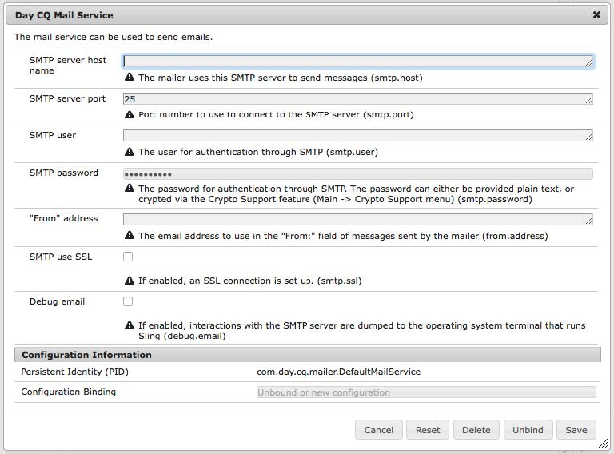
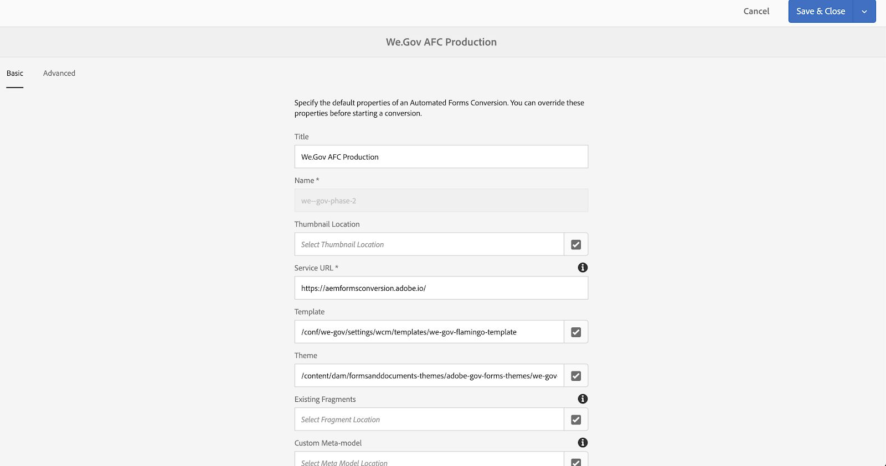

# We.Gov 및 We.Finance 참조 사이트 설정 및 구성 {#set-up-and-configure-we-gov-reference-site}

## 데모 패키지 세부 정보 {#demo-package-details}

### 설치 사전 요구 사항 {#installation-prerequisites}

이 패키지는 다음에 대해 만들어졌습니다. **AEM Forms 6.4 OSGI 작성자**&#x200B;는 테스트되었으므로 다음 플랫폼 버전에서 지원됩니다.

| AEM 버전 | AEM FORMS 패키지 버전 | 상태 |
|---|---|---|
| 6.4 | 5.0.86 | **지원됨** |
| 6.5 | 6.0.80 | **지원됨** |
| 6.5.3 | 6.0.122 | **지원됨** |

이 패키지에는 다음 플랫폼 버전을 지원하는 클라우드 구성이 포함되어 있습니다.

| 클라우드 공급자 | 서비스 버전 | 상태 |
|---|---|---|
| Adobe Sign | v5 API | **지원됨** |
| Microsoft® Dynamics 365 | 1710 (9.1.0.3020) | **지원됨** |
| Adobe Analytics | v1.4 Rest API | **지원됨** |
**패키지 설치 고려 사항:**

* 다른 데모 패키지 또는 이전 데모 패키지 버전을 사용하지 않고 깔끔한 서버에 패키지를 설치합니다.
* 작성자 모드에서 실행되는 OSGI 서버에 패키지를 설치합니다.

### 이 패키지에는 무엇이 포함되어 있습니까 {#what-does-this-package-include}

다음 [AEM Forms We.Gov 데모 패키지](https://experience.adobe.com/#/downloads/content/software-distribution/en/aem.html?package=/content/software-distribution/en/details.html/content/dam/aem/public/adobe/packages/cq650/featurepack/we-gov-forms.pkg.all-2.0.2.zip) (**we-gov-forms.pkg.all-&lt;version>.zip**)는 여러 다른 하위 패키지 및 서비스를 포함하는 패키지로 제공됩니다. 패키지에는 다음 모듈이 포함되어 있습니다.

* **we-gov-forms.pkg.all-&lt;version>.zip** - *전체 데모 패키지*

   * **we-gov-forms.ui.apps-&lt;version>.zip** *- 모든 구성 요소, 클라이언트 라이브러리, 샘플 사용자, 워크플로 모델 등을 포함합니다.*

      * **we-gov-forms.core-&lt;version>.jar** - *모든 OSGI 서비스, 사용자 지정 워크플로우 단계 구현 등을 포함합니다.*

      * **we-gov-forms.derby&lt;version>.jar** - *모든 OSGI 서비스, 데이터베이스 스키마 등을 포함합니다.*

      * **core.wcm.components.all-2.0.4.zip** - *샘플 WCM 구성 요소 컬렉션*

      * **grid-aem.ui.apps-1.0-SNAPSHOT.zip** - *사이트 페이지 열 컨트롤에 대한 AEM Sites 격자 레이아웃 패키지*

   * **we-gov-forms.ui.content-&lt;version>.zip** - *모든 컨텐츠, 페이지, 이미지, 양식, 대화형 통신 자산 등을 포함합니다.*

   * **we-gov-forms.ui.analytics-&lt;version>.zip** - *저장소 내에 저장할 모든 We.Gov Forms Analytics 데이터를 포함합니다.*

   * **we-gov-forms.config.public-&lt;version>.zip** - *양식 데이터 모델 및 서비스 바인딩 문제를 방지하기 위해 자리 표시자 클라우드 구성을 포함한 모든 기본 구성 노드를 포함합니다.*

이 패키지에 포함된 자산은 다음과 같습니다.

* 편집 가능한 템플릿이 있는 AEM 사이트 페이지
* AEM Forms 적응형 Forms
* AEM Forms Interactive Communications(인쇄 및 웹 채널)
* AEM Forms XDP 기록 문서
* AEM Forms MS® Dynamics Forms 데이터 모델
* Adobe Sign 통합
* AEM 워크플로 모델
* AEM Assets 샘플 이미지
* 샘플(인메모리) Apache Derby 데이터베이스
* Apache Derby 데이터 소스(양식 데이터 모델에 사용)

## 데모 패키지 설치 {#demo-package-installation}

이 섹션에는 데모 패키지 설치에 대한 정보가 포함되어 있습니다.

### 소프트웨어 배포에서 {#from-software-distribution}

1. [소프트웨어 배포](https://experience.adobe.com/downloads)를 엽니다. 소프트웨어 배포에 로그인하려면 Adobe ID가 필요합니다.
1. 선택 **[!UICONTROL Adobe Experience Manager]** 헤더 메뉴에서 사용할 수 있습니다.
1. 다음에서 **[!UICONTROL 필터]** 섹션:
   1. 선택 **[!UICONTROL Forms]** 다음에서 **[!UICONTROL 솔루션]** 드롭다운 목록입니다.
   2. 패키지의 버전 및 유형을 선택합니다. 다음을 사용할 수도 있습니다 **[!UICONTROL 다운로드 검색]** 옵션을 사용하여 결과를 필터링할 수 있습니다.
1. 다음 항목 선택 **we-gov-forms.pkg.all-&lt;version>.zip** 패키지 이름, 선택 **[!UICONTROL EULA 약관 동의]**, 및 선택 **[!UICONTROL 다운로드]**.
1. 열기 [패키지 관리자](https://experienceleague.adobe.com/docs/experience-manager-65/administering/contentmanagement/package-manager.html)  및 클릭 **[!UICONTROL 패키지 업로드]** 패키지를 업로드합니다.
1. 패키지를 선택하고 **[!UICONTROL 설치]**&#x200B;를 클릭합니다.

   

1. 설치 프로세스를 완료합니다.
1. 다음으로 이동 *https://&lt;aemserver>:&lt;port>/content/we-gov/home.html?wcmmode=disabled* 설치가 성공했는지 확인합니다.

### 로컬 ZIP 파일에서 {#from-a-local-zip-file}

1. 을(를) 다운로드하여 찾습니다. **we-gov-forms.pkg.all-&lt;version>.zip** 파일.
1. 다음으로 이동 *https://&lt;aemserver>:&lt;port>/crx/packmgr/index.jsp*.
1. &quot;패키지 업로드&quot; 옵션을 선택합니다.

   

1. 파일 브라우저를 사용하여 다운로드한 ZIP 파일로 이동하여 선택합니다.
1. 업로드하려면 &quot;열기&quot;를 클릭합니다.
1. 업로드한 후에는 &quot;설치&quot; 옵션을 선택하여 패키지를 설치합니다.

   

1. 설치 프로세스를 완료합니다.
1. 다음으로 이동 *https://&lt;aemserver>:&lt;port>/content/we-gov/home.html?wcmmode=disabled* 설치가 성공했는지 확인합니다.

### 새 패키지 버전 설치 {#installing-new-package-versions}

새 패키지 버전을 설치하려면 4.1 및 4.2에 정의된 단계를 따릅니다. 다른 이전 패키지가 이미 설치되어 있는 동안 최신 패키지 버전을 설치할 수도 있지만, 이전 패키지 버전을 먼저 제거하는 것이 좋습니다. 이렇게 하려면 아래 단계를 수행합니다.

1. 다음으로 이동 *https://&lt;aemserver>:&lt;port>/crx/packmgr/index.jsp*
1. 이전 항목 찾기 **we-gov-forms.pkg.all-&lt;version>.zip** 파일.
1. &quot;기타&quot; 옵션을 선택합니다.
1. 드롭다운에서 &quot;Uninstall&quot; 옵션을 선택합니다.

   

1. 확인하면 &quot;제거&quot;를 다시 선택하고 제거 프로세스를 완료합니다.

## 데모 패키지 구성 {#demo-package-configuration}

이 섹션에는 프레젠테이션 전 데모 패키지의 배포 후 구성에 대한 세부 정보와 지침이 포함되어 있습니다.

### 가상 사용자 구성 {#fictional-user-configuration}

1. 다음으로 이동 *https://&lt;aemserver>:&lt;port>/libs/granite/security/content/groupadmin.html*
1. 아래 작업을 수행하려면 관리자로 로그인하십시오.
1. 페이지 끝까지 아래로 스크롤하여 모든 사용자 그룹을 로드합니다.
1. 검색 대상&#x200B;**워크플로우**&quot;.
1. 을(를) 선택합니다.**워크플로 사용자**&quot; 그룹을 만들고 &quot;속성&quot;을 클릭합니다.
1. &quot;구성원&quot; 탭으로 이동합니다.
1. 입력 **wegov** 사용자 또는 그룹 선택 필드에서 참조할 수 있습니다.
1. 드롭다운에서 선택 &quot;**We.Gov Forms 사용자**&quot;.

   

1. 메뉴 표시줄에서 &quot;저장 및 닫기&quot;를 클릭합니다.
1. 를 검색하여 2~7단계를 반복합니다.**analytics**&quot;, &quot; 선택&#x200B;**Analytics 관리자**&quot; 그룹 및 &quot; 추가&#x200B;**We.Gov Forms 사용자**&quot; 그룹을 구성원으로 그룹화합니다.
1. 를 검색하여 2~7단계를 반복합니다.**양식 사용자**&quot;, &quot; 선택&#x200B;**forms-power-users**&quot; 그룹 및 &quot; 추가&#x200B;**We.Gov Forms 사용자**&quot; 그룹을 구성원으로 그룹화합니다.
1. 를 검색하여 2~7단계를 반복합니다.**forms-users**&quot;, &quot; 선택&#x200B;**forms-users**&quot;그룹 및 이번에 &quot;&quot; 추가&#x200B;**We.Gov 사용자**&quot; 그룹을 구성원으로 그룹화합니다.

### 이메일 서버 구성 {#email-server-configuration}

1. 설정 설명서 검토 [이메일 알림 구성](/help/sites-administering/notification.md)
1. 이 작업을 수행하려면 관리자로 로그인하십시오.
1. 다음으로 이동 *https://&lt;aemserver>:&lt;port>/system/console/configMgr*
1. 을(를) 찾아 클릭합니다 **일별 CQ 메일 서비스** 구성할 서비스입니다.

   

1. 원하는 SMTP 서버에 연결하도록 서비스를 구성합니다.

   1. **SMTP 서버 호스트 이름**: 예(smtp.gmail.com)
   1. **서버 포트**: 예(465)(SSL을 사용하는 gmail)
   1. **SMTP 사용자:** demo@ &lt;companyname> .com
   1. **&quot;보낸 사람&quot; 주소**: aemformsdemo@adobe.com

   

1. &quot;저장&quot;을 클릭하여 구성을 저장합니다.

### (선택 사항) AEM SSL 구성 {#aemsslconfig}

이 섹션에서는 Adobe Sign Cloud 구성을 구성할 수 있도록 AEM 인스턴스에서 SSL을 구성하는 방법에 대해 자세히 설명합니다.

**참조:**

1. [기본적으로 SSL](/help/sites-administering/ssl-by-default.md)

**참고:**

1. https:// 로 이동합니다.&lt;aemserver>:&lt;port>위의 참조 설명서 링크에 설명된 프로세스를 완료할 수 있는 /aem/inbox
1. 다음 `we-gov-forms.pkg.all-[version].zip` 패키지에는 를 추출하여 액세스할 수 있는 샘플 SSL 키와 인증서가 포함되어 있습니다. `we-gov-forms.pkg.all-[version].zip/ssl` 패키지의 일부인 폴더입니다.

1. SSL 인증서 및 주요 세부 정보:

   1. &quot;CN=localhost&quot;에 발급됨
   1. 10년 유효
   1. &quot;password&quot;의 암호 값
1. 개인 키는 *localhostprivate.der*.
1. 인증서는 *localhost.crt*.
1. 다음 을 클릭합니다.
1. HTTPS 호스트 이름은 다음으로 설정되어야 합니다. *localhost*.
1. 포트는 시스템이 표시한 포트로 설정해야 합니다.

### (선택 사항) Adobe Sign 클라우드 구성 {#adobe-sign-cloud-configuration}

이 섹션에는 Adobe Sign 클라우드 구성에 대한 세부 정보와 지침이 포함되어 있습니다.

**참조:**

1. [Adobe Sign과 AEM Forms 통합](adobe-sign-integration-adaptive-forms.md)

#### 클라우드 구성 {#cloud-configuration}

1. 사전 요구 사항을 검토합니다. 다음을 참조하십시오 [AEM SSL 구성](../../forms/using/forms-install-configure-gov-reference-site.md#aemsslconfig) 필요한 SSL 구성.
1. 다음으로 이동합니다.

   *https://&lt;aemserver>:&lt;port>/libs/adobesign/cloudservices/adobesign.html/conf/we-gov*

   >[!NOTE]
   >
   >AEM 서버에 액세스하는 데 사용되는 URL은 구성 문제를 방지하기 위해 Adobe Sign OAuth 리디렉션 URI에 구성된 URL과 일치해야 합니다(예: *https://&lt;aemserver>:&lt;port>/mnt/overlay/adobesign/cloudservices/adobesign/properties.html*)

1. &quot;We.gov Adobe Sign&quot; 구성을 선택합니다.
1. &quot;속성&quot;을 클릭합니다.
1. &quot;설정&quot; 탭으로 이동합니다.
1. oAuth URL 입력 예: [https://secure.na1.echosign.com/public/oauth](https://secure.na1.echosign.com/public/oauth)
1. 구성된 Adobe Sign 인스턴스에서 구성된 클라이언트 ID 및 클라이언트 암호를 제공합니다.
1. &quot;Adobe Sign에 연결&quot;을 클릭합니다.
1. 연결에 성공하면 &quot;저장 및 닫기&quot;를 클릭하여 통합을 완료합니다.

### (선택 사항) MS® Dynamics 클라우드 구성 {#ms-dynamics-cloud-configuration}

이 섹션에는 MS® Dynamics 클라우드 구성에 대한 세부 정보와 지침이 포함되어 있습니다.

**참조:**

1. [Microsoft](/help/forms/using/ms-dynamics-odata-configuration.md)
1. [AEM Forms용 Microsoft® Dynamics 구성](https://experienceleague.adobe.com/docs/experience-manager-learn/forms/adaptive-forms/using-ms-dynamics-with-aem-forms.html)

#### MS® Dynamics OData 클라우드 서비스 {#ms-dynamics-odata-cloud-service}

1. 다음으로 이동합니다.

   https://&lt;aemserver>:&lt;port>/libs/fd/fdm/gui/components/admin/fdmcloudservice/fdm.html/conf/we-gov

   1. MS® Dynamics 응용 프로그램 등록에 구성된 것과 동일한 리디렉션 URL을 사용하여 서버에 액세스하는지 확인하십시오.

1. &quot;Microsoft® Dynamics OData Cloud Service&quot; 구성을 선택합니다.
1. &quot;속성&quot;을 클릭합니다.

   

1. &quot;인증 설정&quot; 탭으로 이동합니다.
1. 다음 세부 정보를 입력합니다.

   1. **서비스 루트:** 예를 들어, `https://msdynamicsserver.api.crm3.dynamics.com/api/data/v9.1/`
   1. **인증 유형:** OAuth 2.0
   1. **인증 설정** (참조 [MS® Dynamics 클라우드 구성 설정](../../forms/using/forms-install-configure-gov-reference-site.md#dynamicsconfig) 이 정보를 수집하려면

      1. 클라이언트 ID - 애플리케이션 ID라고도 함
      1. 클라이언트 암호
      1. OAuth URL - 예: [https://login.microsoftonline.com/common/oauth2/authorize](https://login.microsoftonline.com/common/oauth2/authorize)
      1. 새로 고침 토큰 URL - 예: [https://login.windows.net/common/oauth2/token](https://login.windows.net/common/oauth2/token)
      1. 액세스 토큰 URL - 예: [https://login.windows.net/common/oauth2/token](https://login.windows.net/common/oauth2/token)
      1. 인증 범위 - **openid**
      1. 인증 헤더 - **인증 전달자**
      1. 리소스 - 예: `https://msdynamicsserver.api.crm3.dynamics.com`

   1. &quot;OAuth에 연결&quot;을 클릭합니다.

1. 인증에 성공하면 &quot;저장 및 닫기&quot;를 클릭하여 통합을 완료합니다.

#### MS® Dynamics 클라우드 구성 설정 {#dynamicsconfig}

이 섹션에 설명된 단계는 MS® Dynamics Cloud 인스턴스에서 클라이언트 ID, 클라이언트 암호 및 세부 정보를 찾는 데 도움이 됩니다.

1. 다음으로 이동 [https://portal.azure.com/](https://portal.azure.com/) 로그인합니다.
1. 왼쪽 메뉴에서 &quot;모든 서비스&quot;를 선택합니다.
1. &quot;앱 등록&quot;을 검색하거나 이동합니다.
1. 기존 응용 프로그램 등록을 만들거나 선택합니다.
1. 다음을 복사합니다. **애플리케이션 ID** OAuth로 사용 **클라이언트 ID** AEM 클라우드 구성에서
1. &quot;설정&quot; 또는 &quot;매니페스트&quot;를 클릭하여 **회신 URL.**

   1. 이 URL은 OData 서비스를 구성할 때 AEM 서버에 액세스하는 데 사용되는 URL과 일치해야 합니다.

1. 설정 보기에서 &quot;키&quot;를 클릭하여 새 키(AEM에서 클라이언트 암호로 사용됨)를 봅니다.

   1. 나중에 Azure 또는 AEM에서 키를 볼 수 없으므로 키의 복사본을 유지해야 합니다.

1. 리소스 URL/서비스 루트 URL을 찾으려면 MS® Dynamics 인스턴스 대시보드로 이동합니다.
1. 상단 탐색 막대에서 &quot;Sales&quot; 또는 고유한 인스턴스 유형을 클릭하고 &quot;Select Settings&quot;를 클릭합니다.
1. 오른쪽 하단 근처에 있는 &quot;사용자 지정&quot; 및 &quot;개발자 리소스&quot;를 클릭합니다.
1. 여기에서 서비스 루트 URL을 찾을 수 있습니다. 예:

   *`https://msdynamicsserver.api.crm3.dynamics.com/api/data/v9.1/`

1. 새로 고침 및 액세스 토큰 URL에 대한 자세한 내용은 여기에서 확인할 수 있습니다.

   *[https://learn.microsoft.com/en-us/rest/api/datacatalog/authenticate-a-client-app](https://learn.microsoft.com/en-us/rest/api/datacatalog/authenticate-a-client-app)*

#### Forms 데이터 모델 테스트(Dynamics) {#testing-the-form-data-model}

클라우드 구성이 완료되면 양식 데이터 모델을 테스트할 수 있습니다.

1. 다음 위치로 이동

   *https://&lt;aemserver>:&lt;port>/aem/forms.html/content/dam/formsanddocuments-fdm/we-gov*

1. &quot;We.gov Microsoft® Dynamics CRM FDM&quot;을 선택하고 &quot;속성&quot;을 선택합니다.

   

1. &quot;소스 업데이트&quot; 탭으로 이동합니다.
1. &quot;컨텍스트 인식 구성&quot;이 &quot;/conf/we-gov&quot;로 설정되어 있고 구성된 데이터 소스가 &quot;ms-dynamics-odata-cloud-service&quot;인지 확인하십시오.

   

1. 양식 데이터 모델을 편집합니다.

1. 서비스를 테스트하여 구성된 데이터 소스에 성공적으로 연결하십시오.

   >[!NOTE]
   >
   서비스를 테스트한 후 다음을 클릭합니다. **취소** 비자발적 변경 사항이 양식 데이터 모델에 전파되지 않도록 합니다.

   >[!NOTE]
   >
   데이터 소스가 FDM에 성공적으로 바인딩되려면 AEM Server를 다시 시작해야 한다고 보고되었습니다.

   >[!NOTE]
   >
   SDK를 다시 시작하려면 &#39;Ctrl + C&#39; 명령을 사용하는 것이 좋습니다. Java 프로세스 중지와 같은 대체 방법을 사용하여 AEM SDK를 다시 시작하면 AEM 개발 환경이 일치하지 않을 수 있습니다.

#### Forms 데이터 모델 테스트(Derby) {#test-fdm-derby}

클라우드 구성이 완료되면 양식 데이터 모델을 테스트할 수 있습니다.

1. 다음으로 이동 *https://&lt;aemserver>:&lt;port>/aem/forms.html/content/dam/formsanddocuments-fdm/we-gov*

1. 다음 항목 선택 **We.gov 등록 FDM** 및 선택 **속성**.

   

1. 다음 위치로 이동 **소스 업데이트** 탭.

1. 다음을 확인합니다. **컨텍스트 인식 구성** 이(가) (으)로 설정됨 `/conf/we-gov` 구성된 데이터 소스가 **We.Gov 더비 DS**.

   

1. 클릭 **저장 및 닫기**.

1. [서비스 테스트](work-with-form-data-model.md#test-data-model-objects-and-services) 구성된 데이터 소스에 성공적으로 연결하십시오.

   * 연결을 테스트하려면 **HOMEMORTGAGEACCOUNT** 그리고 서비스를 받으세요 테스트 서비스 및 시스템 관리자는 검색되는 데이터를 볼 수 있습니다.

### Adobe Analytics 구성(선택 사항) {#adobe-analytics-configuration}

이 섹션에는 Adobe Analytics Cloud 구성에 대한 세부 정보와 지침이 포함되어 있습니다.

**참조:**

* [Adobe Analytics와 통합](../../sites-administering/adobeanalytics.md)

* [Adobe Analytics 연결 및 프레임워크 만들기](../../sites-administering/adobeanalytics-connect.md)

* [페이지 분석 데이터 보기](../../sites-authoring/pa-using.md)

* [분석 및 보고서 구성](configure-analytics-forms-documents.md)

* [AEM Forms 분석 보고서 보기 및 이해](view-understand-aem-forms-analytics-reports.md)

### Adobe Analytics Cloud 서비스 구성 {#adobe-analytics-cloud-service-configuration}

이 패키지는 Adobe Analytics에 연결하도록 사전 구성된 상태로 제공됩니다. 이 구성을 업데이트할 수 있도록 아래 단계가 제공됩니다.

1. 다음으로 이동 *https://&lt;aemserver>:&lt;port>/libs/cq/core/content/tools/cloudservices.html*
1. Adobe Analytics 섹션을 찾아 &quot;구성 표시&quot; 링크를 선택합니다.
1. &quot;We.Gov Adobe Analytics(Analytics 구성)&quot; 구성을 선택합니다.

   

1. &quot;편집&quot; 단추를 클릭하여 Adobe Analytics 구성을 업데이트합니다( 공유 암호를 제공해야 함). 연결하려면 &quot;Analytics에 연결&quot;을 클릭하고, 완료하려면 &quot;확인&quot;을 클릭하십시오.

   

1. 프레임워크 구성을 업데이트하려면 동일한 페이지에서 &quot;We.Gov Adobe Analytics 프레임워크(Analytics 프레임워크)&quot;를 클릭합니다(참조) [AEM 작성 활성화](../../forms/using/forms-install-configure-gov-reference-site.md#enableauthoring) 작성 사용).

#### Adobe Analytics 사용자 자격 증명 찾기 {#analytics-locating-user-credentials}

계정 관리자가 다음 작업을 수행해야 하는 Adobe Analytics 계정에 대한 사용자 자격 증명을 찾으려면

1. Adobe Experience Cloud 포털로 이동합니다.
   * 관리자 자격 증명으로 로그인
1. 기본 대시보드에서 Adobe Analytics 아이콘을 선택합니다.
   
1. 관리 탭으로 이동하여 사용자 관리(기존) 항목을 선택합니다
   
1. 다음 항목 선택 **사용자** 탭.
   
1. 사용자 목록에서 원하는 사용자를 선택합니다.
1. 페이지 하단으로 스크롤하면 사용자 인증 정보가 페이지 하단에 나타납니다.
   
1. 사용 권한 상자 오른쪽에 사용자 이름과 공유 암호 정보가 나타납니다.
1. 사용자 이름은 이름 내에 콜론이 있으며 콜론 왼쪽에 있는 모든 정보가 사용자 이름이며 콜론 오른쪽에 있는 모든 정보가 회사 이름이 됩니다.
   * 다음은 그 예입니다. *사용자 이름 : 회사 이름*

#### Adobe Analytics에서 사용자 인증 설정 {#setup-user-authentication}

관리자는 다음 작업을 수행하여 사용자에게 AEM analytics 권한을 제공할 수 있습니다.

1. Adobe Admin Console으로 이동합니다.

1. Admin Console에 노출되는 Analytics 인스턴스를 클릭합니다.

   * 관리 페이지의 메인 페이지에 있습니다.

1. Analytics 전체 관리자 액세스 권한을 선택합니다.

1. 프로필에 사용자를 추가합니다.

   

1. 사용자 ID가 프로필에 매핑되면 권한 탭을 클릭합니다.

1. 모든 권한이 프로필에 매핑되었는지 확인합니다.

   

1. 사용자가 로그인할 수 있는 기능에 대한 권한이 매핑되면 몇 시간이 걸릴 수 있습니다.

### Adobe Analytics 보고 {#adobe-analytics-reporting}

#### Adobe Analytics 사이트 보고 보기 {#view-adobe-analytics-sites-reporting}

>[!NOTE]
>
AEM Forms Analytics 데이터는 오프라인에서 사용하거나 다음 경우에 Adobe Analytics Cloud 구성을 사용하지 않고 사용할 수 있습니다. `we-gov-forms.ui.analytics-<version>.zip` 패키지가 설치되었지만, AEM Sites 데이터에 활성 클라우드 구성이 필요합니다.

1. 다음으로 이동 *https://&lt;aemserver>:&lt;port>/sites.html/content*
1. 사이트 페이지를 보려면 &quot;AEM Forms We.Gov 사이트&quot;를 선택합니다.
1. 사이트 페이지 중 하나(예: 홈)를 선택하고 &quot;Analytics &amp; Recommendations&quot;를 선택합니다.

   

1. 이 페이지에는 AEM Sites 페이지와 관련된 Adobe Analytics에서 가져온 정보가 표시됩니다(참고: 기본적으로 이 정보는 Adobe Analytics에서 주기적으로 새로 고쳐지며 실시간으로 표시되지 않습니다.).

   

1. 페이지 보기 페이지로 돌아가서(3단계에서 액세스) 표시 설정을 변경하여 &quot;목록 보기&quot;에서 항목을 볼 수도 있습니다.
1. &quot;보기&quot; 드롭다운 메뉴를 찾아 &quot;목록 보기&quot;를 선택합니다.

   

1. 동일한 메뉴에서 &quot;설정 보기&quot;를 선택하고 &quot;Analytics&quot; 섹션에서 표시할 열을 선택합니다.

   

1. &quot;업데이트&quot;를 클릭하여 새 열을 사용할 수 있도록 합니다.

   

#### Adobe Analytics 양식 보고 보기 {#view-adobe-analytics-forms-reporting}

>[!NOTE]
>
AEM Forms Analytics 데이터는 오프라인에서 사용하거나 다음 경우에 Adobe Analytics Cloud 구성을 사용하지 않고 사용할 수 있습니다. `we-gov-forms.ui.analytics-<version>.zip` 패키지가 설치되었지만, AEM Sites 데이터에 활성 클라우드 구성이 필요합니다.

1. 다음 위치로 이동

   *https://&lt;aemserver>:&lt;port>/aem/forms.html/content/dam/formsanddocuments/adobe-gov-forms*

1. &quot;의료 혜택을 위한 등록 애플리케이션&quot; 적응형 양식을 선택하고 &quot;Analytics 보고서&quot; 옵션을 선택합니다.

   

1. 페이지가 로드될 때까지 기다렸다가 Analytics 보고서 데이터를 봅니다.

   

### 자동화된 Forms 구성 지원 Adobe {#automated-forms-enablement}

Forms Adobe을 사용하여 AEM Forms을 설치하고 구성하려면 변환 도구 사용자에게 다음이 있어야 합니다.

1. Adobe Developer 액세스.

1. Adobe Forms 전환 서비스와의 통합을 만들 수 있는 권한입니다.

1. 작성자로 실행 중인 AEM 6.5 최신 서비스 팩 Adobe.

추가 지침을 읽기 전에 다음 사항을 검토하십시오.

* [자동 양식 전환 서비스 구성](https://experienceleague.adobe.com/docs/aem-forms-automated-conversion-service/using/configure-service.html)

#### IMS 구성 1부 만들기 {#creating-ims-config}

양식 전환 도구와 올바르게 통신하도록 서비스를 구성하려면 사용자는 Identity Management 시스템(IMS) 서비스를 구성하여 Adobe I/O에 등록해야 합니다.

1. https:// 로 이동합니다.&lt;aemserver>:&lt;port> > 왼쪽 상단의 Adobe Experience Manager > 도구 > 보안 > Adobe IMS 구성 을 클릭합니다.

1. 만들기 를 클릭합니다.

1. 아래 이미지에서 작업을 수행합니다.

   

1. 인증서를 다운로드해야 합니다.

1. 나머지 구성 - 검토 섹션은 진행하지 마십시오. [Adobe I/O에서 통합 만들기](#create-integration-adobeio)

>[!NOTE]
>
이 섹션에서 만든 인증서는 Adobe I/O에서 통합 서비스를 만드는 데 사용됩니다. 사용자가 통합 서비스에서 생성하면 사용자는 Adobe I/O에서 해당 정보를 사용하여 구성을 완료할 수 있습니다.

#### Adobe I/O에서 통합 만들기 {#create-integration-adobeio}

시스템 관리자에게 연락하지 않는 경우 Adobe 도메인 내에서 통합을 생성할 수 있는지 확인하십시오.

1. 다음 위치로 이동 [Adobe Developer 콘솔](https://developer.adobe.com/console/).

1. 통합 만들기 를 클릭합니다.

1. API 액세스를 선택합니다.

1. 올바른 그룹(오른쪽 상단 드롭다운 목록)에 있는지 확인합니다.

1. Experience Cloud 섹션에서 Forms 변환 도구를 선택합니다.

1. 계속을 클릭합니다.

1. 통합의 이름과 설명을 입력합니다.

1. 섹션 2.1에서 공개 키를 사용하면 키의 통합 내에 배치할 수 있습니다.

1. automated forms conversion 프로필을 선택합니다.

   

#### IMS 구성 2부 작성 {#create-ims-config-part-next}

통합을 만들었으므로 이제 IMS 구성 설치를 완료할 수 있습니다.

1. 연결 세부 정보를 표시하려면 Adobe I/O 내에서 통합을 클릭합니다.

1. AEM 내에서 IMS 구성으로 이동합니다(도구 > 보안 > IMS).

1. IMS 구성 화면에서 다음 을 클릭합니다.

1. 인증 서버(스크린샷에 표시된 값)를 입력합니다.

1. API 키를 입력합니다.

1. 클라이언트 암호를 입력합니다(클라이언트 암호를 표시하려면 Adobe I/O의 통합에 표시를 클릭해야 함).

1. Adobe I/O의 JWT 탭을 클릭하여 JWT 페이로드를 가져오고 IMS 구성의 페이로드에 붙여넣습니다.

   

1. 만든 후 IMS 구성을 클릭하고 상태 검사를 선택하면 사용자에게 다음 결과가 표시됩니다.

   

#### 클라우드 구성(We.Gov AFC 프로덕션) {#configure-cloud-configuration}

IMS 구성이 완료되면 AEM에서 클라우드 구성을 검토할 수 있습니다. 구성이 존재하지 않는 경우 다음 단계를 사용하여 AEM에서 클라우드 구성을 생성합니다.

1. 브라우저를 열고 시스템 URL https:// 로 이동합니다.&lt;domain_name>:&lt;system_port>

1. 화면 왼쪽 상단 모서리에서 Adobe Experience Manager > 도구 > Cloud Service > 자동화된 Forms 대화 구성 을 클릭합니다.

1. 구성을 배치할 구성 폴더를 선택합니다.

1. 만들기 를 클릭합니다.

1. 아래 스크린샷에 정보를 입력하십시오.

   

1. 제목 및 이름 을 사용하여 구성을 제공합니다.

1. 시스템의 서비스 URL은 https://aemformsconversion.adobe.io/으로 설정됩니다.

1. 템플릿 URL */conf/we-gov/settings/wcm/templates/we-gov-flamingo-template*.

1. 테마 URL: */content/dam/formsanddocuments-themes/adobe-gov-forms-themes/we-gov-theme*

1. 다음 을 클릭합니다.

1. 이 구성의 경우 두 확인란 값을 비워둡니다.

   * 이러한 옵션에 대한 자세한 내용은 [클라우드 서비스 구성](https://experienceleague.adobe.com/docs/aem-forms-automated-conversion-service/using/configure-service.html#configure-the-cloud-service).

#### 클라우드 구성(We.Finance AFC 프로덕션) {#configure-cloud-configuration-wefinance}

IMS 구성이 완료되면 AEM에서 클라우드 구성을 만들 수 있습니다.

1. 브라우저를 열고 시스템 URL https:// 로 이동합니다.&lt;domain_name>:&lt;system_port>

1. 화면 왼쪽 상단 모서리에서 Adobe Experience Manager > 도구 > Cloud Service > 자동화된 Forms 대화 구성 을 클릭합니다.

1. 구성을 배치할 구성 폴더를 선택합니다.

1. 만들기 를 클릭합니다.

1. 아래 스크린샷에 정보를 입력하십시오.

   

1. 제목 및 이름 을 사용하여 구성을 제공합니다.

1. 시스템의 서비스 URL은 https://aemformsconversion.adobe.io/으로 설정됩니다.

1. 템플릿 URL: */conf/we-finance/settings/wcm/templates/we-finance-adaptive-form*

1. 테마 URL: */content/dam/formsanddocuments-themes/adobe-finance-forms-themes/we-finance-theme*

1. 다음 을 클릭합니다.

1. 이 구성의 경우 두 확인란 값을 비워둡니다.

   * 이러한 옵션에 대한 자세한 내용은 [클라우드 서비스 구성](https://experienceleague.adobe.com/docs/aem-forms-automated-conversion-service/using/configure-service.html#configure-the-cloud-service).

#### 양식 전환 테스트(We.Gov 등록 애플리케이션) {#test-forms-conversion}

구성이 설정되면 사용자는 PDF 문서를 업로드하여 이를 테스트할 수 있습니다.

1. AEM 시스템 https://으로 이동합니다.&lt;domain_name>:&lt;system_port>

1. Forms > Forms 및 문서 > AEM Forms We.gov Forms > AFC를 클릭합니다.

1. We.Gov 등록 응용 프로그램 PDF을 선택합니다.

1. 클릭 **자동화된 변환 시작** 오른쪽 상단 모서리입니다.

1. 사용자는 아래와 같이 옵션을 볼 수 있습니다.

   

1. 버튼을 선택하면 사용자에게 다음 옵션이 표시됩니다

   * 사용자가 *We.Gov AFC 프로덕션* 구성

   

   

1. 사용할 모든 옵션을 구성한 후 변환 시작을 선택합니다.

1. 전환 프로세스가 시작되면 다음과 같은 화면이 표시됩니다.

   

1. 전환이 완료되면 사용자에게 다음 화면이 표시됩니다.

   

   다음을 클릭합니다. **출력** 생성된 적응형 양식을 볼 폴더입니다.

#### 알려진 문제 및 참고 사항 {#known-issues-notes}

automated forms conversion 서비스에는 특정 항목이 포함됩니다 [모범 사례, 알려진 복잡한 패턴](https://experienceleague.adobe.com/docs/aem-forms-automated-conversion-service/using/styles-and-pattern-considerations-and-best-practices.html), 및 [알려진 문제](https://experienceleague.adobe.com/docs/aem-forms-automated-conversion-service/using/known-issues.html). AEM Forms Automated forms conversion 서비스 사용을 시작하기 전에 이러한 사항을 검토하십시오.

1. 전환 후 양식을 FDM에 바인딩하려면 데이터 바인딩 없이 적응형 양식 생성을 활성화하여 양식을 생성합니다.

1. 템플릿 폴더에 jcr:read for everyone 권한이 활성화되어 있는지 확인합니다. 그렇지 않으면 서비스 사용자가 저장소에서 템플릿을 읽을 수 없고 전환이 실패합니다.

## 데모 패키지 사용자 정의 {#demo-package-customizations}

이 섹션에는 데모 사용자 정의에 대한 지침이 포함되어 있습니다.

### 템플릿 사용자 정의 {#templates-customization}

편집 가능한 템플릿은 다음 위치에서 찾을 수 있습니다.

*https://&lt;aemserver>:&lt;port>/libs/wcm/core/content/sites/templates.html/conf/we-gov*

이러한 템플릿에는 AEM Site, 적응형 양식 및 대화형 통신 템플릿이 포함되며, 다음에서 찾을 수 있는 구성 요소로 만들어져 어셈블됩니다.

*https://&lt;aemserver>:&lt;port>/crx/de/index.jsp#/apps/we-gov/components*

#### 스타일 시스템 {#customizetemplates}

또한 이 사이트에는 클라이언트 라이브러리가 있으며, 이 라이브러리 중 하나는 Bootstrap 4 를 가져옵니다( [https://getbootstrap.com/](https://getbootstrap.com/) ). 이 클라이언트 라이브러리는 다음에서 사용할 수 있습니다.

*https://&lt;aemserver>:&lt;port>/crx/de/index.jsp#/apps/we-gov/clientlibs/clientlib-base/css/bootstrap*

이 패키지에 포함된 편집 가능한 템플릿에는 페이지 매김, 스타일 지정 등을 위해 Bootstrap 4 CSS 클래스를 사용하는 템플릿/페이지 정책으로 사전 구성된 템플릿도 포함되어 있습니다. 모든 클래스가 템플릿 정책에 추가되지는 않았지만 Bootstrap 4에서 지원하는 모든 클래스를 정책에 추가할 수 있습니다. 사용 가능한 클래스 목록은 시작 페이지를 참조하십시오.

[https://getbootstrap.com/docs/4.1/getting-started/introduction/](https://getbootstrap.com/docs/4.1/getting-started/introduction/)

이 패키지에 포함된 템플릿은 스타일 시스템 도 지원합니다.

[스타일 시스템](../../sites-authoring/style-system.md)

#### 템플릿 로고 {#template-logos}

Project DAM Assets에는 We.Gov 로고와 이미지도 포함됩니다. 이러한 에셋은 다음 위치에서 사용할 수 있습니다.

*https://&lt;aemserver>:&lt;port>/assets.html/content/dam/we-gov*

페이지 및 양식 템플릿을 편집할 때 탐색 및 바닥글 구성 요소를 편집하여 브랜드 로고를 업데이트하도록 선택할 수 있습니다. 이러한 구성 요소는 로고를 업데이트하는 데 사용할 수 있는 구성 가능한 브랜드 및 로고 대화 상자를 제공합니다.

자세한 내용은 페이지 컨텐츠 편집 을 참조하십시오.

[페이지 콘텐츠 편집](../../sites-authoring/editing-content.md)

### 사이트 페이지 사용자 지정 {#sites-pages-customization}

모든 사이트 페이지는 다음 위치에서 사용할 수 있습니다. *https://&lt;aemserver>:&lt;port>/sites.html/content/we-gov*

또한 이러한 사이트 페이지는 AEM Grid 패키지를 사용하여 몇 가지 구성 요소의 레이아웃을 제어합니다.

#### 스타일 시스템 {#style-system}

이 패키지에 포함된 페이지는 스타일 시스템 도 지원합니다.

[스타일 시스템](../../sites-authoring/style-system.md)

또한 다음을 확인할 수 있습니다. [템플릿 사용자 정의 스타일 시스템](../../forms/using/forms-install-configure-gov-reference-site.md#customizetemplates) 지원되는 스타일에 대한 설명서를 참조하십시오.

### 적응형 양식 사용자 지정 {#adaptive-forms-customization}

모든 적응형 양식은 다음 위치에서 사용할 수 있습니다.

*https://&lt;aemserver>:&lt;port>/aem/forms.html/content/dam/formsanddocuments/adobe-gov-forms*

이러한 양식은 특정 사용 사례에 맞게 사용자 지정할 수 있습니다. 양식이 계속 제대로 작동하도록 특정 필드 및 제출 논리를 수정해서는 안 됩니다. 여기에는 다음이 포함됩니다.

**건강 보험 가입 신청서:**

* contact_id - 제출 중 MS® Dynamics 연락처 ID를 받는 데 사용되는 숨겨진 필드
* 제출 - 제출 단추 로직에 콜백을 지원하는 데 필요한 사용자 지정이 필요합니다. 사용자 지정은 문서화되었지만 Forms 데이터 모델을 통해 MS® Dynamics에 POST 및 GET 작업을 모두 수행하는 동안 양식을 제출하려면 큰 스크립트가 필요합니다.
* 루트 패널 - 초기화 이벤트는 모든 AEM 받은 편지함 Granite UI 구성 요소를 수정할 수 없기 때문에 가능한 한 적은 방식으로 AEM 받은 편지함에 MS® Dynamics 단추를 추가하는 데 사용됩니다.

#### 적응형 양식 스타일 지정 {#adaptive-form-styling}

적응형 양식은 스타일 편집기 또는 테마 편집기를 사용하여 스타일을 지정할 수도 있습니다.

* [적응형 양식 구성 요소의 인라인 스타일 지정](inline-style-adaptive-forms.md)
* [테마 만들기 및 사용](themes.md)

### 워크플로 사용자 정의 {#workflow-customization}

등록 적응형 양식이 처리를 위해 OSGI 워크플로우에 제출됩니다. 이 워크플로는에서 찾을 수 있습니다. *https://&lt;aemserver>:&lt;port>/conf/we-gov/settings/models/we-gov-process.html*.

특정 제한 사항으로 인해 이 워크플로에는 몇 가지 스크립트와 사용자 지정 OSGI 워크플로 프로세스 단계가 포함되어 있습니다. 이러한 워크플로우 단계는 일반 단계로 생성되었으며 구성 대화 상자와 함께 생성되지 않았습니다. 현재 워크플로우 단계 구성은 프로세스 인수를 사용합니다.

모든 워크플로우 단계 Java™ 코드가 **we-gov-forms.core-&lt;version>.jar** 번들.

## 데모 고려 사항 및 알려진 문제 {#demo-considerations-and-known-issues}

이 섹션에는 데모 프로세스 중에 특별한 고려가 필요할 수 있는 데모 기능 및 디자인 결정에 대한 정보가 포함되어 있습니다.

### 데모 고려 사항 {#demo-considerations}

* AGRS-159에 따라 등록 적응형 양식에 사용된 연락처의 이름(처음, 중간 및 마지막)이 고유한지 확인합니다.
* 등록 적응형 양식은 Adobe Sign 이메일을 양식의 이메일 필드에 지정된 이메일로 전송합니다. 해당 이메일 주소는 Adobe Sign 클라우드 구성을 구성하는 데 사용되는 이메일과 동일한 이메일 주소가 될 수 없습니다.

### 알려진 문제 {#known-issues}

* (AGRS-120) 사이트 탐색 구성 요소는 현재 두 개 이상 깊이의 중첩된 하위 페이지를 지원하지 않습니다.
* (AGRS-159) 현재 MS® Dynamics FDM은 먼저 등록 적응형 양식 데이터를 Dynamics에 POST 한 다음 사용자 레코드를 가져와 연락처 ID를 검색하기 위해 두 가지 작업을 수행해야 합니다. 현재 상태에서 이름이 같은 사용자가 Dynamics에 둘 이상 있으면 연락처 ID를 가져올 수 없으므로 등록 적응형 양식의 제출이 허용되지 않습니다.

## 접근성 테스트 구성 {#configure-accessibility-testing}

### 접근성 테스트 Chrome 추가 기능 활성화 {#enable-chrome-add-on}

접근성 테스트를 수행하려면 여기에 있는 Chrome 플러그인을 설치하십시오. `https://chrome.google.com/webstore/detail/accessibility-developer-t/fpkknkljclfencbdbgkenhalefipecmb?hl=en`. <!-- This URL is a 404. As such, fix and update this entire topic. We ought not to be writing about third-party software that we have no control over to avoid these 404s. Consider making this topic entirely generic and leaving it up to the user to choose their own Accessibility Testing add-on. -->

페이지가 설치되면 Chrome 브라우저 내에서 테스트할 페이지를 로드합니다(참고: 여러 탭이 열려 있으면 점수에 영향을 줄 수 있으며 한 개의 탭만 열려 있는 것이 좋습니다.). 페이지가 로드되면 **마우스 오른쪽 버튼 클릭** 페이지에서 을(를) 선택하고 **감사** 탭. 개발자는 접근성 플러그인이 수행할 감사 유형을 선택할 수 있습니다. 원하는 옵션이 모두 선택되면 보고서 생성 버튼을 클릭할 수 있습니다. 이렇게 하면 전체 액세서빌러티 등급과 액세서빌러티 등급을 전체적으로 높이는 데 사용할 수 있는 항목을 보여 주는 PDF 문서가 생성됩니다.

보고서가 실행되면 사용자는 다음을 볼 수 있습니다.

사용자 앞에 표시되는 숫자는 사용자가 획득한 전체 접근성 등급입니다. 점수에 따라 이를 어떻게 계산하였는지에 대한 설명도 있다.

사용자가 이를 내보내려면 화면 오른쪽에 있는 세 개의 버튼을 클릭하고 플러그인이 제공하는 추가 옵션 중에서 선택할 수 있습니다.

### 울트라마린 테마 {#ultramarine-theme}

Adobe이 유지 관리하는 공개적으로 사용 가능한 Ultramarine 테마는
`we-gov-forms.pkg.all-<version>.zip` 설치 가능한 ZIP 파일입니다. 이 패키지가 CRX를 사용하여 설치되면

패키지 관리자 를 사용하면 로 이동하여 AEM Forms의 트램 테마에 액세스할 수 있습니다. **Forms** > **테마** > **참조 테마** > **한외 접근 가능**.

## 구성 옵션 {#configuration-options}

사용자는 다음과 같은 다양한 워크플로 서비스 옵션을 구성할 수 있습니다.

1. Microsoft® Dynamics 시작
1. Adobe Sign
1. AEM 사용자 지정 통신 관리
1. Adobe Analytics

워크플로우 내에서 활성화되도록 구성하려면 사용자는 다음 작업을 수행해야 합니다.

1. https://&#39; 로 이동합니다.[server]:[포트]&#39;/system/console/configMgr.

1. 를 찾습니다. *WeGov 구성*.

1. 서비스 정의를 열고 선택한 서비스를 워크플로우 내에서 호출할 수 있도록 설정합니다.

   >[!NOTE]
   >
   사용자가 Configuration Manager 페이지에서 서비스를 활성화한다고 해도 요청한 외부 서비스와 통신할 수 있도록 서비스 구성을 설정해야 합니다.

   

1. 완료되면 저장 을 클릭하여 설정을 저장합니다.

## 다음 단계 {#next-steps}

이제 We.Gov 참조 사이트를 탐색하실 수 있습니다. We.Gov 참조 사이트 워크플로우 및 단계에 대한 자세한 내용은 다음을 참조하십시오. [We.Gov 참조 사이트 안내](../../forms/using/forms-gov-reference-site-user-demo.md).
