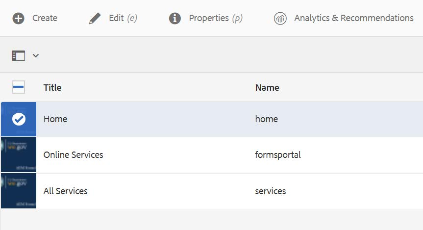
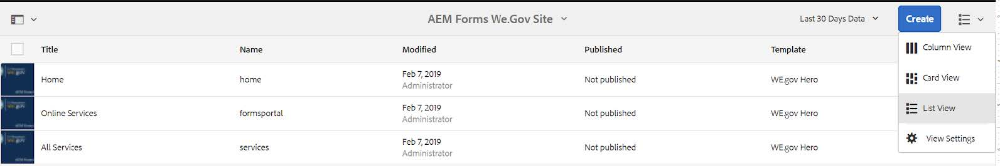

# We.Gov 참조 사이트 설정 및 구성{#set-up-and-configure-we-gov-reference-site}

## 데모 패키지 세부 정보 {#demo-package-details}

### 설치 사전 요구 사항 {#installation-prerequisites}

이 패키지는 AEM Forms **6.4 OSGI 작성자용으로**&#x200B;제작되었으며, 테스트되었으며, 따라서 다음 플랫폼 버전에서 지원됩니다.

| AEM 버전 | AEM FORMS 패키지 버전 | 상태 |
|---|---|---|
| 6.4 | 5.0.86 | **지원됨** |
| 6.5 | 6.0.80 | **지원됨** |

이 패키지에는 다음 플랫폼 버전을 지원하는 클라우드 구성이 포함되어 있습니다.

| 클라우드 공급자 | 서비스 버전 | 상태 |
|---|---|---|
| Adobe Sign | v5 API | **지원됨** |
| Microsoft Dynamics 365 | 1710 (9.1.0.3020) | **지원됨** |

**패키지 설치 고려 사항:**

* 패키지는 다른 데모 패키지 또는 이전 데모 패키지 버전이 없는 클린 서버에 설치될 예정입니다.
* OSGI 서버에 패키지가 설치되어 작성자 모드에서 실행 중입니다.

### 이 패키지에 포함된 제품 {#what-does-this-package-include}

AEM Forms We.Gov 데모 패키지(**we-gov-forms.pkg.all-&lt;버전>.zip**)는 다른 여러 하위 패키지 및 서비스를 포함하는 패키지로 제공됩니다. 패키지에는 다음 모듈이 포함되어 있습니다.

* **we-gov-forms.pkg.all-&lt;버전>.zip** - *전체 데모 패키지*

   * **we-gov-forms.ui.apps-&lt;버전>.zip** *- 모든 구성 요소, 클라이언트 라이브러리, 샘플 사용자, 워크플로우 모델 등을 포함합니다.*

      * **we-gov-forms.core-&lt;version>.jar** - *모든 OSGI 서비스, 사용자 정의 워크플로우 단계 구현 등이 포함되어 있습니다.*

      * **core.wcm.components.all-2.0.4.zip** - *샘플 WCM 구성 요소 컬렉션*

      * **grid-aem.ui.apps-1.0-SNAPSHOT.zip** - *사이트용 AEM 사이트 격자 레이아웃 패키지 페이지 열 컨트롤*
   * **we-gov-forms.ui.content-&lt;버전>.zip** - *모든 컨텐츠, 페이지, 이미지, 양식, 대화형 통신 자산 등이 포함되어 있습니다.*

   * **we-gov-forms.config.public-&lt;version>.zip** - *양식 데이터 모델 및 서비스 바인딩 문제를 방지하기 위해 자리 표시자 클라우드 구성을 비롯한 모든 기본 구성 노드를 포함합니다.*

이 패키지에 포함된 자산은 다음과 같습니다.

* 편집 가능한 템플릿이 있는 AEM 사이트 페이지
* AEM Forms 적응형 양식
* AEM Forms Interactive Communications(인쇄 및 웹 채널)
* AEM Forms XDP 기록 문서
* AEM Forms MS Dynamics Forms 데이터 모델
* Adobe Sign 통합
* AEM 워크플로우 모델
* AEM Assets 샘플 이미지

## 구성 옵션 {#configuration-options}

이 섹션에는 구성 옵션에 대한 세부 사항이 포함됩니다. 현재 이 섹션은 의도적으로 비어 있습니다.

## 데모 패키지 설치 {#demo-package-installation}

이 섹션에는 데모 패키지 설치에 대한 정보가 포함되어 있습니다.

### 패키지 공유에서 {#from-package-share}

1. https://&lt; *aemserver>:&lt;port>/crx/packageshare/*

   또는 AEM에서 배포를 클릭하고 패키지 공유 아이콘으로 이동합니다.

   

1. Adobe ID를 사용하여 로그인합니다.
1. we-gov-forms.pkg.all-&lt;버전> **** 패키지를 검색하고 찾습니다.
1. &quot;다운로드&quot; 옵션을 선택하고 약관에 동의합니다.
1. 다운로드가 완료되면 &quot;다운로드됨&quot; 옵션을 선택하여 패키지 관리자에서 패키지를 찾습니다.
1. &quot;설치&quot; 옵션을 선택하여 패키지를 설치합니다.

   

1. 설치 과정이 완료되도록 허용합니다.
1. https://&lt; *aemserver>:&lt;port>/content/we-gov/home.html?wcmmode=disabled로 이동하여* 설치가 성공했는지 확인합니다.

### 로컬 ZIP 파일에서 {#from-a-local-zip-file}

1. we-gov-forms.pkg.all-&lt;version>.zip **** 파일을 다운로드하여 찾습니다.
1. https://&lt; *aemserver>:&lt;port>/crx/packmgr/index.jsp으로 이동합니다*.
1. &quot;패키지 업로드&quot; 옵션을 선택합니다.

   

1. 파일 브라우저를 사용하여 다운로드한 ZIP 파일로 이동하여 선택합니다.
1. &quot;열기&quot;를 클릭하여 업로드합니다.
1. 업로드한 후 &quot;설치&quot; 옵션을 선택하여 패키지를 설치합니다.

   

1. 설치 과정이 완료되도록 허용합니다.
1. https://&lt; *aemserver>:&lt;port>/content/we-gov/home.html?wcmmode=disabled로 이동하여* 설치가 성공했는지 확인합니다.

### 새 패키지 버전 설치 {#installing-new-package-versions}

새 패키지 버전을 설치하려면 4.1 및 4.2에 정의된 단계를 따르십시오.다른 이전 패키지가 이미 설치되어 있는 동안 새 패키지 버전을 설치할 수 있지만, 먼저 이전 패키지 버전을 제거하는 것이 좋습니다. 이렇게 하려면 아래 절차를 따르십시오.

1. https://&lt; *aemserver>:&lt;port>/crx/packmgr/index.jsp으로 이동합니다.*
1. 이전 **we-gov-forms.pkg.all-&lt;version>.zip** 파일을 찾습니다.
1. &quot;자세히&quot; 옵션을 선택합니다.
1. 드롭다운에서 &quot;제거&quot; 옵션을 선택합니다.

   

1. 확인 시 &quot;제거&quot;를 다시 선택하고 제거 프로세스를 완료합니다.

## 데모 패키지 구성 {#demo-package-configuration}

이 섹션에는 프레젠테이션 전에 데모 패키지의 배포 후 구성에 대한 세부 사항과 지침이 포함되어 있습니다.

### 가상 사용자 구성 {#fictional-user-configuration}

1. https://&lt; *aemserver>:&lt;port>/libs/granite/security/content/groupadmin.html으로 이동합니다.*
1. &quot;**워크플로우**&quot;를 검색합니다.
1. &quot;**workflow-users**&quot; 그룹을 선택하고 &quot;속성&quot;을 클릭합니다.
1. &quot;구성원&quot; 탭으로 이동합니다.
1. &quot;사용자 또는 그룹 **선택** &quot; 필드에 wegov를 입력합니다.
1. 드롭다운 &quot;We.Gov 양식&#x200B;**사용자&quot;에서**&#x200B;선택합니다.

   

1. 메뉴 모음에서 &quot;저장 및 닫기&quot;를 클릭합니다.
1. &quot;**analytics**&quot;를 검색하고, &quot;Analytics Administrators&quot;**그룹을**&#x200B;선택하고, &quot;We.Gov Form **Users**&quot; 그룹을 구성원으로 추가하여 2-7단계를 반복합니다.
1. &quot;**양식 사용자**&quot;를 검색하고 &quot;**양식 파워 사용자**&quot; 그룹을 선택한 다음 &quot;We.Gov 양식 사용자&#x200B;**&quot; 그룹을 멤버로 추가하여 2-7단계를**&#x200B;반복합니다.
1. &quot;**양식 사용자**&quot;를 검색하고, &quot;**양식 사용자**&quot; 그룹을 선택한 다음, 이번에는 &quot;We.Gov 사용자&#x200B;**&quot; 그룹을**&#x200B;구성원으로 추가하여 2-7단계를 반복합니다.

### 이메일 서버 구성 {#email-server-configuration}

1. 설치 설명서 검토 [이메일 알림 구성](/help/sites-administering/notification.md)

1. https://&lt; *aemserver>:&lt;port>/system/console/configMgr로 이동합니다.*
1. 구성할 Day CQ **Mail Service를** 찾아 클릭합니다.

   

1. 원하는 SMTP 서버에 연결할 서비스를 구성합니다.

   1. **SMTP 서버 호스트 이름**:e.g(smtp.gmail.com)
   1. **서버 포트**:예: SSL을 사용하는 이메일의 경우 465)
   1. **SMTP 사용자:** demo@ &lt;companyname> .com
   1. **&quot;보낸 사람&quot; 주소**:aemformsdemo@adobe.com
   

1. &quot;저장&quot;을 클릭하여 구성을 저장합니다.

### AEM SSL 구성 {#aemsslconfig}

이 섹션에는 Adobe Sign 클라우드 구성을 구성할 수 있도록 AEM 인스턴스에서 SSL을 구성하는 방법에 대한 세부 사항이 포함되어 있습니다.

**참조:**

1. [기본적으로 SSL](/help/sites-administering/ssl-by-default.md)

**메모:**

1. https://&lt;aemserver>:&lt;port>/aem/inbox로 이동하여 위의 참조 설명서 링크에 설명된 프로세스를 완료할 수 있습니다.
1. we- **gov-forms.pkg.all-&lt;버전>.zip** 패키지에는 패키지의 일부인 **we-gov-forms.pkg.all-&lt;버전>.zip/ssl** 폴더를 추출하여 액세스할 수 있는 샘플 SSL 키와 인증서가 포함되어 있습니다.

1. SSL 인증서 및 키 세부 사항:

   1. &quot;CN=localhost&quot;에 발급됨
   1. 10년 유효성
   1. &quot;password&quot; 암호 값

### Adobe Sign cloud configuration {#adobe-sign-cloud-configuration}

이 섹션에는 Adobe Sign 클라우드 구성에 대한 세부 사항과 지침이 포함되어 있습니다.

**참조:**

1. [AEM Forms와 Adobe Sign 통합](adobe-sign-integration-adaptive-forms.md)

#### Cloud configuration {#cloud-configuration}

1. **사전 요구 사항을 검토하십시오. 필요한[SSL](../../forms/using/forms-install-configure-gov-reference-site.md#aemsslconfig)구성에 대해서는 AEM SSL 구성을 참조하십시오.**
1. 다음으로 이동:

   *https://&lt;aemserver>:&lt;port>/libs/adobesign/cloudservices/adobesign.html/conf/we-gov*

   >[!NOTE]
   >
   >AEM 서버에 액세스하는 데 사용되는 URL은 구성 문제를 방지하기 위해 Adobe Sign OAuth 리디렉션 URI에 구성된 URL과 일치해야 합니다(예: *https://&lt;aemserver>:&lt;포트>/mnt/overlay/adobesign/cloudservices/adobesign/properties.html*).

1. &quot;We.gov Adobe Sign&quot; 구성을 선택합니다.
1. &quot;속성&quot;을 클릭합니다.
1. &quot;설정&quot; 탭으로 이동합니다.
1. Auth URL 입력(예: [https://secure.na1.echosign.com/public/oauth](https://secure.na1.echosign.com/public/oauth)
1. 구성된 Adobe Sign 인스턴스에서 구성된 클라이언트 ID와 클라이언트 암호를 제공합니다.
1. &quot;Adobe Sign에 연결&quot;을 클릭합니다.
1. 연결이 완료되면 &quot;저장 및 닫기&quot;를 클릭하여 통합을 완료합니다.

### MS Dynamics 클라우드 구성 {#ms-dynamics-cloud-configuration}

이 섹션에는 MS Dynamics Cloud 구성에 대한 세부 사항과 지침이 포함되어 있습니다.

**참조:**

1. [Microsoft Dynamics OData 구성](https://docs.adobe.com/content/help/en/experience-manager-64/forms/form-data-model/ms-dynamics-odata-configuration.html)
1. [AEM Forms용 Microsoft Dynamics 구성](https://helpx.adobe.com/experience-manager/kt/forms/using/config-dynamics-for-aem-forms.html)

#### MS Dynamics OData 클라우드 서비스 {#ms-dynamics-odata-cloud-service}

1. 다음으로 이동:

   https://&lt;aemserver>:&lt;port>/libs/fd/fdm/gui/components/admin/fdmcloudservice/fdm.html/conf/we-gov

   1. MS Dynamics 애플리케이션 등록에 구성된 동일한 리디렉션 URL을 사용하여 서버에 액세스하는지 확인합니다.

1. &quot;Microsoft Dynamics OData 클라우드 서비스&quot; 구성을 선택합니다.
1. &quot;속성&quot;을 클릭합니다.

   

1. &quot;인증 설정&quot; 탭으로 이동합니다.
1. 다음 세부 정보를 입력합니다.

   1. **서비스 루트:** 예: https://msdynamicsserver.api.crm3.dynamics.com/api/data/v9.1/
   1. **인증 유형:** OAuth 2.0
   1. **인증 설정** ( [이 정보를 수집하려면 MS Dynamics 클라우드 구성 설정](../../forms/using/forms-install-configure-gov-reference-site.md#dynamicsconfig) 참조):

      1. 클라이언트 ID - 애플리케이션 ID라고도 함
      1. 클라이언트 암호
      1. OAuth URL - 예: [https://login.windows.net/common/oauth2/authorize](https://login.windows.net/common/oauth2/authorize)
      1. 토큰 URL 새로 고침 - 예: [https://login.windows.net/common/oauth2/token](https://login.windows.net/common/oauth2/token)
      1. 액세스 토큰 URL - 예: [https://login.windows.net/common/oauth2/token](https://login.windows.net/common/oauth2/token)
      1. 인증 범위 - **열기**
      1. 인증 헤더 - **인증 전달자**
      1. 리소스 - 예: [https://msdynamicsserver.api.crm3.dynamics.com](https://msdynamicsserver.api.crm3.dynamics.com)
   1. &quot;OAuth에 연결&quot;을 클릭합니다.

1. 인증이 완료되면 &quot;저장 및 닫기&quot;를 클릭하여 통합을 완료합니다.

#### MS Dynamics 클라우드 구성 설정 {#dynamicsconfig}

이 섹션에 설명된 단계는 MS Dynamics Cloud 인스턴스에서 클라이언트 ID, 클라이언트 암호 및 세부 사항을 찾는 데 도움이 됩니다.

1. https://portal.azure.com/ [으로](https://portal.azure.com/) 이동하여 로그인합니다.
1. 왼쪽 메뉴에서 &quot;모든 서비스&quot;를 선택합니다.
1. &quot;앱 등록&quot;을 검색하거나 탐색합니다.
1. 기존 애플리케이션 등록을 만들거나 선택합니다.
1. AEM **클라우드** 구성에서 OAuth 클라이언트 **ID로** 사용할 응용 프로그램 ID 복사
1. &quot;설정&quot; 또는 &quot;매니페스트&quot;를 클릭하여 회신 URL을 **구성합니다.**

   1. 이 URL은 OData 서비스를 구성할 때 AEM 서버에 액세스하는 데 사용되는 URL과 일치해야 합니다.

1. 설정 보기에서 &quot;키&quot;를 클릭하여 새 키(AEM에서 클라이언트 암호로 사용)를 만듭니다.

   1. 나중에 Azure 또는 AEM에서 볼 수 없으므로 키의 복사본을 보관하십시오.

1. 리소스 URL/서비스 루트 URL을 찾으려면 MS Dynamics 인스턴스 대시보드로 이동합니다.
1. 상단 탐색 막대에서 &quot;Sales&quot; 또는 고유한 인스턴스 유형과 &quot;Select Settings(설정 선택)&quot;를 클릭합니다.
1. 오른쪽 하단에 있는 &quot;사용자 정의&quot; 및 &quot;개발자 리소스&quot;를 클릭합니다.
1. 서비스 루트 URL은 여기에서 찾을 수 있습니다.e-g

   *[https://msdynamicsserver.api.crm3.dynamics.com/api/data/v9.1/](https://msdynamicsserver.api.crm3.dynamics.com/api/data/v9.1/)*

1. 새로 고침 및 액세스 토큰 URL에 대한 자세한 내용은 다음 링크를 참조하십시오.

   *[https://docs.microsoft.com/en-us/rest/api/datacatalog/authenticate-a-client-app](https://docs.microsoft.com/en-us/rest/api/datacatalog/authenticate-a-client-app)*

#### 양식 데이터 모델 테스트 {#testing-the-form-data-model}

클라우드 구성이 완료되면 양식 데이터 모델을 테스트할 수 있습니다.

1. 다음으로 이동

   *https://&lt;aemserver>:&lt;port>/aem/forms.html/content/dam/formsanddocuments-fdm/we-gov*

1. &quot;We.gov Microsoft Dynamics CRM FDM&quot;을 선택하고 &quot;속성&quot;을 선택합니다.

   

1. &quot;소스 업데이트&quot; 탭으로 이동합니다.
1. &quot;컨텍스트 인식 구성&quot;이 &quot;/conf/we-gov&quot;로 설정되어 있고 구성된 데이터 소스가 &quot;ms-dynamics-odata-cloud-service&quot;인지 확인하십시오.

   

1. 양식 데이터 모델을 편집합니다.

   >[!NOTE]
   다시 설치해야 하는 문제를 **방지하려면 저장** 및 **닫기** 대신 취소를 클릭하십시오.

1. 서비스를 테스트하여 구성된 데이터 소스에 성공적으로 연결되었는지 확인합니다.

   >[!NOTE]
   데이터 소스가 FDM에 성공적으로 바인딩되려면 AEM Server를 다시 시작해야 한다고 보고되었습니다.

### Adobe Analytics configuration {#adobe-analytics-configuration}

이 섹션에는 Adobe Analytics 클라우드 구성에 대한 세부 사항과 지침이 포함되어 있습니다.

**참조:**

* [Adobe Analytics와 통합](../../sites-administering/adobeanalytics.md)

* [Adobe Analytics에 연결 및 프레임워크 만들기](../../sites-administering/adobeanalytics-connect.md)

* [페이지 분석 데이터 보기](../../sites-authoring/pa-using.md)

* [분석 및 보고서 구성](configure-analytics-forms-documents.md)

* [AEM Forms 분석 보고서 보기 및 이해](view-understand-aem-forms-analytics-reports.md)

### Adobe Analytics 클라우드 서비스 구성 {#adobe-analytics-cloud-service-configuration}

이 패키지는 Adobe Analytics에 연결하도록 미리 구성되어 있습니다. 이 구성을 업데이트할 수 있도록 아래 단계가 제공됩니다.

1. https://&lt; *aemserver>:&lt;port>/libs/cq/core/content/tools/cloudservices.html으로 이동합니다.*
1. Adobe Analytics 섹션을 찾아 &quot;구성 표시&quot; 링크를 선택합니다.
1. &quot;Adobe.Gov Adobe Analytics(Analytics 구성)&quot; 구성을 선택합니다.

   

1. &quot;편집&quot; 단추를 클릭하여 Adobe Analytics 구성을 업데이트합니다(공유 암호 제공 필요). &quot;Connect to Analytics&quot;를 클릭하여 연결하고 &quot;확인&quot;을 클릭하여 완료합니다.

   

1. 프레임워크 구성을 업데이트하려면 같은 페이지에서 &quot;Adobe.Gov Adobe Analytics Framework(Analytics Framework)&quot;를 클릭합니다(작성을 [활성화하려면 AEM 작성](../../forms/using/forms-install-configure-gov-reference-site.md#enableauthoring) 활성화 참조).

### Adobe Analytics 보고 {#adobe-analytics-reporting}

#### Adobe Analytics 사이트 보고 보기 {#view-adobe-analytics-sites-reporting}

1. https://&lt; *aemserver>:&lt;port>/sites.html/content로 이동합니다.*
1. &quot;AEM Forms We.Gov 사이트&quot;를 선택하여 사이트 페이지를 봅니다.
1. 사이트 페이지(예: 홈) 중 하나를 선택하고 &quot;분석 및 권장 사항&quot;을 선택합니다.

   

1. 이 페이지에서는 AEM Sites 페이지와 관련된 Adobe Analytics에서 가져온 정보를 볼 수 있습니다(참고:이 정보는 Adobe Analytics에서 정기적으로 새로 고쳐지고 실시간으로 표시되지 않습니다.)

   

1. 3단계에서 액세스한 페이지 보기 페이지로 돌아가면 디스플레이 설정을 변경하여 &quot;목록 보기&quot;에서 항목을 볼 수도 있습니다.
1. &quot;보기&quot; 드롭다운 메뉴를 찾아 &quot;목록 보기&quot;를 선택합니다.

   

1. 동일한 메뉴에서 &quot;설정 보기&quot;를 선택하고 &quot;분석&quot; 섹션에서 표시할 열을 선택합니다.

   

1. &quot;업데이트&quot;를 클릭하여 새 열을 사용할 수 있도록 합니다.

   

#### Adobe Analytics 양식 보고 보기 {#view-adobe-analytics-forms-reporting}

1. 다음으로 이동

   *https://&lt;aemserver>:&lt;port>/aem/forms.html/content/dam/formsanddocuments/adobe-gov-forms*

1. &quot;건강 혜택을 위한 등록 애플리케이션&quot; 적응형 양식을 선택하고 &quot;분석 보고서&quot; 옵션을 선택합니다.

   

1. 페이지가 로드될 때까지 기다렸다가 Analytics 보고서 데이터를 봅니다.

   

#### Adobe Analytics 보고 보기 {#view-adobe-analytics-reporting}

선택적으로 Adobe Analytics로 직접 이동하여 분석 데이터를 볼 수 있습니다.

1. https://my.omniture.com/login/으로 [이동](https://my.omniture.com/login/)
1. 자격 증명을 사용하여 로그인:

   1. **회사:** AEM Forms 데모
   1. **사용자:** &lt;요청 시 사용 가능>
   1. **암호:** &lt;요청 시 사용 가능>

1. 보고서 세트에서 &quot;We.Gov 참조 사이트&quot;를 선택합니다.

   

1. 사용 가능한 보고서 중 하나를 선택하여 해당 보고서의 분석 데이터를 표시합니다.

   

## 데모 패키지 사용자 정의 {#demo-package-customizations}

이 섹션에는 데모 사용자 지정에 대한 지침이 포함되어 있습니다.

### AEM 작성 활성화 {#enableauthoring}

이 데모 패키지에는 대상 작성자 서버에서 WCM 필터 서비스의 동작을 제어하는 OSGI 서비스 구성 파일이 포함되어 있습니다. 이 구성을 통해 서버는 데모를 허용하기 위해 비활성화된 작성자 모드(?wcmmode=disabled)에서 작동합니다. 이 구성을 업데이트하고 작성을 활성화하려면 다음 단계를 수행하십시오.

1. https://&lt; *aemserver>:&lt;port>/system/console/configMgr로 이동합니다.*
1. 구성할 Day CQ WCM **Filter** Service 서비스를 찾아 클릭합니다.

   

1. &quot;WCM 모드&quot;의 값을&#x200B;**&quot;**&#x200B;편집&quot;**으로**&#x200B;설정합니다.
1. &quot;저장&#x200B;****&quot;을 클릭하여 구성을 적용합니다.

### 템플릿 사용자 정의 {#templates-customization}

편집 가능한 템플릿은 다음 위치에서 찾을 수 있습니다.

*https://&lt;aemserver>:&lt;port>/libs/wcm/core/content/sites/templates.html/conf/we-gov*

이러한 템플릿에는 AEM 사이트, 적응형 양식 및 다음 사이트에서 찾을 수 있는 구성 요소로 작성 및 조합된 대화형 통신 템플릿이 포함되어 있습니다.

*https://&lt;aemserver>:&lt;port>/crx/de/index.jsp#/apps/we-gov/components*

#### Style system {#customizetemplates}

또한 이 사이트에는 클라이언트 라이브러리가 있으며, 이 중 하나가 Bootstrap 4( https://getbootstrap.com/  )를 가져옵니다. 이 클라이언트 라이브러리는

*https://&lt;aemserver>:&lt;port>/crx/de/index.jsp#/apps/we-gov/clientlibs/clientlib-base/css/bootstrap*

이 패키지에 포함된 편집 가능한 템플릿은 페이지 매김, 스타일 지정 등을 위해 Bootstrap 4 CSS 클래스를 사용하는 템플릿/페이지 정책으로 미리 구성되어 있습니다. 일부 클래스가 템플릿 정책에 추가된 것은 아니지만 Bootstrap 4에서 지원하는 모든 클래스를 정책에 추가할 수 있습니다. 사용 가능한 클래스 목록은 시작 페이지를 참조하십시오.

[https://getbootstrap.com/docs/4.1/getting-started/introduction/](https://getbootstrap.com/docs/4.1/getting-started/introduction/)

이 패키지에 포함된 템플릿은 스타일 시스템도 지원합니다.

[스타일 시스템](../../sites-authoring/style-system.md)

#### 템플릿 로고 {#template-logos}

Project DAM Assets에는 We.Gov 로고와 이미지도 포함되어 있습니다. 이러한 자산은 다음 사이트에서 사용할 수 있습니다.

*https://&lt;aemserver>:&lt;port>/assets.html/content/dam/we-gov*

페이지 및 양식 템플릿을 편집할 때 내비게이션 및 바닥글 구성 요소를 편집하여 브랜드 로고를 업데이트하도록 선택할 수 있습니다. 이러한 구성 요소는 로고를 업데이트하는 데 사용할 수 있는 구성 가능한 브랜드 및 로고 대화 상자를 제공합니다.

자세한 내용은 페이지 컨텐츠 편집을 참조하십시오.

[페이지 컨텐츠 편집](../../sites-authoring/editing-content.md)

### 사이트 페이지 맞춤화 {#sites-pages-customization}

모든 사이트 페이지는 다음 사이트에서 사용할 수 있습니다. *https://&lt;aemserver>:&lt;port>/sites.html/content/we-gov*

이러한 사이트 페이지는 AEM 격자 패키지를 사용하여 몇 가지 구성 요소의 레이아웃을 제어합니다.

#### Style system {#style-system}

이 패키지에 포함된 페이지는 스타일 시스템도 지원합니다.

[스타일 시스템](../../sites-authoring/style-system.md)

지원되는 스타일에 대한 설명서는 [템플릿 사용자 정의 스타일 시스템을](../../forms/using/forms-install-configure-gov-reference-site.md#customizetemplates) 참조할 수도 있습니다.

### 적응형 양식 맞춤화 {#adaptive-forms-customization}

모든 적응형 양식을 다음 위치에서 사용할 수 있습니다.

*https://&lt;aemserver>:&lt;port>/aem/forms.html/content/dam/formsanddocuments/adobe-gov-forms*

이러한 양식은 특정 사례에 맞게 사용자 정의할 수 있습니다. 특정 필드 및 제출 논리는 양식이 올바로 작동되도록 수정해서는 안 됩니다. 여기에는 다음이 포함됩니다.

**건강 혜택을 위한 등록 신청:**

* contact_id - 제출 시 MS Dynamics 연락처 ID를 받는 데 사용되는 숨김 필드
* 제출 - 콜백을 지원하려면 제출 단추 로직을 사용자 정의해야 합니다. 사용자 지정은 문서화되어 있지만, 양식 데이터 모델을 통해 POST 및 GET 작업을 MS Dynamics로 수행하는 동안 큰 스크립트가 양식을 제출해야 했습니다.
* 루트 패널 - 초기화 이벤트는 모든 AEM 받은 편지함 [화강암 UI] 구성 요소가 수정할 수 없으므로 최소한의 침입으로 MS Dynamics 버튼을 AEM 받은 편지함에 추가하는 데 사용됩니다.

#### 적응형 양식 스타일 {#adaptive-form-styling}

스타일 편집기 또는 테마 편집기를 사용하여 적응형 양식의 스타일을 지정할 수도 있습니다.

* [적응형 양식 구성 요소의 인라인 스타일](inline-style-adaptive-forms.md)
* [테마 만들기 및 사용](themes.md)

### 워크플로우 맞춤화 {#workflow-customization}

등록 적응형 양식은 처리를 위해 OSGI 워크플로우에 제출됩니다. 이 워크플로우는 https://&lt;aemserver>:&lt; *port>/conf/we-gov/settings/models/we-gov-process.html에서 찾을 수 있습니다*.

특정 제한 사항으로 인해 이 워크플로우에는 몇 가지 스크립트와 사용자 정의 OSGI 워크플로우 프로세스 단계가 포함되어 있습니다. 이러한 워크플로우 단계는 일반 단계로 생성되었으며 구성 대화 상자로 만들어지지 않았습니다. 현재 워크플로우 단계의 구성은 프로세스 인수에 따라 달라집니다.

모든 워크플로우 단계 Java 코드는 **we-gov-forms.core-&lt;version>.jar** 번들에 포함되어 있습니다.

## 데모 고려 사항 및 알려진 문제 {#demo-considerations-and-known-issues}

이 섹션에는 데모 프로세스 중에 특별한 고려 사항이 필요할 수 있는 데모 기능 및 디자인 결정에 대한 정보가 포함되어 있습니다.

### 데모 고려 사항 {#demo-considerations}

* AGRS-159에 따라 등록 적응형 양식에 사용된 연락처의 이름(첫 번째, 가운데 및 마지막)이 고유해야 합니다.
* 등록 적응형 양식은 Adobe Sign 이메일을 양식의 이메일 필드에 지정된 이메일로 보냅니다. 해당 이메일 주소는 Adobe Sign 클라우드 구성을 구성하는 데 사용된 이메일과 동일한 이메일 주소가 될 수 없습니다.
* 기본적으로 데모 패키지에는 데모를 호스팅하는 대상 서버의 전체 동작을 제어하는 여러 OSGI 서비스 구성이 포함되어 있습니다. 이러한 구성에는 기본적으로 서버가 **비활성화된 작성자** 모드에서 작동하도록 하는 WCM 필터 서비스 구성이 포함됩니다(?wcmmode=disabled)와 같음). 페이지 [작성을 허용하려면 AEM 작성](../../forms/using/forms-install-configure-gov-reference-site.md#enableauthoring) 활성화를 참조하십시오.

### 알려진 문제 {#known-issues}

* (AGRS-120) 사이트 탐색 구성 요소는 현재 2개 수준 이상의 중첩된 하위 페이지를 지원하지 않습니다.
* (AGRS-159) 현재 MS Dynamics FDM은 2개의 작업을 먼저 수행하고 등록 적응형 양식 데이터를 Dynamics에 게시한 다음 연락처 ID를 검색하기 위해 사용자 레코드를 반입해야 합니다. 현재 상태에서는 이름이 같은 두 명 이상의 사용자가 Dynamics에 있으면 연락처 ID를 가져올 수 없으므로 등록 적응형 양식을 제출할 수 없습니다.

## 다음 단계 {#next-steps}

이제 We.Gov 참조 사이트를 탐구할 수 있습니다. We.Gov 참조 사이트 워크플로 및 단계에 대한 자세한 내용은 We. [Gov 참조 사이트 연습을](../../forms/using/forms-gov-reference-site-user-demo.md)참조하십시오.
