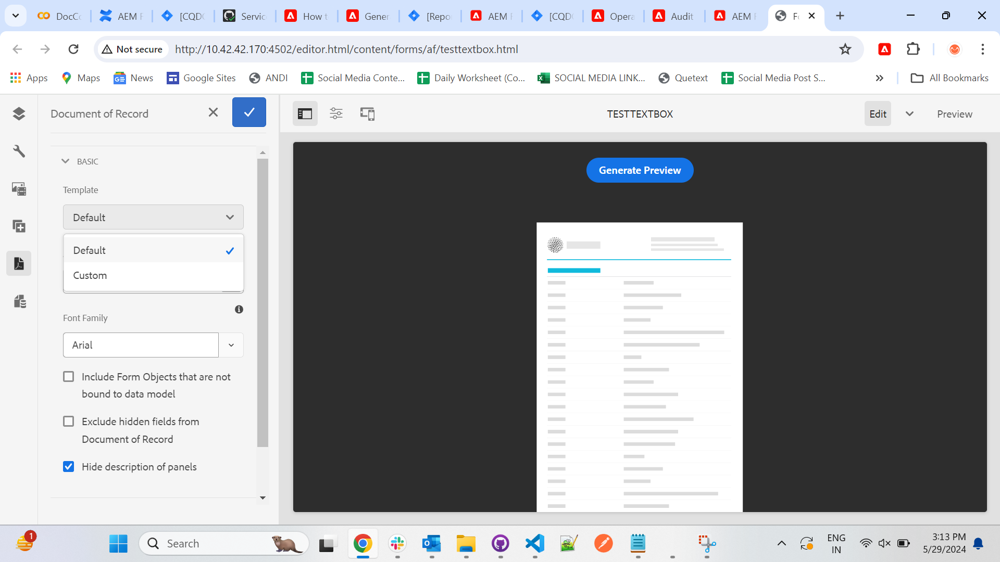

# 적응형 양식 또는 적응형 양식 단편을 위한 기록 문서 생성 {#generate-document-of-record-for-adaptive-forms}

<span class="preview"> [새 적응형 양식 만들기](/help/forms/using/create-an-adaptive-form-core-components.md) 또는 [AEM Sites 페이지에 적응형 양식 추가](/help/forms/using/create-or-add-an-adaptive-form-to-aem-sites-page.md) 작업을 할 때 현대적이고 확장 가능한 데이터 캡처 [핵심 구성 요소](https://experienceleague.adobe.com/docs/experience-manager-core-components/using/adaptive-forms/introduction.html)를 사용하는 것이 좋습니다. 이러한 구성 요소는 적응형 양식 만들기 작업이 대폭 개선되어 우수한 사용자 경험을 보장할 수 있게 되었음을 나타냅니다. 이 문서에서는 기초 구성 요소를 사용하여 적응형 양식을 작성하는 이전 접근법에 대해 설명합니다. </span>

| 버전 | 문서 링크 |
| -------- | ---------------------------- |
| AEM as a Cloud Service | [여기 클릭](https://experienceleague.adobe.com/docs/experience-manager-cloud-service/content/forms/adaptive-forms-authoring/authoring-adaptive-forms-foundation-components/generate-document-of-record-for-non-xfa-based-adaptive-forms.html) |
| AEM 6.5 | 이 문서 |


## 개요 {#overview}

일반적으로 양식을 제출한 후 고객은 향후 참조를 위해 양식에 작성한 정보를 인쇄 또는 문서 형식으로 기록하기를 원합니다. 이를 기록 문서라고 합니다.

이 문서에서는 적응형 Forms 또는 적응형 양식 조각에 대한 기록 문서를 생성하는 방법에 대해 설명합니다.

>[!NOTE]
>
> 적응형 양식 편집기에서 적응형 양식 조각 및 해당 필드를 사용자 지정할 수 있는 지원은 AEM 6.5 Forms 서비스 팩 19(6.5.19.0)와 함께 도입되었습니다.


>[!NOTE]
>
>XFA 기반 적응형 양식에서는 기록 문서의 자동 생성이 지원되지 않습니다. 그러나 적응형 양식을 기록 문서로 만드는 데 사용되는 XDP를 사용할 수 있습니다.

## 적응형 양식 유형 및 해당 기록 문서 {#adaptive-form-types-and-their-documents-of-record}

적응형 양식을 만들 때 양식 모델을 선택할 수 있습니다. 옵션은 다음과 같습니다.

* [양식 서식 파일](../../forms/using/creating-adaptive-form.md#create-an-adaptive-form-based-on-an-xfa-form-template)
적응형 양식에 대한 XFA 템플릿을 선택할 수 있습니다. XFA 템플릿을 선택하면 위에서 설명한 대로 기록 문서에 관련 XDP 파일을 사용할 수 있습니다.

* [XML 스키마](../../forms/using/creating-adaptive-form.md#create-an-adaptive-form-based-on-xml-or-json-schema)
적응형 양식에 대한 XML 스키마 정의를 선택할 수 있습니다. 적응형 양식에 대한 XML 스키마를 선택하면 다음 작업을 수행할 수 있습니다.

   * 기록 문서에 대한 XFA 템플릿을 연결합니다. 연결된 XFA 템플릿이 적응형 양식과 동일한 XML 스키마를 사용하는지 확인합니다.
   * 기록 문서 자동 생성

* 없음
양식 모델 없이 적응형 양식을 만들 수 있습니다. 기록 문서는 적응형 양식에 대해 자동으로 생성됩니다.

양식 모델을 선택할 때는 기록 문서 템플릿 구성에서 사용할 수 있는 옵션을 사용하여 기록 문서를 구성합니다. [기록 문서 템플릿 구성](#document-of-record-template-configuration)을 참조하세요.

## 자동 생성된 기록 문서 {#automatically-generated-document-of-record}

기록 문서를 통해 고객은 인쇄 목적으로 제출된 양식의 사본을 보관할 수 있습니다. 자동으로 기록 문서를 생성하면 양식을 변경할 때마다 기록 문서가 즉시 업데이트됩니다. 예를 들어 미국 을 해당 국가로 선택하는 고객의 연령 필드를 제거합니다. 이러한 고객이 기록 문서를 생성할 때 기록 문서에 연령 필드가 표시되지 않습니다.

자동 생성된 기록 문서에는 다음과 같은 이점이 있습니다.

* 데이터 바인딩을 처리합니다.
* 제출 시 기록 문서에서 제외됨으로 표시된 필드를 자동으로 숨깁니다. 별도의 노력이 필요하지 않습니다.
* 기록 문서 템플릿을 디자인하는 데 시간이 절약됩니다.
* 다양한 기본 템플릿을 사용하여 다양한 스타일 및 모양을 시도하고 기록 문서에 가장 적합한 스타일 및 모양을 선택할 수 있습니다. 스타일 모양새는 선택 사항이며 스타일을 지정하지 않으면 시스템 스타일이 기본값으로 설정됩니다.
* 양식의 모든 변경 사항이 기록 문서에 즉시 반영되도록 합니다.

## 기록 문서를 자동으로 생성할 구성 요소 {#components-to-automatically-generate-a-document-of-record}

적응형 양식에 대한 기록 문서를 생성하려면 다음 구성 요소가 필요합니다.

기록 문서를 생성할 **적응형 양식** 적응형 양식입니다.

기록 문서를 생성할 **적응형 양식 단편** 적응형 양식 단편.

AEM Designer에서 만든 **기본 템플릿(권장)** XFA 템플릿(XDP 파일). 기본 템플릿은 기록 문서 템플릿의 스타일 및 브랜딩 정보를 지정하는 데 사용됩니다.

[기록 문서의 기본 템플릿](#base-template-of-a-document-of-record)을 참조하세요.

>[!NOTE]
>
>기록 문서의 기본 템플릿은 기록 문서의 메타 템플릿이라고도 합니다.

적응형 양식에서 생성된 **기록 문서 템플릿** XFA 템플릿(XDP 파일).

[기록 문서 템플릿 구성](#document-of-record-template-configuration)을 참조하세요.

사용자가 적응형 양식에서 **양식 데이터** 정보를 입력했습니다. 기록 문서 템플릿과 병합하여 기록 문서를 생성합니다.

## 적응형 양식 요소 매핑 {#mapping-of-adaptive-form-elements}

다음 섹션에서는 기록 문서에 적응형 양식 요소가 표시되는 방식을 설명합니다.

### 필드 {#fields}

<table>
 <tbody>
  <tr>
   <th>적응형 양식 구성 요소</th>
   <th>해당 XFA 구성 요소</th>
   <th>기록 문서 템플릿에 기본적으로 포함됩니까?</th>
   <th>메모</th>
  </tr>
  <tr>
   <td>버튼</td>
   <td>버튼</td>
   <td>false</td>
   <td> </td>
  </tr>
  <tr>
   <td>확인란</td>
   <td>확인란</td>
   <td>true</td>
   <td> </td>
  </tr>
  <tr>
   <td>날짜 선택</td>
   <td>날짜/시간 필드</td>
   <td>true</td>
   <td> </td>
  </tr>
  <tr>
   <td>드롭다운 목록</td>
   <td>드롭다운 목록</td>
   <td>true</td>
   <td> </td>
  </tr>
  <tr>
   <td>스크리블 서명</td>
   <td>서명 낙서</td>
   <td>true</td>
   <td> </td>
  </tr>
  <tr>
   <td>숫자 상자</td>
   <td>숫자 필드</td>
   <td>true</td>
   <td> </td>
  </tr>
  <tr>
   <td>암호 상자</td>
   <td>암호 필드</td>
   <td>false</td>
   <td> </td>
  </tr>
  <tr>
   <td>라디오 버튼</td>
   <td>라디오 버튼</td>
   <td>true</td>
   <td> </td>
  </tr>
  <tr>
   <td>텍스트 상자</td>
   <td>텍스트 필드</td>
   <td>true</td>
   <td> </td>
  </tr>
  <tr>
   <td>재설정 버튼</td>
   <td>재설정 버튼</td>
   <td>false</td>
   <td> </td>
  </tr>
  <tr>
   <td>제출 버튼</td>
   <td><p>이메일 제출 단추</p> <p>HTTP 제출 단추</p> </td>
   <td>false</td>
   <td> </td>
  </tr>
  <tr>
   <td>사용 약관</td>
   <td> </td>
   <td>true</td>
   <td> </td>
  </tr>
  <tr>
   <td>첨부 파일</td>
   <td> </td>
   <td>false</td>
   <td>기록 문서 템플릿에서 사용할 수 없습니다. 첨부 파일을 통해 기록 문서에서만 사용할 수 있습니다.</td>
  </tr>
 </tbody>
</table>

### 컨테이너 {#containers}

<table>
 <tbody>
  <tr>
   <th>적응형 양식 구성 요소</th>
   <th>해당 XFA 구성 요소</th>
   <th>메모</th>
  </tr>
  <tr>
   <td>패널<br /> </td>
   <td>하위 양식<br /> </td>
   <td>반복 가능한 패널은 반복 가능한 하위 양식에 매핑됩니다.</td>
  </tr>
 </tbody>
</table>

### 정적 구성 요소 {#static-components}

| 적응형 양식 구성 요소 | 해당 XFA 구성 요소 | 메모 |
|---|---|---|
| 이미지 | 이미지 | 바운드 컨트롤이든 언바운드 컨트롤이든 TextDraw 및 Image 구성 요소는 레코드 설정 문서를 사용하여 제외하지 않는 한 항상 XSD 기반 적응형 양식에 대한 기록 문서에 나타납니다. |
| 텍스트 | 텍스트 |  |

>[!NOTE]
>
>클래식 UI에서는 필드 속성을 편집할 수 있는 다양한 탭을 제공합니다.

### 표 {#tables}

머리글, 바닥글 및 행과 같은 적응형 양식 표 구성 요소는 해당 XFA 구성 요소에 매핑됩니다. 반복 가능한 패널을 기록 문서의 테이블에 매핑할 수 있습니다.

## 기록 문서의 기본 템플릿 {#base-template-of-a-document-of-record}

기본 템플릿은 기록 문서에 스타일 및 모양 정보를 제공합니다. 자동 생성된 기록 문서의 기본 모양을 사용자 지정할 수 있습니다. 예를 들어 회사 로고를 머리글에 추가하고 저작권 정보를 기록 문서의 바닥글에 추가합니다. 기본 템플릿의 마스터 페이지는 기록 문서 템플릿의 마스터 페이지로 사용됩니다. 마스터 페이지에는 기록 문서에 적용할 수 있는 페이지 머리글, 페이지 바닥글 및 페이지 번호와 같은 정보가 있을 수 있습니다. 기록 문서 자동 생성을 위해 기본 템플릿을 사용하여 이러한 정보를 기록 문서에 적용할 수 있습니다. 기본 템플릿을 사용하면 필드의 기본 속성을 변경할 수 있습니다.

기본 템플릿을 디자인할 때는 [기본 템플릿 규칙](#base-template-conventions)을 따라야 합니다.

## 기본 템플릿 규칙 {#base-template-conventions}

기본 템플릿은 기록 문서의 머리글, 바닥글, 스타일 및 모양을 정의하는 데 사용됩니다. 머리글과 바닥글에는 회사 로고와 저작권 텍스트와 같은 정보가 포함될 수 있습니다. 기본 템플릿의 첫 번째 마스터 페이지가 복사되어 기록 문서의 마스터 페이지로 사용됩니다. 이 페이지에는 머리글, 바닥글, 페이지 번호 또는 기록 문서의 모든 페이지에 표시되어야 하는 기타 모든 정보가 들어 있습니다. 기본 템플릿 규칙을 준수하지 않는 기본 템플릿을 사용하는 경우 기본 템플릿의 첫 번째 마스터 페이지가 여전히 기록 문서 템플릿에 사용됩니다. 규칙에 따라 기본 템플릿을 디자인하고 기록 문서의 자동 생성에 사용하는 것이 좋습니다.

**기본 페이지 규칙**

* 기본 템플릿에서 루트 하위 양식의 이름을 `AF_METATEMPLATE`(으)로 지정하고 마스터 페이지의 이름을 `AF_MASTERPAGE`(으)로 지정해야 합니다.

* `AF_MASTERPAGE` 루트 하위 양식 아래에 있는 이름이 `AF_METATEMPLATE`인 마스터 페이지에 머리글, 바닥글 및 스타일 정보 추출을 위한 기본 설정이 지정되어 있습니다.

* `AF_MASTERPAGE`이(가) 없으면 기본 템플릿에 있는 첫 번째 마스터 페이지가 사용됩니다.

**필드에 대한 스타일 규칙**

* 기록 문서의 필드에 스타일을 적용하려면 기본 템플릿에서 `AF_FIELDSSUBFORM` 루트 하위 양식 아래에 있는 `AF_METATEMPLATE` 하위 양식의 필드를 제공합니다.

* 이러한 필드의 속성은 기록 문서의 필드에 적용됩니다. 이러한 필드는 `AF_<name of field in all caps>_XFO` 명명 규칙을 따라야 합니다. 예를들어 확인란의 필드 이름은 `AF_CHECKBOX_XFO`이어야 합니다.

기본 템플릿을 만들려면 AEM Designer에서 다음을 수행하십시오.

1. **파일 > 새로 만들기**&#x200B;를 클릭합니다.
1. **템플릿 기반** 옵션을 선택하십시오.

1. **Forms - 기록 문서** 범주를 선택합니다.
1. **DoR 기본 템플릿**&#x200B;을(를) 선택하십시오.
1. **다음**&#x200B;을(를) 클릭하고 필요한 정보를 제공합니다.

1. (선택 사항) 기록 문서의 필드에 적용할 필드의 스타일 및 모양을 수정합니다.
1. 양식을 저장합니다.

이제 저장된 양식을 기록 문서의 기본 템플릿으로 사용할 수 있습니다.
기본 템플릿에 있는 스크립트를 수정하거나 제거하지 마십시오.

**기본 템플릿 수정**

* 기본 템플릿의 필드 위에 스타일을 적용하지 않을 경우 기본 템플릿에서 해당 필드를 제거하여 기본 템플릿으로의 업그레이드가 자동으로 선택되도록 하는 것이 좋습니다.
* 기본 템플릿을 수정하는 동안 스크립트를 제거, 추가 또는 수정하지 마십시오.

>[!NOTE]
>
>규칙을 사용하고 위의 단계를 엄격히 준수하여 기본 템플릿을 디자인합니다.

## 기록 문서 템플릿 구성 {#document-of-record-template-configuration}

고객이 제출된 양식의 인쇄용 사본을 다운로드할 수 있도록 양식의 기록 문서 템플릿을 구성합니다. XDP 파일은 기록 문서 템플릿 역할을 합니다. 고객이 다운로드하는 기록 문서의 형식은 XDP 파일에 지정된 레이아웃에 따라 지정됩니다.

적응형 양식에 대한 기록 문서를 구성하려면 다음 단계를 수행하십시오.

1. AEM 작성자 인스턴스에서 **Forms > Forms 및 문서**&#x200B;를 클릭합니다.
1. 양식을 선택하고 **속성 보기**&#x200B;를 클릭합니다.
1. 속성 창에서 **양식 모델**을(를) 선택합니다.
양식을 만들 때 양식 모델을 선택할 수도 있습니다.

   >[!NOTE]
   >
   >양식 모델 탭의 **다음에서 선택** 드롭다운에서 **스키마** 또는 **없음**&#x200B;을 선택해야 합니다. **[!UICONTROL 양식 템플릿을 양식 모델로 사용하는 XFA 기반 또는 적응형 양식에 대해서는 기록 문서가 지원되지 않습니다.]**

1. 양식 모델 탭의 기록 문서 템플릿 구성 섹션에서 다음 옵션 중 하나를 선택합니다.

   **없음** 양식에 기록 문서를 구성하지 않으려면 이 옵션을 선택하십시오.

   **양식 서식 파일을 기록 문서 서식 파일로 연결** 기록 문서의 서식 파일로 사용할 XDP 파일이 있는 경우 이 옵션을 선택합니다. 이 옵션을 선택하면 AEM Forms 저장소에서 사용할 수 있는 모든 XDP 파일이 표시됩니다. 적절한 파일을 선택합니다.

   선택한 XDP 파일이 적응형 양식과 연결됩니다.

   **기록 문서 생성** 기록 문서의 스타일 및 모양을 정의하기 위한 기본 템플릿으로 XDP 파일을 사용하려면 이 옵션을 선택하십시오. 이 옵션을 선택하면 AEM Forms 저장소에서 사용할 수 있는 모든 XDP 파일이 표시됩니다. 적절한 파일을 선택합니다.

   >[!NOTE]
   >
   >다음과 같은 경우 적응형 양식을 만드는 데 사용되는 스키마와 XFA 양식의 스키마(데이터 스키마)가 동일한지 확인합니다.
   >
   >
   >
   >    * 적응형 양식은 스키마를 기반으로 합니다.
   >    * 기록 문서에 대해 **양식 서식 파일을 기록 문서 서식 파일로 연결** 옵션을 사용하고 있습니다.
   >
   >

1. **완료**&#x200B;를 클릭합니다.

## 기록 문서의 브랜딩 정보 사용자 정의 {#customize-the-branding-information-in-document-of-record}

기록 문서를 생성하는 동안 기록 문서 탭에서 기록 문서에 대한 브랜딩 정보를 변경할 수 있습니다. 기록 문서 탭에는 로고, 모양, 레이아웃, 머리글과 바닥글, 면책조항, 선택하지 않은 확인란과 라디오 단추 옵션 포함 여부 등의 옵션이 포함되어 있습니다.

기록 문서 탭에 입력하는 브랜딩 정보를 현지화하려면 브라우저의 로케일이 적절하게 설정되어 있는지 확인해야 합니다. 기록 문서의 브랜딩 정보를 사용자 정의하려면 다음 단계를 완료하십시오.

1. 기록 문서에서 패널(루트 패널)을 선택한 다음 을 선택합니다.
1. 을(를) 선택합니다. 기록 문서 탭이 나타납니다.
1. 기록 문서를 렌더링하기 위한 기본 템플릿 또는 사용자 지정 템플릿을 선택합니다. 기본 템플릿을 선택하면 기록 문서의 축소판 미리 보기가 템플릿 드롭다운 아래에 나타납니다.

   

   사용자 지정 템플릿을 선택하기로 선택한 경우 AEM Forms 서버에서 XDP 선택 을 찾아봅니다. AEM Forms 서버에 아직 없는 템플릿을 사용하려면 먼저 XDP를 AEM Forms 서버에 업로드해야 합니다.

### 기본 페이지 속성(#master-page-properties)

기본 또는 사용자 지정 템플릿 선택 여부에 따라 다음 기본 페이지 속성 중 일부 또는 모두가 위의 이미지와 같이 기록 문서 탭에 표시됩니다. 다음을 적절히 지정합니다.

* **로고 이미지**: 적응형 양식에서 로고 이미지를 사용하거나, DAM에서 로고 이미지를 선택하거나, 컴퓨터에서 로고 이미지를 업로드할 수 있습니다.
* **양식 제목**
* **머리글 텍스트**
* **면책조항 레이블**
* **면책조항**
* **면책조항 텍스트**

  <!--
    * **Accent Color**: The color in which header text and separator lines are rendered in the document or record PDF
    * **Font Family**: Font family of the text in the document of record PDF
    * **For Check Box and Radio Button components, show only the selected values**
    * **Separator for multiple selected value(s)**
    * **Include form objects that are not bound to data model**
    * **Exclude hidden fields from the document of record**
    * **Hide description of panels**
    -->

  선택한 사용자 지정 XDP 템플릿에 여러 마스터 페이지가 포함된 경우 해당 페이지의 속성이 **[!UICONTROL 기록 문서]** 탭의 **[!UICONTROL 콘텐츠]** 섹션에 나타납니다.

  

  마스터 페이지 속성에는 로고 이미지, 머리글 텍스트, 양식 제목, 면책조항 레이블 및 면책조항 텍스트가 포함됩니다. 적응형 양식 또는 XDP 템플릿 속성을 기록 문서에 적용할 수 있습니다. AEM Forms은 기본적으로 템플릿 속성을 기록 문서에 적용합니다. 마스터 페이지 속성에 대한 사용자 지정 값을 정의할 수도 있습니다. 기록 문서에서 여러 마스터 페이지를 적용하는 방법에 대한 자세한 내용은 [기록 문서에 여러 마스터 페이지 적용](#apply-multiple-master-pages-dor)을 참조하십시오.

  >[!NOTE]
  >
  >6.3 이전 버전의 Designer으로 만든 적응형 양식 템플릿을 사용하는 경우 Accent Color 및 Font Family 속성이 작동하려면 루트 하위 양식 아래의 적응형 양식 템플릿에 다음 항목이 있는지 확인하십시오.

  ```xml
  <proto>
  <font typeface="Arial"/>
  <fill>
  <color value="4,166,203"/>
  </fill>
  <edge>
  <color value="4,166,203"/>
  </edge>
  </proto>
  ```

1. 브랜딩 변경 사항을 저장하려면 완료를 선택합니다.

## 기록 문서의 패널에 대한 표 및 열 레이아웃 {#table-and-column-layouts-for-panels-in-document-of-record}

적응형 양식은 여러 양식 필드가 있는 긴 양식일 수 있습니다. 기록 문서를 적응형 양식의 정확한 사본으로 저장하지 않을 수 있습니다. 이제 기록 PDF 문서에 하나 이상의 적응형 양식 패널을 저장하기 위한 표 또는 열 레이아웃을 선택할 수 있습니다.

기록 문서를 생성하기 전에 패널의 설정에서 해당 패널의 기록 문서에 대한 레이아웃을 테이블 또는 열로 선택합니다. 패널의 필드는 기록 문서에서 적절하게 구성됩니다.


기록 문서의 표 레이아웃에 렌더링된 패널의 필드


기록 문서의 열 레이아웃에 렌더링된 패널의 필드

## 기록 문서 설정 {#document-of-record-settings}

기록 문서 설정을 사용하면 기록 문서에 포함할 옵션을 선택할 수 있습니다. 예를 들어 은행에서 이름, 연령, 주민등록번호, 전화번호를 양식으로 입력할 수 있습니다. 양식은 은행 계좌 번호와 지점 세부 사항을 생성합니다. 기록 문서에 이름, 주민등록번호, 은행 계좌 및 지점 상세내역만 표시하도록 선택할 수 있습니다.

구성 요소의 레코드 설정 문서는 해당 속성에서 사용할 수 있습니다. 구성 요소의 속성에 액세스하려면 구성 요소를 선택하고 오버레이에서 을(를) 클릭하십시오. 속성은 사이드바에 나열되며, 사이드바에서 다음 설정을 찾을 수 있습니다.

**필드 수준 설정**

* **기록 문서에서 제외**: 속성을 true로 설정하면 기록 문서에서 필드가 제외됩니다. 이름이 `excludeFromDoR`인 스크립트 가능 속성입니다. 이 동작은 **숨겨진 경우 DoR에서 필드 제외** 양식 수준 속성에 따라 다릅니다.

* **패널을 테이블로 표시:** 패널에 6개 미만의 필드가 있는 경우 속성을 설정하면 기록 문서에서 패널이 테이블로 표시됩니다. 패널에만 적용됩니다.
* **기록 문서에서 제목 제외:** 속성을 설정하면 기록 문서에서 패널/테이블의 제목이 제외됩니다. 패널 및 테이블에만 적용할 수 있습니다.
* **기록 문서에서 설명 제외:** 속성을 설정하면 기록 문서에서 패널/테이블의 설명이 제외됩니다. 패널 및 테이블에만 적용할 수 있습니다.
* **[!UICONTROL 페이지 매김]** > **[!UICONTROL 배치]**: 패널을 배치할 위치를 결정합니다.
   * **[!UICONTROL 배치]** > **[!UICONTROL 이전 항목 팔로우]**: 부모 패널에서 이전 개체 뒤에 패널을 배치합니다.
   * **[!UICONTROL 배치]** > **[!UICONTROL 콘텐츠 영역에서]** > 콘텐츠 영역 이름: 지정된 콘텐츠 영역에 패널을 배치합니다.
   * **[!UICONTROL 배치]** > **[!UICONTROL 다음 콘텐츠 영역 상단]**: 패널을 다음 콘텐츠 영역 상단에 배치합니다.
   * **[!UICONTROL 배치]** > **[!UICONTROL 컨텐츠 영역 상단]** > 컨텐츠 영역 이름: 패널을 지정된 컨텐츠 영역 상단에 배치합니다.
   * **[!UICONTROL 배치]** > **[!UICONTROL 페이지에서]** > 마스터 페이지 이름: 지정된 페이지에 패널을 배치합니다. 페이지 나누기가 자동으로 삽입되지 않으면 [!DNL AEM Forms]에서 페이지 나누기를 추가합니다.
   * **[!UICONTROL 배치]** > **[!UICONTROL 다음 페이지 상단]**: 패널을 다음 페이지 상단에 배치합니다. 페이지 나누기가 자동으로 삽입되지 않으면 [!DNL AEM Forms]에서 페이지 나누기를 추가합니다.
   * **[!UICONTROL 배치]** > **[!UICONTROL 페이지 상단]** > 마스터 페이지 이름: 지정된 페이지가 렌더링될 때 패널을 페이지 상단에 배치합니다. 페이지 나누기가 자동으로 삽입되지 않으면 [!DNL AEM Forms]에서 페이지 나누기를 추가합니다.
* **[!UICONTROL 페이지 매김]** > **[!UICONTROL 이후]**: 패널을 배치한 후 채울 영역을 결정합니다. **[!UICONTROL 이후]** 섹션에서 다음 필드를 사용할 수 있습니다.
   * **[!UICONTROL 이후]** > **[!UICONTROL 상위 항목 채우기 계속]**: 상위 패널에서 채워질 나머지 모든 개체에 대한 데이터를 계속 병합합니다.
   * **[!UICONTROL 이후]** > **[!UICONTROL 다음 콘텐츠 영역으로 이동]**: 패널을 배치한 후 다음 콘텐츠 영역 채우기를 시작합니다.
   * **[!UICONTROL 이후]** > **[!UICONTROL 콘텐츠 영역으로 이동]** > 콘텐츠 영역 이름: 패널을 배치한 후 지정된 콘텐츠 영역 채우기를 시작합니다.
   * **[!UICONTROL 이후]** > **[!UICONTROL 다음 페이지로 이동]**: 패널을 배치한 후 다음 페이지 채우기를 시작합니다.
   * **[!UICONTROL 이후]** > **[!UICONTROL 페이지로 이동]** > 페이지 이름: 패널을 배치한 후 지정된 페이지에 채우기를 시작합니다.
* **[!UICONTROL 페이지 매김]** > **[!UICONTROL 오버플로]**: 페이지에 걸쳐 있는 패널 또는 테이블에 대한 오버플로를 설정합니다. **[!UICONTROL Overflow]** 섹션에서 다음 필드를 사용할 수 있습니다.
   * **[!UICONTROL 오버플로]** > **[!UICONTROL 없음]**: 다음 페이지 채우기를 시작합니다. 페이지 나누기가 자동으로 삽입되지 않으면 [!DNL AEM Forms]에서 페이지 나누기를 추가합니다.
   * **[!UICONTROL 오버플로]** > **[!UICONTROL 콘텐츠 영역으로 이동]** > 콘텐츠 영역 이름: 지정된 콘텐츠 영역을 채우기 시작합니다.
   * **[!UICONTROL 오버플로]** > **[!UICONTROL 페이지로 이동]** > 페이지 이름: 지정한 페이지 채우기를 시작합니다.

  >[!NOTE]
  >
  > 페이지 매김 속성은 적응형 양식 조각에 사용할 수 없습니다.

기록 문서에 페이지 나누기를 적용하고 여러 마스터 페이지를 적용하는 방법에 대한 자세한 내용은 [기록 문서에 페이지 나누기 적용](#apply-page-breaks-in-dor) 및 [기록 문서에 여러 마스터 페이지 적용](#apply-multiple-master-pages-dor)을 참조하십시오.

**양식 수준 설정**

* **[!UICONTROL 기본]**
   * **템플릿:** 템플릿 기본값 또는 사용자 지정을 선택할 수 있습니다.
     
   * **강조 색:** [!UICONTROL 기록 문서]의 서식 파일 색을 미리 정의할 수 있습니다.
   * **글꼴 모음:** [!UICONTROL 기록 문서] 텍스트에 대한 글꼴 유형을 선택합니다.
   * **DoR에 바인딩되지 않은 필드 포함:** 속성을 설정하면 [!UICONTROL 기록 문서]에서 스키마 기반 적응형 양식의 바인딩되지 않은 필드가 포함됩니다. 기본적으로 true입니다.
   * **숨겨진 경우 DoR에서 필드 제외:** 양식 제출 시 [!UICONTROL 기록 문서]에서 숨겨진 필드를 제외하도록 속성을 설정합니다. [서버에서 다시 유효성 검사](/help/forms/using/configuring-submit-actions.md#server-side-revalidation-in-adaptive-form-server-side-revalidation-in-adaptive-form)를 사용하도록 설정하면 서버에서 숨겨진 필드를 다시 계산한 다음 [!UICONTROL 기록 문서]에서 해당 필드를 제외합니다.
* **[!UICONTROL 양식 필드 속성]**
   * **확인란 및 라디오 단추 구성 요소에 대해 옵션**&#x200B;을(를) 선택하면 선택한 값만 표시되는 DoR 출력이 생성됩니다.
   * 선택한 여러 값에 대해 분리자를 선택하거나 다른 분리자 유형을 선택할 수 있습니다.
   * 옵션 정렬
      * 세로
      * 가로
      * 적응형 양식과 동일
     >[!NOTE]
     > 세로 및 가로 정렬은 에만 적용할 수 있습니다.     라디오 단추 및 확인란
* **[!UICONTROL 기본 페이지 속성]** [기본 페이지 속성](#master-page-properties-master-page-properties)에 대한 자세한 내용을 보려면 클릭하세요.

## 기록 문서에서 페이지 나누기 적용 {#apply-page-breaks-in-dor}

여러 메서드를 사용하여 기록 문서에서 페이지 나누기를 적용할 수 있습니다.

기록 문서에 페이지 나누기를 적용하려면

1. 패널을 선택하고 을 선택합니다.
1. 속성을 보려면 **[!UICONTROL 기록 문서]**&#x200B;를 확장하세요.

1. **[!UICONTROL 페이지 매김]** 섹션의  필드에서 **[!UICONTROL 폴더]**&#x200B;을(를) 선택합니다.
1. **[!UICONTROL 다음 페이지 상단]**&#x200B;을 선택하고 **[!UICONTROL 선택]**&#x200B;을 선택합니다. **[!UICONTROL 페이지 상단]**&#x200B;을 선택하고 마스터 페이지를 선택한 다음 **[!UICONTROL 선택]**&#x200B;을 선택하여 페이지 나누기를 적용할 수도 있습니다.
1. 속성을 저장하려면 을(를) 선택하십시오.

선택한 패널이 다음 페이지로 이동합니다.

## 기록 문서에 여러 마스터 페이지 적용 {#apply-multiple-master-pages-dor}

선택한 사용자 지정 XDP 템플릿에 여러 마스터 페이지가 포함된 경우 해당 페이지의 속성이 [!UICONTROL 기록 문서] 탭의 [!UICONTROL 콘텐츠] 섹션에 나타납니다. 자세한 내용은 [기록 문서에서 브랜딩 정보 사용자 지정](#customize-the-branding-information-in-document-of-record)을 참조하십시오.

적응형 양식의 구성 요소에 서로 다른 마스터 페이지를 적용하여 기록 문서에 여러 마스터 페이지를 적용할 수 있습니다. 기록 문서 속성의 [페이지 매김](#document-of-record-settings) 섹션을 사용하여 여러 마스터 페이지를 적용하십시오.

다음은 기록 문서에 여러 마스터 페이지를 적용하는 방법의 예입니다.
4개의 마스터 페이지가 포함된 XDP 템플릿을 [!DNL AEM Forms] 서버에 업로드합니다. [!DNL AEM Forms]은(는) 기본적으로 기록 문서에 템플릿 속성을 적용합니다. [!DNL AEM Forms]은(는) 템플릿의 첫 번째 마스터 페이지 속성도 기록 문서에 적용합니다.

두 번째 마스터 페이지 속성을 패널에 적용하고 세 번째 마스터 페이지 속성을 다음에 나오는 패널에 적용하려면 다음 단계를 실행합니다.

1. 두 번째 마스터 페이지를 적용할 패널을 선택하고 을(를) 선택하십시오.
1. **[!UICONTROL 페이지 매김]** 섹션의  필드에서 **[!UICONTROL 폴더]**&#x200B;을(를) 선택합니다.
1. **[!UICONTROL 페이지에서]**&#x200B;를 선택하고 두 번째 마스터 페이지를 선택한 다음 **[!UICONTROL 선택]**을 선택합니다.
AEM Forms은 두 번째 마스터 페이지를 패널과 적응형 양식의 모든 후속 패널에 적용합니다.
1. **[!UICONTROL 페이지 매김]** 섹션의  필드에서 **[!UICONTROL 폴더]**&#x200B;을(를) 선택합니다.
1. **[!UICONTROL 페이지로 이동]**&#x200B;을 선택하고 세 번째 마스터 페이지를 선택한 다음 **[!UICONTROL 선택]**&#x200B;을 선택합니다.
1. 속성을 저장하려면 을(를) 선택하십시오.
AEM Forms은 세 번째 마스터 페이지를 패널과 적응형 양식의 모든 후속 패널에 적용합니다.

>[!NOTE]
>
> 적응형 양식 단편을 위해 기록 문서에 여러 마스터 페이지를 적용할 수 없습니다.

## 기록 문서 작업 시 주요 고려 사항 {#key-considerations-when-working-with-document-of-record}

적응형 양식의 기록 문서를 작업할 때 다음 고려 사항과 제한 사항을 염두에 두십시오.

* 기록 문서 템플릿은 서식 있는 텍스트를 지원하지 않습니다. 따라서 정적 적응형 양식 또는 최종 사용자가 입력한 정보에 있는 모든 리치 텍스트는 기록 문서에서 일반 텍스트로 표시됩니다.
* 적응형 양식의 문서 조각은 기록 문서에 표시되지 않습니다. 그러나 적응형 양식 조각은 지원됩니다.
* XML 스키마 기반 적응형 양식에 대해 생성된 기록 문서의 콘텐츠 바인딩은 지원되지 않습니다.
* 기록 문서의 현지화된 버전은 사용자가 기록 문서 렌더링을 요청할 때 로케일에 대한 요청에 따라 생성됩니다. 기록 문서의 현지화는 적응형 양식의 현지화와 함께 발생합니다. 기록 문서 및 적응형 양식의 지역화에 대한 자세한 내용은 [AEM 번역 워크플로를 사용하여 적응형 양식 및 기록 문서 지역화](/help/forms/using/using-aem-translation-workflow-to-localize-adaptive-forms.md)를 참조하십시오.

## 사용자 지정 XCI 파일 사용

XCI 파일은 문서의 다양한 속성을 설정하는 데 도움이 됩니다. <!-- Forms as a Cloud Service has a master XCI file.--> 사용자 지정 XCI 파일을 사용하여 기존 XCI 파일에 지정된 하나 이상의 기본 속성을 재정의할 수 있습니다. 예를 들어 글꼴을 문서에 포함하거나 모든 문서에 대해 태그가 지정된 속성을 사용하도록 선택할 수 있습니다. 다음 표는 XCI 옵션을 지정합니다.

| XCI 옵션 | 설명 |
|--- |--- |
| config/present/pdf/creator | 문서 정보 사전의 작성자 항목을 사용하여 문서 작성자를 식별합니다. 이 사전에 대한 자세한 내용은 [PDF 참조 안내서](https://opensource.adobe.com/dc-acrobat-sdk-docs/acrobatsdk/)를 참조하세요. |
| config/present/pdf/producer | 문서 정보 사전의 제작자 항목을 사용하여 문서 제작자를 식별합니다. 이 사전에 대한 자세한 내용은 [PDF 참조 안내서](https://opensource.adobe.com/dc-acrobat-sdk-docs/acrobatsdk/)를 참조하세요. |
| 구성/현재/레이아웃 | 출력이 단일 패널인지 또는 페이지 매김되어 있는지 여부를 제어합니다. |
| config/present/pdf/compression/level | PDF 문서를 생성할 때 사용할 압축 정도를 지정합니다. |
| config/present/pdf/fontInfo/embed | 출력 문서의 글꼴 포함을 제어합니다. |
| config/present/pdf/scriptModel | 출력 PDF 문서에 XFA 관련 정보가 포함되어 있는지 여부를 제어합니다. |
| config/present/common/data/adjustData | XFA 애플리케이션이 병합 후 데이터를 조정하는지 여부를 제어합니다. |
| config/present/pdf/renderPolicy | 페이지 컨텐츠 생성이 서버에서 수행되는지 아니면 클라이언트로 연기되는지를 제어합니다. |
| config/present/common/locale | 출력 문서에 사용되는 기본 로케일을 지정합니다. |
| 구성/현재/대상 | 현재 요소에 포함된 경우 출력 형식을 지정합니다. openAction 요소에 포함된 경우, 대화형 클라이언트에서 문서를 열 때 수행할 작업을 지정합니다. |
| config/present/output/type | 파일에 적용할 압축 유형이나 생성할 출력 유형을 지정합니다. |
| config/present/common/temp/uri | 양식 URI를 지정합니다. |
| config/present/common/template/base | 양식 디자인에서 URI의 기본 위치를 제공합니다. 이 요소가 없거나 비어 있으면 양식 디자인의 위치가 기반으로 사용됩니다. |
| config/present/common/log/to | 로그 데이터나 출력 데이터가 기록되는 위치를 제어합니다. |
| config/present/output/to | 로그 데이터나 출력 데이터가 기록되는 위치를 제어합니다. |
| config/present/script/currentPage | 문서를 열 때의 초기 페이지를 지정합니다. |
| config/present/script/exclude | 무시할 이벤트를 Forms as a Cloud Service에 알립니다. |
| config/present/pdf/linearized | 출력 PDF 문서가 선형화되는지 여부를 제어합니다. |
| config/present/script/runScripts | Forms as a Cloud Service이 실행하는 스크립트 세트를 제어합니다. |
| config/present/pdf/태그됨 | 출력 PDF 문서에 태그를 포함하도록 제어합니다. PDF의 컨텍스트에서 태그는 문서의 논리적 구조를 노출하기 위해 문서에 포함된 추가 정보입니다. 태그는 접근성 지원 및 서식 변경을 지원합니다. 예를 들어, 화면 판독기가 텍스트 중간에 이를 발음하지 않도록 페이지 번호를 아티팩트로 태그 지정할 수 있습니다. 태그를 사용하면 문서가 더 유용해지지만 문서 크기와 문서를 만드는 처리 시간도 늘어납니다. |
| config/present/pdf/fontInfo/alwaysEmbed | 출력 문서에 포함된 글꼴을 지정합니다. |
| config/present/pdf/fontInfo/neverEmbed | 출력 문서에 포함해서는 안 되는 글꼴을 지정합니다. |
| config/present/pdf/pdfa/part | 문서가 준수하는 PDF/A 사양의 버전 번호를 지정합니다. |
| config/present/pdf/pdfa/amd | PDF/A 사양의 수정 수준을 지정합니다. |
| config/present/pdf/pdfa/conformance | PDF/A 사양으로 적합성 수준을 지정합니다. |
| config/present/pdf/version | 생성할 PDF 문서의 버전을 지정합니다. |
| config/present/pdf/version/map | 문서의 대체 글꼴을 지정합니다. |


<!--

### Use a custom XCI file in your AEM Forms environment

  1. Add the custom XCI file to your development project.
  1. Specify the following inline property:(/help/implementing/deploying/configuring-osgi.md)
  1. Deploy the project to your AEM Forms environment. <!--Cloud Service environment
  
-->

### 로컬 Forms 개발 환경에서 사용자 지정 XCI 파일 사용

1. XCI 파일을 로컬 개발 환경에 업로드합니다.
1. <!--Cloud Service SDK--> 구성 관리자를 엽니다. <!--The default URL is: <http://localhost:4502/system/console/configMgr>.-->
1. **[!UICONTROL 적응형 Forms 및 대화형 통신 웹 채널]** 구성을 찾아 엽니다.
1. XCI 파일의 경로를 지정하고 **[!UICONTROL 저장]**&#x200B;을 클릭합니다.
