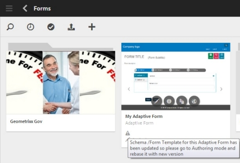

# AEM Forms에서 XDP 및 PDF 문서 가져오기{#getting-xdp-and-pdf-documents-in-aem-forms}

## 개요 {#overview}

AEM Forms에 업로드하여에서 양식을 로컬 파일 시스템에서 CRX 저장소로 가져올 수 있습니다. 업로드 작업은 다음 자산 유형에 대해 지원됩니다.

* 양식 템플릿(XFA 양식)
* PDF forms
* 문서(플랫 PDF 문서)

지원되는 에셋 유형을 개별적으로 또는 ZIP 아카이브로 업로드할 수 있습니다. 유형의 에셋을 업로드할 수 있습니다. `Resource`: ZIP 아카이브에 XFA 양식과 함께 있어야 합니다.

>[!NOTE]
>
>의 구성원인지 확인합니다. `form-power-users` xdp 파일을 업로드할 수 있는 그룹입니다. 그룹의 구성원이 되려면 관리자에게 문의하십시오.

## 양식 업로드 {#uploading-forms}

1. 에 액세스하여 AEM Forms 사용자 인터페이스에 로그인합니다 `https://'[server]:[port]'/aem/forms.html`.
1. 양식을 업로드할 폴더 또는 양식이 포함된 폴더로 이동합니다.
1. 작업 도구 모음에서 를 선택합니다. **만들기 > 파일 업로드**.

   

1. 업로드 양식 또는 패키지 대화 상자에서 업로드할 파일을 찾아 선택할 수 있습니다. 파일 브라우저에는 지원되는 파일 형식(ZIP, XDP 및 PDF)만 표시됩니다.

   >[!NOTE]
   >
   >파일 이름에는 영숫자, 하이픈 또는 밑줄만 포함할 수 있습니다.

1. 파일 선택 후 업로드 를 클릭하여 파일을 업로드하거나 &#39;취소&#39;를 클릭하여 업로드를 취소합니다. 팝업에 추가된 에셋과 현재 위치에서 업데이트된 에셋이 나열됩니다.

   >[!NOTE]
   >
   >ZIP 파일의 경우 지원되는 모든 에셋의 상대 경로가 표시됩니다. ZIP 내에서 지원되지 않는 에셋은 무시되고 나열되지 않습니다. 그러나 ZIP 아카이브에 지원되지 않는 자산만 포함된 경우 팝업 대화 상자 대신 오류 메시지가 표시됩니다.

   

1. 하나 이상의 에셋에 잘못된 파일 이름이 있으면 오류가 표시됩니다. 빨간색으로 강조 표시된 파일 이름을 수정하고 다시 업로드합니다.

   

업로드가 완료되면 백그라운드 워크플로우가 에셋의 미리 보기를 기반으로 각 에셋에 대한 썸네일을 생성합니다. 최신 버전의 에셋이 업로드되면 기존 에셋이 재정의됩니다.

### 보호 모드 {#protected-mode}

AEM Forms 서버를 사용하면 JavaScript 코드를 실행할 수 있습니다. 악의적인 JavaScript 코드는 AEM Forms 환경에 해를 끼칠 수 있습니다. 보호 모드에서는 AEM Forms이 신뢰할 수 있는 자산 및 위치에서만 XDP 파일을 실행하도록 제한합니다. AEM Forms UI에서 사용할 수 있는 모든 XDP는 신뢰할 수 있는 자산으로 간주됩니다.

보호 모드는 기본적으로 설정되어 있습니다. 필요한 경우 보호 모드를 비활성화할 수 있습니다.

1. 관리자로 AEM 웹 콘솔에 로그인합니다. URL은 https://&#39; 입니다.[server]:[포트]&#39;/system/console/configMgr
1. 편집할 모바일 Forms 구성을 엽니다.
1. [보호 모드] 옵션을 선택 취소하고 **저장**. 보호 모드를 사용할 수 없습니다.

## 참조된 XFA 양식 업데이트 {#updating-referenced-xfa-forms}

AEM Forms에서 XFA 양식 템플릿은 적응형 양식 또는 다른 XFA 양식 템플릿으로 참조할 수 있습니다. 또한 템플릿은 리소스 또는 다른 XFA 템플릿을 참조할 수 있습니다.

XFA를 참조하는 적응형 양식에는 XFA에서 사용할 수 있는 필드와 연결된 필드가 있습니다. 양식 템플릿을 업데이트할 때 연결된 적응형 양식은 XFA와 동기화를 시도합니다. 자세한 내용은 [적응형 양식과 관련 XFA 동기화](../../forms/using/synchronizing-adaptive-forms-xfa.md).

양식 템플릿을 제거하면 종속된 적응형 양식 또는 양식 템플릿이 손상됩니다. 이와 같은 적응적 형태를 비공식적으로 더러운 형태라고 부르기도 한다. AEM Forms 사용자 인터페이스에서 다음 두 가지 방법으로 더티 양식을 찾을 수 있습니다.

* 자산 목록의 적응형 양식 썸네일에 경고 아이콘이 표시되고, 경고 아이콘 위에 포인터를 가져다 대면 다음 메시지가 표시됩니다.\
  `Schema/Form Template for this adaptive form has been updated so go to Authoring mode and rebase it with new version.`

적응형 양식이 더러운지 여부를 나타내는 플래그가 유지됩니다. 이 정보는 양식 메타데이터와 함께 양식 속성 페이지에서 사용할 수 있습니다. 메타데이터 속성인 더티(dirty) 적응형 양식에만 해당 `Model Refresh` 디스플레이 `Recommended` 값.

