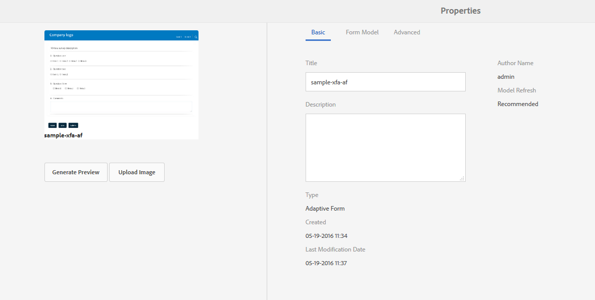

# AEM Forms{#getting-xdp-and-pdf-documents-in-aem-forms}에서 XDP 및 PDF 문서 가져오기

## 개요 {#overview}

AEM Forms에 양식을 업로드하여 로컬 파일 시스템에서 CRX 저장소로 가져올 수 있습니다. 업로드 작업은 다음 자산 유형에 대해 지원됩니다.

* 양식 템플릿(XFA 양식)
* PDF forms
* 문서(기본 PDF 문서)

지원되는 자산 유형을 개별적으로 또는 ZIP 보관으로 업로드할 수 있습니다. `Resource` 유형의 자산은 ZIP 보관에 있는 XFA 양식과 함께 업로드할 수 있습니다.

>[!NOTE]
>
>XDP 파일을 업로드할 수 있도록 `form-power-users` 그룹의 구성원인지 확인하십시오. 그룹의 구성원이 되려면 관리자에게 문의하십시오.

## 양식 업로드 중 {#uploading-forms}

1. `https://'[server]:[port]'/aem/forms.html`에 액세스하여 AEM Forms 사용자 인터페이스에 로그인합니다.
1. 양식을 업로드할 폴더 또는 양식이 포함된 폴더로 이동합니다.
1. 작업 도구 모음에서 **만들기 > 파일 업로드**&#x200B;를 탭합니다.

   

1. [양식 업로드] 또는 [패키지] 대화 상자를 사용하면 업로드할 파일을 검색하고 선택할 수 있습니다. 파일 브라우저는 지원되는 파일 형식(ZIP, XDP 및 PDF)만 표시합니다.

   >[!NOTE]
   >
   >파일 이름은 영숫자, 하이픈 또는 밑줄만 포함할 수 있습니다.

1. 파일 선택 후 업로드를 클릭하여 파일을 업로드하거나 &#39;취소&#39;를 클릭하여 업로드를 취소합니다. 팝업에는 추가되는 자산과 현재 위치에서 업데이트된 자산이 나열됩니다.

   >[!NOTE]
   >
   >ZIP 파일의 경우 지원되는 모든 자산의 상대 경로가 표시됩니다. ZIP 내에서 지원되지 않는 에셋은 무시되며 나열되지 않습니다. 그러나 ZIP 보관 파일에 지원되지 않는 에셋만 포함되어 있으면 팝업 대화 상자 대신 오류 메시지가 표시됩니다.

   

1. 하나 이상의 자산에 잘못된 파일 이름이 있으면 오류가 표시됩니다. 빨간색으로 강조 표시된 파일 이름을 수정하고 다시 업로드합니다.

   

업로드가 완료되면 배경 워크플로우는 자산의 미리 보기에 따라 각 에셋의 축소판을 생성합니다. 새로운 버전의 자산(업로드된 경우)이 기존 자산을 무시합니다.

### 보호 모드 {#protected-mode}

AEM Forms 서버를 사용하여 JavaScript 코드를 실행할 수 있습니다. 악성 JavaScript 코드는 AEM Forms 환경에 피해를 줄 수 있습니다. 보호 모드는 신뢰할 수 있는 에셋 및 위치에서만 AEM Forms이 XDP 파일을 실행하도록 제한합니다. AEM Forms UI에서 사용할 수 있는 모든 XDP는 신뢰할 수 있는 자산으로 간주됩니다.

보호 모드는 기본적으로 켜져 있습니다. 필요한 경우 보호 모드를 비활성화할 수 있습니다.

1. AEM 웹 콘솔에 관리자로 로그인합니다. URL은 https://&#39;[서버]:[포트]&#39;/system/console/configMgr입니다.
1. 편집을 위해 모바일 Forms 구성을 엽니다.
1. 보호 모드 옵션을 선택 해제하고 **저장**&#x200B;을 클릭합니다. 보호 모드를 사용할 수 없습니다.

## 참조된 XFA 양식 {#updating-referenced-xfa-forms} 업데이트

AEM Forms에서 XFA 양식 템플릿을 적응형 양식 또는 다른 XFA 양식 템플릿으로 참조할 수 있습니다. 또한 템플릿은 리소스 또는 다른 XFA 템플릿을 참조할 수 있습니다.

XFA를 참조하는 적응형 양식에는 XFA에서 사용할 수 있는 필드가 바인딩되어 있습니다. 양식 템플릿을 업데이트할 때 관련 응용 양식이 XFA와 동기화하려고 합니다. 자세한 내용은 [연결된 XFA](../../forms/using/synchronizing-adaptive-forms-xfa.md)와 적응형 양식 동기화를 참조하십시오.

양식 템플릿을 제거하면 종속 적응형 양식 또는 양식 템플릿이 손상됩니다. 이러한 적응형 양식을 종종 비공식적으로 더티 양식이라고 합니다. AEM Forms 사용자 인터페이스에서는 다음 두 가지 방법으로 더티 양식을 찾을 수 있습니다.

* 에셋 목록의 적응형 양식 축소판에 경고 아이콘이 표시되고 경고 아이콘 위로 포인터를 가져가면 다음 메시지가 표시됩니다.\
   `Schema/Form Template for this adaptive form has been updated so please go to Authoring mode and rebase it with new version.`

적응형 양식이 더러운지 여부를 나타내기 위해 플래그가 유지됩니다. 이 정보는 양식 메타데이터와 함께 양식 속성 페이지에서 사용할 수 있습니다. 더티 적응형 양식의 경우에만 메타데이터 속성 `Model Refresh`에 `Recommended` 값이 표시됩니다.

