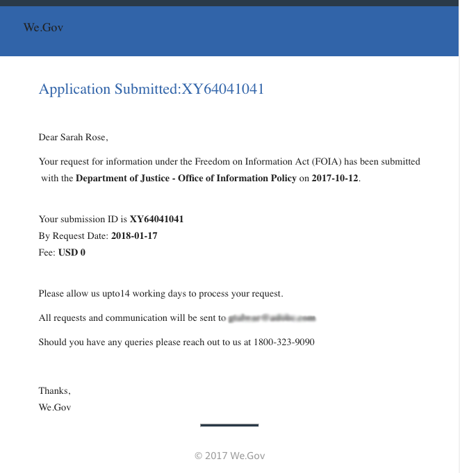

# We.Gov 참조 사이트 FOIA 연습 {#we-gov-reference-site-foia-walkthrough}

## 참조 사이트 Freedom of Information Act 시나리오 {#reference-site-freedom-of-information-act-scenario}

We.Gov는 입양 부모가 아이를 입양할 경우 양육비 지원을 위해 등록할 수 있도록 하는 주 운영 조직입니다. We.Gov는 또한 부모가 정보의 자유법에 따라 다음 정부 부서에 정보를 요청할 수 있도록 허용합니다.

* Defense Logistics Agency
* 국방부 감찰관
* 법무부 - 정보 정책 사무소
* 해군 부서
* 환경 보호국

정보의 자유법에 대한 자세한 내용은 [www.foia.gov](https://www.foia.gov)을 참조하십시오.

이 시나리오에는 다음과 같은 페르소나가 포함됩니다.

* 정보를 요청하는 사람 사라 로즈
* 요청을 처리하는 사람 John Jacobs는 그것을 적절한 부서에 전달한다
* 요청에따라 정보를 제공한 정부 직원인 Gloria Rios

## Sarah는 FOIA {#sarah-initiates-request-for-information-under-foia} 아래에 정보 요청을 시작합니다.

&quot;정보의 자유법&quot;에 따라 Sarah는 2013년 (FY) 2013년 ~ 2016년 동안 아동 및 가족 관련 케이스 로그 사본을 요청합니다. 사라는 법무부에 이 요청을 제출할 것이며, 또한 인쇄 및 우편 비용을 100달러까지 지불할 의사가 있음을 나타낸다.

### 작동 방식 {#how-it-works}

### 직접 보기 {#see-it-yourself}

브라우저에서 `https://<hostname>:<PublishPort>/wegov`을(를) 엽니다. We.Gov 사이트에서 응용 프로그램 > 모든 응용 프로그램을 누릅니다. 모든 응용 프로그램 페이지에서 FOIA 요청에 대한 응용 프로그램 아래의 적용을 누릅니다.

## Sarah는 FOIA {#sarah-starts-her-application-for-information-under-foia}에서 정보 신청을 시작합니다.

Sarah는 **Apply**&#x200B;을 클릭하고, Freedom of Information Act Request Form 페이지에서 다음을 포함한 정보를 입력합니다.

* **에이전시:** 사라는 법무부나 정보정책부로 요청을 받은 기관을 지정합니다.

* **최대 비용**:사라는 인쇄 및 우편 비용을 100달러까지 지불할 의사가 있다고 명시했다.
* **요청을 자세히** 설명합니다.Sarah는 &quot;2013~2016 회계년도의 &quot;2013/2016년 아동과 가족 관련 케이스 로그 관리 사본 요청&quot;을 지정합니다.

2013~2016 회계년도의 자녀 및 가족 관련 케이스 로그 관리 사본 요청

언제든지 Sarah는 저장을 눌러 양식 초안을 저장하고 나중에 다시 돌아와 양식을 채우고 제출할 수 있습니다. 사라는 양식을 제출한다.

>[!NOTE]
>
>이메일을 통한 재시작 워크플로우는 로그인한 사용자에게만 작동합니다. 참조 사이트 시나리오에서 사용자 Sarah Rose가 추가되었는지 확인합니다. Sarah의 로그인 자격 증명은 `srose/password`입니다.

## John Jacobs는 응용 프로그램 {#john-jacobs-receives-and-approves-the-application}을 수신하고 승인합니다.

John Jacobs는 요청을 받고 올바른 사람에게 전달한다. AEM 받은 편지함을 통해 한 곳에서 제출된 모든 애플리케이션을 확인할 수 있습니다.

### 작동 방식 {#how-it-works-1}

사라가 FOIA 애플리케이션을 채우고 제출하면, 이 애플리케이션에 대한 기록이 John Jacobs의 받은 편지함으로 전송됩니다. John Jacobs는 제출된 신청서를 보고 수락하거나 거부할 수 있습니다.

### 직접 보기 {#see-it-yourself-1}

https://&lt;***hostname***:&lt;***PublishPort***>/content/we-finance/global/en/login.html?resource=/aem/inbox.html에서 AEM 받은 편지함에 액세스할 수 있습니다. John Jacobs의 사용자 이름/암호를 사용하여 AEM 받은 편지함에 로그인하고 FOIA 응용 프로그램을 참조하십시오. 양식 중심의 워크플로우 작업에 AEM 받은 편지함을 사용하는 방법에 대한 자세한 내용은 AEM 받은 편지함에서 Forms 응용 프로그램 및 작업 관리[를 참조하십시오.](/help/forms/using/manage-applications-inbox.md)

John Jacobs는 애플리케이션 대시보드에서 애플리케이션을 보거나 승인하거나 거부할 수 있습니다. John Jacobs는 요청 세부 사항을 선택하고 열고 요청을 검토한 후 승인합니다.

### <strong>Sarah는 확인 이메일을 받았다</strong> {#strong-sarah-receives-an-acknowledgement-email-strong}

John Jacobs가 그 신청을 승인한 후, Sarah는 We.Gov 사이트로부터 승인 이메일을 받았다. Sarah는 그녀의 신청을 처리하는 데 필요한 비용과 시간을 알려 준다. 이메일에는 또한 새라가 자신의 응용 프로그램에 대한 업데이트를 위해 연락할 수 있는 이메일과 전화 세부 정보도 포함되어 있습니다.

## Gloria는 FOIA의 2차 승인 요청을 받습니다. {#gloria-receives-the-foia-request-for-second-level-approval}

John Jacobs가 필요한 정보를 작성하고 Sarah의 요청을 승인한 후, 요청은 Gloria Rios에게 최종 승인을 요청합니다. Gloria는 첨부한 기록 문서를 검토하고 그 요청을 승인한다.

### 작동 방식 {#how-it-works-2}

John Jacobs가 FOIA 요청을 승인하면 해당 애플리케이션의 PDF 또는 기록 문서가 만들어지고 Gloria Rios의 받은 편지함으로 전송됩니다. Gloria는 제출된 요청을 보고 승인하거나 거부할 수 있습니다.

### {#see-for-yourself} 직접 확인하십시오.

https://&lt;***hostname***:&lt;***PublishPort***>/content/we-finance/global/en/login.html?resource=/aem/inbox.html에서 AEM 받은 편지함에 액세스할 수 있습니다. Gloria Rios의 사용자 이름/암호로 격자/암호를 사용하여 AEM 받은 편지함에 로그인하고 FOIS 요청을 참조하십시오.

Gloria는 요청을 열고 FOIA 요청의 세부 사항을 조사합니다. 글로리아는 이 요청의 세부내용을 검토하고 필요한 문서 제공 타당성 여부를 검토한 후 요청을 승인한다.

## Sarah는 자신의 요청이 {#sarah-receives-notification-that-her-request-is-approved}으로 승인되었다는 알림을 받습니다.

글로리아가 FOIA의 요청을 승인한 후, 사라는 그녀의 요청이 승인되었다는 이메일을 그녀에게 받습니다. 또한 이 이메일에는 문서 제공을 위한 임시 타임라인에 대한 정보와 후속 조치에 대한 연락처 세부 정보가 포함되어 있습니다.

