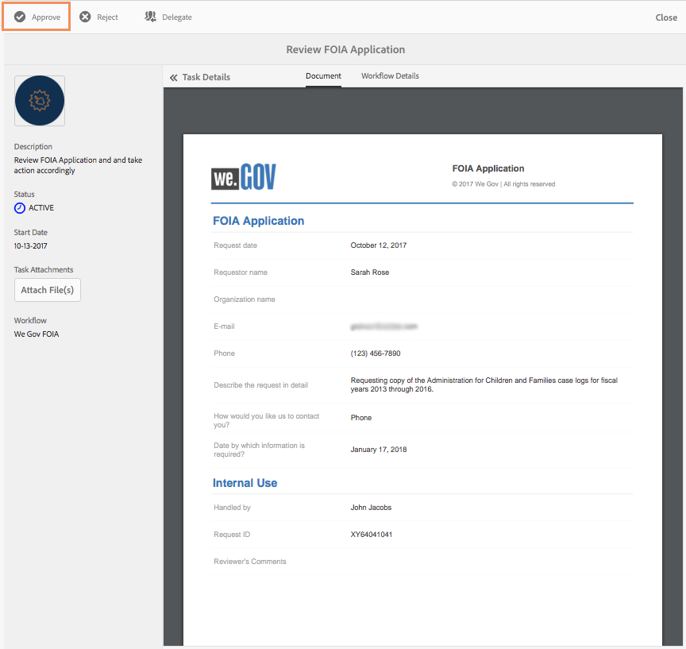

# We.Gov 참조 사이트 FOIA 연습 {#we-gov-reference-site-foia-walkthrough}

## Reference Site Freedom of Information Act 시나리오 {#reference-site-freedom-of-information-act-scenario}

We.Gov는 입양 부모가 아이를 입양할 경우 양육비 등록을 할 수 있도록 해주는 주 운영 조직이다. We.Gov는 또한 학부모들이 정보 자유법에 따라 다음 정부 부서에 정보를 요청할 수 있도록 허용합니다.

* 국방물류청
* 국방부 감찰관
* 법무부 - 정보 정책 사무소
* 해군성
* 환경보호국

Freedom Of Information Act에 대한 자세한 내용은 [www.foia.gov](https://www.foia.gov) 을 참조하십시오.

이 시나리오에는 다음 가상 사용자가 포함됩니다.

* 정보를 요청하는 사라 로즈
* 요청을 처리하는 사람 존 제이콥스는 그 요청을 적절한 부서에 전달한다
* 요청에 따라 정보를 제공하는 정부 직원인 Gloria Rios입니다

## Sarah는 FOIA {#sarah-initiates-request-for-information-under-foia}에 따라 정보 요청을 시작합니다

정보 자유법에 따라, Sarah는 2013년부터 2016년까지 수년간의 아동 및 가족 사례 로그 사본을 요청합니다. 사라가 법무부에 이 요청을 제출하며, 그녀는 인쇄와 우편 요금을 위해 100달러까지 지불할 의사가 있음을 나타낸다.

### 작동 방법 {#how-it-works}

### 직접 {#see-it-yourself} 보기

브라우저에서 `https://<hostname>:<PublishPort>/wegov` 을 엽니다. We.Gov 사이트에서 애플리케이션 > 모든 애플리케이션을 누릅니다. 모든 응용 프로그램 페이지에서 FOIA Request용 응용 프로그램에서 적용을 누릅니다.

## 사라는 FOIA {#sarah-starts-her-application-for-information-under-foia}에 따라 정보를 얻기 위해 신청서를 시작합니다

Sarah가 **적용**&#x200B;을 클릭하고 Freedom of Information Act Request Form 페이지에서 Sarah가 다음을 포함하는 정보를 입력합니다.

* **에이전시:** 사라는 그 요청이 처리된 기관을 법무부 - 정보 정책 사무소로 지정합니다.

* **최대** 비용:사라는 인쇄와 우편 요금을 위해 100달러까지 지불할 의사가 있다고 명시했다.
* **요청을 자세히 설명합니다**.Sarah는 &quot;2013~2016 회계년도의 아동 및 가족 사례 로그 관리 사본 요청&quot;을 지정합니다.

2013~2016 회계년도의 자녀 및 가족 사례 로그 관리 사본 요청

언제든지 Sarah는 저장 을 탭하여 양식 초안 저장 후 나중에 돌아와서 양식을 작성하고 제출할 수 있습니다. 사라가 양식을 제출한다.

>[!NOTE]
>
>이메일 다시 시작 워크플로우는 로그인한 사용자만 작동합니다. 참조 사이트 시나리오에서 사용자 사라 로즈가 추가되었는지 확인합니다. Sarah의 로그인 자격 증명은 `srose/password`입니다.

## John Jacobs는 응용 프로그램 {#john-jacobs-receives-and-approves-the-application} 을 수신하고 승인합니다.

John Jacobs는 요청을 받고 그것을 올바른 사람에게 연결합니다. AEM 받은 편지함에서 제출된 모든 애플리케이션을 한 곳에서 볼 수 있습니다.

### 작동 방법 {#how-it-works-1}

사라가 FOIA 신청서를 작성하고 제출하면, 이 어플리케이션의 기록이 존 제이콥스의 받은 편지함으로 전송됩니다. John Jacobs는 제출된 신청서를 보고 이를 수락하거나 거부할 수 있습니다.

### 직접 {#see-it-yourself-1} 보기

https://&lt;***hostname***:&lt;***PublishPort***>/content/we-finance/global/en/login.html?resource=/aem/inbox.html에서 AEM 받은 편지함에 액세스할 수 있습니다. John Jacobs의 사용자 이름/암호로 jjacobs/password를 사용하여 AEM 받은 편지함에 로그인하고 FOIA 애플리케이션을 참조하십시오. 양식 중심의 워크플로우 작업에 AEM 받은 편지함을 사용하는 방법에 대한 자세한 내용은 [AEM 받은 편지함에서 Forms 응용 프로그램 및 작업 관리](/help/forms/using/manage-applications-inbox.md)를 참조하십시오.

John Jacobs는 응용 프로그램 대시보드에서 응용 프로그램을 보고, 승인하거나 거부할 수 있습니다. John Jacobs가 요청 세부 사항을 선택하고 열고 요청을 검토한 후 승인합니다.

### <strong>Sarah가 확인 이메일을 받았다</strong> {#strong-sarah-receives-an-acknowledgement-email-strong}

John Jacobs가 이 신청서를 승인한 후, Sarah는 We.Gov 사이트로부터 승인을 받은 이메일을 받았다. 사라는 그녀의 신청을 처리하는 데 필요한 비용과 시간을 알려 준다. 이메일에는 또한 새라가 그녀의 애플리케이션에 대한 업데이트를 위해 연락할 수 있는 이메일과 전화의 세부 정보도 포함되어 있습니다.

## Gloria는 두 번째 수준 승인을 위한 FOIA 요청을 받습니다 {#gloria-receives-the-foia-request-for-second-level-approval}

John Jacobs가 필요한 정보를 입력하고 Sarah의 요청을 승인하면, 최종 승인을 위해 Gloria Rios에게 요청합니다. 글로리아는 첨부한 기록 문서를 검토하고 요청을 승인한다.

### 작동 방법 {#how-it-works-2}

John Jacobs가 FOIA 요청을 승인하면 PDF 또는 Document of Record가 생성되고 Gloria Rios의 받은 편지함으로 전송됩니다. 글로리아는 제출된 요청을 보고 승인하거나 거부할 수 있습니다.

### 직접 {#see-for-yourself} 을 참조하십시오.

https://&lt;***hostname***:&lt;***PublishPort***>/content/we-finance/global/en/login.html?resource=/aem/inbox.html에서 AEM 받은 편지함에 액세스할 수 있습니다. Gloria Rios의 사용자 이름/암호로 그리오/암호를 사용하여 AEM 받은 편지함에 로그인하고 FOIS 요청을 참조하십시오.

글로리아는 요청을 열고 FOIA 요청의 세부사항을 검사합니다. 그 요청의 세부사항을 검토하고, 필요한 서류들을 제공하는데 대한 가능성을 점검한 후, 글로리아는 그 요청을 승인한다.

## Sarah는 그녀의 요청이 {#sarah-receives-notification-that-her-request-is-approved}에 동의한다는 통지를 받았다

글로리아가 FOIA 요청을 승인한 후, 사라는 그녀의 요청이 승인되었다는 것을 알리는 이메일을 받는다. 전자 메일에는 문서 제공을 위한 임시 타임라인에 대한 정보 및 요청 이후의 연락 세부 정보도 포함됩니다.

