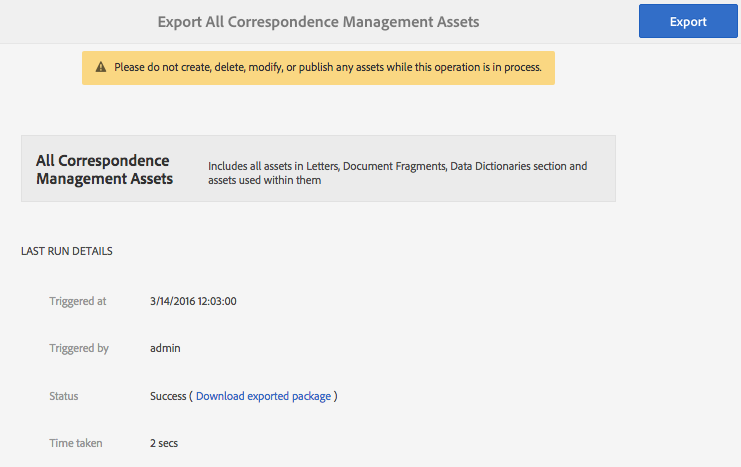
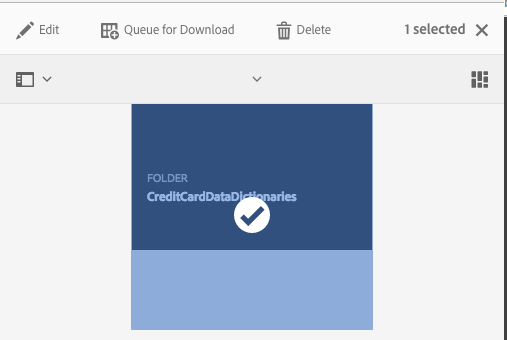
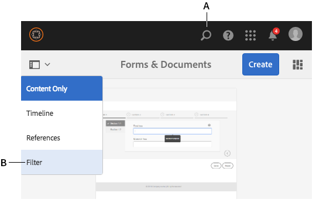

# 에셋 가져오기 및 AEM Forms{#importing-and-exporting-assets-to-aem-forms}

다른 AEM Forms 인스턴스 간에 양식과 관련 에셋, 테마, 데이터 사전, 문서 단편 및 문자를 이동할 수 있습니다. 이러한 움직임은 시스템을 마이그레이션하거나 양식을 스테이지 서버에서 프로덕션 서버로 이동할 때 필요합니다. AEM Forms UI를 통해 업로드 및 가져오기가 지원되는 이러한 자산의 경우 내보내거나 가져오는 데 Forms UI를 사용하는 것이 좋습니다. 이러한 에셋을 내보내거나 가져오는 데 AEM 패키지 관리자를 사용하는 것은 권장되지 않습니다.

>[!NOTE]
>
>* AEM 6.4 Forms에서 crx-repository의 구조와 경로가 변경되었습니다. 이전 버전에서 AEM 6.4 Forms으로 에셋을 가져오는 경우 양식에 이전 구조에 대한 일부 종속성이 있는 경우 종속성을 수동으로 내보내야 합니다. 저장소의 구조 및 경로에 대한 변경 사항에 대한 자세한 내용은 [AEM](/help/sites-deploying/repository-restructuring.md)의 리포지토리 재구성을 참조하십시오.

>

## Forms 및 문서 자산 {#download-or-upload-forms-amp-documents-assets} 다운로드 또는 업로드

AEM Forms 유저 인터페이스를 사용하면 AEM 인스턴스에서 에셋을 AEM CRX 패키지 또는 바이너리 파일로 다운로드하여 내보낼 수 있습니다. 그런 다음 다운로드한 AEM CRX-package 또는 이진 파일을 다른 AEM 인스턴스로 가져올 수 있습니다.

적응형 양식 템플릿 및 적응형 양식 컨텐츠 정책을 제외한 모든 자산에 대해 AEM Forms 사용자 인터페이스를 통해 내보내기 및 가져오기가 지원됩니다. 따라서 AEM Forms UI에서 적응형 양식을 내보낼 때 관련 적응형 양식 템플릿 및 컨텐츠 정책은 다른 관련 자산처럼 자동으로 내보내지지 않습니다.

이러한 자산 유형의 경우 AEM 패키지 관리자를 사용하여 소스 AEM 서버에 CRX 패키지를 만들고 대상 서버에 패키지를 설치해야 합니다. 패키지 생성 및 설치에 대한 자세한 내용은 [패키지 사용](/help/sites-administering/package-manager.md)을 참조하십시오.

### Forms 및 문서 자산 다운로드 {#download-forms-amp-documents-assets}

Forms 및 문서 에셋을 다운로드하려면

1. AEM Forms 인스턴스에 로그인합니다.
1. Experience Manager  아이콘 > 탐색  아이콘> Forms > Forms &amp; 문서를 누릅니다.
1. 양식 자산을 선택하고 **다운로드** 아이콘을 누릅니다.
1. [자산 다운로드]에서 다음 옵션 중 하나를 선택하고 **다운로드**&#x200B;를 누릅니다.

   * **CRX 패키지로 다운로드:** 선택한 모든 자산 및 관련 종속성을 AEM Forms 인스턴스에서 다른 인스턴스로 다운로드하고 이동하려면 이 옵션을 사용합니다. 모든 자산 및 폴더를 crx 패키지로 다운로드합니다. AEM으로 제작된 양식(적응형 양식, 대화형 통신 및 적응형 양식 조각), 양식 세트, 양식 템플릿, PDF 문서 및 리소스(XSD, XFS, 이미지)를 비롯한 모든 양식 에셋을 AEM Forms UI에서 패키지로 다운로드할 수 있습니다.
에셋을 패키지로 다운로드할 수 있는 이점은 다운로드하기 위해 선택한 자산에서 사용한 에셋을 다운로드하는 것입니다. 예를 들어 양식 템플릿, XSD 및 이미지를 사용하는 적응형 양식이 있는 경우 이 적응형 양식을 선택하고 패키지로 다운로드할 때 다운로드한 패키지에는 양식 템플릿, XSD 및 이미지도 포함되어 있습니다. 자산과 관련된 모든 메타데이터 속성(사용자 지정 속성 포함)도 다운로드됩니다.

   * **자산을 이진 파일로 다운로드:양식 템플릿(XDP), PDF forms(PDF), 문서(PDF) 및 리소스(이미지, 스키마, 스타일 시트)만 다운로드할 수** 있는 옵션을 사용합니다. 이러한 자산은 외부 응용 프로그램에서 편집할 수 있습니다. XSD, XDP, 이미지, PDF 및 XDP와 같은 바이너리가 있는 양식 자산을 .zip 파일로 다운로드합니다.
**자산을 이진 파일** 옵션으로 다운로드하는 응용 양식, 대화형 통신, 응용 양식 조각, 테마 및 양식 세트를 다운로드할 수 없습니다. 이러한 자산을 다운로드하려면 **CRX 패키지로 다운로드** 옵션을 사용해야 합니다.

   선택한 자산은 보관(.zip 파일)으로 다운로드됩니다.

   >[!NOTE]
   >
   >AEM 패키지와 바이너리 파일은 모두 아카이브(.zip 파일)로 다운로드됩니다. 자산에 대한 템플릿이 자산과 함께 다운로드되지 않습니다. 자산 템플릿을 별도로 내보내야 합니다.

### Forms 및 문서 자산 업로드 {#upload-forms-amp-documents-assets}

Forms 및 문서 자산을 업로드하려면:

>[!VIDEO](https://vimeo.com/)

1. AEM Forms 인스턴스에 로그인합니다.
1. Experience Manager  아이콘 > 탐색  아이콘> Forms> Forms &amp; 문서를 누릅니다.
1. **만들기** >**파일 업로드**&#x200B;를 누릅니다. 양식 또는 패키지 업로드 대화 상자가 나타납니다.
1. 대화 상자에서 가져올 패키지 또는 아카이브를 찾아 선택합니다. PDF 문서, XSD, 이미지, 스타일 시트 및 XDP 양식을 선택할 수도 있습니다. **열기**&#x200B;를 누릅니다. 선택한 폴더 또는 파일 이름에는 특수 문자가 포함되지 않아야 합니다.

   대화 상자에서 업로드되는 자산의 세부 사항을 확인하고 **업로드**&#x200B;를 누릅니다.

   기존 양식 자산을 업로드하면 자산이 업데이트됩니다.

   >[!NOTE]
   >
   >패키지를 업로드해도 기존 폴더 계층 구조는 바뀌지 않습니다. 예를 들어, 한 서버에 /content/dam/formsanddocuments 위치에 &#39;Training&#39;이라는 응용 양식이 있는 경우, 응용 양식을 다운로드하고 다른 서버에 양식을 업로드합니다. 두 번째 서버에도 이름이 &#39;교육&#39;인 폴더가 같은 위치 /content/dam/formsanddocuments에 있습니다. 업로드하지 못했습니다.

## 테마 {#downloading-or-uploading-a-theme} 다운로드 또는 업로드

AEM Forms을 사용하면 테마를 만들거나, 다운로드하거나, 업로드할 수 있습니다. 테마는 양식, 문서 및 문자와 같은 다른 자산과 같이 만들어집니다. 테마를 만들고 다운로드한 다음 별도의 인스턴스에서 업로드하여 다시 사용할 수 있습니다. 테마에 대한 자세한 내용은 AEM Forms](../../forms/using/themes.md)의 [테마를 참조하십시오.

### 테마 {#downloading-a-theme} 다운로드

다른 프로젝트 또는 인스턴스에서 사용할 수 있는 테마를 AEM Forms에서 내보낼 수 있습니다. AEM에서는 인스턴스에 업로드할 수 있는 zip 파일로 테마를 다운로드할 수 있습니다.

테마를 다운로드하려면

1. AEM Forms 인스턴스에 로그인합니다.
1. Experience Manager  아이콘 > 탐색  아이콘> Forms> 테마를 누릅니다.
1. 테마를 선택하고 **다운로드**&#x200B;를 누릅니다. 테마가 아카이브(.zip 파일)로 다운로드됩니다.

### 테마 {#uploading-a-theme} 업로드

프로젝트에서 스타일 사전 설정과 함께 만든 테마를 사용할 수 있습니다. 프로젝트에 다른 사람이 만든 테마 패키지를 업로드하여 가져올 수 있습니다.

테마를 업로드하려면:

1. Experience Manager에서 **Forms > 테마**&#x200B;로 이동합니다.
1. 테마 페이지에서 **만들기 > 파일 업로드**&#x200B;를 클릭합니다.
1. 파일 업로드 프롬프트에서 컴퓨터에서 테마 패키지를 찾아 선택하고 **업로드**를 클릭합니다.
업로드된 테마는 테마 페이지에서 사용할 수 있습니다.

1. AEM Forms 인스턴스에 로그인합니다.
1. Experience Manager  아이콘 > 탐색  아이콘> Forms> 테마를 누릅니다.
1. **만들기** > **파일 업로드**&#x200B;를 클릭합니다. 파일 업로드 프롬프트에서 컴퓨터에서 테마 패키지를 찾아 선택하고 **업로드**&#x200B;를 클릭합니다. 테마가 업로드됩니다.

## 통신 관리 {#import-and-export-assets-in-correspondence-management}에서 에셋 가져오기 및 내보내기

데이터 사전, 문자 및 문서 조각과 같은 자산을 두 가지 다른 구현 간에 공유하려면 .cmp 파일을 만들고 공유할 수 있습니다. .cmp 파일에는 하나 이상의 데이터 사전, 문자, 문서 단편 및 양식이 포함될 수 있습니다.

### 문서 조각, 문자 및/또는 데이터 사전 내보내기 {#export-document-fragments-letters-and-or-data-dictionaries}

1. 문자, 문서 단편 또는 데이터 사전 페이지에서 단일 패키지로 내보낼 자산을 탭하여 선택한 다음 [다운로드용으로 대기열]을 탭합니다. 자산을 내보낼 수 있도록 줄을 섰습니다.
1. 필요에 따라 위 단계를 반복하여 문자, 문서 조각 및 데이터 사전을 추가합니다.
1. **다운로드**&#x200B;를 누릅니다.
1. 통신 관리에는 내보내기 목록에 있는 자산 목록과 함께 자산 다운로드 대화 상자가 표시됩니다.

   

1. 내보낸 종속성을 보려면 해결을 누릅니다. 또는 다음 단계로 건너뛰십시오. 해결을 탭하지 않아도 종속성은 여전히 내보내집니다.
1. .cmp 파일을 다운로드하려면 **확인**&#x200B;을 탭합니다.
1. 통신 관리는 .cmp 파일을 컴퓨터에 다운로드합니다.

   .cmp 파일에는 내보낸 자산이 포함됩니다. .cmp 파일을 다른 사람과 공유할 수 있습니다. 다른 사용자는 다른 서버에 .cmp 파일을 가져와 새 서버의 모든 에셋을 가져올 수 있습니다.

### 모든 통신 관리 에셋을 {#export-all-the-correspondence-management-assets-as-a-package} 패키지로 내보내기

이 옵션을 사용하여 모든 통신 관리 자산 및 관련 종속성을 AEM 양식 인스턴스에서 패키지로 다운로드합니다.

예를 들어, 통신 관리에 이미지와 텍스트를 사용하는 문자가 있는 경우, 다운로드한 패키지에는 해당 문자와 관련된 이미지와 텍스트도 들어 있습니다. 자산과 관련된 모든 메타데이터 속성(사용자 지정 속성 포함)도 다운로드됩니다. 패키지(.cmp)를 다운로드하면 [패키지를 다른 AEM Forms 인스턴스](../../forms/using/import-export-forms-templates.md#p-upload-forms-documents-assets-p)로 가져올 수 있습니다.

모든 통신 관리 자산 및 관련 종속성을 패키지로 다운로드하려면 다음 단계를 완료하십시오.

1. 양식 사용자로 AEM Forms 서버에 로그인합니다.
1. 전역 탐색 막대에서 **Adobe Experience Manager**&#x200B;을 누릅니다.
1. 도구( )를 누른 다음 **Forms**&#x200B;을(를) 누릅니다.
1. **메일 관리 자산 내보내기**&#x200B;를 누릅니다.

   

   (&quot;모든 통신 관리 자산 내보내기&quot; 페이지가 나타나고 내보내기 프로세스를 마지막으로 시도했을 때의 정보와 마지막으로 내보낸 패키지를 다운로드할 수 있는 링크가 표시됩니다.

   

1. **내보내기**&#x200B;를 누르고 확인 메시지에서 **확인**&#x200B;을 누릅니다.

   일괄 처리 과정이 완료되면 마지막 실행 세부 정보와 패키지를 다운로드할 링크가 업데이트됩니다. 여기에는 관리자 로그인 및 일괄 처리가 성공적으로 실행되거나 실패한 경우 등의 정보가 포함됩니다. 에셋을 패키지로 내보내면 내보낸 패키지 다운로드 링크가 나타납니다.

   >[!NOTE]
   >
   >모든 자산 내보내기 프로세스는 한 번 시작되면 취소할 수 없습니다. 또한 모든 내보내기 작업이 진행 중이지만 자산을 생성, 삭제, 수정 또는 게시하거나 모든 자산 게시 프로세스를 시작하지 마십시오.a

1. **내보낸 패키지 다운로드** 링크를 눌러 패키지 파일을 다운로드합니다.

   패키지의 에셋을 통신 관리의 다른 인스턴스에 추가하려면 [패키지를 AEM Forms 인스턴스](../../forms/using/import-export-forms-templates.md#p-upload-forms-documents-assets-p)로 가져옵니다.

### 문서 조각, 문자 및/또는 데이터 사전을 통신 관리로 가져오기 {#import-document-fragments-letters-and-or-data-dictionaries-into-correspondence-management}

.cmp 파일로 내보낸 자산을 가져올 수 있습니다. .cmp 파일에는 하나 이상의 문자, 데이터 사전, 문서 단편 및 종속 에셋이 있을 수 있습니다.

>[!NOTE]
>
>이전 Correspondence Management 에셋을 가져올 때 관리 계정을 사용하여 로그인합니다. 이전 통신 관리 자산 마이그레이션에 대한 자세한 내용은 [통신 관리 자산을 AEM 6.1 양식으로 마이그레이션](/help/forms/using/migration-utility.md)을(를) 참조하십시오.

1. 데이터 사전, 문자 또는 문서 조각 페이지에서 **만들기 > 파일 업로드**&#x200B;를 탭하고 .cmp 파일을 선택합니다.
1. 통신 관리에는 가져온 자산 목록과 함께 [자산 가져오기] 대화 상자가 표시됩니다. **가져오기**&#x200B;를 누릅니다.

   에셋을 가져온 후 다른 속성은 동일하게 유지되지만 에셋의 다음 속성은 업데이트됩니다.

   * 작성자:자산을 서버에 가져온 사용자의 ID를 표시합니다.
   * 수정됨:에셋을 서버로 가져온 시간

   >[!NOTE]
   >
   >XDP를 CMP 파일의 일부로 업로드할 수 있으려면 Forms-Power-users 그룹의 일부여야 합니다. 액세스 권한이 필요하면 관리자에게 문의하십시오.

## 워크플로 응용 프로그램 {#export-a-workflow-application} 내보내기

AEM 패키지 관리자를 사용하여 워크플로우 애플리케이션을 내보낼 수 있습니다. 절차는 다음과 같습니다.

1. AEM Forms 패키지 관리자를 엽니다. 패키지 관리자의 URL은 https://&lt;server>:&lt;port>/crx/packmgr입니다.
1. **[!UICONTROL 패키지 만들기]**&#x200B;를 클릭합니다. **[!UICONTROL 새 패키지]** 대화 상자가 나타납니다.
1. 패키지의 이름, 버전 및 그룹을 지정합니다. **[!UICONTROL 확인]**&#x200B;을 클릭합니다.
1. **[!UICONTROL 편집]**&#x200B;을 클릭하고 **[!UICONTROL 필터]** 탭을 엽니다. **[!UICONTROL 필터 추가]**&#x200B;를 클릭합니다. 워크플로 응용 프로그램의 경로를 지정합니다. 예: /etc/fd/dashboard/startpoints/causortgage. **[!UICONTROL 규칙 추가]**&#x200B;를 클릭합니다.

1. **[!UICONTROL 고급]** 탭을 엽니다. ACL 처리 필드에서 **[!UICONTROL 병합]** 또는 **[!UICONTROL 덮어쓰기]**&#x200B;를 선택합니다. **[!UICONTROL 저장]**&#x200B;을 클릭합니다.
1. **[!UICONTROL 빌드]**&#x200B;를 클릭하여 패키지를 만듭니다.

   패키지가 빌드되면 패키지를 다운로드하고 다른 서버로 가져올 수 있습니다. 패키지가 업로드된 서버에 Workflow 응용 프로그램이 나타납니다.

   >[!NOTE]
   >
   >워크플로우 애플리케이션이 제대로 작동하려면 해당 적응형 양식 및 워크플로우 모델을 작업 애플리케이션과 함께 내보냅니다.

## 폴더 및 자산 구성 {#folders-and-organizing-assets}

AEM Forms 유저 인터페이스는 폴더를 사용하여 자산을 정렬합니다. 이러한 폴더는 AEM Forms 사용자 인터페이스에서 만든 자산을 정렬하는 데 사용됩니다. 이러한 폴더의 이름 바꾸기, 하위 폴더 만들기 및 에셋 및 문서를 저장할 수 있습니다. 문서와 에셋을 폴더에 정리하면 파일을 함께 그룹화하여 간편하게 관리할 수 있습니다. 폴더를 선택하고 다운로드하거나 삭제할 수 있습니다.

폴더를 만들려면 다음 단계를 완료하십시오.

### 폴더를 만듭니다 {#create-a-folder}

1. `https://<server>:<port>/aem/forms.html`의 AEM Forms 사용자 인터페이스에 로그인합니다.
1. 폴더를 만들 위치로 이동합니다.
1. 만들기 > 폴더를 누릅니다.
1. 다음 세부 정보를 입력합니다.

   * **제목:** 폴더 이름 표시
   * **이름:** *(필수)* 저장소에 폴더를 저장할 노드 이름입니다.

   >[!NOTE]
   >
   >기본적으로 이름 필드의 값은 제목에서 자동으로 채워집니다. 이름에는 영숫자나 하이픈(-) 및 밑줄(_) 특수 문자만 사용할 수 있습니다. 제목에 입력한 기타 특수 문자는 자동으로 하이픈으로 대체되며 새 이름을 확인하라는 메시지가 표시됩니다. 제안된 이름을 계속 사용하거나 추가로 편집할 수 있습니다.

1. 정의한 제목이 있는 새 폴더가 자산 목록의 현재 위치에 표시됩니다.

   지정된 이름의 폴더가 있는 경우 오류가 발생하여 제출이 실패합니다. 이름 필드 옆에 표시되는 오류  아이콘을 마우스로 가리키면 오류 메시지를 볼 수 있습니다.

   새로 만든 폴더를 눌러 폴더 안으로 들어가 폴더 내에 에셋이나 폴더를 만들 수 있습니다. 또한 폴더를 선택하고 다운로드하기 위해 대기열을 선택하거나, 폴더를 삭제하거나, 폴더 이름을 편집할 수 있습니다.

   

### 하나 이상의 자산 또는 문자 {#create-copies-of-one-or-more-assets-or-letters} 사본 만들기

기존 자산과 문자를 사용하여 유사한 속성, 컨텐츠 및 상속된 자산이 있는 자산과 문자를 빠르게 만들 수 있습니다. 데이터 사전, 문서 조각 및 문자를 복사하여 붙여넣을 수 있습니다.

자산 및 문자 사본을 만들려면 다음 단계를 완료하십시오.

1. 관련 자산 또는 편지 페이지에서 하나 이상의 자산/문자를 선택합니다. UI에 복사 아이콘이 표시됩니다.
1. 복사를 누릅니다. UI에 붙여넣기 아이콘이 표시됩니다. 붙여넣기 전에 폴더 내에서 이동/탐색하도록 선택할 수도 있습니다. 다른 폴더에는 이름이 같은 자산이 포함될 수 있습니다. 폴더에 대한 자세한 내용은 [폴더 및 자산 구성](#folders-and-organizing-assets)을 참조하십시오.
1. 붙여넣기를 누릅니다. 붙여넣기 대화 상자가 나타납니다. 시스템이 에셋/문자의 새 사본에 이름 및 제목을 자동으로 생성하지만, 에셋/글자의 제목과 이름을 편집할 수 있습니다.

   동일한 위치에 자산/문자를 복사하여 붙여 넣는 경우, 접미사 &quot;-CopyXX&quot;가 자산/문자의 기존 이름에 추가됩니다. 복사한 자산/서신에 대한 제목이 없는 경우 자동 생성된 제목 필드는 공백으로 유지됩니다.

1. 필요한 경우 자산/편지 사본을 저장할 제목 및 이름을 편집합니다.
1. 붙여넣기를 누릅니다. 복사된 자산의 새 복사본이 만들어집니다.

## 검색 {#search-forms}

AEM Forms UI를 사용하여 컨텐츠를 검색할 수 있습니다. 상단 막대를 사용하여 **[A]** 검색을 눌러 내용(예: 자산 및 문서)을 검색할 수 있습니다.

에셋을 검색할 때 AEM Forms은 사이드 패널을 표시합니다. 또한  > 필터 **[B]**&#x200B;를 눌러 사이드 패널을 호출할 수도 있습니다. 사이드 패널에서 다양한 필터를 사용하여 검색 범위를 좁힐 수 있습니다. 사이드 패널에서 검색을 저장할 수도 있습니다.

**A.** 검색  **B.** 필터

사이드 패널 - 필터

사이드 패널에서 다음을 사용하여 검색 결과를 좁힐 수 있습니다.

* 검색 디렉토리
* 태그
* 검색 기준(예: 수정한 날짜, 게시 상태, Live Copy 상태).

사이드 패널에서 원하는 이름으로 검색 설정을 저장할 수도 있습니다.

검색, 필터, 저장된 검색 및 사이드 패널 사용에 대한 자세한 내용 및 지침은 [검색](/help/sites-authoring/search.md)을 참조하십시오.
