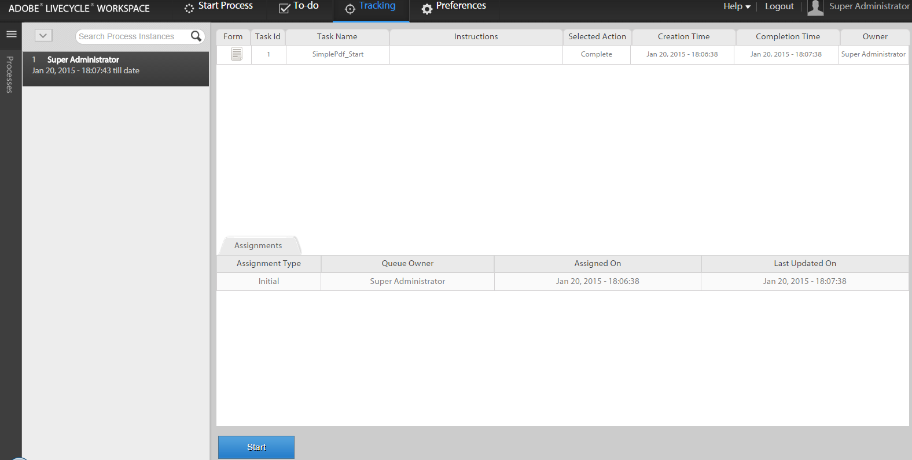
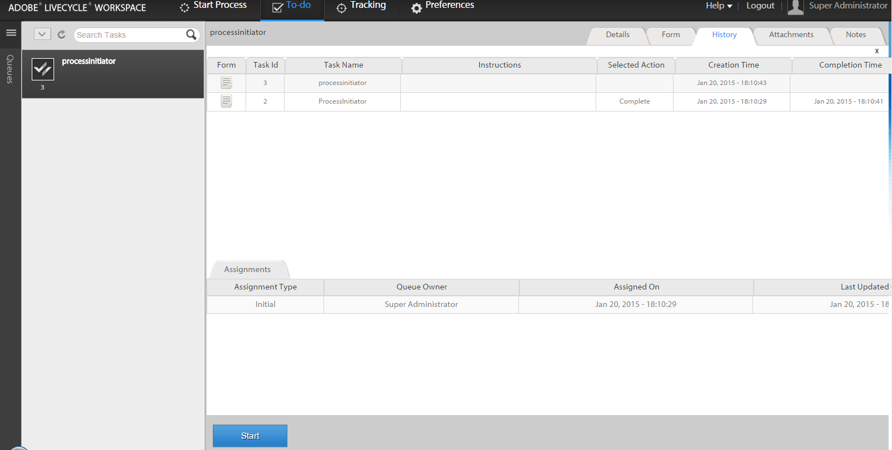

# AEM Forms 작업 공간의 기존 프로세스 데이터로 새 프로세스 시작{#initiating-a-new-process-with-existing-process-data-in-aem-forms-workspace}

기존 프로세스 데이터의 데이터를 사용하여 새 프로세스를 시작할 수 있습니다. 유료 양식의 컨텐츠와 같이 변경 사항이 거의 없는 동일한 양식을 자주 사용해야 하는 경우 기존 프로세스 데이터에서 새로운 프로세스를 시작할 필요가 있습니다. 이 기능은 특히 채우기 프로세스가 긴 경우 사용자의 시간과 노력을 절약할 수 있습니다.

다음은 기존 프로세스 데이터에서 새 프로세스를 시작하는 단계입니다.-

1. 다음 작업 중 하나를 수행합니다.

   * 추적에서 데이터를 사용할 프로세스 인스턴스를 클릭합니다. 오른쪽 창의 [프로세스 내역] 보기에서 시작점에 해당하는 작업 행을 클릭합니다.
   * 추적에서 프로세스 인스턴스 목록을 표시할 검색 템플릿을 선택합니다. 데이터를 사용할 인스턴스를 선택합니다.
   * **[!UICONTROL 할 일]** 탭에서 작업을 선택합니다. **[!UICONTROL 내역]** 탭을 클릭하고 프로세스 인스턴스를 시작한 작업을 선택합니다.

    

1. 작업 작업 도구 모음에서 **[!UICONTROL 시작]**&#x200B;을 클릭합니다. 새 프로세스 인스턴스에 대한 적응형 양식이 데이터의 프리플라이트 상태로 표시됩니다.

1. 필요에 따라 데이터를 업데이트하고 **[!UICONTROL 완료]** 또는 양식의 해당 단추를 클릭합니다.

