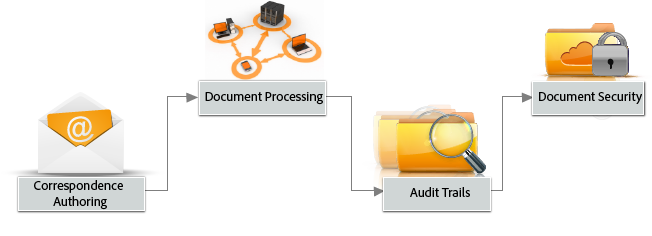

# AEM Forms 소개{#introduction-to-aem-forms}

AEM Forms의 최신 기능 및 개선 사항에 대한 자세한 내용은 [AEM Forms](../../forms/using/whats-new.md)의 새로운 기능을 참조하십시오.

## AEM Forms {#about-aem-forms} 정보

Adobe Experience Manager(AEM)은 백엔드 프로세스, 비즈니스 규칙 및 데이터와 통합하면서도 복잡한 디지털 양식을 작성, 관리, 게시 및 업데이트하는 편리한 솔루션을 제공합니다.

AEM Forms는 해당 관리 기능, 문서 보안 및 통합된 분석과 함께 양식 작성, 관리 및 게시를 결합하여 흥미 있는 종단 간 환경을 생성합니다. 웹 및 모바일 채널 전반에서 작동하도록 설계된 AEM Forms을 비즈니스 프로세스에 효율적으로 통합하면 종이 프로세스와 오류를 줄이고 효율성을 향상시킬 수 있습니다.

대기업은 양식을 한 번 작성하여 컨텐츠 관리 시스템에 복사하여 재사용하는 경우가 많습니다. 대량의 양식을 최신 상태로 유지하고 손쉽게 검색할 수 있도록 하는 것은 상당한 문제가 될 수 있습니다. AEM은 고객이 웹 및 모바일 채널 모두에서 필요한 양식을 찾고 액세스할 수 있도록 사용자 정의 가능한 Forms Portal을 제공합니다.

AEM Forms은 적응형 양식뿐만 아니라 XFA 양식, PDF forms 및 관련 에셋을 관리할 수 있는 양식 관리 툴을 제공합니다. 자세한 내용은 [양식 관리 소개](../../forms/using/introduction-managing-forms.md)를 참조하십시오.

### 주요 기능 {#key-capabilities}

요약하자면 AEM Forms은 다음과 같은 강력한 양식 관리 기능을 제공하므로 수작업 프로세스를 줄이고 고객 만족도를 높일 수 있습니다.

* PDF, HTML5, 적응형 양식 등 다이내믹한 양식을 디자인하고 배포할 수 있는 중앙 집중식 Forms 포털
* 비즈니스 사용자가 양식을 쉽게 가져오고, 관리하고, 미리 보고, 게시할 수 있는 편리한 그래픽 사용자 인터페이스
* 키워드, 태그 및 메타데이터를 사용한 강력한 검색 기능이 포함된 반응형 양식 디렉토리
* 사용자의 디바이스 및 위치를 동적으로 감지하여 웹 및 모바일 채널 간에 양식을 적절하게 렌더링할 수 있습니다.
* Adobe Analytics와의 통합을 통해 양식 사용 측정 지표 효과적으로 측정
* Adobe Document Cloud eSign 서비스 또는 Scribble과 통합하여 기밀 정보가 포함된 문서에 전자 서명할 수 있습니다.
* 자동화된 양식 퍼블리싱 기능과 여러 채널을 통해 적시에 개인화되고 일관된 커뮤니케이션을 전달하는 기능

## AEM 양식 유형 {#aem-form-types}

AEM Forms을 사용하면 다음과 같은 새 양식과 기존 양식을 확장하여 만들 수 있습니다.

* 픽셀 하나까지 완벽하며 페이지가 매겨진 HTML 및 PDF forms(거의 종이 모양)
* 사용자 디바이스 및 브라우저에 맞게 자동으로 렌더링되는 적응형 양식

**PDF forms**

PDF forms은 오프라인으로 채우거나 로컬에 저장하며 다음에 온라인 상태가 되면 양식 데이터를 보낼 수 있습니다. 2D 바코드를 사용하여 양식 데이터를 캡처하고 디지털 서명을 사용하여 사용자의 신뢰성을 확인할 수 있습니다.

**HTML 양식**

HTML5 브라우저 기반 양식을 모바일 디바이스와 데스크탑 브라우저 모두에서 볼 수 있습니다. Scribble 또는 eSign 서비스를 사용하여 HTML 양식에 전자 서명할 수 있습니다.

**적응형 양식**

적응형 양식은 필요에 따라 필드나 섹션을 추가하거나 제거하여 사용자 응답에 동적으로 대응할 수 있습니다. AEM에서는 Adobe XML 양식 템플릿을 재사용하여 적응형 양식을 만들 수 있습니다.

### 지원되는 기능 {#supported-features}

모든 양식 유형은 다음 기능을 지원합니다.

* 동적 레이아웃
* 양식 필드 유효성 검사
* 상황에 맞는 도움말
* 스크립팅 및 XML 데이터 처리
* 액세서빌러티 디자인 및 확인
* 서버측에서 양식을 저장하는 기능
* 첨부 파일 지원
* 데이터 캡처를 위한 HTML 작업 영역과 통합

## 오프라인 데이터 수집 {#offline-data-collection}

양식 데이터가 제출되면 Adobe Experience Manager은 양식 데이터를 기존 시스템, 비즈니스 규칙 및 필요한 사람과 연결합니다.

AEM Forms은 디지털 비즈니스 프로세스를 모바일 디바이스로 확장하는 모바일 애플리케이션인 Forms Workspace를 제공합니다. Forms Workspace를 사용하면 오프라인에서도 데이터를 수집하고 기록할 수 있습니다. Forms Workspace는 모바일 디바이스의 기능을 활용하므로 사진, 비디오를 캡처하고 타임스탬프 및 기타 정보와 같은 데이터를 수집할 수 있습니다. 다음에 네트워크에 연결하면 수집된 데이터를 동기화할 수 있습니다.

오프라인에서 데이터를 캡처하고 나중에 온라인으로 돌아올 때 이를 동기화하는 것은 현장 근무자에게 특히 유용합니다. 생산성을 향상시키고 오류를 줄일 수 있습니다.

**오프라인 데이터 수집을 위해 Forms Workspace를 사용하는 경우의 이점**

* 작업 할당 및 추적을 위한 간편한 HTML 작업 영역 애플리케이션
* 드래그 앤 드롭 방식의 워크플로우 디자인 환경
* ECM(Enterprise Content Management Connectors)
* 양식 데이터를 기업 시스템과 연결할 수 있는 XML 및 SOAP 등 개방형 표준 지원
* 즉시 사용 가능한 HTML 보고서는 백로그, 작업 대기열 및 주요 성능 지표(KPI)를 모니터링합니다.
* 비즈니스 운영에 대한 실시간 통찰력을 제공하는 맞춤형 대시보드
* 제3자 보고 도구와 연결하기 위한 API

## 개인화된 커뮤니케이션 {#personalized-communication}

효율적인 셀프 서비스 디지털 경험의 중요한 구성 요소는 사용자가 어디서나 모든 디바이스에서 액세스할 수 있는 개인화된 정보를 적시에 전달하는 것입니다. 개인화되고 시기적절하게 커뮤니케이션할 수 있으므로 전환율과 사용자 만족도를 높일 수 있습니다.

비즈니스 사용자는 AEM Forms을 사용하여 문서 템플릿을 사용자 정의하고, 백엔드 프로세스의 정보를 통합하고, 인터랙티브한 구성 요소를 포함함으로써 매력적인 개인화된 사용자 경험을 제작할 수 있습니다. 직관적인 유저 인터페이스는 기술적인 면을 잘 모르는 사용자도 문의에 따라 커뮤니케이션을 생성할 시기를 결정하거나 사용자 생성 응답을 시작할 수 있는 비즈니스 규칙을 개발할 수 있도록 도와줍니다.

영수증, 환영 키트, 명세서 등 개인화된 문서를 다양한 채널에 손쉽게 전달할 수 있습니다. 조직은 개인화된 웹 포털에 대한 트래픽을 유도하여 서비스를 등록하거나 추가로 구입할 수 있습니다.

**주요 기능**

* 템플릿, 컨텐츠 블록, 비즈니스 규칙 등에 대한 지원을 활용한 커뮤니케이션 저작 환경
* 문서 변환 및 취합
* 웹, 이메일, 종이 등 다양한 채널을 통해 On-Demand 또는 일괄 문서 전달 지원
* 변경 내역을 통한 감사 추적
* 컨텐츠 무결성과 서명자의 ID를 확인할 수 있는 디지털 서명 지원
* 암호화, 사용 정책, 추적 및 감사를 포함한 AEM Forms용 문서 보안 추가 기능

간소화된 개인화된 커뮤니케이션 워크플로우
