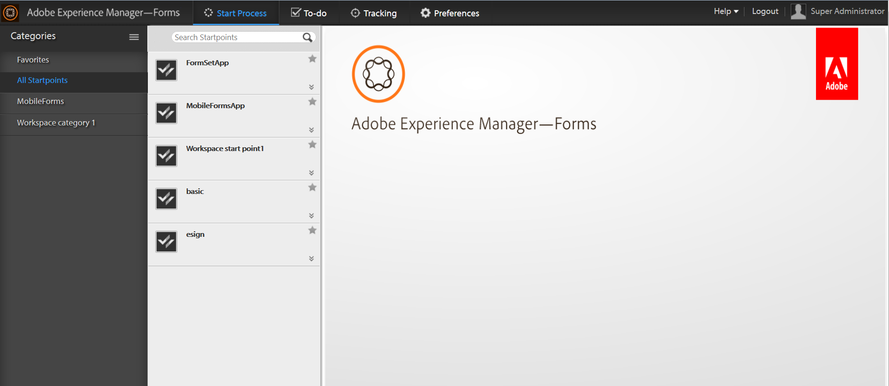

# AEM Forms Workspace 소개{#introduction-to-aem-forms-workspace}

Forms 워크플로우는 중요한 문서 및 양식 관련 비즈니스 프로세스를 자동화하고 가시화하여 조직의 효율성을 높입니다. 프로세스 관리 모듈을 사용하면 사람, 시스템, 컨텐츠, 비즈니스 규칙 등 온라인 또는 오프라인으로 액세스할 수 있는 간소화된 통합 워크플로우를 구축할 수 있습니다.Forms 워크플로에는 AEM Forms 작업 공간이 포함됩니다. AEM Forms workspace는 작업 영역을 확장 및 통합하여 보다 사용자 친화적인 방식으로 만들 수 있는 새로운 기능을 추가합니다.

AEM Forms workspace는 더 많은 장치 및 양식 요인과 호환됩니다. Flash® Player 및 Adobe® Reader®가 없는 클라이언트에서 작업을 관리할 수 있습니다. PDF forms 외에도 HTML Forms의 렌디션을 용이하게 합니다.

**주요 기능**:

* 다이내믹 PDF forms, 모바일 인터페이스 및 웹 애플리케이션을 통해 어디에서나 프로세스 참여자의 참여를 유도하십시오.
* 작업 영역 구성 요소를 웹 애플리케이션과 쉽게 통합할 수 있습니다. AEM Forms 작업 영역은 구성 요소 기반 소프트웨어이므로 손쉽게 맞춤화하고 재사용할 수 있습니다.
* AEM Forms 작업 영역 앱을 사용하여 비즈니스 프로세스를 온라인 및 오프라인 모바일 작업자로 확장합니다.
* 보고서를 보고 백로그, 작업 대기열 및 주요 성능 지표(KPI)를 모니터링합니다. API를 사용하여 서드파티 보고 도구를 사용하여 추가 분석을 위한 데이터를 추출할 수 있습니다.
