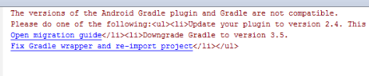

# AEM Forms 앱 문제 해결 {#troubleshoot-aem-forms-app}

이 문서에서는 AEM Forms 앱을 빌드하는 동안 표시될 수 있는 오류 메시지와 이를 해결하는 단계에 대해 설명합니다.

이 문서의 섹션은 다음과 같습니다.

* [iOS 사용자의 첨부 파일 손실](/help/forms/using/issues-aem-forms-app.md#attachment-loss-for-ios-users)
* [workspace 사용자가 제출한 HTML5 양식 초안은 포털에 표시되지 않습니다](/help/forms/using/issues-aem-forms-app.md#html-form-drafts-submitted-by-workspace-users-are-not-visible-on-the-portal)
* [AEM Forms 앱에서 HTML 5 양식(캐시되지 않음) 로드 실패](/help/forms/using/issues-aem-forms-app.md#html-forms-not-cached-fail-to-load-in-aem-forms-app)
* [AEM Forms이 Windows에서 동기화되지 않음](/help/forms/using/issues-aem-forms-app.md#aem-forms-do-not-sync-on-windows)
* [지원되지 않는 Gradle 버전](/help/forms/using/issues-aem-forms-app.md#unsupported-version-of-gradle)
* [Gradle 및 Android Gradle 플러그인 호환성 문제](/help/forms/using/issues-aem-forms-app.md#gradle-and-android-gradle-plug-in-compatibility-issues)

## iOS 사용자의 첨부 파일 손실 {#attachment-loss-for-ios-users}

OSGi에서 AEM Forms과 동기화하도록 구성된 iOS용 AEM Forms 앱은 필드 수준의 첨부 파일만 지원합니다. 모든 첨부 파일의 이름은 고유해야 합니다. 여러 첨부 파일의 이름이 동일한 경우 하나의 첨부 파일만 유지되고 이름이 동일한 다른 모든 첨부 파일은 손실됩니다. iOS 장치의 사용자에게 데이터 손실이 발생하지 않도록 하려면 다음 단계를 수행하십시오.

1. 연결된 서버에서 **Adobe Experience Manager > 도구 > 작업 > 웹 콘솔**&#x200B;로 이동합니다.
1. **[!UICONTROL 적응형 양식 및 대화형 통신 웹 채널 구성]**&#x200B;을 찾아 클릭합니다.
1. [!UICONTROL 적응형 양식 및 대화형 통신 웹 채널 구성] 대화 상자에서 **파일 이름을 고유하게 만들기**&#x200B;를 사용하도록 설정합니다.

   **파일 이름을 고유하게 만들기** 설정을 사용하지 않도록 설정하면 사용자가 여러 첨부 파일이 있는 적응형 양식을 제출하려고 하면 데이터가 손실됩니다.

1. **저장**&#x200B;을 클릭합니다.

## workspace 사용자가 제출한 HTML5 양식 초안은 포털에 표시되지 않습니다 {#html-form-drafts-submitted-by-workspace-users-are-not-visible-on-the-portal}

**초안으로 저장** HTML 렌더링 프로필과 함께 AEM Forms 앱에서 활성화된 HTML5 양식의 경우 저장된 초안이 작업 영역 사용자에게 표시되지 않습니다. 포털에서 작업 영역 사용자가 제출한 HTML5 양식의 저장된 초안을 보려면 다음 단계를 수행하십시오.

1. CRXDE를 열고 관리자 자격 증명으로 로그인합니다.

   URL: `https://<server>:<port>/lc/crx/de/index.jsp`

1. CRXDE의 루트 경로에서 액세스 제어의 액세스 제어 목록에 있는 **+**&#x200B;을(를) 클릭합니다.
1. **새 항목 추가** 대화 상자에서 사용자 필드에 있는 그룹 검색 단추를 클릭합니다.
1. 사용자 선택 대화 상자의 이름 필드에 `PERM_WORKSPACE_USER`을(를) 입력하고 **검색**&#x200B;을 클릭합니다.
1. [사용자 선택] 대화 상자에서 `PERM_WORKSPACE_USER` 그룹을 선택하고 **확인**&#x200B;을 클릭합니다.
1. 새 항목 추가 대화 상자에서 사용자 필드에 `PERM_WORKSPACE_USER` 그룹이 선택되어 있습니다.

   사용자 그룹에 대해 `jcr:read` 권한을 사용하도록 설정합니다.

1. **확인**&#x200B;을 클릭합니다.

## AEM Forms 앱에서 HTML 5 양식(캐시되지 않음) 로드 실패 {#html-forms-not-cached-fail-to-load-in-aem-forms-app}

AEM Forms 앱이 이전 버전의 AEM Forms 서버에 연결된 경우 캐시되지 않은 HTML5 양식이 AEM Forms 앱에서 로드되지 않습니다.

문제를 해결하려면 다음 단계를 수행하십시오.

1. 작성자 인스턴스에서 **Adobe Experience Manager > 도구 > Workspace 앱 오프라인 서비스 구성 > 지금 구성**&#x200B;으로 이동합니다.
1. **Workspace 앱 오프라인 서비스** 페이지에서 **수동 리소스 캐시**&#x200B;를 클릭합니다.

   URL: https://&lt;서버>:&lt;포트>/libs/fd/workspace-offline/content/config.html

1. **수동 리소스 캐시** 탭에서 **+** 단추를 클릭하여 CRX 경로를 추가합니다.
1. **새 리소스 추가** 필드에 /etc.clientlibs/fd/xfaforms/I18N/en_US.js을 입력하고 **추가**&#x200B;를 클릭합니다.
1. **저장**&#x200B;을 클릭합니다.

## AEM Forms이 Windows에서 동기화되지 않음 {#aem-forms-do-not-sync-on-windows}

Windows의 AEM Forms 앱에서 양식 또는 해당 리소스의 경로가 256자 이상인 경우 양식이 연결된 서버와 동기화되지 않습니다.

문자 수를 256자 미만으로 줄이도록 양식 및 리소스의 경로를 수정합니다.

## 지원되지 않는 Gradle 버전 {#unsupported-version-of-gradle}

**오류 메시지:** 프로젝트에서 지원되지 않는 버전의 Gradle을 사용하고 있습니다.

Android Studio에서 AEM Forms 앱을 빌드하면 오류 메시지가 표시됩니다. 이 문제는 시스템에서 지원되지 않는 버전의 Gradle로 인해 발생합니다.

**해결 방법:** 문제를 해결하려면 **Gradle 래퍼 수정 및 프로젝트 다시 가져오기**&#x200B;를 클릭하십시오.

## Gradle 및 Android Gradle 플러그인 호환성 문제 {#gradle-and-android-gradle-plug-in-compatibility-issues}

**오류 메시지:** Android Gradle 플러그인과 Gradle 버전이 호환되지 않습니다.

Android Studio 사용자 인터페이스의 **빌드** 메뉴에서 **APK 빌드** 옵션을 선택하면 오류 메시지가 표시됩니다.

**해결 방법:** **Gradle Scripts** > **gradle-wrapper.properties** 파일을 열고 **distributionUrl** 속성을 편집합니다.

예를 들어 Android Studio 콘솔에서는 Gradle 버전을 3.5로 다운그레이드하는 것이 좋습니다. **distributionUrl** of **gradle-wrapper.properties** 파일에서 버전을 편집합니다.

**빌드** > **APK 빌드**&#x200B;를 다시 선택하여 오류를 해결하고 .apk 파일을 생성합니다.

