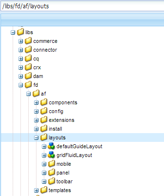

# 적응형 양식의 레이아웃 기능{#layout-capabilities-of-adaptive-forms}

AEM(Adobe Experience Manager)을 사용하면 최종 사용자에게 다이내믹한 경험을 제공하는 사용이 간편한 적응형 양식을 만들 수 있습니다. 양식 레이아웃은 항목 또는 구성 요소가 적응형 양식으로 표시되는 방식을 제어합니다.

## 사전 지식 {#prerequisite-knowledge}

적응형 양식의 다양한 레이아웃 기능에 대해 학습하기 전에 다음 문서를 참조하여 적응형 양식에 대해 자세히 알아보십시오.

[AEM Forms 소개](../../forms/using/introduction-aem-forms.md)

[양식 작성 소개](../../forms/using/introduction-forms-authoring.md)

## 레이아웃 유형 {#types-of-layouts}

적응형 양식에서는 다음과 같은 유형의 레이아웃을 제공합니다.

**패널 레이아웃** 패널 내의 항목 또는 구성 요소가 장치에 표시되는 방식을 제어합니다.

**모바일** 레이아웃 모바일 장치에서 양식의 탐색을 제어합니다. 장치 너비가 768픽셀 이상인 경우 레이아웃은 모바일 장치에 맞게 최적화된 모바일 레이아웃으로 간주됩니다.

**도구 모음** 레이아웃 양식의 도구 모음 또는 패널 도구 모음에서 작업 단추 배치를 제어합니다.

이러한 모든 패널 레이아웃은 다음 위치에 정의됩니다.

`/libs/fd/af/layouts`.

>[!NOTE]
>
>적응형 양식의 레이아웃을 변경하려면 AEM에서 작성 모드를 사용합니다.



## 패널 레이아웃 {#panel-layout}

양식 작성자는 레이아웃을 루트 패널을 포함하여 응용 양식의 각 패널에 연결할 수 있습니다.

패널 레이아웃은 `/libs/fd/af/layouts/panel` 위치에서 사용할 수 있습니다.


적응형 양식의 패널 레이아웃 목록

### Responsive - everything on one page without navigation {#responsive-everything-on-one-page-without-navigation-br}

이 패널 레이아웃을 사용하여 장치의 화면 크기에 맞게 조정되는 반응형 레이아웃을 만들 수 있습니다. 이때 특수 탐색을 할 필요가 없습니다.

이 레이아웃을 사용하면 여러 패널 응용 **[!UICONTROL 양식]** 구성 요소를 패널 안에 차례로 배치할 수 있습니다.


작은 화면에 표시되는 반응형 레이아웃을 사용하는 양식


대형 화면에서 볼 수 있는 반응형 레이아웃을 사용하는 양식

### 마법사 - 한 번에 한 단계씩 표시되는 다단계 양식 {#wizard-a-multi-step-form-showing-one-step-at-a-time}

이 패널 레이아웃을 사용하여 양식 내에서 안내 탐색이 가능합니다. 예를 들어 사용자가 단계별로 안내하는 동안 양식의 필수 정보를 캡처하려면 이 레이아웃을 사용합니다.

구성 요소를 `Panel adaptive form` 사용하여 패널 내에서 단계별 탐색을 제공할 수 있습니다. 이 레이아웃을 사용하면 사용자가 현재 단계가 완료된 후에만 다음 단계로 이동합니다

```
window.guideBridge.validate([], this.panel.navigationContext.currentItem.somExpression)
```


다중 단계 양식의 마법사 레이아웃의 단계 완료 표현식


마법사를 사용한 양식

### 아코디언 디자인을 위한 레이아웃 {#layout-for-accordion-design}

이 레이아웃을 사용하면 아코디언 스타일 탐색이 있는 패널에 `Panel adaptive form` 구성 요소를 배치할 수 있습니다. 이 레이아웃을 사용하여 반복 가능한 패널을 만들 수도 있습니다. 반복 가능한 패널을 사용하면 필요에 따라 패널을 동적으로 추가하거나 제거할 수 있습니다. 패널이 반복되는 최소 및 최대 횟수를 정의할 수 있습니다. 또한 패널 항목에 제공된 정보에 따라 패널 제목을 동적으로 결정할 수 있습니다.

요약 표현식을 사용하여 최소화된 패널의 제목에 최종 사용자가 제공한 값을 표시할 수 있습니다.


아코디언 레이아웃을 사용하여 만든 반복 가능한 패널

### 탭 레이아웃 - 탭이 왼쪽에 표시됩니다. {#tabbed-layout-tabs-appear-on-the-left}

이 레이아웃을 사용하면 탭 탐색 기능이 있는 패널에 구성 `Panel adaptive form` 요소를 배치할 수 있습니다. 탭이 패널 내용의 왼쪽에 배치됩니다.


패널 왼쪽에 표시되는 탭

### 탭 레이아웃 - 탭이 맨 위에 표시됩니다. {#tabbed-layout-tabs-appear-on-the-top}

이 레이아웃을 사용하면 탭 탐색 기능이 있는 `Panel adaptive form` 패널에 구성 요소를 배치할 수 있습니다. 탭이 패널 내용의 맨 위에 표시됩니다.


패널 상단에 표시되는 탭

## 모바일 레이아웃 {#mobile-layouts}

모바일 레이아웃을 사용하면 화면 크기가 상대적으로 작은 모바일 디바이스에서 사용자 친화적인 내비게이션을 경험할 수 있습니다. 모바일 레이아웃에서는 탭 스타일 또는 마법사 스타일을 사용하여 양식을 탐색할 수 있습니다. 모바일 레이아웃 적용은 전체 양식에 대해 단일 레이아웃을 제공합니다.

이 레이아웃은 탐색 막대와 탐색 메뉴를 사용하여 탐색을 제어합니다. 탐색 막대는 **다음** 및 **이전** 탐색 단계를 나타내는 &lt; **및** > **아이콘을 양식에 표시합니다** .

모바일 레이아웃은 `/libs/fd/af/layouts/mobile/` 위치에서 사용할 수 있습니다. 다음 모바일 레이아웃은 기본적으로 적응형 양식으로 사용할 수 있습니다.


적응형 양식의 모바일 레이아웃 목록

모바일 레이아웃을 사용하는 경우, 양식 메뉴가 다양한 양식 패널에 액세스하기 위해  아이콘을 탭하여 사용할 수 있습니다.

### 양식 헤더에 패널 제목이 있는 레이아웃 {#layout-with-panel-titles-in-the-form-header}

이 레이아웃은 이름에서 알 수 있듯이 내비게이션 메뉴 및 내비게이션 막대와 함께 패널 제목을 표시합니다. 이 레이아웃에서는 탐색을 위한 다음 및 이전 아이콘도 제공합니다.


양식 헤더에 패널 제목이 있는 모바일 레이아웃

### 양식 머리글에서 패널 제목이 없는 레이아웃 {#layout-without-panel-titles-in-the-form-header}

이 레이아웃은 이름에서 알 수 있듯이 패널 제목이 없는 내비게이션 메뉴와 내비게이션 막대만 표시합니다. 이 레이아웃에서는 탐색을 위한 다음 및 이전 아이콘도 제공합니다.


양식 헤더에서 패널 제목이 없는 모바일 레이아웃

## 툴바 레이아웃 {#toolbar-layouts}

도구 모음 레이아웃은 적응형 양식에 추가하는 동작 단추의 배치 및 표시를 제어합니다. 레이아웃은 양식 수준 또는 패널 수준에서 추가할 수 있습니다.


적응형 양식의 도구 모음 레이아웃 목록

도구 모음 레이아웃은 `/libs/fd/af/layouts/toolbar` 위치에서 사용할 수 있습니다. 적응형 양식은 기본적으로 다음과 같은 도구 모음 레이아웃을 제공합니다.

### 도구 모음의 기본 레이아웃 {#default-layout-for-toolbar}

이 레이아웃은 적응형 양식의 작업 단추를 추가할 때 기본 레이아웃으로 선택됩니다. 이 레이아웃을 선택하면 데스크탑 및 모바일 장치 모두에 대해 동일한 레이아웃이 표시됩니다.

또한 이 레이아웃으로 구성된 작업 단추가 포함된 여러 도구 모음을 추가할 수 있습니다. 작업 단추는 양식 컨트롤과 연결됩니다. 도구 모음을 패널 앞이나 뒤에 있도록 구성할 수 있습니다.


도구 모음의 기본 보기

### 도구 모음의 모바일 고정 레이아웃 {#mobile-fixed-layout-for-toolbar}

데스크톱 및 모바일 장치에 대한 대체 레이아웃을 제공하려면 이 레이아웃을 선택합니다.

데스크톱 레이아웃의 경우 일부 특정 레이블을 사용하여 작업 단추를 추가할 수 있습니다. 이 레이아웃에서는 하나의 도구 모음만 구성할 수 있습니다. 이 레이아웃으로 두 개 이상의 도구 모음이 구성된 경우 모바일 장치에 대해 겹치는 부분이 있으며 하나의 도구 모음만 표시됩니다. 예를 들어 양식의 맨 아래 또는 맨 위에 도구 모음을 표시하거나, 양식의 패널 뒤 또는 이전 패널에 도구 모음을 표시할 수 있습니다.

모바일 레이아웃의 경우 아이콘을 사용하여 작업 단추를 추가할 수 있습니다.


도구 모음의 모바일 고정 레이아웃

