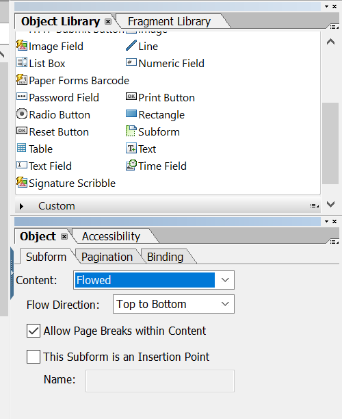
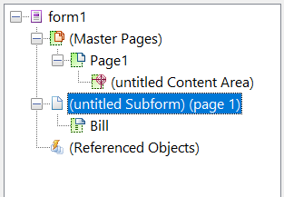

# 레이아웃 디자인{#layout-design}

XFA 양식 템플릿 또는 XDP는 다음 템플릿을 위한 템플릿입니다.

* [편지](/help/forms/using/create-letter.md)
* [대화형 ](/help/forms/using/web-channel-print-channel.md#printchannel) 통신 [의 인쇄 채널](/help/forms/using/interactive-communications-overview.md)

* 레이아웃 단편

XDP는 Adobe Forms 디자이너에 디자인되었습니다. 이 문서에서는 양식 필드 또는 대상 영역을 사용하는 위치 및 레이아웃 조각 사용 시점과 같이 효과적인 서신/대화형 커뮤니케이션을 만들기 위해 XDP를 디자인하는 방법에 대한 세부 정보를 제공합니다.

## 문자 또는 대화형 커뮤니케이션의 인쇄 채널용 레이아웃 만들기 {#creating-a-layout-for-letters-or-for-interactive-communications-print-channel}

레이아웃은 대화형 커뮤니케이션의 편지/인쇄 채널의 그래픽 레이아웃을 정의합니다. 레이아웃에는 &quot;주소&quot; 및 &quot;참조 번호&quot;와 같은 일반적인 양식 필드가 포함될 수 있습니다. 또한 대상 영역을 나타내는 빈 하위 양식이 포함되어 있습니다. 양식 디자이너에서 레이아웃을 만들고 응용 프로그램 전문가가 완료되면 이 레이아웃을 AEM 서버에 업로드합니다. 여기에서 서신 템플릿을 만들거나 대화형 커뮤니케이션의 인쇄 채널을 만들 때 레이아웃을 선택할 수 있습니다.

다음 단계에 따라 대화형 커뮤니케이션의 문자/인쇄 채널에 대한 레이아웃을 만듭니다.

1. 레이아웃을 분석하고 모든 페이지에서 반복되는 컨텐츠를 결정합니다.일반적으로 페이지 머리글과 바닥글은 이 카테고리에 맞습니다. 이 컨텐츠는 레이아웃의 마스터 페이지에 배치됩니다. 나머지 컨텐츠는 레이아웃의 본문 페이지로 이동합니다. 정책 재킷에서 로고와 회사 주소를 마스터 페이지 머리글 및 바닥글에 추가할 수 있습니다. 예를 들어 취소 통지에서는 동일한 레이아웃을 사용합니다.
1. 본문 페이지를 디자인할 때 페이지 컨텐츠를 섹션으로 나누십시오. 각 섹션은 레이아웃 자체에 포함된 하위 양식이나 조각 레이아웃으로 디자인됩니다. 섹션에 테이블이 포함되어 있으면 섹션을 레이아웃 조각으로 모델링합니다.
1. 레이아웃은 다음과 같이 디자인할 수 있습니다.

   1. 각 섹션을 섹션의 모든 요소를 포함하는 별도의 하위 양식으로 만듭니다.
   1. 동일한 부모 하위 양식의 각 섹션 하위 폼을 만듭니다. 상위 하위 양식의 레이아웃은 큰 데이터가 이전 섹션에서 병합되는 경우 섹션이 아래로 이동할 수 있도록 플로우로 설정됩니다.
   1. 섹션 기본 거주지는 다른 레이아웃에서도 재사용할 수 있습니다. 조각 레이아웃으로 만듭니다.
   1. 섹션 추가 관심 사항에는 두 개의 요소만 다른 요소 아래에 배치되고 큰 데이터를 포함할 수 있으며 흐르도록 디자인됩니다.
   1. 다른 섹션에는 특정 위치의 요소가 포함되어 있으므로 배치된 레이아웃으로 디자인됩니다.
   1. 섹션에 특정 위치의 요소가 포함되어 있고 이러한 요소에 많은 양의 데이터가 포함되어 있는 경우 섹션을 하위 양식으로 분류하십시오. 그런 다음 하위 양식을 배열하여 원하는 동작을 수행합니다.
   1. 기본 주거 섹션의 경우 자리 표시자 대상 영역을 추가합니다. 이 자리 표시자는 편지/대화형 통신 디자인 시 기본 거주를 조각 지정합니다.
   1. 레이아웃(및 레이아웃을 사용하는 조각(있는 경우)을 AEM Forms 서버에 업로드합니다.

### XDP 템플릿에서 하위 양식 사용 {#usesubformxdp}

대화형 커뮤니케이션을 만드는 데 필요한 레이아웃을 분석하면 Forms 디자이너를 사용하여 XDP 템플릿에서 하위 양식을 만들 수 있습니다. XDP 템플릿에 사용된 빈 하위 양식 구성 요소는 대화형 커뮤니케이션의 인쇄 채널에서 대상 영역이 표시됩니다.

>[!NOTE]
>
>XDP 템플릿의 하위 양식 구성 요소에 콘텐츠를 추가하는 대신 대화형 커뮤니케이션의 인쇄 채널에 콘텐츠를 추가합니다. [문서 조각, 차트, 이미지](create-interactive-communication.md#step2) 및 레이아웃 조각을 사용하여 인쇄 채널의 대상 영역에 컨텐츠를 추가합니다.

XDP 템플릿에서 하위 양식을 사용하려면 다음 단계를 수행하십시오.

1. Forms 디자이너를 열고 **파일** > **새로 만들기** > **빈 양식 사용**, **다음**&#x200B;을 탭한 다음, **완료**&#x200B;를 탭하여 템플릿을 만들 양식을 엽니다.

   **Window** 메뉴에서 **개체 라이브러리** 및 **개체** 옵션이 선택되어 있는지 확인합니다.

1. **개체 라이브러리**&#x200B;에서 **하위 양식** 구성 요소를 폼으로 끌어다 놓습니다.

   

1. 오른쪽 창의 **개체** 창에 하위 양식의 옵션을 표시하려면 하위 폼을 선택합니다.
1. **하위 양식** 탭을 선택하고 **콘텐츠** 드롭다운 목록에서 **흐름**&#x200B;을 선택합니다. 하위 양식의 왼쪽 끝점을 드래그하여 길이를 조정합니다.

   

1. **바인딩** 탭에서 다음을 수행합니다.

   1. **이름** 필드에 하위 양식의 이름을 지정하십시오.
   1. **데이터 바인딩** 드롭다운 목록에서 **데이터 바인딩 없음**&#x200B;을 선택합니다.

1. 마찬가지로 왼쪽 창에서 루트 하위 폼을 선택합니다.

   

1. **하위 양식** 탭을 선택하고 **콘텐츠** 드롭다운 목록에서 **흐름**&#x200B;을 선택합니다. **바인딩** 탭에서 다음을 수행합니다.

   1. **이름** 필드에 하위 양식의 이름을 지정하십시오.
   1. **데이터 바인딩** 드롭다운 목록에서 **데이터 바인딩 없음**&#x200B;을 선택합니다.

   2~5단계를 반복하여 XDP 템플릿에 하위 양식을 더 추가합니다. 대화형 커뮤니케이션을 작성하는 동안에만 [텍스트, 문서 조각, 이미지 및 차트](create-interactive-communication.md#step2)를 대상 영역에 추가합니다.

1. **파일** > **다른 이름으로 저장**&#x200B;을 선택하여 로컬 파일 시스템에 파일을 저장합니다.

   1. 파일을 저장할 위치로 이동하고 XDP 템플릿의 이름을 지정합니다.
   1. **다른 이름으로 저장 유형** 드롭다운 목록에서 **.xdp** 을 선택합니다.

   1. **저장**&#x200B;을 누릅니다.

### XDP 템플릿 {#use-image-field-component-in-an-xdp-template}에서 이미지 필드 구성 요소 사용

XDP 템플릿에서 이미지 필드 또는 하위 양식 구성 요소를 사용하고 대화형 커뮤니케이션을 작성하는 동안 이미지를 추가합니다.

>[!NOTE]
>
>XDP 템플릿의 이미지 필드 또는 하위 양식 구성 요소에 이미지를 추가하는 대신 대화형 커뮤니케이션의 인쇄 채널에 이미지를 추가합니다. 자세한 내용은 [대화형 커뮤니케이션에 콘텐츠 추가](../../forms/using/create-interactive-communication.md#step2)를 참조하십시오.

XDP 템플릿에서 이미지 필드 구성 요소를 사용하려면 다음 단계를 수행하십시오.

1. **Object Library**&#x200B;에서 **이미지 필드** 구성 요소를 양식에 드래그하여 놓습니다.
1. 오른쪽 창의 **개체** 창에 하위 양식의 옵션을 표시하려면 하위 폼을 선택합니다.
1. **바인딩** 탭에서 다음을 수행합니다.

   1. **이름** 필드에 이미지 필드의 이름을 지정합니다.
   1. **데이터 바인딩** 드롭다운 목록에서 **데이터 바인딩 없음**&#x200B;을 선택합니다.

### 레이아웃 조각용 XDP 템플릿 만들기 {#xdplayoutfragments}

Forms 디자이너의 표 구성 요소를 사용하여 레이아웃 조각을 만든 다음 대화형 커뮤니케이션의 인쇄 채널을 작성하는 동안 표를 만드는 데 사용합니다. 레이아웃 조각을 사용하여 표를 만들면 인쇄 채널을 사용하여 웹 채널을 자동으로 생성할 때 테이블 컨텐츠가 구조를 유지하게 됩니다.

>[!NOTE]
>
>표 셀에 텍스트를 입력하거나 [대화형 커뮤니케이션을 작성하는 동안에만 양식 데이터 모델 개체](create-interactive-communication.md#step2)로 바인딩을 만듭니다.

Forms 디자이너를 사용하여 XDP 템플릿에서 표 구성 요소를 사용하려면 다음 단계를 수행하십시오.

1. **Object Library**&#x200B;에서 **Table** 구성 요소를 양식에 드래그하여 놓습니다.
1. **표 삽입** 대화 상자에서 다음을 수행합니다.

   1. 테이블의 행 및 열 수를 지정합니다.
   1. 테이블 머리글에 대한 행을 포함하려면 **테이블**&#x200B;에 머리글 행 포함 확인란을 선택합니다.
   1. **확인**&#x200B;을 누릅니다.

1. 테이블 이름 옆에 있는 왼쪽 창에서 **+**&#x200B;을 누르고 헤더와 다른 행에 포함된 셀 이름을 마우스 오른쪽 단추로 클릭한 다음 **개체 이름 바꾸기**&#x200B;를 선택하여 테이블 셀의 이름을 변경합니다.
1. **디자인 뷰**&#x200B;에서 테이블 머리글 텍스트 필드를 클릭하고 이름을 변경합니다.
1. **개체 라이브러리**&#x200B;에서 **텍스트 필드** 구성 요소를 **디자인 보기**&#x200B;의 각 테이블 셀로 드래그하여 놓습니다. 대화형 커뮤니케이션을 작성하는 동안 테이블 셀을 양식 데이터 모델 개체에 바인딩하려면 이 단계를 수행하십시오.

   

1. 왼쪽 창에서 행 이름을 선택하고 **개체** > **바인딩** > **각 데이터 항목에 대해 행 반복**&#x200B;을 선택합니다. 이 단계를 수행하여 이 행의 테이블 셀 사이에 컬렉션 유형의 양식 데이터 모델 개체가 있는 바인딩이 만들어지면 데이터베이스에서 사용할 수 있는 각 데이터 항목에 대해 테이블 행이 자동으로 반복되도록 합니다.

   표 셀에 텍스트를 입력하거나 [대화형 커뮤니케이션을 작성하는 동안에만 양식 데이터 모델 개체](create-interactive-communication.md#step2)로 바인딩을 만듭니다.

1. **파일** > **다른 이름으로 저장**&#x200B;을 선택하여 로컬 파일 시스템에 파일을 저장합니다.

   1. 파일을 저장할 위치로 이동하고 XDP 템플릿의 이름을 지정합니다.
   1. **다른 이름으로 저장 유형** 드롭다운 목록에서 **.xdp** 을 선택합니다.

   1. **저장**&#x200B;을 누릅니다.

### AEM Forms 서버에 XDP 템플릿 업로드 {#uploadxdptemplate}

Forms 디자이너를 사용하여 XDP 템플릿을 만든 후에는 대화형 커뮤니케이션을 만드는 동안 템플릿을 사용할 수 있도록 AEM Forms 서버에 업로드해야 합니다.

1. **Forms** > **Forms 및 문서**&#x200B;를 선택합니다.
1. **만들기** > **파일 업로드**&#x200B;를 누릅니다.
1. 로컬 파일 시스템에서 XDP 템플릿의 위치로 이동하고 **열기** 를 눌러 XDP 템플릿을 AEM Forms 서버로 가져옵니다.

## 스키마 {#using-schema} 사용

레이아웃 또는 레이아웃 조각에서 스키마를 사용할 수 있지만 필수 사항은 아닙니다. 스키마를 사용하는 경우 다음을 확인하십시오.

1. 편지/대화형 커뮤니케이션에서 사용되는 레이아웃 및 모든 조각 레이아웃은 편지/대화형 커뮤니케이션과 동일한 스키마를 사용합니다.
1. 데이터로 채워야 하는 모든 필드는 스키마에 바인딩됩니다.

## 조정 가능한 필드 만들기 {#creating-relatable-fields}

기본적으로 모든 필드는 다른 다양한 데이터 소스와 관련된 것으로 간주됩니다. 레이아웃에 데이터 소스와 관련이 없는 필드가 포함된 경우 &quot;_int&quot;(내부) 접미사를 사용하여 필드의 이름을 지정합니다.예를 들면 pageCount_int가 있습니다.

관련 가능한 필드는 다음과 같습니다.

* XFA &lt;필드> 또는 &lt;exclGroup>이어야 합니다.
* xfa 바인딩 참조가 있습니다.
* &lt;exclGroup>이면 하나 이상의 하위 라디오 단추 필드가 있어야 합니다.그렇지 않으면 값 유형을 확인할 수 없습니다

관련 가능한 필드는 다음과 같습니다.

* 이름 있음

관련성 필드는 다음과 같이 해서는 안 됩니다.

* 이름에 &quot;_int&quot; 접미사를 포함하십시오
* 바인딩이 &quot;none&quot;으로 설정되어 있습니다.
* &lt;exclGroup> 요소의 하위 항목임

관계식 필드가 위에서 설명한 기준을 충족하는 한 레이아웃의 임의의 위치 및 중첩 깊이에 있을 수 있습니다. 마스터 페이지 내에서 관련성 필드를 사용할 수 있습니다.

필드는 대상 영역 하위 양식보다 레이아웃 구성에서 더 유연합니다.하지만 단일 값 유형에 연결됩니다. 필드를 크게 만들거나 고정 너비와 높이 등으로 설정할 수 있습니다. 해결된 모듈 또는 규칙 결과가 필드에 푸시됩니다.

## 하위 양식 및 텍스트 필드 사용 시기 결정 {#deciding-when-to-use-subforms-and-text-nbsp-fields}

하향식 세로 흐름 레이아웃에서 여러 모듈 콘텐츠를 캡처하려면 하위 양식을 사용합니다(여러 단락이나 이미지). 레이아웃은 하위 양식의 내용을 수용하기 위해 높이가 높아진다는 사실을 처리해야 합니다. 하위 폼/대상에 연결된 콘텐츠 길이가 레이아웃의 하위 폼에 예약된 공간을 초과하지 않도록 확신할 수 없는 경우에는 하위 폼을 하위 폼 컨테이너 내에 하위 폼으로 만듭니다. 이 프로세스에서는 하위 양식 아래의 레이아웃 개체가 하위 폼이 커지면 아래로 이동합니다.

모듈 데이터 또는 데이터 사전 요소 데이터를 레이아웃의 스키마에 캡처하거나(필드가 데이터에 바인딩되므로) 마스터 페이지에 모듈 컨텐츠를 표시하려면 필드를 사용합니다. 마스터 페이지의 컨텐츠는 본문 페이지 컨텐츠와 함께 흐를 수 없으므로 이미지 필드가 헤더 로고로 사용되는지 확인해야 합니다. 이 표는 레이아웃의 하위 폼이나 필드를 사용할 시기를 결정하는 더 많은 기준을 제공합니다.

<table>
 <tbody>
  <tr>
   <td>
<strong>하위 폼 사용</strong>
 </td>
   <td>
<strong>다음 경우에 텍스트 필드 사용</strong>
 </td>
  </tr>
  <tr>
   <td>
여기에는 성 및 이름과 같은 요소 조합이 포함되어 있습니다
 </td>
   <td>
여기에는 정책 번호와 같은 단일 요소가 포함되어 있습니다.
 </td>
  </tr>
  <tr>
   <td>
여기에는 여러 단락이 포함되어 있습니다
 </td>
   <td>
텍스트를 줄바꿈하고 균등 배치하십시오
 </td>
  </tr>
  <tr>
   <td>
반복, 선택 사항 및 조건부 데이터 그룹은 하위 양식에 연결되어 동일한 결과를 얻기 위해 스크립트를 사용할 경우 발생할 수 있는 디자인 오류 위험을 줄입니다
 </td>
   <td>
조직의 로고 및 주소와 같은 요소는 편지/대화형 커뮤니케이션의 모든 페이지에 표시됩니다. 이 경우 해당 요소에 대한 양식 필드를 만들어 마스터 페이지에 배치합니다. 필드 바인딩을 "데이터 바인딩 없음"으로 설정하면 편지/대화형 통신 편집기에서 관련 가능한 필드로 표시되지 않습니다. 일부 유형의 컨텐츠를 이러한 필드에 연결하려면 바인딩이 있어야 합니다.
 
회사 주소에 두 개 이상의 데이터 행이 포함된 경우 레이아웃의 주소를 나타내려면 "여러 줄 허용" 옵션과 함께 텍스트 필드를 사용합니다.
 
텍스트 필드의 데이터 유형을 일반 텍스트로 설정하면 서식 있는 텍스트 버전 대신 모듈 출력의 일반 텍스트 버전이 사용됩니다(모든 서식이 삭제됨). 서식을 유지하려면 텍스트 필드의 데이터 유형을 서식 있는 텍스트로 설정합니다.
 </td>
  </tr>
  <tr>
   <td>
텍스트가 흐릅니다
 </td>
   <td>
텍스트 필드와 이미지 필드는 마스터 페이지에서 사용됩니다. 기본 페이지에서는 하위 양식을 대상 영역으로 사용할 수 없습니다.
 </td>
  </tr>
  <tr>
   <td>
개체는 하위 폼을 데이터 요소에 바인딩하지 않고 그룹화되고 구성됩니다
 </td>
   <td>
 
 </td>
  </tr>
  <tr>
   <td>
하위 폼 안에 텍스트 필드가 있습니다. 하위 폼은 확장될 수 있으며 레이아웃의 해당 하위 개체 아래에 있는 다른 개체를 덮어쓰지 않습니다.
 </td>
   <td>
사후 프로세스에서 해당 데이터에 쉽게 액세스할 수 있어야 합니다.
 </td>
  </tr>
 </tbody>
</table>

## 반복 요소 {#setting-up-repetitive-elements} 설정

편지/대화형 커뮤니케이션의 모든 페이지에 조직의 로고 및 주소와 같은 요소가 나타나면 해당 요소에 대한 양식 필드를 만들어 마스터 페이지에 배치합니다. 이러한 필드에 이름(필드 이름) 바인딩을 사용합니다.

## 서버 렌더링 형식 {#specify-the-server-nbsp-render-format} 지정

레이아웃의 서버 렌더링 형식을 Dynamic XML Form에 사용합니다.그렇지 않으면 이 레이아웃을 기반으로 하는 모든 문자/대화형 커뮤니케이션이 올바르게 렌더링될 수 없습니다. 기본적으로 Forms 디자이너의 서버 렌더링 형식은 동적 XML 양식으로 설정됩니다. 올바른 형식을 사용하고 있는지 확인하려면:

* 디자이너에서 **파일** > **양식 속성** > **기본값**&#x200B;을 클릭하고 PDF 렌더링/형식 설정이 동적 XML 양식으로 설정되어 있는지 확인합니다.
