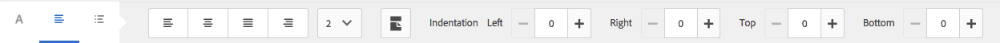

# 문서 단편{#document-fragments}

## 문서 단편 {#document-fragments-1}

문서 조각은 편지/서신을 작성할 수 있는 서신의 재사용 가능한 부분/구성 요소입니다. 문서 조각은 다음 유형의 조각입니다.

* **텍스트**:텍스트 자산은 하나 이상의 텍스트 단락으로 구성된 컨텐츠의 일부입니다. 단락은 정적 또는 동적일 수 있습니다.
* **목록**:목록은 텍스트, 목록, 조건 및 이미지를 포함한 문서 조각 그룹입니다. 목록 요소의 순서를 수정하거나 편집할 수 있습니다. 편지를 만드는 동안 일부 또는 모든 목록 요소를 사용하여 재사용 가능한 요소 패턴을 복제할 수 있습니다.
* **조건**:조건을 사용하면 제공된 데이터를 기반으로 서신 생성 시 포함되는 콘텐츠를 정의할 수 있습니다. 조건은 제어 변수 용어로 설명되어 있습니다. 컨트롤 변수는 데이터 사전 요소 또는 자리 표시자일 수 있습니다.
* **레이아웃 조각**:레이아웃 조각은 하나 이상의 문자 내에서 사용할 수 있는 레이아웃입니다. 레이아웃 조각은 반복 가능한 패턴(특히 다이내믹 테이블)을 만드는 데 사용됩니다. 레이아웃에는 &quot;주소&quot; 및 &quot;참조 번호&quot;와 같은 일반적인 양식 필드가 포함될 수 있습니다. 또한 대상 영역을 나타내는 빈 하위 양식이 포함되어 있습니다. XDP(레이아웃)는 Designer에서 만든 다음 AEM Forms에 업로드됩니다.

## 텍스트 {#text}

텍스트 자산은 하나 이상의 텍스트 단락으로 구성된 컨텐츠의 일부입니다. 단락은 정적 또는 동적일 수 있습니다. 동적 단락에는 런타임 시 값이 제공되는 데이터 요소에 대한 참조가 포함되어 있습니다. 예를 들어 편지 감면의 고객 이름은 동적 데이터 요소일 수 있으며 이 요소의 값은 런타임 시 사용할 수 있습니다. 이러한 값을 변경하면 동일한 편지 템플릿을 사용하여 여러 고객을 위한 문자를 생성할 수 있습니다.

서신 관리 솔루션은 동적 데이터 항목(변수 데이터)에 대한 두 가지 종류를 지원합니다.

* **데이터 사전 요소**:이러한 요소는 데이터 사전에 바인딩되며 제공된 데이터 소스에서 해당 값을 가져옵니다. 데이터 사전 변수는 보호하거나 보호되지 않을 수 있습니다. 서신 작성 중에 사용자는 보호되지 않은 데이터 사전 변수의 기본값을 수정할 수 있지만 보호된 변수는 수정할 수 없습니다.
* **자리 표시자**:이러한 변수는 백엔드 데이터 소스에 바인딩되지 않은 변수입니다. 사용자는 서신 작성 중에 값을 입력해야 합니다. 자리 표시자는 기본적으로 보호되지 않습니다.

>[!NOTE]
>
>서신 관리 템플릿은 자리 표시자를 만들 때 고유한 이름을 만들지 않습니다. 텍스트 및 조건 등의 이름이 같은 자리 표시자를 두 개 만들고 두 자리 표시자를 모두 문자 템플릿에서 사용하는 경우, 마지막으로 삽입된 자리 표시자 값이 두 자리 표시자에 모두 사용됩니다. 자리 표시자의 이름이 같은 경우 해당 형식을 비교합니다. 유형이 다르면 해당 유형은 String이 됩니다. 그러나 모듈 내에서 이름이 같은 자리 표시자를 여러 개 만들 수는 없습니다.

### 텍스트 {#create-text} 만들기

1. **Forms** > **문서 조각**&#x200B;을 선택합니다.
1. **만들기** > **텍스트**&#x200B;를 탭하거나 텍스트 자산을 선택하고 **편집**&#x200B;을 탭합니다.
1. 텍스트에 대해 다음 정보를 지정합니다.

   * **제목:(선택 사항)** 텍스트 자산의 제목을 입력합니다. 제목은 고유해야 하며 특수 문자와 비영어 문자가 있을 수 있습니다. 텍스트는 미리 보기 및 자산 속성과 같이 해당 제목(사용 가능한 경우)으로 참조됩니다.
   * **이름:** 텍스트 자산에 대한 고유한 이름입니다. 어떤 상태에서든 동일한 이름의 두 자산(텍스트, 조건 또는 목록)은 존재할 수 없습니다. 이름 필드에 영어 문자, 숫자 및 하이픈만 입력할 수 있습니다. 이름 필드는 제목 필드를 기반으로 자동으로 채워집니다. 제목 필드에 입력한 특수 문자, 공백, 숫자 및 비영어 문자는 이름 필드에서 하이픈으로 바뀝니다. 제목 필드의 값이 자동으로 이름에 복사되지만 값을 편집할 수 있습니다.
   * **설명**:자산에 대한 설명을 입력합니다.
   * **데이터 사전**:매핑할 데이터 사전을 선택합니다(선택적). 이 속성을 사용하면 텍스트 자산의 데이터 사전 요소에 대한 참조를 추가할 수 있습니다.
   * **태그**:사용자 지정 태그를 만들려면 텍스트 필드에 값을 입력하고 Enter 키를 누릅니다(선택적). 태그의 텍스트 필드 아래에 태그가 표시됩니다. 이 텍스트를 저장하면 새로 추가된 태그도 생성됩니다.

1. **다음**&#x200B;을 누릅니다. 서신 관리에는 텍스트 단락과 데이터 요소를 텍스트에 추가할 수 있는 편집기 페이지가 표시됩니다.

   브라우저의 기본 맞춤법 검사기에서 텍스트 편집기에서 맞춤법을 검사합니다. 맞춤법 및 문법 검사를 관리하기 위해 브라우저의 맞춤법 검사기 설정을 편집하거나 브라우저 플러그인/추가 기능을 설치하여 맞춤법 및 문법을 검사할 수 있습니다.

   텍스트 편집기의 다양한 키보드 단축키를 사용하여 텍스트를 관리, 편집 및 서식을 지정할 수도 있습니다. 서신 관리 키보드 단축키의 [텍스트 편집기](/help/forms/using/keyboard-shortcuts.md#p-formatting-p) 키보드 단축키에 대한 자세한 정보.

1. 텍스트 편집기가 열리면 텍스트를 입력합니다. 페이지 상단에 있는 도구 모음을 사용하여 텍스트, 삽입 조건, 링크 및 페이지 나누기의 서식을 지정합니다.

   

   * **링크**:텍스트에   하이퍼텍스트 링크를 삽입합니다.
   * **반복**:구분 기호를 사용하여 데이터 사전에서 수집 요소를 반복합니다.
   * **조건**:조건을 삽입하려면 를 누릅니다. 조건을 기준으로 텍스트를 삽입합니다. 조건이 true면 텍스트가 편지에 표시되며 그렇지 않으면 표시되지 않습니다.
   * **설명 추가**:텍스트 조각에 주석을 추가합니다. 이는 작성자가 볼 수 있는 메타데이터지만 작성된 문자의 일부가 아닙니다.
   * **페이지 나누기**:텍스트 모듈의 페이지 나누기 속성을 false로 설정하면 텍스트 모듈이 페이지 간에 중단되지 않습니다.

   텍스트 편집기가 열립니다. 텍스트를 입력합니다. 도구 모음은 다음과 같이 선택한 편집 유형에 따라 변경됩니다.단락, 정렬 또는 목록:

   

   도구 모음 유형 선택:단락, 정렬 또는 목록

   

   단락 도구 모음
   도구 모음맞춤 도구 모음

   

   목록 도구 모음(전체 크기 이미지를 열려면 클릭)

1. MS Word 또는 HTML 페이지와 같이 다른 애플리케이션에 있는 텍스트 단락 중 하나를 다시 사용하려면 텍스트를 복사하여 텍스트 편집기에 붙여넣습니다. 복사한 텍스트의 서식은 텍스트 편집기에서 유지됩니다.

   하나 이상의 텍스트 단락을 편집 가능한 텍스트 모듈에 복사하여 붙여넣을 수 있습니다. 예를 들어 다음과 같이 거주할 수 있는 증명에 대한 글머리 기호 목록이 있는 MS Word 문서가 있을 수 있습니다.

   

   MS Word 문서의 텍스트를 직접 복사하여 편집 가능한 텍스트 모듈에 붙여넣을 수 있습니다. 글머리 기호 목록, 글꼴, 텍스트 색상 등의 서식이 텍스트 모듈에 유지됩니다.

   

   >[!NOTE]
   >
   >그러나 붙여넣은 텍스트의 형식에는 [제한 사항](https://helpx.adobe.com/aem-forms/kb/cm-copy-paste-text-limitations.html)이 있습니다.

1. 필요한 경우 문서 조각에 특수 문자를 삽입합니다. 예를 들어 특수 문자 팔레트를 사용하여 삽입할 수 있습니다.

   * 통화 기호(예:, ¥, £)
   * ∑, √, ∂ 및 과 같은 수학 기호
   * 및‟과 같은 구두점 기호

   

   서신 관리는 210개의 특수 문자를 지원합니다. 관리자는 [사용자 지정](/help/forms/using/custom-special-characters.md)을 통해 추가/사용자 지정 특수 문자에 대한 지원을 추가할 수 있습니다.

1. 편집 가능한 인라인 모듈에서 텍스트의 일부를 강조 표시하려면 텍스트를 선택하고 [강조 색상]을 탭합니다.

   

   기본 색상 팔레트에 있는 기본 색상 `**[A]**`을 직접 탭하거나 슬라이더 `**[B]**`을 사용하여 **선택**&#x200B;을 탭하여 해당 색상 음영을 선택할 수 있습니다.

   원할 경우 고급 탭으로 이동하여 적절한 색조, 밝기 및 채도 `**[C]**`를 선택하여 정확한 색상을 만든 다음 선택 `**[D]**` 을 탭하여 색상을 적용하여 텍스트를 강조 표시할 수도 있습니다.

   

1. 데이터 패널에서 데이터 사전 요소 및 자리 표시자 요소를 텍스트로 드래그하여 놓습니다.

   끝:

   * 텍스트에 데이터 사전 요소를 추가하고 목록에서 데이터 요소를 선택한 다음 삽입 ( )을 누릅니다. 보호됨 을 선택하면 데이터 사전 요소는 읽기 전용이며 편지 편집기에 표시되지만 서신 작성 사용자 인터페이스나 서신 작성기에는 표시되지 않습니다.
   * 텍스트에 자리 표시자 요소를 추가하고, 데이터 요소 패널에서 새로 만들기 를 탭하고, 새 데이터 요소에 대한 세부 사항을 입력한 다음, 만들기 를 탭하여 목록에 새 요소를 추가합니다. 상기 새로운 위치 홀더를 데이터 사전 요소와 같은 방식으로 텍스트에 삽입할 수 있다. 자리 표시자를 편집하려면 자리 표시자를 선택하고 [편집]을 누릅니다.

   

   데이터 사전의 샘플 데이터 파일에 지정된 자리 표시자 요소

   

   샘플 데이터 파일에 지정된 대로 데이터 사전 변수에서 채워진 CCR 보기의 자리 표시자 요소 값

   @ 기호를 사용하여 데이터 사전 및 자리 표시자 요소를 검색하고 텍스트 편집기에 추가할 수도 있습니다. 요소를 삽입할 위치에 커서를 놓습니다. @ 뒤에 검색 문자열을 입력합니다. 텍스트 편집기는 텍스트 문서 조각에서 사용할 수 있는 모든 데이터 사전 및 자리 표시자 요소에 대해 검색 작업을 수행합니다. 검색 작업은 검색 문자열을 포함하는 요소를 검색하고 드롭다운 목록으로 표시합니다. 검색 결과를 탐색하고 커서 위치에 삽입할 요소를 클릭합니다. 검색 결과를 숨기려면 Esc 키를 누릅니다.

1. 인라인 조건을 사용하고 반복을 사용하여 편지를 매우 상황에 맞는 잘 구조화할 수 있습니다. 인라인 조건 및 반복에 대한 자세한 내용은 [인라인 조건 및 반복을 참조하십시오](/help/forms/using/cm-inline-condition.md).
1. **저장**&#x200B;을 누릅니다.

#### 텍스트 {#insert-hyperlink}에 하이퍼링크 삽입

다음 단계를 실행하여 텍스트 자산에 하이퍼링크를 만듭니다.

1. 텍스트 편집기에서 텍스트 또는 데이터 모델 개체를 선택합니다.

2. **[!UICONTROL 링크]**&#x200B;를 누릅니다. 기존 데이터 모델 개체 이름이나 텍스트를 제거하려면 **[!UICONTROL 대체 텍스트]** 필드를 누릅니다.

3. URL을 지정하고 을 누릅니다.

#### 텍스트 {#searching-and-replacing-text} 검색 및 바꾸기

큰 텍스트 본문을 포함하는 텍스트 요소로 작업하는 경우 특정 텍스트 문자열을 검색해야 합니다. 특정 텍스트 문자열을 대체 문자열로 대체해야 할 수도 있습니다.

찾기 및 바꾸기 기능을 사용하여 텍스트 요소에서 모든 텍스트 문자열을 검색(및 바꾸기)할 수 있습니다. 이 기능에는 강력한 정규 표현식 검색도 포함되어 있습니다.

#### 텍스트 모듈에서 텍스트를 검색하려면 {#to-search-text-in-a-text-module}

1. 텍스트 편집기에서 텍스트 모듈을 엽니다.

1. 찾기 및 바꾸기 를 누릅니다.
1. 찾기 텍스트 상자에 검색할 텍스트를 입력하고 찾기를 누릅니다. 검색 텍스트가 텍스트 모듈에 강조 표시됩니다.
1. 텍스트의 다음 인스턴스를 검색하려면 찾기를 다시 누릅니다.

   찾기 단추를 계속 누르면 페이지가 계속 검색됩니다. 텍스트의 마지막 인스턴스가 발견된 후 메시지 **모듈의 끝에 도달했습니다**&#x200B;는 더 이상 검색 결과를 찾을 수 없음을 나타냅니다.

   그러나 텍스트 모듈에서 검색 텍스트의 인스턴스가 없으면 표시되는 메시지는 다음과 같습니다.**일치 항목을 찾을 수 없음**

1. 찾기를 다시 누르면 페이지 맨 위에서 검색이 계속됩니다.

#### 검색 옵션 {#search-options}

**대/소문자 일치:** 검색은 대소문자가 동일한 결과를 반환합니다.

**전체 단어:** 검색은 전체 단어만 반환합니다.

>[!NOTE]
>
>찾기 텍스트 상자에 특수 문자를 입력하면 단어 전체 옵션이 비활성화됩니다.

**Reg ex:** 정규 표현식을 사용하여 검색합니다. 예를 들어 다음 정규 표현식은 텍스트 모듈에서 이메일 주소를 검색합니다.

`[a-zA-Z0-9._%+-]+@[a-zA-Z0-9.-]+\.[a-zA-Z]{2,4}`

#### 텍스트 모듈에서 텍스트를 검색하고 바꾸려면 {#to-search-and-replace-text-in-a-text-module}

1. 텍스트 편집기에서 텍스트 모듈을 엽니다.
1. 찾기 및 바꾸기 를 누릅니다.
1. 찾기 텍스트 상자에 검색할 텍스트를 입력하고 찾기 텍스트를 바꿀 텍스트를 입력한 다음 바꾸기 키를 누릅니다.
1. 검색 텍스트가 있으면 텍스트는 바꾸기 텍스트로 대체됩니다.

   * 검색 텍스트의 다른 인스턴스가 발견되면 텍스트 모듈에서 해당 인스턴스가 강조 표시됩니다. Replace 를 다시 누르면 강조 표시된 인스턴스가 교체되고 세 번째 인스턴스가 발견되면 커서가 앞으로 이동합니다.
   * 다른 인스턴스를 찾을 수 없으면 커서가 마지막으로 대체된 인스턴스에서 중지됩니다.

1. 찾기를 다시 누르면 페이지 맨 위에서 검색이 계속됩니다.

   모두 바꾸기 옵션을 사용하여 텍스트 모듈에 있는 텍스트의 모든 인스턴스를 대체합니다. &quot;을 선택하면 교체 수가 찾기 및 바꾸기 대화 상자에 메시지로 표시됩니다.

#### 텍스트 모듈에 대한 우수 사례/팁과 트릭 {#best-practices-tips-and-tricks-for-text-modules}

* 중복을 방지하려면 일관된 명명 규칙을 사용하십시오.
* 텍스트 모듈에 적절한 데이터 사전 바인딩을 사용합니다.
* 텍스트 자산을 변경할 때 텍스트 편집기를 사용할 때 다음 규칙이 적용됩니다.

   * **변수 추가:** 허용됨
   * **변수 제거:** 허용됨
   * **속성 업데이트:** 허용됨
   * **데이터 사전 변경:** 데이터 사전 요소가 사용되지 않을 때까지 허용됩니다. 업데이트 시 데이터 사전을 변경할 수 없습니다.

## 목록 {#list}

목록은 텍스트, (기타) 목록, 조건 및 이미지를 포함한 문서 조각 그룹입니다. 목록 요소의 순서를 수정하거나 편집할 수 있습니다. 편지를 만드는 동안 일부 또는 전체 목록 요소를 사용하여 재사용 가능한 요소 패턴을 복제할 수 있습니다. 목록은 기본적으로 다른 대상 내에서 중첩될 수 있는 대상으로 동작합니다.

### 목록 구현 {#implementing-lists}

목록 구현은 다음 두 단계로 구성됩니다.

1. 이름, 설명, 데이터 사전과 같은 핵심 속성을 정의합니다.
1. 목록에 포함된 컨텐츠의 섹션을 작성한 다음 목록에 대한 잠금 순서 및 라이브러리 액세스 등의 속성을 설정합니다.

### 목록 만들기 {#create-a-list}

목록은 편지 템플릿에서 단일 단위로 사용할 수 있는 관련 컨텐츠 그룹입니다. 목록에 모든 종류의 콘텐츠를 추가할 수 있습니다. 목록을 중첩할 수도 있습니다. 목록 모듈은 다음과 같이 지정할 수 있습니다.

* **주문**:서신 만들기 런타임에서는 순서를 변경할 수 없습니다.
* **라이브러리 액세스**:사용자는 목록에 모듈을 추가할 수 있습니다. 이 플래그는 라이브러리 액세스를 활성화할지 여부를 지정합니다. 문자를 미리 보는 동안 사용자가 목록에 모듈을 추가(열기)할 수 있습니다.
* 목록을 만들 때 다음과 같은 유형을 지정할 수 있습니다.
* **일반**:목록에 추가 스타일 서식이 적용되지 않습니다.
* **글머리 기호**:단순 글머리 기호로 서식이 지정된 목록입니다.
* **번호 매기기**:표준(1,2,..), 상한 로마자(I, II, ...) 및 하한 로마자(i, ii,..) 숫자를 선택하는 숫자 목록입니다.
* **문자**:소문자(a,b,..)와 대문자(A,B,..)를 선택하는 알파벳 목록입니다.
* **사용자 지정**:선택한 숫자/문자 형식 및 접두어 및 접미어 값을 만들 수 있습니다.

1. **Forms** > **문서 조각**&#x200B;을 선택합니다.

1. **만들기** > **목록**&#x200B;을 선택합니다.

1. 목록에 대해 다음 정보를 지정합니다.

   * **제목(선택 사항):** 목록의 제목을 입력합니다. 제목은 고유해야 하며 특수 문자와 비영어 문자가 있을 수 있습니다. 목록은 축소판 및 자산 속성과 같이 해당 제목을 참조합니다(사용 가능한 경우).
   * **이름:** 목록의 고유한 이름입니다. 어떤 상태에서든 동일한 이름의 두 자산(텍스트, 조건 또는 목록)은 존재할 수 없습니다. 이름 필드에 영어 문자, 숫자 및 하이픈만 입력할 수 있습니다. 이름 필드는 제목 필드의 값으로 자동으로 채워집니다. 제목 필드에 입력한 특수 문자, 공백, 숫자 및 비영어 문자는 이름 필드에서 하이픈으로 바뀝니다. 제목 필드의 값이 자동으로 이름에 복사되지만 값을 편집할 수 있습니다.
   * **설명(선택 사항)**:자산에 대한 설명을 입력합니다.
   * **데이터 사전(선택 사항)**:연결할 데이터 사전을 선택합니다(선택적). 목록과 동일한 데이터 사전을 사용하는 자산 또는 데이터 사전이 할당되지 않은 자산만 목록에 추가할 수 있습니다. 데이터 사전을 목록에 할당하면 편지 템플릿을 만드는 사람이 적절한 목록을 쉽게 찾을 수 있습니다.
   * **태그(선택 사항)**:적용할 태그를 선택합니다. 새 태그 이름을 입력하고 만들 수도 있습니다. (새 태그는 **저장**&#x200B;을 탭하면 만들어집니다.)

1. **다음**&#x200B;을 누릅니다.
1. **자산 추가**&#x200B;를 누릅니다.
1. 목록에 자산을 추가하려면 자산 선택 페이지에서 자산을 선택하고 **완료**&#x200B;를 누릅니다.

   

1. 자산이 목록 항목 페이지에 추가됩니다.
목록 내의 자산 순서를 변경하려면 화살표 아이콘(  )을 탭하고 드래그 앤 드롭합니다. 사용자가 서신 작성 사용자 인터페이스에서 편지 템플릿을 열면 여기에서 정의한 순서대로 컨텐츠가 어셈블됩니다.

   

1. 다음 옵션을 선택하여 CCR 사용자 인터페이스에서 목록이 어떻게 동작하는지를 지정할 수 있습니다.

   * **라이브러리 액세스**:자산 추가에 대한 라이브러리 액세스를 활성화하려면 라이브러리 액세스를 누릅니다. 라이브러리 액세스를 사용하면 클레임 조정자가 목록에 더 많은 내용을 추가할 수 있습니다. 그렇지 않으면 목록에 대해 정의한 콘텐츠로 제한됩니다.
   * **잠금 순서**:클레임 조정자가 순서를 변경할 수 없도록 목록에 있는 자산의 순서를 잠그려면 [순서 잠금]을 누릅니다. 이 옵션을 선택하지 않으면 청구 조정자는 목록 항목의 순서를 변경할 수 있습니다.

   * **글머리 기호 추가**:이 옵션을 사용하여 모듈에 글머리 기호 또는 번호 매기기 스타일을 적용합니다. 미리 디자인된 목록 스타일이나 사용자 지정 목록 스타일을 사용할 수 있습니다. 각 목록 항목 전후에 표시할 텍스트를 지정할 수도 있습니다.
   * **페이지 나누기**:목록 콘텐츠 사이에  브레이크)을 선택합니다. 이 옵션을 선택하지 않으면( ) 목록의 내용이 다음 페이지로 오버플로되면 목록 간에 페이지를 분할하지 않고 전체 목록이 다음 페이지로 이동합니다.

   * **할당 구성**:목록에 추가할 수 있는 자산의 최소 및 최대 수를 지정하려면 이 옵션을 사용합니다.

1. 다음 옵션을 선택하여 목록의 각 자산이 런타임 시 동작하는 방식을 지정할 수 있습니다.

   * **편집 가능:**  이 옵션을 선택하면 서신 사용자 만들기 인터페이스에서 컨텐츠를 편집할 수 있습니다. (목록 및 이미지 모듈에는 이 옵션을 사용할 수 없습니다.)
   * **필수:**  이 옵션을 선택하면 서신 사용자 만들기 인터페이스에 콘텐츠가 필요합니다.
   * **선택됨:**  이 옵션을 선택하면 서신 사용자 만들기 인터페이스에서 컨텐츠가 미리 선택됩니다.
   * **스타일 건너뛰기:**  이 옵션을 선택하면 콘텐츠에서 서신 만들기 사용자 인터페이스에서 글머리 기호 및 번호 매기기 작업을 건너뜁니다. 이 옵션은 이미지 모듈에서 사용할 수 없습니다. 또한 [스타일 건너뛰기], [컴파운드] 및 [목록 스타일 무시] 사이에 하나의 옵션만 모듈에 적용할 수 있습니다. 모듈에 대해 글머리 기호 추가를 선택하면 이러한 옵션 중 하나를 모듈에 사용할 수 있습니다.)
   * **들여쓰기:** 목록의 일부로 선택한 각 모듈/콘텐츠의 들여쓰기 수준을 변경할 수 있습니다. 들여쓰기는 각 수준 들여쓰기가 36pts의 패딩에 해당하도록 수준(0으로 시작)으로 지정됩니다.
   * **화합물:** 이 옵션을 선택하면, 이 화합물 번호 매기기를 외부(상위) 목록 스타일과 고유한 스타일의 조합으로 적용됩니다. 이 중첩 목록의 조합 번호 지정은 이 중첩 목록이 바깥쪽 목록에 나타나는 순서를 기반으로 합니다.
   * **목록 스타일 무시:**  [번호 매기기 조합] 옵션을 선택 취소하면 [목록 스타일 무시] 옵션이 활성화됩니다. 이 옵션을 선택하면 중첩된 목록의 자체 스타일이 무시되고, 외부 목록에서 번호 매기기를 계속합니다. 따라서 중첩된 목록의 모듈은 중첩된 목록에 지정된 스타일을 무시하고 외부 목록 자체의 일부로 처리됩니다. 중첩된 목록에 대해 [목록 스타일 무시] 옵션을 선택 취소하면 중첩된 목록에 속하는 모듈에는 고유한 번호 지정 스타일이 있습니다.
   * **다음으로 유지:** 목록에 포함된 자산에 대한 페이지 나누기를 설정합니다. 목록의 한 자산의 다음 항목으로 유지 속성을 **On**&#x200B;으로 설정하면 해당 자산과 다음 자산이 동일한 페이지에 유지됩니다. 이는 선택한 자산과 다음 자산의 컨텐츠가 페이지 간에 나누어지지 않음을 의미합니다.

1. **저장**&#x200B;을 누릅니다.

### 우수 사례/팁과 트릭 {#best-practices-tips-and-tricks}

* 중복을 방지하려면 일관된 명명 규칙을 사용하십시오.
* 적절한 데이터 사전 바인딩 사용
* 목록 편집기를 사용하여 목록을 변경할 때 다음 규칙이 적용됩니다.

   * 속성 업데이트:허용
   * **데이터 사전 변경:**  데이터 사전을 사용하는 항목이 연결되어 있지 않을 때까지 허용됩니다. 업데이트 시 데이터 사전을 변경할 수 없습니다.

## 조건 {#conditions}

조건을 사용하면 제공된 데이터를 기반으로 서신/편지 작성 시간에 포함되는 콘텐츠를 정의할 수 있습니다. 조건은 제어 변수 용어로 설명되어 있습니다. 조건을 추가할 때 컨트롤 변수에 있는 값을 기반으로 자산을 포함하도록 선택할 수 있습니다.

선택한 옵션에 따라 현재 조건 변수를 기반으로 하여 true로 확인된 첫 번째 표현식만 평가되거나 모든 조건이 평가됩니다. CCR(Create Correspondence)에서 문자를 채울 때 조건은 &quot;흰색 상자&quot;로 동작합니다. 조건이 목록에 결과를 가져오면 목록의 필수 및 사전 선택한 항목이 모두 출력됩니다. 해당 항목이 조건이거나 목록을 직접 나열하는 경우 결과된 콘텐츠도 하향식 깊이 우선 순서에서 텍스트 및 이미지 컨텐츠의 플랫 목록으로 출력됩니다. 조건 결과는 모든 유형(텍스트, 목록, 조건 또는 이미지)일 수 있습니다.

### 조건 {#implementing-conditions} 구현

조건 편집기에는 여러 자리 표시자와 데이터 사전 요소를 모두 사용하여 표현식을 작성할 수 있는 [표현식 빌더](/help/forms/using/expression-builder.md) 사용자 인터페이스가 제공됩니다. 이러한 표현식에서 공통 피연산자와 로컬/전역 함수를 사용할 수 있습니다. 각 표현식은 일부 컨텐츠와 연결될 수 있으며 선택적으로 표현식이 true로 평가되지 않는 경우 기본 섹션이 있을 수 있습니다. 모든 표현식은 정의된 시퀀스에서 평가되며 true를 반환하는 첫 번째 표현식이 선택되고 해당 조건부 모듈에서 관련 컨텐츠가 반환됩니다.

예를 들어, 편지의 약관 텍스트가 고객의 상태에 따라 다르며 데이터 사전에 &quot;state&quot;라는 요소가 포함되어 있는 경우 다음과 같이 조건을 추가할 수 있습니다.
・ state = NY, T&amp;C_NY 텍스트 단락 선택
・ state = NC, T&amp;C_NC 텍스트 단락을 선택합니다.

조건 편집기를 사용하면 기본 조건을 지정할 수 있습니다. 컨트롤 변수의 값이 조건과 일치하지 않으면 기본 조건과 연결된 컨텐츠가 사용됩니다. 앞의 예를 따라 이 조건 행을 추가할 수 있습니다.
・ T&amp;C_Rest 선택

### 조건 {#create-a-condition} 만들기

1. **Forms** > **문서 조각**&#x200B;을 선택합니다.
1. **만들기 > 조건**&#x200B;을 선택합니다.
1. 목록에 대해 다음 정보를 지정합니다.

   * **제목(선택 사항):** 조건의 제목을 입력합니다. 제목은 고유해야 하며 특수 문자와 비영어 문자가 있을 수 있습니다. 조건은 축소판 및 자산 속성과 같이 해당 제목(사용 가능한 경우)으로 참조됩니다.
   * **이름:** 조건에 대한 고유한 이름입니다. 어떤 상태에서든 동일한 이름의 두 자산(텍스트, 조건 또는 목록)은 존재할 수 없습니다. 이름 필드에 영어 문자, 숫자 및 하이픈만 입력할 수 있습니다. 이름 필드는 제목 필드를 기반으로 자동으로 채워집니다. 제목 필드에 입력한 특수 문자, 공백, 숫자 및 비영어 문자는 이름 필드에서 하이픈으로 바뀝니다. 제목 필드의 값이 자동으로 이름에 복사되지만 값을 편집할 수 있습니다.
   * **설명(선택 사항)** 조건에 대한 설명을 입력합니다.
   * **데이터 사전(선택 사항)**:연결할 데이터 사전을 선택합니다(선택적). 조건과 동일한 데이터 사전을 사용하는 자산 또는 데이터 사전이 할당되지 않은 자산만 목록에 추가할 수 있습니다. 데이터 사전을 목록에 할당하면 편지 템플릿을 만드는 사람이 적절한 조건을 쉽게 찾을 수 있습니다.
   * **태그(선택 사항)**:적용할 태그를 선택합니다(선택적). 새 태그 이름을 입력하고 만들 수도 있습니다. (새 태그는 **저장**&#x200B;을 탭하면 만들어집니다.)

1. **다음**&#x200B;을 누릅니다.
1. **자산 추가**&#x200B;를 누릅니다.
1. 조건에 자산을 추가하려면 자산 선택 페이지에서 자산을 선택하고 **완료**&#x200B;를 누릅니다. 자산이 표현식 창에 추가됩니다.
1. 다음 옵션을 선택하여 조건이 런타임 시 동작하는 방식을 지정할 수 있습니다.

   * **여러 결과 평가 사용 안 함\여러 결과 평가 사용**:이 옵션이 활성화되면(&quot;복수 사용...&quot;으로 표시됨) 모든 조건이 평가되고, 결과는 모든 true 조건의 합계입니다. 이 옵션이 비활성화되어 있으면(&quot;복수 비활성화...&quot;로 표시됨) true로 확인된 첫 번째 조건만 평가되고, 조건의 출처가 됩니다.
   * **페이지 나누기**:이 옵션(  )을 선택하여 조건의 모듈 사이에 페이지 나누기를 추가합니다. 이 옵션을 선택하지 않으면( ), 조건이 다음 페이지로 넘치면 조건 간에 페이지를 분할하지 않고 전체 조건이 다음 페이지로 이동합니다.

1. 조건 내의 자산 순서를 변경하려면 화살표 아이콘(  )을 탭하고 드래그 앤 드롭합니다. 사용자가 서신 작성 사용자 인터페이스에서 편지 템플릿을 열면 여기에서 정의한 순서대로 컨텐츠가 어셈블됩니다.
1. **삭제**&#x200B;를 눌러 행을 삭제합니다. 기본 행에 대해 삭제 를 탭하면 자산 정보만 지웁니다.
1. **복사**&#x200B;를 눌러 행을 복제합니다.
1. **편집**&#x200B;을 눌러 자산을 변경하거나 표현식을 편집합니다.

   추가 정보:

   * 자산을 업데이트하려면 자산 열 아래의 폴더 아이콘을 누릅니다.
   * 표현식 빌더 를 열어 표현식을 삽입하려면 표현식 열 아래에 있는 폴더 아이콘을 누릅니다. 표현식 빌더에 대한 자세한 내용은 [표현식 빌더](/help/forms/using/expression-builder.md)를 참조하십시오.

### 우수 사례/팁과 트릭 {#best-practices-tips-and-tricks-1}

* 쉽게 검색하고 중복되지 않도록 일관된 명명 규칙을 사용합니다.
* 조건은 대소문자 구문처럼 동작하므로 조건 순서가 중요합니다. 첫 번째 일치 항목이 반환됩니다.
* 적절한 데이터 사전 바인딩 사용
* 조건 편집기를 사용하여 조건을 편집할 때에는 다음 규칙이 적용됩니다.

   * **변수 추가:** 허용됨
   * **변수 제거:** 허용됨
   * **속성 업데이트:** 허용됨
   * **데이터 사전 변경:** 데이터 사전 요소가 사용되지 않을 때까지 허용됩니다.

## 레이아웃 단편 {#layoutfragments}

레이아웃 조각은 디자이너에서 생성된 XDP를 기반으로 합니다. 레이아웃 조각을 만들려면 XDP를 만들고 [AEM Forms](/help/forms/using/import-export-forms-templates.md)에 업로드해야 합니다.

하나 이상의 레이아웃 조각이 문자의 일부를 형성하고 해당 부품의 그래픽 레이아웃을 정의할 수 있습니다. 레이아웃 조각에는 주소 및 참조 번호와 같은 일반적인 양식 필드와 대상 영역을 나타내는 빈 하위 양식이 포함될 수 있습니다. 또한 레이아웃 조각을 사용하여 표를 만들고 편지에 삽입할 수 있습니다.

일반적인 사용 사례는 [문자]에서 재사용 가능한 레이아웃 패턴을 찾아 그에 대한 레이아웃 조각을 만드는 것입니다. 예를 들어, 편지의 인사말, 주소 및 제목 부분이 동일한 순서로 여러 글자로 표시됩니다. 다른 예로는 여러 편지에서 사용되는 행과 열의 수가 비슷한 표가 있을 수 있습니다.

기존 XDP를 기반으로 레이아웃 조각을 만들 수 있습니다. 레이아웃 조각은 필드 및 대상 영역 또는 하나 이상의 표로 구성할 수 있습니다. 레이아웃의 표는 정적 또는 동적 테이블일 수 있습니다. XDP는 디자이너에서 생성되며 [이 AEM Forms](/help/forms/using/import-export-forms-templates.md)에 업로드됩니다. XDP는 레이아웃 조각 또는 편지의 구조를 형성할 수 있습니다. [레이아웃 디자인](/help/forms/using/layout-design-details.md)에 대한 자세한 정보.

대상 영역에 바인딩된 조각을 사용하면 작성 시 문자를 변경할 수 있습니다. 다른 차원이 있는 레이아웃 조각을 만들고 적절한 조각을 대상 영역에 바인딩할 수 있습니다. 레이아웃 조각을 사용하여 표 속성 중 일부를 사용자 지정할 수도 있습니다.

1. 행 및 열 수를 늘릴 수 있습니다.
1. 더 많은 행과 열에 대한 머리글 및 바닥글 텍스트를 지정할 수 있습니다.
1. 테이블 열 너비의 비율을 정의할 수 있습니다. 런타임 테이블 열은 정의된 비율 및 사용 가능한 공간에 따라 크기가 조정됩니다. 너비 비율의 합은 100이어야 합니다. 그렇지 않으면 해당되지 않습니다.
1. 테이블이 자리 표시자(빈 셀 하나만 포함)인 경우, 새 열의 유형(대상 영역/필드)을 정의할 수 있습니다.
1. 머리글 및 바닥글 행을 숨길 수 있습니다.

이 절차를 수행하기 전에 디자이너를 사용하여 XFA 조각을 만드십시오. 조각에는 필드 및 대상 영역을 구성하기 위한 테이블이 포함될 수 있습니다. 디자이너를 사용하면 두 가지 유형의 테이블을 만들 수 있습니다.정적 및 동적. 정적 테이블에는 고정된 수의 행이 포함됩니다. 정적 테이블에는 대상 영역 및 필드가 포함될 수 있습니다. 이러한 대상 영역 및 필드는 반복 DDE로 바인딩할 수 없습니다. 동적 표에는 단일 행이 포함될 수도 있습니다. 테이블 셀에 바인딩된 데이터는 동적 테이블의 행 수를 결정합니다. 동적 테이블에는 필드만 포함할 수 있습니다. DDE는 반복되거나 반복되지 않을 수 있습니다.

표를 디자인할 때 다음 사항을 고려하십시오.

1. 레이아웃 조각을 만들 때 표를 사용자 지정할 수 있습니다. 그러나 사용자 지정 옵션은 테이블의 상위 하위 양식이 흐름된 경우에만 사용할 수 있습니다.
1. 동적 테이블의 경우 모든 필드, 반복 가능한 행 및 테이블은 데이터를 올바르게 병합하기 위해 &quot;이름 사용&quot; 바인딩을 사용합니다.
1. 동적 테이블의 경우 테이블 필드에 바인딩된 모든 반복 DDE는 동일한 계층의 일부입니다. 반복되지 않는 DDE의 경우 이러한 제한이 없습니다.
1. 레이아웃 조각을 상위 대상 영역 테이블에 병합 할 때 사용 가능한 공간에 따라 크기가 조정되지만 레이아웃 조각에 최상위 하위 양식 내의 대상 영역 또는 필드가 직접 포함되지 않은 경우에만 크기 조정이 수행됩니다. Target 영역 및 테이블 내 필드가 허용됩니다.
1. 자리 표시자 테이블을 만들 수 있습니다. 자리 표시자 테이블에는 빈 셀이 하나만 있습니다.

* 자리 표시자 테이블의 경우 조각 생성 시 다음 속성을 사용자 지정할 수 있습니다.

   * 행 수
   * 열 수
   * 각 열의 머리글 및 바닥글
   * 각 열의 유형(대상 영역/필드)
   * 각 열의 너비 비율

* 자리 표시자가 아닌 테이블의 경우 다음 속성을 사용자 지정할 수 있습니다.

   * 행 수
   * 열 수
   * 추가 열에 대한 머리글 및 바닥글
   * 각 열의 너비 비율

조각들을 편지에 중첩할 수 있습니다. 이는 조각 내에 조각을 추가할 수 있음을 의미합니다. 서신 관리 솔루션은 한 편지에 최대 4개의 중첩 수준을 지원합니다.**Letter**->**Fragment**->**Fragment**->**Fragment**->**Fragment.**

레이아웃 조각에서 정적 및 동적 테이블을 사용하는 자세한 예는 [샘플 파일 예제 를 참조하십시오.문자](#examplewithsamplefiles)에서 정적 및 동적 테이블 사용.

### 레이아웃 조각 만들기 {#creating-a-layout-fragment}

1. **만들기** > **레이아웃 조각**&#x200B;을 선택합니다.
1. 서신 관리에서 사용 가능한 XDP를 표시합니다. 레이아웃 조각의 기준을 설정할 XDP를 선택하고 **다음**&#x200B;을 누릅니다.
1. 레이아웃에 대해 다음 정보를 지정합니다.

   * **제목(선택 사항):** 레이아웃 조각의 제목을 입력합니다. 제목은 고유해야 하며 특수 문자와 비영어 문자가 있을 수 있습니다. 레이아웃 조각은 축소판 및 자산 속성과 같이 해당 제목(사용 가능한 경우)에서 참조합니다.
   * **이름:** 레이아웃 조각의 고유 이름입니다. 어떤 상태에서든 동일한 이름의 두 자산(텍스트, 조건 또는 목록)은 존재할 수 없습니다. 이름 필드에 영어 문자, 숫자 및 하이픈만 입력할 수 있습니다. 이름 필드는 제목 필드를 기반으로 자동으로 채워집니다. 제목 필드에 입력한 특수 문자, 공백, 숫자 및 비영어 문자는 이름 필드에서 하이픈으로 바뀝니다. 제목 필드의 값이 자동으로 이름에 복사되지만 값을 편집할 수 있습니다. 이 이름은 자산 관리 사용자 인터페이스의 목록에 표시됩니다.
   * **설명(선택 사항)**:자산 관리 사용자 인터페이스의 목록에 표시되는 설명입니다.
   * **태그(선택 사항)**:조건에 적용할 태그를 선택합니다(선택적). 새 태그 이름을 입력하고 만들 수도 있습니다.

1. **표** 탭을 탭하고 레이아웃에 대해 다음 정보를 지정합니다.

   * **** 구성:구성할 테이블을 선택합니다.테이블이 정적 테이블인 경우 드롭다운에서 테이블 이름에 접미사가 (정적)이거나 동적 테이블인 경우 (동적)입니다. 정적 테이블에는 고정된 수의 행이 포함됩니다. 정적 테이블에는 대상 영역 및 필드가 포함될 수 있습니다. 이러한 대상 영역 및 필드는 반복 DDE로 바인딩할 수 없습니다. 테이블 셀에 바인딩된 데이터는 동적 테이블의 행 수를 결정합니다.

   * **행**:레이아웃에 대한 행 수를 선택합니다. 구성된 행 개수는 원래 행 개수보다 크거나 같아야 합니다.
   * **열**:레이아웃의 열 수를 선택합니다. 구성된 열 개수는 원래 열 개수보다 크거나 같아야 합니다.

   각 열에 대해 다음 세부 정보가 필요합니다.

   * **헤더**:헤더에 표시할 텍스트
   * **바닥글**:바닥글에 표시할 텍스트
   * **유형**:추가 열의 유형입니다. 필드 또는 Target 영역. 정적 자리 표시자 테이블에 대해 유형을 사용할 수 있습니다. 유형은 셀 수준이 아니라 열 수준에서 정의할 수 있습니다. 확장 열의 모든 셀은 같은 형식입니다. 동적 테이블의 경우 모든 열은 필드 유형입니다. 자리 표시자가 아닌 테이블의 경우 추가 열 유형을 정의할 수 없습니다. 이 경우 확장 열의 추가 셀 유형은 해당 행의 마지막 열 유형과 동일합니다.추가 행의 셀 유형은 해당 열의 마지막 셀 유형과 동일합니다.
   * **너비 비율:** 테이블 열 너비의 비율입니다.

   레이아웃 조각에서 정적 및 동적 테이블을 사용하는 자세한 예는 [샘플 파일 예제 를 참조하십시오.문자](#examplewithsamplefiles)에서 정적 및 동적 테이블 사용.

1. **저장**&#x200B;을 누릅니다.

### XDP를 서신 관리에 업로드 {#upload-an-xdp-to-correspondence-management}

XDP를 서신 관리로 업로드/가져오는 방법에 대한 지침은 [AEM Forms으로 자산 가져오기 및 내보내기](/help/forms/using/import-export-forms-templates.md)를 참조하십시오.

### 우수 사례/팁과 트릭 {#best-practices-tips-and-tricks-2}

#### 기본 하위 양식 바인딩 {#set-the-default-subform-binding} 설정

디자이너에서 대상 영역을 만들 때 모든 새 하위 양식에 대한 기본 바인딩을 &quot;없음&quot;으로 설정하는 데 도움이 됩니다.

기본 바인딩을 설정하려면 다음을 수행합니다.

1. 디자이너에서 **도구** > **옵션** > **데이터 바인딩** > **하위 양식 바인딩**&#x200B;을 탭합니다.

1. 새 하위 양식에 대한 기본 바인딩 목록에서 **데이터 바인딩 없음**&#x200B;을 선택합니다.

따라서 삽입 > 하위 양식 명령을 사용하거나 개체 팔레트에서 드래그 앤 드롭으로 삽입되는 하위 폼에는 기본적으로 &quot;없음&quot;의 바인딩이 있습니다. 즉, 기본적으로 새 하위 폼은 콘텐츠를 추가하거나, 해당 바인딩 설정을 변경하거나, &quot;_int&quot; 접미사를 사용하여 하위 폼의 이름을 지정하지 않는 한 대상 영역입니다.

#### 섹션 508 준수 {#section-compliance}

서신 만들기 사용자 인터페이스에서 만든 완성된 문자를 이후 워크플로우를 채우는 데 사용하는 경우 레이아웃을 만들 때 섹션 508과 관련된 다음 권장 사항을 따르십시오. 그렇지 않으면 PDF가 표시되므로 다음 권장 사항을 무시해도 됩니다.

* 모든 대상 영역 하위 양식과 레이아웃의 모든 필드는 탭 순서가 있습니다.
* 캡션이 있는 필드는 기본적으로 508과 호환됩니다. 필드의 /field/assist/speak@priority 속성이 기본적으로 &quot;custom&quot;으로 설정되어 있으므로 사용자 지정 화면 판독기 텍스트를 제공하지 않으면 화면 판독기에서 필드 캡션을 읽습니다.
* 캡션이 없는 필드는 도구 설명을 지정하고 화면 판독기에서 도구 설명을 설정하여 읽음을 나타냅니다

`/field/assist/speak@priority="toolTip"` 도구 설명 텍스트를 로 지정할 수  `/field/assist/toolTip`있습니다.

#### 디자이너 및 자산 구성 관리자의 날짜 형식 {#date-formats-in-designer-and-asset-configuration-manager}

디자이너에서 레이아웃을 디자인하는 동안 날짜 필드의 형식이 [서신 관리 구성 속성](/help/forms/using/cm-configuration-properties.md)의 데이터 표시 형식에 지정된 날짜 형식과 일치하는지 확인합니다. 자세한 내용은 디자이너 도움말의 &quot;필드 값 서식 지정 및 패턴 사용&quot;을 참조하십시오.

#### 날짜 범위 {#capturing-date-ranges} 캡처

startDate - endDate와 같은 날짜 조합을 처리할 때 하나의 하위 양식을 사용하여 완료된 편지에서 올바른 맞춤을 보장하고 필드 수를 최소화하십시오.

#### 양식 수준 바인딩 {#setting-form-level-binding} 설정

레이아웃에 단일 XML 요소에 매핑되는 많은 필드 및 대상 영역이 포함된 경우 양식 수준 바인딩을 사용하고 각 요소에 대해 별도의 노드를 만듭니다. 양식 수준에 바인딩된 필드는 서신 관리에서 데이터를 매핑할 때 무시됩니다.

#### 마스터 페이지 {#do-not-use-subform-target-areas-in-a-master-page}에서 하위 양식 대상 영역을 사용하지 마십시오

마스터 페이지의 하위 양식 대상 영역은 자산 관리 사용자 인터페이스에 표시되지 않으며 데이터를 이 영역에 매핑할 수 없습니다.

#### 대상 영역 {#choosing-appropriate-positions-and-types-for-target-areas}에 적합한 위치 및 유형 선택

레이아웃을 디자인할 때는 하위 양식을 선택할 때 주의하십시오. 레이아웃에 단일 하위 양식이 포함된 경우 해당 하위 폼은 흐름 유형일 수 있습니다. 하위 폼에 필드를 지정한 후에는 축소된 하위 폼도 흐름되고 레이아웃이 방해 받지 않도록 다른 하위 폼에 필드를 줄 바꿈할 수 있습니다.

#### 마스터 페이지에 필드 배치 {#placing-fields-on-master-pages}

마스터 페이지에 필드를 배치할 때는 다음 사항에 유의하십시오.

* 마스터 페이지 필드의 바인딩을 전역 데이터 사용으로 설정합니다
* 마스터 페이지의 루트 PageArea 아래에 필드를 직접 배치하지 마십시오.
* 명명된 하위 양식의 필드를 래핑하고 명명된 하위 양식의 바인딩이 사용 이름으로 설정되어 있는지 확인합니다.

## 레이아웃 조각 {#creating-tables-using-layout-fragments}을 사용하여 테이블 만들기

많은 편지 템플릿에 테이블이 있습니다. 표는 조건 테이블과 같이 정적일 수 있습니다. 여기서 각 행은 하나의 조건을 나타내고 각 부분은 별도의 열에 표시됩니다. 표는 고객명, 계정 ID, 트랜잭션 번호 및 트랜잭션 금액과 같은 정보가 포함된 계정 정보와 같은 동적 테이블이 될 수도 있습니다.

* **정적 테이블**:약관 테이블처럼 여러 개의 열이 있는 행으로 테이블이 만들어지는 경우가 있습니다. 여기서 각 행은 하나의 조건을 나타내고 각 조건은 서로 다른 하위 부분을 가질 수 있습니다. 각 부품은 별도의 열에 표시됩니다.
* **동적 표**:레이아웃 조각은 동적 테이블의 필드를 컬렉션 DDE에 바인딩하는 기능을 제공합니다. 편지 생성 시 컬렉션 DDE의 크기에 따라 테이블 행이 생성됩니다.

DD에는 세 개의 기본 요소가 있는 복합 요소가 있는 수집 요소 Indirect_details가 있습니다.Designate_name, Designate_address 및 Designate_gender
동적 XDP에도 동일한 헤더가 있습니다. 따라서 동적 XDP 필드를 위에서 언급한 DD의 필드에 매핑할 수 있습니다.

### 예제 파일:편지에서 정적 및 동적 테이블 사용 {#examplewithsamplefiles}

이 예에서는 동적 및 정적 테이블을 만들고 동적 테이블을 DDE에 바인딩한 다음 이 두 테이블을 포함하는 문자를 만드는 방법을 보여 줍니다. 이 예제를 사용하여 작업하는 동안 파일을 처음부터 만들거나 단계에 지정된 입력 파일을 사용할 수 있습니다.

1. 그래픽에 표시된 대로 예제에 사용할 데이터 사전(DD)을 만듭니다.

   그런 다음 DD 를 선택하고 샘플 데이터를 내보냅니다. 가져오는 XML 파일에는 직원 데이터와 Designed_details에 대한 세 개의 인스턴스가 들어 있습니다(기본적으로 3개의 인스턴스가 다운로드됩니다.). 요구 사항에 따라 을 추가하거나 삭제할 수 있습니다. 값을 업데이트한 다음 테스트 데이터를 DD로 가져옵니다. CMP 파일은 패키지로 DD가 들어 있습니다. 따라서 서신 관리에 DD를 가져옵니다.

   데이터 사전 및 테스트 데이터 작업에 대한 자세한 내용은 [데이터 사전](/help/forms/using/data-dictionary.md#p-working-with-test-data-p)을 참조하십시오.

   

[파일 가져오기](assets/exportpackage_1431709897770.cmp.zip)

1. 디자이너에서 두 개의 XDP(레이아웃 조각)를 만듭니다.동적 테이블 및 정적 테이블. 두 레이아웃 모두에 대해:

   * 테이블 열에 하위 양식을 추가합니다. 테이블의 상위 하위 양식의 레이아웃을 흐름으로 변경하고 표에 있는 하위 양식의 바인딩을 제거해야 합니다.
   * 테이블 셀에 하위 양식을 추가합니다. 테이블의 상위 하위 양식의 레이아웃을 흐름으로 변경하고 표에 있는 하위 양식의 바인딩을 제거해야 합니다.

   또는 이 단계에 첨부된 정적 및 동적 XDP를 사용합니다.

   레이아웃 조각 작업에 대한 자세한 내용은 [레이아웃 조각](#layoutfragments)을 참조하십시오.
레이아웃 디자인에 대한 자세한 내용은 [디자이너 도움말](https://help.adobe.com/en_US/AEMForms/6.1/DesignerHelp/)을 참조하십시오.

[파일 가져오기](assets/static.xdp.zip)

[파일 가져오기](assets/dynamic.xdp.zip)

1. XDP를 AEM Forms에 업로드합니다.
1. 동적 XDP를 기반으로 레이아웃 조각을 만듭니다. 속성의 테이블 탭에 테이블이 동적(테이블에 대한 구성) 상태임을 표시합니다. 행 수(1)와 열(3)는 XDP/레이아웃 조각에서 파생됩니다.

   이 레이아웃의 필드는 나중에 가져온 DD에 바인딩되며 편지에서 테스트 데이터 파일의 레코드 수(DD와 연결된 XML 데이터 파일)를 기준으로 행 수가 동적으로 생성됩니다.

   

   전체 크기 이미지를 열려면 클릭하십시오.

1. 정적 XDP를 기반으로 레이아웃 조각을 만듭니다. 속성의 테이블 탭에 테이블이 정적(필드에 대한 구성)이라는 메시지가 표시됩니다. 행 수(1)와 열(3)는 XDP/레이아웃 조각에서 파생됩니다.

   여기에서 열 및 행 수를 변경할 수 있습니다. 이 화면에서 선택한 내용에 따라 정적 테이블의 행과 열 수가 이 레이아웃으로 작성된 편지에서 고정된 상태로 유지됩니다.
   

1. 레이아웃 조각을 모두 사용하여 문자를 만듭니다. 편지에 동적 XDP를 삽입하면 해당 필드의 바인딩을 데이터 사전의 수집 요소에 설정합니다.

   편지 및 편지 템플릿 만들기에 대한 자세한 내용은 [편지 만들기](/help/forms/using/create-letter.md)를 참조하십시오.

1. 편지를 저장하고 미리 봅니다. 편지를 미리 보면 데이터 사전의 값이 편지에 표시됩니다. 동적 테이블의 경우 세 개의 행이 있습니다. 테스트 데이터에 이러한 행에 대한 세 개의 레코드가 있기 때문입니다.

   정적 테이블의 경우 레이아웃 조각을 만드는 동안 지정한 만큼 많은 행과 열이 있습니다.

   

   동적 테이블의 경우 테스트 데이터 파일의 레코드 수에 따라 세 행이 나타납니다. 이 문제는 편지에 레이아웃을 추가하는 동안 동적 테이블의 필드와 데이터 사전의 수집 요소 간에 바인딩을 만들었기 때문입니다. 이름, 주소 및 성별 값은 사용한 테스트 데이터 파일에서 채워집니다.

   

## 문서 조각 {#create-a-copy-of-a-document-fragment} 사본 만들기

기존 문서 조각과 유사한 속성 및 컨텐츠가 있는 문서 조각을 빠르게 만들려면 복사하여 붙여넣을 수 있습니다.

1. 문서 조각 목록에서 하나 이상의 문서 조각을 선택합니다. UI에 복사 아이콘이 표시됩니다.
1. 복사 를 누릅니다. UI에 붙여넣기 아이콘이 표시됩니다. 붙여넣기 전에 폴더 내부로 이동하도록 선택할 수도 있습니다. 서로 다른 폴더에는 동일한 이름의 자산이 포함될 수 있습니다. 폴더에 대한 자세한 내용은 [폴더 및 자산 구성](/help/forms/using/import-export-forms-templates.md#folders-and-organizing-assets)을 참조하십시오.
1. 붙여넣기 를 누릅니다. 붙여넣기 대화 상자가 나타납니다. 문서 조각을 같은 위치에 복사하여 붙여넣을 경우 이름 및 제목을 자동으로 새 편지 사본에 지정하지만 문자의 제목 및 이름을 편집할 수 있습니다.
1. 필요한 경우 문서 조각의 사본을 저장할 제목 및 이름을 편집합니다.
1. 붙여넣기 를 누릅니다. 문서 조각의 복사본이 만들어집니다.
