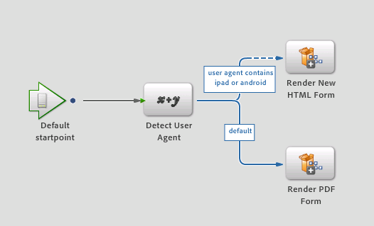

# 새로운 렌더링 및 전송 서비스{#new-render-and-submit-service}

## 소개 {#introduction}

워크벤치에서 작업을 정의할 때 특정 양식(XDP 또는 PDF 양식)을 `AssignTask` 지정합니다. 또한 작업 프로필을 통해 렌더링 및 제출 서비스 세트를 지정합니다.

XDP는 PDF 양식 또는 HTML 양식으로 렌더링할 수 있습니다. 새로운 기능에는 다음과 같은 기능이 포함됩니다.

* XDP 양식을 HTML로 렌더링 및 제출
* 데스크탑에서 XDP 양식을 PDF로 렌더링 및 제출하고 모바일 디바이스에서 HTML로 제출(예: iPad)

### 새로운 HTML Forms 서비스 {#new-html-forms-service}

새로운 HTML Forms 서비스는 Forms의 새로운 기능을 활용하여 XDP 양식의 HTML 렌더링을 지원합니다. 새 HTML Forms 서비스는 다음 메서드를 노출합니다.

```java
/*
 * Generates a URL (for the HTML Form) to be passed to client, given a TaskContext.
 * The output of this API is something like this - /lc/content/xfaforms/profiles/default.ws.html?ContentRoot=repository://Applications/MyApplication/MyFolder&template=MyForm.xdp
 * @param taskContext task context
 * @param profileName Forms servlet URL.
 * @return form URL string
 */
public String generateFormURL(TaskContext taskContext, String profileName);

/*
 * Render the XDP Form as HTML. Can be used directly for updating the runtimeMap in render.
 * It adds the following keys to the map -
 * hint:new html form = true
 * newHTMLFormURL = the URL returned after calling 'generateFormURL' API.
 * @param TaskContext taskContext
 * @param profileName Forms servlet URL.
 * @param runtimeMap runtime map<string,object> associated with form rendering.
 * return runtimeMap
 */
public Map<String, Object> renderHTMLForm (TaskContext taskContext, String profileName, Map<String,Object> runtimeMap);
```

모바일 양식 프로필에 대한 자세한 내용은 사용자 [정의 프로필](/help/forms/using/custom-profile.md)만들기를 참조하십시오.

## 새로운 HTML 양식 렌더링 및 제출 프로세스 {#new-html-form-render-amp-submit-processes}

모든 &#39;AssignTask&#39; 작업에 대해 양식과 함께 Render 및 Submit 프로세스를 지정합니다. 이러한 프로세스는 TaskManager `renderForm`및 API에서 `submitForm`사용자 정의 처리를 허용하도록 호출합니다. 새 HTML 양식에 대한 다음 프로세스의 의미 체계:

### 새 HTML 양식 렌더링 {#render-a-new-html-form}

모든 렌더링 프로세스와 마찬가지로 HTML을 렌더링하는 새로운 프로세스에는 다음과 같은 입출력 매개 변수가 있습니다.

입력 - `taskContext`

출력 - `runtimeMap`

출력 - `outFormDoc`

이 메서드는 NewHTMLFormsService의 `renderHTMLForm` API의 정확한 동작을 시뮬레이션합니다. 양식의 HTML `generateFormURL` 변환에 대한 URL을 가져오려면 API를 호출합니다. 그런 다음 runtimeMap을 다음 키 또는 값으로 채웁니다.

new html form = true

newHTMLFormURL = API를 호출한 후 반환되는 `generateFormURL` URL입니다.

### 새 HTML 양식 제출 {#submit-a-new-html-form}

새 HTML 양식을 제출하는 이 프로세스는 다음 입출력 매개 변수와 함께 작동합니다.

입력 - `taskContext`

출력 - `runtimeMap`

출력 - `outputDocument`

이 프로세스는 을 `outputDocument`읽어들인 `inputDocument`위치로 설정합니다 `taskContext`.

## 기본 렌더링 또는 제출 프로세스, 작업 프로필 {#default-render-or-submit-processes-and-action-profiles}

기본 렌더링 및 제출 서비스는 데스크탑에서 PDF를 렌더링할 수 있도록 지원하고 모바일 장치(iPad)에서 HTML을 렌더링할 수 있도록 지원합니다.

### 기본 렌더링 양식 {#default-render-form}

이 프로세스는 여러 플랫폼에서 XDP 양식을 매끄럽게 렌더링합니다. 이 프로세스는 사용자 에이전트를 에서 `taskContext`검색하고 데이터를 사용하여 프로세스를 호출하여 HTML 또는 PDF를 렌더링합니다.



### 기본 제출 양식 {#default-submit-form}

이 프로세스는 여러 플랫폼에서 XDP 양식을 원활하게 제출합니다. 사용자 에이전트를 검색하여 데이터를 `taskContext`사용하여 프로세스를 호출하여 HTML 또는 PDF를 제출합니다.


## 모바일 양식의 렌더링을 PDF에서 HTML로 전환 {#switch-the-rendering-of-mobile-forms-from-pdf-to-html}

브라우저가 Adobe Acrobat 및 Adobe Acrobat Reader용 플러그인을 포함하여 NPAPI 기반 플러그인에 대한 지원을 점차 철회하고 있습니다. 다음 단계를 통해 모바일 양식의 렌더링을 PDF에서 HTML로 변경할 수 있습니다.

1. Workbench에 유효한 사용자로 로그인합니다.
1. 파일 **> 애플리케이션** 가져오기를 **선택합니다**.

   애플리케이션 가져오기 대화 상자가 나타납니다.

1. 모바일 양식 렌더링을 변경할 애플리케이션을 선택하고 확인을 **클릭합니다**.
1. 렌더링을 변경할 프로세스를 엽니다.
1. 타깃팅된 시작 지점/작업을 열고 [프레젠테이션 및 데이터] 섹션으로 이동한 후 [작업 프로필 관리] **를 클릭합니다**.

   작업 프로필 관리 대화 상자가 나타납니다.
1. 기본 렌더링 프로필 구성을 PDF에서 HTML로 변경하고 확인을 **클릭합니다**.
1. 프로세스 확인
1. 다른 프로세스에 대한 렌더링을 변경하려면 단계를 반복합니다.
1. 변경한 프로세스와 관련된 애플리케이션을 배포합니다.

### 기본 작업 프로필 {#default-action-profile}

기본 작업 프로필은 XDP 양식을 PDF로 렌더링했습니다. 이제 이 동작이 기본 렌더링 양식과 기본 제출 양식 프로세스를 사용하도록 변경되었습니다.

작업 프로필에 대한 몇 가지 FAQ는 다음과 같습니다.

 20 **어떤 렌더링/제출 프로세스를 즉시 사용할 수 있습니까?**

* 렌더링 안내서(안내선 사용 안 함)
* 렌더링 양식 안내서
* PDF 양식 렌더링
* HTML 양식 렌더링
* 새 HTML 양식 렌더링(신규)
* 기본 렌더링 양식(신규)

등가 제출 프로세스

**즉시 사용 가능한 작업 프로필은 무엇입니까?**

XDP 양식의 경우:

* 기본값(새로운 &#39;기본 렌더링/제출&#39; 프로세스를 사용하여 렌더링/제출)

**프로세스 디자이너가 양식을 장치의 HTML과 데스크탑의 PDF로 렌더링할 수 있도록 하려면 어떻게 해야 합니까?**

아무것도. 기본 작업 프로필은 자동으로 선택되며 렌더링 모드도 자동으로 처리됩니다.

**데스크탑에서 HTML로 양식을 렌더링하려면 어떻게 해야 합니까?**

사용자는 기본 프로필에 대한 HTML 라디오 단추를 선택해야 합니다.

**기본 작업 프로필 동작 변경에 대한 업그레이드 영향이 있습니까?**

예. 기본 작업 프로필과 관련된 이전 렌더링 및 제출 서비스가 다르므로 기존 양식의 사용자 정의로 처리됩니다. 기본값 복원을 **클릭하면**&#x200B;기본 렌더링 및 제출 서비스가 대신 설정됩니다.

기존 렌더링 또는 제출 PDF 양식 서비스를 수정하거나 사용자 정의 서비스(예: custom1)를 만든 경우 이제 HTML 변환에 동일한 기능을 사용하려는 경우 새로운 렌더링 또는 전송 서비스(예: custom2)를 복제하고 유사한 사용자 지정을 적용해야 합니다. 이제 XDP에 대한 작업 프로필을 수정하여 렌더링이나 제출을 위한 custom1 대신 custom2 서비스를 시작합니다.

양식을 장치의 HTML과 데스크탑의 PDF로 렌더링하려면 프로세스 디자이너가 수행해야 하는 작업은 무엇입니까?
양식을 장치의 HTML과 데스크탑의 PDF로 렌더링하려면 프로세스 디자이너가 수행해야 하는 작업은 무엇입니까?
