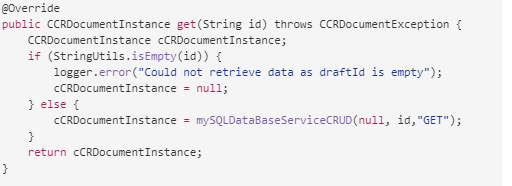

# 에이전트 UI를 사용하여 대화형 통신 준비 및 보내기 {#prepare-and-send-interactive-communication-using-the-agent-ui}

에이전트 UI를 사용하여 에이전트가 대화형 커뮤니케이션을 준비하고 사후 프로세스로 전송할 수 있습니다. 에이전트는 필요한 수정 사항을 가능한 한 수행하고 전자 메일 또는 인쇄와 같은 사후 프로세스에 대화형 커뮤니케이션을 제출합니다.

## 개요 {#overview}

대화형 커뮤니케이션이 생성되면 에이전트는 에이전트 UI에서 대화형 커뮤니케이션을 열고 데이터를 입력하고 콘텐츠 및 첨부 파일을 관리하여 수신자별 복사본을 준비할 수 있습니다. 마지막으로, 에이전트는 대화형 커뮤니케이션을 사후 프로세스에 제출할 수 있습니다.

에이전트 UI를 사용하여 대화형 커뮤니케이션을 준비하는 동안 에이전트는 Agent UI에서 대화형 커뮤니케이션의 다음 측면을 관리한 후 사후 프로세스에 제출합니다.

* **데이터**: 에이전트 UI의 데이터 탭에는 대화형 커뮤니케이션에서 에이전트 편집 가능한 변수와 잠금 해제된 양식 데이터 모델 속성이 표시됩니다. 이러한 변수/속성은 대화형 커뮤니케이션에 포함된 문서 조각을 편집하거나 만드는 동안 만들어집니다. 데이터 탭에는 XDP/인쇄 채널 템플릿에 빌드된 모든 필드가 포함되어 있습니다. 에이전트가 편집할 수 있는 Interactive Communication에 변수, 양식 데이터 모델 속성 또는 필드가 있는 경우에만 데이터 탭이 나타납니다.
* **컨텐츠**: 컨텐츠 탭에서 에이전트는 대화형 커뮤니케이션의 문서 조각 및 컨텐츠 변수와 같은 컨텐츠를 관리합니다. 에이전트는 문서 조각의 속성에서 대화형 커뮤니케이션을 만드는 동안 문서 조각에서 허용되는 대로 변경할 수 있습니다. 가능하면 에이전트는 문서 조각을 재정렬하거나 추가/제거하고 페이지 나누기를 추가할 수도 있습니다.
* **첨부 파일**: Interactive Communication에 첨부 파일이 있거나 에이전트가 라이브러리 액세스 권한이 있는 경우에만 에이전트 UI에 첨부 파일 탭이 나타납니다. 에이전트가 첨부 파일을 변경하거나 편집할 수 없을 수도 있습니다.

## 에이전트 UI를 사용하여 대화형 통신 준비 {#prepare-interactive-communication-using-the-agent-ui}

1. **[!UICONTROL Forms]** > **[!UICONTROL Forms 및 문서]**&#x200B;를 선택합니다.
1. 적절한 대화형 커뮤니케이션을 선택하고 **[!UICONTROL 에이전트 UI 열기]**&#x200B;를 누릅니다.

   >[!NOTE]
   >
   >에이전트 UI는 선택한 대화형 커뮤니케이션에 인쇄 채널이 있는 경우에만 작동합니다.

   

   Interactive Communication의 컨텐츠 및 속성을 기반으로 다음 세 개의 탭과 함께 에이전트 UI가 나타납니다. 데이터, 컨텐츠 및 첨부 파일.

   

   데이터 입력, 컨텐츠 관리 및 첨부 파일 관리를 계속 진행합니다.

### 데이터 입력 {#enter-data}

1. 데이터 탭에서 필요에 따라 변수, 양식 데이터 모델 속성 및 인쇄 템플릿(XDP) 필드에 데이터를 입력합니다. 별표(&amp;ast;)로 표시된 모든 필수 필드를 채워 **Submit** 단추를 활성화합니다.

   대화형 통신 미리 보기에서 데이터 필드 값을 탭하여 데이터 탭에서 해당 데이터 필드를 강조 표시하거나 그 반대의 경우도 마찬가지입니다.

### 컨텐츠 관리 {#manage-content}

콘텐츠 탭에서 대화형 커뮤니케이션에서 문서 조각 및 콘텐츠 변수와 같은 콘텐츠를 관리합니다.

1. **[!UICONTROL 컨텐츠]**&#x200B;를 선택합니다. 대화형 커뮤니케이션의 콘텐츠 탭이 나타납니다.

   

1. 필요에 따라 컨텐츠 탭에서 문서 조각을 편집합니다. 컨텐츠 계층 구조에서 관련 조각에 초점을 맞추기 위해 Interactive Communication 미리 보기에서 관련 라인 또는 단락을 탭하거나 컨텐츠 계층 구조에서 직접 조각을 탭할 수 있습니다.

   예를 들어, 아래 그래픽의 미리 보기에서 &quot;지금 결제...&quot; 라인이 있는 문서 조각이 선택되고 컨텐츠 탭에서 동일한 문서 조각이 선택되었습니다.

   

   컨텐츠 또는 데이터 탭의 미리 보기 왼쪽 상단에 있는 컨텐츠에서 선택한 모듈 강조 표시( )를 탭하여 미리 보기에서 관련 텍스트, 단락 또는 데이터 필드를 탭/선택하면 문서 조각으로 이동하는 기능을 비활성화하거나 활성화할 수 있습니다.

   대화형 커뮤니케이션을 만드는 동안 에이전트가 편집할 수 있는 조각에는 선택한 컨텐츠 편집( ) 아이콘이 있습니다. 선택한 컨텐츠 편집 아이콘을 탭하여 편집 모드에서 조각을 실행하고 변경합니다. 텍스트 서식 지정 및 관리에 다음 옵션을 사용합니다.

   * [서식 옵션](#formattingtext)

      * [다른 응용 프로그램에서 서식이 지정된 텍스트를 복사하여 붙여넣습니다](#pasteformattedtext)
      * [텍스트 부분 강조 표시](#highlightemphasize)
   * [특수 문자](#specialcharacters)
   * [키보드 단축키](/help/forms/using/keyboard-shortcuts.md)

   에이전트 사용자 인터페이스의 다양한 문서 조각에 사용할 수 있는 작업에 대한 자세한 내용은 에이전트 사용자 인터페이스](#actionsagentui)에서 사용할 수 있는 작업 및 정보를 참조하십시오.[

1. Interactive Communication의 인쇄 출력에 페이지 나누기를 추가하려면 페이지 나누기를 삽입할 위치에 커서를 놓고 다음 페이지 나누기 또는 다음 페이지 나누기( )를 선택합니다.

   대화형 커뮤니케이션에 명시적 페이지 브레이크 자리 표시자가 삽입됩니다. 명시적 페이지 나누기가 대화형 커뮤니케이션에 미치는 영향을 보려면 인쇄 미리 보기를 참조하십시오.

   

   Interactive Communication의 첨부 파일 관리를 계속합니다.

### 첨부 파일 관리 {#manage-attachments}

1. **[!UICONTROL 첨부 파일]**&#x200B;을 선택합니다. Agent UI는 Interactive Communication을 생성하는 동안 설정된 대로 사용 가능한 첨부 파일을 표시합니다.

   보기 아이콘을 탭하여 Interactive Communication과 함께 첨부 파일을 제출하지 않도록 선택할 수 있으며, 첨부 파일에서 십자를 탭하여 Interactive Communication에서 해당 첨부 파일을 삭제할 수 있습니다(에이전트가 첨부 파일을 삭제하거나 숨길 수 있는 경우). 대화형 커뮤니케이션을 만드는 동안 필수로 지정된 첨부 파일의 경우 보기 및 삭제 아이콘이 비활성화됩니다.

   

1. 라이브러리 액세스( ) 아이콘을 탭하여 콘텐츠 라이브러리에 액세스하여 DAM 자산을 첨부 파일로 삽입합니다.

   >[!NOTE]
   >
   >라이브러리 액세스 아이콘은 대화형 커뮤니케이션을 만드는 동안 라이브러리 액세스가 활성화된 경우에만 사용할 수 있습니다(인쇄 채널의 문서 컨테이너 속성에서).

1. Interactive Communication을 생성하는 동안 첨부 파일의 순서가 잠겨 있지 않은 경우 첨부 파일을 선택하고 아래쪽 및 위쪽 화살표를 탭하여 첨부 파일의 순서를 변경할 수 있습니다.
1. Web Preview 및 Print Preview를 사용하여 두 출력이 요구 사항에 해당하는지 확인합니다.

   미리 보기가 만족스러우면 **[!UICONTROL 제출]**&#x200B;을 눌러 대화형 커뮤니케이션을 게시물 프로세스에 제출/전송합니다. 또는 변경을 수행하려면 미리 보기를 종료하여 변경 사항으로 돌아갑니다.

## 텍스트 서식 지정 {#formattingtext}

에이전트 UI에서 텍스트 조각을 편집하는 동안 도구 모음은 사용자가 선택한 편집 유형에 따라 변경됩니다. 글꼴, 단락 또는 목록:

 

글꼴 도구 모음


단락 도구 모음


목록 도구 모음

### 텍스트 부분 강조/강조 표시 {#highlightemphasize}

편집 가능한 조각에서 텍스트의 일부를 강조 표시하려면 텍스트를 선택하고 강조 색상 을 탭합니다.


### 서식이 지정된 텍스트 붙여넣기 {#pasteformattedtext}


### 텍스트에 특수 문자 삽입 {#specialcharacters}

에이전트 UI가 210개의 특수 문자를 지원합니다. 관리자는 [사용자 지정](/help/forms/using/custom-special-characters.md)을 통해 추가/사용자 지정 특수 문자에 대한 지원을 추가할 수 있습니다.

#### 첨부 파일 게재 {#attachmentdelivery}

* 서버측 API를 대화형 또는 비대화형 PDF로 사용하여 대화형 커뮤니케이션을 렌더링하면 렌더링된 PDF에 첨부 파일이 PDF 첨부 파일로 포함됩니다.
* Interactive Communication과 연결된 사후 프로세스가 에이전트 UI를 사용하여 제출 의 일부로 로드되면 첨부 파일이 AttachmentDocs 매개 변수의 List&lt;com.adobe.idp.Document>로 전달됩니다.
* 전자 메일 및 인쇄와 같은 게재 메커니즘 워크플로우도 PDF 버전의 Interactive Communication과 함께 첨부 파일을 제공합니다.

## 에이전트 사용자 인터페이스에서 사용할 수 있는 작업 및 정보 {#actionsagentui}

### 문서 조각 {#document-fragments}


* **위쪽/아래쪽 화살표**: 대화형 커뮤니케이션에서 문서 조각을 위 또는 아래로 이동하는 화살표
* **삭제**: 허용되는 경우 Interactive Communication에서 문서 조각을 삭제합니다.
* **이전 페이지 브레이크** (대상 영역의 하위 조각에 적용 가능): 문서 조각 앞에 페이지 나누기를 삽입합니다.
* **들여쓰기**: 문서 조각의 들여쓰기를 늘리거나 줄입니다.
* **다음 이후 페이지 나누기** (대상 영역의 하위 조각에 적용 가능): 문서 조각 뒤에 페이지 나누기를 삽입합니다.


* 편집(텍스트 조각만): 텍스트 문서 조각을 편집할 리치 텍스트 편집기를 엽니다. 자세한 내용은 [텍스트 형식 지정](#formattingtext)을 참조하십시오.

* 선택(눈 모양 아이콘): 대화형 커뮤니케이션에서 문서 조각을 포함\제외합니다.
* 입력되지 않은 값(정보): 문서 조각에서 채워지지 않은 변수의 수를 나타냅니다.

### 문서 조각 나열 {#list-document-fragments}


* 빈 행 삽입: 새 빈 행을 삽입합니다.
* 선택(눈 모양 아이콘): 대화형 커뮤니케이션에서 문서 조각을 포함\제외합니다.
* 글머리 기호/번호 건너뛰기: 목록 문서 조각에서 글머리 기호/번호 매기기를 건너뛸 수 있도록 설정합니다.
* 입력되지 않은 값(정보): 문서 조각에서 채워지지 않은 변수의 수를 나타냅니다.

## 대화형 커뮤니케이션을 초안으로 저장 {#save-as-draft}

에이전트 UI를 사용하여 각 대화형 커뮤니케이션에 대해 하나 이상의 초안을 저장하고 나중에 초안을 검색하여 계속 작업할 수 있습니다. 각 초안의 다른 이름을 지정하여 해당 초안을 식별할 수 있습니다.

Adobe은 대화형 커뮤니케이션을 초안으로 성공적으로 저장하려면 이러한 지침을 순서대로 실행하는 것이 좋습니다.

### 초안으로 저장 기능 활성화 {#before-save-as-draft}

초안으로 저장 기능은 기본적으로 활성화되지 않습니다. 다음 단계를 수행하여 기능을 활성화합니다.

1. [ccrDocumentInstance](https://helpx.adobe.com/experience-manager/6-5/forms/javadocs/com/adobe/fd/ccm/ccr/ccrDocumentInstance/api/services/CCRDocumentInstanceService.html) SPI(Service Provider Interface)를 구현합니다.

   SPI를 사용하면 대화형 커뮤니케이션의 초안 버전을 초안 ID를 고유 식별자로 사용하여 데이터베이스에 저장할 수 있습니다. 이러한 지침은 Maven 프로젝트를 사용하여 OSGi 번들을 빌드하는 방법에 대한 이전 지식이 있다고 가정합니다.

   샘플 SPI 구현에 대해서는 [샘플 ccrDocumentInstance SPI 구현](#sample-ccrDocumentInstance-spi)을 참조하십시오.
1. `http://<hostname>:<port>/ system/console/bundles` 을 열고 **[!UICONTROL Install/Update]** 를 탭하여 OSGi 번들을 업로드합니다. 업로드된 패키지의 상태가 **Active**&#x200B;로 표시되는지 확인합니다. 패키지 상태가 **Active**&#x200B;로 표시되지 않으면 서버를 다시 시작합니다.
1. 이동 `https://'[server]:[port]'/system/console/configMgr`.
1. **[!UICONTROL 서신 구성 만들기]**&#x200B;를 누릅니다.
1. **[!UICONTROL CCRDocumentInstanceService]**&#x200B;를 선택하고 **[!UICONTROL Save]**&#x200B;를 탭합니다.

### 대화형 커뮤니케이션을 초안으로 저장 {#save-as-draft-agent-ui}

대화형 커뮤니케이션을 초안으로 저장하려면 다음 단계를 수행합니다.

1. Forms Manager에서 대화형 커뮤니케이션을 선택하고 **[!UICONTROL 에이전트 UI 열기]**&#x200B;를 누릅니다.

1. 에이전트 UI에서 적절한 변경을 수행하고 **[!UICONTROL 초안으로 저장]**&#x200B;을 누릅니다.

1. **[!UICONTROL 이름]** 필드에 초안의 이름을 지정하고 **[!UICONTROL 완료]**&#x200B;를 누릅니다.

대화형 커뮤니케이션을 초안으로 저장하면 **[!UICONTROL 변경 내용 저장]**&#x200B;을 눌러 초안의 추가 변경 사항을 저장합니다.

### 대화형 커뮤니케이션의 초안 검색 {#retrieve-draft}

대화형 커뮤니케이션을 초안으로 저장한 후 이를 검색하여 계속 작업할 수 있습니다. 다음을 사용하여 대화형 커뮤니케이션을 검색합니다.

`https://server:port/aem/forms/createcorrespondence.hmtl?draftid=[draftid]`

[] draft는 Interactive Communication을 초안으로 저장한 후 생성된 초안 버전에 대한 고유 식별자를 나타냅니다.

### 샘플 ccrDocumentInstance SPI 구현 {#sample-ccrDocumentInstance-spi}

대화형 커뮤니케이션을 초안으로 저장하려면 `ccrDocumentInstance` SPI를 구현합니다. 다음은 `ccrDocumentInstance` SPI의 샘플 구현입니다.

```javascript
package Implementation;

import com.adobe.fd.ccm.ccr.ccrDocumentInstance.api.exception.CCRDocumentException;
import com.adobe.fd.ccm.ccr.ccrDocumentInstance.api.model.CCRDocumentInstance;
import com.adobe.fd.ccm.ccr.ccrDocumentInstance.api.services.CCRDocumentInstanceService;
import org.apache.commons.lang3.StringUtils;
import org.osgi.service.component.annotations.Component;
import org.slf4j.Logger;
import org.slf4j.LoggerFactory;

import java.util.*;


@Component(service = CCRDocumentInstanceService.class, immediate = true)
public class CCRDraftService implements CCRDocumentInstanceService {

    private static final Logger logger = LoggerFactory.getLogger(CCRDraftService.class);

    private HashMap<String, Object> draftDataMap = new HashMap<>();

    @Override
    public String save(CCRDocumentInstance ccrDocumentInstance) throws CCRDocumentException {
        String documentInstanceName = ccrDocumentInstance.getName();
        if (StringUtils.isNotEmpty(documentInstanceName)) {
            logger.info("Saving ccrData with name : {}", ccrDocumentInstance.getName());
            if (!CCRDocumentInstance.Status.SUBMIT.equals(ccrDocumentInstance.getStatus())) {
                ccrDocumentInstance = mySQLDataBaseServiceCRUD(ccrDocumentInstance,null, "SAVE");
            }
        } else {
            logger.error("Could not save data as draft name is empty");
        }
        return ccrDocumentInstance.getId();
    }

    @Override
    public void update(CCRDocumentInstance ccrDocumentInstance) throws CCRDocumentException {
        String documentInstanceName = ccrDocumentInstance.getName();
        if (StringUtils.isNotEmpty(documentInstanceName)) {
            logger.info("Saving ccrData with name : {}", documentInstanceName);
            mySQLDataBaseServiceCRUD(ccrDocumentInstance, ccrDocumentInstance.getId(), "UPDATE");
        } else {
            logger.error("Could not save data as draft Name is empty");
        }
    }

    @Override
    public CCRDocumentInstance get(String id) throws CCRDocumentException {
        CCRDocumentInstance cCRDocumentInstance;
        if (StringUtils.isEmpty(id)) {
            logger.error("Could not retrieve data as draftId is empty");
            cCRDocumentInstance = null;
        } else {
            cCRDocumentInstance = mySQLDataBaseServiceCRUD(null, id,"GET");
        }
        return cCRDocumentInstance;
    }

    @Override
    public List<CCRDocumentInstance> getAll(String userId, Date creationTime, Date updateTime,
                                            Map<String, Object> optionsParams) throws CCRDocumentException {
        List<CCRDocumentInstance> ccrDocumentInstancesList = new ArrayList<>();

        HashMap<String, Object> allSavedDraft = mySQLGetALLData();
        for (String key : allSavedDraft.keySet()) {
            ccrDocumentInstancesList.add((CCRDocumentInstance) allSavedDraft.get(key));
        }
        return ccrDocumentInstancesList;
    }

    //The APIs call the service in the database using the following section.
    private CCRDocumentInstance mySQLDataBaseServiceCRUD(CCRDocumentInstance ccrDocumentInstance,String draftId, String method){
        if(method.equals("SAVE")){

            String autoGenerateId = draftDataMap.size() + 1 +"";
            ccrDocumentInstance.setId(autoGenerateId);
            draftDataMap.put(autoGenerateId, ccrDocumentInstance);
            return ccrDocumentInstance;

        }else if (method.equals("UPDATE")){

            draftDataMap.put(ccrDocumentInstance.getId(), ccrDocumentInstance);
            return ccrDocumentInstance;

        }else if(method.equals("GET")){

            return (CCRDocumentInstance) draftDataMap.get(draftId);

        }
        return null;
    }

    private HashMap<String, Object> mySQLGetALLData(){
        return draftDataMap;
    }
}
```

`save`, `update`, `get` 및 `getAll` 작업은 데이터베이스 서비스를 호출하여 대화형 커뮤니케이션을 초안으로 저장하고, 대화형 커뮤니케이션을 업데이트하고, 데이터베이스에서 데이터를 검색하고, 데이터베이스에서 사용 가능한 모든 대화형 커뮤니케이션에 대한 데이터를 검색합니다. 이 샘플은 `mySQLDataBaseServiceCRUD`을 데이터베이스 서비스의 이름으로 사용합니다.

다음 표에서는 샘플 `ccrDocumentInstance` SPI 구현에 대해 설명합니다. 샘플 구현에서 `save`, `update`, `get` 및 `getAll` 작업이 데이터베이스 서비스를 호출하는 방법을 보여 줍니다.

<table> 
 <tbody>
 <tr>
  <td><p><strong>작업</strong></p></td>
  <td><p><strong>데이터베이스 서비스 예</strong></p></td> 
   </tr>
  <tr>
   <td><p>대화형 커뮤니케이션용 초안을 만들거나 직접 제출할 수 있습니다. 저장 작업을 위한 API는 대화형 커뮤니케이션이 초안으로 제출되고 초안 이름이 포함되어 있는지 확인합니다. 그러면 API가 Save as 입력 방법으로 mySQLDataBaseServiceCRUD 서비스를 호출합니다.</p></br></br>[#$sd1_sf1_dp9]</td>
   <td><p>mySQLDataBaseServiceCRUD 서비스는 입력 방법으로 저장을 확인하고 자동 생성된 초안 ID를 생성하여 AEM으로 반환합니다. 초안 ID를 생성하는 로직은 데이터베이스에 따라 다를 수 있습니다.</p></br></br>[#$sd1_sf1_dp13]</td>
   </tr>
  <tr>
   <td><p>업데이트 작업에 대한 API는 대화형 통신 초안의 상태를 검색하고 대화형 커뮤니케이션에 초안 이름이 포함되어 있는지 확인합니다. API는 mySQLDataBaseServiceCRUD 서비스를 호출하여 데이터베이스에서 해당 상태를 업데이트합니다.</p></br></br>[#$sd1_sf1_dp17]</td>
   <td><p>mySQLDataBaseServiceCRUD 서비스는 Update를 입력 방법으로 확인하고 Interactive Communication 초안 상태를 데이터베이스에 저장합니다.</br></p></td>
   </tr>
   <tr>
   <td><p>가져오기 작업을 위한 API는 대화형 커뮤니케이션에 초안 ID가 포함되어 있는지 확인합니다. 그런 다음 API가 Get을 사용하여 mySQLDataBaseServiceCRUD 서비스를 입력 방법으로 호출하여 대화형 커뮤니케이션에 대한 데이터를 검색합니다.</br></p></td>
   <td><p>mySQLDataBaseServiceCRUD 서비스는 Get을 입력 방법으로 확인하고 초안 ID를 기반으로 대화형 커뮤니케이션에 대한 데이터를 검색합니다.</p></br></br>[#$sd1_sf1_dp29]</td>
   </tr>
   <tr>
   <td><p>getAll 작업에 대한 API는 데이터베이스에 저장된 모든 Interactive Communications에 대한 데이터를 검색하도록 mySQLGetALLData 서비스를 호출합니다.</br></p></td>
   <td><p>mySQLGetALLData 서비스는 데이터베이스에 저장된 모든 대화형 커뮤니케이션에 대한 데이터를 검색합니다.</p></br></br>[#$sd1_sf1_dp37]</td>
   </tr>
  </tbody>
</table>

다음은 구현의 일부인 `pom.xml` 파일의 예입니다.

```xml
<?xml version="1.0" encoding="UTF-8"?>
<project xmlns="http://maven.apache.org/POM/4.0.0"
         xmlns:xsi="http://www.w3.org/2001/XMLSchema-instance"
         xsi:schemaLocation="http://maven.apache.org/POM/4.0.0 http://maven.apache.org/xsd/maven-4.0.0.xsd">
    <modelVersion>4.0.0</modelVersion>

    <groupId>com.adobe.livecycle</groupId>
    <artifactId>draft-sample</artifactId>
    <version>2.0.0-SNAPSHOT</version>

    <name>Interact</name>
    <packaging>bundle</packaging>

    <dependencies>
        <dependency>
            <groupId>com.adobe.aemfd</groupId>
            <artifactId>aemfd-client-sdk</artifactId>
            <version>6.0.160</version>
        </dependency>
    </dependencies>


    <!-- ====================================================================== -->
    <!-- B U I L D D E F I N I T I O N -->
    <!-- ====================================================================== -->
    <build>
        <plugins>
            <plugin>
                <groupId>org.apache.felix</groupId>
                <artifactId>maven-bundle-plugin</artifactId>
                <version>3.3.0</version>
                <extensions>true</extensions>
                <executions>
                    <!--Configure extra execution of 'manifest' in process-classes phase to make sure SCR metadata is generated before unit test runs-->
                    <execution>
                        <id>scr-metadata</id>
                        <goals>
                            <goal>manifest</goal>
                        </goals>
                    </execution>
                </executions>
                <configuration>
                    <exportScr>true</exportScr>
                    <instructions>
                        <!-- Enable processing of OSGI DS component annotations -->
                        <_dsannotations>*</_dsannotations>
                        <!-- Enable processing of OSGI metatype annotations -->
                        <_metatypeannotations>*</_metatypeannotations>
                        <Bundle-SymbolicName>${project.groupId}-${project.artifactId}</Bundle-SymbolicName>
                    </instructions>
                </configuration>
            </plugin>
            <plugin>
                <groupId>org.apache.maven.plugins</groupId>
                <artifactId>maven-surefire-plugin</artifactId>
            </plugin>
            <plugin>
                <groupId>org.apache.maven.plugins</groupId>
                <artifactId>maven-compiler-plugin</artifactId>
                <configuration>
                    <source>8</source>
                    <target>8</target>
                </configuration>
            </plugin>
        </plugins>
    </build>
    <profiles>
        <profile>
            <id>autoInstall</id>
            <build>
                <plugins>
                    <plugin>
                        <groupId>org.apache.sling</groupId>
                        <artifactId>maven-sling-plugin</artifactId>
                        <executions>
                            <execution>
                                <id>install-bundle</id>
                                <phase>install</phase>
                                <goals>
                                    <goal>install</goal>
                                </goals>
                            </execution>
                        </executions>
                    </plugin>
                </plugins>
            </build>
        </profile>
    </profiles>

</project>
```

>[!NOTE]
>
>`pom.xml` 파일에서 `aemfd-client-sdk` 종속성을 6.0.160으로 업데이트해야 합니다.
