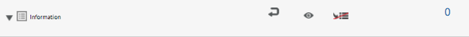

# 에이전트 UI {#prepare-and-send-interactive-communication-using-the-agent-ui}를 사용하여 대화형 통신 준비 및 보내기

에이전트 UI를 사용하면 에이전트가 대화형 통신을 준비하고 게시물 프로세스로 전송할 수 있습니다. 에이전트는 허용된 대로 필요한 수정 사항을 만들고 이메일 또는 인쇄와 같은 게시 프로세스에 대화형 통신을 제출합니다.

## 개요 {#overview}

대화형 통신이 만들어지면 에이전트는 에이전트 UI에서 대화형 통신을 열고 데이터를 입력하고 콘텐트 및 첨부 파일을 관리하여 수신자별 사본을 준비할 수 있습니다. 마지막으로, 에이전트는 대화형 통신을 게시물 프로세스에 제출할 수 있습니다.

에이전트 UI를 사용하여 대화형 통신을 준비하는 동안 에이전트는 에이전트 UI에서 다음 대화형 통신 측면을 관리하고 게시물 프로세스에 제출합니다.

* **데이터**:에이전트 UI의 [데이터] 탭에는 에이전트가 편집 가능한 변수와 잠금 해제된 양식 데이터 모델 속성이 대화형 통신에 표시됩니다. 이러한 변수/속성은 대화형 통신에 포함된 문서 조각을 편집하거나 만드는 동안 만들어집니다. 데이터 탭에는 XDP/인쇄 채널 템플릿에 내장된 모든 필드도 포함되어 있습니다. [데이터] 탭은 에이전트가 편집할 수 있는 [대화형 통신]에 변수, 양식 데이터 모델 속성 또는 필드가 있는 경우에만 나타납니다.
* **컨텐츠**:[콘텐트] 탭에서 에이전트는 대화형 통신에서 문서 조각 및 컨텐츠 변수와 같은 내용을 관리합니다. 에이전트는 문서 조각의 속성에서 대화형 통신을 생성하는 동안 문서 조각에서 허용된 대로 변경할 수 있습니다. 또한 에이전트는 가능한 경우 문서 단편을 재정렬하고, 추가/제거하고 페이지 나누기를 추가할 수 있습니다.
* **첨부 파일**:[첨부 파일] 탭은 대화형 통신에 첨부 파일이 있거나 에이전트에 라이브러리 액세스 권한이 있는 경우에만 에이전트 UI에 나타납니다. 에이전트는 첨부 파일을 변경하거나 편집할 수 없거나 허용되지 않을 수 있습니다.

## 에이전트 UI {#prepare-interactive-communication-using-the-agent-ui}을(를) 사용하여 대화형 통신 준비

1. **[!UICONTROL Forms]** > **[!UICONTROL Forms &amp; 문서]**&#x200B;를 선택합니다.
1. 적절한 대화형 통신을 선택하고 **[!UICONTROL 에이전트 UI 열기]**&#x200B;를 누릅니다.

   >[!NOTE]
   >
   >에이전트 UI는 선택한 대화형 통신에 인쇄 채널이 있는 경우에만 작동합니다.

   

   Interactive Communication의 컨텐츠 및 속성을 기반으로 에이전트 UI는 다음 3개의 탭을 사용하여 나타납니다.데이터, 컨텐트 및 첨부 파일을 참조하십시오.

   

   데이터 입력, 컨텐츠 관리 및 첨부 파일 관리를 계속합니다.

### 데이터 입력 {#enter-data}

1. 데이터 탭에서 필요에 따라 변수, 양식 데이터 모델 속성 및 인쇄 템플릿(XDP) 필드에 데이터를 입력합니다. 별표(&amp;ast;)가 표시된 모든 필수 필드를 채워 **제출** 단추를 활성화합니다.

   대화형 통신 미리 보기에서 데이터 필드 값을 눌러 [데이터] 탭에서 해당 데이터 필드를 강조 표시하거나 그 반대로 합니다.

### 컨텐츠 관리 {#manage-content}

컨텐츠 탭에서 대화형 커뮤니케이션의 문서 조각 및 컨텐츠 변수와 같은 컨텐츠를 관리합니다.

1. **[!UICONTROL 컨텐트]**&#x200B;를 선택합니다. [대화형 통신]의 [콘텐트] 탭이 나타납니다.

   

1. 필요에 따라 [콘텐트] 탭에서 문서 조각을 편집합니다. 컨텐츠 계층 구조의 관련 단편에 초점을 맞추기 위해 Interactive Communication 미리 보기에서 관련 라인 또는 단락을 탭하거나 컨텐츠 계층 구조에서 직접 조각을 탭할 수 있습니다.

   예를 들어 &quot;지금 결제를 온라인으로 만들기..&quot;라는 라인이 있는 문서 조각은 아래 그래픽의 미리 보기에서 선택되고 컨텐츠 탭에서 동일한 문서 조각이 선택됩니다.

   

   컨텐츠 또는 데이터 탭에서 미리 보기의 왼쪽 상단에 있는 컨텐츠 내 선택한 모듈 강조 표시( )를 탭하여 미리 보기에서 관련 텍스트, 단락 또는 데이터 필드를 탭/선택한 경우 문서 조각으로 이동할 수 있는 기능을 비활성화하거나 활성화할 수 있습니다.

   대화형 통신을 만드는 동안 에이전트가 편집할 수 있도록 허용된 조각에는 [선택한 내용 편집]( ) 아이콘이 있습니다. 선택한 컨텐츠 편집 아이콘을 눌러 편집 모드에서 조각을 실행하고 변경합니다. 텍스트 서식 지정 및 관리에 다음 옵션을 사용합니다.

   * [서식 옵션](#formattingtext)

      * [다른 응용 프로그램에서 서식이 지정된 텍스트 복사](#pasteformattedtext)
      * [텍스트 부분 강조 표시](#highlightemphasize)
   * [특수 문자](#specialcharacters)
   * [키보드 단축키](/help/forms/using/keyboard-shortcuts.md)

   에이전트 사용자 인터페이스의 다양한 문서 조각에 사용할 수 있는 작업에 대한 자세한 내용은 [에이전트 사용자 인터페이스](#actionsagentui)에서 사용할 수 있는 작업 및 정보를 참조하십시오.

1. 대화형 통신 인쇄 출력에 페이지 나누기를 추가하려면 페이지 나누기를 삽입할 위치에 커서를 놓고 [페이지 나누기 이전 또는 다음 페이지 나누기]를 선택합니다( ).

   명확한 페이지 나누기 자리 표시자가 대화형 통신에 삽입됩니다. 명확한 페이지 나누기가 대화형 통신에 미치는 영향을 보려면 인쇄 미리 보기를 참조하십시오.

   

   대화형 통신 첨부 파일을 계속 관리합니다.

### 첨부 파일 관리 {#manage-attachments}

1. **[!UICONTROL 첨부 파일]**&#x200B;을 선택합니다. 에이전트 UI는 대화형 통신을 만드는 동안 설정된 대로 사용 가능한 첨부 파일을 표시합니다.

   보기 아이콘을 눌러 Interactive Communication과 함께 첨부를 제출하지 않도록 선택할 수 있으며, 첨부의 십자가를 눌러 Interactive Communication에서 첨부를 삭제(에이전트가 첨부를 삭제하거나 숨길 수 있는 경우)할 수 있습니다. 대화형 통신을 만드는 동안 필수로 지정된 첨부 파일의 경우 보기 및 삭제 아이콘이 비활성화됩니다.

   

1. 라이브러리 액세스( ) 아이콘을 눌러 콘텐트 라이브러리에 액세스하여 DAM 자산을 첨부 파일로 삽입합니다.

   >[!NOTE]
   >
   >라이브러리 액세스 아이콘은 대화형 통신을 만드는 동안 라이브러리 액세스가 활성화된 경우에만 사용할 수 있습니다(인쇄 채널의 문서 컨테이너 속성에 있음).

1. 대화형 통신을 생성하는 동안 첨부 파일의 순서가 잠겨 있지 않은 경우 첨부 파일을 선택하고 아래쪽 및 위쪽 화살표를 눌러 첨부 파일의 순서를 변경할 수 있습니다.
1. 웹 미리 보기 및 인쇄 미리 보기를 사용하여 두 출력이 요구 사항에 따라 해당하는지 확인합니다.

   원하는 미리 보기를 찾으면 **[!UICONTROL 제출]**&#x200B;을 눌러 대화형 통신을 게시물 프로세스로 제출/전송합니다. 또는 변경 작업을 수행하려면 미리 보기를 종료하고 변경 작업으로 돌아갑니다.

## 텍스트 서식 지정 {#formattingtext}

에이전트 UI에서 텍스트 조각을 편집하는 동안 도구 모음은 선택한 편집 유형에 따라 달라집니다.글꼴, 단락 또는 목록:

 

글꼴 툴바


단락 도구 모음


목록 도구 모음

### 텍스트 {#highlightemphasize} 부분 강조/강조

편집 가능한 조각의 텍스트 부분을 강조\강조하려면 텍스트를 선택하고 강조 색상을 누릅니다.


### 서식이 지정된 텍스트 {#pasteformattedtext} 붙여넣기


### 텍스트 {#specialcharacters}에 특수 문자 삽입

에이전트 UI는 210개의 특수 문자를 지원합니다. 관리자는 [사용자 지정을 통해 추가/사용자 지정 특수 문자 지원을 추가할 수 있습니다](/help/forms/using/custom-special-characters.md).

#### 첨부 파일 배달 {#attachmentdelivery}

* 서버측 API를 대화형 또는 비대화형 PDF로 사용하여 대화형 통신이 렌더링되는 경우 렌더링된 PDF는 첨부 파일을 PDF 첨부 파일로 포함합니다.
* 대화형 통신과 연결된 게시 프로세스가 에이전트 UI를 사용하여 제출 프로세스의 일부로 로드되면 첨부 파일은 List&lt;com.adobe.idp.Document> inAttachmentDocs 매개 변수로 전달됩니다.
* 이메일 및 인쇄와 같은 전달 메커니즘 워크플로우에서 PDF 버전의 인터랙티브 커뮤니케이션과 함께 첨부 파일을 전달할 수 있습니다.

## 에이전트 사용자 인터페이스 {#actionsagentui}에서 사용할 수 있는 작업 및 정보

### 문서 조각 {#document-fragments}


* **위쪽/아래쪽 화살표**:대화형 통신에서 문서 조각을 위나 아래로 이동하는 화살표
* **삭제**:허용되는 경우 대화형 통신에서 문서 조각을 삭제합니다.
* **이전 페이지 나누기** (대상 영역의 하위 조각에 적용 가능):문서 조각 앞에 페이지 나누기를 삽입합니다.
* **들여쓰기**:문서 조각 들여쓰기를 늘리거나 줄입니다.
* **페이지 나누기** (대상 영역의 하위 조각에 적용 가능):문서 조각 뒤에 페이지 나누기를 삽입합니다.


* 편집(텍스트 조각만):텍스트 문서 조각을 편집할 리치 텍스트 편집기를 엽니다. 자세한 내용은 [텍스트 서식 지정](#formattingtext)을 참조하십시오.

* 선택(눈 아이콘):대화형 통신에서 문서 조각을 포함\제외합니다.
* 채워지지 않은 값(정보):문서 조각에서 채워지지 않은 변수의 수를 나타냅니다.

### 문서 조각 목록 {#list-document-fragments}



* 빈 줄 삽입:새 빈 행을 삽입합니다.
* 선택(눈 아이콘):대화형 통신에서 문서 조각을 포함\제외합니다.
* 글머리 기호/번호 매기기 건너뛰기:목록 문서 조각에서 글머리 기호/번호 매기기를 건너뛸 수 있습니다.
* 채워지지 않은 값(정보):문서 조각에서 채워지지 않은 변수의 수를 나타냅니다.

## 대화형 커뮤니케이션을 초안으로 저장 {#save-as-draft}

에이전트 UI를 사용하여 각 대화형 커뮤니케이션에 대해 하나 이상의 초안을 저장하고 나중에 초안을 검색하여 계속 작업할 수 있습니다. 각 초안의 다른 이름을 지정하여 해당 초안을 식별할 수 있습니다.

Adobe은 이러한 지침을 순서대로 실행하여 대화형 통신을 초안으로 성공적으로 저장할 것을 권장합니다.

### 초안으로 저장 기능 {#before-save-as-draft} 사용

초안으로 저장 기능은 기본적으로 활성화되지 않습니다. 이 기능을 활성화하려면 다음 단계를 수행합니다.

1. [ccrDocumentInstance](https://helpx.adobe.com/experience-manager/6-5/forms/javadocs/com/adobe/fd/ccm/ccr/ccrDocumentInstance/api/services/CCRDocumentInstanceService.html) 서비스 공급자 인터페이스(SPI)를 구현합니다.

   SPI를 사용하면 초안 ID를 고유 식별자로 사용하여 대화형 통신 초안 버전을 데이터베이스에 저장할 수 있습니다. 이러한 지침은 Maven 프로젝트를 사용하여 OSGi 번들을 빌드하는 방법에 대한 사전 지식이 있다고 가정합니다.

   샘플 SPI 구현은 [샘플 ccrDocumentInstance SPI 구현](#sample-ccrDocumentInstance-spi)을 참조하십시오.
1. `http://<hostname>:<port>/ system/console/bundles`을(를) 열고 **[!UICONTROL 설치/업데이트]**&#x200B;를 눌러 OSGi 번들을 업로드합니다. 업로드된 패키지의 상태가 **활성**&#x200B;으로 표시되는지 확인합니다. 패키지의 상태가 **활성**&#x200B;으로 표시되지 않으면 서버를 다시 시작합니다.
1. 이동 `https://'[server]:[port]'/system/console/configMgr`.
1. **[!UICONTROL 메일 구성 만들기]**&#x200B;를 누릅니다.
1. **[!UICONTROL CCRDocumentInstanceService]**&#x200B;를 사용하여 저장 활성화를 선택하고 **[!UICONTROL 저장]**&#x200B;을 누릅니다.

### 대화형 통신을 초안 {#save-as-draft-agent-ui}으로 저장

다음 단계를 수행하여 Interactive Communication을 초안으로 저장합니다.

1. Forms Manager에서 대화형 통신을 선택하고 **[!UICONTROL 에이전트 UI 열기]**&#x200B;를 누릅니다.

1. 에이전트 UI에서 적절한 변경 작업을 수행하고 **[!UICONTROL 초안으로 저장]**&#x200B;을 탭합니다.

1. **[!UICONTROL 이름]** 필드에 초안 이름을 지정하고 **[!UICONTROL 완료]**&#x200B;를 누릅니다.

대화형 통신을 초안으로 저장하고 나면 **[!UICONTROL 변경 내용 저장]**&#x200B;을 눌러 초안의 추가 변경 내용을 저장합니다.

### 대화형 통신 초안 검색 {#retrieve-draft}

Interactive Communication을 초안으로 저장한 후 이를 검색하여 계속 작업할 수 있습니다. 다음을 사용하여 대화형 통신 검색:

`https://server:port/aem/forms/createcorrespondence.hmtl?draftid=[draftid]`

[초안] 은 Interactive Communication을 초안으로 저장한 후 생성된 초안 버전의 고유 식별자를 나타냅니다.

>[!NOTE]
>
>Interactive Communication을 초안으로 저장한 후 변경한 경우 초안 버전이 열리지 않습니다.

### 샘플 ccrDocumentInstance SPI 구현 {#sample-ccrDocumentInstance-spi}

`ccrDocumentInstance` SPI를 구현하여 대화형 통신을 초안으로 저장합니다. 다음은 `ccrDocumentInstance` SPI의 샘플 구현입니다.

```javascript
package Implementation;

import com.adobe.fd.ccm.ccr.ccrDocumentInstance.api.exception.CCRDocumentException;
import com.adobe.fd.ccm.ccr.ccrDocumentInstance.api.model.CCRDocumentInstance;
import com.adobe.fd.ccm.ccr.ccrDocumentInstance.api.services.CCRDocumentInstanceService;
import org.apache.commons.lang3.StringUtils;
import org.osgi.service.component.annotations.Component;
import org.slf4j.Logger;
import org.slf4j.LoggerFactory;

import java.util.*;


@Component(service = CCRDocumentInstanceService.class, immediate = true)
public class CCRDraftService implements CCRDocumentInstanceService {

    private static final Logger logger = LoggerFactory.getLogger(CCRDraftService.class);

    private HashMap<String, Object> draftDataMap = new HashMap<>();

    @Override
    public String save(CCRDocumentInstance ccrDocumentInstance) throws CCRDocumentException {
        String documentInstanceName = ccrDocumentInstance.getName();
        if (StringUtils.isNotEmpty(documentInstanceName)) {
            logger.info("Saving ccrData with name : {}", ccrDocumentInstance.getName());
            if (!CCRDocumentInstance.Status.SUBMIT.equals(ccrDocumentInstance.getStatus())) {
                ccrDocumentInstance = mySQLDataBaseServiceCRUD(ccrDocumentInstance,null, "SAVE");
            }
        } else {
            logger.error("Could not save data as draft name is empty");
        }
        return ccrDocumentInstance.getId();
    }

    @Override
    public void update(CCRDocumentInstance ccrDocumentInstance) throws CCRDocumentException {
        String documentInstanceName = ccrDocumentInstance.getName();
        if (StringUtils.isNotEmpty(documentInstanceName)) {
            logger.info("Saving ccrData with name : {}", documentInstanceName);
            mySQLDataBaseServiceCRUD(ccrDocumentInstance, ccrDocumentInstance.getId(), "UPDATE");
        } else {
            logger.error("Could not save data as draft Name is empty");
        }
    }

    @Override
    public CCRDocumentInstance get(String id) throws CCRDocumentException {
        CCRDocumentInstance cCRDocumentInstance;
        if (StringUtils.isEmpty(id)) {
            logger.error("Could not retrieve data as draftId is empty");
            cCRDocumentInstance = null;
        } else {
            cCRDocumentInstance = mySQLDataBaseServiceCRUD(null, id,"GET");
        }
        return cCRDocumentInstance;
    }

    @Override
    public List<CCRDocumentInstance> getAll(String userId, Date creationTime, Date updateTime,
                                            Map<String, Object> optionsParams) throws CCRDocumentException {
        List<CCRDocumentInstance> ccrDocumentInstancesList = new ArrayList<>();

        HashMap<String, Object> allSavedDraft = mySQLGetALLData();
        for (String key : allSavedDraft.keySet()) {
            ccrDocumentInstancesList.add((CCRDocumentInstance) allSavedDraft.get(key));
        }
        return ccrDocumentInstancesList;
    }

    //The APIs call the service in the database using the following section.
    private CCRDocumentInstance mySQLDataBaseServiceCRUD(CCRDocumentInstance ccrDocumentInstance,String draftId, String method){
        if(method.equals("SAVE")){

            String autoGenerateId = draftDataMap.size() + 1 +"";
            ccrDocumentInstance.setId(autoGenerateId);
            draftDataMap.put(autoGenerateId, ccrDocumentInstance);
            return ccrDocumentInstance;

        }else if (method.equals("UPDATE")){

            draftDataMap.put(ccrDocumentInstance.getId(), ccrDocumentInstance);
            return ccrDocumentInstance;

        }else if(method.equals("GET")){

            return (CCRDocumentInstance) draftDataMap.get(draftId);

        }
        return null;
    }

    private HashMap<String, Object> mySQLGetALLData(){
        return draftDataMap;
    }
}
```

`save`, `update`, `get` 및 `getAll` 작업은 데이터베이스 서비스를 호출하여 대화형 통신을 초안으로 저장하고, 대화형 통신을 업데이트하고, 데이터베이스에서 데이터를 검색하고, 데이터베이스에서 사용할 수 있는 모든 대화형 통신에 대한 데이터를 검색합니다. 이 샘플은 데이터베이스 서비스의 이름으로 `mySQLDataBaseServiceCRUD`을 사용합니다.

다음 표에서는 샘플 `ccrDocumentInstance` SPI 구현에 대해 설명합니다. 샘플 구현에서 `save`, `update`, `get` 및 `getAll` 작업이 데이터베이스 서비스를 호출하는 방법을 보여 줍니다.

<table> 
 <tbody>
 <tr>
  <td><p><strong>작업</strong></p></td>
  <td><p><strong>데이터베이스 서비스 예</strong></p></td> 
   </tr>
  <tr>
   <td><p>대화형 통신에 사용할 초안을 만들거나 직접 제출할 수 있습니다. 저장 작업을 위한 API는 대화형 통신이 초안으로 제출되어 있으며 초안 이름을 포함하고 있는지 확인합니다. 그런 다음 API는 Save를 입력 방법으로 사용하여 mySQLDataBaseServiceCRUD 서비스를 호출합니다.</p></br></br>[#$sd1_sf1_dp9]</td>
   <td><p>mySQLDataBaseServiceCRUD 서비스는 [저장]을 입력 방법으로 확인하고 자동 생성된 초안 ID를 생성하여 AEM에 반환합니다. 초안 ID를 생성하는 논리는 데이터베이스에 따라 다를 수 있습니다.</p></br></br>[#$sd1_sf1_dp13]</td>
   </tr>
  <tr>
   <td><p>업데이트 작업에 대한 API는 Interactive Communication 초안의 상태를 검색하고 Interactive Communication에 초안 이름이 포함되어 있는지 확인합니다. API는 mySQLDataBaseServiceCRUD 서비스를 호출하여 데이터베이스의 해당 상태를 업데이트합니다.</p></br></br>[#$sd1_sf1_dp17]</td>
   <td><p>mySQLDataBaseServiceCRUD 서비스는 업데이트를 입력 방법으로 확인하고 대화형 통신 초안의 상태를 데이터베이스에 저장합니다.</br></p></td>
   </tr>
   <tr>
   <td><p>가져오기 작업에 대한 API는 대화형 통신에 초안 ID가 포함되어 있는지 확인합니다. 그런 다음 API는 Get을 입력 방법으로 사용하여 mySQLDataBaseServiceCRUD 서비스를 호출하여 대화형 통신용 데이터를 검색합니다.</br></p></td>
   <td><p>mySQLDataBaseServiceCRUD 서비스는 Get을 입력 방법으로 확인하고 초안 ID를 기반으로 대화형 통신에 대한 데이터를 검색합니다.</p></br></br>[#$sd1_sf1_dp29]</td>
   </tr>
   <tr>
   <td><p>getAll 작업의 API는 mySQLGetALLData 서비스를 호출하여 데이터베이스에 저장된 모든 Interactive Communications에 대한 데이터를 검색합니다.</br></p></td>
   <td><p>mySQLGetALLData 서비스는 데이터베이스에 저장된 모든 Interactive Communications에 대한 데이터를 검색합니다.</p></br></br>[#$sd1_sf1_dp37]</td>
   </tr>
  </tbody>
</table>

다음은 구현의 일부인 `pom.xml` 파일의 예입니다.

```xml
<?xml version="1.0" encoding="UTF-8"?>
<project xmlns="http://maven.apache.org/POM/4.0.0"
         xmlns:xsi="http://www.w3.org/2001/XMLSchema-instance"
         xsi:schemaLocation="http://maven.apache.org/POM/4.0.0 http://maven.apache.org/xsd/maven-4.0.0.xsd">
    <modelVersion>4.0.0</modelVersion>

    <groupId>com.adobe.livecycle</groupId>
    <artifactId>draft-sample</artifactId>
    <version>2.0.0-SNAPSHOT</version>

    <name>Interact</name>
    <packaging>bundle</packaging>

    <dependencies>
        <dependency>
            <groupId>com.adobe.aemfd</groupId>
            <artifactId>aemfd-client-sdk</artifactId>
            <version>6.0.160</version>
        </dependency>
    </dependencies>


    <!-- ====================================================================== -->
    <!-- B U I L D D E F I N I T I O N -->
    <!-- ====================================================================== -->
    <build>
        <plugins>
            <plugin>
                <groupId>org.apache.felix</groupId>
                <artifactId>maven-bundle-plugin</artifactId>
                <version>3.3.0</version>
                <extensions>true</extensions>
                <executions>
                    <!--Configure extra execution of 'manifest' in process-classes phase to make sure SCR metadata is generated before unit test runs-->
                    <execution>
                        <id>scr-metadata</id>
                        <goals>
                            <goal>manifest</goal>
                        </goals>
                    </execution>
                </executions>
                <configuration>
                    <exportScr>true</exportScr>
                    <instructions>
                        <!-- Enable processing of OSGI DS component annotations -->
                        <_dsannotations>*</_dsannotations>
                        <!-- Enable processing of OSGI metatype annotations -->
                        <_metatypeannotations>*</_metatypeannotations>
                        <Bundle-SymbolicName>${project.groupId}-${project.artifactId}</Bundle-SymbolicName>
                    </instructions>
                </configuration>
            </plugin>
            <plugin>
                <groupId>org.apache.maven.plugins</groupId>
                <artifactId>maven-surefire-plugin</artifactId>
            </plugin>
            <plugin>
                <groupId>org.apache.maven.plugins</groupId>
                <artifactId>maven-compiler-plugin</artifactId>
                <configuration>
                    <source>8</source>
                    <target>8</target>
                </configuration>
            </plugin>
        </plugins>
    </build>
    <profiles>
        <profile>
            <id>autoInstall</id>
            <build>
                <plugins>
                    <plugin>
                        <groupId>org.apache.sling</groupId>
                        <artifactId>maven-sling-plugin</artifactId>
                        <executions>
                            <execution>
                                <id>install-bundle</id>
                                <phase>install</phase>
                                <goals>
                                    <goal>install</goal>
                                </goals>
                            </execution>
                        </executions>
                    </plugin>
                </plugins>
            </build>
        </profile>
    </profiles>

</project>
```

>[!NOTE]
>
>`pom.xml` 파일에서 `aemfd-client-sdk` 종속성을 6.0.160으로 업데이트해야 합니다.
