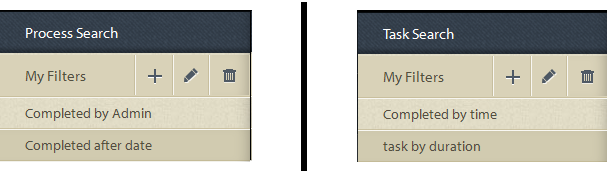
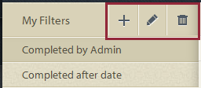

# 프로세스 보고 중 애드혹 쿼리{#ad-hoc-queries-in-process-reporting}

## 프로세스 보고 중 애드혹 쿼리 {#ad-hoc-queries-in-process-reporting-1}

프로세스 보고의 애드혹 쿼리를 사용하면 AEM Forms 환경에 정의된 AEM Forms 프로세스 인스턴스의 프로세스 및 작업 세부 사항을 검색하는 데 사용할 수 있는 사용자 지정 쿼리를 만들 수 있습니다.

또한 프로세스 및 작업 속성 필터를 사용하여 임시 쿼리를 정의할 수 있습니다. 그런 다음 이러한 필터를 저장하여 나중에 보고서를 실행하는 데 사용할 수 있습니다.

[**프로세스 검색**](/help/forms/using/process-reporting/adhoc-queries-in-process-reporting.md#p-process-task-search-p):프로세스 속성을 기반으로 사용자 정의 검색 필터로 프로세스 인스턴스를 검색합니다.

[**프로세스 세부 정보**](/help/forms/using/process-reporting/adhoc-queries-in-process-reporting.md#p-process-task-details-p):프로세스 ID를 지정하여 프로세스 인스턴스의 세부 사항을 봅니다.

**작업 검색**:작업 속성을 기반으로 사용자 정의 검색 필터로 작업 인스턴스를 검색합니다.

**작업 세부 사항**:작업 ID를 지정하여 작업 인스턴스의 세부 사항을 봅니다.

### 프로세스 및 작업 {#processes-and-tasks}

필터 만들기 및 프로세스 세부 정보에 대한 쿼리 실행 단계는 작업에 대한 단계와 동일합니다.

즉, 프로세스 검색 및 작업 검색에 대한 사용자 인터페이스는 검색할 수 있는 필드와 검색 결과에 반환된 필드에만 다릅니다. 이는 대부분의 필드가 동일하지만 특정 필드는 프로세스에 따라 다르며 특정 필드는 작업에 따라 다르기 때문입니다.

이 문서에서는 프로세스/작업 검색 및 프로세스/작업 세부 사항 섹션에 대한 설명을 자세히 설명합니다. 적절한 위치에서 특정 차이는 구체적으로 명시됩니다.

## 프로세스/작업 검색 {#process-task-search}

프로세스/작업 검색을 사용하여 프로세스/작업 인스턴스를 질의하는 필터를 정의합니다.

### 프로세스/작업 검색 쿼리를 만들려면 {#to-create-a-process-task-search-query}

1. 저장된 프로세스/작업 검색 쿼리를 보거나 쿼리를 만들려면 **애드혹 쿼리**&#x200B;를 클릭한 다음 **프로세스/작업 검색**&#x200B;을 클릭합니다.

   

   **내 필터** 패널이 트리 보기 오른쪽에 표시됩니다.

   **내 필터** 패널에서 새 임시 쿼리를 만들고 을 클릭하여 이전에 저장한 쿼리를 실행할 수 있습니다.

   

1. 기존 쿼리를 실행하려면 **내 필터** 패널에서 쿼리를 클릭하면 됩니다.
1. 쿼리를 만들려면 **추가** (+)를 클릭합니다.

   **필터 만들기** 패널이 표시됩니다.

   

   쿼리는 하나 이상의 쿼리 필터로 구성됩니다. 필터를 만들려면 쿼리에 필터 행을 추가합니다. 기본적으로 하나의 필터 행이 쿼리에 추가됩니다.

   **필터를 정의하려면**

   1. 필드를 선택합니다.

      

      >[!NOTE]
      >
      >필드 목록에는 AEM Forms 프로세스/작업과 관련된 필드가 포함되어 있습니다.

   1. 조건을 선택합니다.

      

      >[!NOTE]
      >
      >나열된 조건은 필터링하도록 선택한 속성에 따라 다릅니다.

   1. 값을 입력합니다.

      

   1. 쿼리에 다른 필터를 추가하려면 필터 행 오른쪽에 있는 **추가(+)**&#x200B;를 클릭합니다.

      쿼리에서 필터를 제거하려면 필터 행 오른쪽에 있는 **삭제(-)**&#x200B;를 클릭합니다.

      

쿼리를 만든 후 **필터 만들기** 패널의 오른쪽 위 모서리에 있는 옵션을 사용하여 다음을 수행합니다.

* **취소**:변경 내용을 취소하고  **내 필터** 스팬으로 돌아갑니다.
* **실행**:현재 쿼리를 실행하여 결과를 보고/또는 확인합니다. 이 경우 쿼리를 실행하기 전에 쿼리를 저장할 필요가 없습니다. 결과를 확인하고 필요한 경우 변경한 다음 출력에 만족하면 쿼리를 저장할 수 있습니다.
* **저장**:필터를 저장합니다. 그런 다음 **내 필터** 패널에서 필터를 보고 실행할 수 있습니다.

### 내 필터 패널 {#options-in-my-filters-panel}의 옵션

**내 필터** 패널의 옵션을 사용하여 **추가** , **편집**  또는 **삭제**> 애드혹 쿼리

### 검색 쿼리 {#to-execute-a-search-query}을(를) 실행하려면

1. 쿼리를 실행하려면 **내 필터** 패널에서 필터를 클릭하거나 필터를 만들거나 편집하는 경우 **실행** 단추를 클릭합니다.
1. 쿼리 결과가 **프로세스 보고** 창의 **보고서** 패널에 표시됩니다.

   

   보고서 하단에 표시되는 페이지 매김 패널의 도움말을 사용하여 검색 결과를 페이지화할 수 있습니다.

   

   **표시** 드롭다운 목록에서 페이지당 표시할 결과 수를 선택합니다.

   **페이지** 텍스트 상자에 해당 페이지로 바로 이동할 페이지 번호를 입력합니다.

1. 프로세스 검색 결과에 다음 필드가 표시됩니다.

   * **프로세스 ID**:프로세스의 ID입니다. 필드가 하이퍼링크되어 있습니다. 이 필드에서 프로세스 ID를 클릭하면 프로세스에 대한 **[!UICONTROL 프로세스 세부 정보]** 패널로 리디렉션됩니다.
   * **이니시에이터**:프로세스 인스턴스를 시작한 AEM Forms 사용자
   * **만든 시간**:프로세스 인스턴스가 시작된 날짜 및 시간
   * **완료된 시간**:프로세스 인스턴스가 완료된 날짜 및 시간
   * **지속 시간**:프로세스 인스턴스의 시작부터 완료까지의 기간
   * **상태**:프로세스 인스턴스의 현재 상태입니다.

   기본적으로 결과는 프로세스 ID별로 정렬됩니다. 하지만 결과를 임의의 필드별로 정렬하려면 필드 제목을 클릭합니다.

   정렬은 전환 작업이므로 열 헤더를 클릭하여 결과를 오름차순으로 정렬하고 다시 클릭하여 내림차순으로 정렬합니다.

   마찬가지로 다음 필드가 작업 검색 결과에 표시됩니다.

   * **작업 ID**:작업의 ID입니다. 필드가 하이퍼링크되어 있습니다. 이 필드에서 작업 ID를 클릭하면 작업에 대한 **[!UICONTROL 작업 세부 정보]** 패널로 리디렉션됩니다.
   * **이니시에이터**:프로세스 인스턴스를 시작한 AEM Forms 사용자
   * **만든 시간**:프로세스 인스턴스가 시작된 날짜 및 시간
   * **완료된 시간**:프로세스 인스턴스가 완료된 날짜 및 시간
   * **지속 시간**:프로세스 인스턴스의 시작부터 완료까지의 기간
   * **상태**:프로세스 인스턴스의 현재 상태입니다.

   기본적으로 결과는 작업 ID별로 정렬됩니다. 하지만 결과를 임의의 필드별로 정렬하려면 필드 제목을 클릭합니다. 결과는 열 헤더 옆에 있는 어두운 화살표로 표시되는 열별로 정렬됩니다.

   정렬은 전환 작업이므로 필드 헤더를 클릭하여 결과를 오름차순으로 정렬하고 다시 클릭하여 내림차순으로 정렬합니다. 현재 정렬 순서(오름차순/내림차순)는 열 헤더 옆에 있는 어두운 화살표 방향으로 표시됩니다.

   

1. 왼쪽 상단에 있는 레일 단추 을 클릭하여 **내 필터** 창을 축소하고 **보고서** 패널에 사용할 수 있는 공간을 확장합니다.
1. **보고서 **패널 오른쪽 상단의 옵션을 사용하여 쿼리 결과에 대해 작업을 수행합니다.

   * **새로 고침**:최신 데이터가 저장소에 있는 보고서를 새로 고칩니다.

   * **CSV로 내보내기**:보고서 데이터를 쉼표로 구분된 파일로 내보냅니다.
   >[!NOTE]
   >
   >보고서를 내보내면 검색의 전체 결과가 현재 페이지만이 아니라 CSV 파일로 내보내집니다

## 프로세스/작업 세부 정보 {#process-task-details}

**프로세스 세부 정보** 패널을 사용하여 특정 프로세스의 세부 사항을 볼 수 있습니다.

마찬가지로 **작업 세부 사항** 패널을 사용하여 특정 작업의 세부 사항을 볼 수도 있습니다.

### 프로세스/작업 세부 사항을 보려면 {#to-view-process-task-details}

특정 AEM Forms 프로세스/작업의 세부 사항을 볼 수 있습니다.

* **프로세스/작업 검색 결과에서**
* **프로세스/작업 세부 사항 패널에 프로세스/작업 ID를 입력하여**

#### 프로세스/작업 검색 결과 {#from-a-process-task-search-result}

1. 프로세스/작업 검색을 실행합니다. 자세한 내용은 [프로세스 검색 쿼리 실행](#to-execute-a-search-query)을 참조하십시오.

   결과에서 반환되는 프로세스 ID가 하이퍼링크되어 있음을 확인합니다.

   

1. **프로세스 세부 정보** 패널에서 이 프로세스의 세부 사항을 보려면 목록에서 프로세스 ID를 클릭합니다.

   **프로세스/작업 세부 사항** 쿼리 결과는 프로세스/작업에 포함된 작업/양식의 세부 사항을 표시합니다.

   기본적으로 결과는 작업/양식 ID별로 정렬됩니다. 하지만 결과를 임의의 필드별로 정렬하려면 필드 제목을 클릭합니다. 결과가 정렬되는 열은 열 헤더 옆에 있는 어두운 화살표로 표시됩니다.

   정렬은 전환 작업이므로 필드 헤더를 클릭하여 결과를 오름차순으로 정렬하고 다시 클릭하여 내림차순으로 정렬합니다. 현재 정렬 순서(오름차순/내림차순)는 열 헤더 옆에 있는 어두운 화살표 방향으로 표시됩니다.

   **프로세스 세부 정보 결과**

   

   **왼쪽 패널:** 선택한 프로세스에 대한 다음 세부 정보를 표시합니다.

   * 프로세스 이름
   * 프로세스 생성 날짜 시간
   * 프로세스 완료 날짜 시간
   * 프로세스 기간
   * 프로세스 상태
   * 프로세스 초기자

   **오른쪽 위 패널:** 선택한 프로세스를 구성하는 작업에 대한 다음 세부 정보를 표시합니다.

   * 작업 ID
   * 작업 이름
   * 작업 소유자
   * 작업 생성 날짜 시간
   * 작업 업데이트 날짜 시간
   * 작업 완료 날짜 시간
   * 작업 기간
   * 작업 상태

   **오른쪽 아래 패널:** 선택한 프로세스의 프로세스 내역에 대한 다음 세부 정보를 표시합니다.

   * 프로세스 이름
   * 프로세스 초기자
   * 프로세스 업데이트 날짜 시간
   * 프로세스 완료 날짜 시간
   * 프로세스 상태

   **작업 세부 정보 결과**

   

   **왼쪽 패널:** 선택한 작업의 다음 세부 정보를 표시합니다.

   * 작업 이름
   * 이 작업이 속한 프로세스 ID
   * 작업 설명
   * 작업 생성 날짜 시간
   * 작업 완료 날짜 시간
   * 작업 기간
   * 작업 상태
   * 선택한 작업 경로

   **오른쪽 위 패널:** 선택한 작업을 구성하는 양식의 다음 세부 정보를 표시합니다.

   * 양식 ID
   * 양식 작성 날짜 시간
   * 양식 업데이트 날짜 시간
   * 양식 템플릿 URL

   **오른쪽 아래 패널:** 선택한 작업의 프로세스 내역에 대한 다음 세부 정보를 표시합니다.

   * 작업 할당 유형
   * 작업 소유자
   * 작업 지정 생성 날짜 시간
   * 작업 업데이트 날짜 시간

1. 프로세스/작업 세부 정보가 드릴다운된 검색 결과로 돌아가려면 **프로세스/작업 검색으로 돌아가기**&#x200B;를 클릭합니다.

   

   그러나 특정 프로세스/작업 ID를 입력하여 프로세스/작업 세부 정보를 찾은 경우, 뒤로 를 클릭하여 프로세스/작업 검색을 클릭하면 검색 결과를 표시하지 않고 **프로세스/작업 검색**&#x200B;으로 돌아갑니다.

#### 프로세스/작업 세부 사항 패널 {#by-entering-the-process-task-id-in-the-process-task-details-panel-br}에 프로세스/작업 ID를 입력하여

1. **프로세스/작업 세부 사항** 패널로 이동합니다.

   

1. 프로세스/작업 ID 텍스트 상자에 프로세스/작업 ID를 입력합니다.

   

   **프로세스/작업 세부 사항** 쿼리 결과의 필드는 AEM Forms 프로세스/작업에 대한 필드입니다.

   프로세스의 경우 쿼리 결과에 프로세스에 포함된 작업의 세부 사항이 표시됩니다.

   작업의 경우 쿼리 결과에 작업에 포함된 양식의 세부 사항이 표시됩니다.
