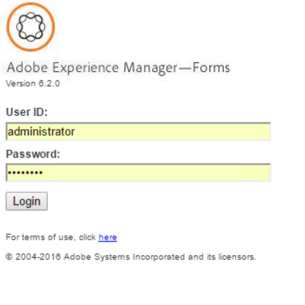

# 프로세스 보고 소개{#introduction-to-process-reporting}

프로세스 보고는 AEM Forms 프로세스 및 작업에 대한 보고서를 만들고 보는 데 사용하는 브라우저 기반 도구입니다.

프로세스 보고는 장시간 실행되는 프로세스, 프로세스 기간 및 워크플로우 볼륨에 대한 정보를 필터링하고 볼 수 있도록 하는 즉시 사용 가능한 보고서 세트를 제공합니다.

또한 프로세스 보고는 임시 쿼리를 실행하고 사용자 지정 보고서 보기를 프로세스 보고 사용자 인터페이스에 통합하는 인터페이스를 제공합니다.

지원되는 브라우저 목록은 [AEM Forms 지원 플랫폼](/help/forms/using/aem-forms-jee-supported-platforms.md)을 참조하십시오.

프로세스 보고는 다음과 같은 모듈을 기반으로 구축됩니다.

* AEM Forms 데이터베이스에서 프로세스 데이터 읽기
* 포함된 프로세스 보고 저장소에 프로세스 데이터 게시
* 보고서를 볼 수 있는 브라우저 기반 사용자 인터페이스를 제공합니다.

## 키 기능 {#key-capabilities}

### 항상 보고 {#always-on-reporting}

필터를 사용하여 실행 중인 긴 프로세스, 프로세스 기간 차트, 사용자 정의 쿼리 실행 등의 목록을 봅니다.

프로세스 보고에서는 보고서 및 쿼리 데이터를 CSV 형식으로 내보내는 옵션도 제공합니다.

### 애드혹 보고서 {#adhoc-reports}

필터를 사용하여 데이터의 특정 보기를 가져옵니다.

ID, 기간, 시작 및 종료 날짜, 프로세스 개시자 등으로 프로세스 또는 작업을 검색할 수 있습니다.

여러 필터를 결합하여 특정 보고서를 만들 수 있습니다.

그런 다음 나중 날짜 또는 시간에 실행할 보고서 필터를 저장할 수 있습니다.

### 프로세스/작업 내역 {#process-task-history}

AEM Forms 서버는 다양한 프로세스를 동시에 실행합니다. 이러한 프로세스는 한 상태에서 다른 상태로 계속 전환됩니다. 프로세스 보고 기능은 Forms 데이터를 정기적으로 프로세스 보고 저장소에 게시함으로써 AEM Forms에서 실행 중인 프로세스에 대한 전환 정보를 유지합니다.

### 액세스 제어 {#access-control-br}

프로세스 보고 기능은 사용자 인터페이스에 대한 권한 기반 액세스를 제공합니다.

즉, 보고 권한이 있는 사용자만 프로세스 보고 사용자 인터페이스에 액세스할 수 있습니다.
