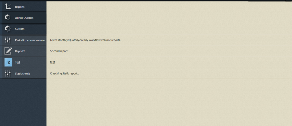

# 프로세스 보고 내 사용자 지정 보고서{#custom-reports-in-process-reporting}

QueryBuilder의 REST 인터페이스를 사용하거나 QueryBuilder API를 사용하여 OSGi 서비스를 만들어 사용자 지정 보고서를 만들 수 있습니다.

## 사용자 지정 보고서 {#generic-steps-to-build-a-custom-report}을(를) 빌드하기 위한 일반 단계

사용자 지정 보고서를 추가하기 전에 다음 템플릿 절차를 수행하십시오.

1. 사용자 지정 보고서에 사용된 데이터는 프로세스 보고에서 사용할 수 있어야 합니다. 데이터를 사용할 수 있도록 하려면 크론 작업을 예약하거나 프로세스 보고 UI에서 **[동기화](https://helpx.adobe.com/livecycle/help/process-reporting/install-start-process-reporting.html#Process%20Reporting%20Home%20screen)** 옵션을 사용하십시오.
1. URL 요청(원하는 쿼리를 캡슐화함)은 적절한 쿼리 결과 개체를 반환해야 합니다. 쿼리를 만들려면 [QueryBuilder](https://docs.adobe.com/docs/en/cq/current/dam/customizing_and_extendingcq5dam/query_builder.html)의 REST 인터페이스를 사용하여 QueryBuilder API를 사용하여 OSGi 서비스를 만들 수 있습니다. 동적 또는 정적 쿼리를 만들 수 있습니다.

1. 결과를 표시하는 사용자 정의 사용자 인터페이스를 만듭니다. 독립형 사용자 인터페이스를 만들거나 기존의 프로세스 보고 UI와 결과를 통합할 수 있습니다.

## QueryBuilder {#using-the-rest-interface-of-the-querybuilder}의 REST 인터페이스 사용

CRX QueryBuilder REST 인터페이스는 Java API 및 REST API를 통해 에셋 공유 쿼리 빌더의 기능을 표시합니다. 다음 단계를 수행하기 전에 [CRX QueryBuilder REST 인터페이스](https://docs.adobe.com/docs/en/cq/current/dam/customizing_and_extendingcq5dam/query_builder.html)를 사용하는 방법에 대해 학습합니다.

1. URL `https://'[server]:[port]'/lc/bin/querybuilder.json` 찾아보기
1. 프로세스 보고 스토리지 노드 구조 및 노드 속성을 기반으로 쿼리를 생성합니다.

   선택적 매개 변수를 지정하여 오프셋, 제한, 히트 및 속성을 지정할 수 있습니다. 정적 보고서에 대한 인수를 하드코딩하고 동적 보고서에 대해 UI에서 매개 변수를 가져올 수 있습니다.

   모든 프로세스 이름을 가져오려면 쿼리는 다음과 같습니다.

   `https://'[server]:[port]'/lc/bin/querybuilder.json?exact=false&p.hits=selective&p.properties=pmProcessTitle&path=%2fcontent%2freporting%2fpm&property=pmNodeType&property.operation=equals&property.value=ProcessType&type=sling%3aFolder`

   >[!NOTE]
   >
   >모든 쿼리에서 경로 매개 변수는 crx 저장소 위치를 가리키며 문자는 URL 표준에 따라 이스케이프됩니다.

## 쿼리 빌더 API를 사용하여 서비스 만들기  {#creating-a-service-using-query-builder-api-nbsp}

쿼리 빌더 API를 사용하여 서비스를 만들기 위한 전제 조건은 [CQ OSGI 번들](https://docs.adobe.com/docs/v5_2/html-resources/cq5_guide_developer/cq5_guide_developer.html) 및 [쿼리 빌더 API](https://docs.adobe.com/docs/en/cq/current/dam/customizing_and_extendingcq5dam/query_builder.html)를 사용하여 만들기 및 배포하는 것입니다.

1. 적절한 주석이 있는 OSGi 서비스를 만듭니다. QueryBuilder에 액세스하려면

   ```java
   @Reference(referenceInterface = QueryBuilder.class)
    private QueryBuilder queryBuilder;
   ```

1. 조건자 그룹을 만듭니다. 설명 그룹을 만드는 코드는 다음과 같습니다.

   ```java
   PredicateGroup predicateGroup = new PredicateGroup();
    predicateGroup.setAllRequired(true);
   ```

1. 새로 만든 predicateGroup에 설명을 추가합니다. 몇 가지 유용한 설명 구문은 [JcrBoolPropertyPredicateEvaluator](https://docs.adobe.com/docs/en/cq/5-3/javadoc/com/day/cq/search/eval/JcrBoolPropertyPredicateEvaluator.html), [JcrPropertyPredicateEvaluator](https://docs.adobe.com/docs/en/cq/5-3/javadoc/com/day/cq/search/eval/JcrPropertyPredicateEvaluator.html), [RangePropertyPredictiveEator](https://docs.adobe.com/docs/en/cq/5-3/javadoc/com/day/cq/search/eval/RangePropertyPredicateEvaluator.html), [DateRangeDetemper7/> 및 [TypePredicateEager](https://docs.adobe.com/docs/en/cq/5-3/javadoc/com/day/cq/search/eval/TypePredicateEvaluator.html)을(를) 포함한 모든 TypePredictiveEvaluator&lt;a9/>와 같은 범주로 분류할 수 있습니다.](https://docs.adobe.com/docs/en/cq/5-3/javadoc/com/day/cq/search/eval/RelativeDateRangePredicateEvaluator.html)

   정적 보고서의 경우 예측자를 하드코딩하는 반면, 동적 보고서의 경우 요청에서 예측자를 가져옵니다.

   프로세스의 모든 인스턴스를 가져오는 샘플 코드는 다음과 같습니다.

   ```java
   Predicate predicate;
   
     //Add the path Constraint
     predicate = new Predicate(PathPredicateEvaluator.PATH);
     predicate.set(PathPredicateEvaluator.PATH, "/content/reporting/pm"); // should point to the crx path being used to store data
     predicate.set(PathPredicateEvaluator.EXACT, "false");
     predicateGroup.add(predicate);
   
     //type nt:unstructured
     predicate = new Predicate(TypePredicateEvaluator.TYPE);
     predicate.set(TypePredicateEvaluator.TYPE, "nt:unstructured");
     predicateGroup.add(predicate);
   
     //NodeType: Process Instance
     predicate = new Predicate(JcrPropertyPredicateEvaluator.PROPERTY);
     predicate.set(JcrPropertyPredicateEvaluator.PROPERTY, "pmNodeType");
     predicate.set(JcrPropertyPredicateEvaluator.OPERATION, JcrPropertyPredicateEvaluator.OP_EQUALS);
     predicate.set(JcrPropertyPredicateEvaluator.VALUE, "ProcessInstance");
     predicateGroup.add(predicate);
   
     //processName
     predicate = new Predicate(JcrPropertyPredicateEvaluator.PROPERTY);
     predicate.set(JcrPropertyPredicateEvaluator.PROPERTY, "pmProcessName");
     predicate.set(JcrPropertyPredicateEvaluator.OPERATION, JcrPropertyPredicateEvaluator.OP_EQUALS);
     predicate.set(JcrPropertyPredicateEvaluator.VALUE, processName); //processName variable stores the name of the process whose instances need to be searched
     predicateGroup.add(predicate);
   ```

1. 조건자 그룹을 사용하여 쿼리를 정의합니다.

   `Query query = queryBuilder.createQuery(predicateGroup, session);`

1. 쿼리 결과를 가져옵니다.

   ```java
   query.setStart(offset); // hardcode or fetch from request
           if(hits == -1)         // hardcode or fetch from request
               hits = 0;
           query.setHitsPerPage(hits);
           SearchResult searchResult = query.getResult();
   ```

1. 결과를 반복하여 원하는 형식으로 결과를 변환합니다. 결과를 CSV 형식으로 전송하는 코드는 다음과 같습니다.

   ```java
   Iterator<Node> iter = searchResult.getNodes();
                   while(iter.hasNext()) {
                       Node node = iter.next();
                       row = new StringBuilder();
                       for (String property : includeProperties) { // the properties of the node which needs to be returned, or one can return all the properties too.
                           try {
                               row.append(node.getProperties(property).nextProperty().getString() + COMMA_SEPARATOR);
                           } catch (NoSuchElementException e) {
                               //Adding separator for no value
                               row.append(COMMA_SEPARATOR);
                           } catch (RepositoryException e) {
                               e.printStackTrace();
                           }
                       }
                       row.deleteCharAt(row.lastIndexOf(COMMA_SEPARATOR));
                       row.append(NEW_LINE);
                       out.write(row.toString().getBytes());
   ```

1. `org.apache.felix maven-bundle-plugin`을 사용하여 서블릿용 OSGi 번들을 만듭니다.

1. CRX 서버에 번들을 배포합니다.

### 서비스 예 {#service-example}

다음 서비스 예는 매달, 분기 및 연도의 끝에 있는 **RUNNING** 및 **COMPLETE** 상태에 있는 프로세스의 인스턴스를 카운트합니다.

```java
package custom.reporting.service;

import java.text.DateFormatSymbols;
import java.util.Calendar;
import java.util.HashMap;
import java.util.Iterator;
import java.util.LinkedHashMap;
import java.util.Map;
import java.util.SortedSet;
import java.util.TreeSet;

import javax.jcr.Node;
import javax.jcr.Session;

import org.apache.felix.scr.annotations.Component;
import org.apache.felix.scr.annotations.Reference;
import org.apache.felix.scr.annotations.Service;

import com.day.cq.search.Predicate;
import com.day.cq.search.PredicateGroup;
import com.day.cq.search.Query;
import com.day.cq.search.QueryBuilder;
import com.day.cq.search.eval.JcrPropertyPredicateEvaluator;
import com.day.cq.search.eval.PathPredicateEvaluator;
import com.day.cq.search.eval.TypePredicateEvaluator;
import com.day.cq.search.result.SearchResult;

@Component(metatype = true, immediate = true, label = "PeriodicProcessVolume", description = "Service for supporting cutom reports pluggable to Process Reporting.")
@Service(value = PeriodicProcessVolume.class)
public class PeriodicProcessVolume {

    private static String[] monthNameList = new DateFormatSymbols().getMonths();
    private static String[] quaterNameList = { "I", "II", "III", "IV" };

    private final Map<Integer, Map<Integer, Long[]>> monthly = new HashMap<Integer, Map<Integer, Long[]>>();
    private final Map<Integer, Map<Integer, Long[]>> quaterly = new HashMap<Integer, Map<Integer, Long[]>>();
    private final Map<Integer, Long[]> yearly = new HashMap<Integer, Long[]>();

    @Reference(referenceInterface = QueryBuilder.class)
    private QueryBuilder queryBuilder;

    private void addConstraints(PredicateGroup predicateGroup, String processName) {
        Predicate predicate;

        //Add the path Constraint
        predicate = new Predicate(PathPredicateEvaluator.PATH);
        predicate.set(PathPredicateEvaluator.PATH, "/content/reporting/pm");
        predicate.set(PathPredicateEvaluator.EXACT, "false");
        predicateGroup.add(predicate);

        //type nt:unstructured
        predicate = new Predicate(TypePredicateEvaluator.TYPE);
        predicate.set(TypePredicateEvaluator.TYPE, "nt:unstructured");
        predicateGroup.add(predicate);

        //NodeType: Process Instance
        predicate = new Predicate(JcrPropertyPredicateEvaluator.PROPERTY);
        predicate.set(JcrPropertyPredicateEvaluator.PROPERTY, "pmNodeType");
        predicate.set(JcrPropertyPredicateEvaluator.OPERATION, JcrPropertyPredicateEvaluator.OP_EQUALS);
        predicate.set(JcrPropertyPredicateEvaluator.VALUE, "ProcessInstance");
        predicateGroup.add(predicate);

        //processName
        if (processName != null) {
            predicate = new Predicate(JcrPropertyPredicateEvaluator.PROPERTY);
            predicate.set(JcrPropertyPredicateEvaluator.PROPERTY, "pmProcessName");
            predicate.set(JcrPropertyPredicateEvaluator.OPERATION, JcrPropertyPredicateEvaluator.OP_EQUALS);
            predicate.set(JcrPropertyPredicateEvaluator.VALUE, processName);
            predicateGroup.add(predicate);
        }
    }

    private Long[] setFrequency(Long[] frequency, int index) {
        if (frequency == null) {
            frequency = new Long[2];
            frequency[0] = 0L;
            frequency[1] = 0L;
        }
        frequency[index] = frequency[index] + 1L;
        return frequency;
    }

    public void populateValues(Session session, String processName) {
        PredicateGroup predicateGroup = new PredicateGroup();
        predicateGroup.setAllRequired(true);
        try {
            addConstraints(predicateGroup, processName);

            long batchSize = 10000L;
            long start = 0l;

            while (true) {
                Query query = queryBuilder.createQuery(predicateGroup, session);
                query.setStart(start);
                query.setHitsPerPage(batchSize);
                SearchResult searchResult = query.getResult();
                Iterator<Node> itr = searchResult.getNodes();
                long length = 0;
                while (itr.hasNext()) {
                    length++;
                    Node n = itr.next();
                    Calendar calender = n.getProperty("pmCreateTime").getDate();
                    String status = n.getProperty("pmStatus").getString();
                    int index = 0;
                    if ("COMPLETE".equals(status)) {
                        index = 1;
                    } else if ("RUNNING".equals(status)) {
                        index = 0;
                    } else {
                        continue;
                    }
                    int month = calender.get(Calendar.MONTH);
                    int year = calender.get(Calendar.YEAR);
                    int quater;
                    if (month < 3) {
                        quater = 1;
                    } else if (month < 6) {
                        quater = 2;
                    } else if (month < 9) {
                        quater = 3;
                    } else {
                        quater = 4;
                    }

                    Long frequency[];
                    Map<Integer, Long[]> yearMonthMap = this.monthly.get(year);
                    if (yearMonthMap == null) {
                        yearMonthMap = new HashMap<Integer, Long[]>();
                    }
                    frequency = yearMonthMap.get(month);
                    frequency = setFrequency(frequency, index);
                    yearMonthMap.put(month, frequency);
                    this.monthly.put(year, yearMonthMap);

                    Map<Integer, Long[]> yearQuaterMap = this.quaterly.get(year);
                    if (yearQuaterMap == null) {
                        yearQuaterMap = new HashMap<Integer, Long[]>();
                    }
                    frequency = yearQuaterMap.get(quater);
                    frequency = setFrequency(frequency, index);
                    yearQuaterMap.put(quater, frequency);
                    this.quaterly.put(year, yearQuaterMap);

                    frequency = this.yearly.get(year);
                    frequency = setFrequency(frequency, index);
                    this.yearly.put(year, frequency);
                }

                if (length < batchSize) {
                    break;
                } else {
                    start = start + batchSize;
                }
            }
        } catch (Exception e) {
            e.printStackTrace();
        }

    }

    public Map<String, Long[]> getMonthly() {
        Map<String, Long[]> result = new LinkedHashMap<String, Long[]>();
        SortedSet<Integer> years = new TreeSet<Integer>(monthly.keySet());
        for (Integer year : years) {
            Map<Integer, Long[]> yearMonthMap = monthly.get(year);
            SortedSet<Integer> months = new TreeSet<Integer>(yearMonthMap.keySet());
            for (Integer month : months) {
                String str = monthNameList[month] + " " + year;
                result.put(str, yearMonthMap.get(month));
            }
        }
        return result;
    }

    public Map<String, Long[]> getQuaterly() {
        Map<String, Long[]> result = new LinkedHashMap<String, Long[]>();
        SortedSet<Integer> years = new TreeSet<Integer>(quaterly.keySet());
        for (Integer year : years) {
            Map<Integer, Long[]> quaterMonthMap = quaterly.get(year);
            SortedSet<Integer> quaters = new TreeSet<Integer>(quaterMonthMap.keySet());
            for (Integer quater : quaters) {
                String str = quaterNameList[quater - 1] + " " + year;
                result.put(str, quaterMonthMap.get(quater));
            }
        }
        return result;
    }

    public Map<Integer, Long[]> getYearly() {
        return yearly;
    }

}
```

서비스 위에 빌드할 샘플 `pom.xml`파일은 다음과 같습니다.

```xml
<project xmlns="https://maven.apache.org/POM/4.0.0" xmlns:xsi="https://www.w3.org/2001/XMLSchema-instance" xsi:schemaLocation="https://maven.apache.org/POM/4.0.0 https://maven.apache.org/maven-v4_0_0.xsd">
    <modelVersion>4.0.0</modelVersion>

    <!-- ====================================================================== -->
    <!-- P R O J E C T  D E S C R I P T I O N                                   -->
    <!-- ====================================================================== -->
    <groupId>com.custom</groupId>
    <artifactId>sample-report-core</artifactId>
    <packaging>bundle</packaging>
    <name>PR Sample Report</name>
    <description>Bundle providing support for a custom report pluggable to process reporting.</description>
    <version>1</version>

    <!-- ====================================================================== -->
    <!-- B U I L D   D E F I N I T I O N                                        -->
    <!-- ====================================================================== -->
    <build>
        <plugins>
          <plugin>
              <groupId>org.apache.felix</groupId>
              <artifactId>maven-bundle-plugin</artifactId>
              <version>2.3.7</version>
              <extensions>true</extensions>
              <configuration>
                    <instructions>
                        <Bundle-Category>sample-report</Bundle-Category>
                        <Export-Package>
                            custom.reporting.service.*;
                        </Export-Package>
                     </instructions>
              </configuration>
          </plugin>
          <plugin>
                <groupId>org.apache.felix</groupId>
                <artifactId>maven-scr-plugin</artifactId>
                <version>1.11.0</version>
                <executions>
                    <execution>
                        <id>generate-scr-scrdescriptor</id>
                        <goals>
                            <goal>scr</goal>
                        </goals>
                        <configuration>
                            <!-- Private service properties for all services. -->
                            <properties>
                                <service.vendor>Sample Report</service.vendor>
                            </properties>
                        </configuration>
                    </execution>
                </executions>
            </plugin>
        </plugins>
    </build>

    <!-- ====================================================================== -->
    <!-- D E P E N D E N C I E S                                                -->
    <!-- ====================================================================== -->
    <dependencies>
        <dependency>
          <groupId>com.day.cq</groupId>
          <artifactId>cq-search</artifactId>
          <version>5.6.4</version>
        </dependency>

        <dependency>
          <groupId>javax.jcr</groupId>
          <artifactId>jcr</artifactId>
          <version>2.0</version>
        </dependency>

        <dependency>
          <groupId>org.apache.felix</groupId>
          <artifactId>org.apache.felix.scr.annotations</artifactId>
          <version>1.9.0</version>
        </dependency>
    </dependencies>
</project>
```

## 별도의 UI 만들기  {#creating-a-separate-ui-nbsp}

결과를 표시하기 위한 별도의 UI를 만들기 위한 전제 조건은 [Sling Basics](https://docs.adobe.com/docs/en/cq/5-6-1/developing/the_basics.html), [CRX 노드](https://docs.adobe.com/docs/en/crx/current/developing/development_tools/developing_with_crxde_lite.html#Creating%20a%20Node)만들기 및 적절한 [액세스 권한](https://docs.adobe.com/docs/en/crx/current/developing/development_tools/developing_with_crxde_lite.html#Access%20Control)입니다.

1. `/apps` 노드에 CRX 노드를 만들고 적절한 액세스 권한을 부여합니다. (PERM_PROCESS_REPORTING_USER)
1. `/content` 노드에서 렌더러를 정의합니다.
1. 1단계에서 만든 노드에 JSP 또는 HTML 파일을 추가합니다. CSS 파일을 추가할 수도 있습니다.

   

   JSP 및 CSS 파일이 있는 샘플 노드

1. JavaScript 코드를 추가하여 QueryBuilder REST API 또는 서비스에 대한 Ajax 호출을 시작합니다. 또한 적절한 인수를 추가합니다.

1. Ajax 호출에 적절한 성공 핸들러를 추가하여 결과를 구문 분석하고 표시합니다. 결과를 여러 형식(json/csv/사용자 정의)으로 분석하여 표 형식이나 다른 형식으로 표시할 수 있습니다.

1. (선택 사항) Ajax 호출에 적절한 오류 핸들러를 추가합니다.

OSGi Service와 QueryBuilder API를 모두 사용하는 샘플 JSP 코드는 다음과 같습니다.

```html
<%@taglib prefix="sling" uri="https://sling.apache.org/taglibs/sling/1.0"%>
<%request.setAttribute("silentAuthor", new Boolean(true));%>
<%@include file="/libs/foundation/global.jsp"%>
<%@ page import="java.util.Map,
java.util.Set,
com.adobe.idp.dsc.registry.service.ServiceRegistry,
javax.jcr.Session,
org.apache.sling.api.resource.ResourceResolver,
custom.reporting.service.PeriodicProcessVolume"%>
<%
response.setContentType("text/html");
response.setCharacterEncoding("utf-8");
%><!DOCTYPE HTML>
<html>
    <head>
        <meta charset="UTF-8">

        <link rel="stylesheet" href="/lc/apps/sample-report-process-reporting/custom-reports/periodicProcessVolume/style.css">
        <title>REPORT Monthly / Qaterly / Yearly</title>
        <script type="text/javascript">

            <%
                slingResponse.setCharacterEncoding("utf-8");
                ResourceResolver resolver = slingRequest.getResourceResolver();
                String processName = slingRequest.getParameter("processName");
                Session session = resolver.adaptTo(Session.class);
                custom.reporting.service.PeriodicProcessVolume periodicProcessVolume = sling.getService(custom.reporting.service.PeriodicProcessVolume.class);
                periodicProcessVolume.populateValues(session, processName);
                if (processName == null) {
                    processName = "All";
                }
            %>
            var lineSeprator = "<td class='seprator'>----------------</td>";
            var tableEnder = "<tr>" + lineSeprator + lineSeprator + lineSeprator + "</tr>";

            var tableColHeader = "<td class='colHead colNum'>Running</td>";
            tableColHeader += "<td class='colHead  colNum'>Complete</td></tr>";
            tableColHeader += tableEnder;

            var monthly = "<table><tr><td class='colHead colStr'>Month</td>";
            monthly += tableColHeader;

            <%
                Map<String, Long[]> monthlyMap = periodicProcessVolume.getMonthly();
                Set<String> monthKeys = monthlyMap.keySet();
                for (String key: monthKeys) {
                    Long[] frequencies = monthlyMap.get(key);
            %>

            monthly += "<tr><td class='colStr'> <%= key %> </td>";
            monthly += "<td class='colNum'> <%= frequencies[0] %> </td>";
            monthly += "<td class='colNum'> <%= frequencies[1] %> </td></tr>";
            <%
                }
            %>

            monthly += tableEnder;

            var quaterly = "<table><tr><td class='colHead colStr'>Quater</td>";
            quaterly += tableColHeader;

            <%
                Map<String, Long[]> quaterMap = periodicProcessVolume.getQuaterly();
                Set<String> quaterKeys = quaterMap.keySet();
                for (String key: quaterKeys) {
                    Long[] frequencies = quaterMap.get(key);
            %>

            quaterly += "<tr><td class='colStr'> <%= key %> </td>";
            quaterly += "<td class='colNum'> <%= frequencies[0] %> </td>";
            quaterly += "<td class='colNum'> <%= frequencies[1] %> </td></tr>";
            <%
                }
            %>

            quaterly += tableEnder;

            var yearly = "<table><tr><td class='colHead colStr'>Year</td>";
            yearly += tableColHeader;

            <%
                Map<Integer, Long[]> yearMap = periodicProcessVolume.getYearly();
                Set<Integer> yearKeys = yearMap.keySet();
                for (Integer key: yearKeys) {
                    Long[] frequencies = yearMap.get(key);
            %>

            yearly += "<tr><td class='colStr'> <%= key %> </td>";
            yearly += "<td class='colNum'> <%= frequencies[0] %> </td>";
            yearly += "<td class='colNum'> <%= frequencies[1] %> </td></tr>";
            <%
                }
            %>

            yearly += tableEnder;

            function reloadFrame(value) {
                if (value === '-1') {
                    window.location = "/lc/content/process-reporting-runtime/custom-reports/periodicProcessVolume.html";
                } else {
                    window.location = "/lc/content/process-reporting-runtime/custom-reports/periodicProcessVolume.html?processName=" + value;
                }
            }

            function populateTable(selection) {
                if (selection === 0) {
                    document.getElementById('tableHeading').innerHTML = 'Monthly';
                    document.getElementById('volumeTable').innerHTML = monthly;
                } else if (selection === 1) {
                    document.getElementById('tableHeading').innerHTML = 'Quaterly';
                    document.getElementById('volumeTable').innerHTML = quaterly;
                } else {
                    document.getElementById('tableHeading').innerHTML = 'Yearly';
                    document.getElementById('volumeTable').innerHTML = yearly;
                }
            }

            function fetchProcesses() {
                var xmlhttp = new XMLHttpRequest(),
                    request = '';
                xmlhttp.onreadystatechange = function() {
                   if (xmlhttp.readyState === 4 && xmlhttp.status === 200) {
                       var responseText,
                           response,
                           items,
                           hits = [],
                           responseSize = 0,
                           processName,
                           selectedIndex = 0,
                           comboBox;
                       responseText = xmlhttp.responseText;
                       if (responseText !== undefined && responseText !== null) {
                           response = JSON.parse(responseText);
                           responseSize = response.results;
                           hits = response.hits;
                       }

                       items = "<option value='-1'>All</option>";

                       for(var i = 0; i < responseSize; i++) {
                           processName = hits[i].pmProcessTitle;
                           if (processName === '<%= processName %>') {
                               selectedIndex = i + 1;
                           }
                           items += "<option value='" + processName + "'>" + processName + "</option>"
                       }

                       comboBox = document.getElementById('processSelection');
                       comboBox.innerHTML = items;
                       comboBox.selectedIndex = selectedIndex;
                   }
               };
               request = "/lc/bin/querybuilder.json?";
               request += "exact=false&";
               request += "p.hits=selective&";
               request += "p.properties=pmProcessTitle&";
               request += "path=%2fcontent%2freporting%2fpm&";
               request += "property=pmNodeType&";
               request += "property.operation=equals&";
               request += "property.value=ProcessType&";
               request += "type=sling%3aFolder";

               xmlhttp.open("POST", request, true);
               xmlhttp.setRequestHeader("Content-type","application/json");
               xmlhttp.send();
            }

        </script>
    </head>
    <body onLoad="fetchProcesses();populateTable(0);">
        Process:
        <select id="processSelection" onchange="reloadFrame(this.value);"></select>
        &nbsp &nbsp Period Interval:
        <select name="periodSelection" onchange="populateTable(this.selectedIndex);">
            <option value="1">Monthly</option>
            <option value="2">Quaterly</option>
            <option value="3">Yearly</option>
        </select>
        <br> <br> <br> <br>
        <div class="inline"> Process: &nbsp <b><%= processName %></b> &nbsp &nbsp Period: &nbsp </div> <b> <div id="tableHeading" class="inline"> </div> </b>
        <br><br>
        <div id="volumeTable"> </div>

    </body>
</html>
```

## 기존 프로세스 보고 UI에 보고서 UI 통합  {#integrating-report-ui-in-existing-process-reporting-ui-nbsp}

결과를 표시하기 위한 별도의 UI를 만들기 위한 전제 조건은 [Sling Basics](https://wem.help.adobe.com/enterprise/en_US/10-0/wem/developing/the_basics.html), [CRX 노드](https://docs.adobe.com/docs/en/crx/current/developing/development_tools/developing_with_crxde_lite.html#Creating%20a%20Node)만들기 및 적절한 [액세스 권한](https://docs.adobe.com/docs/en/crx/current/developing/development_tools/developing_with_crxde_lite.html#Access%20Control)입니다.

1. 별도의 UI를 만듭니다.
1. 모든 플러그형 보고서에 대해 `/content/process-reporting-runtime/custom-reports` 노드에 하위 `nt:unstructured` 노드를 만듭니다.

   * **id** - 보고서의 고유 ID 번호를 지정합니다.
   * **이름** - 보고서 이름을 지정합니다. 이름이 UI에 표시됩니다.
   * **링크** - 별도의 UI의 렌더러에 대한 상대적 링크를 지정합니다. 링크가 1단계에서 만들어집니다.
   * **설명** - 보고서에 대한 한 줄의 설명을 지정합니다. 설명 필드를 비워 둘 수 있습니다.
   * **아이콘** - 보고서를 시각적으로 나타낼 이미지를 지정합니다. 아이콘 필드를 비워 둘 수 있습니다.

   

   노드의 속성

1. 보고서 UI는 프로세스 보고 UI에 통합됩니다. UI를 통합하면 업데이트된 UI가 다음 이미지와 비슷합니다.

   

   새로 추가된 사용자 지정 보고서의 사용자 인터페이스

   

   사용자 지정 보고서의 결과 화면

## 샘플 패키지 {#sample-package}

`sample-report-pkg-1.zip` 패키지를 가져와 아티클에서 설명한 사용자 정의 보고서와 UI를 프로세스 관리 UI로 통합할 수 있습니다.

[파일 가져오기](assets/sample-report-pkg-1.zip)
