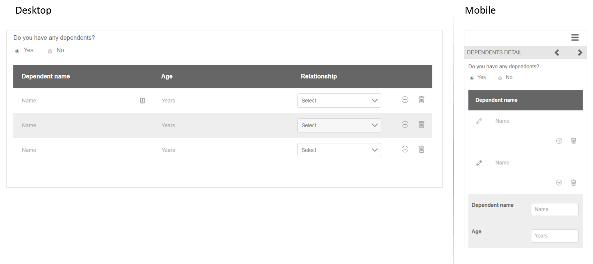

# 응용 양식 조각 참조{#reference-adaptive-form-fragments}

[적응형 양식 ](../../forms/using/adaptive-form-fragments.md) 조각은 필드 그룹이나 양식을 만들 때 사용할 수 있는 필드 그룹이 포함된 패널을 나타냅니다. 양식을 쉽고 빠르게 만들 수 있습니다. 사이드바의 자산 브라우저를 사용하여 응용 양식 조각을 양식에 드래그하여 놓을 수 있으며 양식 편집기에서 편집할 수 있습니다.

적응형 양식 작성자의 경우 참조 조각은 AEM Forms 패키지 [AEM-FORMS.-6.3-REFERENCE-FRAGMENTS](https://www.adobeaemcloud.com/content/marketplace/marketplaceProxy.html?packagePath=/content/companies/public/adobe/packages/cq630/fd/AEM-FORMS-6.3-REFERENCE-FRAGMENTS)에 제공됩니다. 여기에는 다음 단편이 포함됩니다.

* 주소
* 연락처 정보
* 신용 카드 정보
* 현재 고용
* 종속 항목 정보
* 고용 내역
* 수입 및 지출
* 이름
* 약관
* 문지르기 사용 약관

패키지를 설치할 때 참조 조각이 포함된 참조 조각 폴더가 Forms 및 문서 아래에 생성됩니다. 패키지를 설치하려면 [패키지를 사용한 작업 방법](/help/sites-administering/package-manager.md)을 참조하십시오.

## 주소 {#address}

우편 주소를 지정하는 필드를 포함합니다. 사용 가능한 필드는 주소, 우편 번호, 구/군/시, 주 및 국가입니다. 또한 지정된 미국 우편 번호에 대해 구/군/시를 채우는 미리 구성된 웹 서비스를 포함합니다.

<!--[Click to enlarge

](assets/address-1.png)-->

## 연락처 정보 {#contact-information}

전화 번호와 이메일 주소를 캡처할 필드를 포함합니다.

<!--[Click to enlarge

](assets/contact-info-1.png)-->

## 신용 카드 정보 {#credit-card-information}

결제 프로세스에 사용할 수 있는 신용 카드 정보를 캡처하는 필드를 포함합니다.

## 현재 고용 {#current-employment}

고용 상태, 고용 분야, 지정, 조직 및 가입 날짜와 같은 현재 고용 세부 사항을 캡처할 수 있는 필드를 포함합니다.

<!--[Click to enlarge

](assets/current-emp-1.png)-->

## 종속 항목 정보 {#dependents-information}

이름, 관계 및 연령 등 하나 이상의 종속 항목에 대한 정보를 표 형식으로 지정하는 필드를 포함합니다.

<!--[Click to enlarge

](assets/dependents-info-1.png)-->

## 고용 내역 {#employment-history}

고용 내역을 캡처할 필드를 포함합니다. 여러 조직을 추가할 수 있습니다.

<!--[Click to enlarge

](assets/emp-history-1.png)-->

## 수입 및 지출 {#income-expenditure}

월별 현금 흐름과 비용을 캡처하는 필드를 포함합니다. 사용자가 재무 세부 정보를 제공하도록 요구하는 Forms은 이 조각을 사용하여 소득과 지출을 캡처할 수 있습니다.

<!--[Click to enlarge

](assets/income-1.png)-->

## 이름 {#name}

제목, 이름, 중간 이름 및 성을 지정하는 필드를 포함합니다.

<!--[Click to enlarge

](assets/name-1.png)-->

## 약관 {#terms-conditions}

양식을 제출하기 전에 사용자가 수락할 약관을 지정합니다.

<!--[Click to enlarge

](assets/tnc-1.png)-->

## 스크리블 {#terms-conditions-with-scribble}이(가) 있는 약관

양식을 제출하기 전에 사용자가 수락하고 서명할 수 있는 조건을 지정합니다.

<!--[Click to enlarge

](assets/tnc-scribble-1.png)-->
