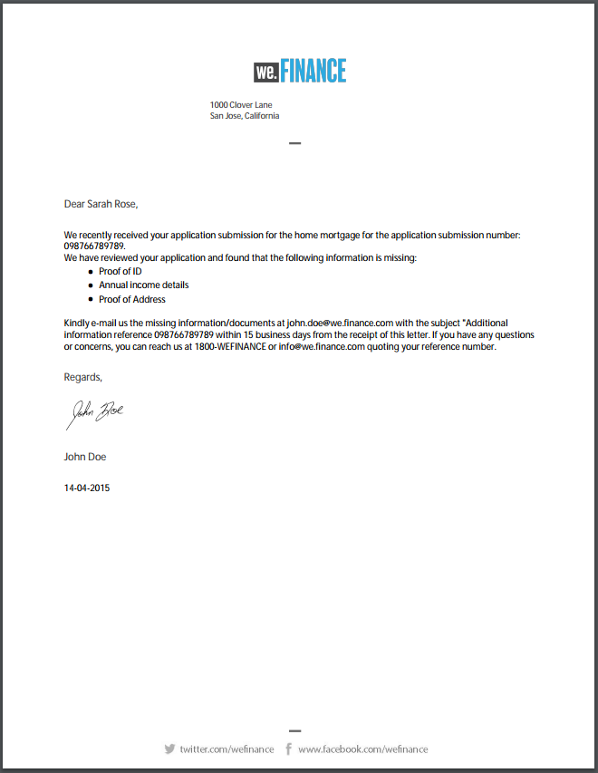
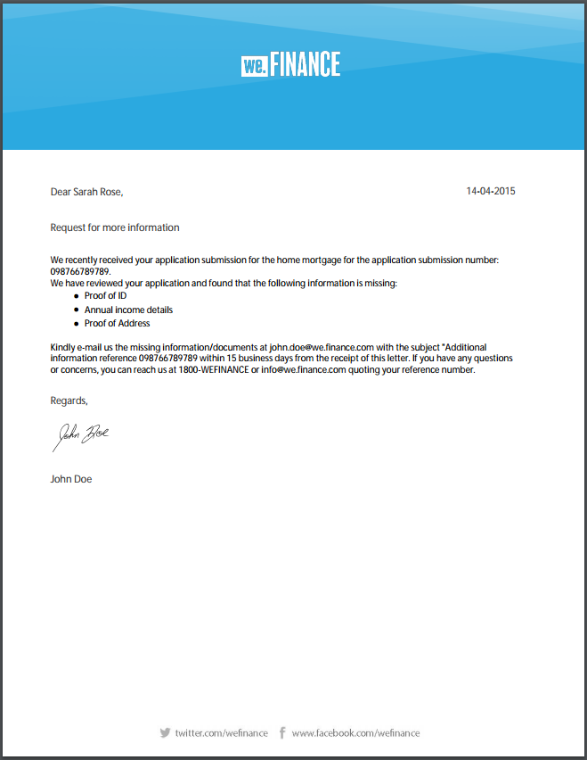

# 참조 문자 템플릿 {#reference-letter-templates}

통신 관리에서 편지 템플릿에는 일반적인 양식 필드, 머리글 및 바닥글과 같은 레이아웃 기능, 컨텐츠 배치를 위한 빈 &quot;대상 영역&quot;이 포함되어 있습니다.

통신 관리에서는 AEM Forms 패키지 [AEM-FORMS.-REFERENCE-LAYOUT-TEMPLATES](https://www.adobeaemcloud.com/content/marketplace/marketplaceProxy.html?packagePath=/content/companies/public/adobe/packages/cq630/fd/AEM-FORMS-6.3-REFERENCE-LAYOUT-TEMPLATES)에 문자 템플릿을 제공합니다. 패키지를 설치하려면 [패키지를 사용한 작업 방법](/help/sites-administering/package-manager.md)을 참조하십시오. 브랜딩 및 비즈니스 요구에 따라 Designer에서 템플릿을 사용자 정의할 수 있습니다. 패키지에는 다음 템플릿이 포함되어 있습니다.

* 클래식
* 클래식 단순
* 왼쪽 균형
* 오른쪽 균형
* 왼쪽 보기
* Visual Top
* Visual Top - Classic

패키지를 설치한 후 레이아웃 템플릿(XDP)이 다음 위치의 템플릿 폴더에 나열됩니다.

`https://'[server]:[port]'/[context-root]/aem/forms.html/content/dam/formsanddocuments/templates-folder`

다음은 이 패키지의 모든 템플릿에 있는 일반적인 필드입니다.

* 날짜
* 인사말
* 텍스트 닫기
* 서명 텍스트

AEM-FORMS.-6.3-REFERENCE-LAYOUT-TEMPLATES 패키지를 설치한 후 템플릿은 templates-folder에 나열됩니다

## 클래식 {#classic}

로고가 위에 있는 Classic 템플릿은 일반 전문 서신에 적합합니다.

클래식 템플릿을 사용하여 만든 서신의 PDF 미리 보기

## 클래식 단순 {#classic-simple}

전화 번호 및 이메일 주소를 캡처할 필드를 포함합니다. 클래식 단순 템플릿은 수신자 주소를 입력할 수 있는 필드가 없다는 점을 제외하고 클래식 템플릿과 유사합니다.

클래식 간단한 템플릿을 사용하여 만든 서신의 PDF 미리 보기

## 왼쪽 균형 맞춤 {#balanced-left}

왼쪽 균형 지정 템플릿에는 문자 왼쪽에 로고가 포함됩니다.

왼쪽 균형 지정 템플릿을 사용하여 만든 서신의 PDF 미리 보기

## 오른쪽 균형 맞춤 {#balanced-right}

오른쪽 균형 지정 템플릿에는 회사 로고가 왼쪽에 있으며 편지 자체에 수신자 주소를 입력할 수 있는 공간을 제공합니다. 오른쪽 균형 지정 템플릿에도 페이지에 여러 페이지가 있을 때 리플로우되는 바닥글이 포함되어 있습니다.

균형 있는 오른쪽 템플릿을 사용하여 만든 서신의 PDF 미리 보기

## 시각적 왼쪽 {#visual-left}

시각적 왼쪽 템플릿에는 페이지 왼쪽에 회사 로고가 있는 측면 헤드가 있습니다. 시각적 왼쪽 템플릿에는 제목 필드가 있지만 바닥글은 없습니다.

왼쪽 시각적 템플릿을 사용하여 만든 서신의 PDF 미리 보기

## 시각적 위쪽 {#visual-top}

시각적 상위 템플릿의 맨 위에는 시각적 여백이 있습니다. 시각적 상위 템플릿에는 페이지 자체에 받는 사람의 주소를 입력하는 필드가 있습니다. 시각적 위쪽 템플릿에는 제목 필드와 바닥글이 있으며 여러 페이지로 확장되는 문자의 리플로우됩니다.

시각적 상위 템플릿을 사용하여 만든 서신의 PDF 미리 보기

## Visual Top - Classic {#visual-top-classic}

Visual Top - Classic 템플릿에는 회사 로고가 있는 페이지 상단에 헤더가 있습니다. 시각적 위쪽 - 클래식 템플릿에는 제목을 입력할 필드가 있지만 바닥글은 없습니다.

Visual Top - Classic 템플릿을 사용하여 만든 서신의 PDF 미리 보기

