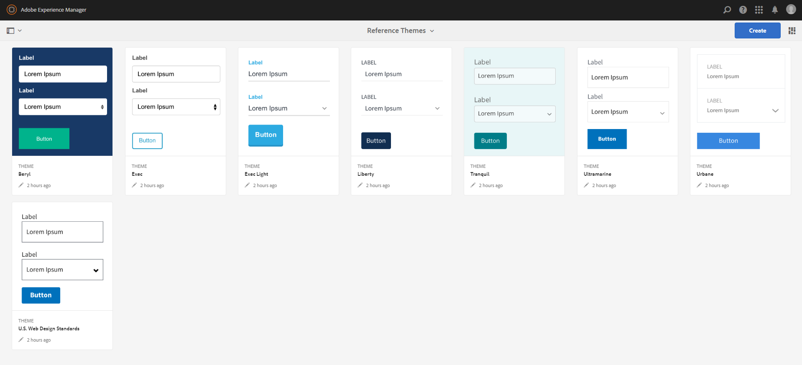

# 참조 테마{#reference-themes}

[CSS](../../forms/using/themes.md) 에 대한 깊은 지식 없이도 양식의 스타일을 지정할 수 있습니다. 기본 테마 외에도 [AEM-FORMS.-REFERENCE-THEMES](https://www.adobeaemcloud.com/content/marketplace/marketplaceProxy.html?packagePath=/content/companies/public/adobe/packages/cq630/fd/AEM-FORMS-6.3-REFERENCE-THEMES) 패키지를 설치하여 다음 테마를 얻을 수 있습니다.

* 베릴
* 경영진
* 경영진-라이트
* 리버티
* 울트라마린
* Urbane
* 미국 웹 디자인 표준
* 고요함

각 테마에는 사용자에게 적합한 적응형 양식을 만드는 데 사용할 수 있는 독특하고 세련된 스타일이 포함되어 있습니다. 패널, 텍스트 상자, 숫자 상자, 라디오 단추, 표 및 스위치와 같은 선택기에 대한 고유한 스타일이 포함되어 있습니다. 이러한 테마의 스타일은 요구 사항에 따라 다릅니다. 예를 들어 특정 시나리오에서 깔끔한 글꼴이 포함된 미니멀 테마가 필요합니다. 자유 테마를 사용하면 그 모습을 얻을 수 있습니다.

이 패키지에 포함된 테마는 반응형이며, 이러한 테마의 스타일링은 모바일 및 데스크탑 디스플레이에 대해 정의됩니다. 다양한 디바이스에서 최신 버전의 브라우저는 이러한 테마 중 하나로 적용된 양식을 간편하게 렌더링할 수 있습니다.

패키지 설치에 대한 자세한 내용은 [패키지 사용 방법](/help/sites-administering/package-manager.md)을 참조하십시오.

## Beryl {#beryl}

버릴 테마는 We.Gov 응용 양식에 의해 사용되고 배경 이미지, 투명도 및 크고 평평한 아이콘의 사용을 강조합니다. 아래 스크린샷에서는 Beryl 테마가 어떻게 생겼으며, 양식의 스타일을 향상시키는 방법을 확인할 수 있습니다.

<!--[Click to enlarge

](assets/beryl-1.png)-->

## 실행 {#exec}

실행 테마는 단색 배경 채우기를 피하고 양식 구성 요소를 강조합니다. 구성 요소를 선택하고 클릭하면 글꼴 색상이 변경됩니다. 기본 캔버스 테마와 비교하여 선택한 탭의 텍스트 글꼴 색상이 진한 파란색으로 바뀝니다. 내비게이션 및 제출 단추가 Beryl 테마와 어떻게 다른지 확인하십시오.

<!--[Click to enlarge

](assets/exec-1.png)-->

## 실행 라이트 {#exec-light}

실행 라이트 테마는 공백을 사용하여 원활한 경험을 제공합니다. [다음] 및 [제출] 단추에는 단색 채우기와 3D 그림자가 표시됩니다. 왼쪽의 선택된 탭에는 이중 확인 표시 대신 화살표가 표시됩니다.

<!--[Click to enlarge

](assets/exec-light-1.png)-->

## 리버티 {#liberty}

자유의 테마는 그 중요한 것을 강조하기 위해 미니멀 방식을 사용한다. 예를 들어 방문한 탭의 글꼴 색상이 녹색으로 바뀝니다. 줄과 함께 종이 기반 양식의 모양을 에뮬레이트하는 텍스트 상자의 아래쪽 윤곽선만 볼 수 있습니다. 활성 텍스트 상자에는 검정색 아래쪽 윤곽선이 있고 다른 텍스트 상자에는 밝은 회색의 아래쪽 윤곽선이 표시됩니다.

<!--[Click to enlarge

](assets/liberty-1.png)-->

## 고요함 {#tranquil}

조용한 테마는 고요함 색상 구성표의 밝은 영역과 어두운 색조를 제공하여 양식의 다른 구성 요소를 강조 표시합니다. 예를 들어 라디오 단추, 패널 및 탭은 다른 녹색 음영을 가져옵니다.

<!--[Click to enlarge

](assets/tranquil-1.png)-->

## Ultramarine {#ultramarine}

Ultramarine 테마는 짙은 파란색 음영을 사용하여 탭, 패널, 텍스트 상자 및 버튼과 같은 구성 요소를 강조 표시합니다.

<!--[Click to enlarge](assets/ultramarine-1.png)-->

## Urbane {#urbane}

Urbane 테마는 간결하고 기능적인 모양의 형태를 강조합니다. Urbent 테마를 양식에 적용하면 구성 요소가 평평하다는 것을 확인할 수 있습니다. 패널에는 얇은 윤곽선이 표시되므로 현대적인 모양을 만들 수 있습니다.

<!--[Click to enlarge

](assets/urbane-1.png)-->

## 미국 웹 디자인 표준 {#u-s-web-design-standards}

U.S. Web Design Standard 테마는 이름에서 알 수 있듯이 Draft US Web Design Standards 사이트에 설명된 서체와 스타일을 사용합니다. 웹 표준은 연방 정부 웹 사이트 전반에 걸쳐 일관된 웹 경험을 제공하기 위해 연방 조직에서 사용합니다.

<!--[Click to enlarge

](assets/usgov.png)-->
