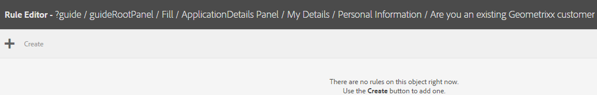
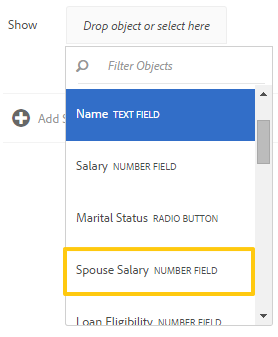
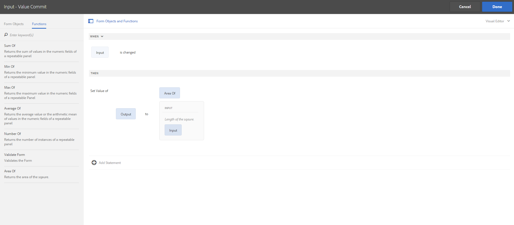
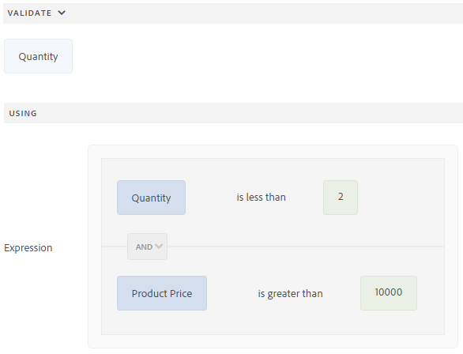

# 적응형 양식 규칙 편집기{#adaptive-forms-rule-editor}

## 개요 {#overview}

Adobe Experience Manager Forms의 규칙 편집기 기능을 사용하면 양식 비즈니스 사용자와 개발자는 적응형 양식 개체에 대한 규칙을 작성할 수 있습니다. 이러한 규칙은 양식의 사전 설정 조건, 사용자 입력 및 사용자 작업을 기반으로 양식 객체를 트리거하는 작업을 정의합니다. 정확성과 속도를 보장하는 양식 채우기 환경을 더욱 간소화할 수 있습니다.

규칙 편집기는 규칙을 작성할 수 있는 직관적이고 간소화된 사용자 인터페이스를 제공합니다. 규칙 편집기에서는 모든 사용자를 위한 시각적 편집기를 제공합니다. 또한 양식 고급 사용자에게만 규칙 편집기는 규칙과 스크립트를 작성하는 코드 편집기를 제공합니다. 규칙을 사용하여 응용 양식 개체에 대해 수행할 수 있는 주요 작업 중 일부는 다음과 같습니다.

* 개체 표시 또는 숨기기
* 개체 활성화 또는 비활성화
* 개체 값 설정
* 객체의 값 유효성 검사
* 객체의 값을 계산하는 함수 실행
* 양식 데이터 모델 서비스를 호출하고 작업을 수행합니다.
* 객체의 속성 설정

규칙 편집기는 AEM 6.1 Forms 및 이전 릴리스의 스크립팅 기능을 대체합니다. 그러나 기존 스크립트는 새 규칙 편집기에서 유지됩니다. 규칙 편집기에서 기존 스크립트를 사용한 작업에 대한 자세한 내용은 [규칙 편집기가 기존 스크립트](../../forms/using/rule-editor.md#p-impact-of-rule-editor-on-existing-scripts-p)에 미치는 영향을 참조하십시오.

Forms-Power-users 그룹에 추가된 사용자는 새 스크립트를 만들고 기존 스크립트를 편집할 수 있습니다. 양식 사용자 그룹의 사용자는 스크립트를 사용할 수 있지만 스크립트를 만들거나 편집할 수는 없습니다.

## 규칙 이해 {#understanding-a-rule}

규칙은 작업 및 조건의 조합입니다. 규칙 편집기에서 작업에는 양식에 있는 개체의 값을 숨기거나 표시, 활성화, 비활성화 또는 계산하는 등의 작업이 포함됩니다. 조건은 양식 객체의 상태, 값 또는 속성에 대한 검사 및 작업을 수행하여 평가되는 부울 표현식입니다. 조건을 평가하여 반환된 값( `True` 또는 `False`)을 기반으로 작업이 수행됩니다.

규칙 편집기에서는 규칙을 작성하는 데 도움이 되도록 시기, 표시, 숨기기, 활성화, 비활성화, 값 설정 및 유효성 검사와 같은 사전 정의된 규칙 유형을 제공합니다. 각 규칙 유형을 사용하여 규칙에서 조건 및 작업을 정의할 수 있습니다. 이 문서에서는 각 규칙 유형에 대해 자세히 설명합니다.

규칙은 일반적으로 다음 구문 중 하나를 따릅니다.

**조건-** Action이 구문에서 규칙은 먼저 조건을 정의하고 트리거할 작업을 추가합니다. 프로그래밍 언어에서 if-then 문과 비슷합니다.

규칙 편집기에서 **When** 규칙 유형이 조건-작업 구문을 적용합니다.

**Action-** Condition이 구문에서 규칙은 먼저 트리거할 동작을 정의하고 그 뒤에 평가 조건을 추가합니다. 이 구문의 또 다른 변형은 Action-condition-alternate 액션이며, 조건이 False를 반환하는 경우 트리거할 대체 액션도 정의합니다.

규칙 편집기의 표시, 숨기기, 활성화, 비활성화, 값 설정 및 유효성 검사 규칙 유형은 작업 조건 규칙 구문을 적용합니다. 기본적으로 [표시]에 대한 대체 동작은 [숨기기]이고 [사용]에 대해서는 [사용 안 함]입니다. 그 반대의 경우도 마찬가지입니다. 기본 대체 작업은 변경할 수 없습니다.

>[!NOTE]
>
>규칙 편집기에서 정의하는 조건 및 작업을 비롯한 사용 가능한 규칙 유형은 규칙을 만드는 양식 객체의 유형에도 따라 달라집니다. 규칙 편집기에는 특정 양식 객체 유형에 대한 조건 및 작업 문을 작성하기 위한 유효한 규칙 유형과 옵션만 표시됩니다. 예를 들어, 패널 개체에 대한 유효성 검사, 값 설정, 활성화 및 규칙 유형 비활성화는 표시되지 않습니다.

규칙 편집기에서 사용할 수 있는 규칙 유형에 대한 자세한 내용은 규칙 편집기[에서 사용 가능한 규칙 유형을 참조하십시오.](../../forms/using/rule-editor.md#p-available-rule-types-in-rule-editor-p)

### 규칙 구문 선택에 대한 지침 {#guidelines-for-choosing-a-rule-construct}

규칙 구절을 사용하여 대부분의 사용 사례를 얻을 수 있지만, 다음은 하나의 구문을 다른 구문보다 선택하는 몇 가지 지침입니다. 규칙 편집기에서 사용 가능한 규칙에 대한 자세한 내용은 규칙 편집기[에서 사용 가능한 규칙 유형을 참조하십시오.](../../forms/using/rule-editor.md#p-available-rule-types-in-rule-editor-p)

* 규칙을 만들 때 일반적인 경험의 규칙은 규칙을 작성하고 있는 객체의 컨텍스트에서 규칙을 고려하는 것입니다. 필드 A에서 사용자가 지정하는 값을 기준으로 필드 B를 숨기거나 표시하려는 경우를 고려합니다. 이 경우 필드 A에 대한 조건을 평가하고, 필드가 반환하는 값을 기준으로 필드 B에 대해 작업을 트리거합니다.

   따라서 필드 B(조건을 평가하는 개체)에 규칙을 작성하는 경우 조건 작업 구문이나 When 규칙 유형을 사용합니다. 마찬가지로 필드 A에 작업 조건 구문이나 표시 또는 숨기기 규칙 유형을 사용합니다.

* 때때로 한 조건에 따라 여러 작업을 수행해야 합니다. 이러한 경우 조건-동작 구문을 사용하는 것이 좋습니다. 이 구조에서는 조건을 한 번 평가하고 여러 액션 문을 지정할 수 있습니다.

   예를 들어, 사용자가 필드 A에서 지정하는 값을 확인하는 조건을 기준으로 필드 B, C 및 D를 숨기려면 조건 작업 구문을 사용하여 규칙 하나를 작성하고 필드 A의 규칙 유형을 사용하여 규칙 유형을 지정할 때 필드 B, C 및 D의 가시성을 제어하는 작업을 지정합니다. 그렇지 않으면 필드 B, C 및 D에 각각 규칙이 조건을 확인하고 해당 필드를 참조하십시오. 이 예제에서는 3개의 개체에 대해 표시 또는 숨기기 규칙 유형이 아닌 한 개체에 When 규칙 유형을 쓰는 것이 더 효율적입니다.

* 여러 조건을 기반으로 동작을 트리거하려면 작업 조건 구문을 사용하는 것이 좋습니다. 예를 들어 필드 B, C 및 D의 조건을 평가하여 필드 A를 표시하고 숨기려면 필드 A에서 규칙 유형 표시 또는 숨기기를 사용합니다.
* 규칙에 하나의 조건에 대한 하나의 동작이 포함된 경우 조건-작업 또는 작업 조건 구문을 사용합니다.
* 규칙이 조건을 확인하고 필드에 값을 제공하거나 필드를 종료할 때 즉시 작업을 수행하는 경우 조건이 평가되는 필드에 조건-작업 구문이나 When 규칙 유형을 포함하는 규칙을 쓰는 것이 좋습니다.
* When 규칙의 조건은 사용자가 When 규칙이 적용되는 객체의 값을 변경하면 평가됩니다. 그러나 값을 미리 채우는 경우처럼 서버 측에서 값이 변경될 때 작업이 트리거되도록 하려면 필드를 초기화할 때 작업을 트리거하는 When 규칙을 쓰는 것이 좋습니다.
* 드롭다운, 라디오 단추 또는 확인란 개체에 대한 규칙을 작성할 때, 양식에 있는 이러한 양식 개체의 옵션 또는 값이 규칙 편집기에서 미리 채워집니다.

## 규칙 편집기 {#available-operator-types-and-events-in-rule-editor}에서 사용 가능한 연산자 유형 및 이벤트

규칙 편집기에서는 규칙을 만들 수 있는 다음과 같은 논리 연산자와 이벤트를 제공합니다.

* **같음**
* **같지 않음**
* **다음으로 시작**
* **다음으로 끝남**
* **포함하는 항목**
* **비어 있음**
* **비어 있지 않음**
* **선택됨:** 사용자가 확인란, 드롭다운, 라디오 단추에 대한 특정 옵션을 선택하면 true를 반환합니다.
* **Is Initialized (event):** 양식 객체가 브라우저에서 렌더링될 때 true를 반환합니다.
* **변경됨(이벤트):** 사용자가 양식 객체에 대해 입력한 값 또는 선택한 옵션을 변경하면 true를 반환합니다.

## 규칙 편집기에서 사용 가능한 규칙 유형 {#available-rule-types-in-rule-editor}

규칙 편집기는 규칙을 작성하는 데 사용할 수 있는 미리 정의된 규칙 유형 세트를 제공합니다. 각 규칙 유형을 자세히 살펴보겠습니다. 규칙 편집기에서 규칙 작성에 대한 자세한 내용은 [규칙 작성](../../forms/using/rule-editor.md#p-write-rules-p)을 참조하십시오.

### 화이트보드 {#whenruletype}

**When** 규칙 유형이 **condition-action-alternate action** 규칙 구문을 따르거나, 경우에 따라 **condition-action** 구문을 따릅니다. 이 규칙 유형에서는 먼저 평가 조건을 지정하고 조건이 충족되면 트리거할 작업을 지정합니다( `True`). When 규칙 유형을 사용하는 동안 여러 AND 및 OR 연산자를 사용하여 [중첩된 표현식](#nestedexpressions)을 만들 수 있습니다.

When 규칙 유형을 사용하여 양식 객체에 대한 조건을 평가하고 하나 이상의 객체에 대해 작업을 수행할 수 있습니다.

일반적인 When 규칙은 다음과 같이 구성됩니다.

`When on Object A:`

`(Condition 1 AND Condition 2 OR Condition 3) is TRUE;`

`Then, do the following:`

개체 B의 동작 2;
AND
개체 C의 동작 3;

]

라디오 단추 또는 목록과 같은 다중 값 구성 요소가 있는 경우 해당 구성 요소에 대한 규칙을 만들면 옵션이 자동으로 검색되고 규칙 작성자가 사용할 수 있습니다. 옵션 값을 다시 입력할 필요는 없습니다.

예를 들어 목록에는 다음 4개의 옵션이 있습니다.빨강, 파랑, 녹색, 노랑색. 규칙을 만드는 동안 옵션(라디오 단추)이 자동으로 검색되고 다음과 같이 규칙 작성자가 사용할 수 있게 됩니다.


[시기] 규칙을 작성하는 동안 [작업 값 지우기]를 트리거할 수 있습니다. [값 지우기] 동작은 지정된 객체의 값을 지웁니다. When 문에서 값 지우기를 옵션으로 사용하면 여러 필드가 있는 복잡한 조건을 만들 수 있습니다.


**** 숨기기지정된 객체를 숨깁니다.

**** 표시지정된 객체를 표시합니다.

**** 활성화지정된 객체를 활성화합니다.

**** 비활성화 지정한 개체를 비활성화합니다.

**서비스** 호출 양식 데이터 모델에 구성된 서비스를 호출합니다. 서비스 호출 작업을 선택하면 필드가 나타납니다. 이 필드를 탭하면 AEM 인스턴스의 모든 양식 데이터 모델에 구성된 모든 서비스가 표시됩니다. 양식 데이터 모델 서비스를 선택하면 지정된 서비스에 대한 입력 및 출력 매개 변수를 사용하여 양식 객체를 매핑할 수 있는 추가 필드가 나타납니다. 양식 데이터 모델 서비스 호출에 대한 예제 규칙을 참조하십시오.

양식 데이터 모델 서비스 외에도 직접 WSDL URL을 지정하여 웹 서비스를 호출할 수 있습니다. 그러나 양식 데이터 모델 서비스에는 많은 이점이 있으며 서비스를 호출하는 데 권장되는 방법이 있습니다.

양식 데이터 모델에서 서비스를 구성하는 방법에 대한 자세한 내용은 [AEM Forms 데이터 통합](/help/forms/using/data-integration.md)을 참조하십시오.

**값** 의 값을 설정하고 지정된 객체의 값을 설정합니다. 객체 값을 문자열, 다른 객체의 값, 수학 표현식 또는 함수를 사용하여 계산된 값, 객체의 속성 값 또는 구성된 양식 데이터 모델 서비스의 출력 값을 설정할 수 있습니다. 웹 서비스 옵션을 선택하면 AEM 인스턴스의 모든 양식 데이터 모델에 구성된 모든 서비스가 표시됩니다. 양식 데이터 모델 서비스를 선택하면 지정된 서비스에 대한 입력 및 출력 매개 변수를 사용하여 양식 객체를 매핑할 수 있는 추가 필드가 나타납니다.

양식 데이터 모델에서 서비스를 구성하는 방법에 대한 자세한 내용은 [AEM Forms 데이터 통합](/help/forms/using/data-integration.md)을 참조하십시오.

**속성 설정** 규칙 유형을 사용하면 조건 작업을 기반으로 지정된 객체의 속성 값을 설정할 수 있습니다.

규칙을 정의하여 확인란을 적응형 양식에 동적으로 추가할 수 있습니다. 사용자 지정 함수, 양식 객체 또는 객체 속성을 사용하여 규칙을 정의할 수 있습니다.


사용자 지정 함수를 기반으로 규칙을 정의하려면 드롭다운 목록에서 **함수 출력**&#x200B;을 선택하고 **함수** 탭에서 사용자 지정 함수를 드래그하여 놓습니다. 조건 작업이 충족되면 사용자 지정 함수에 정의된 확인란 수가 적응형 양식에 추가됩니다.

양식 개체를 기반으로 규칙을 정의하려면 드롭다운 목록에서 **양식 개체**&#x200B;를 선택하고 **양식 개체** 탭에서 양식 개체를 드래그하여 놓습니다. 조건 작업이 충족되면 양식 객체에 정의된 확인란 수가 적응형 양식에 추가됩니다.

객체 속성을 기반으로 하는 속성 설정 규칙을 사용하면 적응형 양식에 포함된 다른 객체 속성을 기반으로 적응형 양식의 확인란 수를 추가할 수 있습니다.

다음 그림은 적응형 양식의 드롭다운 목록 수를 기반으로 확인란을 동적으로 추가하는 예를 보여 줍니다.


**값 지우기** 지정된 객체의 값을 지웁니다.

**지정된** 개체에 초점을 설정합니다.

**양식** 저장양식을 저장합니다.

**양식** 제출양식을 제출합니다.

**양식** 재설정양식을 재설정합니다.

**양식 유효성** 검사양식의 유효성을 검사합니다.

**인스턴스** 추가지정된 반복 가능한 패널 또는 테이블 행의 인스턴스를 추가합니다.

**인스턴스** 제거지정된 반복 가능한 패널 또는 테이블 행의 인스턴스를 제거합니다.

**다른** 대화형 통신, 적응형 양식, 이미지 또는 문서 조각 같은 기타 자산 또는 외부 URL로 이동합니다. 자세한 내용은 대화형 통신](../../forms/using/create-interactive-communication.md#addbuttontothewebchannel)에 [단추 추가를 참조하십시오.

### 값 설정 - {#set-value-of}

**[!UICONTROL Set Value of]** 규칙 유형을 사용하면 지정된 조건을 충족하는지 여부에 따라 양식 객체의 값을 설정할 수 있습니다. 이 값은 다른 객체의 값, 리터럴 문자열, 수학 표현식 또는 함수에서 파생된 값, 다른 객체의 속성 값 또는 양식 데이터 모델 서비스의 출력으로 설정할 수 있습니다. 마찬가지로 함수 또는 수학 표현식에서 파생된 구성 요소, 문자열, 속성 또는 값에 대한 조건을 확인할 수 있습니다.

[규칙 값 설정] 유형은 패널 및 도구 모음 버튼과 같은 모든 양식 객체에는 사용할 수 없습니다. 표준 규칙 세트 값은 다음과 같은 구조를 가집니다.


개체 A의 값을 다음으로 설정:

(문자열 ABC) 또는
(개체 C의 개체 속성 X) OR
(함수의 값) OR
(수학 표현식의 값) OR
(데이터 모델 서비스 또는 웹 서비스의 출력 값);

시기(선택 사항):

(조건 1, 조건 2 및 조건 3)은 true입니다.


다음 예제에서는 `dependentid` 필드의 값을 입력으로 가져와서 `Relation` 필드의 값을 `getDependent` 양식 데이터 모델 서비스의 `Relation` 인수 출력으로 설정합니다.


양식 데이터 모델 서비스를 사용한 값 설정 규칙 예

>[!NOTE]
>
>또한 규칙 값 설정을 사용하여 양식 데이터 모델 서비스 또는 웹 서비스의 출력에서 드롭다운 목록 구성 요소의 모든 값을 채울 수 있습니다. 그러나 선택한 출력 인수가 배열 유형인지 확인하십시오. 배열에 반환되는 모든 값은 지정된 드롭다운 목록에서 사용할 수 있게 됩니다.

### 표시 {#show}

**표시** 규칙 유형을 사용하여 조건이 충족되었는지 여부에 따라 양식 개체를 표시하거나 숨기는 규칙을 작성할 수 있습니다. 표시 규칙 유형은 조건이 충족되지 않거나 `False`을 반환하는 경우에 숨기기 동작도 트리거합니다.

일반적인 표시 규칙은 다음과 같이 구성됩니다.


`Show Object A;`

`When:`

`(Condition 1 OR Condition 2 OR Condition 3) is TRUE;`

`Else:`

`Hide Object A;`


### 숨기기 {#hide}

표시 규칙 유형과 유사하게 **숨기기** 규칙 유형을 사용하여 조건이 충족되었는지 여부에 따라 양식 객체를 표시하거나 숨길 수 있습니다. 또한 숨기기 규칙 유형은 조건이 충족되지 않거나 `False`을 반환하는 경우에 표시 작업을 트리거합니다.

일반적인 숨기기 규칙은 다음과 같이 구성됩니다.


`Hide Object A;`

`When:`

`(Condition 1 AND Condition 2 AND Condition 3) is TRUE;`

`Else:`

`Show Object A;`


### 사용 {#enable}

**Enable** 규칙 유형을 사용하면 조건이 충족되었는지 여부에 따라 양식 객체를 활성화하거나 비활성화할 수 있습니다. 사용 규칙 유형은 조건이 충족되지 않거나 `False`을 반환하는 경우에 비활성화 작업도 트리거합니다.

일반적인 활성화 규칙은 다음과 같이 구성됩니다.


`Enable Object A;`

`When:`

`(Condition 1 AND Condition 2 AND Condition 3) is TRUE;`

`Else:`

`Disable Object A;`


### 사용 안함 {#disable}

활성화 규칙 유형과 유사한 **비활성화** 규칙 유형을 사용하면 조건이 충족되었는지 여부에 따라 양식 객체를 활성화하거나 비활성화할 수 있습니다. 또한 사용 안 함 규칙 유형은 조건이 충족되지 않거나 `False`을(를) 반환하는 경우에 활성화 작업을 트리거합니다.

일반적인 비활성화 규칙은 다음과 같이 구성됩니다.


`Disable Object A;`

`When:`

`(Condition 1 OR Condition 2 OR Condition 3) is TRUE;`

`Else:`

`Enable Object A;`

### 유효성 검사 {#validate}

**Validate** 규칙 유형은 표현식을 사용하여 필드의 값을 확인합니다. 예를 들어 이름을 지정하는 텍스트 상자에 특수 문자나 숫자가 포함되어 있지 않은지 확인하는 표현식을 작성할 수 있습니다.

일반적인 유효성 검사 규칙은 다음과 같이 구성됩니다.

`Validate Object A;`

`Using:`

`(Expression 1 AND Expression 2 AND Expression 3) is TRUE;`

>[!NOTE]
>
>지정한 값이 유효성 검사 규칙을 준수하지 않는 경우 사용자에게 유효성 검사 메시지를 표시할 수 있습니다. 사이드바의 구성 요소 속성에 있는 **[!UICONTROL 스크립트 유효성 검사 메시지]** 필드에 메시지를 지정할 수 있습니다.


### {#setoptionsof}의 옵션 설정

**옵션 설정** 규칙 유형을 사용하면 규칙을 정의하여 확인란을 적응형 양식에 동적으로 추가할 수 있습니다. 양식 데이터 모델 또는 사용자 지정 함수를 사용하여 규칙을 정의할 수 있습니다.

사용자 지정 함수를 기반으로 규칙을 정의하려면 드롭다운 목록에서 **함수 출력**&#x200B;을 선택하고 **함수** 탭에서 사용자 지정 함수를 드래그하여 놓습니다. 사용자 지정 함수에 정의된 확인란 수가 적응형 양식에 추가됩니다.


사용자 지정 함수를 만들려면 규칙 편집기](#custom-functions)의 [사용자 지정 함수를 참조하십시오.

양식 데이터 모델을 기반으로 규칙을 정의하려면

1. 드롭다운 목록에서 **서비스 출력**&#x200B;을 선택합니다.
1. 데이터 모델 개체를 선택합니다.
1. **표시 값** 드롭다운 목록에서 데이터 모델 개체 속성을 선택합니다. 응용 양식의 확인란 수는 데이터베이스의 해당 속성에 대해 정의된 인스턴스 수에서 파생됩니다.
1. **값 저장** 드롭다운 목록에서 데이터 모델 개체 속성을 선택합니다.


## 규칙 편집기 사용자 인터페이스 {#understanding-the-rule-editor-user-interface} 이해

규칙 편집기는 규칙을 작성하고 관리할 수 있는 포괄적이고 간단한 사용자 인터페이스를 제공합니다. 작성 모드에서 적응형 양식 내에서 규칙 편집기 사용자 인터페이스를 시작할 수 있습니다.

규칙 편집기 사용자 인터페이스를 실행하려면:

1. 작성 모드에서 응용 양식을 엽니다.
1. 규칙을 작성할 양식 객체를 누르고 구성 요소 도구 모음에서 를 누릅니다. 규칙 편집기 사용자 인터페이스가 나타납니다.

   

   선택한 양식 개체의 기존 규칙이 이 보기에 나열됩니다. 기존 규칙 관리에 대한 자세한 내용은 [규칙 관리](../../forms/using/rule-editor.md#p-manage-rules-p)를 참조하십시오.

1. **[!UICONTROL 만들기]**&#x200B;를 눌러 새 규칙을 작성합니다. 규칙 편집기 사용자 인터페이스의 시각적 편집기는 규칙 편집기를 처음 실행할 때 기본적으로 열립니다.

   

규칙 편집기 UI의 각 구성 요소를 자세히 살펴보겠습니다.

### A. 구성 요소 규칙 표시 {#a-component-rule-display}

규칙 편집기를 실행한 적응형 양식 객체의 제목과 현재 선택된 규칙 유형을 표시합니다. 위의 예에서, 규칙 편집기는 봉급이라는 적응형 양식 개체에서 시작되며, 선택한 규칙 유형은 [시기]입니다.

### B. 양식 객체 및 함수 {#b-form-objects-and-functions-br}

규칙 편집기 사용자 인터페이스의 왼쪽에 있는 창에는 **[!UICONTROL Forms 개체]** 및 **[!UICONTROL 함수]**&#x200B;와 같은 2개의 탭이 있습니다.

양식 객체 탭에는 적응형 양식에 포함된 모든 객체의 계층 보기가 표시됩니다. 개체의 제목과 유형이 표시됩니다. 규칙을 작성할 때 양식 개체를 규칙 편집기에 드래그하여 놓을 수 있습니다. 개체 또는 함수를 자리 표시자로 드래그하여 놓을 때 규칙을 만들거나 편집하는 동안 자리 표시자는 자동으로 적절한 값 유형을 사용합니다.

하나 이상의 유효한 규칙이 적용된 양식 개체는 녹색 점으로 표시됩니다. 양식 객체에 적용된 규칙 중 잘못된 규칙이 있으면 양식 객체는 노란색 점으로 표시됩니다.

[함수] 탭에는 [합계], [최소값], [최대값], [평균 수], [양식 수] 및 [양식 유효성 검사] 등의 내장 함수 세트가 포함되어 있습니다. 이러한 함수를 사용하여 반복 가능한 패널과 테이블 행에서 값을 계산하고 규칙을 작성할 때 이를 작업 및 조건 문에서 사용할 수 있습니다. 그러나 [사용자 지정 함수](#custom-functions)도 만들 수 있습니다.


>[!NOTE]
>
>[Forms 개체 및 함수] 탭에서 개체 및 함수 이름 및 제목에 대해 텍스트 검색을 수행할 수 있습니다.

양식 객체의 왼쪽 트리에서 양식 객체를 눌러 각 객체에 적용된 규칙을 표시할 수 있습니다. 다양한 양식 객체의 규칙을 탐색할 뿐만 아니라 양식 객체 간에 규칙을 복사하여 붙여넣을 수도 있습니다. 자세한 내용은 [규칙 복사-붙여넣기](../../forms/using/rule-editor.md#p-copy-paste-rules-p)를 참조하십시오.

### C. 양식 개체 및 함수 전환 {#c-form-objects-and-functions-toggle-br}

토글 단추를 누르면 양식 개체 및 함수 창이 전환됩니다.

### D. 시각적 규칙 편집기 {#d-visual-rule-editor}

시각적인 규칙 편집기는 규칙을 작성할 때 규칙 편집기 사용자 인터페이스의 시각적 편집기 모드에서 사용되는 영역입니다. 규칙 유형을 선택하고 그에 따라 조건 및 작업을 정의할 수 있습니다. 규칙에서 조건 및 작업을 정의할 때 양식 개체 및 함수 창에서 양식 개체 및 함수를 드래그하여 놓을 수 있습니다.

시각적인 규칙 편집기 사용에 대한 자세한 내용은 [쓰기 규칙](../../forms/using/rule-editor.md#p-write-rules-p)을 참조하십시오.

### E. 시각적 코드 편집기 전환기 {#e-visual-code-editors-switcher}

forms-power-users 그룹의 사용자는 코드 편집기에 액세스할 수 있습니다. 다른 사용자의 경우 코드 편집기를 사용할 수 없습니다. 권한이 있는 경우 규칙 편집기 바로 위에 있는 전환기를 사용하여 시각적 편집기 모드에서 규칙 편집기의 코드 편집기 모드로 또는 그 반대로 전환할 수 있습니다. 규칙 편집기를 처음 실행하면 시각적 편집기 모드에서 열립니다. 시각적인 편집기 모드에서 규칙을 작성하거나 코드 편집기 모드로 전환하여 규칙 스크립트를 작성할 수 있습니다. 그러나 코드 편집기에서 규칙을 수정하거나 규칙을 작성한 경우 코드 편집기를 지우지 않으면 해당 규칙의 시각적 편집기로 다시 전환할 수 없습니다.

AEM Forms은 마지막으로 규칙을 작성하는 데 사용한 규칙 편집기 모드를 추적합니다. 다음에 규칙 편집기를 실행하면 해당 모드로 열립니다. 하지만 기본 모드를 구성하여 지정된 모드에서 규칙 편집기를 열 수도 있습니다. 이렇게 하려면 다음을 수행하십시오.

1. `https://[host]:[port]/system/console/configMgr`의 AEM 웹 콘솔로 이동합니다.
1. **[!UICONTROL 적응형 양식 구성 서비스]**&#x200B;를 편집하려면 클릭합니다.
1. **[!UICONTROL 규칙 편집기의 기본 모드]** 드롭다운에서 **[!UICONTROL 시각적 편집기]** 또는 **[!UICONTROL 코드 편집기]**&#x200B;를 선택합니다.

1. **[!UICONTROL 저장]**&#x200B;을 클릭합니다.

### F. 완료 및 취소 단추 {#f-done-and-cancel-buttons}

**[!UICONTROL 완료]** 단추는 규칙을 저장하는 데 사용됩니다. 불완전한 규칙을 저장할 수 있습니다. 하지만 불완성은 유효하지 않으며 실행되지 않습니다. 양식 개체에 저장된 규칙은 다음에 동일한 양식 개체에서 규칙 편집기를 실행할 때 나열됩니다. 해당 보기에서 기존 규칙을 관리할 수 있습니다. 자세한 내용은 [규칙 관리](../../forms/using/rule-editor.md#p-manage-rules-p)를 참조하십시오.

**[!UICONTROL 취소]** 단추를 사용하면 규칙에 적용한 변경 내용이 모두 삭제되고 규칙 편집기가 닫힙니다.

## 쓰기 규칙 {#write-rules}

시각적인 규칙 편집기 또는 코드 편집기를 사용하여 규칙을 작성할 수 있습니다. 규칙 편집기를 처음 실행하면 시각적 편집기 모드에서 열립니다. 코드 편집기 모드로 전환하고 규칙을 작성할 수 있습니다. 그러나 코드 편집기에서 규칙을 작성하거나 수정하는 경우 코드 편집기를 지우지 않으면 해당 규칙의 시각적 편집기로 전환할 수 없습니다. 다음에 규칙 편집기를 실행하면 마지막으로 규칙을 만드는 데 사용한 모드에서 열립니다.

먼저 시각적인 편집기를 사용하여 규칙을 작성하는 방법을 살펴보겠습니다.

### 시각적 편집기 사용 {#using-visual-editor}

다음 예제 양식을 사용하여 시각적인 편집기에서 규칙을 만드는 방법을 알아봅니다.


대출 신청서 양식의 대출 요건 섹션에서는 지원자가 혼인 여부, 임금 및 결혼한 경우 배우자의 급여를 명시해야 합니다. 사용자 입력에 따라 규칙은 대출 자격 금액을 계산하고 대출 자격 필드에 표시합니다. 다음 규칙을 적용하여 시나리오를 구현합니다.

* 배우자의 급여 필드는 혼인 상태가 결혼됨인 경우에만 표시됩니다.
* 대출 자격 금액은 전체 봉급의 50%입니다.

규칙을 작성하려면 다음 단계를 수행하십시오.

1. 먼저, [혼인 상태] 라디오 단추에 대해 사용자가 선택하는 옵션을 기반으로 배우자 임금 필드의 가시성을 제어하는 규칙을 작성합니다.

   작성 모드에서 대출 신청 양식을 엽니다. **혼인 상태** 구성 요소를 누르고 을 탭합니다. 그런 다음 **[!UICONTROL 만들기]**&#x200B;를 눌러 규칙 편집기를 실행합니다.

   

   규칙 편집기를 실행할 때 기본적으로 [언제] 규칙이 선택됩니다. 또한 규칙 편집기를 시작한 양식 객체(이 경우 혼인 상태)는 When 문에 지정됩니다.

   선택한 개체를 변경하거나 수정할 수는 없지만, 아래에서 보듯이 규칙 드롭다운을 사용하여 다른 규칙 유형을 선택할 수 있습니다. 다른 개체에 대한 규칙을 만들려면 취소를 눌러 규칙 편집기를 종료하고 원하는 양식 개체에서 다시 실행합니다.

1. **[!UICONTROL 상태 선택]** 드롭다운을 누르고 **[!UICONTROL 이(가)]**&#x200B;과(와) 같음을 선택합니다. **[!UICONTROL Enter a String]** 필드가 나타납니다.

   

   [혼인 상태] 라디오 단추에서 **기혼** 및 **단일** 옵션은 각각 **0** 및 **1** 값이 할당됩니다. 아래에 표시된 대로 편집 라디오 단추 대화 상자의 제목 탭에서 지정된 값을 확인할 수 있습니다.

   

1. 규칙의 **문자열** 필드에 **0**&#x200B;을 지정합니다.

   

   조건을 `When Marital Status is equal to Married`으로 정의했습니다. 다음으로 이 조건이 True인 경우 수행할 작업을 정의합니다.

1. Then 문의 **[!UICONTROL 작업 선택]** 드롭다운에서 **[!UICONTROL 표시]**&#x200B;를 선택합니다.

   

1. **Drop 객체의 양식 객체 탭에서**&#x200B;배우자 임금&#x200B;**필드를 드래그하여 놓거나 여기** 필드를 선택합니다. 또는, **드롭 개체를 탭하거나 여기** 필드를 선택하고 팝업 메뉴에서 **배우자 임금** 필드를 선택하여 양식에 있는 모든 양식 객체를 나열합니다.

   

   규칙은 규칙 편집기에 다음과 같이 표시됩니다.

   

   **완료**&#x200B;를 눌러 규칙을 저장합니다.

1. 1단계부터 5단계까지 반복하여 혼인 상태가 1인 경우 배우자 임금 필드를 숨길 다른 규칙을 정의합니다. 규칙은 규칙 편집기에 다음과 같이 표시됩니다.

   

   >[!NOTE]
   >
   >또는 부부상태(The Termination Status) 필드에 두 개의 시기 규칙 대신 배우자 임금(Interior Salary) 필드에 하나의 표시 규칙을 작성하여 동일한 행동을 실행할 수 있습니다.

   

1. 다음으로, 전체 임금의 50%인 대출 자격 금액을 계산하고 대출 자격 필드에 표시합니다. 이를 수행하려면 [대출 자격 조건] 필드에 **값** 규칙을 설정합니다.

   작성 모드에서 **[!UICONTROL 대출 자격 조건]** 필드를 누르고 을 탭합니다. 그런 다음 **[!UICONTROL 만들기]**&#x200B;를 눌러 규칙 편집기를 실행합니다.

1. 규칙 드롭다운에서 **[!UICONTROL 값 설정]** 규칙을 선택합니다.

   

1. **[!UICONTROL 옵션]**&#x200B;을 누르고 **[!UICONTROL 수학 표현식]**&#x200B;을 선택합니다. 수학 표현식을 작성할 필드가 열립니다.

   

1. 표현식 필드에서:

   * 첫 번째 **드롭 개체의**&#x200B;급여&#x200B;**필드에서 Forms 개체 탭을 선택하거나 끌어다 놓거나 여기** 필드를 선택합니다.

   * **연산자 선택** 필드에서 **플러스**&#x200B;을 선택합니다.

   * 다른 **드롭 개체에 있는**&#x200B;배우자 봉급&#x200B;**필드의 Forms 개체 탭에서 선택 또는 드래그하여 놓거나 여기** 필드를 선택합니다.

   

1. 다음으로 표현식 필드 주위의 강조 영역을 누르고 **표현식 확장**&#x200B;을 누릅니다.

   

   확장 표현식 필드에서 **연산자 선택** 필드에서 **로 나누기&lt;a1/>와**&#x200B;옵션 선택&#x200B;**필드에서**&#x200B;번호&#x200B;**를 선택합니다.** 그런 다음 숫자 필드에 **2**&#x200B;을 지정합니다.

   

   >[!NOTE]
   >
   >옵션 선택 필드에서 구성 요소, 함수, 수학 표현식 및 속성 값을 사용하여 복잡한 표현식을 만들 수 있습니다.

   다음으로 True를 반환하면 표현식이 실행되는 조건을 만듭니다.

1. **조건 추가**&#x200B;를 눌러 When 문을 추가합니다.

   

   When 문에서:

   * 첫 번째 **드롭 개체의**&#x200B;혼인 상태&#x200B;**필드에서 Forms 개체 탭을 선택하거나 드래그하여 놓거나 여기** 필드를 선택합니다.

   * **연산자 선택** 필드에서 **과 같은 i** s를 선택합니다.

   * 다른 **드롭 개체에서 문자열을 선택하거나 여기** 필드를 선택하고 **문자열 입력** 필드에 **기혼**&#x200B;을 지정합니다.

   규칙이 규칙 편집기에 다음과 같이 마지막으로 나타납니다.  

   **완료**&#x200B;를 눌러 규칙을 저장합니다.

1. 7단계부터 12단계까지 반복하여 혼인 상태가 미혼(Single)인 경우 대출 자격을 계산하는 다른 규칙을 정의합니다. 규칙은 규칙 편집기에 다음과 같이 표시됩니다.

   

>[!NOTE]
>
>또는, 배우자 임금 필드를 표시하거나 숨기도록 생성한 시기 규칙의 대출 자격을 계산하기 위해 값 설정 규칙을 사용할 수 있습니다. 혼인 상태가 단일일 때 결과 결합 규칙은 규칙 편집기에 다음과 같이 나타납니다.
>
>마찬가지로 부부상태가 결혼됨일 때 배우자 임금 필드의 가시성을 제어하는 결합 규칙을 작성하고 대출 자격을 계산할 수 있습니다.


### 코드 편집기 사용 {#using-code-editor}

forms-power-users 그룹에 추가된 사용자는 코드 편집기를 사용할 수 있습니다. 규칙 편집기는 시각적인 편집기를 사용하여 만드는 모든 규칙에 대한 JavaScript 코드를 자동으로 생성합니다. 시각적 편집기에서 코드 편집기로 전환하여 생성된 코드를 볼 수 있습니다. 그러나 코드 편집기에서 규칙 코드를 수정하는 경우에는 시각적 편집기로 다시 전환할 수 없습니다. 시각적인 편집기가 아니라 코드 편집기에서 규칙을 작성하려면 코드 편집기에서 규칙을 새로 작성할 수 있습니다. 시각적 코드 전환기를 사용하면 두 모드 간을 전환할 수 있습니다.

코드 편집기 JavaScript는 적응형 양식의 표현식 언어입니다. 모든 표현식은 유효한 JavaScript 표현식이며 적응형 양식 스크립팅 모델 API를 사용합니다. 이러한 표현식은 특정 유형의 값을 반환합니다. 응용 양식 클래스, 이벤트, 개체 및 공용 API의 전체 목록은 적응형 양식](https://helpx.adobe.com/experience-manager/6-5/forms/javascript-api/index.html)에 대한 [JavaScript 라이브러리 API 참조를 참조하십시오.

코드 편집기에서 규칙을 작성하는 방법에 대한 자세한 내용은 [적응형 양식 표현식](/help/forms/using/adaptive-form-expressions.md)을 참조하십시오.

규칙 편집기에서 JavaScript 코드를 작성하는 동안 다음과 같은 시각적 큐를 사용하여 구조와 구문을 분석할 수 있습니다.

* 구문 개요
* 자동 들여쓰기
* 양식 객체, 함수 및 해당 속성에 대한 힌트 및 제안
* 양식 구성 요소 이름 및 일반적인 JavaScript 함수의 자동 완성


#### 규칙 편집기의 사용자 지정 함수 {#custom-functions}

함수 출력 아래에 나열된 *Sum of*&#x200B;과 같은 기본 함수 이외에 자주 필요한 사용자 정의 함수를 작성할 수 있습니다. 작성한 함수에 그 위의 `jsdoc`이 함께 표시되는지 확인합니다.

`jsdoc`과(와) 함께 있어야 합니다.

* 사용자 지정 구성 및 설명을 원할 경우.
* `JavaScript,`에 함수를 선언할 수 있는 여러 가지 방법과 주석을 사용하면 함수를 추적할 수 있습니다.

자세한 내용은 [usejsdoc.org](https://usejsdoc.org/)를 참조하십시오.

지원되는 `jsdoc` 태그:

* **Private**
Syntax:전용 함수는 사용자 지정 함수로 포함되지 않습니다.`@private`
전용 함수는 사용자 지정 함수로 포함되지 않습니다.

* **이름**
구문:또는  `@name funcName <Function Name>`
다음 `,` 을 사용할 수 있습니다. `@function funcName <Function Name>` **또는** `@func` `funcName <Function Name>`.
   `funcName` 은 함수의 이름입니다(공백 허용 안 함).
   `<Function Name>` 는 함수의 표시 이름입니다.

* **멤버**
구문:함수에 네임스페이스를 첨부합니다.`@memberof namespace`
함수에 네임스페이스를 첨부합니다.

* **매개**
변수 구문:또는 다음을 사용할 수 있습니다. `@param {type} name <Parameter Description>`
또는 다음을 사용할 수 있습니다. `@argument` `{type} name <Parameter Description>` **또는** `@arg` `{type}` `name <Parameter Description>`.
함수에 사용되는 매개 변수를 표시합니다. 함수에는 여러 개의 매개 변수 태그가 있을 수 있으며, 각 매개 변수마다 발생 순서대로 하나의 태그가 있을 수 있습니다.
   `{type}` 매개 변수 유형을 나타냅니다. 허용되는 매개 변수 유형은 다음과 같습니다.

   1. 문자열
   1. 개수
   1. 부울

   다른 모든 매개 변수 유형은 위 중 하나로 분류됩니다. 지원되지 않습니다. 위의 유형 중 하나를 선택해야 합니다. 유형은 대/소문자를 구분하지 않습니다. 매개 변수 `name`에는 공백을 사용할 수 없습니다. `<Parameter Descrption>` `<parameter>  can have multiple words. </parameter>`

* **반환**
유형 구문:또는,  `@return {type}`
사용할 수 있습니다 `@returns {type}`.
함수에 대한 목표 등의 정보를 추가합니다.
{type}은 함수의 반환 유형을 나타냅니다. 허용되는 반환 유형은 다음과 같습니다.

   1. 문자열
   1. 개수
   1. 부울

   다른 모든 반환 유형은 위의 항목 중 하나로 분류됩니다. 지원되지 않습니다. 위의 유형 중 하나를 선택해야 합니다. 반환 유형은 대/소문자를 구분하지 않습니다.

>[!NOTE]
>
>사용자 지정 함수가 요약에 사용되기 전의 주석을 표시합니다. 요약은 태그가 나타날 때까지 여러 줄로 확장할 수 있습니다. 규칙 빌더에서 간략한 설명을 위해 크기를 하나로 제한합니다.

**사용자 지정 함수 추가**

예를 들어 정사각형의 영역을 계산하는 사용자 지정 함수를 추가하려고 합니다. 측면 길이는 사용자 지정 함수에 대한 사용자 입력으로, 양식에서 숫자 상자를 사용하여 허용됩니다. 계산된 출력이 양식의 다른 숫자 상자에 표시됩니다. 사용자 지정 함수를 추가하려면 먼저 클라이언트 라이브러리를 만든 다음 CRX 저장소에 추가해야 합니다.

클라이언트 라이브러리를 만들고 CRX 저장소에 추가하려면 다음 단계를 수행합니다.

1. 클라이언트 라이브러리를 만듭니다. 자세한 내용은 [클라이언트측 라이브러리 사용](/help/sites-developing/clientlibs.md)을 참조하십시오.
1. CRXDE에서 문자열 유형 값이 `customfunction`인 속성 `categories`을 `clientlib` 폴더에 추가합니다.

   >[!NOTE]
   >
   >`customfunction`는 예제 카테고리입니다. `clientlib`폴더에서 만든 범주의 이름을 선택할 수 있습니다.

CRX 저장소에 클라이언트 라이브러리를 추가한 후 적응형 양식으로 사용합니다. 사용자 지정 함수를 양식의 규칙으로 사용할 수 있습니다. 응용 형식으로 클라이언트 라이브러리를 추가하려면 다음 단계를 수행합니다.

1. 편집 모드에서 양식을 엽니다.
편집 모드에서 양식을 열려면 양식을 선택하고 **열기**&#x200B;를 누릅니다.
1. 편집 모드에서 구성 요소를 선택한 다음  > **적응형 양식 컨테이너**&#x200B;를 탭한 다음 를 탭합니다.
1. 세로 막대의 [클라이언트 라이브러리 이름]에서 클라이언트 라이브러리를 추가합니다. ( 예제의 `customfunction`)

   

1. 입력 숫자 상자를 선택하고 을 눌러 규칙 편집기를 엽니다.
1. **규칙 만들기**를 누릅니다. 아래 표시된 옵션을 사용하여 양식의 [출력] 필드에 입력의 제곱 값을 저장하는 규칙을 만듭니다.
   [ ](assets/add-custom-rule.png)만듭니다.완료를  **누릅니다**. 사용자 지정 함수가 추가되었습니다.

#### 함수 선언 지원 유형 {#function-declaration-supported-types}

**함수 문**

```javascript
function area(len) {
    return len*len;
}
```

이 함수는 `jsdoc` 주석 없이 포함됩니다.

**함수 표현식**

```javascript
var area;
//Some codes later
/** */
area = function(len) {
    return len*len;
};
```

**함수 표현식 및 문**

```javascript
var b={};
/** */
b.area = function(len) {
    return len*len;
}
```

**함수 선언을 변수로**

```javascript
/** */
var x1,
    area = function(len) {
        return len*len;
    },
    x2 =5, x3 =true;
```

제한:사용자 지정 함수는 함께 있는 경우 변수 목록에서 첫 번째 함수 선언만 선택합니다. 선언된 모든 함수에 함수 표현식을 사용할 수 있습니다.

**함수 선언을 객체로**

```javascript
var c = {
    b : {
        /** */
        area : function(len) {
            return len*len;
        }
    }
};
```

>[!NOTE]
>
>모든 사용자 지정 함수에 `jsdoc`을(를) 사용해야 합니다. `jsdoc`댓글이 권장되지만, 빈 `jsdoc`댓글을 포함하여 함수를 사용자 지정 함수로 표시합니다. 사용자 지정 함수의 기본 처리를 활성화합니다.

## 규칙 관리 {#manage-rules}

개체를 누르고 을 탭하면 양식 개체에 있는 기존 규칙이 모두 나열됩니다. 제목과 규칙 요약을 미리 볼 수 있습니다. 또한 UI를 사용하여 전체 규칙 요약을 확장 및 보고, 규칙 순서를 변경하고, 규칙을 편집하고, 규칙을 삭제할 수 있습니다.


규칙에 대해 다음 작업을 수행할 수 있습니다.

* **확장/축소**:규칙 목록의 컨텐츠 열에는 규칙 컨텐츠가 표시됩니다. 전체 규칙 콘텐츠가 기본 보기에 표시되지 않으면 을 눌러 확장합니다.

* **순서 변경**:새로 만든 규칙은 규칙 목록 하단에 스택됩니다. 규칙은 위에서 아래로 실행됩니다. 맨 위의 규칙은 먼저 실행되고 그 다음에 같은 유형의 다른 규칙이 실행됩니다. 예를 들어, 맨 위의 첫 번째, 두 번째, 세 번째 및 네 번째 위치에 각각 규칙이 있는 경우 맨 위의 규칙이 먼저 실행된 후 네 번째 위치의 When 규칙이 먼저 실행됩니다. 그런 다음 표시 및 활성화 규칙이 실행됩니다.
규칙 순서를 변경하려면 규칙 을 탭하거나 목록에서 원하는 순서로 드래그하여 놓을 수 있습니다.

* **편집**:규칙을 편집하려면 규칙 제목 옆에 있는 확인란을 선택합니다. 규칙을 편집하고 삭제하는 추가 옵션이 나타납니다. 규칙을 만드는 데 사용되는 모드에 따라 **편집**&#x200B;을 눌러 선택한 규칙을 시각적 또는 코드 편집기 모드에서 엽니다.

* **삭제**:규칙을 삭제하려면 규칙을 선택하고 삭제를  **누릅니다**.

* **활성화/비활성화**:일시적으로 규칙 사용을 일시 중단해야 할 수 있습니다. 하나 이상의 규칙을 선택하고 [작업] 도구 모음에서 [비활성화]를 눌러 규칙을 비활성화할 수 있습니다. 규칙이 비활성화되어 있으면 런타임에 실행되지 않습니다. 비활성화된 규칙을 활성화하려면 규칙을 선택하고 작업 도구 모음에서 활성화를 탭할 수 있습니다. 규칙의 상태 열에는 규칙의 활성화 여부를 표시합니다.


## 규칙 복사-붙여넣기 {#copy-paste-rules}

한 필드에서 다른 유사한 필드로 규칙을 복사하여 붙여 넣어 시간을 절약할 수 있습니다.

규칙을 복사하여 붙여넣으려면 다음을 수행합니다.

1. 규칙을 복사할 원본 양식 객체를 누르고 구성 요소 도구 모음에서 을 탭합니다. 규칙 편집기 사용자 인터페이스가 양식 개체를 선택하고 기존 규칙이 나타납니다.

   

   기존 규칙 관리에 대한 자세한 내용은 [규칙 관리](../../forms/using/rule-editor.md#p-manage-rules-p)를 참조하십시오.

1. 규칙 제목 옆에 있는 확인란을 선택합니다. 규칙을 관리하기 위한 추가 옵션이 나타납니다. **복사**&#x200B;를 누릅니다.

   

1. 규칙을 붙여넣을 다른 양식 개체를 선택하고 **붙여넣기**&#x200B;를 누릅니다. 또한 규칙을 편집하여 규칙을 변경할 수 있습니다.

   >[!NOTE]
   >
   >양식 객체가 복사된 규칙의 이벤트를 지원하는 경우에만 다른 양식 객체에 규칙을 붙여넣을 수 있습니다. 예를 들어 버튼은 클릭 이벤트를 지원합니다. 클릭 이벤트가 있는 규칙을 단추에 붙여넣을 수는 있지만 체크 상자에 붙여넣을 수는 없습니다.

1. **완료**&#x200B;를 눌러 규칙을 저장합니다.

## 중첩 표현식 {#nestedexpressions}

규칙 편집기를 사용하면 여러 AND 및 OR 연산자를 사용하여 중첩된 규칙을 만들 수 있습니다. 규칙에 여러 AND 및 OR 연산자를 혼합할 수 있습니다.

다음은 필요한 조건이 충족될 때 자녀의 보호 자격 조건에 대한 메시지를 사용자에게 표시하는 중첩된 규칙의 예입니다.


규칙 내에서 조건을 드래그하여 놓아 편집할 수도 있습니다. 조건 앞에 핸들( )을 탭하고 마우스로 가리킵니다. 포인터가 아래에서 보듯이 손 심볼로 바뀌면 규칙 내의 아무 곳에나 조건을 드래그하여 놓습니다. 규칙 구조가 변경됩니다.


## 날짜 표현식 조건 {#dateexpression}

규칙 편집기를 사용하면 날짜 비교를 사용하여 조건을 만들 수 있습니다.

다음은 주택 담보대출을 이미 수행한 경우 정적 텍스트 객체를 표시하는 조건이며, 사용자가 날짜 필드를 채워 나타낸다는 것을 의미합니다.

사용자가 입력한 속성의 저당 날짜가 과거일 경우 적응형 양식에 소득 계산에 대한 메모가 표시됩니다. 다음 규칙은 사용자가 입력한 날짜를 현재 날짜와 비교하고 사용자가 입력한 날짜가 현재 날짜보다 이전 날짜인 경우 양식에 텍스트 메시지(소득)가 표시됩니다.


작성 날짜가 현재 날짜보다 이전이면 양식에 텍스트 메시지(소득)가 다음과 같이 표시됩니다.


## 숫자 비교 조건 {#number-comparison-conditions}

규칙 편집기를 사용하면 두 숫자를 비교하는 조건을 만들 수 있습니다.

다음은 신청인이 현재 주소에 머무르는 개월 수가 36개월 미만인 경우 정적 텍스트 개체를 표시하는 조건의 예입니다.


사용자가 36개월 미만의 현재 거주지 주소에서의 생활을 했음을 나타내는 경우, 이 양식에는 추가 거주지의 증거를 요청할 수 있다는 알림이 표시됩니다.


## 규칙 편집기가 기존 스크립트 {#impact-of-rule-editor-on-existing-scripts}에 미치는 영향

AEM 6.1 Forms 기능 팩 1 이전의 AEM Forms 버전에서는 구성 요소 편집 대화 상자의 스크립트 탭에서 표현식을 작성하는 데 사용되는 양식 작성자와 개발자가 적응형 양식에 동적 동작을 추가하는 데 사용되었습니다. 이제 스크립트 탭이 규칙 편집기로 바뀝니다.

스크립트 탭에서 작성해야 하는 스크립트 또는 표현식은 규칙 편집기에서 사용할 수 있습니다. 시각적 편집기에서 보거나 편집할 수는 없지만 양식-파워-사용자 그룹의 일부인 경우 코드 편집기에서 스크립트를 편집할 수 있습니다.

## 규칙 예 {#example}

### 양식 데이터 모델 서비스 {#invoke} 호출

EMI 금액 및 이자율 등 대출 금액, 종신 재직권 및 신청자의 신용 점수를 입력으로 받아 대출 계획을 반환하는 웹 서비스 `GetInterestRates`를 고려합니다. 웹 서비스를 데이터 소스로 사용하여 양식 데이터 모델을 만듭니다. 양식 모델에 데이터 모델 개체 및 `get` 서비스를 추가합니다. 서비스는 양식 데이터 모델의 서비스 탭에 표시됩니다. 그런 다음 데이터 모델 객체의 필드가 포함된 적응형 양식을 만들어 대출 금액, 종신 기간 및 신용 점수에 대한 사용자 입력을 캡처합니다. 웹 서비스를 트리거하여 계획 세부 정보를 가져오는 단추를 추가합니다. 출력은 적절한 필드에 채워집니다.

다음 규칙은 예제 시나리오를 위해 Invoke 서비스 작업을 구성하는 방법을 보여줍니다.


적응형 양식 규칙을 사용하여 양식 데이터 모델 서비스 호출

### When 규칙 {#triggering-multiple-actions-using-the-when-rule}을(를) 사용하여 여러 작업 트리거

대출 신청 양식에서는 대출 신청자가 기존 고객인지 여부를 캡처할 수 있습니다. 사용자가 제공하는 정보를 기반으로 고객 ID 필드는 표시하거나 숨겨야 합니다. 또한 사용자가 기존 고객인 경우 고객 ID 필드에 주력할 수 있습니다. 대출 신청 양식에는 다음과 같은 구성 요소가 있습니다.

* 라디오 단추 **기존 Geometrixx 고객이십니까?**&#x200B;가 표시됩니다. Yes의 값은 **0**&#x200B;이고 No는 **1**&#x200B;입니다.

* 고객 ID를 지정할 텍스트 필드 **Geometrixx 고객 ID**.

이 동작을 구현하기 위해 라디오 단추에 [시기] 규칙을 작성하면 시각적인 규칙 편집기에 다음과 같이 규칙이 나타납니다.  

시각적인 편집기의 규칙

예제 규칙에서 When 섹션의 문은 조건이며 True를 반환하면 Then 섹션에 지정된 작업을 실행합니다.

규칙은 코드 편집기에 다음과 같이 나타납니다.


코드 편집기의 규칙

### 규칙 {#using-a-function-output-in-a-rule}에서 함수 출력 사용

구매 주문서 양식에는 사용자가 주문을 채울 다음 테이블이 있습니다. 다음 표에서:

* 첫 번째 행은 반복 가능하므로 사용자가 여러 제품을 주문하고 다른 수량을 지정할 수 있습니다. 요소 이름은 `Row1`입니다.
* 반복 가능한 행의 제품 수량 열에 있는 셀의 제목은 수량입니다. 이 셀의 요소 이름은 `productquantity`입니다.
* 테이블의 두 번째 행은 반복 가능하지 않으며 이 행의 제품 수량 열에 있는 셀의 제목은 총 수량입니다.


**A.** 행1  **B.** 수량  **C.** 총 수량

이제 모든 제품에 대해 제품 수량 열에 지정된 수량을 추가하고 합계 수량 셀에 합계를 표시하려는 경우 아래와 같이 총 수량 셀에 규칙 세트 값을 작성하여 이를 실현할 수 있습니다.


시각적인 편집기의 규칙

규칙은 코드 편집기에 다음과 같이 나타납니다.


코드 편집기의 규칙

### {#validating-a-field-value-using-expression} 식을 사용하여 필드 값의 유효성 검사

이전 예제에 설명된 구매 발주 양식에서는 사용자가 10000개 이상의 가격이 책정된 제품의 수량을 두 개 이상 주문하지 못하도록 제한합니다. 이렇게 하려면 아래와 같이 유효성 검사 규칙을 작성할 수 있습니다.



시각적인 편집기의 규칙

규칙은 코드 편집기에 다음과 같이 나타납니다.


코드 편집기의 규칙

