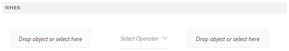

# 적응형 양식 규칙 편집기{#adaptive-forms-rule-editor}

## 개요 {#overview}

Adobe Experience Manager Forms의 규칙 편집기 기능을 사용하면 양식 비즈니스 사용자와 개발자는 적응형 양식 객체에 대한 규칙을 작성할 수 있습니다. 이러한 규칙은 양식의 사전 설정 조건, 사용자 입력 및 사용자 작업을 기반으로 양식 개체에 대해 트리거할 동작을 정의합니다. 양식 채우기 환경을 더욱 간소화하여 정확성과 속도를 보장합니다.

규칙 편집기는 규칙을 작성할 수 있는 직관적이고 간소화된 유저 인터페이스를 제공합니다. 규칙 편집기는 모든 사용자를 위한 시각적 편집기를 제공합니다. 또한 양식 파워 유저에게만 규칙 및 스크립트를 작성할 수 있는 코드 편집기를 제공합니다. 규칙을 사용하여 적응형 양식 객체에서 수행할 수 있는 주요 작업 중 일부는 다음과 같습니다.

* 개체 표시 또는 숨기기
* 개체 활성화 또는 비활성화
* 개체 값 설정
* 객체의 값 유효성 검사
* 함수를 실행하여 객체 값 계산
* 양식 데이터 모델 서비스 호출 및 작업 수행
* 개체의 속성 설정

규칙 편집기는 AEM 6.1 양식 및 이전 릴리스의 스크립팅 기능을 대체합니다. 그러나 기존 스크립트는 새 규칙 편집기에서 유지됩니다. 규칙 편집기에서 기존 스크립트를 사용한 작업에 대한 자세한 내용은 규칙 [편집기가 기존 스크립트에](../../forms/using/rule-editor.md#p-impact-of-rule-editor-on-existing-scripts-p)미치는 영향을 참조하십시오.

Forms-Power-users 그룹에 추가된 사용자는 새 스크립트를 만들고 기존 스크립트를 편집할 수 있습니다. 양식 사용자 그룹의 사용자는 스크립트를 사용할 수 있지만 스크립트를 만들거나 편집할 수는 없습니다.

## 규칙 이해 {#understanding-a-rule}

규칙은 작업과 조건의 조합입니다. 규칙 편집기에서는 양식에 있는 개체의 값을 숨기거나 표시, 활성화, 비활성화 또는 계산하는 등의 활동이 포함됩니다. 조건은 양식 객체의 상태, 값 또는 속성에 대한 검사 및 작업을 수행하여 평가되는 부울 표현식입니다. 작업은 조건을 평가하여 반환된 값( `True` 또는 `False`)을 기준으로 수행됩니다.

규칙 편집기는 규칙 작성에 도움이 되도록 시기, 표시, 숨기기, 활성화, 비활성화, 값 설정 및 유효성 검사와 같은 사전 정의된 규칙 유형을 제공합니다. 각 규칙 유형을 사용하면 규칙에서 조건 및 작업을 정의할 수 있습니다. 이 문서에서는 각 규칙 유형에 대해 자세히 설명합니다.

규칙은 일반적으로 다음 구문 중 하나를 따릅니다.

**조건** -작업 이 구문에서는 규칙이 먼저 조건을 정의하고 다음에 트리거할 작업을 정의합니다. 프로그래밍 언어의 if-then 문과 비슷합니다.

규칙 편집기에서 **When** 규칙 유형은 조건-작업 구문을 적용합니다.

**작업 조건** 이 구문에서는 규칙이 먼저 트리거할 작업을 정의하고 그 다음에 평가 조건을 정의합니다. 이 구문의 또 다른 변형은 작업-조건-대체 동작으로, 조건이 False를 반환하는 경우 트리거할 대체 동작도 정의합니다.

규칙 편집기의 표시, 숨기기, 활성화, 비활성화, 값 설정 및 유효성 검사 규칙 유형은 작업 조건 규칙 구성을 적용합니다. 기본적으로 [표시]에 대한 대체 동작은 [숨기기]이고 [활성화]는 [비활성화]입니다. 그 반대의 경우도 마찬가지입니다. 기본 대체 작업은 변경할 수 없습니다.

>[!NOTE]
>
>규칙 편집기에서 정의하는 조건 및 작업을 비롯한 사용 가능한 규칙 유형은 규칙을 만들고 있는 양식 객체의 유형에도 따라 달라집니다. 규칙 편집기에는 특정 양식 객체 유형에 대한 조건 및 작업 문을 작성하기 위한 유효한 규칙 유형과 옵션만 표시됩니다. 예를 들어, 패널 개체에 대한 유효성 검사, 값 설정, 활성화 및 비활성화 규칙 유형은 표시되지 않습니다.

규칙 편집기에서 사용할 수 있는 규칙 유형에 대한 자세한 내용은 규칙 [편집기에서](../../forms/using/rule-editor.md#p-available-rule-types-in-rule-editor-p)사용 가능한 규칙 유형을 참조하십시오.

### 규칙 구성 선택 지침 {#guidelines-for-choosing-a-rule-construct}

규칙 구조를 사용하여 대부분의 사용 사례를 얻을 수 있지만, 다음은 한 구문을 다른 구문 위에 선택하는 몇 가지 가이드라인입니다. 규칙 편집기에서 사용 가능한 규칙에 대한 자세한 내용은 규칙 [편집기에서](../../forms/using/rule-editor.md#p-available-rule-types-in-rule-editor-p)사용 가능한 규칙 유형을 참조하십시오.

* 규칙을 만들 때의 일반적인 규칙은 규칙을 작성하고 있는 개체의 컨텍스트에서 규칙을 고려하는 것입니다. 사용자가 필드 A에서 지정하는 값을 기준으로 필드 B를 숨기거나 표시하려는 경우를 고려하십시오.이 경우 필드 A에 대한 조건을 평가하고 반환 값을 기반으로 필드 B에 작업을 트리거합니다.

   따라서 필드 B(조건을 평가하는 개체)에 규칙을 작성하는 경우 조건-작업 구문이나 When 규칙 유형을 사용합니다. 마찬가지로 필드 A에서 작업 조건 구문이나 표시 또는 숨기기 규칙 유형을 사용합니다.

* 경우에 따라 한 조건에 따라 여러 작업을 수행해야 합니다. 이러한 경우 조건-동작 구조를 사용하는 것이 좋습니다. 이 구문에서는 조건을 한 번 평가하고 여러 작업 문을 지정할 수 있습니다.

   예를 들어, 필드 A에서 사용자가 지정하는 값을 확인하는 조건을 기준으로 필드 B, C 및 D를 숨기려면 조건 작업 구문으로 규칙을 하나 작성하고 필드 A의 규칙 유형을 사용하여 작업을 지정하고 필드 B, C 및 D의 가시성을 제어하는 작업을 지정합니다.그렇지 않으면, B, C, D 필드에 세 개의 별도의 규칙이 필요합니다. 여기서 각 규칙은 조건을 확인하고 각각의 필드를 표시하거나 숨깁니다. 이 예에서는 세 개의 개체에 대해 표시 또는 숨기기 규칙 유형이 아닌 한 개체에 When 규칙 유형을 쓰는 것이 더 효율적입니다.

* 여러 조건을 기반으로 동작을 트리거하려면 작업 조건 구성을 사용하는 것이 좋습니다. 예를 들어 필드 B, C 및 D의 조건을 평가하여 필드 A를 표시하고 숨기려면 필드 A에서 규칙 유형 표시 또는 숨기기를 사용합니다.
* 규칙에 하나의 조건에 대한 작업이 포함된 경우 조건-작업 또는 작업 조건 구문을 사용합니다.
* 규칙이 조건을 확인하고 필드에 값을 제공하거나 필드를 종료할 때 즉시 작업을 수행하는 경우 조건이 평가되는 필드에 조건 작업 구성이나 규칙 유형을 사용하여 규칙을 작성하는 것이 좋습니다.
* When 규칙의 조건은 사용자가 When 규칙이 적용되는 객체의 값을 변경하면 평가됩니다. 하지만 값을 미리 채우는 경우와 같이 서버 측에서 값이 변경될 때 동작을 트리거하려면 필드를 초기화할 때 작업을 트리거하는 When 규칙을 작성하는 것이 좋습니다.
* 드롭다운, 라디오 단추 또는 확인란 개체에 대한 규칙을 작성할 때 양식에 있는 이러한 양식 개체의 옵션 또는 값이 규칙 편집기에서 미리 채워집니다.

## 규칙 편집기에서 사용 가능한 연산자 유형 및 이벤트 {#available-operator-types-and-events-in-rule-editor}

규칙 편집기에서는 규칙을 만들 수 있는 다음과 같은 논리 연산자와 이벤트를 제공합니다.

* **같음**
* **같지 않음**
* **다음으로 시작**
* **다음으로 끝남**
* **포함하는 항목**
* **비어 있음**
* **비어 있지 않음**
* **선택됨:** 사용자가 확인란, 드롭다운, 라디오 단추에 대한 특정 옵션을 선택하면 true를 반환합니다.
* **초기화됨(이벤트):** 양식 개체가 브라우저에서 렌더링될 때 true를 반환합니다.
* **변경됨(이벤트):** 사용자가 양식 개체에 대해 입력한 값 또는 선택한 옵션을 변경하면 true를 반환합니다.

## 규칙 편집기에서 사용 가능한 규칙 유형 {#available-rule-types-in-rule-editor}

규칙 편집기에서는 규칙을 작성하는 데 사용할 수 있는 사전 정의된 규칙 유형 집합을 제공합니다. 각 규칙 유형을 자세히 살펴보겠습니다. 규칙 편집기에서 규칙 작성에 대한 자세한 내용은 규칙 [쓰기를 참조하십시오](../../forms/using/rule-editor.md#p-write-rules-p).

### 화이트보드 {#whenruletype}

규칙 **유형이** **조건-작업 대체 작업** 규칙 구조를 따르거나, 경우에 따라 **조건-작업** 구성만 따릅니다. 이 규칙 유형에서는 먼저 평가 조건을 지정하고 조건이 충족되면 트리거할 작업( `True`)을 지정합니다. When 규칙 유형을 사용하는 동안 여러 AND 및 OR 연산자를 사용하여 [중첩된 표현식을](#nestedexpressions)만들 수 있습니다.

When 규칙 유형을 사용하면 양식 개체에 대한 조건을 평가하고 하나 이상의 개체에 대해 작업을 수행할 수 있습니다.

일반적인 When 규칙은 다음과 같이 구성됩니다.

`When on Object A:`

`(Condition 1 AND Condition 2 OR Condition 3) is TRUE;`

`Then, do the following:`

개체 B에 대한 동작 2;개체 C에 대한 ANDAction 3;

_

라디오 단추 또는 목록과 같은 다중 값 구성 요소가 있는 경우 해당 구성 요소에 대한 규칙을 만들 때 옵션이 자동으로 검색되고 규칙 작성자가 사용할 수 있게 됩니다. 옵션 값을 다시 입력할 필요는 없습니다.

예를 들어, 목록에는 다음 네 가지 옵션이 있습니다.빨강, 파랑, 녹색, 노랑. 규칙을 만드는 동안 옵션(라디오 단추)이 자동으로 검색되고 다음과 같이 규칙 작성자가 사용할 수 있게 됩니다.


When 규칙을 작성하는 동안 Clear Value Of 작업을 트리거할 수 있습니다. 값 지우기 작업을 수행하면 지정된 개체의 값이 지워집니다. When 문의 선택 사항으로 값을 지우면 여러 필드가 있는 복잡한 조건을 만들 수 있습니다.


**숨기기** 지정된 개체를 숨깁니다.

**표시** 지정된 개체를 표시합니다.

**활성화** 지정된 객체를 활성화합니다.

**비활성화** 지정된 개체를 비활성화합니다.

**서비스** 호출 양식 데이터 모델로 구성된 서비스를 호출합니다. 서비스 호출 작업을 선택하면 필드가 나타납니다. 필드를 탭하면 AEM 인스턴스의 모든 양식 데이터 모델에 구성된 모든 서비스가 표시됩니다. 양식 데이터 모델 서비스를 선택하면 지정된 서비스에 대한 입력 및 출력 매개 변수를 사용하여 양식 객체를 매핑할 수 있는 추가 필드가 나타납니다. 양식 데이터 모델 서비스 호출에 대한 예제 규칙을 참조하십시오.

양식 데이터 모델 서비스 외에도 직접 WSDL URL을 지정하여 웹 서비스를 호출할 수 있습니다. 그러나 양식 데이터 모델 서비스에는 많은 이점이 있으며 서비스를 호출하는 데 권장되는 방법이 있습니다.

양식 데이터 모델에서 서비스 구성에 대한 자세한 내용은 AEM Forms 데이터 [통합을 참조하십시오](/help/forms/using/data-integration.md).

**값 설정** 지정된 개체의 값을 계산하고 설정합니다. 객체 값을 문자열, 다른 객체의 값, 수학 표현식 또는 함수를 사용하여 계산된 값, 객체의 속성 값 또는 구성된 양식 데이터 모델 서비스의 출력 값으로 설정할 수 있습니다. 웹 서비스 옵션을 선택하면 AEM 인스턴스의 모든 양식 데이터 모델에 구성된 모든 서비스가 표시됩니다. 양식 데이터 모델 서비스를 선택하면 지정된 서비스에 대한 입력 및 출력 매개 변수를 사용하여 양식 객체를 매핑할 수 있는 추가 필드가 나타납니다.

양식 데이터 모델에서 서비스 구성에 대한 자세한 내용은 AEM Forms 데이터 [통합을 참조하십시오](/help/forms/using/data-integration.md).

속성 **설정** 규칙 유형을 사용하면 조건 작업을 기반으로 지정된 객체의 속성 값을 설정할 수 있습니다.

규칙을 정의하여 적응형 양식에 확인란을 동적으로 추가할 수 있습니다. 사용자 지정 함수, 양식 객체 또는 객체 속성을 사용하여 규칙을 정의할 수 있습니다.


사용자 지정 함수를 기반으로 규칙을 정의하려면 **드롭다운 목록에서** 함수 출력을 선택하고 함수 **탭에서 사용자 지정 함수를 드래그하여** 놓습니다. 조건 작업이 충족되면 사용자 지정 함수에 정의된 확인란 수가 적응형 양식에 추가됩니다.

양식 개체를 기반으로 규칙을 정의하려면 **드롭다운 목록에서 양식** 개체를 선택하고 양식 개체 **탭에서 양식 개체를 드래그하여** 놓습니다. 조건 작업이 충족되면 양식 객체에 정의된 확인란 수가 적응형 양식에 추가됩니다.

개체 속성을 기반으로 하는 속성 설정 규칙을 사용하면 적응형 양식에 포함된 다른 개체 속성을 기반으로 적응형 양식의 확인란 수를 추가할 수 있습니다.

다음 그림은 적응형 양식의 드롭다운 목록 수에 따라 확인란을 동적으로 추가하는 예를 보여 줍니다.


**값 지우기지정된** 개체의 값을 지웁니다.

**초점** 설정 지정된 개체에 초점을 설정합니다.

**양식** 저장양식을 저장합니다.

**양식** 제출양식을 제출합니다.

**양식 재설정** 양식을 재설정합니다.

**양식 유효성** 확인 양식의 유효성을 확인합니다.

**인스턴스** 추가 지정된 반복 가능한 패널 또는 테이블 행의 인스턴스를 추가합니다.

**인스턴스** 제거 지정된 반복 가능한 패널 또는 테이블 행의 인스턴스를 제거합니다.

**다른 대화형 통신, 적응형 양식, 이미지 또는 문서 조각과 같은 기타 자산 또는 외부 URL로 이동합니다** . 자세한 내용은 대화형 [통신에 추가 단추를 참조하십시오](../../forms/using/create-interactive-communication.md#addbuttontothewebchannel).

### 값 설정 - {#set-value-of}

규칙 **[!UICONTROL 유형의 값]** 설정을 사용하면 지정된 조건을 충족하는지 여부에 따라 양식 객체의 값을 설정할 수 있습니다. 이 값은 다른 개체의 값, 리터럴 문자열, 수학 표현식 또는 함수에서 파생된 값, 다른 개체의 속성 값 또는 양식 데이터 모델 서비스의 출력으로 설정할 수 있습니다. 마찬가지로, 함수 또는 수학 표현식에서 파생된 구성 요소, 문자열, 속성 또는 값에 대한 조건을 확인할 수 있습니다.

[규칙 값 설정] 유형은 패널 및 도구 모음 버튼과 같은 일부 양식 객체에는 사용할 수 없습니다. 규칙의 표준 세트 값은 다음과 같은 구조를 가집니다.


개체 A의 값을 다음으로 설정:

(ABC) OR(object property X of Object C) OR(함수에서 얻은 값) OR(수학 표현식의 값) OR(데이터 모델 서비스 또는 웹 서비스의 출력 값);

시기(선택 사항):

(조건 1, 조건 2 및 조건 3)은 true


다음 예제에서는 `dependentid` 필드의 값을 입력으로 가져와서 `Relation` 양식 데이터 모델 서비스의 `Relation` `getDependent` 인수 출력 값으로 필드의 값을 설정합니다.


양식 데이터 모델 서비스를 사용한 값 설정 규칙 예

>[!NOTE]
>
>또한, 규칙 값 설정을 사용하여 양식 데이터 모델 서비스 또는 웹 서비스의 출력에서 드롭다운 목록 구성 요소의 모든 값을 채울 수 있습니다. 그러나 선택한 출력 인수가 배열 유형인지 확인하십시오. 배열에서 반환되는 모든 값은 지정된 드롭다운 목록에서 사용할 수 있게 됩니다.

### 표시 {#show}

표시 **규칙** 유형을 사용하면 조건을 충족하는지 여부에 따라 양식 개체를 표시하거나 숨기는 규칙을 작성할 수 있습니다. 표시 규칙 유형은 조건이 충족되지 않거나 반환되는 경우 숨기기 작업도 트리거합니다 `False`.

일반적인 표시 규칙은 다음과 같이 구성됩니다.


`Show Object A;`

`When:`

`(Condition 1 OR Condition 2 OR Condition 3) is TRUE;`

`Else:`

`Hide Object A;`


### 숨기기 {#hide}

표시 규칙 유형과 유사하게, **숨기기** 규칙 유형을 사용하여 조건이 충족되었는지 여부에 따라 양식 개체를 표시하거나 숨길 수 있습니다. 또한 숨기기 규칙 유형은 조건이 충족되지 않거나 반환될 경우 표시 작업을 트리거합니다 `False`.

일반적인 숨기기 규칙은 다음과 같이 구성됩니다.


`Hide Object A;`

`When:`

`(Condition 1 AND Condition 2 AND Condition 3) is TRUE;`

`Else:`

`Show Object A;`


### 사용 {#enable}

규칙 **활성화** 유형을 사용하면 조건이 충족되었는지 여부에 따라 양식 객체를 활성화하거나 비활성화할 수 있습니다. 규칙 활성화 유형은 조건이 충족되지 않거나 반환되는 경우 비활성화 작업도 트리거합니다 `False`.

일반적인 활성화 규칙은 다음과 같이 구성됩니다.


`Enable Object A;`

`When:`

`(Condition 1 AND Condition 2 AND Condition 3) is TRUE;`

`Else:`

`Disable Object A;`


### 사용 안함 {#disable}

규칙 활성화 유형과 유사한 **비활성화** 규칙 유형을 사용하면 조건이 충족되었는지 여부에 따라 양식 객체를 활성화하거나 비활성화할 수 있습니다. 조건 사용 안 함 규칙 유형은 조건이 충족되지 않거나 반환되는 경우 활성화 작업을 트리거합니다 `False`.

일반적인 비활성화 규칙은 다음과 같이 구성됩니다.


`Disable Object A;`

`When:`

`(Condition 1 OR Condition 2 OR Condition 3) is TRUE;`

`Else:`

`Enable Object A;`

### 유효성 검사 {#validate}

유효성 **검사** 규칙 유형은 표현식을 사용하여 필드의 값을 검증합니다. 예를 들어 이름을 지정하는 텍스트 상자에 특수 문자나 숫자가 포함되어 있지 않은지 확인하는 표현식을 작성할 수 있습니다.

일반적인 유효성 검사 규칙은 다음과 같이 구성됩니다.

`Validate Object A;`

`Using:`

`(Expression 1 AND Expression 2 AND Expression 3) is TRUE;`

>[!NOTE]
>
>지정한 값이 유효성 검사 규칙을 준수하지 않는 경우 사용자에게 유효성 검사 메시지를 표시할 수 있습니다. 세로 막대의 구성 요소 **[!UICONTROL 속성에 있는 스크립트 유효성 검사 메시지]** 필드에 메시지를 지정할 수 있습니다.


### Set Options Of {#setoptionsof}

규칙 **유형의 설정** 옵션을 사용하면 규칙을 정의하여 적응형 양식에 확인란을 동적으로 추가할 수 있습니다. 양식 데이터 모델 또는 사용자 지정 함수를 사용하여 규칙을 정의할 수 있습니다.

사용자 지정 함수를 기반으로 규칙을 정의하려면 **드롭다운 목록에서** 함수 출력을 선택하고 함수 **탭에서 사용자 지정 함수를 드래그하여** 놓습니다. 사용자 지정 함수에 정의된 확인란 수가 응용 양식에 추가됩니다.


사용자 지정 함수를 만들려면 규칙 편집기에서 [사용자 지정 함수를 참조하십시오](#custom-functions).

양식 데이터 모델을 기반으로 규칙을 정의하려면

1. 드롭다운 **목록에서** 서비스 출력을 선택합니다.
1. 데이터 모델 개체를 선택합니다.
1. 디스플레이 값(Display Value) **드롭다운 목록에서 데이터 모델** 객체 속성을 선택합니다. 응용 양식의 확인란 수는 데이터베이스의 해당 속성에 대해 정의된 인스턴스 수에서 파생됩니다.
1. 값 저장 **드롭다운 목록에서 데이터 모델 개체** 속성을 선택합니다.


## 규칙 편집기 사용자 인터페이스 이해 {#understanding-the-rule-editor-user-interface}

규칙 편집기는 규칙을 작성하고 관리할 수 있는 포괄적이고 간단한 사용자 인터페이스를 제공합니다. 작성 모드에서 적응형 양식 내에서 규칙 편집기 사용자 인터페이스를 실행할 수 있습니다.

규칙 편집기 사용자 인터페이스를 시작하려면 다음을 수행합니다.

1. 작성 모드에서 응용 양식을 엽니다.
1. 규칙을 작성할 양식 개체를 누르고 구성 요소 도구 모음에서 탭합니다. 규칙 편집기 사용자 인터페이스가 나타납니다.

   

   선택한 양식 개체의 기존 규칙이 이 보기에 나열됩니다. 기존 규칙 관리에 대한 자세한 내용은 규칙 [관리를](../../forms/using/rule-editor.md#p-manage-rules-p)참조하십시오.

1. 만들기를 **[!UICONTROL 눌러]** 새 규칙을 작성합니다. 규칙 편집기 사용자 인터페이스의 시각적 편집기는 규칙 편집기를 처음 실행할 때 기본적으로 열립니다.
[ 

   확대된 이미지를 보려면 클릭

   ](assets/rule-editor-ui-1.png)규칙 편집기 UI의 각 구성 요소를 자세히 살펴보겠습니다.

### A.구성 요소 규칙 표시 {#a-component-rule-display}

규칙 편집기를 실행한 적응형 양식 개체의 제목과 현재 선택된 규칙 유형을 표시합니다. 위의 예에서, 규칙 편집기는 봉급이라는 적응형 양식 객체에서 시작되며 선택한 규칙 유형은 언제입니다.

### B. Form objects and functions {#b-form-objects-and-functions-br}

규칙 편집기 사용자 인터페이스의 왼쪽에 있는 창에는 양식 **[!UICONTROL 개체]** 및 **[!UICONTROL 함수]**.

양식 객체 탭에는 적응형 양식에 포함된 모든 객체의 계층 보기가 표시됩니다. 개체의 제목과 유형이 표시됩니다. 규칙을 작성할 때 양식 개체를 규칙 편집기에 드래그하여 놓을 수 있습니다. 개체 또는 함수를 자리 표시자로 드래그하여 놓을 때 규칙을 만들거나 편집하는 동안 자리 표시자는 자동으로 적절한 값 유형을 사용합니다.

하나 이상의 유효한 규칙이 적용된 양식 개체는 녹색 점으로 표시됩니다. 양식 개체에 적용된 규칙 중 하나라도 잘못된 경우 양식 개체가 노란색 점으로 표시됩니다.

[함수] 탭에는 합계, 최소값, 최대값, 평균값, 개수 및 유효성 검사와 같은 내장 함수 세트가 포함되어 있습니다. 이러한 함수를 사용하여 반복 가능한 패널과 테이블 행에서 값을 계산하고 규칙을 작성할 때 작업 및 조건 문에서 사용할 수 있습니다. 그러나 [사용자 정의 함수를](#custom-functions) 만들 수도 있습니다.


>[!NOTE]
>
>[양식 개체 및 함수] 탭에서 개체와 함수 이름 및 제목에 대해 텍스트 검색을 수행할 수 있습니다.

양식 개체의 왼쪽 트리에서 양식 개체를 눌러 각 개체에 적용된 규칙을 표시할 수 있습니다. 다양한 양식 개체의 규칙을 탐색할 뿐만 아니라 양식 객체 간에 규칙을 복사하여 붙여넣을 수도 있습니다. 자세한 내용은 복사- [붙여넣기 규칙을](../../forms/using/rule-editor.md#p-copy-paste-rules-p)참조하십시오.

### C. 양식 개체 및 함수 전환 {#c-form-objects-and-functions-toggle-br}

토글 단추를 누르면 양식 개체 및 함수 창이 전환됩니다.

### D.시각적인 규칙 편집기 {#d-visual-rule-editor}

시각적인 규칙 편집기는 규칙을 작성하는 규칙 편집기 사용자 인터페이스의 시각적 편집기 모드에서 사용되는 영역입니다. 규칙 유형을 선택하고 그에 따라 조건 및 작업을 정의할 수 있습니다. 규칙에서 조건 및 작업을 정의할 때 양식 개체 및 함수 창에서 양식 개체 및 함수를 드래그하여 놓을 수 있습니다.

시각적인 규칙 편집기 사용에 대한 자세한 내용은 규칙 [쓰기를](../../forms/using/rule-editor.md#p-write-rules-p)참조하십시오.

### E.시각적 코드 편집기 전환기 {#e-visual-code-editors-switcher}

양식 파워 유저 그룹의 사용자는 코드 편집기에 액세스할 수 있습니다. 다른 사용자의 경우 코드 편집기를 사용할 수 없습니다. 권한이 있는 경우 규칙 편집기 바로 위의 전환기를 사용하여 시각적인 편집기 모드에서 규칙 편집기의 코드 편집기 모드로 전환하거나 그 반대로 전환할 수 있습니다. 규칙 편집기를 처음 실행하면 시각적인 편집기 모드에서 열립니다. 시각적인 편집기 모드에서 규칙을 작성하거나 코드 편집기 모드로 전환하여 규칙 스크립트를 작성할 수 있습니다. 그러나 코드 편집기에서 규칙을 수정하거나 규칙을 작성한 경우 코드 편집기를 지우지 않으면 해당 규칙의 시각적 편집기로 다시 전환할 수 없습니다.

AEM Forms는 마지막으로 규칙을 작성하는 데 사용한 규칙 편집기 모드를 추적합니다. 다음에 규칙 편집기를 실행하면 해당 모드로 열립니다. 그러나 기본 모드를 구성하여 지정된 모드에서 규칙 편집기를 열 수도 있습니다. 이렇게 하려면 다음을 수행하십시오.

1. 의 AEM 웹 콘솔로 `https://[host]:[port]/system/console/configMgr`이동합니다.
1. 응용 양식 구성 **[!UICONTROL 서비스를 편집하려면 클릭하십시오]**.
1. 규칙 **[!UICONTROL 편집기의 기본]** **[!UICONTROL 모드]** 드롭다운에서 **[!UICONTROL 시각적 편집기]** 또는 코드 편집기선택

1. **[!UICONTROL 저장]**&#x200B;을 클릭합니다.

### F.완료 및 취소 단추 {#f-done-and-cancel-buttons}

완료 **[!UICONTROL 단추를]** 사용하여 규칙을 저장합니다. 불완전한 규칙을 저장할 수 있습니다. 하지만 불완전한 것은 유효하지 않으며 실행되지 않습니다. 양식 개체에 저장된 규칙은 다음에 동일한 양식 개체에서 규칙 편집기를 실행할 때 나열됩니다. 해당 보기에서 기존 규칙을 관리할 수 있습니다. 자세한 내용은 규칙 [관리를](../../forms/using/rule-editor.md#p-manage-rules-p)참조하십시오.

[ **[!UICONTROL 취소]** ] 단추를 사용하면 규칙 변경 내용이 모두 삭제되고 규칙 편집기가 닫힙니다.

## 규칙 작성 {#write-rules}

시각적인 규칙 편집기 또는 코드 편집기를 사용하여 규칙을 작성할 수 있습니다. 규칙 편집기를 처음 실행하면 시각적인 편집기 모드에서 열립니다. 코드 편집기 모드 및 쓰기 규칙으로 전환할 수 있습니다. 그러나 코드 편집기에서 규칙을 작성하거나 수정하는 경우 코드 편집기를 지우지 않으면 해당 규칙의 시각적 편집기로 전환할 수 없습니다. 다음에 규칙 편집기를 실행하면 마지막으로 규칙을 만드는 데 사용한 모드에서 열립니다.

먼저 시각적인 편집기를 사용하여 규칙을 작성하는 방법을 살펴보겠습니다.

### 시각적 편집기 사용 {#using-visual-editor}

다음 예제 양식을 사용하여 시각적인 편집기에서 규칙을 만드는 방법을 알아보겠습니다.


대출 신청 양식의 대출 요건 섹션에서는 지원자가 혼인 상태, 임금 및 결혼한 경우 배우자의 급여를 명시해야 합니다. 사용자 입력에 따라 규칙이 대출 자격 금액을 계산하고 대출 자격 필드에 표시됩니다. 다음 규칙을 적용하여 시나리오를 구현합니다.

* 배우자의 임금 필드는 혼인 상태가 결혼한 경우에만 표시됩니다.
* 대출 자격 금액은 전체 봉급의 50%이다.

규칙을 작성하려면 다음 단계를 수행하십시오.

1. 우선, 혼인 상태(Martial Status) 라디오 단추에 대해 사용자가 선택한 옵션을 기반으로 배우자 임금 필드의 가시성을 제어하는 규칙을 작성하십시오.

   작성 모드에서 대출 신청 양식을 엽니다. 혼인 상태 **구성 요소를** 누르고 누릅니다. 그런 다음 만들기를 **[!UICONTROL 눌러]** 규칙 편집기를 실행합니다.

   

   규칙 편집기를 실행하면 기본적으로 When 규칙이 선택됩니다. 또한, 규칙 편집기를 실행한 양식 객체(이 경우 혼인 상태)는 When 문에 지정됩니다.

   선택한 개체를 변경하거나 수정할 수는 없지만, 아래와 같이 규칙 드롭다운을 사용하여 다른 규칙 유형을 선택할 수 있습니다. 다른 개체에 대한 규칙을 만들려면 취소를 눌러 규칙 편집기를 종료한 다음 원하는 양식 개체에서 다시 시작합니다.

1. 상태 **[!UICONTROL 선택]** 드롭다운을 누르고 다음과 **[!UICONTROL 같음을]**&#x200B;선택합니다. 문자열 **[!UICONTROL 입력]** 필드가 나타납니다.

   

   [혼인 상태] 라디오 단추에서 **기혼** 및 **단일** 옵션은 **각각** 0 **및** 1값이지정됩니다. 아래에 표시된 대로 [편집] 라디오 단추 대화 상자의 [제목] 탭에서 할당된 값을 확인할 수 있습니다.

   

1. 규칙의 **문자열** 입력 필드에서 **0을 지정합니다**.

   

   조건을 `When Marital Status is equal to Married`로 정의했습니다. 그런 다음 이 조건이 True인 경우 수행할 작업을 정의합니다.

1. Then 문의 작업 **[!UICONTROL 선택]** 드롭다운에서 **[!UICONTROL 표시를]** 선택합니다.

   

1. 객체 삭제 **객체의 양식 객체** 탭에서 배우자 임금 필드를 **끌어 놓거나 여기** 필드를 선택합니다. 또는, **객체 드롭을 누르거나** 이 **필드를 선택하고** 팝업 메뉴에서배우자 임금 필드를 선택합니다. 그러면 양식에 있는 모든 양식 객체가 나열됩니다.

   

   규칙은 규칙 편집기에 다음과 같이 나타납니다.

   

   완료를 **눌러** 규칙을 저장합니다.

1. 1단계부터 5단계까지 반복하여 혼인 상태가 1인 경우 배우자 임금 필드를 숨기는 다른 규칙을 정의합니다. 규칙은 규칙 편집기에 다음과 같이 나타납니다.

   

   >[!NOTE]
   >
   >또는 혼인 상태(혼인 상태) 필드에 두 가지 규칙 대신 배우자 임금 필드에 하나의 표시 규칙을 작성하여 동일한 행동을 실행할 수 있습니다.

   

1. 그런 다음, 전체 봉급의 50%인 대출 자격 조건을 계산하는 규칙을 작성하여 대출 자격 필드에 표시합니다. 이를 위해 대출 자격 **필드에 규칙** 값 설정을 만듭니다.

   작성 모드에서 대출 자격 **[!UICONTROL 조건]** 필드를 누르고 탭합니다. 그런 다음 만들기를 **[!UICONTROL 눌러]** 규칙 편집기를 실행합니다.

1. 규칙 **[!UICONTROL 드롭다운에서]** 규칙의 값 설정을 선택합니다.

   

1. 옵션 **[!UICONTROL 선택을]** 누르고 수학 표현식을 **[!UICONTROL 선택합니다]**. 수학 표현식을 작성할 필드가 열립니다.

   

1. 표현식 필드에서:

   * 첫 번째 삭제 객체의 급여 **필드의 양식 객체 탭에서** 을 선택하거나 **여기에서** 선택합니다.

   * 연산자 **선택** 필드에서 **플러스를** 선택합니다.

   * 다른 드롭 개체의 배우자 임금 **필드의 양식** 객체 탭에서 **끌어 놓거나 여기를** 선택합니다.
   

1. 그런 다음 표현식 필드 주위의 강조 표시된 영역을 누르고 표현식 **확장을 누릅니다**.

   

   확장 표현식 필드의 연산자 선택 **필드와 옵션 선택** 필드 ************ 에서 숫자를 선택합니다. 그런 다음 **숫자** 필드에 2를 지정합니다.

   

   >[!NOTE]
   >
   >옵션 선택 필드에서 구성 요소, 함수, 수학 표현식 및 속성 값을 사용하여 복잡한 표현식을 만들 수 있습니다.

   그런 다음 True를 반환하면 표현식이 실행되는 조건을 만듭니다.

1. 조건 **추가를** 눌러 When 문을 추가합니다.

   

   When 문:

   * 첫 번째 드롭 개체의 혼인 상태 **필드의 양식 객체 탭에서** 을 **선택하거나** 이필드를 선택합니다.

   * 연산자 선택&#x200B;**필드에서 와** 같은 **선택을** 합니다.

   * 다른 드롭 개체에서 문자열을 **선택하거나** 이 **필드를 선택하고 문자열** 입력 **필드에서** 기혼을지정합니다.
   규칙이 마지막으로 규칙 편집기에 다음과 같이 표시됩니다.  

   완료를 **눌러** 규칙을 저장합니다.

1. 7단계부터 12단계까지의 단계를 반복하여 혼인 상태가 단일일 경우 대출 자격을 계산하는 다른 규칙을 정의합니다. 규칙은 규칙 편집기에 다음과 같이 나타납니다.

   

>[!NOTE]
>
>또는, 배우자 임금 필드를 표시하거나 숨기도록 생성한 시기 규칙에서 대출 자격을 계산하기 위해 값 설정을 사용할 수 있습니다. 혼인 상태가 단일일 때 결과 결합 규칙은 규칙 편집기에 다음과 같이 나타납니다.
>
>마찬가지로, 결합 규칙을 작성하여 혼인 상태가 기혼일 때 배우자 임금 필드의 가시성을 관리하고 대출 자격을 계산할 수 있습니다.


### 코드 편집기 사용 {#using-code-editor}

Forms-Power-users 그룹에 추가된 사용자는 코드 편집기를 사용할 수 있습니다. 규칙 편집기는 시각적인 편집기를 사용하여 만드는 모든 규칙에 대한 JavaScript 코드를 자동으로 생성합니다. 시각적 편집기에서 코드 편집기로 전환하여 생성된 코드를 볼 수 있습니다. 그러나 코드 편집기에서 규칙 코드를 수정하는 경우에는 시각적 편집기로 다시 전환할 수 없습니다. 시각적인 편집기가 아닌 코드 편집기에서 규칙을 작성하려는 경우 코드 편집기에서 규칙을 새로 작성할 수 있습니다. 시각적인 코드 편집기 전환기를 사용하면 두 모드 간을 전환할 수 있습니다.

코드 편집기 JavaScript는 적응형 양식의 표현식 언어입니다. 모든 표현식은 유효한 JavaScript 표현식이며 적응형 양식 스크립팅 모델 API를 사용합니다. 이러한 표현식은 특정 유형의 값을 반환합니다. 응용 양식 클래스, 이벤트, 개체 및 공용 API의 전체 목록은 적응형 [양식에](https://helpx.adobe.com/experience-manager/6-5/forms/javascript-api/index.html)대한 JavaScript 라이브러리 API 참조를 참조하십시오.

코드 편집기에서 규칙을 작성하는 방법에 대한 자세한 내용은 적응형 양식 [표현식을 참조하십시오](/help/forms/using/adaptive-form-expressions.md).

규칙 편집기에서 JavaScript 코드를 작성하는 동안 다음과 같은 시각적 큐를 통해 구조와 구문을 사용할 수 있습니다.

* 구문 개요
* 자동 들여쓰기
* 양식 객체, 함수 및 해당 속성에 대한 힌트 및 제안
* 양식 구성 요소 이름 및 일반적인 JavaScript 함수의 자동 완성


#### 규칙 편집기의 사용자 정의 함수 {#custom-functions}

함수 출력 아래에 나열된 Sum *과* 같은 기본 기능 외에도 자주 필요한 사용자 정의 함수를 작성할 수 있습니다. 작성한 함수와 `jsdoc` 위의 함수를 함께 사용해야 합니다.

동반하는 `jsdoc` 방법은 다음과 같습니다.

* 사용자 지정 구성 및 설명을 원하는 경우
* 함수를 인 및 댓글에 선언하는 여러 가지 방법이 있으므로 함수를 추적할 수 `JavaScript,` 있습니다.

자세한 내용은 usejsdoc.org [를](https://usejsdoc.org/)참조하십시오.

지원되는 `jsdoc` 태그:

* **개인**&#x200B;구문:개인 `@private`함수는 사용자 지정 함수로 포함되지 않습니다.

* **이름**&#x200B;구문:또는 `@name funcName <Function Name>`다음을 사용할 `,` 수 있습니다. `@function funcName <Function Name>` 또는 ****`@func` 를 선택합니다 `funcName <Function Name>`.
   `funcName` 는 함수의 이름입니다(공백 허용 안 함).
   `<Function Name>` 는 함수의 표시 이름입니다.

* **멤버**&#x200B;구문:함수에 네임스페이스를 `@memberof namespace`첨부합니다.

* **매개 변수**&#x200B;구문:또는 `@param {type} name <Parameter Description>`다음을 사용할 수 있습니다. `@argument` 또는 `{type} name <Parameter Description>`****`@arg``{type}``name <Parameter Description>`...YouTube를 참조하십시오.
함수에 사용되는 매개 변수를 표시합니다. 함수에는 여러 매개 변수 태그와 각 매개 변수에 대한 태그가 있을 수 있습니다.
   `{type}` 매개 변수 유형을 나타냅니다. 허용되는 매개 변수 유형은 다음과 같습니다.

   1. 문자열
   1. 개수
   1. 부울
   다른 모든 매개 변수 유형은 위 중 하나로 분류됩니다. 지원되지 않습니다. 위의 유형 중 하나를 선택해야 합니다. 유형은 대/소문자를 구분하지 않습니다. 매개 변수에는 공백을 사용할 수 없습니다 `name`. `<Parameter Descrption>` `<parameter>  can have multiple words. </parameter>`

* **반환 유형**&#x200B;구문:또는 `@return {type}`사용할 수 `@returns {type}`있습니다.
함수(예: 목적)에 대한 정보를 추가합니다.
{type}은 함수의 반환 형식을 나타냅니다. 허용되는 반환 유형은 다음과 같습니다.

   1. 문자열
   1. 개수
   1. 부울
   다른 모든 반환 유형은 위 중 하나로 분류됩니다. 지원되지 않습니다. 위의 유형 중 하나를 선택해야 합니다. 반환 유형은 대/소문자를 구분하지 않습니다.

>[!NOTE]
>
>사용자 지정 함수가 요약에 사용되기 전의 주석입니다. 요약은 태그가 나타날 때까지 여러 줄로 확장할 수 있습니다. 규칙 빌더에서 간단한 설명을 위해 크기를 하나로 제한합니다.

**사용자 지정 함수 추가**

예를 들어 정사각형의 영역을 계산하는 사용자 지정 함수를 추가하려고 합니다. 측면 길이는 사용자 지정 함수에 대한 사용자 입력으로, 양식의 숫자 상자를 사용하여 허용됩니다. 계산된 출력이 양식의 다른 숫자 상자에 표시됩니다. 사용자 정의 함수를 추가하려면 먼저 클라이언트 라이브러리를 만든 다음 CRX 저장소에 추가해야 합니다.

다음 단계를 수행하여 클라이언트 라이브러리를 만들고 CRX 저장소에 추가합니다.

1. 클라이언트 라이브러리를 만듭니다. 자세한 내용은 클라이언트측 [라이브러리 사용을 참조하십시오](/help/sites-developing/clientlibs.md).
1. CRXDE 파섹 `categories``customfunction` `clientlib`

   >[!NOTE]
   >
   >`customfunction`는 예제 카테고리입니다. `clientlib`폴더에서 만든 범주의 이름을 선택할 수 있습니다.

CRX 저장소에 클라이언트 라이브러리를 추가한 후 적응형 양식으로 사용합니다. 사용자 지정 함수를 양식의 규칙으로 사용할 수 있습니다. 응용 형식으로 클라이언트 라이브러리를 추가하려면 다음 단계를 수행하십시오.

1. 편집 모드에서 양식을 엽니다.
편집 모드에서 양식을 열려면 양식을 선택하고 열기를 **누릅니다**.
1. 편집 모드에서 구성 요소를 선택한 다음  > 적응형 양식 **컨테이너를**&#x200B;탭한 다음 을누릅니다.
1. 세로 막대의 [클라이언트 라이브러리 이름]에서 클라이언트 라이브러리를 추가합니다. ( `customfunction` 예)

   

1. 입력 숫자 상자를 선택하고  탭하여 규칙 편집기를 엽니다.
1. 규칙 **만들기를 누릅니다**. 아래 표시된 옵션을 사용하여 양식의 출력 필드에 입력의 제곱값을 저장하는 규칙을 만듭니다.
   [ 사용자 ](assets/add-custom-rule.png)만들기완료를 **누릅니다**. 사용자 지정 함수가 추가되었습니다.

#### 함수 선언 지원 유형 {#function-declaration-supported-types}

**함수 문**

```
function area(len) {
    return len*len;
}
```

이 함수는 `jsdoc` 주석 없이 포함됩니다.

**함수 표현식**

```
var area;
//Some codes later
/** */
area = function(len) {
    return len*len;
};
```

**함수 표현식 및 문**

```
var b={};
/** */
b.area = function(len) {
    return len*len;
}
```

**함수 선언을 변수로**

```
/** */
var x1,
    area = function(len) {
        return len*len;
    },
    x2 =5, x3 =true;
```

제한:사용자 지정 함수는 변수 목록에서 첫 번째 함수 선언만 선택합니다(함께 있는 경우). 선언된 모든 함수에 함수 표현식을 사용할 수 있습니다.

**함수 선언을 개체로**

```
var c = {
    b : {
        /** */
        area : function(len) {
            return len*len;
        }
    }
};
```

>[!NOTE]
>
>모든 사용자 정의 함수에 `jsdoc` 대해 사용해야 합니다. 주석이 `jsdoc`권장되지만 빈 `jsdoc`주석을 포함하여 함수를 사용자 지정 함수로 표시합니다. 사용자 지정 함수의 기본 처리를 활성화합니다.

## 규칙 관리 {#manage-rules}

개체를 누르고 누르면 양식 개체의 기존 규칙이 나열됩니다. 제목과 규칙 요약을 미리 볼 수 있습니다. 또한 UI를 사용하여 전체 규칙 요약을 확장 및 보고, 규칙 순서를 변경하고, 규칙을 편집하고, 규칙을 삭제할 수 있습니다.


규칙에 대해 다음 작업을 수행할 수 있습니다.

* **확장/축소**:규칙 목록의 컨텐츠 열에는 규칙 컨텐츠가 표시됩니다. 기본 보기에 전체 규칙 컨텐츠가 표시되지 않으면  눌러 확장합니다.

* **순서 바꾸기**:새로 만드는 규칙은 규칙 목록 하단에 스택됩니다. 규칙은 위에서 아래로 실행됩니다. 맨 위의 규칙은 먼저 실행된 후 같은 유형의 다른 규칙을 실행합니다. 예를 들어, [시기], [표시], [활성화] 및 [규칙]이 각각 맨 위의 첫 번째, 두 번째, 세 번째 및 네 번째 위치에 있는 경우 맨 위의 [시기] 규칙이 먼저 실행된 후 네 번째 위치에 있는 [시기] 규칙이 실행됩니다. 그런 다음 표시 및 활성화 규칙이 실행됩니다.
규칙에 대한  탭하거나 목록에서 원하는 순서로 드래그하여 규칙 순서를 변경할 수 있습니다.

* **편집**:규칙을 편집하려면 규칙 제목 옆에 있는 확인란을 선택합니다. 규칙을 편집하고 삭제하는 추가 옵션이 나타납니다. 편집을 **눌러** 규칙 편집기에서 선택한 규칙을 여는 데 사용되는 모드에 따라 시각적인 또는 코드 편집기 모드에서 규칙을 엽니다.

* **삭제**:규칙을 삭제하려면 규칙을 선택하고 삭제를 **누릅니다**.

* **활성화/비활성화**:규칙 사용을 일시 중단해야 할 수 있습니다. 하나 이상의 규칙을 선택하고 [작업] 도구 모음에서 [비활성화]를 탭하여 비활성화할 수 있습니다. 규칙이 비활성화된 경우 런타임에서 실행되지 않습니다. 비활성화된 규칙을 활성화하려면 규칙을 선택하고 작업 도구 모음에서 활성화를 탭할 수 있습니다. 규칙의 상태 열에는 규칙의 활성화 여부를 표시합니다.


## 규칙 복사-붙여넣기 {#copy-paste-rules}

한 필드에서 다른 유사한 필드로 규칙을 복사하여 붙여 넣으면 시간을 절약할 수 있습니다.

규칙을 복사하여 붙여넣으려면 다음을 수행합니다.

1. 규칙을 복사할 양식 객체를 누르고 구성 요소 도구 모음에서 누릅니다. 규칙 편집기 사용자 인터페이스가 나타나고 양식 개체가 선택되고 기존 규칙이 나타납니다.

   

   기존 규칙 관리에 대한 자세한 내용은 규칙 [관리를](../../forms/using/rule-editor.md#p-manage-rules-p)참조하십시오.

1. 규칙 제목 옆에 있는 확인란을 선택합니다. 규칙을 관리하기 위한 추가 옵션이 나타납니다. 복사를 **누릅니다**.

   

1. 규칙을 붙여 넣을 다른 양식 개체를 선택하고 붙여넣기를 **누릅니다**. 또한 규칙을 편집하여 변경할 수 있습니다.

   >[!NOTE]
   >
   >양식 객체가 복사된 규칙의 이벤트를 지원하는 경우에만 다른 양식 객체에 규칙을 붙여넣을 수 있습니다. 예를 들어, 단추는 클릭 이벤트를 지원합니다. 클릭 이벤트가 있는 규칙을 단추에 붙여넣을 수는 있지만 체크 상자는 붙여넣을 수는 없습니다.

1. 완료를 **눌러** 규칙을 저장합니다.

## 중첩된 표현식 {#nestedexpressions}

규칙 편집기를 사용하면 여러 AND 및 OR 연산자를 사용하여 중첩된 규칙을 만들 수 있습니다. 여러 AND 및 OR 연산자를 규칙에 혼합할 수 있습니다.

다음은 필요한 조건이 충족될 때 자녀의 양육에 대한 자격 조건에 대한 메시지를 사용자에게 표시하는 중첩 규칙의 예입니다.


규칙 내에서 조건을 드래그하여 놓아 편집할 수도 있습니다. 조건 앞에 있는 핸들( )을 누르고 마우스로 가리킵니다. 포인터가 아래와 같이 손 심볼로 바뀌면 규칙 내의 아무 곳에나 조건을 드래그하여 놓습니다. 규칙 구조가 변경됩니다.


## 날짜 식 조건 {#dateexpression}

규칙 편집기를 사용하면 날짜 비교를 사용하여 조건을 만들 수 있습니다.

다음은 주택 담보가 이미 설정된 경우 정적 텍스트 개체를 표시하는 조건이며, 이 조건은 날짜 필드를 채워 나타냅니다.

사용자가 입력한 속성의 저당 날짜가 과거일 경우 적응형 양식에는 소득 계산에 대한 메모가 표시됩니다. 다음 규칙은 사용자가 입력한 날짜를 현재 날짜와 비교하고 사용자가 입력한 날짜가 현재 날짜보다 이전인 경우 양식에 텍스트 메시지(소득이라는 이름)가 표시됩니다.


채워진 날짜가 현재 날짜보다 이전이면 양식에 다음과 같이 텍스트 메시지(소득)가 표시됩니다.


## 숫자 비교 조건 {#number-comparison-conditions}

규칙 편집기를 사용하면 두 숫자를 비교하는 조건을 만들 수 있습니다.

다음은 신청인이 현재 주소에 머물고 있는 월 수가 36개월 미만인 경우 정적 텍스트 개체를 표시하는 조건입니다.


사용자가 36개월 미만의 현재 거주 주소를 사용하였음을 확인하면 이 양식에는 추가 거주지를 요청할 수 있다는 알림이 표시됩니다.


## 규칙 편집기가 기존 스크립트에 미치는 영향 {#impact-of-rule-editor-on-existing-scripts}

AEM Forms 6.1 Forms 기능 팩 1 이전 버전에서 양식 작성자 및 개발자는 구성 요소 편집 대화 상자의 스크립트 탭에서 표현식을 작성하여 적응형 양식에 동적 동작을 추가하는 데 사용됩니다. 이제 스크립트 탭이 규칙 편집기로 바뀝니다.

스크립트 탭에서 작성해야 하는 스크립트 또는 표현식은 규칙 편집기에서 사용할 수 있습니다. 시각적 편집기에서 보거나 편집할 수 없지만 양식 파워 유저 그룹의 일부인 경우 코드 편집기에서 스크립트를 편집할 수 있습니다.

## 예제 규칙 {#example}

### Invoke form data model service {#invoke}

대출 금액, 재직 기간 및 신청자의 신용 점수를 입력으로 `GetInterestRates` 받아 EMI 금액 및 이자율 등 대출 계획을 반환하는 웹 서비스를 고려해 보십시오. 웹 서비스를 데이터 소스로 사용하여 양식 데이터 모델을 만듭니다. 데이터 모델 개체 및 서비스를 양식 모델에 추가합니다. `get` 서비스는 양식 데이터 모델의 서비스 탭에 나타납니다. 그런 다음 데이터 모델 개체의 필드를 포함하는 적응형 양식을 만들어 대출 금액, 재직 기간 및 신용 점수에 대한 사용자 입력을 캡처합니다. 웹 서비스를 트리거하여 계획 세부 정보를 가져오는 단추를 추가합니다. 출력은 해당 필드에 채워집니다.

다음 규칙은 Invoke 서비스 작업을 구성하여 예제 시나리오를 수행하는 방법을 보여줍니다.


적응형 양식 규칙을 사용하여 양식 데이터 모델 서비스 호출

### When 규칙을 사용하여 여러 작업 트리거 {#triggering-multiple-actions-using-the-when-rule}

대출 신청 양식에서는 대출 신청자가 기존 고객인지 여부를 캡처하려고 합니다. 사용자가 제공하는 정보를 기반으로 고객 ID 필드를 표시하거나 숨겨야 합니다. 또한 사용자가 기존 고객인 경우 고객 ID 필드에 초점을 맞추려고 합니다. 대출 신청 양식에는 다음 구성 요소가 있습니다.

* 라디오 단추, **기존 Geometrixx 고객이십니까?**&#x200B;에 있는 값 중 하나를 선택합니다. [예]의 값은 **0이고** [아니요]는 **1입니다**.

* 고객 ID를 **지정하는 텍스트**&#x200B;필드 Geometrixx 고객 ID입니다.

라디오 단추에서 이 동작을 구현할 때 규칙을 작성할 때 시각적인 규칙 편집기에 규칙이 다음과 같이 나타납니다.  

시각적인 편집기의 규칙

예제 규칙에서 When 섹션의 문은 조건이며 True를 반환하면 Then 섹션에 지정된 작업을 실행합니다.

규칙은 코드 편집기에 다음과 같이 나타납니다.


코드 편집기의 규칙

### 규칙에서 함수 출력 사용 {#using-a-function-output-in-a-rule}

구매 주문서 양식에는 사용자가 주문을 입력할 수 있는 다음 테이블이 있습니다. 다음 표에서:

* 첫 번째 행은 반복 가능하므로 사용자는 여러 제품을 주문하고 다른 수량을 지정할 수 있습니다. 요소 이름은 `Row1`입니다.
* 반복 가능한 행의 제품 수량 열에 있는 셀의 제목은 수량입니다. 이 셀의 요소 이름은 `productquantity`입니다.
* 표의 두 번째 행은 반복 가능하지 않으며 이 행의 제품 수량 열에 있는 셀의 제목은 총 수량입니다.


**A.** 행 1 **B.** 수량 **C.** 총 수량

이제 모든 제품의 제품 수량 열에 지정된 수량을 추가하고 합계 수량 셀에 합계를 표시하려는 경우 다음과 같이 총 수량 셀에 규칙의 값 집합을 작성하여 이를 얻을 수 있습니다.


시각적인 편집기의 규칙

규칙은 코드 편집기에 다음과 같이 나타납니다.


코드 편집기의 규칙

### 표현식을 사용하여 필드 값 유효성 검사 {#validating-a-field-value-using-expression}

이전 예에서 설명한 구매 발주 양식에서는 사용자가 10000개 이상의 가격이 책정된 제품의 수량을 두 개 이상 주문하지 못하도록 제한할 수 있습니다. 이렇게 하려면 아래와 같이 유효성 검사 규칙을 작성할 수 있습니다.


시각적인 편집기의 규칙

규칙은 코드 편집기에 다음과 같이 나타납니다.


코드 편집기의 규칙

