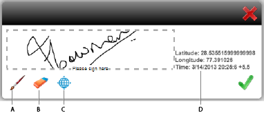

# HTML5 양식에서 스크리블 서명 사용{#using-scribble-signature-in-html-forms}

HTML5 양식은 터치 디바이스에서 점점 더 많이 사용되고 있으며, 한 가지 일반적인 요구사항은 서명을 지원하는 것입니다. 스크라이빙(스타일러스 또는 손가락으로 쓰기)은 모바일 장치에서 양식에 서명하는 허용되는 방법이 되고 있습니다. 이제 HTML 5 Forms 및 Forms Designer을 사용하여 양식에 스크리블 서명 필드를 사용할 수 있습니다. 브라우저에서 양식을 렌더링하면 스타일러스, 마우스 또는 터치를 사용하여 이러한 필드에 로그인할 수 있습니다.

## 스크리블 서명 필드를 사용하여 양식을 디자인하는 방법 {#how-to-design-a-form-using-scribble-signature-field}

1. Forms Designer에서 양식을 엽니다.
1. 페이지에서 서명 스크리블 필드를 끌어서 놓습니다.

   

   >[!NOTE]
   >
   >Forms Designer에서 선택한 필드의 Dimension은 필드가 렌더링될 때 반영됩니다. 그러나 렌더링된 서명 상자의 차원은 Forms Designer에 지정된 차원이 아니라 필드의 종횡비를 기반으로 계산됩니다.

1. 서명 스크리블 필드를 구성합니다.

   서명 스크리블 필드는 기본적으로 iPad에서 서명 프로세스 중에 지리적 위치 정보를 필수로 표시합니다(다른 장치에서는 선택 사항). `geoLocMandatoryOnIpad` 속성의 값을 변경하여 이 기본 동작을 재정의할 수 있습니다. 이 속성은 서명 스크리블 필드에 엑스트라로 표시됩니다. 수정하는 단계는 다음과 같습니다.

   1. 양식에서 서명 스크리블 필드를 선택합니다.
   1. **XML Source** 탭을 선택합니다.

      >[!NOTE]
      >
      >XML Source 탭을 열려면 **보기** > **XML Source**&#x200B;을 클릭합니다.

   1. `<field>` 태그에서 `<ui>` 태그를 찾아 다음과 같이 소스 코드를 수정합니다.

      ```xml
      <extras name="x-scribble-add-on">
      <boolean name="geoLocMandatoryOnIpad">0</boolean>
      </extras>
      ```

   1. **디자인 보기** 탭을 선택합니다. 확인 상자에서 **예**&#x200B;를 클릭합니다.
   1. 양식을 저장합니다.

1. 지원되는 장치/데스크탑 브라우저에서 양식을 렌더링합니다.

## 스크리블 서명 인터페이스 {#interfacing-with-the-scribble-signatures}

### 서명 {#signing}

서명 스크리블 필드를 양식에 추가하고 렌더링하면 필드를 클릭하거나 탭하면 대화 상자가 열립니다. 사용자는 마우스, 손가락 또는 스타일러스를 사용하여 점선 사각형으로 지정된 그리기 영역에 서명을 낙서할 수 있다.



**A.** 브러시 **B.** 지우개 **C.** 지리적 위치 **D.** 지리적 위치 정보

### 지역 태그 지정 {#geo-tagging}

낙서를 작성하는 동안 지리적 위치 아이콘을 클릭하면 지리적 위치 및 시간 정보가 필드에 포함됩니다.

>[!NOTE]
>
iPad에서는 기본적으로 지리적 위치 정보 포함이 필수입니다.

iPad에서 지리적 위치 아이콘은 기본적으로 표시되지 않으며, **확인**&#x200B;을 클릭하면 지리적 위치 정보가 자동으로 포함됩니다.

iPad의 경우 필드의 init 매개 변수에서 `geoLocManadatoryOnIpad` 매개 변수의 값을 `0`(으)로 수정하여 이 설정을 변경할 수 있습니다.

* 지리적 위치 정보가 필수인 경우, 사용자에게 감소된 그리기 영역이 제시된다. 사용자가 나머지 영역에서 **확인** 아이콘을 클릭하면 지리적 위치 텍스트가 추가됩니다.
* 다른 경우들에서, 사용자는 완전한 인출 가능 영역을 제시받는다. 사용자가 지리적 위치 정보를 포함하도록 선택하면 지리적 위치 텍스트를 수용하도록 이 영역의 크기가 조정됩니다.

### 서명 지우기 {#clearing-a-signature}

이 기능을 사용하는 동안 사용자는 **지우개** 아이콘을 클릭하여 필드를 지우고 다시 시작할 수 있습니다. 지리적 위치 정보가 추가되면 또한 지워집니다.

### 서명 저장 {#saving-a-signature}

**확인** 아이콘을 클릭하면 낙서가 필드에 이미지로 저장됩니다. 이미지 및 값을 추가 처리를 위해 서버에 제출할 수 있습니다. 사용자가 **확인**&#x200B;을 클릭하면 스크리블 필드가 잠깁니다. 스크리블 위젯을 사용하여 서명을 다시 편집할 수 없습니다.

스크리블 필드를 탭하거나 클릭하면 대화 상자가 읽기 전용 모드로 열립니다.


### 펜 크기 선택 {#selecting-pen-size}

사용 가능한 펜 크기 목록을 표시하려면 **브러쉬** 아이콘을 클릭합니다. 해당 펜을 사용하려면 펜 크기를 클릭합니다.

### 양식에서 서명 삭제 {#delete-signatures-from-the-form}

양식에서 서명을 삭제하려면

* (모바일 장치) 서명 필드를 길게 누르고 확인 대화 상자에서 **예**&#x200B;를 선택합니다.
* (데스크톱) 서명 필드 위에 마우스를 놓고 **취소** 아이콘을 클릭한 다음 확인 대화 상자에서 **예**&#x200B;를 클릭합니다.
