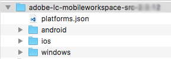
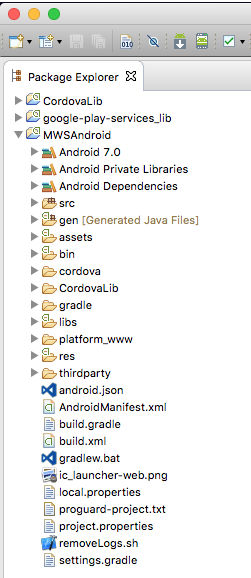
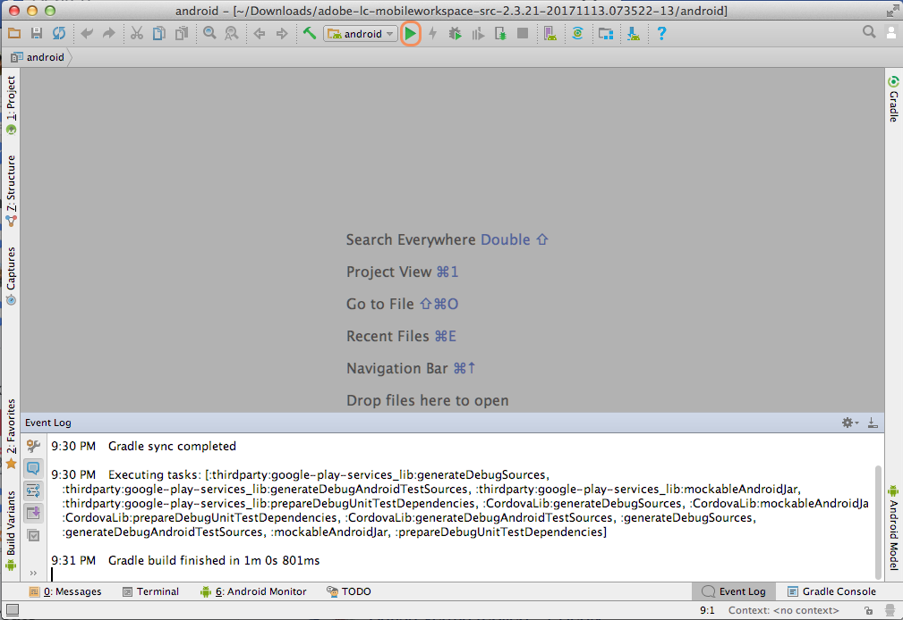

# Android Studio 프로젝트를 설정하고 Android 앱을 빌드합니다. {#set-up-the-android-studio-project-and-build-the-android-app}

이 문서는 AEM Forms 앱 6.3.1.1 이상 버전을 빌드하기 위한 것입니다. AEM Forms App 6.3의 소스 코드에서 앱을 빌드하려면 다음을 참조하십시오 [Eclipse 프로젝트를 설정하고 Android™ 앱을 빌드합니다.](/help/forms/using/setup-eclipse-project-build-installer.md).

AEM Forms은 AEM Forms 앱의 전체 소스 코드를 제공합니다. 소스에는 사용자 지정 AEM Forms 앱을 빌드하기 위한 모든 구성 요소가 포함되어 있습니다. 소스 코드 아카이브, `adobe-lc-mobileworkspace-src-<version>.zip` 는 `adobe-aemfd-forms-app-src-pkg-<version>.zip` 소프트웨어 배포 패키지

AEM Forms 앱 소스를 가져오려면 다음 단계를 수행하십시오.

1. [소프트웨어 배포](https://experience.adobe.com/downloads)를 엽니다. 소프트웨어 배포에 로그인하려면 Adobe ID가 필요합니다.
1. 헤더 메뉴에 제공된 **[!UICONTROL Adobe Experience Manager]**&#x200B;를 누릅니다.
1. 에서 **[!UICONTROL 필터]** 섹션:
   1. 선택 **[!UICONTROL Forms]** 에서 **[!UICONTROL 솔루션]** 드롭다운 목록.
   2. 패키지의 버전 및 유형을 선택합니다. 를 사용할 수도 있습니다 **[!UICONTROL 다운로드 검색]** 결과를 필터링하는 옵션.
1. 운영 체제에 해당하는 패키지 이름을 탭하고 **[!UICONTROL EULA 약관 동의]**, 탭 **[!UICONTROL 다운로드]**.
1. [패키지 관리자](https://docs.adobe.com/content/help/ko-KR/experience-manager-65/administering/contentmanagement/package-manager.html)를 열고 **[!UICONTROL 패키지 업로드]**&#x200B;를 클릭하여 패키지를 업로드합니다.
1. 패키지를 선택하고 **[!UICONTROL 설치]**&#x200B;를 클릭합니다.

다음 이미지는 추출된 컨텐츠의 내용을 표시합니다 `adobe-lc-mobileworkspace-src-<version>.zip`.

다음 이미지는 `android`폴더의 `src`폴더를 입력합니다.

## 표준 AEM Forms 앱 구축 {#set-up-the-xcode-project}

1. 다음 단계를 수행하여 Android™ Studio에서 프로젝트를 설정하고 서명 ID를 제공합니다.

   Android™ Studio가 설치 및 구성된 시스템에 로그인합니다.

1. 다운로드한 컨텐츠 복사 `adobe-lc-mobileworkspace-src-<version>.zip` 보관 대상:

   **MAC 사용자**: `[User_Home]/Projects`

   **Windows® 사용자의 경우**: `%HOMEPATH%\Projects`

   >[!NOTE]
   >
   >Windows®의 경우 시스템 드라이브에 android 프로젝트를 유지하는 것이 좋습니다.

1. 다음 디렉토리에서 아카이브를 추출합니다.

   **MAC 사용자**: `[User_Home]/Projects/[your-project]`

   **Windows® 사용자의 경우**: `%HOMEPATH%\Projects\[your-project]`

   >[!NOTE]
   >
   >프로젝트를 Android Studio로 가져오기 전에 추출된 Android 프로젝트를 시스템 드라이브에 유지하는 것이 좋습니다.

1. Android™ Studio를 시작합니다.

   **MAC 사용자**: 업데이트 `local.properties` 에 있는 파일 `[User_Home]/Projects/[your-project]/android` 폴더 및 지점 `sdk.dir` 변수까지 `SDK` 데스크탑 위치.

   **Windows® 사용자의 경우**: 업데이트 `local.properties` 에 있는 파일 `%HOMEPATH%\Projects\[your-project]\android` 폴더 및 지점 `sdk.dir` 변수까지 `SDK` 데스크탑 위치.

1. 클릭 **[!UICONTROL 완료]** 프로젝트를 빌드하려면 다음을 수행하십시오.

   이 프로젝트는 ADT 프로젝트 탐색기에서 사용할 수 있습니다.

   

1. Android™ Studio에서 **[!UICONTROL 프로젝트 가져오기(Eclipse ADT, Gradle 등)]**.
1. 프로젝트 탐색기에서 **루트 디렉토리** 텍스트 상자:

   **Mac 사용자의 경우:** [User_Home]/Projects/MobileWorkspace/src/android

   **Windows® 사용자의 경우:** %HOMEPATH%\Projects\MobileWorkspace\src\android

1. 프로젝트를 가져온 후 Android™ 플러그인 Gradle을 업데이트하는 옵션이 포함된 팝업이 나타납니다. 요구 사항에 따라 적절한 버튼을 클릭합니다.

   

1. gradle 빌드가 성공하면 다음 화면이 나타납니다. 적절한 장치 또는 에뮬레이터를 시스템과 연결하고 를 클릭합니다 **[!UICONTROL Android™ 실행]**.

   

1. Android™ Studio에는 연결된 장치 및 사용 가능한 에뮬레이터가 표시됩니다. 응용 프로그램을 실행할 장치를 선택한 다음 **확인**.

   

프로젝트를 빌드한 후 Android™ Debug Bridge 또는 Android™ Studio를 사용하여 앱을 설치하도록 선택할 수 있습니다.

### Android™ Debug Bridge 사용 {#andriod-debug-bridge}

를 통해 Android™ 장치에 애플리케이션을 설치할 수 있습니다 [Android™ Debug Bridge](https://developer.android.com/tools/help/adb.html) 다음 명령을 사용하여 다음을 수행합니다.

**MAC 사용자**: `adb install [User_Home]/Projects/[your-project]/adobe-lc-mobileworkspace-src-[version]/android/build/outputs/apk/android-debug.apk`

**Windows® 사용자의 경우**: `adb install %HOMEPATH%\Projects\[your-project]\adobe-lc-mobileworkspace-src-[version]\android\build\outputs\apk\android-debug.apk`
