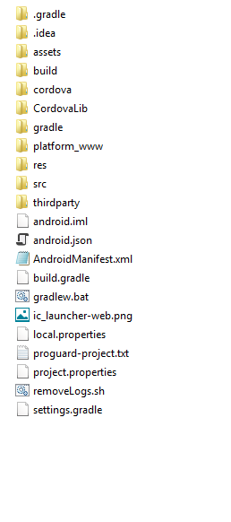

# AEM Forms Android 앱 빌드 {#build-the-aem-forms-android-app}

권장 시퀀스에서 다음 단계를 수행하여 AEM Forms용 Android 앱을 빌드합니다.

1. [AEM Forms 앱 소스 코드 패키지 다운로드](#download-android-zip)
1. [환경 변수 설정](#set-environment-variable-android)
1. [표준 AEM Forms 앱 빌드](#set-up-the-xcode-project)

## AEM Forms 앱 소스 코드 패키지 다운로드 {#download-android-zip}

AEM Forms 앱 소스 코드 패키지는 `adobe-lc-mobileworkspace-src-<version>.zip` 아카이브를 참조합니다. 이 보관에는 사용자 지정 AEM Forms 앱을 빌드하는 데 필요한 소스 코드가 포함되어 있습니다. 아카이브는 패키지 공유에서 사용할 수 있는 `adobe-aemfd-forms-app-src-pkg-<version>.zip`패키지에 포함되어 있습니다.

다음 단계를 수행하여 `adobe-aemfd-forms-app-src-pkg-<version>.zip` 파일을 다운로드합니다.

1. AEM 서버의 [작성자 인스턴스에 관리자로 로그인하고](http://localhost:4502/) 패키지 공유를 엽니다. 패키지 공유에 로그인하려면 Adobe ID가 필요합니다.
1. AEM [패키지 공유에서](http://localhost:4502/crx/packageshare/login.html)검색하고 운영 체제에 적용 가능한 패키지를 클릭한 다음 다운로드를 `adobe-aemfd-forms-app-src-pkg-<version>.zip`클릭합니다 ****. 라이센스 계약을 읽고 동의한 다음 확인을 **클릭합니다**. 다운로드가 시작됩니다. 다운로드하면 패키지 **옆에** 다운로드된 단어가 나타납니다.
1. 다운로드가 완료되면 [다운로드됨]을 **클릭합니다**. 패키지 관리자로 리디렉션됩니다. 패키지 관리자에서 다운로드한 패키지를 검색하고 설치를 **클릭합니다**.
1. 소스 코드 아카이브를 다운로드하려면 https://&lt;서버>:&lt;포트>/crx/de/content/forms/mobileapps/src/adobe-lc-mobileworkspace-src-&lt;버전>.zip을 **** 브라우저에서 엽니다. Android 앱 .zip 파일이 장치에 다운로드됩니다.
1. .zip 파일의 내용을 로컬 파일 시스템의 폴더에 추출합니다. 예: *C:\&amp;lt;폴더 구조>\adobe-lc-mobileworkspace-src-2.4.20*

다음 이미지는 `adobe-lc-mobileworkspace-src-<version>.zip\android`폴더 구조를 표시합니다.

## 환경 변수 설정 {#set-environment-variable-android}

AEM Forms 앱에 대한 빌드 프로세스를 시작하기 전에 다음 환경 변수를 설정합니다.

* JAVA_HOME 환경 변수를 로컬 파일 시스템에서 JDK 소프트웨어 위치로 설정합니다. 예: C:\Program Files\Java\jdk1.8.0_181
* Android용 SDK 위치로 `ANDROID_SDK_ROOT` 시스템 환경 변수를 설정합니다. 예: C:\Users\&amp;lt;username>\AppData\Local\Android\Sdk
* Android용 플랫폼 도구 및 도구 폴더 위치를 포함하도록 `Path` 시스템 환경 변수를 설정합니다. 예: C:\Users\&amp;lt;username>\AppData\Local\Android\Sdk\platform-tools and C:\Users\&amp;lt;username>\AppData\Local\Android\Sdk\tools.

## 표준 AEM Forms 앱 빌드 {#set-up-the-xcode-project}

로컬 파일 시스템에 adobe-lc-mobileworkspace-src-&lt;버전>.zip 파일을 저장하고 환경 변수를 설정했으면 다음 옵션 중 하나를 사용하여 표준 AEM Forms Android 앱을 빌드합니다.

* [Android Studio를 사용하여 AEM Forms 앱 빌드](#using-android-studio)
* [Android Studio를 사용하여 .apk 파일 생성](#generate-apk-android-studio)

### Android Studio를 사용하여 AEM Forms 앱 빌드 {#using-android-studio}

Android Studio를 사용하여 AEM Forms 앱을 빌드하려면 다음 단계를 수행하십시오.

1. 컴퓨터에서 Android Studio 응용 프로그램을 실행합니다.
1. 기존 **Android Studio 프로젝트**&#x200B;열기를 클릭합니다. 기존 프로젝트를 여는 대화 상자가 자동으로 나타나지 않으면 파일 > **열기를** 선택합니다 ****.
1. 로컬 파일 시스템에서 *adobe-lc-mobileworkspace-src-&lt;버전>.zip/android* 로 이동하고 확인을 **클릭합니다**.

   왼쪽 창에 **android** 옵션이 표시됩니다.

   

1. 왼쪽 창에서 **android** 를 선택하고 실행 **>** &#39;android **실행&#39;**&#x200B;을 클릭합니다.
1. 배포 대상 선택 대화 상자의 연결된 장치 섹션에서 Android 장치를 선택하고 확인을 클릭합니다.

   개발 환경을 성공적으로 구축한 후에는 이제 앱에 사용자 지정을 적용할 수 있습니다. 다음 아티클을 사용하여 앱을 사용자 정의합니다.

   * [브랜딩 사용자 지정](/help/forms/using/branding-customization.md)
   * [테마 맞춤화](/help/forms/using/theme-customization.md)
   * [제스처 사용자 정의](/help/forms/using/gesture-customization.md)
   앱에 적절한 사용자 지정을 적용한 후 배포할 .apk 파일을 생성할 수 있습니다.

### Android Studio를 사용하여 .apk 파일 생성 {#generate-apk-android-studio}

Android Studio를 사용하여 .apk 파일을 생성하려면 다음 단계를 수행하십시오.

1. 컴퓨터에서 Android Studio 응용 프로그램을 실행합니다.
1. 기존 **Android Studio 프로젝트**&#x200B;열기를 선택합니다. 기존 프로젝트를 여는 대화 상자가 자동으로 나타나지 않으면 파일 > **열기를** 선택합니다 ****.
1. 로컬 파일 시스템에서 *adobe-lc-mobileworkspace-src-&lt;버전>.zip/android* 로 이동하고 확인을 **클릭합니다**.

   android 옵션은 왼쪽 창에 표시됩니다.

1. 빌드 **** > **APK** 빌드를 선택하여 .apk 파일을 생성합니다.

   필요에 따라 [ **작성** ] > **[서명된 APK** 생성]을 선택하여 [서명된 버전의](https://developer.android.com/studio/publish/app-signing) .apk 파일을 생성합니다.

## Android Debug Bridge 사용 {#build-android-debug-bridge}

.apk 파일이 생성되면 다음 명령을 실행하여 Android Debug Bridge를 사용하여 Android 장치에 응용 프로그램을 [설치합니다](https://developer.android.com/tools/help/adb.html).

**Windows 사용자:** `adb install %HOMEPATH%\Projects\[your-project]\adobe-lc-mobileworkspace-src-[version]\android\build\outputs\apk\android-debug.apk`

**MAC 사용자:** `adb install [User_Home]/Projects/[your-project]/adobe-lc-mobileworkspace-src-[version]/android/build/outputs/apk/android-debug.apk`
