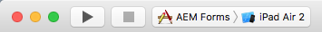

# Xcode 프로젝트를 설정하고 iOS 앱{#set-up-the-xcode-project-and-build-the-ios-app} 빌드

AEM Forms은 AEM Forms 앱의 전체 소스 코드를 제공합니다. 소스에는 사용자 정의 AEM Forms 앱을 빌드하는 모든 구성 요소가 포함되어 있습니다. 소스 코드 아카이브 `adobe-lc-mobileworkspace-src-<version>.zip`은 소프트웨어 배포 시 `adobe-aemfd-forms-app-src-pkg-<version>.zip` 패키지의 일부입니다.

AEM Forms 앱 소스를 가져오려면 다음 단계를 수행하십시오.

1. [소프트웨어 배포](https://experience.adobe.com/downloads)를 엽니다. 소프트웨어 배포에 로그인하려면 Adobe ID이 필요합니다.
1. 머리글 메뉴에서 사용할 수 있는 **[!UICONTROL Adobe Experience Manager]**&#x200B;을 누릅니다.
1. **[!UICONTROL 필터]** 섹션에서 다음을 수행합니다.
   1. **[!UICONTROL 솔루션]** 드롭다운 목록에서 **[!UICONTROL Forms]**&#x200B;을 선택합니다.
   2. 패키지의 버전과 유형을 선택합니다. **[!UICONTROL 다운로드 검색]** 옵션을 사용하여 결과를 필터링할 수도 있습니다.
1. 운영 체제에 해당하는 패키지 이름을 누르고 **[!UICONTROL EULA 약관 동의]**&#x200B;를 선택한 다음 **[!UICONTROL 다운로드]**&#x200B;를 누릅니다.
1. [패키지 관리자](https://docs.adobe.com/content/help/ko-KR/experience-manager-65/administering/contentmanagement/package-manager.html)를 열고 **[!UICONTROL 패키지 업로드]**&#x200B;를 클릭하여 패키지를 업로드합니다.
1. 패키지를 선택하고 **[!UICONTROL 설치]**&#x200B;를 클릭합니다.

1. 소스 코드 아카이브를 다운로드하려면 브라우저에서 `https://<server>:<port>/crx/de/content/forms/mobileapps/src/adobe-lc-mobileworkspace-src-<version>.zip`을(를) 엽니다.
소스 패키지가 장치에 다운로드됩니다.

다음 이미지는 `adobe-lc-mobileworkspace-src-<version>.zip`의 추출된 내용을 표시합니다.


다음 표에서는 `adobe-lc-mobileworkspace-src-[version]/ios` 폴더의 내용을 자세히 설명합니다.

<table>
 <tbody>
  <tr>
   <th><p>디렉토리</p> </th>
   <th><p>컨텐트</p> </th>
  </tr>
  <tr>
   <td><p><code>CordovaLib</code></p> </td>
   <td><p>PhoneGap SDK 6.4.0</p> </td>
  </tr>
  <tr>
   <td><p><code>AEM Forms</code></p> </td>
   <td><p>리소스, PhoneGap 플러그인 및 애플리케이션의 기본 모듈</p> </td>
  </tr>
  <tr>
   <td><p><code>AEM Forms.xcodeproj</code></p> </td>
   <td><p>AEM Forms 앱용 Xcode 프로젝트</p> </td>
  </tr>
  <tr>
   <td><p><code>www</code></p> </td>
   <td><p>AEM Forms 앱 프로젝트용 HTML, CSS, 이미지 및 JavaScript 파일</p> </td>
  </tr>
 </tbody>
</table>

코드 서명 및 iOS 프로비저닝 포털에 장치 추가에 대한 자세한 내용은 [iOS 코드 서명 설정, 프로세스 및 문제 해결](https://developer.apple.com/library/ios/documentation/IDEs/Conceptual/AppDistributionGuide/MaintainingCertificates/MaintainingCertificates.html)을 참조하십시오.

## 표준 AEM Forms 앱 {#set-up-the-xcode-project} 빌드

1. Xcode에서 프로젝트를 설정하고 서명 ID를 제공하려면 다음 단계를 수행하십시오.

   Xcode 및 iOS SDK가 설치 및 구성된 Mac 시스템에 로그인합니다.

1. 다운로드 폴더에서 `adobe-lc-mobileworkspace-src-<version>.zip` 아카이브를 `[User_Home]/Projects/`로 복사합니다.
1. `[User_Home]/Projects/[your-project]`디렉토리에 아카이브를 추출합니다.
1. ` [User_Home]/Projects/ `[your-project]`/adobe-lc-mobileworkspace-src-[version]/ios` 디렉토리로 이동합니다.
1. Xcode에서 `AEM Forms.xcodeproj` 프로젝트를 엽니다.
1. **AEM Forms** TARGET **에서** AEM Forms **를 클릭합니다.** **빌드 설정** 탭을 선택하고 **코드 서명 권한 부여** 섹션을 찾은 후 디버그 및 릴리스 필드에서 다음 중 하나를 수행합니다.

   * 표준 모바일 작업 공간 앱을 빌드하려면 필드를 지정되지 않도록 합니다.
   * 보안 AEM Forms 앱을 빌드하려면 [iOS용 보안 AEM Forms 앱 빌드하기를 참조하십시오](/help/forms/using/building-secure-mobile-workspace-app.md).

1. **빌드 설정** 탭에서 **모두**&#x200B;를 클릭한 다음 **결합**&#x200B;을 클릭합니다.
1. **설정** 목록에서 **코드 서명**&#x200B;을 확장합니다.
1. **코드 서명 ID**&#x200B;의 경우 적절한 서명을 선택합니다. 새 서명 만들기에 대한 자세한 내용은 [개발 프로비저닝 프로필 만들기 및 다운로드](https://developer.apple.com/library/ios/documentation/IDEs/Conceptual/AppStoreDistributionTutorial/CreatingYourTeamProvisioningProfile/CreatingYourTeamProvisioningProfile.html)를 참조하십시오.
1. **디버그**, **릴리스** 및 **모든 iOS SDK**&#x200B;에 대해 동일한 서명이 선택되어 있는지 확인합니다.
1. `AEM Forms-info.plist` 파일에서 다음 코드를 바꿉니다.

   ```xml
   <key>NSAppTransportSecurity</key>
   <dict>
   <key>NSAllowsArbitraryLoads</key>
   <true/>
   </dict>
   ```

   을 사용하여 `yourserver.com`을(를) 서버의 적절한 호스트 이름으로 바꿉니다.

   ```xml
   <key>NSAppTransportSecurity</key>
   <dict>
   <key>NSExceptionDomains</key>
   <dict>
   <key>yourserver.com</key>
   <dict>
   <!-Include to allow subdomains->
   <key>NSIncludesSubdomains</key>
   <true/>
   <!-Include to allow HTTP requests->
   <key>NSTemporaryExceptionAllowsInsecureHTTPLoads</key>
   <true/>
   <!-Include to support forward secrecy->
   <key>NSExceptionRequiresForwardSecrecy</key>
   <false/>
   <!-Include to specify minimum TLS version->
   <key>NSTemporaryExceptionMinimumTLSVersion</key>
   <string>TLSv1.1</string>
   </dict>
   </dict>
   </dict>
   ```

   >[!NOTE]
   >
   >이 단계는 AEM Forms 앱이 앱 전송 보안 요구 사항을 따르지 않는 서버에 연결해야 하는 경우에만 필요합니다.

1. **PROJECT**&#x200B;에서 **AEM Forms**&#x200B;을 선택하고 **코드 서명 ID**, **디버그**, **릴리스** 및 **모든 iOS SDK&lt;a 11/>.**
1. 제공된 iPad를 Mac 컴퓨터에 연결합니다.
1. **AEM Forms** 프로젝트에 대해 제공된 장치를 선택합니다.

   

   제공된 장치 iPad Air 2가 선택됩니다.

1. **제품** > **정리**&#x200B;를 선택합니다.
1. **제품** > **빌드**&#x200B;를 선택합니다.

## AEM Forms 앱 {#build-the-installer-for-the-mobile-workspace-app} 설치 프로그램을 빌드합니다.

설치 프로그램(.ipa 파일) 및 속성 목록(.plist 파일) 파일을 빌드하려면 Xcode 프로젝트를 보관해야 합니다. 속성 목록 파일에는 앱의 이름 및 호스팅 위치와 같은 호스팅된 사내 앱의 구성 정보가 포함되어 있습니다. 속성 목록 파일에 대한 자세한 내용은 [정보 속성 목록 파일 정보](https://developer.apple.com/library/ios/#documentation/general/Reference/InfoPlistKeyReference/Articles/AboutInformationPropertyListFiles.html)를 참조하십시오.

1. 제공된 iPad를 Mac 컴퓨터에 연결합니다. iPad 프로비전에 대한 자세한 내용은 [개발 프로비저닝 프로필 만들기 및 다운로드](https://developer.apple.com/library/ios/documentation/IDEs/Conceptual/AppStoreDistributionTutorial/CreatingYourTeamProvisioningProfile/CreatingYourTeamProvisioningProfile.html)를 참조하십시오.
1. **AEM Forms** 프로젝트에 대해 제공된 장치를 선택합니다.

   

   제공된 장치 iPad Air 2가 선택됩니다.

1. **제품** > **정리**&#x200B;를 선택합니다.
1. **제품** > **빌드**&#x200B;를 선택합니다.
1. **제품** > **보관**&#x200B;을 선택합니다.
1. 문서 분류함 - 보관에서 프로젝트의 최신 보관 파일을 선택하고 **배포**&#x200B;를 클릭합니다.
1. 배포 방법으로 **Save for Enterprise 또는 Ad-Hoc 배포**&#x200B;를 선택하고 **다음**&#x200B;을 클릭합니다.
1. 적절한 **코드 서명 ID**&#x200B;를 선택하고 **다음**&#x200B;을 클릭합니다. 서명을 적용하려면 **허용**&#x200B;을 클릭합니다.
1. 앱의 이름을 입력하고 **기업 배포용으로 저장**&#x200B;을 선택합니다.
1. 앱용 **응용 프로그램 URL**&#x200B;을 제공합니다. 예를 들어 CRX 서버에서 앱을 호스팅하려면 URL `https://[LC_host]:'port'/lc/content/distribution/mobileworkspace/APP_NAME.ipa`을 제공합니다.
1. **제목** 필드에서 AEM Forms을 지정합니다.
1. **저장**&#x200B;을 클릭하고 Xcode를 닫습니다.

   설치 프로그램 파일 `AEM Forms.ipa` 및 속성 목록 파일 `AEM Forms-info.plist`이 지정된 위치에 만들어집니다.

1. 편집기에서 `AEM Forms-info.plist` 파일을 엽니다.
1. .ipa 파일의 URL에 있는 모든 공간을 %20으로 바꿉니다.
1. `AEM Forms-info.plist` 파일을 저장하고 닫습니다.