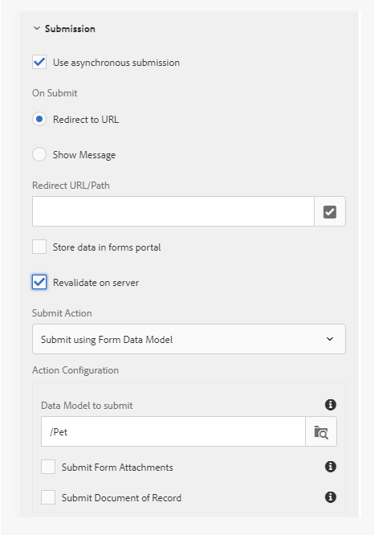

# 응용 양식 {#standard-validation-error-messages}에 대한 표준 유효성 검사 오류 메시지

적응형 양식은 사전 설정된 유효성 검사 기준을 기반으로 필드에 제공하는 입력 내용을 확인합니다. 유효성 검사 기준은 응용 양식의 필드에 사용할 수 있는 입력 값을 나타냅니다. 적응형 양식에 사용하는 데이터 소스를 기반으로 유효성 검사 기준을 설정할 수 있습니다. 예를 들어 RESTful 웹 서비스를 데이터 소스로 사용하는 경우 Swagger 정의 파일에서 유효성 검사 기준을 정의할 수 있습니다.

입력 값이 유효성 검사 기준을 충족하는 경우 값이 데이터 소스에 제출됩니다. 그렇지 않으면 응용 양식에 오류 메시지가 표시됩니다.

이 방식과 유사하게 적응형 양식이 사용자 지정 서비스와 통합되어 데이터 유효성 검사를 수행할 수 있습니다. 입력 값이 유효성 검사 기준을 충족하지 않고 서버가 반환하는 유효성 검사 오류 메시지가 표준 메시지 형식인 경우 오류 메시지가 필드 수준에 표시됩니다.

입력 값이 유효성 검사 기준을 충족하지 않고 서버 유효성 검사 오류 메시지가 표준 메시지 형식이 아닌 경우 적응형 양식에서는 유효성 검사 오류 메시지를 양식의 필드 수준에서 표시할 수 있도록 표준 형식으로 변환하는 메커니즘을 제공합니다. 다음 두 가지 방법을 사용하여 오류 메시지를 표준 형식으로 변환할 수 있습니다.

* 적응형 양식 제출 시 사용자 지정 오류 핸들러 추가
* 규칙 편집기를 사용하여 호출 서비스 작업에 사용자 지정 핸들러 추가

이 문서에서는 유효성 검사 오류 메시지의 표준 형식 및 사용자 정의 오류 메시지를 표준 형식으로 변형하는 지침에 대해 설명합니다.

## 표준 유효성 검사 오류 메시지 형식 {#standard-validation-message-format}

서버 유효성 검사 오류 메시지가 다음과 같은 표준 형식인 경우 적응형 양식에 필드 수준에서 오류가 표시됩니다.

```javascript
   {
    errorCausedBy : "SERVER_SIDE_VALIDATION/SERVICE_INVOCATION_FAILURE"
    errors : [
        {
             somExpression  : <somexpr>
             errorMessage / errorMessages : <validationMsg> / [<validationMsg>, <validationMsg>]

        }
    ]
    originCode : <target error Code>
    originMessage : <unstructured error message returned by service>
}
```

위치:

* `errorCausedBy` 실패 이유를 설명합니다.
* `errors` 유효성 확인 오류 메시지와 함께 유효성 검사 기준에 실패한 필드의 SOM 식을 언급합니다.
* `originCode` 외부 서비스에서 반환한 오류 코드를 포함합니다.
* `originMessage` 외부 서비스에서 반환된 원시 오류 데이터를 포함합니다.

## 적응형 양식 제출을 구성하여 사용자 지정 핸들러 {#configure-adaptive-form-submission} 추가

서버 유효성 검사 오류 메시지가 표준 형식으로 표시되지 않으면 비동기 제출을 활성화하고 응용 양식 제출 시 사용자 지정 오류 핸들러를 추가하여 메시지를 표준 형식으로 변환할 수 있습니다.

### 비동기 적응형 양식 제출 구성 {#configure-asynchronous-adaptive-form-submission}

사용자 지정 핸들러를 추가하기 전에 비동기 제출을 위해 응용 양식을 구성해야 합니다. 다음 단계를 실행합니다.

1. 적응형 양식 작성 모드에서 양식 컨테이너 개체를 선택하고 을 눌러 속성을 엽니다.
1. **[!UICONTROL 제출]** 속성 섹션에서 **[!UICONTROL 비동기 제출 사용]**&#x200B;을 활성화합니다.
1. 제출 전에 **[!UICONTROL 서버]**&#x200B;에서 재유효성 검사를 선택하여 서버의 입력 필드 값을 확인합니다.
1. 제출 작업을 선택합니다.

   * 데이터 소스로 RESTful 웹 서비스 기반 [양식 데이터 모델](work-with-form-data-model.md)을 사용하는 경우 **[!UICONTROL 양식 데이터 모델을 사용하여 제출을 선택하고 적절한 데이터 모델을 선택합니다.]**
   * RESTful 웹 서비스를 데이터 소스로 사용하는 경우 **[!UICONTROL REST 끝점에 제출]**&#x200B;을 선택하고 **[!UICONTROL 리디렉션 URL/경로]**&#x200B;을 지정합니다.

   

1. 을 눌러 속성을 저장합니다.

### 적응형 양식 제출 시 사용자 지정 오류 핸들러 추가 {#add-custom-error-handler-af-submission}

AEM Forms은 양식 제출 시 즉시 사용할 수 있는 성공 및 오류 핸들러를 제공합니다. 핸들러는 서버 응답을 기반으로 실행하는 클라이언트측 함수입니다. 양식이 제출되면 데이터가 유효성 검사를 위해 서버로 전송되며, 이는 제출 시 성공 또는 오류 이벤트에 대한 정보와 함께 클라이언트에 대한 응답을 반환합니다. 이 정보는 관련 핸들러에 매개 변수로 전달되어 함수를 실행합니다.

적응형 양식 제출 시 사용자 지정 오류 핸들러를 추가하려면 다음 단계를 수행하십시오.

1. 작성 모드에서 적응형 양식을 열고 양식 개체를 선택한 다음 <!---->을 눌러 규칙 편집기를 엽니다.
1. 양식 개체 트리에서 **[!UICONTROL 양식]**&#x200B;을 선택하고 **[!UICONTROL 만들기]**&#x200B;를 탭합니다.
1. 이벤트 드롭다운 목록에서 **[!UICONTROL 제출 시 오류]**&#x200B;를 선택합니다.
1. 규칙을 작성하여 사용자 지정 오류 구조를 표준 오류 구조로 변환하고 **[!UICONTROL 완료]**&#x200B;를 눌러 규칙을 저장합니다.

다음은 사용자 지정 오류 구조를 표준 오류 구조로 변환하는 샘플 코드입니다.

```javascript
var data = $event.data;
var som_map = {
    "id": "guide[0].guide1[0].guideRootPanel[0].Pet[0].id_1[0]",
    "name": "guide[0].guide1[0].guideRootPanel[0].Pet[0].name_2[0]",
    "status": "guide[0].guide1[0].guideRootPanel[0].Pet[0].status[0]"
};

var errorJson = {};
errorJson.errors = [];

if (data) {
    if (data.originMessage) {
        var errorData;
        try {
            errorData = JSON.parse(data.originMessage);
        } catch (err) {
            // not in json format
        }

        if (errorData) {
            Object.keys(errorData).forEach(function(key) {
                var som_key = som_map[key];
                if (som_key) {
                    var error = {};
                    error.somExpression = som_key;
                    error.errorMessage = errorData[key];
                    errorJson.errors.push(error);
                }
            });
        }
        window.guideBridge.handleServerValidationError(errorJson);
    } else {
        window.guideBridge.handleServerValidationError(data);
    }
}
```

`var som_map`에는 표준 형식으로 변형할 적응형 양식 필드의 SOM 식이 나열됩니다. 필드를 탭하고 **[!UICONTROL SOM 표현식 보기]**&#x200B;를 선택하여 필드의 SOM 표현식을 응용 형식으로 볼 수 있습니다.

이 사용자 지정 오류 핸들러를 사용하면 적응형 양식이 `var som_map`에 나열된 필드를 표준 오류 메시지 형식으로 변환합니다. 따라서 유효성 검사 오류 메시지는 적응형 양식의 필드 수준에서 표시됩니다.

## 서비스 호출 작업을 사용하여 사용자 지정 핸들러 추가

다음 단계를 실행하여 [규칙 편집기의](rule-editor.md) 서비스 호출 작업을 사용하여 사용자 지정 오류 구조를 표준 오류 구조로 변환하는 오류 핸들러를 추가합니다.

1. 작성 모드에서 적응형 양식을 열고 양식 개체를 선택한 다음 를 눌러 규칙 편집기를 엽니다.
1. **[!UICONTROL 만들기]**&#x200B;를 누릅니다.
1. 규칙의 **[!UICONTROL When]** 섹션에 조건을 만듭니다. 예를 들어 [필드 이름]이 변경되면 이 조건을 수행하려면 **[!UICONTROL 상태 선택]** 드롭다운 목록에서 **[!UICONTROL 이(가) 변경됨]**&#x200B;을 선택합니다.
1. **[!UICONTROL Then]** 섹션의 **[!UICONTROL Select Action]** 드롭다운 목록에서 **[!UICONTROL 호출 서비스]**&#x200B;를 선택합니다.
1. **[!UICONTROL 입력]** 섹션에서 게시물 서비스와 해당 데이터 바인딩을 선택합니다. 예를 들어 적응형 양식의 **이름**, **ID** 및 **상태** 필드의 유효성을 검사하려면 게시물 서비스(애완 동물)를 선택하고 **[!UICONTROL 입력]** 섹션에서 pet.name, pet.id 및 pet.status를 선택합니다.

이 규칙의 결과로 2단계에서 정의한 필드가 변경되고 사용자가 양식의 필드 밖으로 탭하는 즉시 **이름**, **ID** 및 **상태** 필드에 입력하는 값의 유효성을 검사할 수 있습니다.

1. 모드 선택 드롭다운 목록에서 **[!UICONTROL 코드 편집기]**&#x200B;를 선택합니다.
1. **[!UICONTROL 코드 편집]**&#x200B;을 누릅니다.
1. 기존 코드에서 다음 줄을 삭제합니다.

   ```javascript
   guidelib.dataIntegrationUtils.executeOperation(operationInfo, inputs, outputs);
   ```

1. 규칙을 작성하여 사용자 지정 오류 구조를 표준 오류 구조로 변환하고 **[!UICONTROL 완료]**를 눌러 규칙을 저장합니다.
예를 들어, 다음 샘플 코드를 끝에 추가하여 사용자 지정 오류 구조를 표준 오류 구조로 변환합니다.

   ```javascript
   var errorHandler = function(jqXHR, data) {
   var som_map = {
       "id": "guide[0].guide1[0].guideRootPanel[0].Pet[0].id_1[0]",
       "name": "guide[0].guide1[0].guideRootPanel[0].Pet[0].name_2[0]",
       "status": "guide[0].guide1[0].guideRootPanel[0].Pet[0].status[0]"
   };
   
   
   var errorJson = {};
   errorJson.errors = [];
   
   if (data) {
       if (data.originMessage) {
           var errorData;
           try {
               errorData = JSON.parse(data.originMessage);
           } catch (err) {
               // not in json format
           }
   
           if (errorData) {
               Object.keys(errorData).forEach(function(key) {
                   var som_key = som_map[key];
                   if (som_key) {
                       var error = {};
                       error.somExpression = som_key;
                       error.errorMessage = errorData[key];
                       errorJson.errors.push(error);
                   }
               });
           }
           window.guideBridge.handleServerValidationError(errorJson);
       } else {
           window.guideBridge.handleServerValidationError(data);
       }
     }
   };
   
   guidelib.dataIntegrationUtils.executeOperation(operationInfo, inputs, outputs, null, errorHandler);
   ```

   `var som_map`에는 표준 형식으로 변형할 적응형 양식 필드의 SOM 식이 나열됩니다. 필드를 탭하고 **[!UICONTROL 추가 옵션]**(..) 메뉴에서 **[!UICONTROL SOM 표현식 보기]**&#x200B;를 선택하여 필드의 SOM 표현식을 적응형 형식으로 볼 수 있습니다.

   다음 샘플 코드 행을 사용자 지정 오류 처리기에 복사해야 합니다.

   ```javascript
   guidelib.dataIntegrationUtils.executeOperation(operationInfo, inputs, outputs, null, errorHandler);
   ```

   executeOperation API에는 새로운 사용자 지정 오류 핸들러를 기반으로 하는 `null` 및 `errorHandler` 매개 변수가 포함되어 있습니다.

   이 사용자 지정 오류 핸들러를 사용하면 적응형 양식이 `var som_map`에 나열된 필드를 표준 오류 메시지 형식으로 변환합니다. 따라서 유효성 검사 오류 메시지는 적응형 양식의 필드 수준에서 표시됩니다.