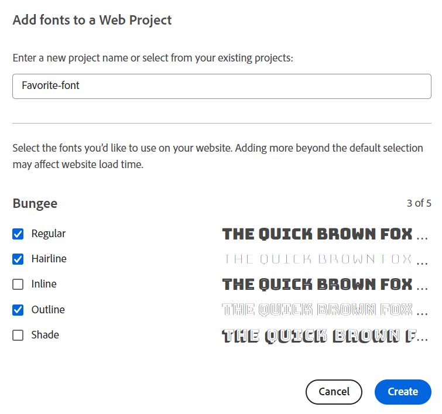

# 적응형 양식 스타일 지정 {#do-not-publish-style-your-adaptive-form}

사용자 지정 테마를 만들고, 개별 구성 요소의 스타일을 지정하고, 테마에서 Web Fonts을 사용하는 방법을 알아봅니다.

이 자습서는 [첫 번째 적응형 양식을 만들기](https://helpx.adobe.com/kr/experience-manager/6-3/forms/using/create-your-first-adaptive-form.html) 시리즈의 단계입니다. Adobe은 전체 자습서 사용 사례를 이해하고, 수행하고, 시연하기 위해 연대순으로 시리즈를 따르는 것을 권장합니다.

## 튜토리얼 기본 정보  {#about-the-tutorial}

테마를 사용하여 적응형 양식에 고유한 모양과 스타일을 제공할 수 있습니다. 적응형 양식 편집기에서 제공하는 기본 테마를 적용하거나 사용자 고유의 사용자 지정 테마를 만들 수 있습니다. AEM [!DNL Forms]은(는) 사용자 지정 테마를 만들 수 있는 [테마 편집기](https://helpx.adobe.com/experience-manager/6-3/forms/using/themes.html)를 제공합니다. 단일 테마는 모바일, 태블릿 또는 데스크탑에서 열린 동일한 적응형 양식에 다른 모양을 제공할 수 있습니다. 테마 편집기를 사용하려면 CSS 이하에 대한 사전 지식이 필요하지 않지만, 필요합니다.

자습서가 끝날 때까지 다음 작업을 수행할 수 있습니다.

* 적응형 양식에 즉시 사용 가능한 테마 적용
* 테마 편집기를 사용하여 적응형 양식에 대한 테마 만들기
* 개별 구성 요소 스타일 지정
* 보너스 섹션: 사용자 정의 테마에서 Web Fonts 사용

자습서를 완료한 후 양식은 다음과 유사해야 합니다.

## 시작하기 전 {#before-you-start}

로컬 컴퓨터에서 아래 제공된 헤더 스타일 및 로고 이미지를 다운로드합니다. `shipping-address-add-update-form` 적응형 양식의 헤더에서 헤더 스타일 및 로고 이미지를 사용합니다. 헤더 스타일 이미지가 헤더의 오른쪽에 나타납니다.

[파일 가져오기](assets/header-style.png)

[파일 가져오기](assets/logo-1.png)

## 1단계: 적응형 양식에 테마 적용 {#step-apply-a-theme-to-your-adaptive-form}

적응형 양식 편집기는 다양한 기본 테마를 제공합니다. 적응형 양식에 사용자 지정 스타일을 사용하지 않을 계획이라면 기본 테마가 있는 적응형 양식을 게시할 수도 있습니다. 테마는 적응형 양식과 독립적입니다. 동일한 테마를 여러 적응형 양식에 적용할 수 있습니다.

**테마를 적응형 양식에 적용하려면:**

1. 편집할 적응형 양식을 엽니다.

   [http://localhost:4502/editor.html/content/forms/af/shipping-address-add-update-form.html](http://localhost:4502/editor.html/content/forms/af/shipping-address-add-update-form.html)

1. **[!UICONTROL 적응형 양식 컨테이너]**&#x200B;의 속성을 엽니다. 속성 브라우저에서 **[!UICONTROL 기본]** > **[!UICONTROL 적응형 양식 테마]**&#x200B;로 이동합니다. **[!UICONTROL 적응형 양식 테마]** 필드에는 기본 테마 및 사용자 지정 테마가 모두 나열됩니다. 기본적으로 캔버스 테마가 적용됩니다.
1. **[!UICONTROL 적응형 양식 테마]** 필드에서 테마를 선택합니다. 예: **설문 조사 테마**. 선택한 테마를 적용할 수 있도록 를 선택하십시오.

   

   **그림:** *기본 테마를 사용하는 적응형 양식*

   

   **그림:** *설문 조사 테마를 사용한 적응형 양식*

## 2단계: 적응형 양식 업데이트 {#step-update-your-adaptive-form}

위에 표시된 디자인을 사용하려면 기존 적응형 양식의 자리 표시자 텍스트와 로고를 변경해야 합니다.

**적응형 양식을 업데이트하려면:**

1. 헤더의 기존 로고 및 텍스트를 변경합니다. 로고를 제거하려면:

   1. 양식 편집기에서 양식을 엽니다.

      [http://localhost:4502/editor.html/content/forms/af/shipping-address-add-update-form.html](http://localhost:4502/editor.html/content/forms/af/shipping-address-add-update-form.html)

   1. [!UICONTROL header] 구성 요소에서 로고 이미지를 선택하고  **[!UICONTROL 속성]**&#x200B;을 선택합니다. [!UICONTROL image] 속성에서 X를 선택하여 기존 로고 이미지를 제거합니다.
   1. **[!UICONTROL 업로드]**&#x200B;를 선택하고 logo.png를 선택한 다음 를 선택하여 변경 내용을 저장합니다. [시작하기 전에](/help/forms/using/style-your-adaptive-form.md#before-you-start) 섹션에 이미지가 다운로드되었습니다.
   1. 헤더 텍스트 `We.Retail`을(를) 선택하고  **[!UICONTROL edit]**&#x200B;을(를) 선택합니다. 헤더 텍스트를 `we retail`(으)로 변경합니다. `we retail`의 `we`에만 굵게 서식을 적용합니다.

      

1. 제목을 제거하고 자리 표시자 텍스트를 추가합니다.

   1. 고객 ID 필드를 선택하고  속성을 선택합니다.
   1. **[!UICONTROL 제목]** 필드의 내용을 **[!UICONTROL 자리 표시자 텍스트]** 필드에 복사합니다.
   1. **[!UICONTROL 제목]** 필드의 내용을 삭제하고 를 선택합니다.
   1. 양식의 모든 텍스트 상자, 숫자 상자 및 전자 메일 필드에 대해 이전 세 단계를 반복합니다.

      

## 3단계: 적응형 양식에 대한 사용자 지정 테마 만들기 {#step-create-a-custom-theme-for-your-adaptive-form}

[테마 편집기](/help/forms/using/themes.md)를 사용하여 사용자 지정 테마를 만들 수 있습니다. 테마 편집기는 강력한 WYSIWYG 편집기입니다. CSS를 적응형 양식의 다양한 구성 요소에 적용하는 시각적 방법입니다. 적응형 양식의 구성 요소 및 패널에 스타일을 지정할 수 있는 보다 세밀한 컨트롤을 제공합니다.

테마는 적응형 양식과 같은 별도의 엔티티입니다. 여기에는 적응형 양식의 구성 요소 및 패널에 대한 스타일(CSS)이 포함되어 있습니다. 스타일에는 배경색, 상태 색상, 투명도, 정렬 및 크기와 같은 CSS 속성이 포함됩니다. 테마를 적용하면 지정된 스타일이 적응형 양식의 해당 구성 요소에 적용됩니다.

이 자습서에서는 머리글 및 바닥글, 텍스트 및 숫자 구성 요소, 첨부 파일 구성 요소 및 단추의 스타일을 지정합니다. 테마 만들기로 시작하겠습니다.

### 테마 만들기 {#create-a-theme}

1. AEM 작성자 인스턴스에 로그인하고 **[!UICONTROL Adobe Experience Manager]** > **[!UICONTROL Forms]** > **[!UICONTROL 테마]**(으)로 이동합니다. 기본 URL은 [http://localhost:4502/aem/forms.html/content/dam/formsanddocuments-themes](http://localhost:4502/aem/forms.html/content/dam/formsanddocuments-themes)입니다.
1. **[!UICONTROL 만들기]**&#x200B;를 선택하고 **[!UICONTROL 테마]**&#x200B;를 선택합니다. 테마를 만드는 데 필요한 필드가 있는 [!UICONTROL 테마 만들기] 페이지가 나타납니다. **[!UICONTROL 제목]** 및 **[!UICONTROL 이름]** 필드는 필수입니다.

   * **제목:** 테마의 제목을 지정합니다. 예: **전역 테마.** 제목을 사용하면 테마 목록에서 테마를 식별할 수 있습니다.
   * **이름:** 테마의 이름을 지정합니다. 예: **전역 테마.** 지정한 이름의 노드가 저장소에 만들어졌습니다. 제목 입력을 시작하면 이름 필드에 대한 값이 자동으로 생성됩니다. 제안 값을 변경할 수 있습니다. 이름 필드에는 영숫자 문자, 하이픈 및 밑줄만 포함될 수 있습니다. 잘못된 모든 입력은 하이픈으로 대체됩니다.

1. **[!UICONTROL 만들기]**&#x200B;를 선택합니다. 테마가 만들어지고 편집할 양식을 여는 대화 상자가 나타납니다. 새 탭에서 새로 만든 테마를 열려면 **[!UICONTROL 열기]**&#x200B;를 선택합니다. 테마가 테마 편집기에서 열립니다. 스타일링을 위해 테마 편집기는 AEM [!DNL Forms]과(와) 함께 제공되는 기본 적응형 양식을 사용합니다.

   테마 편집기 UI 사용에 대한 자세한 내용은 [테마 편집기 정보](/help/forms/using/themes.md#aboutthethemeeditor)를 참조하십시오.

1. **[!UICONTROL 테마 옵션]**  > **[!UICONTROL 구성]**&#x200B;을 선택합니다. **[!UICONTROL 미리 보기 양식]** 필드에서 **배송 주소 추가 업데이트 양식** 적응형 양식을 선택하고 를 선택한 다음 **[!UICONTROL 저장]**&#x200B;을 선택합니다. 이제 테마 편집기는 기본 적응형 양식 대신 고유한 적응형 양식을 사용하도록 구성되었습니다. 테마 편집기로 돌아가려면 **[!UICONTROL 취소]**&#x200B;를 선택하십시오.

   

   **그림:** *배송 주소 추가 업데이트 양식 적응형 양식이 있는 테마 편집기*

   

   **그림:** *기본 양식이 있는 적응형 양식*

### 스타일 머리글 및 바닥글 {#style-header-and-footer}

머리글과 바닥글은 적응형 양식에 일관되고 고유한 모양을 제공합니다. 일반적으로 머리글에는 조직의 로고와 이름이 포함되고 바닥글에는 저작권 정보가 포함되며, 이러한 정보는 조직의 여러 양식에서 동일하게 유지됩니다. shipping-address-add-update-form 적응형 양식의 머리글 및 바닥글 스타일을 지정하려면 다음을 수행합니다.

1. 선택기 패널에서 **[!UICONTROL 머리글]** > **[!UICONTROL 텍스트]** 옵션을 탐색합니다. 선택기 패널은 테마 편집기의 왼쪽에 있습니다. 패널이 표시되지 않으면  사이드 패널 전환을 선택합니다.

1. **[!UICONTROL 텍스트]** 아코디언에서 다음 속성을 설정하고 를 선택합니다.

   | 속성 | 값 |
   |---|---|
   | 글꼴 모음 | Arial® |
   | 글꼴 색상 | FFFFFF |
   | 글꼴 크기 | 54픽셀 |

1. [!UICONTROL 헤더] 위젯을 선택하고 **[!UICONTROL 헤더]**&#x200B;을(를) 선택합니다. 헤더 위젯의 스타일을 지정하는 옵션이 왼쪽에 나타납니다. **[!UICONTROL Dimension 및 위치]** 아코디언을 확장하고 **[!UICONTROL 높이]**&#x200B;을(를) `120px`(으)로 설정한 다음 을(를) 선택합니다.
1. 헤더 위젯의 **[!UICONTROL 배경]** 아코디언을 확장하고 **[!UICONTROL 배경색]**&#x200B;을 `F6921E.`(으)로 설정합니다.

   **[!UICONTROL 이미지 및 그라데이션]** > **[!UICONTROL + 추가]** 위로 마우스를 가져간 후 **[!UICONTROL 이미지]**&#x200B;를 선택하십시오. 다음 속성을 설정하고 을(를) 선택합니다.

   | 속성 | 값 |
   |---|---|
   | 이미지 | header-style.png를 업로드합니다. [시작하기 전에](/help/forms/using/style-your-adaptive-form.md#before-you-start) 섹션에 이미지가 다운로드되었습니다. |
   | 위치 | 오른쪽 단추 |
   | 바둑판식으로 배열 | 반복 안 함 |

1. 테마 편집기에서 헤더에서 로고를 선택하고 **[!UICONTROL 헤더 로고]**&#x200B;를 선택합니다. Dimension 및 위치 아코디언을 확장하고 다음 속성을 설정한 다음 를 선택합니다.

   <table> 
    <tbody> 
     <tr> 
      <td><b>여백</b></td> 
      <td><b>값</b></td> 
     </tr> 
     <tr> 
      <td>여백</td> 
      <td> 
       <ul> 
        <li>위쪽: 1.5rem</li> 
        <li>하단: -35px</li> 
        <li>왼쪽: 1rem<strong>  </strong></li> 
       </ul> 
<strong>팁:</strong> 각 필드에 다른 값을 제공하려면  링크 아이콘을 선택하십시오.  
 </td> 
     </tr> 
     <tr> 
      <td>높이</td> 
      <td>4.75렘</td> 
     </tr> 
    </tbody> 
   </table>

1. 바닥글 위젯을 선택하고 **[!UICONTROL 바닥글]**&#x200B;을(를) 선택합니다. **[!UICONTROL 배경]** 아코디언을 확장하고 **[!UICONTROL 배경색]**&#x200B;을(를) `F6921E`(으)로 설정한 다음 을(를) 선택합니다.

### 데이터 캡처 구성 요소의 스타일을 지정하고 적응형 양식에 배경을 적용합니다 {#style-the-data-capture-component-and-apply-a-background-to-the-adaptive-form}

적응형 양식에서 여러 구성 요소를 사용하여 데이터를 캡처할 수 있습니다. 예를 들어 텍스트 상자와 숫자 상자가 있습니다. 모든 데이터 캡처 구성 요소에 동일한 스타일을 제공하거나 각 구성 요소에 별도의 스타일을 제공할 수 있습니다. 이 자습서에서는 숫자 상자(고객 ID, 우편 번호)와 텍스트 상자(고객 ID, 이름, 배송 주소, 상태, 이메일)에 동일한 스타일이 적용됩니다. 데이터 캡처 구성 요소의 스타일을 지정하려면 다음을 수행하십시오.

1. **[!UICONTROL 고객 ID]** 필드를 선택하고 **[!UICONTROL 필드 위젯]** 옵션을 선택하십시오. 다음 속성을 설정하고 을(를) 선택합니다.

   <table> 
    <tbody> 
     <tr> 
      <td><b>아코디언</b></td> 
      <td><b>속성</b></td> 
      <td><b>값</b></td> 
     </tr> 
     <tr> 
      <td>경계</td> 
      <td>테두리 색상</td> 
      <td>A7A9AC</td> 
     </tr> 
     <tr> 
      <td>경계</td> 
      <td>테두리 반지름 </td> 
      <td> 
       <ul> 
        <li>위쪽: 7px  </li> 
        <li>오른쪽: 7px  </li> 
        <li>아래쪽: 7px  </li> 
        <li>왼쪽: 7px  </li> 
       </ul> </td> 
     </tr> 
     <tr> 
      <td>텍스트</td> 
      <td>글꼴 모음</td> 
      <td>Arial®</td> 
     </tr> 
     <tr> 
      <td>텍스트</td> 
      <td>글꼴 색상</td> 
      <td>939598  </td> 
     </tr> 
     <tr> 
      <td>텍스트</td> 
      <td>글꼴 크기</td> 
      <td>18픽셀</td> 
     </tr> 
     <tr> 
      <td>Dimension 및 위치</td> 
      <td>폭</td> 
      <td>60%</td> 
     </tr> 
     <tr> 
      <td>Dimension 및 위치</td> 
      <td>여백</td> 
      <td> 
       <ul> 
        <li>왼쪽: 10 rem</li> 
       </ul> </td> 
     </tr> 
    </tbody> 
    </table>

1. **[!UICONTROL 고객 ID]** 필드 위에 빈 영역을 선택하고 **[!UICONTROL 반응형 패널 컨테이너]**&#x200B;를 선택합니다. **[!UICONTROL 배경]** > **[!UICONTROL 배경색]**&#x200B;을(를) F1F2F2로 설정합니다. 를 선택합니다.

   

### 단추 스타일 지정 {#style-the-buttons}

사용자 지정 테마를 사용하여 적응형 양식의 모든 단추에 동일한 스타일을 적용하고 [인라인 스타일](/help/forms/using/inline-style-adaptive-forms.md)을 사용하여 특정 단추에 스타일을 적용할 수 있습니다. 단추 스타일을 지정하려면 다음을 수행합니다.

1. **[!UICONTROL 제출]** 단추를 선택하고 **[!UICONTROL 단추]** 옵션을 선택합니다. 다음 속성을 설정하고 을(를) 선택합니다.

   <table> 
    <tbody> 
     <tr> 
      <td><b>아코디언</b></td> 
      <td><b>속성</b></td> 
      <td><b>값</b></td> 
     </tr> 
     <tr> 
      <td>배경</td> 
      <td>배경 색상</td> 
      <td>F6921E</td> 
     </tr> 
     <tr> 
      <td>테두리  </td> 
      <td>테두리 색상</td> 
      <td>F6921E</td> 
     </tr> 
     <tr> 
      <td>경계</td> 
      <td>테두리 반지름 </td> 
      <td> 
       <ul> 
        <li>위쪽: 7px  </li> 
        <li>오른쪽: 7px  </li> 
        <li>아래쪽: 7px  </li> 
        <li>왼쪽: 7픽셀</li> 
       </ul> </td> 
     </tr> 
     <tr> 
      <td>텍스트  </td> 
      <td>글꼴 모음</td> 
      <td>Arial®</td> 
     </tr> 
     <tr> 
      <td>텍스트</td> 
      <td>글꼴 색상</td> 
      <td>FFFFFF</td> 
     </tr> 
     <tr> 
      <td>텍스트</td> 
      <td>글꼴 크기</td> 
      <td>18픽셀</td> 
     </tr> 
    </tbody> 
   </table>

1. [사용자 지정 테마](/help/forms/using/style-your-adaptive-form.md#step-apply-a-theme-to-your-adaptive-form), 전역 테마를 적응형 양식에 적용하세요. 스타일이 적응형 양식에 반영되지 않으면 브라우저 캐시를 지우고 다시 시도하십시오.

   

## 4단계: 개별 구성 요소 스타일 지정 {#step-style-individual-components}

일부 스타일은 특정 구성 요소에만 적용됩니다. 이러한 구성 요소는 적응형 양식 편집기에서 스타일을 지정합니다.

1. 편집할 적응형 양식을 엽니다. [http://localhost:4502/editor.html/content/forms/af/shipping-address-add-update-form.html](http://localhost:4502/editor.html/content/forms/af/change-billing-shipping-address.html)
1. 상단 표시줄에서 **[!UICONTROL 스타일]** 옵션을 선택합니다.

   

1. **[!UICONTROL 첨부]** 단추를 선택하고 아이콘을 선택합니다. **[!UICONTROL Dimension 및 위치]** 아코디언에서 다음 속성을 설정합니다.

   | 속성 | 값 |
   |---|---|
   | 부동 | 왼쪽 |
   | 폭 | 10% |

1. **[!UICONTROL 정부 승인 주소 증명]** 옵션을 선택하고 아이콘을 선택합니다. 다음 속성을 설정합니다.

   <table> 
    <tbody> 
     <tr> 
      <td><b>아코디언</b></td> 
      <td><b>속성</b></td> 
      <td><b>값</b></td> 
     </tr> 
     <tr> 
      <td>치수 및 위치</td> 
      <td>부동</td> 
      <td>왼쪽</td> 
     </tr> 
     <tr> 
      <td>치수 및 위치</td> 
      <td>폭</td> 
      <td>73%</td> 
     </tr> 
     <tr> 
      <td>치수 및 위치</td> 
      <td>사진 간격</td> 
      <td> 
       <ul> 
        <li>왼쪽: 10픽셀</li> 
       </ul> </td> 
     </tr> 
     <tr> 
      <td>치수 및 위치</td> 
      <td>높이</td> 
      <td>40픽셀</td> 
     </tr> 
     <tr> 
      <td>Dimension 및 위치  </td> 
      <td>여백</td> 
      <td>  
       <ul> 
        <li>오른쪽: 2 rem</li> 
        <li>왼쪽: 10 rem </li> 
       </ul> </td> 
     </tr> 
     <tr> 
      <td>배경</td> 
      <td>배경 색상</td> 
      <td>FFFFFF</td> 
     </tr> 
     <tr> 
      <td>경계</td> 
      <td>테두리 너비</td> 
      <td>1픽셀</td> 
     </tr> 
     <tr> 
      <td>경계</td> 
      <td>테두리 스타일</td> 
      <td>단색</td> 
     </tr> 
     <tr> 
      <td>경계</td> 
      <td>테두리 색상</td> 
      <td>A7A9AC</td> 
     </tr> 
     <tr> 
      <td>경계</td> 
      <td>테두리 반지름</td> 
      <td>7픽셀</td> 
     </tr> 
     <tr> 
      <td>텍스트</td> 
      <td>글꼴 모음</td> 
      <td>Arial®</td> 
     </tr> 
     <tr> 
      <td>텍스트</td> 
      <td>글꼴 색상</td> 
      <td>BCBEC0</td> 
     </tr> 
     <tr> 
      <td>텍스트</td> 
      <td>글꼴 크기</td> 
      <td>18픽셀</td> 
     </tr> 
     <tr> 
      <td>텍스트</td> 
      <td>선 높이</td> 
      <td>2</td> 
     </tr> 
     </tr> 
    </tbody> 
   </table>

1. **[!UICONTROL 제출]** 단추를 선택하고  아이콘을 선택합니다. 다음 속성을 설정합니다.

   <table> 
    <tbody> 
     <tr> 
      <td><b>아코디언</b></td> 
      <td><b>속성</b></td> 
      <td><b>값</b></td> 
     </tr> 
     <tr> 
      <td>Dimension 및 위치</td> 
      <td>부동</td> 
      <td>오른쪽</td> 
     </tr> 
     <tr> 
      <td>Dimension 및 위치</td> 
      <td>여백</td> 
      <td> 
       <ul> 
        <li>상단: 5 rem</li> 
        <li>오른쪽: 14 rem</li> 
        <li>하단: 20px</li> 
        <li>왼쪽: 20px  </li> 
       </ul> </td> 
     </tr> 
     <tr> 
      <td>배경</td> 
      <td>배경 색상</td> 
      <td>F6921E</td> 
     </tr> 
     <tr> 
      <td>경계</td> 
      <td>테두리 색상</td> 
      <td>F6921E</td> 
     </tr> 
    </tbody> 
   </table>

   

## 5단계: 보너스 섹션: 사용자 정의 테마에서 Web Fonts 사용 {#step-bonus-section-using-web-fonts-in-a-custom-theme}

다양한 글꼴을 사용하여 적응형 양식을 디자인할 수 있습니다. 적응형 양식을 보는 모든 장치에는 적응형 양식을 디자인하는 데 사용되는 글꼴이 없을 수 있습니다. 웹 글꼴 서비스를 사용하여 필요한 글꼴을 대상 장치에 전달할 수 있습니다.

[!DNL Adobe Fonts]은(는) Web Fonts 서비스입니다. 적응형 양식에서 서비스를 구성하고 사용할 수 있습니다. 적응형 양식에서 [!DNL Adobe Fonts]을(를) 사용하려면:
1. [Adobe 글꼴 라이브러리](https://fonts.adobe.com/)를 탐색하고 양식의 스타일을 지정할 글꼴을 선택하십시오.
<!--
>[!NOTE]
>
> [!DNL Typekit] is now called Adobe Fonts and is included with Creative Cloud and other subscriptions. [Learn more](https://fonts.adobe.com/).-->

>[!NOTE]
>
> 태그나 필터를 추가하여 글꼴 목록을 구체화할 수 있습니다.

1. 원하는 글꼴이 있는 경우 &lt;/> 단추를 클릭하여 웹 프로젝트에 패밀리를 추가합니다.

   

   웹 프로젝트에 글꼴 추가 대화 상자가 나타납니다.

   >[!NOTE]
   >
   > &lt;/> 버튼을 사용할 수 있는 글꼴만 웹 프로젝트에 추가할 수 있습니다.

2. 웹 프로젝트의 이름을 지정합니다.
3. 포함할 글꼴 가중치와 스타일을 선택하려면 확인란을 선택합니다.

   

4. 프로젝트를 만들려면 **클릭**&#x200B;을(를) 선택하십시오.
5. 화면에서 포함 코드와 URL을 복사합니다.
   

6. 웹 프로젝트 창을 닫으려면 **완료**&#x200B;를 클릭하십시오.
7. AEM 인스턴스에 로그인하고 URL `http://server:port/crx/de/index.jsp#`(으)로 이동합니다.
8. CRXDE에 폴더 구조를 만듭니다(예: `/apps/[fontslibrary]/[customlibrary(clientlibrary)]`).
9. 새로 만든 `clientlibs` 폴더로 이동하여 `allowProxy` 및 `categories` 속성을 추가하십시오.
10. `/apps/[fontslibrary]/[customlibrary(clientlibrary)]`(으)로 이동하여 css 폴더를 만듭니다.
11. 생성된 CSS 폴더로 이동하여 파일을 만듭니다. 예를 들어 파일을 `fonts.css`(으)로 만들고 포함 코드를 URL과 함께 붙여 넣습니다.
    
12. 변경 사항을 저장합니다.

>[!NOTE]
>
> 적응형 양식에 추가된 사용자 지정 글꼴을 사용하려면 **[!UICONTROL 클라이언트 라이브러리 카테고리]**&#x200B;의 클라이언트 라이브러리 이름이 clientlib 폴더의 카테고리 옵션에 지정된 이름과 일치하는지 확인하십시오.

이제 다음 사용자 정의 글꼴 클라이언트 라이브러리를 통해 포함된 글꼴에 적응형 양식에 액세스할 수 있습니다.

<!--
Create Adobe Fonts Configuration

1. To create a API Token, go to **login** > **API Token** > **Make me a new API token**.

   

2. Once, you click **Make me a new API token**, a new token is generated. 
3. Copy the generated token for future use.
4. Now login to your AEM  author instance. On the author instance, go to **[!UICONTROL Tools]**>**[!UICONTROL Cloud Services]**> **[!UICONTROL Adobe Fonts]**.
5. Select the configuration container and click **Create**. **[UICONTROL Create Adobe Fonts Configuration]** screen appears.
    

6. Spceify the name and paste the API token in the **[!UICONTROL Kit ID]** textbox.
7. Click **Create**.

The fonts added to the **[!UICONTROL Adobe Fonts]** are available for selection in the **[!UICONTROL Text]** accordion of all the components.
1. In the theme editor, navigate to **[!UICONTROL Theme Options]**  > **[!UICONTROL Configure]**. 
2. In the **[!UICONTROL Adobe Fonts Configuration]** field, select the kit, and click **[!UICONTROL Save]**.

1. Create an [Adobe Fonts](https://fonts.adobe.com/?ref=tk.com) account, create a kit, add font Myriad Pro to the kit, publish the kit, and obtain the Kit ID. It is required to use [!DNL Adobe Fonts] (Web Fonts) in an adaptive form. 
1. In the AEM [!DNL Forms] Server, navigate to  **[!UICONTROL Adobe Experience Manager]** > **[!UICONTROL Tools]**  > **[!UICONTROL Adobe Fonts]**. Now, open a configuration folder. If a configuration is already available, click the **[!UICONTROL Create]** button to create an instance.

   On the Create Configuration dialog, specify a **Title** for the configuration, and click **[!UICONTROL Create]**. You are redirected to the configuration page. In the [!UICONTROL Edit Component] dialog that appears, provide your **Kit ID** and click **[!UICONTROL OK]**. -->

