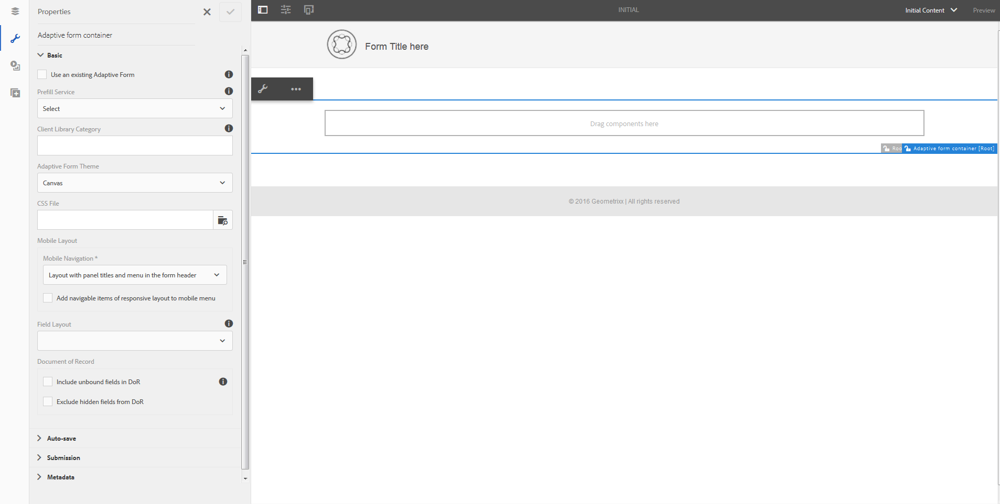

# 적응형 양식 템플릿{#adaptive-form-templates}

양식을 작성할 때는 필드 및 구성 요소를 추가하여 편집기에서 양식 구조, 컨텐츠 및 작업을 정의합니다. 양식 컨테이너의 `guideRootPanel`에 필드와 구성 요소를 추가합니다. 템플릿 편집기를 사용하면 작성자가 양식을 만드는 데 사용할 수 있는 기본 구조와 초기 컨텐츠가 포함된 템플릿을 만들 수 있습니다.

예를 들어, 모든 양식 작성자가 등록 양식에 특정 텍스트 상자, 탐색 단추 및 제출 단추를 포함하도록 할 수 있습니다. 작성자가 다른 등록 양식과 일치하는 양식을 만드는 데 사용할 수 있는 구성 요소를 사용하여 템플릿을 만들 수 있습니다. 작성자가 템플릿을 사용하여 적응형 양식을 만들면 새 양식은 템플릿에서 지정한 구조 및 구성 요소를 상속받습니다. 템플릿 편집기를 사용하면 다음 작업을 수행할 수 있습니다.

* 양식의 머리글 및 바닥글 구성 요소를 구조 레이어에 추가합니다.
* 양식의 초기 컨텐츠를 제공합니다.
* 테마를 지정하고 작업을 제출합니다.

## 템플릿 작업 {#working-with-templates}

도구 메뉴에서 **Adobe Experience Manager > 도구 > 템플릿**&#x200B;으로 이동하여 템플릿 편집기에 액세스할 수 있습니다. 여기서는 편집 가능한 템플릿에 대해 사용 가능한 폴더에 템플릿을 구성합니다. AEM에서는 템플릿을 구성하는 전역 폴더를 제공합니다. 그러나 기본적으로 활성화되어 있지 않습니다. 관리자에게 전역 폴더를 활성화하도록 요청하거나 템플릿에 대한 새 폴더를 만들 수 있습니다. 폴더를 만드는 방법에 대한 자세한 내용은 [템플릿 폴더](/help/sites-developing/page-templates-editable.md)를 참조하십시오.

을 눌러 폴더를 열면 적응형 양식의 새 템플릿을 만들 수 있는 만들기 단추가 표시됩니다.

### 템플릿 만들기 {#create-template}

폴더를 만든 후 폴더를 열고 다음 단계를 수행하여 템플릿을 만듭니다.

1. 템플릿 콘솔에서 만든 폴더 내에 **만들기**&#x200B;를 누릅니다.
1. 템플릿 유형 선택 섹션에서 **적응형 양식 템플릿**&#x200B;을 선택하고 **다음**&#x200B;을 누릅니다.

1. 템플릿 세부 사항 섹션에서 템플릿 제목을 제공하고 **만들기**를 누릅니다.
양식 작성 시 생성된 템플릿을 선택할 수 있을 때 볼 수 있는 설명과 축소판 그림을 제공할 수 있습니다.

1. **완료**&#x200B;를 탭하여 콘솔로 돌아가거나 **열기**&#x200B;를 탭하여 편집기에서 템플릿을 엽니다.

### 템플릿 편집기 UI {#template-editor-ui}

편집할 템플릿을 열면 다음 AEM Editor 구성 요소를 볼 수 있습니다.

* **페이지**
도구 모음다음 옵션을 포함합니다.

   * **사이드 패널 전환**:사이드바를 표시하거나 숨길 수 있습니다.
   * **페이지 정보**:게시/게시 취소 시간, 축소판, 클라이언트측 라이브러리, 페이지 정책 및 페이지 디자인 클라이언트측 라이브러리와 같은 정보를 지정할 수 있습니다.
   * **에뮬레이터**:다양한 장치의 모양을 시뮬레이션하고 사용자 지정할 수 있습니다.
   * **레이어 선택기:** 레이어를 변경할 수 있습니다.
**구조** 레이어 또는 **초기 컨텐츠** 레이어를 선택할 수 있습니다. 구조 레이어를 사용하면 머리글 및 바닥글을 추가하고 사용자 지정할 수 있습니다. 초기 컨텐츠 레이어를 사용하면 양식 컨텐츠를 사용자 지정할 수 있습니다.

   * **미리 보기:** 템플릿을 게시할 때 템플릿이 어떻게 보이는지 미리 볼 수 있습니다. 레이어 선택기 및 미리 보기 를 사용하여 편집 및 미리 보기 모드를 전환할 수 있습니다.

* **사이드바:** 컨텐츠, 속성, 자산 및 구성 요소 브라우저를 제공합니다.
* **구성 요소 도구 모음:**  구성 요소를 선택하면 구성 요소를 사용자 지정할 수 있는 도구 모음이 표시됩니다.
* **페이지**:템플릿을 만들 콘텐츠를 추가하는 영역입니다.

Touch UI 편집기를 이해하려면 [적응형 양식 작성 소개](../../forms/using/introduction-forms-authoring.md)를 참조하십시오.

### 템플릿 편집 {#editing-a-template}

적응형 양식 템플릿은 다음 두 개의 계층을 사용하여 만들어집니다.

* 구조
* 초기 컨텐츠

레이어 선택기는 화면의 오른쪽 상단 모서리에 있는 [미리 보기] 옵션 옆에 있습니다.

### 구조 {#structure}

템플릿 편집기에서 구조 레이어를 선택하면 적응형 양식 컨테이너 위아래에 레이아웃 컨테이너가 표시됩니다. 작성자는 머리글 및 바닥글에 이러한 레이아웃 컨테이너를 사용할 수 있습니다. 머리글 및 바닥글을 추가, 편집 또는 사용자 지정할 수 있습니다. 적응형 양식 컨테이너 위의 레이아웃 컨테이너에 있는 적응형 양식 헤더 구성 요소를 드래그하여 템플릿 헤더를 사용자 지정합니다. 적응형 양식 컨테이너 아래의 레이아웃 컨테이너에서 적응형 양식 바닥글 구성 요소를 드래그하여 템플릿 바닥글을 사용자 지정합니다.

구조 레이어의 레이아웃 컨테이너

**A.** 머리글 구성 요소의 레이아웃 컨테이너  **B.** 바닥글 구성 요소의 레이아웃 컨테이너

적응형 양식 컨테이너 위의 레이아웃 컨테이너에 있는 적응형 양식 헤더 구성 요소를 드래그하여 놓습니다. 구성 요소를 추가한 후 로고를 추가하고 해당 제목을 제공할 수 있는 속성을 지정할 수 있습니다.

마찬가지로 적응형 양식 컨테이너 아래의 레이아웃 컨테이너에서 바닥글 구성 요소를 드래그하여 놓으면 저작권 정보와 회사 세부 사항을 제공할 수 있습니다.

구조 레이어에 머리글 및 바닥글 추가

#### 구조 계층 {#locking-unlocking-components-in-the-structure-layer}에서 구성 요소 잠금/잠금 해제

구조 레이어를 선택한 상태로 템플릿을 편집할 때 템플릿의 머리글 및 바닥글의 잠금을 해제할 수 있습니다. 템플릿에서 구성 요소 잠금이 해제된 경우 양식 작성자는 템플릿을 사용하는 적응형 양식의 구성 요소를 편집할 수 있습니다. 구성 요소를 잠그면 양식 작성자가 적응형 양식으로 편집할 수 없습니다. 잠금 옵션은 구성 요소 도구 모음에서 사용할 수 있습니다.

예를 들어 템플릿에 헤더 구성 요소를 추가합니다. 구성 요소를 선택하면 구성 요소 도구 모음에 잠금 옵션이 표시됩니다. 일반적으로 헤더에 회사 이름과 로고가 포함되며, 양식 작성자가 템플릿의 로고와 헤더를 변경하지 않도록 합니다. 헤더 구성 요소가 잠긴 템플릿을 사용하여 만든 적응형 양식에서는 양식 작성자가 로고와 회사 이름을 변경할 수 없습니다.

>[!NOTE]
>
>헤더 구성 요소에서 이미지 또는 로고를 개별적으로 잠금 또는 잠금 해제할 수는 없습니다. 헤더 구성 요소의 잠금을 해제할 수 있습니다.

### 초기 컨텐츠 {#initial-content}

초기 컨텐츠 옵션을 선택하면 템플릿의 적응형 양식 컨테이너가 편집을 위한 적응형 양식과 같이 열립니다. 적응형 양식 작성과 마찬가지로 테마 선택 및 작업 제출과 같은 초기 설정을 지정할 수 있습니다.

양식 작성자는 양식을 만들기 위한 기반으로 사용합니다. 컨텐츠 흐름 구조는 템플릿의 초기 컨텐츠 레이어에 지정됩니다. 양식 템플릿의 초기 컨텐츠 편집으로 전환하려면 페이지 도구 모음에서 미리 보기 전에  **초기 컨텐츠**를 누릅니다.

속성을 지정하기 위해 선택한 적응형 양식 컨테이너를 보여주는 템플릿 편집기의 초기 컨텐츠 계층.

초기 컨텐츠 레이어에서 작성자가 기반으로 사용하는 적응형 양식 템플릿을 만듭니다. 템플릿 작성은 양식 작성과 유사하며, 사이드바에서 사용할 수 있는 옵션을 사용합니다. 사이드바는 컨텐츠, 속성, 자산 및 구성 요소 브라우저를 제공합니다.

[사이드바](../../forms/using/introduction-forms-authoring.md#sidebar)를 참조하십시오.

>[!NOTE]
>
>컨텐츠 저장 또는 StorePDF를 제출 작업으로 선택하면 저장 경로를 지정하는 옵션이 제공됩니다. 템플릿에 경로를 지정하면 템플릿에서 만든 모든 양식의 경로가 동일합니다. 올바른 저장소 경로를 지정하거나 양식 작성자가 업데이트하여 모든 양식이 동일한 위치에 저장되지 않도록 할 수 있습니다.

#### 탭 및 패널을 사용하여 적응형 양식 템플릿 만들기  {#creating-an-adaptive-form-template-with-tabs-and-panels-nbsp}

예를 들어 다음 탭으로 템플릿을 만들 수 있습니다.

* 일반 정보
* 전문 정보

로고를 추가하고 제목을 제공하고 구조 레이어에 바닥글을 추가했습니다. 양식 작성자가 템플릿을 사용하여 양식을 만들 때 양식 머리글 및 바닥글을 편집하지 못하도록 합니다.

레이어를 구조(Structure)에서 초기 컨텐츠(Initial Content)로 변경하고 양식에 컨텐츠를 추가합니다. 탭 구조를 만들려면 적응형 양식 컨테이너의 guideRootPanel에 하위 패널을 추가합니다. 패널을 추가하려면 다음을 수행하십시오.

* **구성 요소를 여기로 드래그하십시오.** 옵션을 선택하면 **+** 단추를 탭하여 패널을 추가할 수 있습니다.

* 사이드바의 구성 요소 브라우저에서 패널 구성 요소를 드래그하여 놓을 수 있습니다.
* 구성 요소 도구 모음에서 `guideRootPanel` 의 하위 패널을 추가할 수 있습니다.

일반 정보 및 전문 정보 탭을 만들려면 `guideRootPanel` 의 하위 패널에 두 개의 패널을 추가합니다. 패널을 선택하고 을 눌러 사이드바에서 속성을 엽니다. 요소 이름을 `general-info` 및 `professional-info` 로 변경하고 제목을 각각 일반 정보 및 전문 정보로 변경합니다. 사이드바에서 컨텐츠를 탭하여 컨텐츠 브라우저를 엽니다. 양식 객체 탭에서 `guideRootPanel`을 선택합니다. 편집기에서 guideRootPanel 이 선택됩니다. 구성 요소 도구 모음에서 을 탭하여 해당 속성을 엽니다. 패널 레이아웃 필드에서 **위쪽**&#x200B;탭을 선택하고 **완료**&#x200B;를 누릅니다. 탭 템플릿 구조가 적용됩니다.

#### 탭 {#adding-content-in-tabs}에 컨텐츠 추가

패널을 추가하고 탭으로 구조화한 후 탭 내에 필드를 추가할 수 있습니다. 편집기에서 탭을 선택하면 **구성 요소를 여기로 드래그하십시오** 옵션이 표시됩니다. 텍스트 상자, 목록 항목 및 단추와 같은 구성 요소를 드래그하여 놓을 수 있습니다. 사이드바의 구성 요소 브라우저에서 구성 요소를 드래그하여 놓을 수 있습니다.

각 구성 요소에는 데이터 캡처 및 조작을 향상시키는 속성이 있습니다. 예를 들어 구성 요소의 **필수 필드** 속성을 활성화할 수 있습니다. 작성자는 고객이 필수 필드 채우기를 건너뛸 때 표시되는 메시지를 지정할 수 있습니다. **필수 필드 메시지** 속성에 메시지를 지정합니다.

예제 템플릿의 이름, 전화 번호 및 생년월일 필드가 일반 정보 탭에 추가됩니다. Professional Information 탭에서 현재 고용된 사람, 고용 유형, 교육 자격 필드가 추가됩니다.

필드를 추가한 후 제출 및 재설정 등의 단추를 추가할 수 있습니다.

### 템플릿 {#enabling-the-template} 활성화

템플릿을 만들면 초안으로 추가됩니다. 템플릿을 활성화하여 적응형 양식을 만드는 데 사용할 수 있습니다. 템플릿을 활성화하려면

1. **Adobe Experience Manager > 도구 > 템플릿**&#x200B;으로 이동하고 템플릿을 만든 폴더를 엽니다.

1. 작성한 템플릿이 초안으로 표시됩니다.
1. 템플릿을 선택하고 도구 모음에서 **활성화**를 누릅니다.
적응형 양식을 만들 때 템플릿을 선택하라는 메시지가 표시되면 나열된 템플릿을 볼 수 있습니다.

## 템플릿 {#importing-or-exporting-a-template} 가져오기 또는 내보내기

양식은 해당 템플릿에서 작동합니다. 사용자 지정된 템플릿을 사용하여 만든 적응형 양식을 다운로드하면 템플릿이 다운로드되지 않습니다. 다른 AEM Forms 인스턴스에서 양식을 가져오면 해당 템플릿 없이 가져옵니다. 양식을 가져오지만 해당 템플릿을 사용할 수 없으면 양식이 렌더링되지 않습니다. `https://<server>:<port>/crx/packmgr` 의 `/conf` 노드에서 사용자 지정 템플릿을 패키징하고, 양식을 업로드할 AEM Forms 인스턴스에 포팅할 수 있습니다.

## 템플릿 {#creating-an-adaptive-form-using-the-template}을 사용하여 적응형 양식 만들기

템플릿을 만들고 활성화하면 적응형 양식을 만들 때 양식 관리자에서 사용할 수 있습니다. 템플릿을 사용하고 적응형 양식을 만들려면 [적응형 양식 만들기](../../forms/using/creating-adaptive-form.md)를 참조하십시오.

## 즉시 사용 가능한 템플릿 {#change-display-option-of-out-of-the-box-templates} 의 표시 옵션 변경

적응형 양식에 대한 사용자 지정 템플릿을 만들어 기본 구조 및 초기 컨텐츠를 정의할 수 있습니다. AEM Forms에서는 적응형 양식의 기본 템플릿 세트를 제공합니다. 템플릿을 표시하거나 숨기도록 선택할 수 있습니다.

템플릿을 표시하고 숨기려면 다음 단계를 수행하십시오.

1. AEM Forms 작성자 인스턴스에 로그인하고 **도구** > **작업** > **웹 콘솔**&#x200B;로 이동합니다.

   >[!NOTE]
   >
   >AEM 웹 콘솔의 URL은 https://&#39;[server]:[port]&#39;/system/console/configMgr입니다.

1. **FormsManager 구성** 설정을 찾아 엽니다.

   * 적응형 양식 템플릿을 표시하거나 숨기려면 **즉시 포함 AF 및 AD 템플릿 포함** 옵션을 선택하거나 선택 취소합니다.
   * AEM 6.0 Forms 또는 AEM 6.1 Forms 릴리스에 추가되었지만 이제 더 이상 사용되지 않는 적응형 양식 템플릿을 표시하거나 숨기려면 **AEM 6.0 AF 템플릿 포함** 옵션을 선택 또는 선택 취소합니다. 이 옵션을 선택하면 이 옵션을 적용하려면 **기본 제공 AF 포함 및 AD 템플릿** 구성을 활성화해야 합니다.

1. **저장**&#x200B;을 클릭합니다. 기본 템플릿에 대한 표시 옵션이 변경되었습니다.

## 추천 {#recommendations}

* 템플릿 편집기에서 폼의 속성을 수정할 때는 BindReference 속성을 사용하지 마십시오.
* 중단점을 추가하려면 적응형 양식 템플릿을 작성할 때 만듭니다.
중단점에 대한 자세한 내용은 [응답형 레이아웃](/help/sites-authoring/responsive-layout.md)을 참조하십시오.
