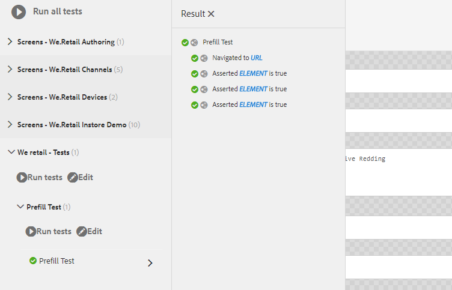

# 자습서: 적응형 양식 테스트{#tutorial-testing-your-adaptive-form}


이 자습서는 첫 번째 적응형 양식 [만들기 시리즈의 한 단계입니다](https://helpx.adobe.com/experience-manager/6-3/forms/using/create-your-first-adaptive-form.html) . 전체 자습서 사용 사례를 이해하고, 실행하고, 시연하려면 연순의 순서로 시리즈를 따르는 것이 좋습니다.

적응형 양식이 준비되면 최종 사용자에게 양식을 롤아웃하기 전에 응용 프로그램을 테스트하는 것이 중요합니다. 각 필드를 직접 테스트(기능 테스트)하거나 적응형 양식의 테스트를 자동화할 수 있습니다. 적응형 양식이 여러 개인 경우 모든 적응형 양식의 모든 필드를 수동으로 테스트하는 것은 어려운 작업이 됩니다.

AEM Forms은 적응형 양식의 테스트를 자동화하는 테스트 프레임워크인 Calvin을 제공합니다. 이 프레임워크를 사용하면 웹 브라우저에서 직접 UI 테스트를 작성하고 실행할 수 있습니다. 이 프레임워크에서는 테스트를 만들기 위한 JavaScript API를 제공합니다. 자동화된 테스트를 통해 적응형 양식의 자동 완성 경험, 적응형 양식, 표현식 규칙, 유효성 검사, 레이지 로딩 및 UI 상호 작용에서 경험을 제출할 수 있습니다. 이 자습서에서는 적응형 양식에 대한 자동화된 테스트를 만들고 실행하는 단계를 안내합니다. 이 튜토리얼의 끝에서 다음 작업을 수행할 수 있습니다.

* [적응형 양식의 테스트 세트 만들기](../../forms/using/testing-your-adaptive-form.md#step-create-a-test-suite)
* [적응형 양식에 대한 테스트 만들기](../../forms/using/testing-your-adaptive-form.md#step-create-a-test-case-to-prefill-values-in-an-adaptive-form)
* [적응형 양식에 대해 생성된 테스트 세트 및 테스트 실행](#step-run-all-the-tests-in-a-suite-or-individual-tests-cases)

## 1단계: 테스트 세트 만들기 {#step-create-a-test-suite}

테스트 세트에는 테스트 케이스 컬렉션이 있습니다. 여러 테스트 세트를 사용할 수 있습니다. 양식마다 별도의 테스트 세트가 있는 것이 좋습니다. 테스트 세트를 만들려면:

1. 관리자로 AEM Forms 작성자 인스턴스에 로그인합니다. CRXDE Lite 열기 AEM 로고 > **도구** > 일반 **** > **CRXDE Lite** 를 [누르거나 브라우저에서 https://localhost:4502/crx/de/index.jspURL을](https://localhost:4502/crx/de/index.jsp) 열어 CRXDE Lite을 열 수 있습니다.

1. CRXDE Lite의 /etc/clientlibs로 이동합니다. /etc/clientlibs 하위 폴더를 마우스 오른쪽 단추로 클릭하고 **만들기** > 노드 **만들기를 클릭합니다.** 이름 필드에서 **WeRetailFormTestCases를 입력합니다**. cq:ClientLibraryFolder로 **유형을** 선택하고 확인을 **클릭합니다**. 노드를 만듭니다. WeRetailFormTestCases 대신 임의의 이름을 사용할 수 있습니다.
1. WeRetailFormTestCases 노드에 다음 속성을 추가하고 모두 **저장을 탭합니다**.

<table>
 <tbody>
  <tr>
   <td><strong>속성</strong></td>
   <td><strong>유형</strong></td>
   <td><strong>다중</strong></td>
   <td><strong>값</strong></td>
  </tr>
  <tr>
   <td>카테고리</td>
   <td>문자열</td>
   <td>활성화됨</td>
   <td>
    <ul>
     <li>granite.testing.hobbes.tests<br /> </li>
     <li>granite.testing.calvin.tests</li>
    </ul> </td>
  </tr>
  <tr>
   <td>종속성</td>
   <td>문자열</td>
   <td>활성화됨</td>
   <td>
    <ul>
     <li>granite.testing.hobbes.testrunner <br /> </li>
     <li>granite.testing.calvin <br /> </li>
     <li>apps.testframework.all</li>
    </ul> </td>
  </tr>
 </tbody>
</table>

각 속성이 아래 표시된 대로 별도의 상자에 추가되어 있는지 확인합니다.


1. WeRetailFormTestCases **[!UICONTROL 노드를 마우스 오른쪽 단추로]** 클릭하고 **만들기** > 파일 **만들기를**&#x200B;클릭합니다. 이름 필드에 입력하고 `js.txt` 확인 **을 클릭합니다**.
1. 편집할 js.txt 파일을 열고 다음 코드를 추가하고 파일을 저장합니다.

   ```text
   #base=.
    init.js
   ```

1. 노드에서 init.js 파일을 `WeRetailFormTestCases`만듭니다. 파일에 아래 코드를 추가하고 모두 **[!UICONTROL 저장을 누릅니다]**.

   ```javascript
   (function(window, hobs) {
       'use strict';
       window.testsuites = window.testsuites || {};
     // Registering the test form suite to the sytem
     // If there are other forms, all registration should be done here
       window.testsuites.testForm3 = new hobs.TestSuite("We retail - Tests", {
           path: '/etc/clientlibs/WeRetailFormTestCases/init.js',
           register: true
       });
    // window.testsuites.testForm2 = new hobs.TestSuite("testForm2");
   }(window, window.hobs));
   ```

   위의 코드는 We retail - Tests라는 **테스트 세트를 만듭니다**.

1. AEM 테스트 UI를 엽니다(AEM > 도구 > 작업 > 테스트). 테스트 세트( **We retail - Tests** )가 UI에 나열됩니다.

   

## 2단계: 응용 양식의 값을 미리 채우기 위한 테스트 케이스 만들기 {#step-create-a-test-case-to-prefill-values-in-an-adaptive-form}

테스트 사례는 특정 기능을 테스트하는 일련의 작업입니다. 예를 들어, 양식의 모든 필드를 미리 작성하고 몇 개의 필드의 유효성을 검사하여 올바른 값이 입력되었는지 확인합니다.

작업은 단추 클릭과 같은 응용 양식의 특정 활동입니다. 각 응용 양식 필드에 대한 사용자 입력의 유효성을 검사하는 테스트 사례 및 작업을 만들려면:

1. CRXDE lite에서 `/content/forms/af/create-first-adaptive-form` 폴더로 이동합니다. create-first-adaptive-form **[!UICONTROL 폴더 노드를 마우스 오른쪽 단추로 클릭하고]** 만들기 **[!UICONTROL > 파일]**&#x200B;만들기를 클릭합니다 ****. 이름 필드에 입력하고 `prefill.xml` 확인 **[!UICONTROL 을 클릭합니다]**. 파일에 다음 코드를 추가합니다.

   ```xml
   <?xml version="1.0" encoding="UTF-8"?><afData>
     <afUnboundData>
       <data>
         <customer_ID>371767</customer_ID>
         <customer_Name>John Jacobs</customer_Name>
         <customer_Shipping_Address>1657 1657 Riverside Drive Redding</customer_Shipping_Address>
         <customer_State>California</customer_State>
         <customer_ZIPCode>096001</customer_ZIPCode>
        </data>
     </afUnboundData>
     <afBoundData>
       <data xmlns:xfa="https://www.xfa.org/schema/xfa-data/1.0/"/>
     </afBoundData>
   </afData>
   ```

1. 다음으로 이동 `/etc/clientlibs`. 하위 폴더를 마우스 오른쪽 단추로 `/etc/clientlibs` 클릭하고 **[!UICONTROL 만들기]**> 노드 **[!UICONTROL 만들기를 클릭합니다]**.

   이름 **[!UICONTROL 필드]** 유형 `WeRetailFormTests`. 유형을 선택하고 확인 `cq:ClientLibraryFolder` 을 **[!UICONTROL 클릭합니다]**.

1. 다음 속성을 WeRetailFormTests **[!UICONTROL 노드에]** 추가합니다.

<table>
 <tbody>
  <tr>
   <td><strong>속성</strong></td>
   <td><strong>유형</strong></td>
   <td><strong>다중</strong></td>
   <td><strong>값</strong></td>
  </tr>
  <tr>
   <td>카테고리</td>
   <td>문자열</td>
   <td>활성화됨</td>
   <td>
    <ul>
     <li>granite.testing.hobbes.tests<br /> </li>
     <li>granite.testing.hobbes.tests.testForm</li>
    </ul> </td>
  </tr>
  <tr>
   <td>종속성</td>
   <td>문자열</td>
   <td>활성화됨</td>
   <td>
    <ul>
     <li>granite.testing.calvin.tests</li>
    </ul> </td>
  </tr>
 </tbody>
</table>

1. WeRetailFormTests 노드에서 js.txt **[!UICONTROL 파일을]** 만듭니다. 파일에 다음을 추가합니다.

   ```shell
   #base=.
   prefillTest.js
   ```

   모두 **[!UICONTROL 저장을 클릭합니다]**.

1. WeRetailFormTests 노드 `prefillTest.js`에서 파일을 **[!UICONTROL 만듭니다]** . 파일에 아래 코드를 추가합니다. 이 코드는 테스트 케이스를 만듭니다. 테스트 케이스는 양식의 모든 필드를 미리 작성하고 일부 필드의 유효성을 검사하여 올바른 값이 입력되었는지 확인합니다.

   ```javascript
   (function (window, hobs) {
       'use strict';
   
       var ts = new hobs.TestSuite("Prefill Test", {
           path: '/etc/clientlibs/WeRetailFormTests/prefillTest.js',
           register: false
       })
   
       .addTestCase(new hobs.TestCase("Prefill Test")
           // navigate to the testForm which is to be test
           .navigateTo("/content/forms/af/create-first-adaptive-form/shipping-address-add-update-form.html?wcmmode=disabled&dataRef=crx:///content/forms/af/create-first-adaptive-form/prefill.xml")
           // check if adaptive form is loaded
           .asserts.isTrue(function () {
               return calvin.isFormLoaded()
           })
           .asserts.isTrue(function () {
               return calvin.model("customer_ID").value == 371767;
           })
           .asserts.isTrue(function () {
               return calvin.model("customer_ZIPCode").value == 96001;
           })
       );
   
       // register the test suite with testForm
       window.testsuites.testForm3.add(ts);
   
   }(window, window.hobs));
   ```

   테스트 케이스가 만들어지고 실행할 준비가 되었습니다. 테스트 케이스를 만들어 스크립트 실행 확인, 패턴 유효성 검사, 적응형 양식의 제출 경험 유효성 검사와 같은 적응형 양식의 다양한 측면을 확인할 수 있습니다. 적응형 양식 테스트의 다양한 측면에 대한 자세한 내용은 적응형 양식 테스트 자동화를 참조하십시오.

## 3단계: 패키지 또는 개별 테스트 케이스에서 모든 테스트 실행 {#step-run-all-the-tests-in-a-suite-or-individual-tests-cases}

테스트 세트는 여러 테스트 케이스를 가질 수 있습니다. 테스트 세트의 모든 테스트 케이스를 한 번에 또는 개별적으로 실행할 수 있습니다. 테스트를 실행할 때 아이콘에 결과가 표시됩니다.

* 확인 표시 아이콘은 전달된 테스트를 나타냅니다. 
* &quot;X&quot; 아이콘은 실패한 테스트를 나타냅니다. 

1. AEM 아이콘 > **[!UICONTROL 도구]**> 작업 ****> **[!UICONTROL 테스트로 이동합니다.]**
1. 테스트 세트의 모든 테스트를 실행하려면

   1. 테스트 패널에서 We retail - **[!UICONTROL Tests(1)를 누릅니다]**. 이 세트는 테스트 목록을 표시하도록 확장됩니다.
   1. 테스트 **[!UICONTROL 실행]** 단추를 누릅니다. 화면 오른쪽의 빈 영역은 테스트가 실행될 때 적응형 양식으로 대체됩니다.

   

1. 테스트 세트에서 단일 테스트를 실행하려면

   1. 테스트 패널에서 We retail - **[!UICONTROL Tests(1)를 누릅니다]**. 이 세트는 테스트 목록을 표시하도록 확장됩니다.
   1. Prefill Test **[!UICONTROL 를]** 누르고 테스트 **[!UICONTROL 실행]** 단추를 누릅니다. 화면 오른쪽의 빈 영역은 테스트가 실행될 때 적응형 양식으로 대체됩니다.

1. 테스트 이름(Prefill test)을 눌러 테스트 케이스 결과를 검토합니다. 결과 패널이 열립니다. [결과] 패널에서 테스트 케이스 이름을 눌러 테스트의 모든 세부 사항을 확인합니다.

   

이제 적응형 양식을 게시할 준비가 되었습니다.
