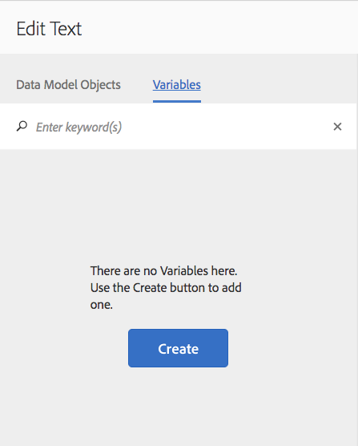
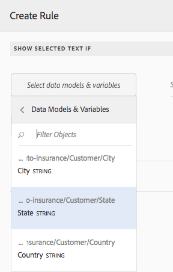

# 대화형 커뮤니케이션의 텍스트{#texts-in-interactive-communications}

## 개요 {#overview}

텍스트 문서 조각은 하나 이상의 텍스트 단락으로 구성됩니다. 단락은 정적 또는 동적일 수 있습니다. 동적 단락은 양식 데이터 모델 속성과 변수를 포함할 수 있습니다. 규칙을 적용하고 텍스트 문서 조각 내에서 반복할 수도 있습니다. 예를 들어, 인사말에 있는 고객 이름은 런타임 시 사용할 수 있게 된 값을 갖는 FDM(양식 데이터 모델) 등록 정보일 수 있습니다. 이러한 값을 변경하면 동일한 대화형 커뮤니케이션을 사용하여 에이전트 UI를 사용하여 다양한 고객을 위한 대화형 커뮤니케이션을 준비할 수 있습니다.

Interactive Communication의 텍스트 문서 조각은 다음과 같은 유형의 동적 데이터를 지원합니다.

* **데이터 모델 개체**: 데이터 속성은 백엔드 데이터 소스를 사용합니다.
* **규칙 기반 콘텐츠**: 규칙에 따라 나타나거나 숨겨지는 텍스트에 있는 컨텐츠의 일부 규칙은 양식 데이터 모델 속성 및 변수를 기반으로 할 수도 있습니다.
* **변수**: 텍스트 문서 조각에서 변수는 백엔드 데이터 소스에 바인딩되지 않습니다. 에이전트는 변수의 값을 입력/선택하거나 변수를 데이터 소스에 바인딩하는 동안 post 프로세스에 제출하기 위한 대화형 커뮤니케이션을 준비합니다.
* **반복**: Interactive Communication에서 동적 정보(예: 신용카드 명세서의 트랜잭션)가 있을 수 있으며 생성된 각 Interactive Communication에 따라 발생 수가 계속 변경될 수 있습니다. 반복을 사용하여 이러한 동적 정보의 형식을 지정하고 구조를 구성할 수 있습니다. 자세한 내용은 [인라인 조건 및 반복](https://helpx.adobe.com/experience-manager/6-3/forms/using/cm-inline-condition.html).

## 텍스트 만들기 {#createtext}

1. 선택 **[!UICONTROL Forms]** > **[!UICONTROL 문서 조각]**.
1. 선택 **[!UICONTROL 만들기]** > **[!UICONTROL 텍스트]**.
1. 다음 정보를 지정합니다.

   * **[!UICONTROL 제목]**: (선택 사항) 텍스트 문서 조각의 제목을 입력합니다. 제목은 고유해야 하며 특수 문자와 영어 이외의 문자를 사용할 수 있습니다. 텍스트는 미리 보기 및 속성과 같이 제목(사용 가능한 경우)으로 참조됩니다.
   * **[!UICONTROL 이름]**: 폴더 내의 텍스트에 대한 고유한 이름입니다. 어떤 상태에서든 동일한 이름의 두 문서 조각(텍스트, 조건 또는 목록)은 폴더에 존재할 수 없습니다. 이름 필드에 영어 문자, 숫자 및 하이픈만 입력할 수 있습니다. 이름 필드는 제목 필드를 기반으로 자동으로 채워집니다. 제목 필드에 입력한 특수 문자, 공백, 숫자 및 비영어 문자는 이름 필드에서 하이픈으로 바뀝니다. 제목 필드의 값이 자동으로 이름에 복사되지만 값을 편집할 수 있습니다.

   * **[!UICONTROL 설명]**: 텍스트에 대한 설명을 입력합니다.
   * **[!UICONTROL 양식 데이터 모델]**: 양식 데이터 모델 라디오 단추를 선택하여 양식 데이터 모델을 기반으로 텍스트를 생성합니다(선택적). 양식 데이터 모델 라디오 단추를 선택하면 **[!UICONTROL 양식 데이터 모델]** 필드가 나타납니다. 양식 데이터 모델을 찾아 선택합니다. 대화형 커뮤니케이션에 대한 텍스트 및 조건을 만드는 동안 대화형 커뮤니케이션에서 사용할 것과 동일한 데이터 모델을 사용해야 합니다. 양식 데이터 모델에 대한 자세한 내용은 [데이터 통합](/help/forms/using/data-integration.md).

   * **[!UICONTROL 태그]**: 사용자 지정 태그를 만들려면 텍스트 필드에 값을 입력하고 Enter 키를 누릅니다(선택적). 이 텍스트를 저장하면 새로 추가된 태그가 생성됩니다.

1. 탭 **[!UICONTROL 다음]**.

   텍스트 생성 페이지가 나타납니다. 양식 데이터 모델 기반 텍스트를 만들도록 선택한 경우 양식 데이터 모델 속성이 왼쪽 창에 나타납니다.

1. 텍스트를 입력하고 텍스트에 양식 데이터 모델 속성과 변수를 서식 지정, 조건부 지정 및 삽입하기 위해 다음 옵션을 사용합니다.

   * [양식 데이터 모델](#formdatamodel)
   * [변수](#variables)
   * [규칙 편집기](#rules)
   * [서식 옵션](#formatting)

      * [다른 응용 프로그램에서 서식이 지정된 텍스트를 복사하여 붙여넣습니다](#paste)

      * [텍스트 부분 강조 표시](#highlight)
   * [반복](/help/forms/using/cm-inline-condition.md)
   * [특수 문자](#special)
   * [텍스트 검색 및 바꾸기](#searching)
   * [키보드 단축키](/help/forms/using/keyboard-shortcuts.md)

   >[!NOTE]
   >
   >텍스트 편집기에서 @ 기호를 사용하여 양식 데이터 모델 요소, 데이터 사전 요소 및 변수를 추가할 수 있습니다. 텍스트 편집기에서 @ 앞에 문자열을 입력하면 모든 데이터 모델 요소, 데이터 사전 요소 및 변수를 검색하고 검색된 문자열을 포함하는 요소 또는 변수가 표시됩니다. 검색 결과를 탐색하고 요소나 변수를 선택할 수 있습니다. 일치하는 결과가 없으면 *일치하는 결과가 없습니다.* 메시지가 표시됩니다.

1. 탭 **[!UICONTROL 저장]**.

   텍스트가 만들어집니다. 이제 대화형 커뮤니케이션을 만드는 동안 텍스트를 빌딩 블록으로 계속 사용할 수 있습니다.

## 텍스트 편집 {#edittext}

다음 단계를 사용하여 기존 텍스트 문서 조각을 편집할 수 있습니다. Interactive Communication 편집기 내에서 텍스트 문서 조각을 편집하도록 선택할 수도 있습니다.

1. 선택 **[!UICONTROL Forms]** > **[!UICONTROL 문서 조각]**.
1. 텍스트 문서 조각으로 이동하여 선택합니다.
1. 탭 **[!UICONTROL 편집]**.
1. 필요한 변경 작업을 수행합니다. 텍스트 옵션에 대한 자세한 내용은 [텍스트 만들기](#createtext).
1. 탭 **[!UICONTROL 저장]** 그런 다음 **[!UICONTROL 닫기]**.

## 양식 데이터 모델 속성을 사용하여 텍스트 문서 조각 개인화 {#formdatamodel}

양식 데이터 모델 속성을 삽입하여 텍스트 문서 조각을 개인화할 수 있습니다. 텍스트에 양식 데이터 모델 속성을 삽입하여 Interactive Communication을 미리 보는 동안 관련 데이터 소스에서 수신자별 데이터를 가져와 채울 수 있습니다. 양식 데이터 모델에 대한 자세한 내용은 [AEM Forms 데이터 통합](/help/forms/using/data-integration.md).

텍스트를 만드는 동안 양식 데이터 모델을 지정한 경우 양식 데이터 모델의 속성이 텍스트 편집기의 왼쪽 창에 나타납니다. 지정된 양식 데이터 모델은 텍스트 문서 조각과 이를 포함하는 대화형 커뮤니케이션에 대해 동일해야 합니다.

* 양식 데이터 모델 속성을 텍스트에 삽입하려면 속성을 삽입할 위치에 커서를 놓은 다음 **[A]** 왼쪽 창에서 속성을 탭하고 탭합니다. **[!UICONTROL [B] 선택 항목 추가]**. 속성을 두 번 탭하여 **[C]** 커서 위치. 양식 데이터 모델 속성은 밝은 배경색으로 강조 표시됩니다.

또는 텍스트 편집기에서 @ 기호를 사용하여 양식 데이터 모델 속성을 검색하고 추가할 수 있습니다. 속성을 삽입할 위치에 커서를 놓습니다. @ 뒤에 검색 문자열을 입력합니다. 검색 작업은 문서 조각에서 사용할 수 있는 모든 양식 데이터 모델 속성과 변수에 대해 수행됩니다. 검색 문자열을 포함하는 속성 또는 변수가 검색되어 드롭다운 목록으로 표시됩니다. 검색 결과를 탐색하고 커서 위치에 삽입할 속성을 클릭합니다. 검색 결과를 숨기려면 Esc 키를 누릅니다.

* 에이전트 UI에서 양식 데이터 모델 속성의 값을 편집할 수 있도록 하려면 [대화형 통신 준비 및 보내기](/help/forms/using/prepare-send-interactive-communication.md) 에이전트 UI를 사용하여 **[D]** 해당 속성에 대한 잠금 아이콘과 잠금 해제 상태인지 확인합니다. 속성의 기본 상태가 잠겨 있고 에이전트가 에이전트 UI에서 속성을 편집할 수 없습니다.

양식 데이터 모델 속성을 사용하여 컨텐츠의 일부를 표시하거나 숨기는 규칙을 구성할 수도 있습니다. 자세한 내용은 [텍스트로 규칙 만들기](#rules).

## 텍스트 문서 조각에서 변수 만들기 및 사용 {#variables}

변수는 대화형 커뮤니케이션을 만드는 동안 바인딩할 수 있는 자리 표시자입니다. 변수는 양식 데이터 모델 속성 또는 텍스트 조각에 바인딩할 수 있습니다. 에이전트가 채우도록 변수를 둘 수도 있습니다.

다음과 같은 경우 양식 데이터 모델 속성 대신 변수를 사용할 수 있습니다.

* 텍스트 문서 조각은 서로 다른 대화형 커뮤니케이션에 대해 바인딩이 달라야 하는 여러 대화형 커뮤니케이션에서 사용됩니다.
* 텍스트 문서 조각은 작성 시 양식 데이터 모델을 포함하지 않습니다. 변수를 삽입하고 나중에 대화형 커뮤니케이션을 만들 때 양식 데이터 모델 속성에 바인딩할 수 있습니다.
* 텍스트 문서 조각에서 텍스트를 바인딩하고 검색해야 합니다. 이러한 텍스트 문서 조각만 변수에 바인딩할 수 있으며 그 변수에는 변수가 없어야 합니다.

텍스트 문서 조각을 만들거나 편집하는 동안 변수를 만들고 삽입할 수 있습니다. 작성한 변수가 에이전트 UI의 데이터 탭에 표시됩니다. 에이전트는 다음 기간 동안 변수의 값을 지정합니다. [에이전트 UI를 사용하여 대화형 통신 준비 및 보내기](/help/forms/using/prepare-send-interactive-communication.md).

### 변수 만들기 {#createvariables}

1. 왼쪽 창에서 **[!UICONTROL 변수]**.

   변수 창이 나타납니다.

   

1. 탭 **[!UICONTROL 만들기]**.

   변수 만들기 창이 나타납니다.

1. 다음 정보를 입력하고 탭합니다. **[!UICONTROL 만들기]**:

   * **[!UICONTROL 이름]** : 변수의 이름입니다.
   * **[!UICONTROL 설명]** : 변수에 대한 설명을 입력합니다(선택적).
   * **[!UICONTROL 유형]** : 변수 유형을 선택합니다. 문자열, 숫자, 부울 또는 날짜입니다.
   * **[!UICONTROL 특정 값만 허용]** : 문자열 및 숫자 변수의 경우 에이전트가 에이전트 UI의 자리 표시자에 대한 특정 값 세트에서 선택하도록 할 수 있습니다. 값 집합을 지정하려면 이 옵션을 선택한 다음, **[!UICONTROL 값]** 필드.

1. 탭 **[!UICONTROL 만들기]**.

   변수가 만들어지고 변수 창에 나열됩니다.

1. 텍스트에 변수를 삽입하려면 해당 위치에 커서를 놓고 변수를 선택한 다음 를 누릅니다 **[!UICONTROL 선택 항목 추가]**.

   

   변수는 연한 파란색 배경색으로 강조 표시되고 양식 데이터 모델 속성은 밝은 색상으로 강조 표시됩니다.

   또는 텍스트 편집기에서 @ 기호를 사용하여 변수를 검색하고 추가할 수 있습니다. 변수를 삽입할 위치에 커서를 놓습니다. @ 뒤에 검색 문자열을 입력합니다. 검색 작업은 문서 조각에서 사용할 수 있는 모든 양식 데이터 모델 속성과 변수에 대해 수행됩니다. 검색 문자열이 포함된 속성 및 변수가 검색되어 드롭다운 목록으로 표시됩니다. 검색 결과를 탐색하고 커서 위치에 삽입할 변수를 클릭합니다. 검색 결과를 숨기려면 Esc 키를 누릅니다.

1. 탭 **[!UICONTROL 저장]**.

## 텍스트로 규칙 만들기 {#rules}

텍스트에 규칙 편집기를 사용하면 규칙을 만들어 을 기반으로 텍스트 또는 컨텐츠 조각을 표시하거나 숨길 수 있습니다 **사전 설정 조건**. 이러한 조건은 다음을 기준으로 작성할 수 있습니다.

* 문자열
* 숫자
* 수식
* 날짜
* 연결된 양식 데이터 모델의 속성
* 텍스트에서 만들 수 있는 모든 변수

### 텍스트로 규칙 만들기 {#create-rules-in-text}

1. 텍스트를 만들거나 편집하는 동안 규칙을 사용하여 조건부 화하려는 텍스트 문자열, 단락 또는 콘텐츠를 선택합니다.

   

1. 탭 **[!UICONTROL 규칙 만들기]**.

   규칙 만들기 대화 상자가 나타납니다. 문자열, 숫자, 수학 표현식 및 날짜 외에도 규칙 편집기에서 규칙의 문을 만들 수도 있습니다.

   * 연결된 양식 데이터 모델의 속성
   * 만들 수 있는 모든 변수

   평가할 적절한 옵션을 선택합니다.

    

   >[!NOTE]
   >
   >텍스트 조건부 표시 및 조건부 표시 규칙을 만드는 데는 컬렉션 속성이 지원되지 않습니다.

1. 다음과 같음, 포함 및 다음으로 시작 등의 규칙을 평가할 적절한 연산자를 선택합니다.

   

1. 평가 표현식, 값, 데이터 모델 속성 또는 변수를 삽입합니다.

   

   FDM의 소스 데이터에 따라 수신자의 위치가 US인 경우 선택한 텍스트를 표시하는 규칙입니다

   * 규칙을 만들거나 편집하는 동안,  (크기 조정) 을 클릭하여 규칙 만들기/규칙 편집 대화 상자를 확장합니다. 확장된 전체 창 대화 상자에서는 양식 데이터 모델 속성과 변수를 드래그하여 놓아 규칙을 구성할 수 있습니다. 다시 크기 조정 을 탭하여 규칙 만들기 대화 상자로 돌아갑니다.
   * 규칙에 여러 조건을 만들 수도 있습니다.
   * 규칙이 이미 적용된 콘텐츠 부분에 규칙이 적용되는 겹치는 규칙을 만들 수도 있습니다.

1. **[!UICONTROL Done]**&#x200B;을 누릅니다.

   규칙이 적용됩니다. 규칙이 적용되는 텍스트나 콘텐츠는 녹색으로 강조 표시됩니다. 강조 표시의 왼쪽 핸들을 마우스로 가리키면 적용된 규칙이 나타납니다.

   

   적용된 규칙의 왼쪽 핸들을 클릭하면 규칙을 편집하거나 제거할 수 있는 옵션이 제공됩니다.

## 텍스트 서식 지정 {#formatting}

텍스트를 만들거나 편집하는 동안 도구 모음은 사용자가 선택한 편집 유형에 따라 변경됩니다. 단락, 정렬 또는 목록:

도구 모음 유형 선택: 단락, 정렬 또는 목록

글꼴 편집 도구 모음

정렬 도구 모음

목록 도구 모음

### 텍스트 부분 강조/강조 표시 {#highlight}

편집 가능한 문서 조각에서 텍스트의 일부를 강조 표시하려면 텍스트를 선택하고 [강조 색상]을 탭합니다.

기본 색상을 직접 탭할 수 있습니다 `**[A]**` 기본 색상 팔레트에 표시하거나 탭합니다. **선택** 슬라이더를 사용한 후 `**[B]**` 적절한 색상 음영을 선택합니다.

선택 사항으로 고급 탭으로 이동하여 적절한 색조, 밝기 및 채도를 선택할 수도 있습니다 `**[C]**` 정확한 색상을 만들려면 [선택]을 누릅니다 `**[D]**` 색상을 적용하여 텍스트를 강조 표시합니다.

### 서식이 지정된 텍스트 붙여넣기 {#paste}

Microsoft® Word 또는 HTML 페이지와 같이 다른 응용 프로그램에 있는 텍스트 단락 중 하나를 다시 사용하려면 텍스트를 복사하여 텍스트 편집기에 붙여넣습니다. 복사한 텍스트의 서식은 텍스트 편집기에서 유지됩니다.

하나 이상의 텍스트 단락을 편집 가능한 텍스트 문서 조각에 복사하여 붙여넣을 수 있습니다. 예를 들어 다음과 같이 주거 증명에 대한 글머리 기호 목록이 있는 Microsoft® Word 문서가 있을 수 있습니다.

Microsoft® Word 문서의 텍스트를 직접 복사하여 편집 가능한 텍스트 문서 조각에 붙여넣을 수 있습니다. 글머리 기호 목록, 글꼴, 텍스트 색상과 같은 서식은 텍스트 문서 조각에 유지됩니다.

>[!NOTE]
>
>그러나 붙여넣은 텍스트의 서식은 다음과 같습니다 [제한 사항](https://helpx.adobe.com/aem-forms/kb/cm-copy-paste-text-limitations.html).

## 텍스트에 특수 문자 삽입 {#special}

필요한 경우 문서 조각에 특수 문자를 삽입합니다. 예를 들어 특수 문자 팔레트를 사용하여 삽입할 수 있습니다.

* 통화 기호(예:, ¥, £)
* ∑, √, ∂ 및 과 같은 수학 기호
* 및 ‟ &quot; 등의 구두점 기호

텍스트 편집기가 210개의 특수 문자를 지원합니다. 관리자는 다음을 수행할 수 있습니다 [사용자 지정별 추가/사용자 지정 특수 문자 지원 추가](/help/forms/using/custom-special-characters.md).

## 텍스트 검색 및 바꾸기 {#searching}

대량의 텍스트를 포함하는 텍스트 문서 조각을 사용하여 작업하는 경우 특정 텍스트 문자열을 검색해야 합니다. 특정 텍스트 문자열을 대체 문자열로 대체해야 할 수도 있습니다.

찾기 및 바꾸기 기능을 사용하여 텍스트 문서 조각에서 텍스트 문자열을 검색(및 바꾸기)할 수 있습니다. 이 기능에는 강력한 정규 표현식 검색도 포함되어 있습니다.

1. 에 대한 텍스트 문서 조각을 엽니다. [편집](#edittext).
1. 탭 **[!UICONTROL 찾기 및 바꾸기]**.

1. 에서 검색할 텍스트를 입력합니다. **[!UICONTROL 찾기]** 텍스트 상자 및 새 텍스트(대체 텍스트)의 **[!UICONTROL 바꾸기]** 텍스트 상자 및 탭 **[!UICONTROL 바꾸기]**.

1. 검색된 텍스트를 찾으면 텍스트가 대체 텍스트로 바뀝니다.

   * 검색 텍스트의 다른 인스턴스가 발견되면 텍스트 문서 조각에서 해당 인스턴스가 강조 표시됩니다. 탭한 경우 **[!UICONTROL 바꾸기]** 즉, 세 번째 인스턴스가 발견되면 강조 표시된 인스턴스가 교체되고 커서가 앞으로 이동합니다.
   * 다른 인스턴스를 찾을 수 없으면 찾기 및 바꾸기 대화 상자에 다음과 같은 메시지가 표시됩니다. 모듈의 끝에 도달했습니다.

   모두 바꾸기 를 탭하여 한 번에 모든 일치 항목을 바꿀 수도 있습니다.

   찾기 및 바꾸기에 강력한 정규 표현식 검색도 포함되어 있습니다. 검색에서 regex를 사용하려면 **[!UICONTROL Reg ex]** 그런 다음 **[!UICONTROL 찾기]** 또는 **[!UICONTROL 바꾸기]**.
