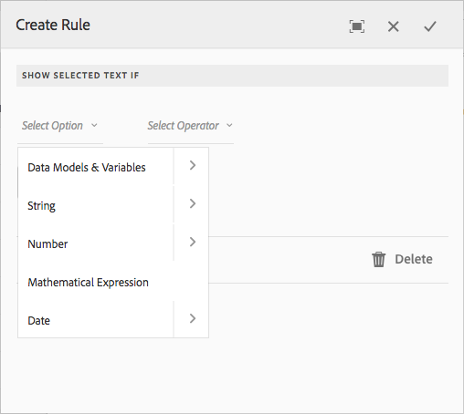
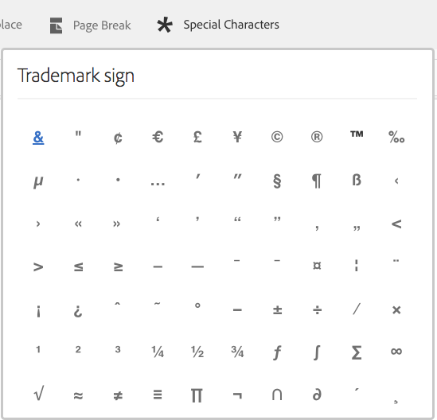

# 대화형 커뮤니케이션의 텍스트{#texts-in-interactive-communications}

## 개요 {#overview}

텍스트 문서 조각은 하나 이상의 텍스트 단락으로 구성됩니다. 단락은 정적 또는 동적 단락일 수 있습니다. 동적 단락에는 양식 데이터 모델 속성과 변수가 포함될 수 있습니다. 규칙을 적용하고 텍스트 문서 조각 내에서 반복할 수도 있습니다. 예를 들어 인사말에서 고객 이름은 런타임 시 사용할 수 있는 값이 있는 양식 데이터 모델(FDM) 속성일 수 있습니다. 이러한 값을 변경하면 동일한 대화형 통신 을 사용하여 Agent UI를 사용하는 다양한 고객을 위한 대화형 통신을 준비할 수 있습니다.

대화형 통신의 텍스트 문서 조각은 다음 유형의 동적 데이터를 지원합니다.

* **데이터 모델 개체**: 데이터 속성은 백엔드 데이터 소스를 사용합니다.
* **규칙 기반 콘텐츠**: 규칙에 따라 표시되거나 숨겨지는 텍스트의 콘텐츠 부분. 규칙은 양식 데이터 모델 속성 및 변수를 기반으로 할 수도 있습니다.
* **변수**: 텍스트 문서 단편에서 변수는 백엔드 데이터 소스에 바인딩되지 않습니다. 에이전트는 대화형 커뮤니케이션을 사후 프로세스에 제출하기 위해 준비하는 동안 변수에서 값을 입력/선택하거나 변수를 데이터 소스에 바인딩합니다.
* **반복**: 대화형 커뮤니케이션에 신용카드 명세서에서의 거래와 같은 동적 정보가 있을 수 있으며, 이 정보의 발생 횟수는 생성된 대화형 커뮤니케이션에서 계속 변경될 수 있습니다. 반복을 사용하면 이러한 동적 정보의 형식을 지정하고 구조를 지정할 수 있습니다. 자세한 내용은 [인라인 조건 및 반복](https://helpx.adobe.com/experience-manager/6-3/forms/using/cm-inline-condition.html).

## 텍스트 만들기 {#createtext}

1. 선택 **[!UICONTROL Forms]** > **[!UICONTROL 문서 단편]**.
1. 선택 **[!UICONTROL 만들기]** > **[!UICONTROL 텍스트]**.
1. 다음 정보를 지정합니다.

   * **[!UICONTROL 제목]**: (선택 사항) 텍스트 문서 조각의 제목을 입력합니다. 제목은 고유할 필요가 없으며 특수 문자와 영어가 아닌 문자를 포함할 수 있습니다. 텍스트는 썸네일 및 속성에서와 같이 제목으로 참조됩니다(사용 가능한 경우).
   * **[!UICONTROL 이름]**: 폴더 내의 텍스트에 대한 고유 이름입니다. 폴더에 같은 이름의 두 문서 조각(텍스트, 조건 또는 목록)이 어떤 상태에서도 존재할 수 없습니다. 이름 필드에는 영어 문자, 숫자 및 하이픈만 입력할 수 있습니다. 이름 필드는 제목 필드를 기반으로 자동으로 채워집니다. 제목 필드에 입력한 특수 문자, 공백, 숫자 및 영어가 아닌 문자는 이름 필드에서 하이픈으로 대체됩니다. 제목 필드의 값이 이름에 자동으로 복사되지만 값을 편집할 수 있습니다.

   * **[!UICONTROL 설명]**: 텍스트에 대한 설명을 입력합니다.
   * **[!UICONTROL 양식 데이터 모델]**: 선택적으로 양식 데이터 모델 라디오 단추를 선택하여 양식 데이터 모델을 기반으로 텍스트를 만듭니다. 양식 데이터 모델 라디오 단추를 선택하면 **[!UICONTROL 양식 데이터 모델]** 필드가 나타납니다. 양식 데이터 모델을 검색하여 선택하십시오. 대화형 커뮤니케이션에 대한 텍스트와 조건을 만드는 동안 대화형 커뮤니케이션에서 사용할 것과 동일한 데이터 모델을 사용해야 합니다. 양식 데이터 모델에 대한 자세한 내용은 [데이터 통합](/help/forms/using/data-integration.md).

   * **[!UICONTROL 태그]**: 사용자 지정 태그를 만들려면 텍스트 필드에 값을 입력하고 Enter 키를 누릅니다(선택 사항). 이 텍스트를 저장하면 새로 추가된 태그가 만들어집니다.

1. **[!UICONTROL 다음]**&#x200B;을 선택합니다.

   텍스트 생성 페이지가 나타납니다. 양식 데이터 모델 기반 텍스트를 만들도록 선택한 경우 왼쪽 창에 양식 데이터 모델 속성이 나타납니다.

1. 텍스트를 입력하고 다음 옵션을 사용하여 양식 데이터 모델 속성 및 변수를 텍스트에 서식, 조건화 및 삽입합니다.

   * [양식 데이터 모델](#formdatamodel)
   * [변수](#variables)
   * [규칙 편집기](#rules)
   * [서식 옵션](#formatting)

      * [다른 응용 프로그램에서 붙여넣기 형식의 텍스트를 복사합니다.](#paste)

      * [텍스트 부분 강조 표시](#highlight)

   * [반복](/help/forms/using/cm-inline-condition.md)
   * [특수 문자](#special)
   * [텍스트 검색 및 바꾸기](#searching)
   * [키보드 단축키](/help/forms/using/keyboard-shortcuts.md)

   >[!NOTE]
   >
   >텍스트 편집기에서 @ 기호를 사용하여 양식 데이터 모델 요소, 데이터 사전 요소 및 변수를 추가할 수 있습니다. 텍스트 편집기에 @ 앞에 문자열을 입력하면 모든 데이터 모델 요소, 데이터 사전 요소 및 변수가 검색되고 검색된 문자열을 포함하는 요소 또는 변수가 표시됩니다. 검색 결과를 탐색하고 요소 또는 변수를 선택할 수 있습니다. 일치하는 결과가 없으면 *일치하는 결과를 찾을 수 없음* 메시지가 표시됩니다.

1. **[!UICONTROL 저장]**&#x200B;을 선택합니다.

   텍스트가 만들어집니다. 이제 대화형 통신을 만드는 동안 텍스트를 빌딩 블록으로 사용할 수 있습니다.

## 텍스트 편집 {#edittext}

다음 단계를 사용하여 기존 텍스트 문서 조각을 편집할 수 있습니다. 대화형 통신 편집기 내에서 텍스트 문서 조각을 편집하도록 선택할 수도 있습니다.

1. 선택 **[!UICONTROL Forms]** > **[!UICONTROL 문서 단편]**.
1. 텍스트 문서 조각으로 이동하여 선택합니다.
1. **[!UICONTROL 편집]**&#x200B;을 선택합니다.
1. 필요한 사항을 변경합니다. 텍스트의 옵션에 대한 자세한 내용은 [텍스트 만들기](#createtext).
1. 선택 **[!UICONTROL 저장]** 다음을 선택합니다. **[!UICONTROL 닫기]**.

## 양식 데이터 모델 속성을 사용하여 텍스트 문서 조각 개인화 {#formdatamodel}

양식 데이터 모델 속성을 삽입하여 텍스트 문서 조각을 개인화할 수 있습니다. 텍스트에 양식 데이터 모델 속성을 삽입하면 대화형 통신을 미리 보는 동안 연결된 데이터 소스에서 수신자 관련 데이터를 가져와 채울 수 있습니다. 양식 데이터 모델에 대한 자세한 내용은 [AEM Forms 데이터 통합](/help/forms/using/data-integration.md).

텍스트를 만드는 동안 양식 데이터 모델을 지정한 경우 양식 데이터 모델의 속성이 텍스트 편집기의 왼쪽 창에 나타납니다. 지정된 양식 데이터 모델은 텍스트 문서 단편 및 이를 포함하는 대화형 통신에 대해 동일해야 합니다.

* 양식 데이터 모델 속성을 텍스트에 삽입하려면 속성을 삽입할 위치에 커서를 놓은 다음 **[A]** 왼쪽 창에서 속성을 탭하고 을(를) 선택합니다. **[!UICONTROL [B] 선택 항목 추가]**. 속성을 두 번 선택하여에 삽입할 수도 있습니다. **[C]** 커서 위치입니다. 양식 데이터 모델 속성은 갈색 배경색으로 강조 표시됩니다.

또는 텍스트 편집기에서 @ 기호를 사용하여 양식 데이터 모델 속성을 검색하고 추가할 수 있습니다. 속성을 삽입할 위치에 커서를 놓습니다. @ 를 입력한 다음 검색 문자열을 입력합니다. 검색 작업은 문서 조각에서 사용할 수 있는 모든 양식 데이터 모델 속성 및 변수에 대해 수행됩니다. 검색 문자열이 포함된 속성 또는 변수를 검색하여 드롭다운 목록으로 표시합니다. 검색 결과를 탐색하고 커서 위치에 삽입할 속성을 클릭합니다. 검색 결과를 숨기려면 Esc 키를 누릅니다.

* 에이전트가 에이전트 UI에서 양식 데이터 모델 속성의 값을 편집할 수 있도록 허용 [대화형 통신 준비 및 보내기](/help/forms/using/prepare-send-interactive-communication.md) 에이전트 UI를 사용하여 **[D]** 해당 속성에 대한 잠금 아이콘을 클릭하고 잠금 해제 상태인지 확인합니다. 속성의 기본 상태는 잠겨 있으며 에이전트는 에이전트 UI에서 속성을 편집할 수 없습니다.

양식 데이터 모델 속성을 사용하여 콘텐츠의 일부를 표시하거나 숨기는 규칙을 구성할 수도 있습니다. 자세한 내용은 [텍스트로 규칙 만들기](#rules).

## 텍스트 문서 조각에서 변수 만들기 및 사용 {#variables}

변수는 대화형 통신을 만드는 동안 바인딩할 수 있는 자리 표시자입니다. 변수는 양식 데이터 모델 속성이나 텍스트 조각에 바인딩될 수 있습니다. 에이전트가 채울 변수도 남아 있을 수 있습니다.

다음과 같은 경우 양식 데이터 모델 속성 대신 변수를 사용할 수 있습니다.

* 텍스트 문서 조각은 서로 다른 대화형 커뮤니케이션에 대해 바인딩이 달라야 하는 여러 대화형 커뮤니케이션에서 사용됩니다.
* 텍스트 문서 조각은 작성 시 양식 데이터 모델이 없습니다. 변수를 삽입하고 나중에 대화형 통신을 만들 때 양식 데이터 모델 속성에 바인딩할 수 있습니다.
* 텍스트 문서 조각에서 텍스트를 바인딩하고 검색해야 합니다. 이러한 텍스트 문서 조각만 변수에 바인딩할 수 있으며 내에 변수가 없으면 안 됩니다.

텍스트 문서 조각을 만들거나 편집하는 동안 변수를 만들고 삽입할 수 있습니다. 만든 변수가 에이전트 UI의 데이터 탭에 나타납니다. 에이전트는 변수의 값을 지정하는 반면 [에이전트 UI를 사용하여 대화형 통신 준비 및 보내기](/help/forms/using/prepare-send-interactive-communication.md).

### 변수 만들기 {#createvariables}

1. 왼쪽 창에서 을(를) 선택합니다 **[!UICONTROL 변수]**.

   변수 창이 나타납니다.

   

1. **[!UICONTROL 만들기]**&#x200B;를 선택합니다.

   변수 만들기 창이 나타납니다.

1. 다음 정보를 입력하고 다음을 선택합니다 **[!UICONTROL 만들기]**:

   * **[!UICONTROL 이름]** : 변수의 이름입니다.
   * **[!UICONTROL 설명]** : 변수에 대한 설명을 입력합니다(선택적).
   * **[!UICONTROL 유형]** : 변수 유형(문자열, 숫자, 부울 또는 날짜)을 선택합니다.
   * **[!UICONTROL 특정 값만 허용]** : 문자열 및 숫자 변수의 경우 에이전트가 에이전트 UI의 자리 표시자에 대한 특정 값 세트에서 선택하는지 확인할 수 있습니다. 값 집합을 지정하려면 이 옵션을 선택한 다음 **[!UICONTROL 값]** 필드.

1. **[!UICONTROL 만들기]**&#x200B;를 선택합니다.

   변수가 만들어지고 [변수] 창에 나열됩니다.

1. 텍스트에 변수를 삽입하려면 적절한 위치에 커서를 놓고 변수를 선택한 다음 를 선택합니다 **[!UICONTROL 선택 항목 추가]**.

   

   변수는 연한 파란색 배경색으로 강조 표시되고 양식 데이터 모델 속성은 갈색 색상으로 강조 표시됩니다.

   또는 텍스트 편집기에서 @ 기호를 사용하여 변수를 검색하고 추가할 수 있습니다. 변수를 삽입할 위치에 커서를 놓습니다. @ 를 입력한 다음 검색 문자열을 입력합니다. 검색 작업은 문서 조각에서 사용할 수 있는 모든 양식 데이터 모델 속성 및 변수에 대해 수행됩니다. 검색 문자열이 포함된 속성 및 변수를 검색하여 드롭다운 목록으로 표시합니다. 검색 결과를 탐색하고 커서 위치에 삽입할 변수를 클릭합니다. 검색 결과를 숨기려면 Esc 키를 누릅니다.

1. **[!UICONTROL 저장]**&#x200B;을 선택합니다.

## 텍스트로 규칙 만들기 {#rules}

텍스트에서 규칙 편집기를 사용하여 텍스트 또는 콘텐츠 조각을 기반으로 표시하거나 숨기는 규칙을 만들 수 있습니다 **사전 설정 조건**. 이러한 조건은 다음을 기반으로 구성할 수 있습니다.

* 문자열
* 숫자
* 수학 표현식
* 날짜
* 연결된 양식 데이터 모델의 속성
* 텍스트에서 만들었을 수 있는 모든 변수

### 텍스트로 규칙 만들기 {#create-rules-in-text}

1. 텍스트를 만들거나 편집할 때 규칙을 사용하여 조건화할 텍스트 문자열, 단락 또는 콘텐츠를 선택합니다.

   

1. 선택 **[!UICONTROL 규칙 만들기]**.

   [규칙 생성] 대화 상자가 나타납니다. 규칙 편집기에서는 문자열, 숫자, 수학 표현식 및 날짜 외에 다음 항목을 사용하여 규칙 명령문을 생성할 수 있습니다.

   * 연결된 양식 데이터 모델의 속성
   * 생성했을 수 있는 모든 변수

   평가할 적절한 옵션을 선택합니다.

    

   >[!NOTE]
   >
   >컬렉션 속성은 텍스트를 조건부로 지정하여 표시하는 규칙을 만드는 데 지원되지 않습니다.

1. 다음과 같음, 포함 및 다음으로 시작과 같이 규칙을 평가할 연산자를 적절히 선택합니다.

   

1. 평가 표현식, 값, 데이터 모델 속성 또는 변수를 삽입합니다.

   

   FDM의 소스 데이터에 따라 수신자 위치가 미국인 경우 선택한 텍스트를 표시하는 규칙

   * 규칙을 만들거나 편집하는 동안 다음을 선택할 수도 있습니다.  (크기 조정) - [규칙 만들기/규칙 편집] 대화 상자를 확장합니다. 확장된 전체 창 대화 상자를 통해 양식 데이터 모델 속성 및 변수를 드래그하여 놓아 규칙을 구성할 수 있습니다. 크기 조정 을 다시 선택하여 규칙 만들기 대화 상자로 돌아갑니다.
   * 규칙에 여러 조건을 만들 수도 있습니다.
   * 규칙이 이미 적용된 콘텐츠의 일부에 적용되는 겹치는 규칙을 만들 수도 있습니다.

1. **[!UICONTROL 완료]**&#x200B;를 선택합니다.

   규칙이 적용됩니다. 규칙이 적용되는 텍스트 또는 콘텐츠가 녹색으로 강조 표시됩니다. 강조 표시의 왼쪽 핸들을 마우스로 가리키면 적용된 규칙이 나타납니다.

   

   적용된 규칙의 왼쪽 핸들을 클릭하면 규칙을 편집하거나 제거할 수 있는 옵션이 제공됩니다.

## 텍스트 서식 지정 {#formatting}

텍스트를 만들거나 편집하는 동안 단락, 정렬 또는 목록 중에서 선택한 편집 유형에 따라 도구 모음이 변경됩니다.

도구 모음의 유형(단락, 정렬 또는 목록)을 선택합니다.

글꼴 편집 도구 모음

정렬 도구 모음

목록 도구 모음

### 텍스트 일부 강조/강조 {#highlight}

편집 가능한 문서 조각에서 텍스트 일부를 강조\강조하려면 텍스트를 선택하고 [강조 색상]을 선택합니다.

기본 색상을 직접 선택할 수 있습니다 `**[A]**` 기본 색상 팔레트에 있거나 선택 **선택** 슬라이더 사용 후 `**[B]**` 을 눌러 해당 색상의 적절한 음영을 선택합니다.

필요한 경우 고급 탭으로 이동하여 해당 색조, 밝기 및 채도를 선택할 수도 있습니다 `**[C]**` 정확한 색상을 만든 다음 [선택]을 선택합니다 `**[D]**` 텍스트를 강조 표시하는 색상을 적용합니다.

### 서식 있는 텍스트 붙여넣기 {#paste}

Microsoft® Word 또는 HTML 페이지와 같은 다른 애플리케이션에 있는 하나 이상의 텍스트 단락 중 하나를 재사용하려면 텍스트를 복사하여 텍스트 편집기에 붙여넣습니다. 복사한 텍스트의 서식은 텍스트 편집기에서 유지됩니다.

편집 가능한 텍스트 문서 조각에 하나 이상의 텍스트 단락을 복사하여 붙여넣을 수 있습니다. 예를 들어 다음과 같이 거주 증명에 대한 글머리 기호 목록이 있는 Microsoft® Word 문서가 있을 수 있습니다.

Microsoft® Word 문서의 텍스트를 직접 복사하여 편집 가능한 텍스트 문서 조각에 붙여넣을 수 있습니다. 글머리 기호 목록, 글꼴 및 텍스트 색상과 같은 서식은 텍스트 문서 조각에 유지됩니다.

>[!NOTE]
>
>그러나 붙여넣은 텍스트의 서식에는 몇 가지 내용이 있습니다 [제한 사항](https://helpx.adobe.com/aem-forms/kb/cm-copy-paste-text-limitations.html).

## 텍스트에 특수 문자 삽입 {#special}

필요한 경우 문서 조각에 특수 문자를 삽입합니다. 예를 들어 특수 문자 팔레트를 사용하여 다음을 삽입할 수 있습니다.

* 통화 기호(예: €,, £)
* ∑, √, ∂ 및 ^ 등의 수학 기호
* 및 와 같은 ‟ 구두점 기호

텍스트 편집기는 210개의 특수 문자를 기본 지원합니다. 관리자는 다음을 수행할 수 있습니다. [사용자 정의별로 추가/사용자 정의 특수 문자에 대한 지원 추가](/help/forms/using/custom-special-characters.md).

## 텍스트 검색 및 바꾸기 {#searching}

많은 양의 텍스트가 포함된 텍스트 문서 조각을 사용하여 작업할 때 특정 텍스트 문자열을 검색해야 합니다. 특정 텍스트 문자열을 대체 문자열로 대체해야 할 수도 있습니다.

찾기 및 바꾸기 기능을 사용하면 텍스트 문서 조각에서 텍스트 문자열을 검색(및 바꾸기)할 수 있습니다. 이 기능에는 강력한 정규 표현식 검색도 포함됩니다.

1. 다음에 대한 텍스트 문서 단편 열기 [편집](#edittext).
1. 선택 **[!UICONTROL 찾기 및 바꾸기]**.

1. 검색할 텍스트 입력 **[!UICONTROL 찾기]** 텍스트 상자와 **[!UICONTROL 바꾸기]** 텍스트 상자 및 선택 **[!UICONTROL 바꾸기]**.

1. 검색된 텍스트가 있으면 텍스트가 대체 텍스트로 바뀝니다.

   * 검색 텍스트의 다른 인스턴스가 발견되면 해당 인스턴스가 텍스트 문서 조각에서 강조 표시됩니다. 다음을 선택하는 경우 **[!UICONTROL 바꾸기]** 세 번째 인스턴스가 발견되면 강조표시된 인스턴스가 대체되고 커서가 앞으로 이동합니다.
   * 다른 인스턴스를 찾을 수 없는 경우 찾기 및 바꾸기 대화 상자에 다음 메시지가 표시됩니다. 모듈 끝에 도달했습니다.

   모두 바꾸기 를 선택하여 한 번에 일치하는 모든 항목을 바꿀 수도 있습니다.

   [찾기 및 바꾸기]에는 강력한 정규 표현식 검색도 포함됩니다. 검색에 정규 표현식을 사용하려면 다음을 선택합니다. **[!UICONTROL 일반 표현식]** 다음을 선택합니다. **[!UICONTROL 찾기]** 또는 **[!UICONTROL 바꾸기]**.
