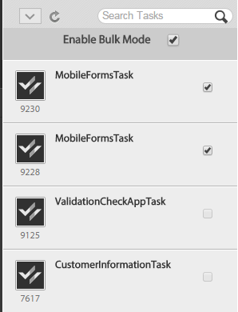

# 할 일 목록 작업{#working-with-to-do-lists}

할 일 목록을 볼 때 사용자에게 할당된 비즈니스 프로세스, 또는 사용자가 속한 그룹 또는 다른 사용자의 공유 작업에서 작업을 볼 수 있습니다. 요청을 승인하거나 거부하거나 추가 정보를 추가하는 등 필요에 따라 작업을 열어서 작업하고 완료할 수 있습니다. 작업을 완료하면 비즈니스 프로세스의 다음 사람에게 전송됩니다.

## 할 일 목록 정보 {#about-todo-lists}

AEM Forms 작업 영역에는 다음과 같은 세 가지 유형의 할 일 목록이 있습니다.

* 사용자에게 직접 할당된 작업을 포함하는 개별 목록입니다.
* 그룹에 할당된 작업을 포함하는 그룹 목록입니다. 그룹의 모든 구성원은 작업을 열고 완료할 수 있습니다. 작업을 열려면 그룹 구성원이 먼저 작업을 요청해야 합니다.
* 공유 목록 - 사용자 및 다른 사용자와 할 일 목록을 공유한 사용자에게 할당된 작업을 포함합니다. 목록을 공유하는 모든 사용자는 공유 작업을 요청, 열기 및 완료할 수 있습니다.

작업 위로 포인터를 가져갈 때 나타나는 아이콘을 클릭하여 작업을 열지 않고도 일부 작업을 수행할 수 있습니다.

>[!NOTE]
>
>느낌표 아이콘은 작업의 우선 순위가 높음을 나타냅니다.

## 일반적인 작업 {#typical-tasks}

작업을 열고 작업할 때 사용할 수 있는 도구는 작업에 따라 다릅니다. 다른 작업을 수행하려면 서로 다른 작업을 수행해야 하며 이러한 이유로 일부 도구를 사용할 수 없거나 사용할 수 없습니다. 아래 설명된 일반적인 작업을 참조하십시오.

**정보**&#x200B;제공:양식을 작성하여 제출해야 하는 작업을 받습니다.

**검토 정보**:정보를 검토하고 컨텐츠에 로그오프해야 하는 작업을 받게 됩니다.

**다중 사용자 검토**:다른 사용자가 작업을 받는 동시에 작업을 받습니다. 사용자와 다른 사용자는 정보를 제공하거나 컨텐츠를 검토하거나 둘 다를 수행해야 합니다. 이 유형의 작업에는 다음 도구를 사용할 수 있습니다.

* 작업 지침 보기
* 작업이 할당된 모든 사용자의 완료 상태 보기
* 작업이 할당된 모든 사용자의 주석 보기
* 작업에 직접 주석 추가

위의 작업 중 하나에서 사용할 수 있는 추가 도구는 다음과 같습니다.

* 앞으로
* 공유
* 자세한 내용은
* 반환
* 메모
* 첨부 파일

## 작업 열기 {#opening-tasks}

할 일 목록에서 작업을 열고 잠그거나 그룹 또는 공유 할 일 목록에서 작업을 요청하고 열 수 있습니다. 작업을 열면 기본 창에 표시됩니다. 다른 작업은 할 일 목록 옆에 있는 작업 목록에 표시됩니다.

작업 요약 URL이 있는 경우 작업과 연결된 양식 대신 기본적으로 작업 요약 보기가 열립니다. 사용자가 작업 할당에서 &#39;최대화된 모드에서 양식 열기&#39; 옵션을 활성화해도 양식은 최대화된 모드로 열리지 않습니다.

>[!NOTE]
>
>작업을 열 때 작업 기본값으로 연결된 양식이 전체 보기에 표시될 수 있습니다.

### 목록에서 작업 열기 및 잠금 {#open-and-lock-a-task-from-your-list}

할 일 목록에서 작업을 열 때 목록이 공유되는 경우 작업을 잠가 목록에 액세스할 수 있는 다른 사용자가 작업을 수행하지 못하도록 할 수 있습니다.

1. 할 일 페이지의 왼쪽 창에서 개별 할 일 목록을 선택합니다. 모든 작업이 가운데 창에 표시됩니다.

   >[!NOTE]
   >
   >할 일 목록에서 프로세스 유형을 선택하여 작업을 필터링할 수 있습니다. 할 일 목록을 선택하여 할 일 목록의 모든 작업을 다시 볼 수 있습니다.

1. 필요한 경우 작업을 잠급니다. 작업을 잠그려면 작업에서 모든 옵션 아이콘을 클릭하고 잠금을 선택합니다. 옵션을 사용할 수 있도록 작업에 포인터를 놓습니다.

   >[!NOTE]
   >
   >작업이 열려 있을 때 모든 탭에서 작업을 잠그거나 잠금 해제할 수도 있습니다.

   

   작업의 모든 옵션 메뉴

1. 작업을 클릭하여 엽니다.

### 공유 또는 그룹 목록에서 작업 열기 및 요청 {#open-and-claim-a-task-from-a-shared-or-group-list}

그룹 또는 공유 목록에서 작업을 열어 요청할 경우 해당 작업은 그룹 또는 공유 목록에서 개별 할 일 목록으로 이동합니다. 목록에 액세스할 수 있는 다른 사용자는 작업을 수행할 수 없습니다.

1. 할 일 페이지의 왼쪽 창에서 그룹 또는 공유 할 일 목록을 선택합니다. 모든 작업이 가운데 창에 표시됩니다.
1. 다음 단계 중 하나를 수행합니다.

   * 작업을 열지 않고 그룹 또는 공유 할 일 목록에서 요청하려면 포인터를 **작업** 위로 가져가서 클레임을 클릭합니다. 또는 작업이 열려 있으면 작업 창 아래의 작업 표시줄에서 청구 단추를 사용할 수 있습니다. 청구 시 작업은 그룹 또는 공유 할 일 목록에서 사용자의 목록으로 이동합니다.
   * 그룹 또는 공유 할 일 목록에서 작업을 요청하고 열려면 클레임을 클릭하고 **엽니다**.

## Working with tasks {#working-with-tasks}

작업을 열면 기본 창에 표시되는 탭과 사용할 수 있는 도구는 작업에 따라 다릅니다. 표시되는 탭은 아래에 설명되어 있습니다.

**작업 요약**:작업이 열리면 [작업 요약] 창을 통해 작업 지정 단계의 프로세스에 지정된 URL을 사용하여 작업에 대한 정보를 표시할 수 있습니다. AEM Forms 작업 영역의 최종 사용자에게 더 많은 값을 추가하기 위해 작업 요약 창 추가 및 관련 정보를 표시할 수 있습니다. 작업 요약 URL이 없는 경우 이 탭을 사용할 수 없습니다.

**세부 정보**:현재 작업 및 해당 작업이 속한 프로세스에 대한 일부 정보를 제공합니다.

**양식**:작업과 연관된 양식을 표시합니다. 이 양식은 PDF, HTML, 안내서, SWF 파일 등 다양한 파일 형식일 수 있습니다. 이 양식은 인쇄 가능한 일반 양식이나 웹 기반 양식처럼 보이거나 정보를 수집하기 위해 일련의 마법사 스타일 패널을 통해 안내할 수 있습니다.

**내역**:프로세스 인스턴스의 일부인 작업과 각 작업의 관련 양식, 작업 지정 및 첨부 파일을 나열합니다.

**첨부 파일**:작업과 연관된 기존 첨부 파일을 표시하고 필요한 경우 첨부 파일을 추가합니다.

**참고**:작업과 연관된 기존 메모를 표시하고 필요한 경우 메모를 추가합니다.

작업 시 볼 수 있는 도구 및 수행할 수 있는 작업은 아래에 설명되어 있습니다.

### 작업 전달, 공유 또는 컨설팅 {#forward-share-or-consult-on-a-task}

노트 또는 첨부 파일과 함께 작업을 다른 사용자에게 전달하거나 작업을 공유하거나 다른 사용자와 작업을 참조할 수 있습니다. 작업과 연관된 양식 데이터를 변경하는 경우 작업을 진행하거나 공유하거나 문의하기 전에 양식을 초안으로 저장합니다. 그렇지 않으면 업데이트된 양식 없이 작업이 전송됩니다. 작업을 전달하여 공유하면 해당 작업을 받은 사용자가 작업을 요청하고 완료하거나 사용자에게 반환할 수 있습니다. 작업을 문의하는 경우 사용자는 해당 작업만 반환할 수 있습니다.

1. 보관하려는 작업과 연관된 양식을 변경한 경우 저장을 **클릭합니다**. 저장 옵션은 각 탭 하단의 작업 표시줄에서 사용할 수 있습니다. 그렇지 않으면 업데이트된 양식 없이 작업이 전송됩니다.

   >[!NOTE]
   >
   >작업 중인 작업에 따라 일부 양식에 저장 단추를 사용할 수 없습니다.

1. 탭에서 다음 단추 중 하나를 클릭합니다.

   * **앞으로**
   * **공유**
   * **자세한 내용은**
   >[!NOTE]
   >
   >작업에 따라 작업을 열지 않고도 할 일 목록에서 이러한 작업을 수행할 수도 있습니다.

1. 팝업 대화 상자에서 작업을 전달하거나 공유하거나 참조할 사용자 이름을 검색하여 선택합니다.

### 작업 반환 {#return-a-task}

1. 탭에서 [돌아가기]를 **클릭합니다**. 작업은 이전에 작업을 전달했거나 작업을 공유하거나 귀하와 상담한 사용자의 할 일 목록으로 반환됩니다.

### 오프라인으로 작업 가져오기 {#take-a-task-offline}

오프라인으로 작업하고 Adobe® Reader®, Adobe® Acrobat® Professional 또는 Adobe® Acrobat® Standard에서 양식을 제출할 수 있습니다. 양식이 제출되면 이메일 클라이언트는 적절한 서버 이메일 주소로 시작됩니다. 그런 다음 완성된 양식을 서버에 이메일로 보낼 수 있습니다.

1. 모든 탭에서 [오프라인]을 **클릭합니다**.
1. 파일 이름을 지정하여 양식을 저장하고 저장을 **클릭합니다**. 작업과 연결된 양식은 로컬에 저장되고 해당 작업이 양식을 제출할 때까지 할 일 목록에 남아 있습니다.

### 첨부 파일 사용 {#work-with-attachments}

모든 첨부 파일을 로컬에 추가, 업데이트, 삭제 또는 저장할 수 있습니다.

**첨부 파일 추가**

1. 첨부 **파일** 탭에서 찾아보기를 **클릭하여** 첨부할 파일을 선택합니다.
1. 프로세스에 **참여하는** 다른 사용자의 첨부 파일에 대한 권한 수준을 선택합니다. 읽기를 **선택하면**&#x200B;다른 사용자가 해당 파일을 로컬에 저장할 수 있습니다. 편집 권한 중 하나를 선택하면 다른 사용자가 새 파일을 업로드하여 첨부 파일을 대체할 수도 있습니다.

   >[!NOTE]
   >
   >첨부 파일과 함께 주석을 추가할 수도 있습니다.

1. Click **Upload**. 파일이 양식에 첨부됩니다.

**첨부 파일 보기**

1. 첨부 **파일** 탭에서 볼 첨부 파일의 파일 이름을 클릭합니다.

**로컬로 첨부 파일 저장**

1. 첨부 파일을 클릭하여 엽니다. 열려 있는 첨부 파일을 로컬에 저장합니다.

**첨부 파일 업데이트**

1. 첨부 **파일에** 대해 편집을 클릭합니다. 찾아보기를 클릭하여 기존 첨부 파일을 바꿀 파일을 **선택합니다**.

**첨부 파일 삭제**

1. 첨부 **파일에** 대해 삭제를 클릭합니다.

### 작업 완료 없이 작업 저장 {#save-your-work-without-completing-the-task}

1. 탭에서 저장을 **누릅니다**.

   초안으로 저장 대화 상자가 나타납니다. 초안의 기본 이름은 작업 템플릿의 작업 이름입니다.

   

   >[!NOTE]
   >
   >사용자가 입력한 정보를 초안으로 주기적으로 자동 저장하도록 작업 영역을 구성할 수 있습니다. 자동 저장 기능이 활성화되어 있고 사용자가 초안에서 작업 중인 경우 초안이 주기적으로 저장됩니다. 자동 저장의 경우 작업의 기본 이름이 자동으로 사용됩니다.
   >
   >
   >자세한 내용은 기본 설정 관리의 초안 [저장을 참조하십시오](/help/forms/using/getting-started-livecycle-html-workspace.md).

1. [초안으로 저장] 대화 상자에서 작업의 고유한 이름을 지정하고 [확인]을 **누릅니다**.

   

   초안이 지정된 이름으로 저장됩니다. 작업은 [할 일] 목록에 남아 있으며 양식에서 변경한 내용은 [초안] 폴더에 저장됩니다. 또한 할 일 목록에서 초안 이름을 사용하여 초안을 검색하여 작업을 다시 시작할 수 있습니다.

   

## 작업 완료 {#completing-tasks}

작업을 완료하는 방법은 작업 자체와 프로세스의 역할에 따라 달라집니다. 귀하는 요청을 승인 또는 거절하거나, 컨텐트를 제공하거나, 정보를 검토 및 검증하거나, 귀하의 행동을 지적하도록 요구 받을 수 있습니다.

다음과 같은 다양한 방법으로 작업을 완료할 수 있습니다.

* 탭에서 사용 가능한 작업 사용
* 양식 자체에 내장된 작업 사용
* 작업을 열지 않고 할 일 목록에서 다음을 수행합니다.참고:이 옵션은 프로세스를 디자인하는 동안 워크벤치의 `isMustOpenToComplete` `Assign Task` 단계에서 필드를 선택하지 않은 경우 사용할 수 있습니다.
* 이메일 알림을 받는 경우

작업을 완료할 때 작업에 따라 확인 대화 상자가 동작을 다시 확인하는 것처럼 보일 수 있습니다. 예를 들어 제공한 정보의 유효성을 입증하라는 대화 상자가 표시될 수 있습니다.

>[!NOTE]
>
>작업을 변경했지만 완료할 준비가 되지 않은 경우 저장을 클릭하여 작업을 초안으로 저장하고 나중에 다시 돌아갈 수 있습니다.

### 작업 완료 {#complete-a-task}

1. 다음 단계 중 하나를 수행합니다.

   * 작업을 선택하고 목록 하단의 프로세스에서 필요한 다음 단계에 해당하는 단추를 클릭합니다.
   * 양식에 단추가 없고 AEM Forms 작업 영역의 완료 단추를 사용할 수 있는 경우 완료를 **클릭합니다**.
   * 양식에 단추가 있고 AEM Forms 작업 영역의 완료 단추를 사용할 수 없는 경우 양식에 있는 해당 단추를 클릭하여 프로세스에 필요한 다음 단계를 수행하십시오.
   양식에 단추가 없고 AEM Forms 작업 영역의 완료 단추를 사용할 수 없는 경우 양식을 제출할 수 없음을 나타내는 메시지가 표시됩니다.

1. 확인 대화 상자가 나타나면 다음 작업 중 하나를 수행합니다.

   * 작업을 **완료하고** 작업을 시작할 준비가 되면 확인을 클릭합니다.
   * 작업으로 **돌아가고** 싶지 않은 경우 취소를 클릭합니다.

>[!NOTE]
>
>양식에 처리 속성이 사용될 때 HTML 양식 내에 제출 단추가 표시될 수 있습니다. 이 단추는 동일한 양식이 PDF로 렌더링될 때 표시되지 않습니다. 작업을 완료하려면 AEM Forms 작업 영역의 아래쪽에 있는 [제출] 단추를 클릭하여 양식 내의 [제출] 단추가 아닌 다른 양식을 엽니다.

### 일괄 승인 작업 {#bulk-approve-tasks}

[할 일] 목록에서 여러 작업을 제출할 수 있습니다. 동일한 프로세스의 작업과 동일한 작업 이름과 동일한 경로 옵션을 함께 제출할 수 있습니다.

>[!NOTE]
>
>이 옵션은 프로세스를 디자인하는 동안 워크벤치의 작업 지정 단계에서 isMustOpenToComplete 필드를 선택하지 않은 경우에 사용할 수 있습니다.

1. 할 일 페이지의 왼쪽 창에서 개별 할 일 목록을 선택합니다. 모든 작업이 가운데 창에 표시됩니다.
1. 벌크 **모드 활성화를 선택합니다**. 목록의 작업 앞에 확인란이 나타납니다.

   >[!NOTE]
   >
   >프로세스를 디자인하는 동안 워크벤치의 작업 지정 단계에서 isMustOpenToComplete 필드를 선택한 작업에 이 옵션을 사용할 수 없습니다. TO-DO 목록에 있는 해당 작업의 확인란은 항상 비활성화되어 있습니다.

1. 일괄 승인을 위한 작업을 선택합니다. 동일한 프로세스의 여러 작업과 동일한 작업 이름과 동일한 경로 옵션을 선택할 수 있습니다. 승인을 위해 하나의 작업을 선택하면 동일한 프로세스, 동일한 작업 이름 및 동일한 경로 옵션이 있는 작업만 활성화됩니다. 나머지는 사용할 수 없습니다.

   

1. 사용 가능한 제출 옵션을 클릭합니다. 선택한 작업이 제출됩니다.

   

## 이메일을 통한 작업 참여 {#participating-in-tasks-through-email}

이메일을 통해 작업을 수신하고 완료할 수 있습니다. 이메일을 통해 작업에 참여하면 할 일 목록에 새 작업이 있는지 정기적으로 확인하거나 추적 페이지에서 작업 상태를 확인할 필요가 없습니다.

먼저 AEM Forms 작업 영역 환경 설정을 설정하여 이메일 알림을 수신합니다. AEM Forms 작업 공간에서는 할 일 목록 또는 사용자가 속한 그룹 할 일 목록에 있는 작업에 대한 이메일 알림을 보낼 수 있습니다. 관리자는 이메일 알림 메시지가 전송될 시기와 수신자를 결정합니다.

이메일 메시지에는 AEM Forms 작업 영역에서 작업을 여는 링크, 작업에 사용되는 양식의 첨부 파일 또는 이메일을 통해 작업을 완료하는 작업에 대한 링크가 포함되어 있을 수 있습니다. 전자 메일 메시지에 양식이 포함된 경우 양식을 열고 작업을 완료하기 위한 단추가 양식에 내장되어 있는 경우 작업을 완료할 수 있습니다. 작업을 완료하기 위한 작업이 이메일 메시지에 포함되어 있는 경우, 이메일의 동작을 클릭하거나 이메일 본문에 첫 번째 줄로 입력된 작업을 이메일에 회신하여 작업을 완료할 수 있습니다.

**참고**:적절한 이메일 템플릿을 사용하도록 작업 영역을 구성하려면 AEM Forms JEE [관리자 안내서를 참조하십시오](https://help.adobe.com/en_US/AEMForms/6.1/AdminHelp/).

이메일을 통해 작업을 완료하면 AEM Forms 작업 영역의 할 일 목록에서 작업이 제거됩니다.

>[!NOTE]
>
>사용자가 브라우저에서 AEM Forms 작업 영역에 로그인하지 않고 할 일 작업에 대한 링크를 열면 직접 할 일 링크가 열리지 않고 예외가 표시됩니다. 이메일의 링크를 클릭하기 전에 AEM Forms 작업 영역에 로그인합니다.

>[!NOTE]
>
>다른 사람에게 작업을 할당하도록 이메일 알림을 전달할 수 없습니다. AEM Forms 작업 영역에서 다른 사용자에게만 작업을 전달할 수 있습니다.

### 이메일 알림 메시지 받기 {#receive-email-notification-messages}

1. 기본 설정을 **클릭합니다**.
1. [이메일을 **통해 작업 이벤트 알림** ] 목록에서 예를 **선택합니다**.
1. 양식 및 데이터를 이메일 메시지와 함께 포함하려면 [전자 메일에 양식 **첨부** ] 목록에서 예를 **선택합니다**.

## 모바일 디바이스를 통한 작업 참여 {#participating-in-tasks-through-mobile-devices}

AEM Forms 작업 영역 앱을 사용하여 모바일 장치의 작업에 참여할 수 있습니다. 애플리케이션을 설치하기 전에 시스템 관리자에게 문의하여 조직이 AEM Forms 작업 영역 앱 사용을 지원하는지 확인하십시오.

## 마감일 및 미리 알림 정보 {#about-deadlines-and-reminders}

마감일은 ** 작업을 완료해야 하는 날짜와 시간을 결정합니다. 마감일이 경과하면 서버는 작업을 프로세스의 다음 단계로 라우팅합니다(다른 사용자의 할 일 목록일 수 있음). 그러면 최종 기한 아이콘이 작업에 표시됩니다. 프로세스와 연관된 규칙에 관계없이 마감 시간 아이콘이 표시됩니다.

주의가 필요한 작업을 알려주는 *미리 알림* 메시지가 표시됩니다. 미리 알림은 미리 결정된 시간에 발생한 다음 연관된 작업을 완료할 때까지 정기적으로 발생합니다. 미리 알림을 받으면 작업에 미리 알림 아이콘이 표시됩니다.

업무 프로세스는 마감일과 미리 알림의 동작 및 시기를 결정합니다. 일부 프로세스에 촉박한 일정 및 미리 알림이 있는 것은 아닙니다. 관리자는 기한 및 미리 알림을 위해 이메일 알림을 전송할지 여부를 지정합니다. 이메일 알림 수신 여부를 기본 설정으로 지정할 수 있습니다.

## 그룹 및 공유 큐의 작업 {#working-with-tasks-from-group-and-shared-queues}

할당된 모든 작업이 할 일 목록(대기열)에 표시됩니다.

액세스 권한이 있는 모든 그룹 및 공유 할 일 목록은 할 일 페이지의 왼쪽 창에도 나타납니다. 액세스 권한이 있는 모든 할 일 목록에서 작업을 완료할 수 있습니다.

그룹 할 일 목록에 구성원이 두 명 이상일 수 있습니다. 관리자는 조직의 특정 요구 사항에 따라 그룹 할 일 목록을 설정합니다. 그룹 할 일 목록은 유사한 책임을 공유하는 여러 사람 사이에 작업을 배포할 수 있는 방법을 제공합니다.

예를 들어 각 팀원은 대출 신청 양식을 처리합니다. 이러한 모든 작업은 그룹의 모든 구성원이 액세스할 수 있는 그룹 할 일 목록으로 전송됩니다. 그룹의 각 구성원은 해당 할 일 목록에서 작업에 액세스할 수 있습니다.

다른 사용자가 할 일 목록을 공유하거나 작업을 명시적으로 공유할 때 할 일 공유 목록이 나타납니다. 그런 다음 해당 사용자의 할 일 목록에서 작업을 보고 해당 사용자를 대신하여 완료할 수 있습니다. 예를 들어 휴가를 보내는 경우, 휴가 중에 작업을 완료하는 동료와 할 일 목록을 공유하도록 선택할 수 있습니다.

>[!NOTE]
>
>출장 중 설정을 지정하여 다른 사용자에게 작업을 전달할 수도 있습니다.

그룹 또는 공유 할 일 목록에서 작업을 수행하려면 먼저 작업을 요청하십시오. 그런 다음 작업을 완료하거나 다른 사용자에게 전달할 때까지 작업의 소유자가 됩니다.

### 큐 공유 {#sharing-queues}

할 일 목록을 다른 사용자와 공유할 수 있습니다. 그러면 할 일 목록에서 새 작업을 보고 대신 사용할 수 있습니다. 할 일 목록을 공유하기 전에 할 일 목록에 작업이 있으면 다른 사용자가 이를 볼 수 없습니다. 사용자는 할 일 목록에 대한 액세스 권한을 부여하면 할 일 목록에 도착하는 작업만 보고 요청할 수 있습니다.

사용자가 공유 큐에서 작업을 보려면, 프로세스 디자이너가 사용자 서비스의 ACL(Task Access Control List) 탭에서 공유 대기열에 대한 ACL 추가 옵션을 활성화해야 합니다.

>[!NOTE]
>
>사무실 밖 외부에 있을 경우, 전체 할 일 목록을 공유하지 않고 떨어져 있는 동안 다른 사용자에게 작업을 전달할 사무실 외 설정을 지정할 수도 있습니다.

**대기열 공유**

1. [ **환경 설정** ] 탭의 [대기열 **] 탭에서 &#39;** 현재 내 큐를 공유하는 사용자&#39;에 대한 &#39;+&#39; 아이콘을 클릭합니다.
1. 사용자 이름을 검색하고 선택합니다.
1. 공유 **단추를** 클릭하여 선택한 사용자와 큐를 공유합니다.
1. 사용자 이름을 선택하고 [공유]를 **클릭합니다**.

   >[!NOTE]
   >
   >사용자가 나열되는 행 끝에 있는 **X** 아이콘을 클릭하여 사용자가 할 일 목록을 공유하지 못하도록 할 수 있습니다.

### 다른 큐 액세스 {#accessing-other-queues}

다른 사용자의 할 일 목록에 대한 액세스를 요청하여 사용자의 할 일 목록에서 새 작업을 보고 요청할 수 있습니다.

다른 사용자의 [할 일] 목록에 대한 액세스 권한을 요청할 경우 사용자는 [할 일] 목록에서 요청을 승인하거나 거부할 작업을 받습니다. 사용자가 작업을 완료하면 할 일 목록에 알림이 표시됩니다.

다른 사용자의 할 일 목록에 대한 액세스 권한이 부여된 경우 액세스 권한을 부여받기 전에 사용자의 할 일 목록에 있던 작업을 볼 수 없습니다. 할 일 목록에 대한 액세스 권한이 부여된 후에 사용자의 할 일 목록에 도착하는 작업만 볼 수 있습니다.

**다른 큐에 액세스**

1. 환경 **설정** 탭에서 대기열 **탭을 엽니다** .
1. &#39;액세스 권한이 있는 사용자 큐&#39;에 대해 &#39;+&#39;를 클릭합니다. 팝업 대화 상자에서 사용자 이름을 검색합니다.
1. 사용자 이름을 선택하고 [요청]을 **클릭합니다**.

   >[!NOTE]
   >
   >액세스 권한이 있는 사용자 대기열 목록에서 사용자 이름을 선택하고 사용자 이름을 **설명하는 행 끝에 있는 X를** 클릭하여 다른 To-Do 목록에 대한 액세스 권한을 제거할 수 있습니다. 할 일 목록에 대한 액세스 요청이 여전히 보류 중일 때는 다른 할 일 목록에 대한 액세스 권한을 제거할 수 없습니다.

## 부재 중 환경 설정 지정 {#setting-out-of-office-preferences}

사무실 밖에 있을 계획인 경우 해당 기간 동안 사용자에게 할당된 작업에 어떤 일이 발생할지 지정할 수 있습니다.

시작 날짜, 시간, 종료 날짜 및 시간을 지정할 수 있습니다. 서버와 다른 시간대에 있는 경우 사용된 시간대가 서버의 시간대입니다.

모든 작업을 보낼 기본 사람을 설정할 수 있습니다. 다른 사용자에게 전송하거나 반환할 때까지 할 일 목록에 유지되도록 특정 프로세스의 작업에 대한 예외를 지정할 수도 있습니다. 지정된 사람도 사무실 밖에 있으면 지정된 사용자에게 작업이 전달됩니다. 부재 중인 사용자에게 작업을 할당할 수 없는 경우 작업이 할 일 목록에 남아 있습니다.

>[!NOTE]
>
>사무실 밖 외부에 있더라도 이전에 할 일 목록에 있던 작업은 그대로 남아 있고 다른 사용자에게 전달되지 않습니다.

### 사무실 밖 환경 설정 {#set-out-of-office-preferences}

1. [ **환경 설정** ]을 클릭하고 [사무실 **밖]을 클릭합니다**.
1. 사무실 밖 상황을 지정하려면 다음 단계 중 하나를 수행합니다.

   * 사용자가 무기한으로 사무실 밖임을 지정하려면 현재 **[사무실 밖]** 을 선택하고 **날짜** 범위는 추가하지 마십시오.
   * 부재 중인 시작 날짜 및 시간을 지정하려면 부재 중 예약에 대해 &#39;+&#39; **를 클릭합니다**. 달력 및 시간 목록을 사용하여 시작 날짜와 시간을 지정합니다. 종료 날짜 및 시간을 지정하지 않으면 기본 설정을 변경할 때까지 시작 날짜 및 시간이 무기한으로 사무실에서 나가는 것으로 간주됩니다.

1. 기본적으로 작업을 처리하는 방법을 지정하려면 [사무실 밖 시]에서 다음 옵션 **중 하나를 선택합니다.부재 중 작업** 목록에 대한 기본 사용자:

   * 돌아갈 **때까지 작업을 수행할** 일 목록에 유지하려면 [할당 안 함]을 선택합니다.
   * 사용자 **찾기를** 선택하여 작업을 할당할 사용자를 검색합니다. 사용자를 선택하면 부재 중 일정을 볼 수도 있습니다.

1. 예외를 기본값으로 설정하려면 프로세스 **예외에 대해 +를**&#x200B;클릭하고, 예외를 **생성할 프로세스를 선택한 다음, 다른 사용자를 선택하거나** 목록에 할당되지 **않음을** 선택합니다.

   >[!NOTE]
   >
   >프로세스 디자이너는 일부 프로세스의 작업이 항상 비공개로 유지되도록 지정하고 다른 사용자에게 전달되지 않도록 지정할 수 있습니다. 이 설정은 사용자가 만드는 모든 설정을 무시합니다.

1. 환경 설정 설정이 완료되면 저장을 **클릭합니다**. 설정에 현재 부재 중임을 나타내는 경우 변경 사항이 즉시 적용됩니다. 그렇지 않으면 지정된 시작 날짜와 시간에 적용됩니다. 사무실 밖에 있는 동안 로그인하는 경우 설정을 변경할 때까지 사무실에서 로그인하는 것이 좋습니다.
