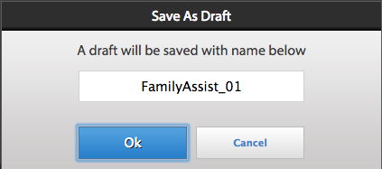

# 할 일 목록 작업{#working-with-to-do-lists}

할 일 목록을 볼 때 자신에게 할당되거나 자신이 속한 모든 그룹 또는 다른 사용자의 공유 작업인 비즈니스 프로세스의 작업이 표시될 수 있습니다. 요청을 승인 또는 거부하거나 추가 정보를 추가하는 등 필요에 따라 작업을 열고, 작업하고, 완료할 수 있습니다. 작업을 완료하면 비즈니스 프로세스의 다음 사용자에게 전송됩니다.

## 할 일 목록 {#about-todo-lists}

AEM Forms 작업 공간에는 다음과 같은 세 가지 유형의 할 일 목록이 있습니다.

* 사용자에게 직접 할당된 작업이 포함된 개별 목록.
* 그룹에 할당된 작업이 포함된 그룹 목록. 그룹의 모든 구성원이 작업을 열고 완료할 수 있습니다. 작업을 열려면 먼저 그룹 구성원이 작업을 요청해야 합니다.
* 사용자 및 다른 사용자와 할 일 목록을 공유한 사용자에게 할당된 작업이 포함된 공유 목록. 목록을 공유하는 모든 사용자는 공유 작업을 요청, 열기 및 완료할 수 있습니다.

작업 위로 포인터를 가져가면 나타나는 아이콘을 클릭하여 작업을 열지 않고도 일부 작업을 수행할 수 있습니다.

>[!NOTE]
>
>느낌표 아이콘은 작업의 우선 순위가 높음을 나타냅니다.

## 일반 작업 {#typical-tasks}

작업을 열고 작업할 때 사용할 수 있는 도구는 작업에 따라 다릅니다. 서로 다른 작업에서는 서로 다른 작업을 수행해야 하며, 이러한 이유로 일부 도구를 사용할 수도 있고 사용하지 못할 수도 있습니다. 다음은 받을 수 있는 일반적인 작업입니다.

* **정보 제공**: 양식을 작성하고 제출해야 하는 작업이 수신됩니다.

* **정보 검토**: 정보를 검토하고 콘텐츠를 승인해야 하는 작업을 받습니다.

* **다중 사용자 검토**: 다른 사용자가 작업을 받을 때 동시에 작업을 받게 됩니다. 귀하와 다른 사용자는 정보를 제공하거나 콘텐츠를 검토하거나 둘 다 제공해야 합니다. 이 유형의 작업에서는 다음 도구를 사용할 수 있습니다.

   * 작업에 대한 지침 보기
   * 작업이 할당된 모든 사용자의 완료 상태 보기
   * 작업을 할당받은 모든 사용자의 주석 보기
   * 작업에 주석 직접 추가

위의 작업 중 하나에서 사용할 수 있는 추가 도구는 다음과 같습니다.

* 앞으로
* 공유
* 참조
* 반환
* 메모
* 첨부

## 작업 열기 {#opening-tasks}

할 일 목록에서 작업을 열고 잠그거나 그룹 또는 공유 할 일 목록에서 작업을 요청하고 열 수 있습니다. 작업을 열면 기본 창에 표시됩니다. 다른 작업은 할 일 목록 옆에 있는 작업 목록에 표시됩니다.

작업 요약 URL이 있는 경우 작업과 연결된 양식 대신 기본적으로 작업 요약 보기가 열립니다. 사용자가 작업 할당에서 &#39;최대화 모드에서 양식 열기&#39; 옵션을 활성화해도 양식이 최대화 모드에서 열리지 않습니다.

>[!NOTE]
>
>작업을 열 때 작업 기본값에 따라 관련 양식이 전체 보기로 표시될 수 있습니다.

### 목록에서 작업 열기 및 잠금 {#open-and-lock-a-task-from-your-list}

할 일 목록에서 작업을 열 때 목록이 공유되면 해당 목록에 대한 액세스 권한이 있는 다른 사용자가 작업을 수행하지 못하도록 작업을 잠글 수 있습니다.

1. 할 일 페이지의 왼쪽 창에서 개별 할 일 목록을 선택합니다. 모든 작업이 가운데 창에 표시됩니다.

   >[!NOTE]
   >
   >할 일 목록에서 프로세스 유형을 선택하여 작업을 필터링할 수 있습니다. 할 일 목록을 선택하여 할 일 목록의 모든 작업을 다시 볼 수 있습니다.

1. 필요한 경우 작업을 잠급니다. 작업을 잠그려면 해당 작업에서 모든 옵션 아이콘을 누르고 잠금을 선택합니다. 작업 위에 포인터를 가져가 옵션을 사용할 수 있습니다.

   >[!NOTE]
   >
   >작업이 열려 있는 경우 탭에서 작업을 잠그거나 잠금 해제할 수도 있습니다.

   

   작업의 모든 옵션 메뉴

1. 작업을 클릭하여 엽니다.

### 공유 또는 그룹 목록에서 작업 열기 및 청구 {#open-and-claim-a-task-from-a-shared-or-group-list}

그룹 또는 공유 목록에서 작업을 열고 요청하면 작업이 그룹 또는 공유 목록에서 개인 할 일 목록으로 이동됩니다. 목록에 액세스할 수 있는 다른 사용자는 해당 작업에서 작업할 수 없습니다.

1. 할 일 페이지의 왼쪽 창에서 그룹 또는 공유 할 일 목록을 선택합니다. 모든 작업이 가운데 창에 표시됩니다.
1. 다음 단계 중 하나를 수행합니다.

   * 작업을 열지 않고 그룹 또는 공유 할 일 목록에서 작업을 요청하려면  **클레임** 마우스를 작업 위로 가져가면 됩니다. 또는 작업이 열려 있으면 작업창 아래의 작업 표시줄에서 클레임 버튼을 사용할 수 있습니다. 청구 시 작업이 그룹 또는 공유 할 일 목록에서 목록으로 이동합니다.
   * 그룹 또는 공유 할 일 목록에서 작업을 요청하고 열려면 다음을 클릭하십시오. **클레임 및 열기**.

## 작업 {#working-with-tasks}

작업을 열면 기본 창에 표시되는 탭과 사용할 수 있는 도구가 작업에 따라 다릅니다. 표시되는 탭은 아래에 설명되어 있습니다.

* **작업 요약**: 작업이 열리면 작업 요약 창에서 작업 할당 단계의 프로세스에 지정된 URL을 사용하여 작업에 대한 정보(있는 경우)를 표시할 수 있습니다. 작업 요약 창을 사용하면 작업에 대한 추가 정보 및 관련 정보를 표시하여 AEM Forms 작업 영역의 최종 사용자에게 더 많은 값을 추가할 수 있습니다. 작업 요약 URL이 없는 경우에는 이 탭을 사용할 수 없습니다.

* **세부 사항**: 현재 작업 및 해당 작업이 속한 프로세스에 대한 일부 정보를 제공합니다.

* **양식**: 작업과 연결된 양식을 표시합니다. 양식은 PDF, HTML, 안내서 및 SWF 파일을 비롯한 다양한 파일 유형일 수 있습니다. 폼은 일반 인쇄 가능 폼이나 웹 기반 폼처럼 보이거나 일련의 마법사 스타일 패널을 안내하여 정보를 수집할 수 있습니다.

* **기록**: 프로세스 인스턴스의 일부인 작업과 각 작업에 대한 관련 양식, 작업 할당 및 첨부 파일을 나열합니다.

* **첨부 파일**: 작업과 연결된 기존 첨부 파일을 표시하고 필요한 경우 첨부 파일을 추가합니다.

* **메모**: 작업과 연결된 기존 메모를 표시하고 필요한 경우 메모를 추가합니다.

작업을 수행할 때 볼 수 있는 도구와 수행할 수 있는 작업은 아래에 설명되어 있습니다.

### 작업 전달, 공유 또는 컨설팅 {#forward-share-or-consult-on-a-task}

메모 또는 첨부 파일과 함께 작업을 다른 사용자에게 전달하거나 작업을 공유하거나 다른 사용자와 작업을 참조할 수 있습니다. 작업과 연결된 양식 데이터를 변경하는 경우 작업을 전달, 공유 또는 참조하기 전에 양식을 초안으로 저장하십시오. 그렇지 않으면 업데이트된 양식 없이 작업이 전송됩니다. 작업을 전달하고 공유한 후 해당 작업을 받은 사용자가 요청하여 완료하거나 사용자에게 반환할 수 있습니다. 작업을 참조하는 경우 사용자는 해당 작업을 귀하에게만 반환할 수 있습니다.

1. 유지하려는 작업과 연결된 양식을 변경하는 경우 **저장**. 저장 옵션은 각 탭의 맨 아래에 있는 작업 표시줄에서 사용할 수 있습니다. 그렇지 않으면 업데이트된 양식 없이 작업이 전송됩니다.

   >[!NOTE]
   >
   >작업 중인 작업에 따라 일부 양식에서는 저장 단추를 사용할 수 없습니다.

1. 탭에서 다음 단추 중 하나를 클릭합니다.

   * **앞으로**
   * **공유**
   * **참조**

   >[!NOTE]
   >
   >작업에 따라 작업을 열지 않고도 할 일 목록에서 이러한 작업을 수행할 수도 있습니다.

1. 팝업 대화 상자 창에서 작업을 전달, 공유 또는 참조할 사용자의 이름을 검색하여 선택합니다.

### 작업 반환 {#return-a-task}

1. 탭에서 **반환**. 작업은 이전에 작업을 귀하에게 전달했거나, 작업을 귀하와 공유 또는 참조한 사용자의 할 일 목록으로 반환됩니다.

### 작업을 오프라인으로 전환 {#take-a-task-offline}

오프라인으로 작업에 대한 작업을 허용하고 나중에 Adobe® Reader® 또는 Adobe® Acrobat® Professional 또는 Adobe® Acrobat® Standard에서 해당 양식을 제출할 수 있습니다. 양식이 제출되면 이메일 클라이언트는 적절한 서버 이메일 주소로 시작됩니다. 그런 다음 완성된 양식을 서버에 이메일로 보낼 수 있습니다.

1. 탭에서 **오프라인**.
1. 아래에 양식을 저장할 파일 이름을 지정하고 **저장**. 작업과 연결된 양식은 로컬에 저장되고 양식이 제출될 때까지 작업은 할 일 목록에 남아 있습니다.

### 첨부 파일 작업 {#work-with-attachments}

로컬에서 첨부 파일을 추가, 업데이트, 삭제 또는 저장할 수 있습니다.

**첨부 파일 추가**

1. 다음에서 **첨부 파일** 탭, 클릭 **찾아보기** 첨부할 파일을 선택합니다.
1. 다음 항목 선택 **권한** 프로세스에 참여하는 다른 사용자의 첨부 파일 레벨. 다음을 선택하는 경우 **읽기**&#x200B;를 사용하여 다른 사용자가 로컬에 파일을 저장할 수 있습니다. 편집 권한 중 하나를 선택하면 다른 사용자가 새 파일을 업로드하여 첨부 파일을 바꿀 수도 있습니다.

   >[!NOTE]
   >
   >첨부 파일과 함께 주석을 추가할 수도 있습니다.

1. **업로드**&#x200B;를 클릭합니다. 파일이 양식에 첨부됩니다.

**첨부 파일 보기**

1. 다음에서 **첨부 파일** 탭에서 보려는 첨부 파일의 이름을 클릭합니다.

**로컬에 첨부 파일 저장**

1. 첨부 파일을 클릭하여 엽니다. 열린 첨부 파일을 로컬에 저장합니다.

**첨부 파일 업데이트**

1. 클릭 **편집** 첨부 파일용입니다. 을 클릭하여 기존 첨부 파일을 바꿀 파일을 선택합니다. **찾아보기**.

**첨부 파일 삭제**

1. 클릭 **삭제** 첨부 파일용입니다.

### 작업을 완료하지 않고 작업 저장 {#save-your-work-without-completing-the-task}

1. 탭에서 을 선택합니다. **저장**.

   초안으로 저장 대화 상자가 나타납니다. 초안의 기본 이름은 작업 템플릿의 작업 이름입니다.

   

   >[!NOTE]
   >
   >사용자가 입력한 정보를 정기적으로 초안으로 자동 저장하도록 작업공간을 구성할 수 있습니다. 자동 저장이 활성화되어 있고 사용자가 초안에서 작업 중인 경우, 초안이 주기적으로 저장됩니다. 자동 저장이 있는 경우 작업의 기본 이름이 자동으로 사용됩니다.
   >
   >
   >자세한 내용은 의 주기적으로 초안 저장 을 참조하십시오. [환경 설정 관리](/help/forms/using/getting-started-livecycle-html-workspace.md).

1. 초안으로 저장 대화 상자에서 작업의 고유한 이름을 지정하고 을 선택합니다 **확인**.

   

   초안이 지정된 이름으로 저장됩니다. 작업은 할 일 목록에 남아 있으며 양식에서 변경한 모든 내용은 초안 폴더에 저장됩니다. 또한 할 일 목록에서 초안 이름을 사용하여 초안을 검색하여 작업을 재개할 수 있습니다.

   

## 작업 완료 중 {#completing-tasks}

작업 완료 방법은 작업 자체와 프로세스 내 역할에 따라 다릅니다. 요청을 승인 또는 거부하거나, 콘텐츠를 제공하거나, 정보를 검토 및 확인하거나, 행동을 표시하라는 메시지가 표시될 수 있습니다.

다음과 같은 다양한 방법으로 작업을 완료할 수 있습니다.

* 탭에서 사용할 수 있는 작업 사용
* 양식 자체에 빌드된 작업 사용
* 할 일 목록에서 작업을 열지 않고

>[!NOTE]
>
>이 옵션은 다음과 같은 경우에 사용할 수 있습니다. `isMustOpenToComplete` 다음에서 필드가 선택되지 않았습니다. `Assign Task` 프로세스를 디자인하는 동안 Workbench에서 단계를 수행합니다.

* 이메일 알림 수신 시

작업을 완료하면 작업에 따라 작업을 다시 확인하는 확인 대화 상자가 나타날 수 있습니다. 예를 들어 제공한 정보의 유효성을 검사하라는 대화 상자가 표시될 수 있습니다.

>[!NOTE]
>
>작업을 변경했지만 완료할 준비가 되지 않은 경우 저장 을 클릭하여 작업을 초안으로 저장하고 나중에 해당 작업으로 돌아갈 수 있습니다.

### 작업 완료 {#complete-a-task}

1. 다음 단계 중 하나를 수행합니다.

   * 작업을 선택하고 목록 하단의 프로세스에 필요한 다음 단계에 해당하는 버튼을 클릭합니다.
   * 양식에 버튼이 없고 AEM Forms 작업 공간의 완료 버튼을 사용할 수 있는 경우 **완료**.
   * 양식에 버튼이 있고 AEM Forms 작업 공간의 완료 버튼을 사용할 수 없는 경우, 양식에서 프로세스에 필요한 다음 단계를 위한 적절한 버튼을 클릭합니다.

   양식에 버튼이 없고 AEM Forms 작업 공간의 완료 버튼을 사용할 수 없는 경우 양식을 제출할 수 없음을 나타내는 메시지가 표시됩니다.

1. 확인 대화 상자가 나타나면 다음 작업 중 하나를 수행합니다.

   * 클릭 **확인** 작업을 완료하고 승인할 준비가 되면
   * 클릭 **취소** 작업으로 돌아가려고 하는데 해당 작업을 승인할 준비가 되지 않은 경우.

>[!NOTE]
>
>양식에서 프로세스 속성을 사용하면 HTML 양식 내에 제출 단추가 표시될 수 있습니다. 동일한 양식을 PDF으로 렌더링할 때는 이 단추가 표시되지 않습니다. 작업을 완료하려면 양식 외부에 있는 AEM Forms 작업 영역 하단의 제출 단추를 클릭하고 양식 내부의 제출 단추에는 사용할 수 없습니다.

### 일괄 승인 작업 {#bulk-approve-tasks}

할 일 목록에서 여러 작업을 제출할 수 있습니다. 작업 이름과 경로 옵션이 같은 동일한 프로세스의 작업만 함께 제출할 수 있습니다.

>[!NOTE]
>
>이 옵션은 프로세스를 디자인하는 동안 Workbench의 작업 할당 단계에서 isMustOpenToComplete 필드를 선택하지 않은 경우 사용할 수 있습니다.

1. 할 일 페이지의 왼쪽 창에서 개별 할 일 목록을 선택합니다. 모든 작업이 가운데 창에 표시됩니다.
1. 선택 **벌크 모드 활성화**. 목록의 작업 앞에 확인란이 나타납니다.

   >[!NOTE]
   >
   >프로세스를 디자인하는 동안 Workbench의 작업 할당 단계에서 isMustOpenToComplete 필드를 선택한 작업에는 이 옵션을 사용할 수 없습니다. 할 일 목록에서 이러한 작업의 확인란은 항상 비활성화 상태로 유지됩니다.

1. 일괄 승인할 작업을 선택하십시오. 작업 이름과 경로가 동일한 동일한 동일한 프로세스의 여러 작업을 선택할 수 있습니다. 승인을 위해 하나의 작업을 선택하면 프로세스가 같고 작업 이름이 같고 경로 옵션이 같은 작업만 활성화됩니다. 나머지는 사용할 수 없습니다.

   

1. 사용 가능한 제출 옵션을 클릭합니다. 선택한 작업이 제출됩니다.

   

## 이메일을 통해 작업에 참여 {#participating-in-tasks-through-email}

이메일을 통해 작업을 수신하고 완료할 수 있습니다. 이메일을 통해 작업에 참여하면 일상적으로 해야 할 일 목록에서 새 작업을 확인하거나 추적 페이지에서 작업 상태를 확인할 필요가 없습니다.

먼저 이메일 알림을 받으려면 AEM Forms 작업 공간 환경 설정을 지정합니다. AEM Forms 작업 영역에서는 할 일 목록 또는 속해 있는 모든 그룹의 할 일 목록에서 작업에 대한 이메일 알림을 보낼 수 있습니다. 관리자는 전자 메일 알림 메시지를 보낼 시점과 받는 사람을 결정합니다.

이메일 메시지에는 AEM Forms 작업 공간에서 작업을 여는 링크, 작업에 사용되는 양식의 첨부 파일 또는 이메일을 통해 작업을 완료하는 작업이 포함될 수 있습니다. 전자 메일 메시지에 양식이 포함된 경우 양식을 열고 작업을 완료하기 위한 단추가 양식에 빌드되어 있으면 작업을 완료할 수 있습니다. 작업을 완료하기 위한 작업이 전자 메일 메시지에 포함되어 있는 경우 전자 메일의 작업을 클릭하거나 전자 메일 본문의 첫 번째 줄로 입력한 작업을 전자 메일에 회신하여 작업을 완료할 수 있습니다.

>[!NOTE]
>
>* 적절한 이메일 템플릿을 사용하도록 작업 영역을 구성하려면 다음을 참조하십시오. [AEM Forms JEE 관리자 안내서](https://help.adobe.com/en_US/AEMForms/6.1/AdminHelp/).
>
>* AEM Forms 작업 영역에서 작업을 제출한 후 초안이 전달되면 이메일 알림이 전송됩니다. AEM Forms 작업 영역의 시작 지점에서 초안이 전달되는 경우 이메일 알림이 전송되지 않습니다.

이메일을 통해 작업을 완료하면 AEM Forms 작업 공간의 할 일 목록에서 작업이 제거됩니다.

>[!NOTE]
>
>사용자가 브라우저에서 AEM Forms 작업 영역에 로그인하지 않은 상태에서 할 일 작업에 대한 링크를 여는 경우, 직접 할 일 링크가 열리지 못하고 예외를 표시합니다. 이메일의 링크를 클릭하기 전에 AEM Forms 작업 영역에 로그인합니다.

>[!NOTE]
>
>다른 사용자에게 작업을 할당하기 위해 이메일 알림을 전달할 수 없습니다. AEM Forms 작업 영역 내에서만 작업을 다른 사용자에게 전달할 수 있습니다.

### 이메일 알림 메시지 수신 {#receive-email-notification-messages}

1. 클릭 **환경 설정**.
1. 다음에서 **이메일로 작업 이벤트 알림** 목록, 선택 **예**.
1. 전자 메일 메시지에 양식 및 데이터를 포함시키려면 **이메일에 Forms 첨부** 목록, 선택 **예**.

## 모바일 장치를 통해 작업에 참여 {#participating-in-tasks-through-mobile-devices}

AEM Forms 작업 영역 앱을 사용하여 모바일 장치에서 작업에 참여할 수 있습니다. 응용 프로그램을 설치하기 전에 시스템 관리자에게 문의하여 조직에서 AEM Forms 작업 공간 앱 사용을 지원하는지 확인하십시오.

## 기한 및 알림 정보 {#about-deadlines-and-reminders}

A *기한* 은(는) 작업을 완료해야 하는 일자 및 시간을 결정합니다. 기한이 지나면 서버가 프로세스의 다음 단계(다른 사용자의 할 일 목록)로 작업을 라우팅한 다음 기한에 대한 아이콘이 작업에 나타납니다. 프로세스와 연결된 규칙에 관계없이 기한 아이콘이 표시됩니다.

A *알림 메시지* 주의가 필요한 작업을 알려줍니다. 미리 알림은 미리 결정된 시간에 발생하며 사용자가 관련 작업을 완료할 때까지 일정한 간격으로 발생합니다. 미리 알림을 받으면 미리 알림 아이콘이 작업에 나타납니다.

비즈니스 프로세스는 기한 및 알림 메시지의 행동과 타이밍을 결정합니다. 모든 프로세스에 기한과 알림이 있는 것은 아닙니다. 관리자가 기한 및 미리 알림에 대해 이메일 알림을 전송할지 여부를 지정합니다. 이메일 알림을 수신할지 여부에 대한 환경 설정을 지정할 수 있습니다.

## 그룹 및 공유 대기열의 작업 {#working-with-tasks-from-group-and-shared-queues}

사용자에게 할당된 모든 작업이 할 일 목록(큐)에 표시됩니다.

액세스 권한이 있는 모든 그룹 및 공유 할 일 목록도 할 일 페이지의 왼쪽 창에 나타납니다. 액세스 권한이 있는 할 일 목록에서 작업을 완료할 수 있습니다.

그룹 할 일 목록에는 두 명 이상의 구성원이 있을 수 있습니다. 관리자는 조직의 특정 요구 사항에 따라 그룹 할 일 목록을 설정합니다. 그룹 할 일 목록은 유사한 책임을 공유하는 여러 사람 간에 작업을 분배하는 방법을 제공합니다.

예를 들어 팀의 각 멤버는 대출 신청 양식을 처리합니다. 이러한 모든 작업은 그룹의 모든 구성원이 액세스할 수 있는 그룹 할 일 목록으로 전송됩니다. 그룹의 각 멤버는 할 일 목록에서 작업에 액세스할 수 있습니다.

다른 사용자가 할 일 목록을 귀하와 공유하거나 작업을 명시적으로 공유할 때 공유 할 일 목록이 나타납니다. 그런 다음 해당 사용자의 할 일 목록에서 작업을 보고 해당 사용자를 대신하여 완료할 수 있습니다. 예를 들어, 휴가를 사용하는 경우 부재 중 작업을 완료하는 동료와 할 일 목록을 공유하도록 선택할 수 있습니다.

>[!NOTE]
>
>부재 중 설정을 지정하여 부재 중 작업을 다른 사용자에게 전달할 수도 있습니다.

그룹 또는 공유 할 일 목록에서 작업을 수행하려면 먼저 작업을 요청하십시오. 그런 다음 작업을 완료하거나 다른 사용자에게 전달할 때까지 작업의 소유자가 됩니다.

### 공유 큐 {#sharing-queues}

할 일 목록을 다른 사용자와 공유할 수 있으며, 사용자는 할 일 목록에서 새로운 작업을 보고 작업을 대신 수행할 수 있습니다. 할 일 목록을 공유하기 전에 할 일 목록에 작업이 있으면 다른 사용자가 해당 작업을 볼 수 없습니다. 사용자는 할 일 목록에 대한 액세스 권한을 부여한 후 할 일 목록에 도착하는 작업만 보고 요구할 수 있습니다.

사용자가 공유 대기열에서 작업을 보려면 프로세스 디자이너가 사용자 서비스의 작업 액세스 제어 목록(ACL) 탭에서 공유 대기열에 대한 ACL 추가 옵션을 활성화해야 합니다.

>[!NOTE]
>
>부재 중인 경우 전체 할 일 목록을 공유하는 대신 부재 중 설정을 지정하여 부재 중 다른 사용자에게 작업을 전달할 수도 있습니다.

**큐 공유**

1. 다음에서 **큐** 의 탭 **환경 설정** 탭에서 &#39;사용자가 현재 내 큐를 공유 중&#39;에 대한 &#39;+&#39; 아이콘을 클릭합니다.
1. 사용자의 이름을 검색하고 선택합니다.
1. 클릭 **공유** 버튼을 클릭하여 선택한 사용자와 큐를 공유할 수 있습니다.
1. 사용자 이름을 선택하고 **공유**.

   >[!NOTE]
   >
   >다음을 클릭하여 할 일 목록 공유에서 사용자를 제거할 수 있습니다. **X** 아이콘: 사용자가 나열된 행 끝에 있습니다.

### 다른 큐 액세스 {#accessing-other-queues}

다른 사용자의 할 일 목록에 대한 액세스를 요청하여 사용자의 할 일 목록에서 새로운 작업을 보고 요청할 수 있습니다.

다른 사용자의 할 일 목록에 대한 액세스를 요청하면 사용자는 할 일 목록에서 요청을 승인하거나 거부하는 작업을 수신합니다. 사용자가 작업을 완료하면 할 일 목록에 알림이 표시됩니다.

다른 사용자의 할 일 목록에 대한 액세스 권한이 부여된 경우 액세스 권한이 부여되기 전에 사용자의 할 일 목록에 있는 작업을 볼 수 없습니다. 할 일 목록에 대한 액세스 권한이 부여된 후 사용자의 할 일 목록에 도착하는 작업만 볼 수 있습니다.

**다른 대기열에 액세스**

1. 다음에서 **환경 설정** 탭을 열고 **큐** 탭.
1. &#39;액세스 권한이 있는 사용자 대기열&#39;에 대해 &#39;+&#39;를 클릭합니다. 팝업 대화 상자에서 사용자 이름을 검색합니다.
1. 사용자 이름을 선택하고 **요청**.

   >[!NOTE]
   >
   >내가 액세스 권한이 있는 사용자 대기열에서 사용자 이름을 선택하고 을 클릭하여 다른 할 일 목록에 대한 액세스 권한을 제거할 수 있습니다. **X** 행의 끝에 사용자의 이름이 언급됩니다. 할 일 목록에 대한 액세스 요청이 아직 보류 중일 때는 다른 할 일 목록에 대한 액세스 권한을 제거할 수 없습니다.

## 부재 중 환경 설정 지정 {#setting-out-of-office-preferences}

부재 예정인 경우 해당 기간 동안 자신에게 할당된 작업이 어떻게 되는지 지정할 수 있습니다.

부재 설정을 적용할 시작 날짜 및 시간, 종료 날짜 및 시간을 지정할 수 있습니다. 서버와 다른 시간대에 있는 경우 사용되는 시간대는 서버의 시간대입니다.

모든 작업을 전송할 기본 사용자를 설정할 수 있습니다. 특정 프로세스의 작업을 다른 사용자에게 보내거나 돌아갈 때까지 할 일 목록에 남아 있도록 예외로 지정할 수도 있습니다. 지정된 사용자도 부재 중일 경우 작업은 지정된 사용자에게 전달됩니다. 부재 중이 아닌 사용자에게 작업을 할당할 수 없는 경우 작업은 할 일 목록에 남아 있습니다.

>[!NOTE]
>
>부재 중일 때는 할 일 목록에 있던 작업이 그대로 남아 다른 사용자에게 전달되지 않습니다.

### 부재 중 환경 설정 지정 {#set-out-of-office-preferences}

1. 클릭 **환경 설정** 및 클릭 **부재 중**.
1. 부재 중 시간을 지정하려면 다음 단계 중 하나를 수행합니다.

   * 현재 무기한 부재 중임을 지정하려면 **나는 현재** 목록, 선택 **부재 중** 그러나 날짜 범위를 추가하지 마십시오.
   * 부재 중 시작 날짜 및 시간을 지정하려면 다음을 클릭하십시오. &#39;+&#39; **부재 중 일정**. 달력 및 시간 목록을 사용하여 시작 날짜와 시간을 지정합니다. 종료 날짜 및 시간을 지정하지 않으면 시작 날짜 및 시간부터 환경 설정을 변경할 때까지 무기한 부재 중으로 간주됩니다.

1. 기본적으로 작업을 처리하는 방법을 지정하려면 다음 옵션 중 하나를 선택합니다 **부재 중: 부재 중 작업에 대한 기본 사용자** 목록:

   * 선택 **할당 안 함** 다시 돌아올 때까지 할 일 목록에 작업을 유지합니다.
   * 선택 **사용자 찾기** 작업을 할당할 사용자를 검색합니다. 사용자를 선택하면 사용자의 부재 중 일정을 볼 수도 있습니다.

1. 예외를 기본값으로 설정하려면 다음을 위해 +를 클릭합니다. **프로세스 예외**&#x200B;을 클릭하고 예외를 만들 프로세스를 선택한 다음 다른 사용자를 선택하거나 을(를) 선택합니다 **할당 안 함** 다음에서 **이(가)에게 할당되었습니다.** 목록을 표시합니다.

   >[!NOTE]
   >
   >프로세스 디자이너는 일부 프로세스의 작업이 항상 비공개로 유지되며 다른 사용자에게 전달되지 않도록 지정할 수 있습니다. 이 설정은 사용자가 설정한 모든 설정보다 우선합니다.

1. 환경 설정 설정이 끝나면 **저장**. 현재 부재 중이라는 설정이 표시되면 변경 사항이 즉시 적용됩니다. 그렇지 않으면 지정된 시작 날짜 및 시간에 적용됩니다. 부재 중에 로그인하면 설정을 변경할 때까지 사무실에 있는 것으로 간주되지 않습니다.
