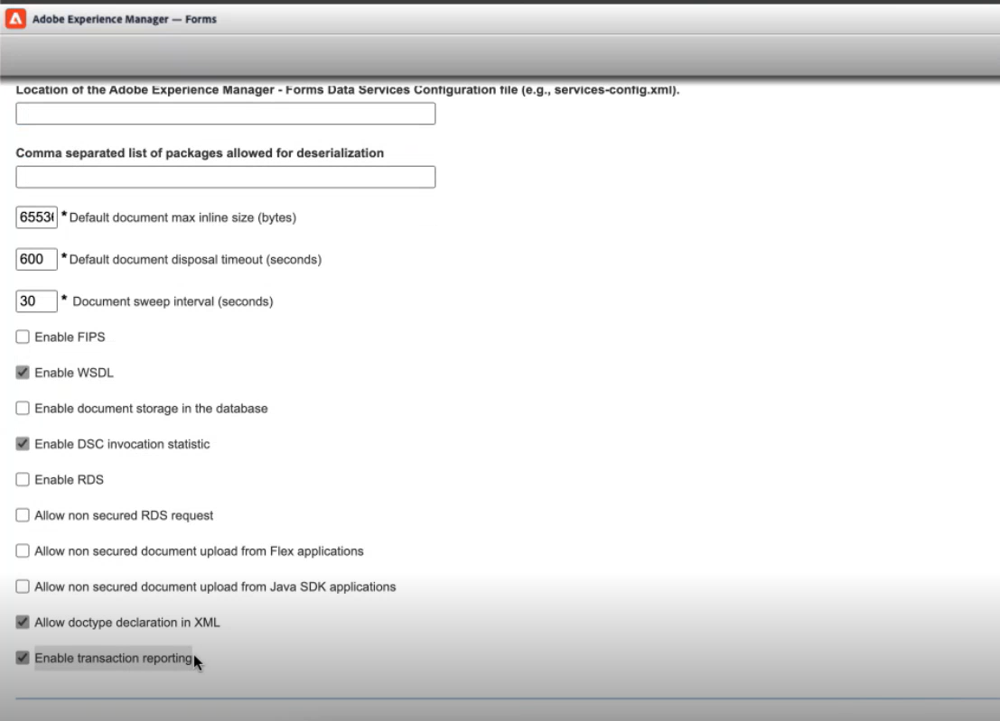

# JEE에서 AEM Forms에 대한 거래 보고서 활성화 및 보기 {#transaction-reports-overview}

<!--Transaction reports in AEM Forms on JEE let you keep a count of all transactions taken place on your AEM Forms deployment. The objective is to provide information about product usage and helps business stakeholders understand their digital processing volumes. Examples of a transaction include:

* Submission of a document
* Rendition of a document
* Conversion of a document from one file format to another 

For more information on what is considered a transaction, see [Billable APIs](../../forms/using/transaction-reports-billable-apis-jee.md). Transaction log helps you to gain information about the number of documents submitted, rendered, and converted.-->

## 거래 보고 활성화 {#enable-transaction-reporting}

기본적으로 트랜잭션 녹화는 비활성화되어 있습니다. 트랜잭션 보고를 사용하려면 다음 단계를 수행합니다.

1. 다음 위치로 이동 `/adminui` JEE의 AEM Forms에서 예를 들면 다음과 같습니다. `http://10.14.18.10:8080/adminui`.
1. 다음으로 로그인 **관리자**.
1. 다음으로 이동 **설정** > **핵심 시스템 설정** > **구성**.
1. 다음 확인란을 클릭합니다. **거래 보고 활성화** 및 **저장** 설정.

   

1. 서버를 다시 시작합니다.
1. 서버의 변경 사항 외에 클라이언트 측에서 를 업데이트해야 합니다. `adobe-livecycle-client.jar` 동일한 파일을 사용하는 경우 프로젝트에 있는 파일입니다.

<!--
* You can [enable transaction recording](../../forms/using/viewing-and-understanding-transaction-reports.md#setting-up-transaction-reports) from AEM Web Console. view transaction reports on author, processing, or publish instances. View transaction reports on author or processing instances for an aggregated sum of all transactions. View transaction reports on the publish instances for a count of all transactions that take place only on that publish instance from where the report is run.
-->

<!--Do not author content (Create adaptive forms, interactive communication, themes, and other authoring activities) and process documents (Use workflows, document services, and other processing activities) on the same AEM instance. Keep the transaction recording disabled for AEM Forms servers used to author content. Keep the transaction recording enabled for AEM Forms servers used to process documents.-->

## 트랜잭션 보고서 보기 {#view-transaction-report}

거래 보고를 사용하면 다음을 통해 거래 횟수에 대한 정보에 액세스할 수 있습니다 [대시보드를 통한 거래 보고서](#transaction-report-dashboard) 및 세부 정보 [로그 파일을 통한 트랜잭션 보고서](#transaction-report-logfile). 두 가지 모두 아래에 설명되어 있습니다.

### 대시보드를 통한 거래 보고서 {#transaction-report-dashboard}

대시보드를 통한 트랜잭션 보고서는 각 트랜잭션 유형에 대한 총 트랜잭션 수를 제공합니다. 예를 들어 이미지에 표시된 대로 렌더링, 변환 및 제출된 총 양식 수에 대한 정보를 얻을 수 있습니다. 거래 보고서를 가져오려면

1. 다음 위치로 이동 `/adminui` JEE의 AEM Forms에서 예를 들면 다음과 같습니다. `http://10.13.15.08:8080/adminui`.
1. 다음으로 로그인 **관리자**.
1. 상태 모니터를 클릭합니다.
1. 다음으로 이동 **거래 리포터** 탭을 클릭하고 **총 트랜잭션 계산**, 이제 파이 차트가 제출, 렌더링 또는 변환된 PDF forms의 수를 나타냅니다.


### 로그 파일을 통한 트랜잭션 보고서 {#transaction-report-logfile}

로그 파일을 통한 트랜잭션 보고서는 각 트랜잭션에 대한 자세한 정보를 제공합니다. 트랜잭션 로그에 액세스하려면 서버 시작과 관련된 컨텍스트 경로를 따르십시오. 트랜잭션은 별도의 로그 파일에 캡처됩니다 `transaction_log.log` 기본적으로. 다음 **파일 경로** 서버 시작 컨텍스트를 기준으로 합니다. 다른 서버의 기본 경로는 아래에 나와 있습니다.

```
For Jboss Turnkey:
"<AEM_Forms_Installation>/jboss/bin/transaction_log.log"

For IBM Websphere: 
"<IBM_WAS_Profile_path>/transaction_log.log"

For Oracle Weblogic:
"<Weblogic_Domain_path>/transaction_log.log"

For Jboss Cluster:
"<Jboss home>/transaction_log.log"
```

샘플 트랜잭션 레코드의 예:
`[2024-02-28 06:11:27] [INFO] TransactionRecord{service='GeneratePDFService', operation='HtmlFileToPDF', internalService='GeneratePDFService', internalOperation='HtmlFileToPDF', transactionOperationType='CONVERT', transactionCount=1, elapsedTime=1906, transactionDate=Wed Feb 28 06:11:25 UTC 2024}`

#### 거래 기록 {#transaction-record-structure-jee}

트랜잭션 로그 구조는 서비스, 작업, 트랜잭션 유형 등과 같은 다양한 매개 변수를 통해 각 트랜잭션이 기록되는 방식을 정의합니다. 각각의 내용은 아래에 자세히 설명되어 있습니다. 거래 기록의 구조는 다음과 같습니다.

```
TransactionRecord
{
    service='...', 
    operation='...', 
    internalService='...', 
    internalOperation='...', 
    transactionOperationType='...', 
    transactionCount=..., 
    elapsedTime=..., 
    transactionDate=...
}
```

* **서비스**: 서비스 이름입니다.
* **작업**: 작업 이름입니다.
* **internalService**: 내부 호출이 있는 경우 피호출자의 이름입니다. 그렇지 않으면 서비스 이름과 동일합니다.
* **internalOperation**: 내부 호출이 있는 경우 호출자의 이름입니다. 그렇지 않으면 작업 이름과 동일합니다.
* **transactionOperationType**: 거래 유형(제출, 렌더링, 변환)
* **transactionCount**: 총 거래 수.
* **elapsedTime**: 호출 시작과 응답을 받은 시간 사이의 시간입니다.
* **transactionDate**: 서비스가 호출된 시기를 나타내는 타임스탬프입니다.

**샘플 트랜잭션 로그**:

```
[2024-02-14 14:23:25] [INFO] TransactionRecord
{
    service='BarcodedFormsService', 
    operation='decode', 
    internalService='BarcodedFormsService', 
    internalOperation='decode', 
    transactionOperationType='CONVERT', 
    transactionCount=1, 
    elapsedTime=47405, 
    transactionDate=Wed Feb 14 14:22:37 UTC 2024
}
```

## 트랜잭션 기록 빈도 {#transaction-recording-frequency}

<!--Transaction persistence involves updating the total transaction count for SUBMIT, CONVERT, and RENDER operations on the server periodically: -->

트랜잭션 기록 빈도는 제출, 렌더링 또는 변환된 각 폼에 대한 서버의 업데이트 작업에 의해 결정됩니다.

* 위치 **대시보드**, 트랜잭션 수는 정기적으로 업데이트되며, 기본값은 1분으로 설정됩니다. 다음 위치에 시스템 속성을 설정하여 빈도를 업데이트할 수 있습니다. `"com.adobe.idp.dsc.transaction.recordFrequency"`. 예를 들어, JBoss®의 AEM Forms for JEE에서 을 추가합니다. `-Dcom.adobe.idp.dsc.transaction.recordFrequency=5` 위치: `JAVA_OPTS` 업데이트 빈도를 5분으로 설정합니다.

* 위치 **트랜잭션 로그**, 각 트랜잭션에 대한 업데이트는 양식이 성공적으로 제출, 렌더링 또는 변환될 때 즉시 발생합니다.

<!-- A transaction remains in the buffer for a specified period (Flush Buffer time + Reverse replication time). By default, it takes approximately 90 seconds for the transaction count to reflect in the transaction report.

Actions like submitting a PDF Form, using Agent UI to preview an interactive communication, or using non-standard form submission methods are not accounted as transactions. AEM Forms provides an API to record such transactions. Call the API from your custom implementations to record a transaction.

## Supported Topology {#supported-topology}

Transaction reports are available only on AEM Forms on OSGi environment. It supports author-publish, author-processing-publish, and only processing topologies. For example, topologies, see [Architecture and deployment topologies for AEM Forms](../../forms/using/transaction-reports-overview.md).

The transaction count is reverse replicated from publish instances to author or processing instances. An indicative author-publish topology is displayed below:


>[!NOTE]
>
>AEM Forms transaction reports does not support topologies that contain only publish instances.

### Guidelines for using transaction reports {#guidelines-for-using-transaction-reports}

* Disable transaction reports on all author instances as reports on author instances includes transactions registered during authoring activities.
* Enable the **Show transactions from publish only** option on the author instance to view cumulative transactions from all publish instances. You can also view transaction reports on each publish instance for actual transactions on that particular publish instance only.
* Do not use author instances to run workflows and process documents.
* Before using transaction reporting, if you are have a toplogy with publish servers, ensure that the reverse replication is enabled for all the publish instances.
* Transaction data is reverse-replicated from a publish instance to only corresponding author or processing instance. The author or processing instance cannot further replicate data to another instance. For example, if you have author-processing-publish topology, aggregated transaction data is replicated only to the processing instance.-->

## 관련 문서 {#related-articles}

* [JEE의 AEM Forms에 대한 청구 가능 API 목록](../../forms/using/transaction-reports-billable-apis-jee.md)
* [JEE의 AEM Forms에 대한 사용자 지정 구성 요소 API에 대한 트랜잭션을 기록합니다](/help/forms/using/record-transaction-custom-component-jee.md)
