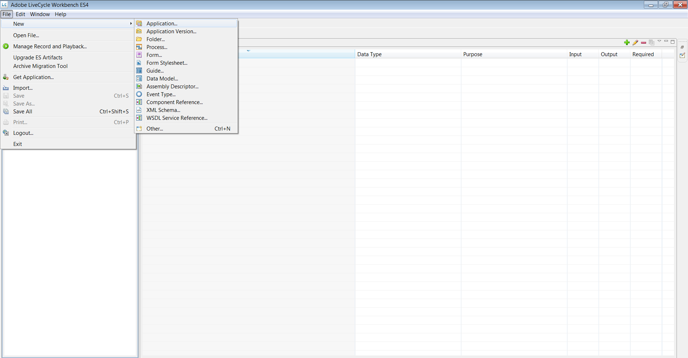

# HTML 작업 영역에서 적응형 양식 사용{#using-an-adaptive-form-in-html-workspace}

JEE의 AEM Forms는 HTML 작업 영역에서 적응형 양식을 사용하는 기능을 제공합니다.

프로세스 디자인 중에 XDP를 선택할 수 있으므로 기존 적응형 양식 AEM 저장소에서 검색할 수 있는 기능이 추가되었습니다. 이 기능을 통해 프로세스 디자이너는 시작 지점과 작업에서 적응형 양식을 구성할 수 있습니다.

## 프로세스 디자인 경험 {#process-design-experience}

적응형 양식을 프로세스 디자인에서 사용할 수 있도록 하려면 다음을 수행합니다.

* 작업 지정 및 시작점의 경우 작업에 양식 자산을 할당할 때 CRX 저장소에서 적응형 양식 자산으로 이동할 수 있습니다.
* 작업/시작 지점 워크벤치 지정 속성 시트에서 응용 양식의 최상위/전역 도구 모음을 숨길 수 있습니다.
* 적응형 양식의 렌더링 및 제출 작업에 새 작업 프로필을 사용할 수 있습니다.

### LiveCycle 애플리케이션 내보내기 및 가져오기 {#livecycle-application-export-and-import}

적응형 양식은 AEM 저장소에 있으므로 LiveCycle 애플리케이션 내보내기에는 사용된 적응형 양식에 대한 참조만 포함되어 있습니다. 따라서 LiveCycle 애플리케이션의 내보내기 및 가져오기는 두 단계로 이루어집니다. LiveCycle 애플리케이션에는 프로세스 정의 등이 포함되어 있습니다. 적응형 양식이 포함된 별도의 패키지는 AEM에서 ZIP 파일로 내보내집니다. 가져오는 동안 LiveCycle 응용 프로그램은 Workbench를 통해 가져오며 적응형 양식은 AEM을 통해 가져옵니다.

## HTML 작업 공간에서 적응형 양식의 사용자 경험 {#user-experience-of-adaptive-form-in-html-workspace}

HTML 작업 공간에서는 모바일 양식에 사용할 수 있는 컨트롤 외에도 적응형 양식별 컨트롤을 제공합니다. 사용자는 작업 또는 시작점을 열 때 HTML Workspace에서 첨부 파일을 추가하고, 저장하고, 서명하고, 제출하고, 적응형 양식을 탐색할 수 있습니다. 다음은 자세한 정보입니다.

1. 파일을 첨부하려면 Mobile Forms에서와 마찬가지로 작업 첨부 파일을 사용합니다. 응용 양식의 첨부 파일 유형 단추는 모두 숨겨집니다.

1. 적응형 양식을 저장하려면 모바일 **양식의 경우처럼**&#x200B;저장을 클릭합니다. 응용 양식의 모든 저장 유형 단추는 숨겨집니다.

1. 적응형 양식을 제출하려면 Mobile Forms에서와 **같이** [제출] 단추 또는 사용 가능한 경로 지정 작업을 사용합니다. 적응형 양식의 전송 유형 단추는 숨겨집니다.

1. **적응형 양식 전역 도구 모음 표시**:프로세스 디자이너가 전역/최상위 도구 모음을 숨기는 경우 도구 모음 및 단추가 응용 양식에 표시되지 않습니다.

1. **적응형 양식의 작업 영역 탐색 컨트롤**:HTML 작업 공간에서 응용 양식에 대한 다음/이전 단추를 저장, 제출 및 라우트 작업 단추와 함께 사용할 수 있습니다. HTML 작업 공간에서 다음/이전 단추를 클릭하여 적응형 양식의 패널을 탐색합니다. 다음/이전 단추는 적응형 양식의 모바일 보기에 있는 내비게이션 컨트롤과 유사하게 딥 내비게이션을 제공합니다.

1. **적응형 양식의 eSign 서비스 및 요약 구성 요소**:요약 구성 요소는 HTML 작업 공간에서 작동하지 않습니다. 즉, 적응형 양식에 요약 구성 요소가 있으면 작업 영역에 표시되지 않습니다. Esign 구성 요소의 자동 제출 대신 작업 영역 사용자는 HTML 작업 영역의 제출 또는 라우트 작업을 클릭합니다. 문서에 서명하면 서명된 기본 문서로 표시됩니다. 제출 **또는** 경로 작업을 클릭하여 작업 또는 시작점을 닫거나 완료합니다.\
   서명된 문서는 eSign 서비스 서버에서 수집되며 데이터 xml 파일은 프로세스의 다음 단계로 전달됩니다.

## 프로세스 디자인에서 적응형 양식 사용 절차 {#steps-to-use-adaptive-forms-in-process-design}

1. Adobe Experience Manager Forms Workbench를 엽니다.

1. 파일 > **새로 만들기 > 응용** 프로그램으로 이동하거나 기존 응용 프로그램을 사용하여 응용 프로그램을 만듭니다.

   

   새 응용 프로그램 만들기

1. 프로세스를 만들거나 애플리케이션에서 기존 프로세스를 사용합니다.

   

   새 프로세스 만들기

1. 시작 지점 만들기 또는 작업 할당을 두 번 클릭합니다.
1. 프레젠테이션 **[!UICONTROL 및 데이터]** 섹션에서 CRX 자산 **** 사용을 선택하고 자산 앞 줄임표를 클릭합니다.

   

   CRX 자산 사용

1. 자산 관리 UI를 통해 만든 적응형 양식을 선택하고 확인을 **[!UICONTROL 클릭합니다]**.

   

   적응형 양식 선택

   >[!NOTE]
   >
   >응용 양식 만들기에 대한 자세한 내용은 응용 [양식](../../forms/using/creating-adaptive-form.md)만들기를 참조하십시오.
   >
   >
   >프로세스 만들기에 대한 자세한 내용은 [프로세스](https://help.adobe.com/en_US/AEMForms/6.1/WorkbenchHelp/WS92d06802c76abadb-1cc35bda128261a20dd-7ff7.2.html)만들기 및 관리를 참조하십시오.

