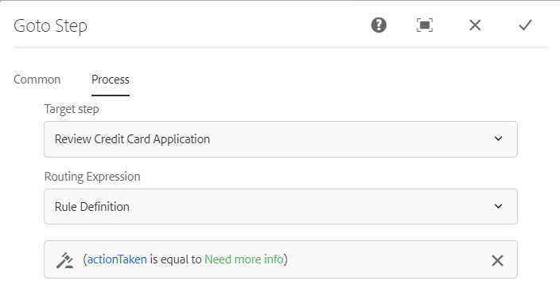

# AEM Forms 워크플로우의 변수{#variables-in-aem-forms-workflows}

| 버전 | 문서 링크 |
| -------- | ---------------------------- |
| AEM as a Cloud Service | [여기 클릭](https://experienceleague.adobe.com/docs/experience-manager-cloud-service/content/forms/create-form-centric-workflows/variable-in-aem-workflows.html) |
| AEM 6.5 | 이 문서 |

워크플로우 모델의 변수는 해당 데이터 유형을 기반으로 값을 저장하는 방법입니다. 그런 다음 모든 워크플로우 단계에서 변수의 이름을 사용하여 변수에 저장된 값을 검색할 수 있습니다. 변수 이름을 사용하여 라우팅 의사 결정을 위한 표현식을 정의할 수도 있습니다.

AEM 워크플로 모델에서 다음을 수행할 수 있습니다.

* [변수 만들기](../../forms/using/variable-in-aem-workflows.md#create-a-variable) 저장하려는 정보 유형을 기반으로 하는 데이터 유형입니다.
* [변수 값 설정](../../forms/using/variable-in-aem-workflows.md#set-a-variable) 변수 설정 워크플로우 단계 사용.
* [변수 사용](../../forms/using/variable-in-aem-workflows.md#use-a-variable) 모든 AEM Forms 워크플로 단계에서 저장된 값을 검색하고 OR 분할 및 이동 단계에서 라우팅 표현식을 정의합니다.

다음 비디오에서는 AEM 워크플로 모델에서 변수를 생성, 설정 및 사용하는 방법을 보여 줍니다.

<!-- FUTURE ERROR: YouTube and mp4 videos are not supported -->

>[!VIDEO](https://helpx.adobe.com/content/dam/help/en/experience-manager/6-5/forms/using/variables_introduction_1_1.mp4)

변수는 기존 의 확장입니다 [메타데이터 맵](https://helpx.adobe.com/experience-manager/6-5/sites/developing/using/reference-materials/javadoc/com/adobe/granite/workflow/metadata/MetaDataMap.html) 인터페이스. 다음을 사용할 수 있습니다. [메타데이터 맵](https://helpx.adobe.com/experience-manager/6-5/sites/developing/using/reference-materials/javadoc/com/adobe/granite/workflow/metadata/MetaDataMap.html) 변수를 사용하여 저장된 메타데이터에 액세스하려면 ECMAScript에서 를 사용하십시오.

## 변수 만들기 {#create-a-variable}

워크플로우 모델의 사이드 킥에서 사용할 수 있는 변수 섹션을 사용하여 변수를 만듭니다. AEM 워크플로우 변수는 다음 데이터 유형을 지원합니다.

* **기본 데이터 유형**: Long, Double, Boolean, Date 및 String
* **복잡한 데이터 유형**: [문서](https://helpx.adobe.com/experience-manager/6-5/forms/javadocs/com/adobe/aemfd/docmanager/Document.html), [XML](https://docs.oracle.com/javase/8/docs/api/org/w3c/dom/Document.html), [JSON](https://static.javadoc.io/com.google.code.gson/gson/2.3/com/google/gson/JsonObject.html)및 양식 데이터 모델 인스턴스가 포함될 수 있습니다.

>[!NOTE]
>
>워크플로우는 날짜 유형 변수에 대해 ISO8601 형식만 지원합니다.

다음을 수행해야 합니다. [AEM Forms 추가 기능 패키지](https://helpx.adobe.com/kr/aem-forms/kb/aem-forms-releases.html) 문서 및 양식 데이터 모델 데이터 유형용.  ArrayList 데이터 유형을 사용하여 변수 컬렉션을 생성합니다. 모든 기본 데이터 형식과 복합 데이터 형식에 대해 ArrayList 변수를 만들 수 있습니다. 예를 들어 ArrayList 변수를 만들고 String을 하위 유형으로 선택하여 변수를 사용하여 여러 문자열 값을 저장합니다.

다음 단계를 실행하여 변수를 생성합니다.

1. AEM 인스턴스에서 도구로 이동합니다  > 워크플로우 > 모델.
1. 선택 **[!UICONTROL 만들기]** 워크플로우 모델의 제목과 선택적 이름을 지정합니다. 모델을 선택한 다음 를 선택합니다. **[!UICONTROL 편집]**.
1. 워크플로우 모델의 사이드 킥에서 사용할 수 있는 변수 아이콘을 선택하고 를 선택합니다. **[!UICONTROL 변수 추가]**.

   

1. 변수 추가 대화 상자에서 이름을 지정하고 변수 유형을 선택합니다.
1. 에서 데이터 유형 선택 **[!UICONTROL 유형]** 드롭다운 목록을 표시하고 다음 값을 지정합니다.

   * 원시 데이터 유형 - 변수에 대한 선택적 기본값을 지정합니다.
   * JSON 또는 XML - 선택적 JSON 또는 XML 스키마 경로를 지정합니다. 시스템은 이 스키마에서 사용할 수 있는 속성을 다른 변수에 매핑하고 저장하는 동안 스키마 경로를 확인합니다.
   * 양식 데이터 모델 - 양식 데이터 모델 경로를 지정합니다.
   * ArrayList - 컬렉션에 대한 하위 유형을 지정합니다.

1. 변수에 대한 선택적 설명을 지정하고 을 선택합니다  변경 내용을 저장합니다. 변수는 왼쪽 창에서 사용할 수 있는 목록에 표시됩니다.

변수를 만들 때 다음 방법을 고려하십시오.

* 워크플로우에 필요한 수만큼 변수를 만듭니다. 그러나 데이터베이스 리소스를 보존하려면 필요한 최소 변수 수를 사용하고 가능한 경우 변수를 재사용합니다.
* 변수는 대/소문자를 구분합니다. 워크플로우에서 동일한 대소문자를 사용하여 변수를 참조하는지 확인합니다.
* 변수 이름에 특수 문자를 사용하지 마십시오

## 변수 설정 {#set-a-variable}

변수 설정 단계를 사용하여 변수의 값을 설정하고 값이 설정되는 순서를 정의할 수 있습니다. 변수는 변수 설정 단계에서 변수 매핑이 나열된 순서로 설정됩니다.

변수 값에 대한 변경은 변경이 발생하는 프로세스의 인스턴스에만 영향을 미칩니다. 예를 들어 워크플로우가 시작되고 변수 데이터가 변경되면 변경 사항은 워크플로우의 해당 인스턴스에만 영향을 줍니다. 변경 사항은 이전에 시작되었거나 이후에 시작된 워크플로우의 다른 인스턴스에는 영향을 주지 않습니다.

변수의 데이터 유형에 따라 다음 옵션을 사용하여 변수의 값을 설정할 수 있습니다.

* **리터럴:** 지정할 정확한 값을 알고 있는 경우 옵션을 사용합니다.

* **표현식:** 사용할 값이 표현식을 기반으로 계산되는 경우 옵션을 사용합니다. 표현식은 제공된 표현식 편집기에서 생성됩니다.

* **JSON 점 표기법:** 옵션을 사용하여 JSON 또는 FDM 유형 변수에서 값을 검색합니다.
* **XPATH:** XML 유형 변수에서 값을 검색하려면 옵션을 사용합니다.

* **페이로드 관련:** 변수에 저장할 값을 페이로드와 관련된 경로에서 사용할 수 있는 경우 옵션을 사용합니다.

* **절대 경로:** 변수에 저장할 값을 절대 경로에서 사용할 수 있는 경우 옵션을 사용합니다.

JSON 점 표기법 또는 XPATH 표기법을 사용하여 JSON 또는 XML 유형 변수의 특정 요소를 업데이트할 수도 있습니다.

### 변수 간 매핑 추가 {#add-mapping-between-variables}

다음 단계를 실행하여 변수 간에 매핑을 추가합니다.

1. 워크플로 편집 페이지에서 워크플로 모델의 사이드 킥에 사용할 수 있는 단계 아이콘을 선택합니다.
1. 을(를) 드래그 앤 드롭합니다 **변수 설정** 워크플로우 편집기로 이동하고 단계를 선택한 다음 를 선택합니다.  (구성).
1. 변수 설정 대화 상자에서 **[!UICONTROL 매핑]** > **[!UICONTROL 매핑 추가]**.
1. 다음에서 **변수 매핑** 섹션에서 데이터를 저장할 변수를 선택하고 매핑 모드를 선택한 다음 변수에 저장할 값을 지정합니다. 매핑 모드는 변수의 유형에 따라 다릅니다.
1. 더 많은 변수를 매핑하여 의미 있는 표현식을 만듭니다. 선택  변경 내용을 저장합니다.

### 예제 1: XML 변수를 쿼리하여 문자열 변수의 값을 설정합니다. {#example-query-an-xml-variable-to-set-value-for-a-string-variable}

XML 파일을 저장할 XML 유형의 변수를 선택합니다. XML 파일에서 사용할 수 있는 속성의 문자열 변수 값을 설정하려면 XML 변수를 쿼리합니다. 사용 **XML 변수에 대한 XPATH 지정** 문자열 변수에 저장할 속성을 정의하는 필드입니다.

이 예에서 **formdata** 을(를) 저장할 XML 변수 **cc-app.xml** 파일. 쿼리 **formdata** 변수에 대한 값을 설정합니다. **이메일 주소** 값을 저장할 문자열 변수 **emailAddress** 에서 사용할 수 있는 속성 **cc-app.xml** 파일.

>[!VIDEO](https://helpx.adobe.com/content/dam/help/en/experience-manager/6-5/forms/using/set_variable_example1.mp4 "변수 값 설정")

### 예제 2: 다른 변수를 기반으로 값을 저장하는 표현식 사용 {#example2}

표현식을 사용하여 변수의 합계를 계산하고 결과를 변수에 저장합니다.

이 예제에서는 표현식 편집기를 사용하여 다음을 합산할 표현식을 정의합니다. **assetscost** 및 **균형 금액** 변수 및 결과 저장 위치 **totalvalue** 변수를 채우는 방법에 따라 페이지를 순서대로 표시합니다.

<!-- FUTURE ERROR: YouTube and mp4 videos are not supported -->

>[!VIDEO](https://helpx.adobe.com/content/dam/help/en/experience-manager/6-5/forms/using/variables_expression.mp4)

## 표현식 편집기 사용 {#use-expression-editor}

또한 표현식을 사용하여 런타임에 변수의 값을 계산합니다. 변수는 표현식을 정의하는 표현식 편집기를 제공합니다.

표현식 편집기를 사용하여 다음을 수행합니다.

* 다른 워크플로우 변수, 숫자 또는 수학 표현식을 사용하여 변수의 값을 설정합니다.
* 수학 표현식 내에서 워크플로우 변수, 문자열, 숫자 또는 표현식 사용
* 변수의 값을 설정하려면 조건을 추가합니다.
* 조건 사이에 연산자를 추가합니다.


다음 변경 사항이 포함된 적응형 양식 규칙 편집기를 기반으로 합니다. 변수의 규칙 편집기:

* 함수를 지원하지 않습니다.
* 규칙 요약을 볼 수 있는 UI를 제공하지 않음
* 코드 편집기가 없습니다.
* 은 객체의 값을 활성화 및 비활성화하는 것을 지원하지 않습니다.
* 은(는) 개체의 속성 설정을 지원하지 않습니다.
* 웹 서비스 호출을 지원하지 않습니다.

자세한 내용은 [적응형 양식 규칙 편집기](../../forms/using/rule-editor.md).

## 변수 사용 {#use-a-variable}

변수를 사용하여 입력 및 출력을 검색하거나 단계 결과를 저장할 수 있습니다. 워크플로 편집기는 두 가지 유형의 워크플로 단계를 제공합니다.

* 변수를 지원하는 워크플로우 단계
* 변수를 지원하지 않는 워크플로우 단계

### 변수를 지원하는 워크플로우 단계 {#workflow-steps-with-support-for-variables}

이동 단계 또는 분할 단계 및 모든 AEM Forms 워크플로 단계는 변수를 지원합니다.

#### OR 분할 단계 {#or-split-step}

OR 분할은 워크플로우에 분할을 만들고 그 후 하나의 분기만 활성화됩니다. 이 단계를 통해 조건부 처리 경로를 워크플로우에 도입할 수 있습니다. 필요에 따라 각 분기에 워크플로 단계를 추가합니다.

규칙 정의, ECMA 스크립트 또는 외부 스크립트를 사용하여 분기에 대한 라우팅 표현식을 정의할 수 있습니다.

변수를 사용하여 표현식 편집기를 사용하여 라우팅 표현식을 정의할 수 있습니다. OR 분할 단계의 라우팅 표현식 사용에 대한 자세한 내용은 [OR 분할 단계](/help/sites-developing/workflows-step-ref.md#or-split).

이 예에서 라우팅 표현식을 정의하기 전에 [예제 2](../../forms/using/variable-in-aem-workflows.md#example2) 에 대한 값을 설정하려면 **totalvalue** 변수를 채우는 방법에 따라 페이지를 순서대로 표시합니다. 의 값이 인 경우 분기 1이 활성 상태입니다. **totalvalue** 변수가 50000보다 큽니다. 마찬가지로 의 값인 경우 분기 2를 활성화하는 규칙을 정의할 수 있습니다. **totalvalue** 변수가 50000 미만입니다.

<!-- FUTURE ERROR: YouTube and mp4 videos are not supported -->

>[!VIDEO](https://helpx.adobe.com/content/dam/help/en/experience-manager/6-5/forms/using/variables_orsplit_example.mp4)

마찬가지로 외부 스크립트 경로를 선택하거나 라우팅 표현식에 대한 ECMA 스크립트를 지정하여 활성 분기를 평가합니다. 선택 **[!UICONTROL 분기 이름 변경]** 을 눌러 분기의 대체 이름을 지정합니다.

자세한 예는 를 참조하십시오. [워크플로우 모델 만들기](../../forms/using/aem-forms-workflow.md#create-a-workflow-model).

#### 단계로 이동 {#go-to-step}

다음 **이동 단계** 라우팅 표현식의 결과에 따라 실행할 워크플로우 모델의 다음 단계를 지정할 수 있습니다.

OR 분할 단계와 마찬가지로 규칙 정의, ECMA 스크립트 또는 외부 스크립트를 사용하여 이동 단계에 대한 라우팅 표현식을 정의할 수 있습니다.

변수를 사용하여 표현식 편집기를 사용하여 라우팅 표현식을 정의할 수 있습니다. 이동 단계의 라우팅 표현식 사용에 대한 자세한 내용은 [이동 단계](/help/sites-developing/workflows-step-ref.md#goto-step).



이 예에서 이동 단계는 다음 단계로 신용 카드 신청 검토 를 지정합니다. **수행한 작업** 변수가 다음과 같음 **추가 정보 필요**.

이동 단계에서 규칙 정의를 사용하는 방법에 대한 자세한 예는 를 참조하십시오. [For 루프 시뮬레이션](/help/sites-developing/workflows-step-ref.md#simulateforloop).

#### Forms 워크플로 중심 워크플로 단계 {#forms-workflow-centric-workflow-steps}

모든 AEM Forms 워크플로 단계는 변수를 지원합니다. 자세한 내용은 [OSGi의 Forms 중심 워크플로우](../../forms/using/aem-forms-workflow-step-reference.md).

### 변수를 지원하지 않는 워크플로우 단계 {#workflow-steps-without-support-for-variables}

다음을 사용할 수 있습니다. [메타데이터 맵](https://helpx.adobe.com/experience-manager/6-5/sites/developing/using/reference-materials/javadoc/com/adobe/granite/workflow/metadata/MetaDataMap.html) 변수를 지원하지 않는 워크플로우 단계의 변수에 액세스하는 인터페이스입니다.

#### 변수 값 검색 {#retrieve-the-variable-value}

ECMA 스크립트에서 다음 API를 사용하여 데이터 유형에 따라 기존 변수의 값을 검색합니다.

| 변수 데이터 유형 | API |
|---|---|
| 기본(Long, Double, Boolean, Date 및 String) | workItem.getWorkflowData().getMetaDataMap().get(variableName, type) |
| 문서 | Packages.com.adobe.aemfd.docmanager.Document doc = workItem.getWorkflowData().getMetaDataMap().get(&quot;docVar&quot;, Packages.com.adobe.aemfd.docmanager.Document.class); |
| XML | Packages.org.w3c.dom.Document xmlObject = workItem.getWorkflowData().getMetaDataMap().get(variableName, Packages.org.w3c.dom.Document.class); |
| 양식 데이터 모델 | Packages.com.adobe.aem.dermis.api.FormDataModelInstance fdmObject = workItem.getWorkflowData().getMetaDataMap().get(variableName, Packages.com.adobe.aem.dermis.api.FormDataModelInstance.class); |
| JSON | Packages.com.google.gson.JsonObject jsonObject = workItem.getWorkflowData().getMetaDataMap().get(variableName, Packages.com.google.gson.JsonObject.class); |

다음을 수행해야 합니다. [AEM Forms 추가 기능 패키지](https://helpx.adobe.com/kr/aem-forms/kb/aem-forms-releases.html) (문서 및 양식 데이터 모델 변수 데이터 유형)

**예**

다음 API를 사용하여 문자열 데이터 유형의 값을 검색합니다.

```javascript
workItem.getWorkflowData().getMetaDataMap().get(accname, Packages.java.lang.String)
```

#### 변수 값 업데이트 {#update-the-variable-value}

ECMA 스크립트에서 다음 API를 사용하여 변수의 값을 업데이트합니다.

```javascript
workItem.getWorkflowData().getMetaDataMap().put(variableName, value)
```

**예**

```javascript
workItem.getWorkflowData().getMetaDataMap().put(salary, 50000)
```

에 대한 값을 업데이트합니다. **급료** 변수를 50000.

### 워크플로우를 호출하는 변수 설정 {#apiinvokeworkflow}

API를 사용하여 변수를 설정하고 전달하여 워크플로우 인스턴스를 호출할 수 있습니다.

[workflowSession.startWorkflow](https://helpx.adobe.com/experience-manager/6-5/sites/developing/using/reference-materials/javadoc/com/adobe/granite/workflow/WorkflowSession.html#startWorkflow-com.adobe.granite.workflow.model.WorkflowModel-com.adobe.granite.workflow.exec.WorkflowData-java.util.Map-) 모델, wfData 및 metaData를 인수로 사용합니다. MetaDataMap을 사용하여 변수에 대한 값을 설정합니다.

이 API에서는 **variableName** 변수가 로 설정되어 있습니다. **값** metaData.put(variableName, value) 사용;

```javascript
import com.adobe.granite.workflow.model.WorkflowModel;
import com.adobe.granite.workflow.metadata.MetaDataMap;
import com.adobe.aemfd.docmanager.Document;

/*Assume that you already have a workflowSession and modelId along with the payloadType and payload*/
WorkflowData wfData = workflowSession.newWorkflowData(payloadType, payload);
MetaDataMap metaData = wfData.getMetaDataMap();
metaData.put(variableName, value); //Create a variable "variableName" in your workflow model
WorkflowModel model = workflowSession.getModel(modelId);
workflowSession.startWorkflow(model, wfData, metaData);
```

**예**

초기화 **문서** 문서 객체를 경로(&quot;a/b/c&quot;)로 변경하고 **docVar** 변수를 문서 개체에 저장된 경로에 추가합니다.

```javascript
import com.adobe.granite.workflow.WorkflowSession;
import com.adobe.granite.workflow.exec.WorkflowData;
import com.adobe.granite.workflow.model.WorkflowModel;
import com.adobe.granite.workflow.metadata.MetaDataMap;
import com.adobe.aemfd.docmanager.Document;

/*This example assumes that you already have a workflowSession and modelId along with the payloadType and payload */
WorkflowData wfData = workflowSession.newWorkflowData(payloadType, payload);
MetaDataMap metaData = wfData.getMetaDataMap();
Document doc = new Document("/a/b/c");// initialize a document object
metaData.put("docVar",doc); //Assuming that you have created a variable "docVar" of type Document in your workflow model
WorkflowModel model = workflowSession.getModel(modelId);
workflowSession.startWorkflow(model, wfData, metaData);
```

### 워크플로우 변수를 사용하여 JCR 외부에 중요한 사용자 데이터 저장 {#jcr-independent-persistance}

Forms Workflow을 사용하여 처리된 데이터에는 개인 식별 정보 및 중요한 개인 정보와 같은 중요한 사용자 데이터가 포함될 수 있습니다. 기업은 JCR 저장소 중 다양한 워크플로우 단계에서 처리(워크플로우 변수를 사용하여 전달)되는 데이터를 외부 데이터 저장소에 저장하도록 선택할 수 있습니다. 외부 스토리지에서 워크플로 데이터를 유지하는 방법에 대한 자세한 내용은 [고객 소유 데이터 스토어에 워크플로 변수 사용](/help/sites-administering/workflows-administering.md#using-workflow-variables-customer-datastore).
[!DNL Adobe Experience Manager] 워크플로우 API 제공 [UserMetaDataPersistenceProvider](https://github.com/adobe/workflow-variable-externalizer) 외부 Azure blob 저장소에 워크플로 변수를 저장합니다. API 사용에 대한 자세한 내용은 을 참조하십시오. [워크플로우 변수를 사용하여 중요한 데이터를 매개 변수화하고 외부 데이터 저장소에 저장](/help/forms/using/aem-forms-workflow.md#externalize-wf-variables).

## 변수 편집 {#edit-a-variable}

1. 워크플로 편집 페이지에서 워크플로 모델의 사이드 킥에 사용할 수 있는 변수 아이콘을 선택합니다. 왼쪽 창의 변수 섹션에는 기존 변수가 모두 표시됩니다.
1. 다음 항목 선택  (편집) 아이콘을 클릭합니다.
1. 변수 정보를 편집하고  변경 내용을 저장합니다. 다음을 편집할 수 없습니다. **[!UICONTROL 이름]** 및 **[!UICONTROL 유형]** 변수에 대한 필드입니다.

## 변수 삭제 {#delete-a-variable}

변수를 삭제하기 전에 워크플로우에서 변수의 모든 참조를 제거합니다. 변수가 워크플로우에서 사용되지 않는지 확인합니다.

다음 단계를 실행하여 변수를 삭제합니다.

1. 워크플로 편집 페이지에서 워크플로 모델의 사이드 킥에 사용할 수 있는 변수 아이콘을 선택합니다. 왼쪽 창의 변수 섹션에는 기존 변수가 모두 표시됩니다.
1. 삭제하려는 변수 이름 옆에 있는 삭제 아이콘을 선택합니다.
1. 선택  을 클릭하여 변수를 확인하고 삭제합니다.

## 참조 {#references}

AEM Forms 워크플로우 단계에서 변수를 사용하는 방법에 대한 자세한 예는 를 참조하십시오. [AEM 워크플로우의 변수](https://helpx.adobe.com/experience-manager/kt/forms/using/authoring_variables_in_aem_forms-workflow1.html).
